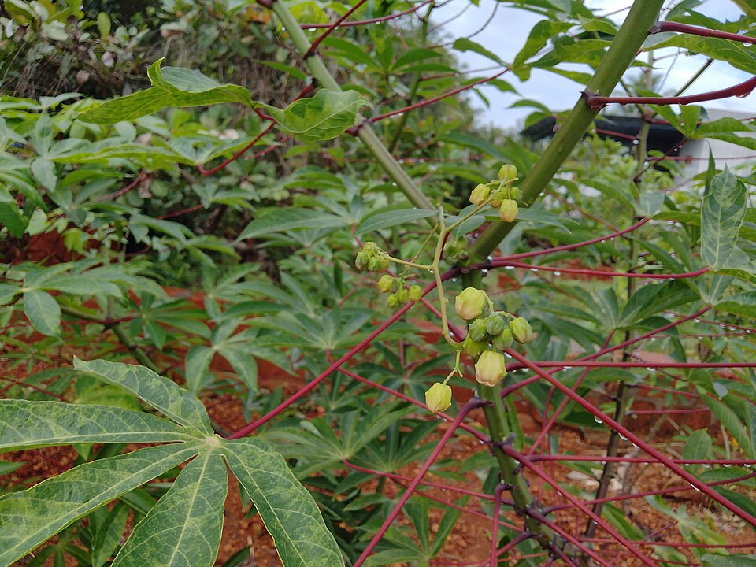

# Cassava

> **Node ID**: plants.edible-plants.cassava
> **Domain**: [Plants](./index.md)
> **Dependencies**: See prerequisites
> **Enables**: [`Edible Plants`](edible-plants.md)
> **Timeline**: Years 0-5
> **Outputs**: edible_plant_material
> **Critical**: Yes

## Overview

> *Image: Vijayanrajapuram, CC BY-SA 4.0*

Cassava

*Manihot esculenta* (Euphorbiaceae) is a staple food crop species of major importance for civilization bootstrapping. Chimoio provides leaves as its primary edible product.

Edible parts: Leaves The leaves are eaten.

For civilization bootstrapping, cassava is significant because of its role as a staple crop. Reliable food production is the foundation upon which all other technological development rests. Understanding the cultivation, processing, and storage of *Manihot esculenta* enables communities to establish food security and allocate labor to non-subsistence activities. Cassava's exceptional drought tolerance and ability to grow in poor soils makes it a critical food security crop for tropical regions where irrigation infrastructure does not exist.

*Manihot esculenta* is a member of the Euphorbiaceae family. As a staple food crop, it provides essential calories, protein, or other nutrients needed to sustain human populations during the bootstrap process. The ability to produce food reliably from cultivated plants is what separates sedentary civilizations from hunter-gatherer societies, because food surplus allows specialization of labor into toolmaking, construction, and eventually metallurgy and beyond.

This species grows as a perennial or annual depending on climate and management. Propagation is primarily by seed or vegetative means. Harvest timing depends on the plant part used: leaves are typically ready at specific growth stages or seasons.

## Prerequisites

### Materials

- Seeds or vegetative propagation material appropriate to the species
- Compost or organic matter for soil amendment
- Mulch material for moisture retention and weed suppression

### Equipment

- Hoe or digging stick for soil preparation and planting
- Sickle, machete, or harvesting knife for crop harvest
- Drying racks or flat drying surfaces for post-harvest processing
- Storage containers: woven baskets, ceramic jars, or sacks for dried product
- Winnowing baskets or screens if processing grains or seeds

### Knowledge

- Species identification: A small tropical tree in the Euphorbiaceae family, with edible leaves.
- Understanding of planting timing relative to local frost dates and rainy seasons
- Knowledge of soil preparation, seed depth, and spacing requirements
- Recognition of common pests and diseases and their early indicators
- Safe preparation methods for any toxic or bitter compounds (see Safety)

### Infrastructure

- Field or garden site with suitable climate, soil type, and sun exposure
- Reliable water access for germination and establishment phase
- Fenced or protected area if animal browsing is a risk
- Storage structure protected from moisture, rodents, and insects

## Process Description

### Distribution and Growing Conditions

### Identification

A small tropical tree in the Euphorbiaceae family, with edible leaves.

### Edible Parts and Preparation

## Quantitative Parameters

### Growing Parameters

| Parameter | Value | Notes |
|-----------|-------|-------|
| Edible parts | Leaves | Primary harvest |

## Processing and Storage

### Storage

Harvest at peak maturity and process promptly. Most plant products can be preserved by drying, fermenting, or storing in cool conditions. Test storage readiness by checking for residual moisture — properly dried material should be brittle, not flexible. Label all stored products with harvest date and variety.

### Material Handling

Handle cassava produce with clean hands and tools to prevent contamination. Remove field heat promptly after harvest by moving product to shade. Process within the recommended timeframe to prevent quality loss. Compost crop residues and processing waste to return organic matter to the soil. Label stored products with harvest date, variety, and any treatments applied.

## Scaling Notes

- **Bench scale**: Individual plants or small garden plot (10-50 plants). Output for direct household consumption. Useful for seed saving, variety selection, and learning the crop's behavior under local conditions.
- **Pilot scale**: Field planting of 0.1 to 1 hectare (500-5,000 plants). Staggered planting or sequential harvests to extend availability. Requires basic hand tools and family-level labor. Surplus can be traded or stored.
- **Production scale**: Multi-hectare cultivation with mechanized planting, harvesting, and processing. Requires plow animals or tractors, grain mills or processing equipment, and bulk storage facilities. Enables community-level food security and trade.

Key scaling challenges include maintaining genetic diversity at plantation scale, managing pest and disease pressure in monoculture, and matching post-harvest processing capacity to harvest volume. Seed saving and variety selection at bench scale directly informs decisions about which cultivars to scale up.

## Troubleshooting

| Problem | Probable Cause | Solution |
|---------|---------------|----------|
| Poor germination | Old seed, wrong soil temperature, planted too deep, or insufficient moisture | Use fresh seed; verify germination temperature range; plant at recommended depth; maintain soil moisture during germination |
| Pest damage | Insect infestation or browsing animals | Hand-pick pests; use companion planting with repellent species; install fencing for larger pests |
| Disease (fungal/bacterial) | Poor air circulation, excessive moisture, infected seed | Space plants adequately; avoid overhead watering; use clean seed from disease-free plants; practice crop rotation |
| Low yield | Nutrient deficiency, water stress, overcrowding, or shade | Amend soil with compost or manure; ensure adequate water at critical growth stages; thin to recommended spacing; plant in full sun |
| Storage losses | Insufficient drying, rodent/insect damage, high humidity | Dry product thoroughly before storage; use sealed containers; inspect stored product regularly; keep storage area clean and dry |

## Safety Considerations

Working with *Manihot esculenta* involves the following hazards:

- Tool injuries during harvest and processing — use sharp tools in good condition and cut away from the body
- Allergic reactions to plant compounds — sensitive individuals should test small quantities first
- Sun exposure and heat stress during field work — schedule heavy work for early morning or late afternoon
- Musculoskeletal strain from repetitive harvesting motions — vary tasks and take regular breaks

### Personal Protective Equipment

- Sturdy gloves when handling plants with irritant sap, spines, or rough surfaces
- Long sleeves and trousers for field work to reduce skin exposure to irritants and insects
- Eye protection when using cutting tools overhead or near face level
- Sun hat and sunscreen for extended field work

### Emergency Procedures

- For suspected plant poisoning: stop eating immediately, save a sample of the plant material, and seek medical attention. Do not induce vomiting unless directed by a medical professional.
- For tool lacerations: apply direct pressure with a clean cloth, elevate the wound, and seek medical attention for cuts deeper than skin level.
- For allergic reaction (swelling, difficulty breathing): discontinue exposure immediately and seek emergency medical help.

## Quality Control

### Acceptance Criteria

- Harvest product shows expected color, texture, size, and flavor for the variety grown
- No visible mold, rot, pest damage, or foreign material in stored product
- Dried products are brittle throughout with no flexible or moist spots
- Seeds intended for storage test at below 14% moisture content

### Testing Methods

- **Visual inspection**: check for discoloration, mold, insect damage, or foreign material
- **Bite test (seeds/grains)**: properly dried seeds crack cleanly; under-dried seeds dent or feel leathery
- **Smell test**: fresh product has characteristic aroma; off-odors indicate spoilage or contamination
- **Snap test (dried products)**: properly dried material snaps rather than bends

### Sampling Protocol

For field-scale production, inspect every 10th plant during harvest for disease and pest damage. Grade each batch by size and quality before storage. Record yield per unit area to track productivity trends across seasons and identify declining performance early.

## Variations and Alternatives

### Related Species

- [Wheat](wheat.md)
- [Rice](rice.md)
- [Maize](maize.md)
- [Potato](potato.md)
- [Sweet Potato](sweet-potato.md)

### Cultivar Selection

Within *Manihot esculenta*, considerable variation exists in yield, disease resistance, climate adaptation, and quality characteristics. When establishing a cassava crop, select varieties adapted to local conditions: day length, temperature range, rainfall pattern, and soil type. Landrace varieties — locally adapted populations maintained by traditional farmers — often outperform modern cultivars under low-input conditions because they have been selected for resilience rather than maximum yield under optimal conditions.

Seed saving from the best-performing plants each generation gradually adapts the variety to local conditions. Select for vigor, disease resistance, appropriate maturity timing, and product quality. Maintain genetic diversity by saving seed from multiple plants rather than a single individual, which preserves the population's ability to adapt to changing conditions and disease pressures.

### Crop Rotation and Companion Planting

*Manihot esculenta* benefits from crop rotation to prevent buildup of species-specific pests and diseases. Avoid planting in the same field in consecutive seasons where possible. Follow with a different crop family to break pest cycles and maintain soil health.

Companion planting with aromatic herbs or flowering plants can deter pests and attract beneficial insects. Avoid planting near species that compete for the same nutrients or harbor shared pathogens.

*Manihot esculenta* benefits from crop rotation to prevent buildup of species-specific pests and diseases. Avoid planting cassava in the same field in consecutive seasons. Follow with legumes (beans, peanuts) to restore soil nitrogen, since cassava is a heavy feeder that depletes soil nutrients. Cassava's long growing season (8-24 months) makes it incompatible with short-season rotation schemes; plan field allocation accordingly.

### Toxicity Warning

Raw cassava contains cyanogenic glycosides (linamarin and lotaustralin) that convert to hydrogen cyanide when plant tissue is damaged. Proper processing is essential: peel roots completely, grate or chop, and then either ferment (3-5 days), press to remove juice, or dry thoroughly at high temperature. Sweet varieties (low-cyanide) can be boiled like potatoes; bitter varieties (high-cyanide) require extensive processing before consumption. Never eat raw cassava root.

### Propagation Methods

Cassava is propagated almost exclusively by stem cuttings, not by seed. Select mature, disease-free stems from plants with known yield performance. Cut stems into 20-30 cm segments with 5-7 nodes. Plant cuttings vertically or at a 45-degree angle, burying two-thirds of the cutting in the soil. Cuttings root within 2-3 weeks under moist conditions. Stems for planting should be harvested at the same time as the roots, stored upright in a cool, shady location, and planted within 2 weeks of harvest. Stem quality directly affects yield — using thin or diseased stems reduces root yield by 30-50%.

### Harvesting

Cassava roots are ready for harvest 8-24 months after planting, depending on variety and growing conditions. Harvest by cutting the stem at 30-40 cm height, then carefully digging around the root mass. The roots are brittle and damage easily; broken or cut roots deteriorate rapidly. Fresh cassava roots have a shelf life of only 2-3 days at ambient temperature, making processing (drying, fermenting, or flour production) essential within hours of harvest. For storage, peel, slice, and sun-dry the roots for 3-5 days until completely brittle, then grind into flour.

## References

- [Edible Plants](edible-plants.md) — parent capability
- [Plants Domain](./index.md) — domain overview and related capabilities
- [Agave](agave.md) — example plant article format
- [Food Processing](../food-processing/index.md) — downstream processing of harvested crops
- [Agriculture](../agriculture/index.md) — cultivation systems and crop rotation
- Family: Euphorbiaceae
- Distribution: Angola, Burkina Faso, Burundi, Benin, Botswana, Congo (DRC), Central African Republic, Congo (Republic), Cote d'Ivoire, Cameroon, Cape Verde, Djibouti, Algeria, Egypt, Eritrea, Ethiopia, Gabon, Ghana, Gambia, Guinea and 34 more
- Data sourced from Food Plants International, Wikipedia, and iNaturalist via the Edible Plant Database (ZIM)
- Plants for a Future (pfaf.org) — supplementary cultivation and use data
- FAO: Cassava production and processing guidelines
- IITA: International Institute of Tropical Agriculture cassava resources
- CIAT: Centro Internacional de Agricultura Tropical cassava program

Cassava roots deteriorate rapidly after harvest (vascular streaking begins within 24-48 hours), making prompt processing essential. The traditional solution is to process roots on the same day they are harvested — either by grating and fermenting into gari (West Africa), pressing and roasting into farinha (Brazil), or drying whole roots in the sun for later milling into flour. These processing methods simultaneously reduce cyanide content to safe levels.
Cassava provides the highest calorie yield per hectare of any staple crop in the tropics,
producing 15-40 tonnes of fresh roots per hectare (equivalent to 5-12 tonnes of dry matter).
The crop requires minimal inputs — no nitrogen fertilizer (it produces cyanide as a natural
pesticide), tolerates poor acidic soils, and yields reliably even in drought years when corn
and beans fail entirely.

---
*Part of the [Bootciv Tech Tree](../index.md) · [Plants](./index.md) · [All Domains](../index.md)*
