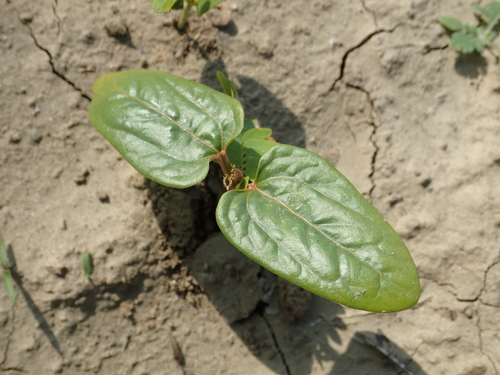

# Castor

> **Node ID**: plants.edible-plants.castor
> **Domain**: [Plants](./index.md)
> **Dependencies**: See prerequisites
> **Enables**: [`Edible Plants`](edible-plants.md)
> **Timeline**: Years 0-5
> **Outputs**: edible_plant_material
> **Critical**: Yes

## Overview

> *Castor, aviso à roues, lancé à la Seyne-sur-Mer en 1861 sur la Charente.*

> *Image: Unknown authorUnknown author, Public domain*

Castor

*Ricinus communis* (Euphorbiaceae) is a oilseed & spice crop species of major importance for civilization bootstrapping. Castor bean, Castor Oil Plant provides leaves, roots, seeds/nuts as its primary edible product.

A fast-growing evergreen shrub reaching 1.5 m tall by 1 m wide. Hardy to UK zone 9, frost-tender. In leaf year-round, flowering July to September, seeds ripening September to November. Monoecious and self-fertile, wind-pollinated. Grows in light sandy, medium loamy, and heavy clay soils, prefers well-drained conditions, tolerates heavy clay. Suitable for mildly acid, neutral, and basic soils. Requires full sun and moist soil.

Edible parts: Leaves, Oil, CAUTION, POISONOUS, Root, Seeds, Flowers The seed contains 35–55% of an edible oil used in cooking and is a rich source of phosphorus, 90% of which is in phytic form. Some caution is advised given the plant's toxicity.

Plants are fast growing. On poor soils plants produce flowers rather than leaves.

For civilization bootstrapping, castor is significant because of its role as a oilseed & spice crop. Reliable food production is the foundation upon which all other technological development rests. Understanding the cultivation, processing, and storage of *Ricinus communis* enables communities to establish food security and allocate labor to non-subsistence activities.

*Ricinus communis* is a member of the Euphorbiaceae family. As a oilseed & spice crop, it provides essential calories, protein, or other nutrients needed to sustain human populations during the bootstrap process. The ability to produce food reliably from cultivated plants is what separates sedentary civilizations from hunter-gatherer societies, because food surplus allows specialization of labor into toolmaking, construction, and eventually metallurgy and beyond.

This species grows as a perennial or annual depending on climate and management. Propagation is primarily by Sow seed in early spring in a warm greenhouse, in individual pots. When large enough to handle, prick seedlings out into individual pots and plant out after the last expected frosts. Seed retains viability for 2–3 years.. Harvest timing depends on the plant part used: leaves, roots, seeds/nuts, flowers are typically ready at specific growth stages or seasons.

## Prerequisites

### Materials

- Propagation material: Sow seed in early spring in a warm greenhouse, in individual pots. When large enough to handle, prick seedlings out into individual pots and plant out after the last expected frosts. Seed retains viability for 2–3 years.
- Compost or organic matter for soil amendment
- Mulch material for moisture retention and weed suppression

### Equipment

- Hoe or digging stick for soil preparation and planting
- Sickle, machete, or harvesting knife for crop harvest
- Drying racks or flat drying surfaces for post-harvest processing
- Storage containers: woven baskets, ceramic jars, or sacks for dried product
- Winnowing baskets or screens if processing grains or seeds

### Knowledge

- Species identification: A small evergreen tree. Often they are grown as annual plants. It grows up to about 6 m high and spreads to 2 m across. The stem is erect, stout and branching. The plant can form suckers. It has leaves with pointy lobes spreading out like fingers on a hand. The leaves are large and glossy. The leave
- Understanding of planting timing relative to local frost dates and rainy seasons
- Knowledge of soil preparation, seed depth, and spacing requirements
- Recognition of common pests and diseases and their early indicators
- Safe preparation methods for any toxic or bitter compounds (see Safety)

### Infrastructure

- Field or garden site with suitable climate, soil type, and sun exposure
- Reliable water access for germination and establishment phase
- Fenced or protected area if animal browsing is a risk
- Storage structure protected from moisture, rodents, and insects

## Process Description

### Cultivation and Propagation

Prefers a well-drained moisture retentive clay or sandy loam in full sun. Requires a rich soil and daytime temperatures above 20°c for the seedlings to grow well, though the seed may fail to set if temperatures rise above 38°C for an extended period. The plant requires 140 - 180 days of warm temperatures in the growing season in order to produce good crops of seed, and is readily killed by frost. The plant is reported to tolerate an annual precipitation in the range of 20 to 429cm, an annual temperature in the range of 7.0 to 27.8°C and a pH of 4.5 to 8.3. The castor-oil plant is a fast-growing shrub in the wild, reaching up to 12 metres in height, though it is much smaller when cultivated in the temperate zone. A very ornamental plant, although it is not winter hardy in Britain, it can be grown outdoors as an annual bedding plant for sub-tropical displays, and can flower and produce fruit in its first year in warm summers. It has been known to ripen a crop of seeds as far north as Christiana in Norway. Providing the plants water needs are met, yields of around 1 tonne per hectare have been achieved, with exceptional cases of up t 5 tonnes per hectare. It has a long history of cultivation as an oil-bearing and medicinal plant, having been grown in ancient Egypt. It is still widely cultivated for its seed in tropical and sub-tropical zones. There are many named varieties, some developed for ornamental use and others for oil production. Plants may need support in exposed areas. Propagation: Sow seed in early spring in a warm greenhouse, in individual pots. When large enough to handle, prick seedlings out into individual pots and plant out after the last expected frosts. Seed retains viability for 2–3 years.

### Distribution and Growing Conditions

### Identification

A small evergreen tree. Often they are grown as annual plants. It grows up to about 6 m high and spreads to 2 m across. The stem is erect, stout and branching. The plant can form suckers. It has leaves with pointy lobes spreading out like fingers on a hand. The leaves are large and glossy. The leaves are on long leaf stalks. The flowers are red and large and woolly. Female flowers are at the top and male flowers lower down. Clusters of flowers produce seed capsules containing 3 spiny seeds. Several different cultivated varieties exist which are chosen for their leaf and flower colour.

### Edible Parts and Preparation

> ⚠️ **RICIN TOXICITY WARNING** ⚠️
>
> Castor seeds contain **ricin**, one of the most toxic naturally occurring substances known. Ingestion of **4-8 seeds can be fatal to an adult**; even fewer seeds can kill a child. Ricin is a protein toxin (ribosome-inactivating protein) that causes cell death by blocking protein synthesis. Symptoms begin 2-12 hours after ingestion: nausea, vomiting, abdominal pain, bloody diarrhea, seizures, and organ failure. **There is no antidote for ricin poisoning.** Treatment is supportive only (IV fluids, activated charcoal if early).
>
> **MANDATORY SAFETY PRACTICES:**
> - **ALWAYS wear gloves** when handling castor seeds or press cake
> - **NEVER consume** raw seeds, press cake, or any unprocessed seed material
> - **NEVER allow children or animals** near seeds or processing areas
> - **DEACTIVATE press cake** by heating to 80°C for 30 minutes before disposal or composting — this denatures the ricin protein
> - **Wash hands thoroughly** after any contact with seeds
> - Ricin is water-soluble but **not oil-soluble** — properly pressed and refined castor oil is safe because ricin remains in the press cake

### Castor Oil Extraction

1. **Seed preparation**: Harvest seed capsules when they begin to dry and turn brown. Remove seeds from capsules and dry to below 10% moisture. Clean seeds to remove hull fragments and debris.
2. **Cold pressing** (preferred for highest quality): Feed seeds into a screw press (expeller) at temperatures below 50°C. The low temperature preserves oil quality and ensures ricin stays denatured in the press cake rather than contaminating the oil. Cold pressing extracts 30-40% of the seed's oil content.
3. **Hot pressing** (higher yield): Pre-heat seeds to 60-80°C before pressing. This reduces oil viscosity and increases extraction to 40-50%, but produces darker oil with more free fatty acids that requires additional refining.
4. **Clarification**: Allow pressed oil to settle for 24-48 hours. Filter through cloth or fine mesh to remove suspended particles. For higher purity, heat oil to 80-100°C to precipitate phospholipids and mucilage, then filter again.
5. **Refining** (essential for food/pharmaceutical grade): Treat oil with a mild alkali solution (1-2% sodium hydroxide) to neutralize free fatty acids, wash with water, and bleach with activated charcoal or clay. Deodorize by steam stripping at 180-220°C under vacuum if equipment permits.
6. **Press cake handling**: Press cake contains 8-12% residual oil plus the ricin protein. **MUST be heat-treated at 80°C for 30 minutes** before any disposal, composting, or use as fertilizer. The heat denatures ricin, rendering the cake non-toxic. Untreated press cake is a deadly poison and must never be fed to livestock or left accessible.

### Castor Oil Properties

Castor oil is unique among vegetable oils because its primary fatty acid — ricinoleic acid (80-90%) — contains a hydroxyl group. This gives castor oil exceptional properties:

| Property | Value | Significance |
|----------|-------|--------------|
| Ricinoleic acid content | 80-90% | Unique hydroxyl fatty acid |
| Viscosity (25°C) | 650-800 mPa·s | 5-10× higher than other vegetable oils |
| Specific gravity (25°C) | 0.945-0.965 | Denser than most oils |
| Iodine value | 82-90 | Semi-drying classification |
| Hydroxyl value | 150-180 | Enables chemical modifications |
| Pour point | -18 to -12°C | Remains fluid at low temperatures |
| Flash point | 260°C | High — safe lubricant |
| Purgative dose | 15-60 ml | Acts on intestinal smooth muscle |

The hydroxyl group makes castor oil miscible with alcohols and many organic solvents that other vegetable oils will not dissolve in. This property is industrially irreplaceable for certain applications.

### Dehydrated Castor Oil (DCO)

When castor oil is heated to 250-300°C in the presence of acid catalysts (sulfuric acid or phosphoric acid at 0.5-1.0%), the hydroxyl group on ricinoleic acid is eliminated, forming a conjugated diene structure. The resulting dehydrated castor oil (DCO) is a **drying oil** comparable to tung oil:

- Dries to a hard, water-resistant film in 4-8 hours
- Iodine value increases from ~85 to ~140 (dryability)
- Used in paints, varnishes, and protective coatings
- Superior to linseed oil in non-yellowing properties
- Production: heat castor oil to 250°C, add 0.5-1% sulfuric acid, hold for 2-4 hours, neutralize with alkali, filter

### Industrial Applications of Castor Oil

- **Lubricant**: The high viscosity and polar hydroxyl group make castor oil an excellent boundary lubricant for high-speed machinery, two-stroke engines, and jet engines. It adheres to metal surfaces where mineral oils are flung off by centrifugal force.
- **Sulfonated castor oil (Turkey Red Oil)**: React castor oil with concentrated sulfuric acid at 25-30°C, wash, and neutralize. Produces the first synthetic detergent, used as a textile dyeing assistant and emulsifier.
- **Hydrogenated castor oil (castor wax)**: Hydrogenate at 125-135°C with nickel catalyst. Produces a hard, brittle wax (mp 85-88°C) used in polishes, carbon paper, crayons, and cosmetics.
- **Nylon precursor**: React castor oil with ammonia at high temperature to produce 11-aminoundecanoic acid, the monomer for nylon-11 — a bio-based engineering plastic.
- **Sebacic acid**: Heat castor oil with sodium hydroxide at 250°C to produce sebacic acid (C10 dicarboxylic acid) and 2-octanol. Sebacic acid is a precursor for nylon-6,10, plasticizers, and synthetic lubricants.

### Process Parameters

| Parameter | Range | Notes |
|-----------|-------|-------|
| Seed oil content | 35-55% | Varies by cultivar |
| Cold press temperature | <50°C | Preserves oil quality, keeps ricin in cake |
| Cold press yield | 30-40% | Of total seed oil |
| Hot press temperature | 60-80°C | Higher yield, darker oil |
| Hot press yield | 40-50% | Of total seed oil |
| Solvent extraction yield | 95-98% | Using hexane on press cake |
| Press cake ricin deactivation | 80°C for 30 min | Mandatory before disposal |
| Refining alkali concentration | 1-2% NaOH | Neutralizes free fatty acids |
| Oil yield per hectare | 500-1,500 kg | Under good management |
| Seed yield per hectare | 800-2,000 kg | Varies widely with conditions |

## Quantitative Parameters

### Growing Parameters

| Parameter | Value | Notes |
|-----------|-------|-------|
| Hardiness zones | 9-12 | USDA |
| Edible parts | Leaves, Roots, Seeds/Nuts, Flowers | Primary harvest |

## Processing and Storage

### Non-Food Uses

The seed contains 35–55% of a drying oil used not only in cooking but also as an ingredient in soaps, polishes, flypapers, paints, and varnishes, and as a lubricant, lighting fuel, and component of precision engine fuels. It is used to coat fabrics and protective coverings, in high-grade lubricant manufacture, in transparent typewriter and printing inks, and in textile dyeing — when converted into sulfonated castor oil (Turkey-Red Oil) it is used to dye cotton fabrics with alizarin. It is also used in producing 'Rilson', a polyamide nylon-type fibre. The dehydrated oil is an excellent drying agent comparable to tung oil, used in paints and varnishes. Hydrogenated castor oil is used in waxes, polishes, carbon paper, candles, and crayons. A fibre for rope-making is obtained from the stems; cellulose from the stems is also used for cardboard and paper. The growing plant is said to repel flies, mosquitoes, moles, and nibbling insects. The leaves have insecticidal properties.

### Storage

Dry seeds thoroughly to below 14% moisture content before storage. Spread in thin layers on drying racks in full sun, stirring periodically. Test dryness by biting: properly dried seeds crack rather than dent. Store in airtight containers (ceramic jars with tight lids, sealed woven bags) in a cool, dry, dark location. Protect from rodents and insects with tight lids or by mixing with inert ash. Under good conditions, dried grains and legumes store for 1-5 years with minimal loss.

### Material Handling

Handle castor produce with clean hands and tools to prevent contamination. Remove field heat promptly after harvest by moving product to shade. Process within the recommended timeframe to prevent quality loss. Compost crop residues and processing waste to return organic matter to the soil. Label stored products with harvest date, variety, and any treatments applied.

## Scaling Notes

- **Bench scale**: Individual plants or small garden plot (10-50 plants). Output for direct household consumption. Useful for seed saving, variety selection, and learning the crop's behavior under local conditions.
- **Pilot scale**: Field planting of 0.1 to 1 hectare (500-5,000 plants). Staggered planting or sequential harvests to extend availability. Requires basic hand tools and family-level labor. Surplus can be traded or stored.
- **Production scale**: Multi-hectare cultivation with mechanized planting, harvesting, and processing. Requires plow animals or tractors, grain mills or processing equipment, and bulk storage facilities. Enables community-level food security and trade.
  Reported production data: Plants are fast growing. On poor soils plants produce flowers rather than leaves.

Key scaling challenges include maintaining genetic diversity at plantation scale, managing pest and disease pressure in monoculture, and matching post-harvest processing capacity to harvest volume. Seed saving and variety selection at bench scale directly informs decisions about which cultivars to scale up.

## Troubleshooting

| Problem | Probable Cause | Solution |
|---------|---------------|----------|
| Poor germination | Old seed, wrong soil temperature, planted too deep, or insufficient moisture | Use fresh seed; verify germination temperature range; plant at recommended depth; maintain soil moisture during germination |
| Pest damage | Insect infestation or browsing animals | Hand-pick pests; use companion planting with repellent species; install fencing for larger pests |
| Disease (fungal/bacterial) | Poor air circulation, excessive moisture, infected seed | Space plants adequately; avoid overhead watering; use clean seed from disease-free plants; practice crop rotation |
| Low yield | Nutrient deficiency, water stress, overcrowding, or shade | Amend soil with compost or manure; ensure adequate water at critical growth stages; thin to recommended spacing; plant in full sun |
| Storage losses | Insufficient drying, rodent/insect damage, high humidity | Dry product thoroughly before storage; use sealed containers; inspect stored product regularly; keep storage area clean and dry |
| Quality or safety note | See species-specific notes | There is only one Ricinus species. It can be invasive. The poison ricin in the seeds in soluble in water and not in the processed oil. |

## Safety Considerations

> ⚠️ **CRITICAL: RICIN HAZARD** ⚠️
>
> Castor seeds contain **ricin**, a lethal toxin. **4-8 seeds can kill an adult; as few as 1-3 seeds can be fatal to a child.** Ricin is a Category B bioterrorism agent. There is NO antidote. All work with seeds and press cake requires strict safety protocols.

Working with *Ricinus communis* involves the following hazards:

- **RICIN TOXICITY (CRITICAL)**: Seeds contain 1-5% ricin by weight. Ricin is a protein toxin that inhibits protein synthesis, causing cell death. Ingestion, inhalation of seed dust, or injection are all lethal routes. Symptoms: nausea, vomiting, abdominal cramps, bloody diarrhea, seizures, organ failure, death within 3-5 days. **Always wear impermeable gloves and a particulate mask when handling seeds. Never eat, drink, or touch face while processing seeds.**
- **Press cake hazard**: Press cake retains ricin after oil extraction. **Heat to 80°C for 30 minutes before any disposal or use.** Untreated press cake is as toxic as raw seeds. Never feed to livestock or leave accessible.
- **Seed dust inhalation**: Milling seeds produces dust containing ricin. Wear a properly fitted N95 or better particulate respirator. Mill in a well-ventilated area or outdoors upwind.
- **Skin contact with seeds**: The seed coat contains ricin and allergenic proteins. Always wear gloves. Wash any skin contact immediately with soap and water.
- **Castor oil safety**: Properly pressed and refined castor oil contains NO ricin (ricin is not oil-soluble and remains in the press cake). However, unrefined or crudely pressed oil may contain trace ricin from seed particles. Pharmaceutical-grade castor oil is safe for the approved purgative dose of 15-60 ml.
- **Allergenicity**: Castor pollen and seed proteins are potent allergens. Sensitized individuals may develop asthma, rhinitis, or contact dermatitis.
- Tool injuries during harvest and processing — use sharp tools in good condition and cut away from the body
- Sun exposure and heat stress during field work — schedule heavy work for early morning or late afternoon
- Musculoskeletal strain from repetitive harvesting motions — vary tasks and take regular breaks

### Personal Protective Equipment

- **Impermeable (nitrile or rubber) gloves** — MANDATORY when handling seeds, press cake, or processing equipment
- **N95 particulate respirator or better** — MANDATORY when milling seeds or handling seed dust
- **Safety goggles** — when milling or pressing to prevent dust/splash exposure
- Long sleeves and trousers for field work to reduce skin exposure
- Waterproof apron during oil pressing operations
- Eye protection when using cutting tools overhead or near face level
- Sun hat and sunscreen for extended field work

### Emergency Procedures

- **For suspected ricin exposure (ingestion of seeds)**: Seek emergency medical attention IMMEDIATELY. Call emergency services. Do NOT wait for symptoms to appear — ricin poisoning has a 2-12 hour asymptomatic period during which supportive care is most effective. Save any remaining seeds or plant material for identification. Do not induce vomiting unless directed by medical personnel.
- **For seed dust inhalation**: Move to fresh air immediately. If breathing difficulty develops, seek emergency medical attention.
- **For skin contact with seeds or press cake**: Wash thoroughly with soap and water for at least 15 minutes. Remove contaminated clothing. Monitor for allergic reaction.
- For tool lacerations: apply direct pressure with a clean cloth, elevate the wound, and seek medical attention for cuts deeper than skin level.
- For allergic reaction (swelling, difficulty breathing): discontinue exposure immediately and seek emergency medical help.

## Quality Control

### Acceptance Criteria

- Harvest product shows expected color, texture, size, and flavor for the variety grown
- No visible mold, rot, pest damage, or foreign material in stored product
- Dried products are brittle throughout with no flexible or moist spots
- Seeds intended for storage test at below 14% moisture content

### Testing Methods

- **Visual inspection**: check for discoloration, mold, insect damage, or foreign material
- **Bite test (seeds/grains)**: properly dried seeds crack cleanly; under-dried seeds dent or feel leathery
- **Smell test**: fresh product has characteristic aroma; off-odors indicate spoilage or contamination
- **Snap test (dried products)**: properly dried material snaps rather than bends

### Sampling Protocol

For field-scale production, inspect every 10th plant during harvest for disease and pest damage. Grade each batch by size and quality before storage. Record yield per unit area to track productivity trends across seasons and identify declining performance early.

## Variations and Alternatives

### Medicinal Uses

Castor oil, extracted from the seed, is a well-established laxative with over 2,000 years of use. It is regarded as fast, safe, and gentle, typically producing a bowel movement within 3–5 hours, and is recommended for use in both the very young and the elderly. It is effective enough to be used routinely to clear the digestive tract in cases of poisoning. It should not be used for chronic constipation, where it addresses symptoms without treating the underlying cause. The flavour is somewhat unpleasant and may cause nausea in some individuals. The oil has a notable antidandruff effect and is well tolerated by the skin, making it a useful vehicle for medicinal and cosmetic preparations. When an alcoholic solution of castor oil is distilled in the presence of sodium salts of higher fatty acids, it congeals into a gel useful for treating non-inflammatory skin diseases and providing protection against occupational eczema and dermatitis. The seed is anthelmintic, cathartic, emollient, laxative, and purgative. It is rubbed on the temples for headache and powdered for application to abscesses and skin infections. In Tibetan medicine the seed is considered to have an acrid, bitter, and sweet taste with a heating potency, and is used for indigestion and as a purgative. A decoction of the leaves and roots is antitussive, discutient, and expectorant. Leaves are used as a poultice to relieve headaches and treat boils.

### Other Uses

### Additional Information

A moderately common plant reportedly eaten in several places in Papua New Guinea. Normally it is considered very poisonous. It is cultivated.

### Notes

There is only one Ricinus species. It can be invasive. The poison ricin in the seeds in soluble in water and not in the processed oil.

### Related Species

- [Sunflower](sunflower.md)
- [Oil Palm](oil-palm.md)
- [Rapeseed](rapeseed.md)
- [Sesame](sesame.md)
- [Safflower](safflower.md)

### Cultivar Selection

Within *Ricinus communis*, considerable variation exists in yield, disease resistance, climate adaptation, and quality characteristics. When establishing a castor crop, select varieties adapted to local conditions: day length, temperature range, rainfall pattern, and soil type. Landrace varieties — locally adapted populations maintained by traditional farmers — often outperform modern cultivars under low-input conditions because they have been selected for resilience rather than maximum yield under optimal conditions.

Seed saving from the best-performing plants each generation gradually adapts the variety to local conditions. Select for vigor, disease resistance, appropriate maturity timing, and product quality. Maintain genetic diversity by saving seed from multiple plants rather than a single individual, which preserves the population's ability to adapt to changing conditions and disease pressures.

### Crop Rotation and Companion Planting

*Ricinus communis* benefits from crop rotation to prevent buildup of species-specific pests and diseases. Avoid planting in the same field in consecutive seasons where possible. Follow with a different crop family to break pest cycles and maintain soil health.

Companion planting with aromatic herbs or flowering plants can deter pests and attract beneficial insects. Avoid planting near species that compete for the same nutrients or harbor shared pathogens.

## References

- [Edible Plants](edible-plants.md) — parent capability
- [Plants Domain](./index.md) — domain overview and related capabilities
- [Agave](agave.md) — example plant article format
- [Food Processing](../food-processing/index.md) — downstream processing of harvested crops
- [Agriculture](../agriculture/index.md) — cultivation systems and crop rotation
- Family: Euphorbiaceae
- Distribution: Andorra, United Arab Emirates, Afghanistan, Antigua &amp; Barbuda, Albania, Armenia, Angola, Argentina, American Samoa, Austria, Australia, Azerbaijan, Bosnia &amp; Herzegovina, Barbados, Bangladesh, Belgium, Burkina Faso, Bulgaria, Bahrain, Burundi and 180 more
- Data sourced from Food Plants International, Wikipedia, and iNaturalist via the Edible Plant Database (ZIM)
- Plants for a Future (pfaf.org) — supplementary cultivation and use data

---
*Part of the [Bootciv Tech Tree](../../index.md) · [Plants](./index.md) · [All Domains](../../index.md)*

