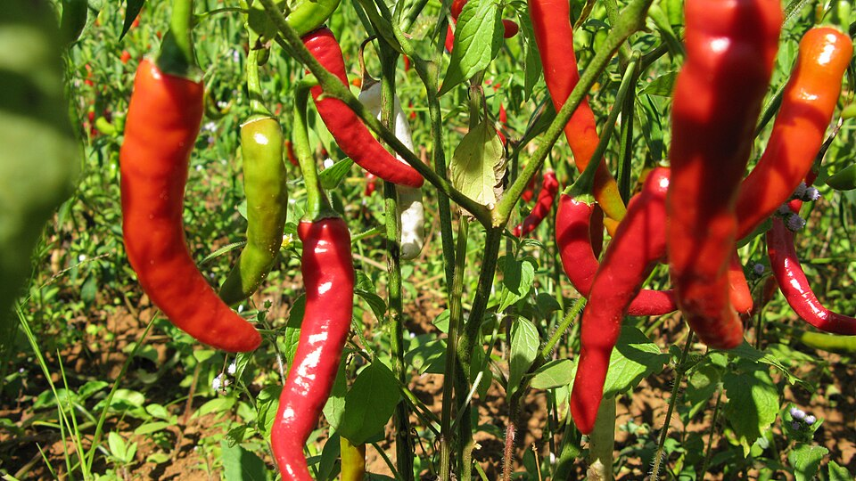

# Chili Pepper

> **Node ID**: plants.edible-plants.chili-pepper
> **Domain**: [Plants](./index.md)
> **Dependencies**: See prerequisites
> **Enables**: [`Edible Plants`](edible-plants.md)
> **Timeline**: Years 0-5
> **Outputs**: edible_plant_material
> **Critical**: No

## Overview

> *The chili pepper (chile pepper, chilli), the fruit from the genus Capsicum. Evidence of the use of chili peppers in Southeast Asia can be found in stone inscriptions from the Bagan period of the 13th century Myanmar. Tabu, Kalaw, Shan Hills, Myanmar.*

> *Image: Vyacheslav Argenberg, CC BY 4.0*

Chili Pepper

*Capsicum annuum* (Solanaceae) is a vegetable crop species of major importance for civilization bootstrapping. Capsicum provides fruit, leaves, spice/beverage as its primary edible product and ranks 40/100 on the nutrition score.

Capsicum annuum is a flowering plant in the family Solanaceae (nightshades), native to the northern regions of South America and to southwestern North America. The plant produces berries of many colors including red, green, and yellow, often with pungent taste. It is one of the oldest cultivated crops, with domestication dating back to around 6,000 years ago in regions of Mexico. The genus Capsicum has over 30 species but Capsicum annuum is the primary species in its genus, as it has been widely cultivated for human consumption for a substantial amount of time and has spread across the world. This species has many uses in culinary, medicine, self-defense, and ornamental applications.

Edible parts: Fruit, Leaves, Herb, Spice, Vegetable The fruit varies enormously across cultivars. Hot types — chilli and cayenne — are used as pungent flavourings, dried and ground into powders such as paprika, or used to colour food. Milder sweet pepper cultivars have a pleasant, slightly sweet flavour and are often eaten raw in salads. Fruits range widely in size and shape, from a few centimetres long to more than 30cm. Young leaves are said to be edible with some caution advised; they are steamed as a potherb or added to soups and stews, and contain about 4–6% protein. Seed can be dried and ground into a pepper. Flowers are also edible raw or cooked.

The first fruit can be harvested after 3-4 months.

For civilization bootstrapping, chili pepper is significant because of its role as a vegetable crop. Reliable food production is the foundation upon which all other technological development rests. Understanding the cultivation, processing, and storage of *Capsicum annuum* enables communities to establish food security and allocate labor to non-subsistence activities.

*Capsicum annuum* is a member of the Solanaceae family. As a vegetable crop, it provides essential calories, protein, or other nutrients needed to sustain human populations during the bootstrap process. The ability to produce food reliably from cultivated plants is what separates sedentary civilizations from hunter-gatherer societies, because food surplus allows specialization of labor into toolmaking, construction, and eventually metallurgy and beyond.

This species grows as a perennial or annual depending on climate and management. Propagation is primarily by Sow seed in late winter to early spring in a warm greenhouse; germination typically takes 3–4 weeks at 20°C. Prick seedlings out into individual pots of reasonably rich soil and grow on quickly. For outdoor cultivation, plant out after the last expected frosts and protect with a cloche or frame until plants are well established.. Harvest timing depends on the plant part used: fruit, leaves, spice/beverage are typically ready at specific growth stages or seasons.

## Prerequisites

### Materials

- Propagation material: Sow seed in late winter to early spring in a warm greenhouse; germination typically takes 3–4 weeks at 20°C. Prick seedlings out into individual pots of reasonably rich soil and grow on quickly. For outdoor cultivation, plant out after the last expected frosts and protect with a cloche or frame until plants are well established.
- Compost or organic matter for soil amendment
- Mulch material for moisture retention and weed suppression

### Equipment

- Hoe or digging stick for soil preparation and planting
- Sickle, machete, or harvesting knife for crop harvest
- Drying racks or flat drying surfaces for post-harvest processing
- Storage containers: woven baskets, ceramic jars, or sacks for dried product
- Winnowing baskets or screens if processing grains or seeds

### Knowledge

- Species identification: An annual plant up to 1.5 m high. The leaves can be long and sword shaped or oval to rounded. The leaves can be 12 cm long. The flowers are produced singly, and are yellow or white. They are bell shaped. The flowers are 1.5 cm across and in the axils of leaves. Fruit are about 10 cm long and 6 cm wi
- Understanding of planting timing relative to local frost dates and rainy seasons
- Knowledge of soil preparation, seed depth, and spacing requirements
- Recognition of common pests and diseases and their early indicators
- Safe preparation methods for any toxic or bitter compounds (see Safety)

### Infrastructure

- Field or garden site with suitable climate, soil type, and sun exposure
- Reliable water access for germination and establishment phase
- Fenced or protected area if animal browsing is a risk
- Storage structure protected from moisture, rodents, and insects

## Process Description

### Cultivation and Propagation

Requires a very warm sunny position and a fertile well-drained soil. Prefers a light sandy soil that is slightly acid. Tolerates a pH in the range 4.3 to 8.3. Plants can tolerate a small amount of frost, but this species does not normally do well outdoors in an average British summer and so it is usually grown in a greenhouse in this country. However, if a very warm sheltered position outdoors is chosen then reasonable crops could be obtained in good summers. This species is widely grown throughout the world, but especially in warm temperate to tropical climates, for its edible fruit - the sweet and chilli peppers. There are many named varieties. There are five basic forms of fruits, each form having various varieties. These forms are:- Cerasiforme. These have small cherry-shaped pungent fruits. Conioides. These fruits are cone-shaped and up to 5cm long. Many of them are grown as ornamentals, but some are also cultivated for food.. Fasciculatum. Also cone-shaped, but with pungent red fruits up to 7.5cm long. Grossum. These are the sweet peppers with large bell-shaped fruits and thick flesh. Longum. These are the cultivated hot cayenne and chilli peppers with long thin fruits up to 30cm long. The pungency of peppers depends upon the presence of a single gene, cultivars that lack this gene are the sweet peppers. A short-lived evergreen perennial in the tropics, though the plants are grown as annuals in temperate zones. Sweet pepper plants are good companions for basil and okra. They should not be grown near apricot trees, however, because a fungus that the pepper is prone to can cause a lot of harm to the apricot tree. In garden design, as well as the above-ground architecture of a plant, root structure considerations help in choosing plants that work together for their optimal soil requirements including nutrients and water. Peppers are usually harvested in late summer to autumn, depending on the variety and climate. Capsicum annuum typically flowers from late spring to early summer. Propagation: Sow seed in late winter to early spring in a warm greenhouse; germination typically takes 3–4 weeks at 20°C. Prick seedlings out into individual pots of reasonably rich soil and grow on quickly. For outdoor cultivation, plant out after the last expected frosts and protect with a cloche or frame until plants are well established.

### Distribution and Growing Conditions

### Identification

An annual plant up to 1.5 m high. The leaves can be long and sword shaped or oval to rounded. The leaves can be 12 cm long. The flowers are produced singly, and are yellow or white. They are bell shaped. The flowers are 1.5 cm across and in the axils of leaves. Fruit are about 10 cm long and 6 cm wide and red when fully ripe. They are hollow. They contain many seeds. Kinds with different shaped fruit also occur.

### Edible Parts and Preparation

#### Harvesting and Ripeness Stages

Chili peppers can be harvested at any stage from green (immature) to fully ripe (red, yellow, orange, or brown depending on variety). Harvest timing affects flavor, heat level, and storage potential:

- **Green harvest**: Picked 60-80 days after transplanting, while fruit is firm and glossy. Green peppers have a sharper, brighter flavor with less sugar content. The plant continues producing new fruit after green harvest, extending the productive season.
- **Colored/ripe harvest**: Left on the plant 2-4 additional weeks until fully colored. Ripe peppers develop more complex flavor, higher sugar content, and higher vitamin C levels (ripe red peppers contain 2-3× the vitamin C of green peppers). However, allowing full ripeness reduces total yield because fruit set slows when existing fruit remains on the plant.
- **Dry pepper harvest**: For drying purposes, allow peppers to partially dry on the plant until the skin wrinkles, then harvest. This reduces post-harvest drying time.

Harvest by cutting the stem 1-2 cm above the fruit cap with a knife or scissors — pulling tears the branch and damages the plant. Wear gloves when harvesting hot varieties (see Safety below).

#### Drying Methods

Drying preserves chili peppers for months to years and concentrates flavors and capsaicin:

- **Sun drying**: Thread peppers on a string through the stems, or spread on flat drying racks in full sun. Turn daily. Requires 5-15 days depending on pepper size, wall thickness, and humidity. Best in arid climates with daytime temperatures above 30°C. Risk of mold in humid conditions — monitor closely and move indoors at night to avoid dew.
- **Smoke drying**: Hang peppers over a slow, smoky fire (hardwood preferred — hickory, mesquite, oak). Smoke at 50-70°C for 2-7 days. Produces chipotle (smoke-dried jalapeño) and similar smoked pepper products. The smoke deposits antimicrobial phenols on the pepper surface, extending shelf life beyond sun-drying alone. Maintain thin blue smoke, not thick white smoke, to avoid bitter creosote flavors.
- **Air drying (ristra method)**: Braid or tie pepper stems together into hanging bunches (ristras). Hang in a warm, dry, well-ventilated area (covered porch, kitchen rafters). Takes 2-4 weeks. Works well for thin-walled varieties (cayenne, Thai bird's eye). Thick-walled varieties (jalapeño, bell pepper) tend to mold rather than dry with this method.

Properly dried peppers are leathery to brittle, with no soft or pliable spots. Moisture content should be below 10%. Store whole dried peppers in sealed containers away from light — ground pepper loses flavor and color rapidly (oxidation of carotenoid pigments). Whole dried peppers retain quality for 1-2 years; ground pepper, 3-6 months.

#### Grinding

Grind dried peppers between stones (metate), with a mortar and pestle, or in a hand-cranked mill to produce chili powder. Remove stems and seeds before grinding for a milder product; include seeds and placenta (the white membrane inside) for maximum heat. Sift through a fine mesh to remove coarse particles.

Capsaicin is concentrated in the placental tissue, not the seeds themselves (seeds are adjacent to the placenta and absorb capsaicin oil). The Scoville Heat Unit (SHU) scale measures pungency: bell pepper (0 SHU), jalapeño (2,500-8,000 SHU), cayenne (30,000-50,000 SHU), habanero (100,000-350,000 SHU).

#### Capsaicin Handling Safety

**WARNING**: Capsaicin is a chemical irritant that causes burning sensation on skin, eyes, and mucous membranes. When handling hot chili peppers:

- Wear rubber or nitrile gloves. Do not touch your face, eyes, or any sensitive skin while handling.
- If capsaicin contacts skin: wash with soap and cold water. Capsaicin is oil-soluble, not water-soluble — plain water spreads the oil. Milk, yogurt, or vegetable oil help dissolve and remove capsaicin from skin.
- If capsaicin contacts eyes: flush with copious cool water for 15 minutes. Seek medical attention if irritation persists.
- Work in a well-ventilated area when grinding dried peppers — airborne capsaicin powder irritates the respiratory tract. Consider wearing a dust mask.
- Keep children and pets away from processing areas.

#### Fermentation and Sauces

Chili peppers can be preserved by lacto-fermentation: mash fresh peppers with 2-3% salt by weight, pack tightly into a fermentation vessel, weight down to submerge in released juices, and ferment at 18-24°C for 5-14 days. Lactic acid bacteria produce a tangy, complex hot sauce base. Fermented mash can be blended with vinegar for shelf-stable hot sauce.

## Quantitative Parameters

### Nutritional Composition (per 100g)

| Part | Moisture | kJ | kcal | Protein | Vit A | Vit C | Iron | Zinc |
| --- | --- | --- | --- | --- | --- | --- | --- | --- |
| Leaves | 82.1 | 222 | 53 | 5.8 | — | 68 | 1.4 | — |
| Fruit yellow raw | 92 | 113 | 27 | 1 | 24 | 183.5 | 0.5 | 0.2 |
| Fruit green raw | 93.5 | 65 | 15 | 0.9 | 59 | 100 | 0.4 | 0.2 |
| Fruit green boiled | 93.7 | 59 | 14 | 0.9 | 59 | 60 | 0.4 | 0.2 |

### Growing Parameters

| Parameter | Value | Notes |
|-----------|-------|-------|
| Germination temperature | 4°C | Optimal |
| Hardiness zones | 8-12 | USDA |
| Edible parts | Fruit, Leaves, Spice/Beverage | Primary harvest |

## Processing and Storage

### Non-Food Uses

Sweet pepper plants grow well alongside basil and okra but should not be planted near apricot trees, as a fungus the pepper is prone to can seriously harm apricots. Pepper flowers can attract pollinators such as bees. The fruits provide food for wildlife, and seeds are eaten by some birds. Foliage can offer limited cover for beneficial insects. The strong scent of pepper plants may help deter some pests, making them useful in companion planting.

### Storage

Fresh fruit is highly perishable. Process within days of harvest by drying, fermenting, or preserving. For drying: slice thinly and spread on racks in full sun or near a heat source until leathery and no longer moist inside. Dried fruit stores for months in sealed containers kept cool and dark. Fermented products (wine, vinegar) extend storage further. Some fruits can be stored fresh for weeks in cool conditions.

### Material Handling

Handle chili pepper produce with clean hands and tools to prevent contamination. Remove field heat promptly after harvest by moving product to shade. Process within the recommended timeframe to prevent quality loss. Compost crop residues and processing waste to return organic matter to the soil. Label stored products with harvest date, variety, and any treatments applied.

## Scaling Notes

- **Bench scale**: Individual plants or small garden plot (10-50 plants). Output for direct household consumption. Useful for seed saving, variety selection, and learning the crop's behavior under local conditions.
- **Pilot scale**: Field planting of 0.1 to 1 hectare (500-5,000 plants). Staggered planting or sequential harvests to extend availability. Requires basic hand tools and family-level labor. Surplus can be traded or stored.
- **Production scale**: Multi-hectare cultivation with mechanized planting, harvesting, and processing. Requires plow animals or tractors, grain mills or processing equipment, and bulk storage facilities. Enables community-level food security and trade.
  Reported production data: The first fruit can be harvested after 3-4 months.

Key scaling challenges include maintaining genetic diversity at plantation scale, managing pest and disease pressure in monoculture, and matching post-harvest processing capacity to harvest volume. Seed saving and variety selection at bench scale directly informs decisions about which cultivars to scale up.

## Troubleshooting

| Problem | Probable Cause | Solution |
|---------|---------------|----------|
| Poor germination | Old seed, wrong soil temperature, planted too deep, or insufficient moisture | Use fresh seed; verify germination temperature range; plant at recommended depth; maintain soil moisture during germination |
| Pest damage | Insect infestation or browsing animals | Hand-pick pests; use companion planting with repellent species; install fencing for larger pests |
| Disease (fungal/bacterial) | Poor air circulation, excessive moisture, infected seed | Space plants adequately; avoid overhead watering; use clean seed from disease-free plants; practice crop rotation |
| Low yield | Nutrient deficiency, water stress, overcrowding, or shade | Amend soil with compost or manure; ensure adequate water at critical growth stages; thin to recommended spacing; plant in full sun |
| Storage losses | Insufficient drying, rodent/insect damage, high humidity | Dry product thoroughly before storage; use sealed containers; inspect stored product regularly; keep storage area clean and dry |
| Quality or safety note | See species-specific notes | There are 10 Capsicum species. The various Capsicum annuum varieties may be synonyms of Capsicum annuum. It possibly has anti-cancer properties. |

## Safety Considerations

Working with *Capsicum annuum* involves the following hazards:

- **Toxicity**: Parts of this plant may contain compounds that are toxic when raw or improperly prepared. Always follow proper preparation procedures before consumption. Verify with multiple authoritative sources.
- Tool injuries during harvest and processing — use sharp tools in good condition and cut away from the body
- Allergic reactions to plant compounds — sensitive individuals should test small quantities first
- Sun exposure and heat stress during field work — schedule heavy work for early morning or late afternoon
- Musculoskeletal strain from repetitive harvesting motions — vary tasks and take regular breaks

### Personal Protective Equipment

- Sturdy gloves when handling plants with irritant sap, spines, or rough surfaces
- Long sleeves and trousers for field work to reduce skin exposure to irritants and insects
- Eye protection when using cutting tools overhead or near face level
- Sun hat and sunscreen for extended field work

### Emergency Procedures

- For suspected plant poisoning: stop eating immediately, save a sample of the plant material, and seek medical attention. Do not induce vomiting unless directed by a medical professional.
- For tool lacerations: apply direct pressure with a clean cloth, elevate the wound, and seek medical attention for cuts deeper than skin level.
- For allergic reaction (swelling, difficulty breathing): discontinue exposure immediately and seek emergency medical help.

## Quality Control

### Acceptance Criteria

- Harvest product shows expected color, texture, size, and flavor for the variety grown
- No visible mold, rot, pest damage, or foreign material in stored product
- Dried products are brittle throughout with no flexible or moist spots
- Seeds intended for storage test at below 14% moisture content

### Testing Methods

- **Visual inspection**: check for discoloration, mold, insect damage, or foreign material
- **Bite test (seeds/grains)**: properly dried seeds crack cleanly; under-dried seeds dent or feel leathery
- **Smell test**: fresh product has characteristic aroma; off-odors indicate spoilage or contamination
- **Snap test (dried products)**: properly dried material snaps rather than bends

### Sampling Protocol

For field-scale production, inspect every 10th plant during harvest for disease and pest damage. Grade each batch by size and quality before storage. Record yield per unit area to track productivity trends across seasons and identify declining performance early.

## Variations and Alternatives

### Medicinal Uses

The fruit of hot, pungent cultivars is antihaemorrhoidal when taken in small amounts, antirheumatic, antiseptic, diaphoretic, digestive, irritant, rubefacient, sialagogue, and tonic. Internally it is used in the treatment of the cold stage of fevers, debility in convalescence or old age, varicose veins, asthma, and digestive problems. Externally it is applied for sprains, unbroken chilblains, neuralgia, and pleurisy. It is also an effective sea-sickness preventative. The German Commission E Monographs approve Capsicum for muscular tension and rheumatism.

### Other Uses

### Additional Information

It is a cultivated food plant. In Papua New Guinea it is becoming a popular vegetable to eat raw.

### Notes

There are 10 Capsicum species. The various Capsicum annuum varieties may be synonyms of Capsicum annuum. It possibly has anti-cancer properties.

### Related Species

- [Cabbage](cabbage.md)
- [Wild Tomato](wild-tomato.md)
- [Carrot](carrot.md)
- [Onion](onion.md)
- [Garlic](garlic.md)

### Cultivar Selection

Within *Capsicum annuum*, considerable variation exists in yield, disease resistance, climate adaptation, and quality characteristics. When establishing a chili pepper crop, select varieties adapted to local conditions: day length, temperature range, rainfall pattern, and soil type. Landrace varieties — locally adapted populations maintained by traditional farmers — often outperform modern cultivars under low-input conditions because they have been selected for resilience rather than maximum yield under optimal conditions.

Seed saving from the best-performing plants each generation gradually adapts the variety to local conditions. Select for vigor, disease resistance, appropriate maturity timing, and product quality. Maintain genetic diversity by saving seed from multiple plants rather than a single individual, which preserves the population's ability to adapt to changing conditions and disease pressures.

### Crop Rotation and Companion Planting

*Capsicum annuum* benefits from crop rotation to prevent buildup of species-specific pests and diseases. Avoid planting in the same field in consecutive seasons where possible. Follow with a different crop family to break pest cycles and maintain soil health.

Companion planting with aromatic herbs or flowering plants can deter pests and attract beneficial insects. Avoid planting near species that compete for the same nutrients or harbor shared pathogens.

## References

- [Edible Plants](edible-plants.md) — parent capability
- [Plants Domain](./index.md) — domain overview and related capabilities
- [Agave](agave.md) — example plant article format
- [Food Processing](../food-processing/index.md) — downstream processing of harvested crops
- [Agriculture](../agriculture/index.md) — cultivation systems and crop rotation
- Family: Solanaceae
- Distribution: Andorra, United Arab Emirates, Afghanistan, Antigua &amp; Barbuda, Albania, Armenia, Angola, Argentina, Austria, Australia, Azerbaijan, Bosnia &amp; Herzegovina, Barbados, Bangladesh, Belgium, Burkina Faso, Bulgaria, Bahrain, Burundi, Benin and 179 more
- Data sourced from Food Plants International, Wikipedia, and iNaturalist via the Edible Plant Database (ZIM)
- Plants for a Future (pfaf.org) — supplementary cultivation and use data

---
*Part of the [Bootciv Tech Tree](../../index.md) · [Plants](./index.md) · [All Domains](../../index.md)*

