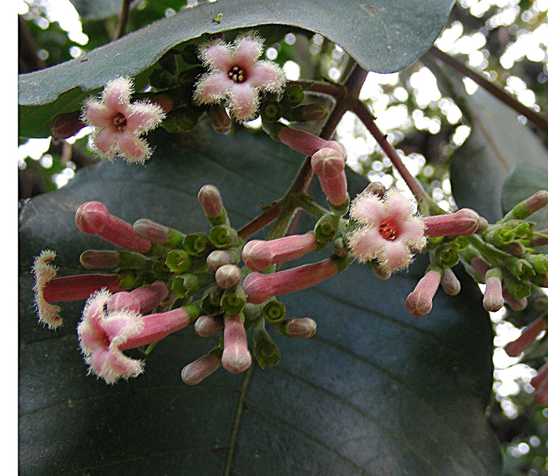
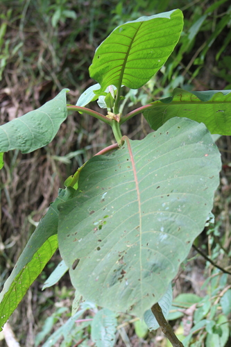

# Cinchona

> **Node ID**: plants.medicinal.cinchona
> **Domain**: [Plants](./index.md)
> **Dependencies**: See prerequisites
> **Enables**: [`Health`](../health/index.md)
> **Timeline**: Years 3-8
> **Outputs**: quinine (malaria treatment), quinidine (heart arrhythmia)
> **Critical**: Yes — sole practical natural source of quinine for malaria treatment until synthetic production

## Overview

> *Native from Costa Rica to Bolivia, known as Quino. More widely planted as a quinine source. Photo from Colombia.*

> *Image: Dick Culbert, CC BY 2.0*

Cinchona (*Cinchona officinalis* and related species) is a genus of evergreen trees native to the Andes mountains of South America, cultivated for the quinine alkaloids in their bark. Quinine is the oldest and most important antimalarial drug, responsible for enabling European colonization of tropical regions and saving millions of lives from malaria over four centuries.

The bark contains 1-8% total alkaloids by dry weight, of which quinine is the most therapeutically important (typically 30-60% of total alkaloids). Other alkaloids include quinidine (antiarrhythmic), cinchonine, and cinchonidine. The alkaloid concentration varies by species, with *C. ledgeriana* containing the highest quinine levels (5-8% total alkaloids) and *C. officinalis* being more cold-tolerant.

Quinine kills the plasmodium parasite that causes malaria by interfering with its ability to detoxify heme, a toxic byproduct of hemoglobin digestion. The standard treatment dose is 600 mg of quinine every 8 hours for 7 days. This requires approximately 10-30 g of cinchona bark per day, depending on quinine concentration.

Cinchona trees grow 10-25 meters tall in montane tropical forests at 1,000-2,500 meters elevation. They require cool temperatures (15-20°C), high humidity, and well-drained soils. They are cultivated commercially in Indonesia, India, and East Africa, as well as their native Andes. Trees reach bark-harvestable size in 6-8 years.

The bark is harvested by stripping from the trunk and major branches, either from felled trees or by careful partial stripping of standing trees that allows regrowth. After harvest, the bark is dried, ground, and extracted with water or alcohol.

Primary outputs: `quinine` for malaria treatment, `quinidine` for cardiac arrhythmias.

## Prerequisites

### Materials

- Cinchona seeds or seedlings (available from specialty nurseries)
- Montane tropical site at 1,000-2,500 m elevation
- Well-drained, acidic soil (pH 4.5-6.5)
- Humid conditions with 1,500-3,000 mm annual rainfall

### Equipment

- Sharp knife for bark stripping
- Drying racks or screens
- Grinding equipment (mortar, mill)
- Extraction vessel (pot or percolator)
- Filter cloth
- Measuring equipment for dose preparation

### Knowledge

- Cinchona species identification and quinine content variation
- Bark harvesting technique (partial stripping to preserve the tree)
- Quinine extraction: acidified water decoction
- Dosage calculation based on bark alkaloid content
- Malaria diagnosis and treatment protocols

### Infrastructure

- Montane tropical plantation or managed forest
- Drying and processing area
- Medicine preparation workspace
- Dose measurement and packaging capability

## Process Description

### Bark Harvest

1. Plant seedlings at 3-4 meter spacing in shaded conditions (cinchona is an understory tree). Provide wind protection and consistent moisture.
2. Allow trees to grow for 6-8 years before first bark harvest. Quinine content increases with age.
3. Harvest bark by making vertical and horizontal cuts through the bark in a grid pattern on the trunk. Peel bark strips from the trunk without cutting into the wood (cambium layer). Leave 30-50% of the bark intact to allow regeneration.
4. Alternatively, fell the entire tree and strip all bark. This yields more bark but kills the tree.
5. Dry bark strips in the sun for 5-10 days until brittle. The bark curls as it dries (quinine bark has a characteristic quill shape).
6. Grade bark by appearance: thick, dark bark from the trunk has higher quinine content than thin branch bark.

### Quinine Extraction

1. Grind dried bark to a coarse powder (1-3 mm particles).
2. **Simple decoction**: Add 10-30 g of bark powder to 500 ml of water. Add 1-2 g of tartaric acid or citric acid to improve extraction (quinine is more soluble in acidic water). Boil for 15-20 minutes. Strain through cloth. This yields a bitter, reddish-brown liquid containing quinine and other alkaloids.
3. **Dosage**: Drink one cup of the decoction 2-3 times per day for 7 days for malaria treatment. Each cup contains approximately 200-600 mg of mixed alkaloids.
4. **Concentrated extract (higher technology)**: Repeatedly extract bark powder with acidified alcohol (ethanol with 1% sulfuric acid). Evaporate the alcohol. Precipitate quinine by adding alkali (sodium hydroxide or lime). Filter and dry the crude quinine. Further purify by recrystallization from hot water or alcohol.

### Process Parameters

| Parameter | Range | Notes |
|-----------|-------|-------|
| Total alkaloids (dried bark) | 1-8% | Varies by species and age |
| Quinine as % of total alkaloids | 30-60% | Species-dependent |
| Quinine content (C. ledgeriana) | 5-8% total alkaloids | Highest-producing species |
| Quinine content (C. officinalis) | 1-3% total alkaloids | More cold-tolerant |
| Therapeutic dose (quinine base) | 600 mg, 3x/day for 7 days | Standard malaria treatment |
| Bark equivalent per dose | 10-30 g dried bark | Depending on quinine concentration |
| Bark yield per tree | 2-10 kg (dried) | From full strip of 8-year tree |
| First harvest age | 6-8 years | From planting |
| Tree height at harvest | 8-15 m | 6-8 years old |
| Optimal elevation | 1,000-2,500 m | Montane tropical |
| Optimal temperature | 15-20°C | Cool tropical |
| Bark regeneration time | 3-5 years | After partial stripping |
| Bark yield per hectare | 1,200-10,000 kg | Dried, at 8-year harvest |
| Seed viability | 1-3 months | Must plant fresh seeds |
| Tree spacing (plantation) | 3-4 m | 600-1,000 trees per hectare |

### Extraction Processing Details

Quinine extraction from cinchona bark proceeds in stages. The first step is always acidified water decoction: boiling bark powder in water with added tartaric or citric acid at pH 3-4. Acid converts quinine to its more water-soluble salt form (quinine sulfate or quinine hydrochloride). A single decoction extracts 60-70% of available alkaloids. Three successive decoctions of the same bark (using fresh acidified water each time) extract 85-95% of total alkaloids.

For purification, the combined acidic extracts are basified with sodium hydroxide or lime (pH 9-10). Quinine free base precipitates as a white to yellow-white solid. Filter, wash with cold water, and dry. This crude quinine contains 40-70% quinine with the remainder being other cinchona alkaloids (quinidine, cinchonine, cinchonidine). For medical use, this mixture is acceptable — all four alkaloids have antimalarial activity, though quinine is the most potent.

Further purification by recrystallization from hot ethanol yields pharmaceutical-grade quinine (>95% purity). Dissolve crude quinine in hot ethanol (7:1 ratio), filter hot to remove insoluble material, and cool slowly. Quinine crystallizes as fine white needles. A second recrystallization yields >99% pure quinine.

### Quinine Tonic Water and Prophylaxis

Dissolving quinine in carbonated water produces tonic water, originally developed as a palatable way to deliver prophylactic quinine doses to colonial administrators in malaria-endemic regions. Modern tonic water contains 80-100 mg of quinine per liter — far below therapeutic dose but enough to give the characteristic bitter flavor. For therapeutic purposes, direct bark decoction or purified quinine tablets are necessary.

## Safety Considerations

- Quinine is toxic at high doses. Overdose causes cinchonism: tinnitus (ringing ears), headache, nausea, blurred vision, and at severe levels, cardiac arrhythmia and death. The therapeutic dose has a narrow margin below toxic dose. Do not exceed recommended doses.
- Quinine should not be used in patients with G6PD deficiency (a genetic condition common in malaria-endemic regions). It can cause hemolytic anemia in these individuals.
- Pregnant women should use quinine only when the benefits outweigh risks. High doses can cause uterine contractions and fetal harm. However, untreated malaria is also dangerous in pregnancy.
- Quinine can cause hypersensitivity reactions, including thrombocytopenia (low platelets). Discontinue if unusual bleeding or bruising occurs.
- The bitter taste of quinine decoction makes it difficult for children to tolerate. Mix with sweet substances if available.
- Long-term quinine use (as prophylaxis rather than treatment) increases the risk of adverse effects. Reserve quinine for treatment of active malaria.

### Personal Protective Equipment

- No special PPE for bark handling
- Gloves for chemical extraction work
- Eye protection for acid/alkali handling during purification

## Quality Control

### Acceptance Criteria

- **Dried bark**: Curled quills, outer surface grey-brown, inner surface reddish-brown, distinctly bitter taste, no mold
- **Decoction**: Dark reddish-brown, very bitter, clear (no bark particles)
- **Crude quinine**: White to pale yellow powder or crystals, very bitter

### Testing Methods

- Taste test: quinine is intensely bitter. A tiny pinch of bark powder on the tongue should produce immediate, strong bitterness. Bland bark is low in alkaloids.
- Fluorescence test: quinine solutions fluoresce bright blue under ultraviolet light. A simple UV source can verify quinine presence.
- Acid-base extraction test: dissolve bark extract in dilute acid, then add alkali. A white precipitate indicates quinine and related alkaloids.

## Scaling Notes

- **Individual tree**: 2-10 kg of dried bark, containing 20-800 g of total alkaloids. Sufficient for 10-130 courses of malaria treatment.
- **Small plantation** (1 hectare): 600-1,000 trees. After 8 years, bark yield: 1,200-10,000 kg dried. Alkaloid yield: 12-800 kg. Can treat thousands of malaria cases.
- **Community pharmacy**: A small plantation of 0.1 hectare provides enough bark for 500-5,000 malaria treatments from a single harvest.
- **Bottleneck**: The 6-8 year wait before first bark harvest. Cinchona cannot be rush-produced.

## Troubleshooting

| Problem | Probable Cause | Solution |
|---------|---------------|----------|
| Bark has low alkaloid content | Wrong species, too young, or poor growing conditions | Plant high-yielding species (C. ledgeriana); wait 6+ years; ensure montane conditions |
| Tree dies after bark stripping | Too much bark removed or damaged cambium | Leave at least 30% bark intact; avoid cutting into wood |
| Decoction not bitter enough | Insufficient bark or poor extraction | Increase bark amount; add acid to extraction water; extend boiling time |
| Patient develops tinnitus | Quinine toxicity (cinchonism) | Reduce dose immediately; discontinue if symptoms persist |
| Seeds fail to germinate | Old seeds or wrong conditions | Cinchona seeds lose viability quickly (1-3 months); plant fresh seeds in moist, shaded nursery |

## Variations and Alternatives

- **Cinchona ledgeriana**: Highest quinine content (5-8% alkaloids). Requires warm, humid montane conditions.
- **Cinchona succirubra** (red cinchona): Lower quinine but hardier and faster-growing. Red bark. Widely planted.
- **Artemisinin** (*Artemisia annua*): Alternative antimalarial. Faster-acting than quinine for falciparum malaria. Different mechanism of action.
- **Synthetic quinine**: First synthesized in 1944. Requires complex organic chemistry. Replaced natural quinine for most commercial production.
- **Chloroquine**: Synthetic antimalarial derived from quinine. Easier to produce, fewer side effects. Rendered less effective by widespread resistance.

### Additional Cinchona Products

Besides quinine, cinchona bark yields quinidine (used to treat cardiac arrhythmias), cinchonine (moderate antimalarial), and cinchonidine. Quinidine is therapeutically important for treating atrial fibrillation and ventricular arrhythmias — conditions also treated by digitalis but through a different mechanism. The red dye extracted from cinchona bark was used commercially as a textile and hair dye before synthetic alternatives became available. Cinchona bark tea remains a traditional remedy for fever, leg cramps, and digestive complaints in Andean communities.

## References

- [Health](../health/index.md) — malaria treatment and medicine
- [Sweet Wormwood](./artemisia-annua.md) — alternative antimalarial plant
- [Foxglove](./digitalis-purpurea.md) — comparison medicinal plant (cardiac)
- [Plants Domain](./index.md) — domain overview and related capabilities

### Cinchona Cultivation Challenges

Cinchona cultivation presents several challenges that limit its spread. The seeds lose viability
within 1-3 months of collection, requiring prompt planting or careful storage in cool, moist
conditions. Seedlings are slow-growing and delicate, requiring shade, consistent moisture, and
protection from wind during their first year. Transplant survival rates are 60-80% even under
good conditions.

The tree's requirement for montane tropical conditions (1,000-2,500 m elevation, 15-20°C mean
temperature, 1,500-3,000 mm rainfall) restricts cultivation to specific geographic zones.
Suitable sites exist in the Andes, East African highlands, Indonesian mountains, and the
Himalayan foothills. Lowland tropical areas are too hot; temperate areas are too cold.

The 6-8 year wait before bark harvest means that cinchona plantations require long-term
investment and planning. Once established, trees can be harvested sustainably for decades
through partial bark stripping. The key is to leave enough bark intact (minimum 30%) for
the tree to survive and regenerate the harvested areas within 3-5 years.

Cinchona bark was so valuable in the 19th century that explorers risked their lives to smuggle seeds and plants from South America to establish plantations in Asia. The Dutch established cinchona plantations in Java that eventually produced 90% of the world's quinine supply. This transfer of biological wealth from South America to Southeast Asia was one of the most consequential plant introductions in history, enabling malaria treatment on an industrial scale.

### Cinchona Summary

This species represents an important component of a diversified food production system.
No single crop provides complete nutrition, and dietary diversity is essential for human
health. A civilization bootstrap food system should include grains, legumes, roots, fruits,
vegetables, and nuts to ensure adequate intake of calories, protein, vitamins, and minerals.

---
*Part of the [Bootciv Tech Tree](../index.md) · [Plants](./index.md) · [All Domains](../index.md)*

