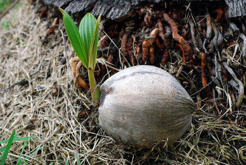

# Coconut

> **Node ID**: plants.edible-plants.coconut
> **Domain**: [Plants](./index.md)
> **Dependencies**: See prerequisites
> **Enables**: [`Edible Plants`](edible-plants.md)
> **Timeline**: Years 0-5
> **Outputs**: edible_plant_material
> **Critical**: Yes

## Overview

> *A diagram of the Diamond coconut model showing two adjustment paths to steady state under different expectations. Based on David Romer "Advanced Macroeconomics", 2000*

> *Image: Radeksz, Public domain*

Coconut

*Cocos nucifera* (Arecaceae) is a fruit & nut tree species of major importance for civilization bootstrapping. Coconut provides seeds/nuts, flowers, shoots as its primary edible product and ranks 48/100 on the nutrition score.

An evergreen tree reaching 25 m (82 ft) tall and 7 m (23 ft) wide, growing at a medium rate. Hardy to UK zone 10. Wind-pollinated and self-fertile, attracting wildlife. Adapts to light sandy, medium loamy, and heavy clay soils, preferring good drainage but tolerating poor nutrition. Grows in mildly acidic, neutral, and basic soils, as well as very acidic, very alkaline, and saline conditions. Requires full sun, prefers moist soil, and tolerates drought.

Edible parts: Nuts, Sap, Cabbage, Nuts milk, Apple, Palm heart, Flowers The coconut is an exceptionally versatile food plant. The seed can be eaten raw or used in a wide range of cooked dishes, and is often dried and shredded as a flavouring in cakes, curries, and similar preparations. Coconut milk or cream, made by pressing freshly grated seed mixed with water, is a traditional ingredient in many African and Asian foods and bakery products. The flesh inside a half-ripe seed is gelatinous and clear, eaten as a delicacy raw or cooked. An edible oil extracted from the seed is widely used in cooking and in making margarines, shortening, filled milk, ice cream, and confectionery. It is traditionally extracted by grating the kernel, macerating it with water, and boiling the mixture so the oil floats to the surface and can be skimmed off, though most commercial oil is obtained by pressing the kernel. The liquid inside unripe fruits makes a refreshing drink that remains cool even in hot tropical conditions. The inflorescence can be cooked and eaten as a vegetable. A sugary sap obtained by tapping or cutting the stalks of young flower bunches can be fermented into an alcoholic beverage. The apical bud is edible raw, though harvesting it kills the trunk as the palm cannot produce side branches. The roots can be roasted and used as a coffee substitute. The pith of the stem is made into a bread, added to soups, or pickled.

Early germinating nuts, give early production in the field. They can commence production after 6-8 years. The best yields are often produced between 12 and 60 years of age. Trees can live for 100 years. Palms can produce 15-100 nuts per year. Fruit take about 1 year to be mature. Tapping the flower stalk can give 1 kg sap/day for 6 months. For palm hearts plants are put at a close spacing of about 2 m and are ready to harvest in 2 years.

For civilization bootstrapping, coconut is significant because of its role as a fruit & nut tree. Reliable food production is the foundation upon which all other technological development rests. Understanding the cultivation, processing, and storage of *Cocos nucifera* enables communities to establish food security and allocate labor to non-subsistence activities.

*Cocos nucifera* is a member of the Arecaceae family. As a fruit & nut tree, it provides essential calories, protein, or other nutrients needed to sustain human populations during the bootstrap process. The ability to produce food reliably from cultivated plants is what separates sedentary civilizations from hunter-gatherer societies, because food surplus allows specialization of labor into toolmaking, construction, and eventually metallurgy and beyond.

This species grows as a perennial or annual depending on climate and management. Propagation is primarily by Fresh seed germinates readily at 27–30°c. The seed has no dormancy and growth of the embryo and seedling is continuous; germination may begin while the fruits are still attached to the palm. For propagation, nuts are collected from selected mother palms or special seed gardens. Tissue culture is a popular method of vegetative propagation for producing large numbers of plants.. Harvest timing depends on the plant part used: seeds/nuts, flowers, shoots, bark/sap are typically ready at specific growth stages or seasons.

## Prerequisites

### Materials

- Propagation material: Fresh seed germinates readily at 27–30°c. The seed has no dormancy and growth of the embryo and seedling is continuous; germination may begin while the fruits are still attached to the palm. For propagation, nuts are collected from selected mother palms or special seed gardens. Tissue culture is a popular method of vegetative propagation for producing large numbers of plants.
- Compost or organic matter for soil amendment
- Mulch material for moisture retention and weed suppression

### Equipment

- Hoe or digging stick for soil preparation and planting
- Sickle, machete, or harvesting knife for crop harvest
- Drying racks or flat drying surfaces for post-harvest processing
- Storage containers: woven baskets, ceramic jars, or sacks for dried product
- Winnowing baskets or screens if processing grains or seeds

### Knowledge

- Species identification: A palm with an unbranched trunk. The trunk has ring-like leaf scars along it. At the base it is swollen and surrounded by a mass of roots. They grow to about 25 m tall. Dwarf varieties have been produced. The fronds are 2-6 m long. They are divided along the stalk into strap shaped leaflets. The lea
- Understanding of planting timing relative to local frost dates and rainy seasons
- Knowledge of soil preparation, seed depth, and spacing requirements
- Recognition of common pests and diseases and their early indicators
- Safe preparation methods for any toxic or bitter compounds (see Safety)

### Infrastructure

- Field or garden site with suitable climate, soil type, and sun exposure
- Reliable water access for germination and establishment phase
- Fenced or protected area if animal browsing is a risk
- Storage structure protected from moisture, rodents, and insects

## Process Description

### Cultivation and Propagation

Plants succeed in moist tropical climates where temperatures never fall below 10c, the average annual rainfall is 1,500mm or more and the driest month has 25mm or more rain. The coconut palm thrives in a wide range of soils, from coarse sand to clay, so long as the soils have adequate drainage and aeration. Requires a well-drained soil with a high water table. Plants grow well in full sun, even when small. Plants can tolerate at least some maritime exposure with salt spray and somewhat saline soil conditions. Coconut palms are halophytic and tolerate salt in the soil well. Plants are intolerant of drought. Coconut can grow in soils with a wide range of pH but grows best at pH 5.5 - 7. Coconut palm is one of the most widely grown tree crops in the tropical countries. Its growth characteristics are ideal for small production and also for combining with other crops. The crown morphology and the relatively wide spacing facilitate the planting of a wide spectrum of field crops in coconut plantations. It has therefore been intercropped with cereals (cassava, sweet potatoes, yams) or fruits (bananas, passion fruit, pineapples and ground nuts) in many countries. Very occasionally a small pearl-like concretion, or 'coconut pearl', is found in the cavity of the nut. Generally about the size of a canary's egg or even that of a cherry, they are white or bluish white in colour with a pearl-like lustre and harder in texture than a pearl. Made almost entirely of a form of lime or calcium carbonate, they are greatly prized and often used in jewellery. The tall varieties reproduce by cross-pollination. Male flowers open first, producing pollen for about 2 weeks. Female flowers are not usually receptive until about 3 weeks after the opening of the inflorescence, making cross-pollination the usual pattern. Reproduction in dwarf varieties is generally through self-pollination. Female flowers are receptive about a week after the male flowers open, both ending at about the same time. Tall palms tend to be slow maturing, flowering 6 - 10 years after planting and with a life-span of 80 - 100 years. Dwarf palms begin bearing in their third year and have a productive life of 30 - 35(-40) years. The trees flower and fruit all year round. A new inflorescence is produced every month, whilst the fruit takes a year to mature. Propagation: Fresh seed germinates readily at 27–30°c. The seed has no dormancy and growth of the embryo and seedling is continuous; germination may begin while the fruits are still attached to the palm. For propagation, nuts are collected from selected mother palms or special seed gardens. Tissue culture is a popular method of vegetative propagation for producing large numbers of plants.

### Distribution and Growing Conditions

### Identification

A palm with an unbranched trunk. The trunk has ring-like leaf scars along it. At the base it is swollen and surrounded by a mass of roots. They grow to about 25 m tall. Dwarf varieties have been produced. The fronds are 2-6 m long. They are divided along the stalk into strap shaped leaflets. The leaflets are 60-90 cm long. They are narrow and tapering. Clusters of large fruit develop beneath the fronds. Male and female flowers are separate on the one stalk. Female flowers are near the base. Flowers are cream. The flowers are covered by boat shaped bracts. About 10-12 fruit/stalk is a good crop. Leaves are up to 5 m long. Fruit can be 25 cm across. The fruit are fibrous. The hard shell inside is filled with coconut milk and the white copra layer.

### Edible Parts and Preparation

## Quantitative Parameters

### Nutritional Composition (per 100g)

| Part | Moisture | kJ | kcal | Protein | Vit A | Vit C | Iron | Zinc |
| --- | --- | --- | --- | --- | --- | --- | --- | --- |
| flesh dried | 12.2 | 2429 | 581 | 6.6 | — | — | — | — |
| Sap | 10.3 | 1421 | 340 | — | — | — | — | — |
| milk | 84.9 | 1004 | 240 | 3.7 | — | 8 | 1.3 | 0.4 |
| apple | 84 | 310 | 74 | 1.3 | 0 | 5 | 0.7 | — |
| flesh | 80.9 | 119 | 28 | 1.1 | — | — | 0.2 | 0.2 |

### Growing Parameters

| Parameter | Value | Notes |
|-----------|-------|-------|
| Annual rainfall | 1000 mm | Growing requirement |
| Germination temperature | 32°C | Optimal |
| Edible parts | Seeds/Nuts, Flowers, Shoots, Bark/Sap | Primary harvest |

## Processing and Storage

### Non-Food Uses

The fibre around the seeds is widely used in making peat-free composts as a substitute for peat. Burnt husks produce a potash used to fertilize the trees, and the husks also serve as a mulch for moisture conservation and weed suppression in the dry season. An oil from the seed, which contains fatty alcohol and glycerine, is used in making soaps, detergents, cosmetics, candles, and pharmaceuticals, and to a lesser extent as a lubricant. The oil can also substitute for diesel in electric generating plants and motor vehicles, though this is only economical when other fuel prices are high. Leaves are woven into roofing and thatching material for hut walls, and into mats and baskets. Leaflet midribs are used as brooms, and the root may be used as a toothbrush. The fibrous husk material, known as coir, yields three types of fibre: mat or yarn fibre used in making mats, bristle fibre used for brush making, and mattress fibre used in upholstery and mattress stuffing. Coir can also be made into ropes and cordage. The hard woody shell around the seed is fashioned into cups, bowls, buttons, combs, bangles, and musical instruments. Coconut-shell flour, ground from clean mature shells, is used as a filler in the thermoplastic industry and as an abrasive for cleaning machinery. The shell produces a high-quality charcoal that burns with intense heat and has high absorbency; it has been used in gas masks and can be further processed into activated carbon for water purification, crystalline sugar preparation, and gold purification. The outer portion of the trunk provides a widely used tropical timber that is red-brown with a coarse texture and straight to entangled grain. It is hard and heavy but not very durable, seasons slowly with a slight risk of checking and a high risk of distortion, and once dry is moderately stable. It has a high blunting effect on tools, so stellite-tipped or tungsten-carbide tools are recommended; nailing and screwing require pre-boring; gluing is satisfactory. The timber is used for structural house frameworks, load-bearing elements such as frames, floors, and trusses, poles, high-quality furniture, and parquet flooring.

### Storage

Dry seeds thoroughly to below 14% moisture content before storage. Spread in thin layers on drying racks in full sun, stirring periodically. Test dryness by biting: properly dried seeds crack rather than dent. Store in airtight containers (ceramic jars with tight lids, sealed woven bags) in a cool, dry, dark location. Protect from rodents and insects with tight lids or by mixing with inert ash. Under good conditions, dried grains and legumes store for 1-5 years with minimal loss.

### Material Handling

Handle coconut produce with clean hands and tools to prevent contamination. Remove field heat promptly after harvest by moving product to shade. Process within the recommended timeframe to prevent quality loss. Compost crop residues and processing waste to return organic matter to the soil. Label stored products with harvest date, variety, and any treatments applied.

## Scaling Notes

- **Bench scale**: Individual plants or small garden plot (10-50 plants). Output for direct household consumption. Useful for seed saving, variety selection, and learning the crop's behavior under local conditions.
- **Pilot scale**: Field planting of 0.1 to 1 hectare (500-5,000 plants). Staggered planting or sequential harvests to extend availability. Requires basic hand tools and family-level labor. Surplus can be traded or stored.
- **Production scale**: Multi-hectare cultivation with mechanized planting, harvesting, and processing. Requires plow animals or tractors, grain mills or processing equipment, and bulk storage facilities. Enables community-level food security and trade.
  Reported production data: Early germinating nuts, give early production in the field. They can commence production after 6-8 years. The best yields are often produced between 12 and 60 years of age. Trees can live for 100 year

Key scaling challenges include maintaining genetic diversity at plantation scale, managing pest and disease pressure in monoculture, and matching post-harvest processing capacity to harvest volume. Seed saving and variety selection at bench scale directly informs decisions about which cultivars to scale up.

## Troubleshooting

| Problem | Probable Cause | Solution |
|---------|---------------|----------|
| Poor germination | Old seed, wrong soil temperature, planted too deep, or insufficient moisture | Use fresh seed; verify germination temperature range; plant at recommended depth; maintain soil moisture during germination |
| Pest damage | Insect infestation or browsing animals | Hand-pick pests; use companion planting with repellent species; install fencing for larger pests |
| Disease (fungal/bacterial) | Poor air circulation, excessive moisture, infected seed | Space plants adequately; avoid overhead watering; use clean seed from disease-free plants; practice crop rotation |
| Low yield | Nutrient deficiency, water stress, overcrowding, or shade | Amend soil with compost or manure; ensure adequate water at critical growth stages; thin to recommended spacing; plant in full sun |
| Storage losses | Insufficient drying, rodent/insect damage, high humidity | Dry product thoroughly before storage; use sealed containers; inspect stored product regularly; keep storage area clean and dry |
| Quality or safety note | See species-specific notes | There is now only one Cocos species. |

## Safety Considerations

Working with *Cocos nucifera* involves the following hazards:

- **Toxicity**: Parts of this plant may contain compounds that are toxic when raw or improperly prepared. Always follow proper preparation procedures before consumption. Verify with multiple authoritative sources.
- Tool injuries during harvest and processing — use sharp tools in good condition and cut away from the body
- Allergic reactions to plant compounds — sensitive individuals should test small quantities first
- Sun exposure and heat stress during field work — schedule heavy work for early morning or late afternoon
- Musculoskeletal strain from repetitive harvesting motions — vary tasks and take regular breaks

### Personal Protective Equipment

- Sturdy gloves when handling plants with irritant sap, spines, or rough surfaces
- Long sleeves and trousers for field work to reduce skin exposure to irritants and insects
- Eye protection when using cutting tools overhead or near face level
- Sun hat and sunscreen for extended field work

### Emergency Procedures

- For suspected plant poisoning: stop eating immediately, save a sample of the plant material, and seek medical attention. Do not induce vomiting unless directed by a medical professional.
- For tool lacerations: apply direct pressure with a clean cloth, elevate the wound, and seek medical attention for cuts deeper than skin level.
- For allergic reaction (swelling, difficulty breathing): discontinue exposure immediately and seek emergency medical help.

## Quality Control

### Acceptance Criteria

- Harvest product shows expected color, texture, size, and flavor for the variety grown
- No visible mold, rot, pest damage, or foreign material in stored product
- Dried products are brittle throughout with no flexible or moist spots
- Seeds intended for storage test at below 14% moisture content

### Testing Methods

- **Visual inspection**: check for discoloration, mold, insect damage, or foreign material
- **Bite test (seeds/grains)**: properly dried seeds crack cleanly; under-dried seeds dent or feel leathery
- **Smell test**: fresh product has characteristic aroma; off-odors indicate spoilage or contamination
- **Snap test (dried products)**: properly dried material snaps rather than bends

### Sampling Protocol

For field-scale production, inspect every 10th plant during harvest for disease and pest damage. Grade each batch by size and quality before storage. Record yield per unit area to track productivity trends across seasons and identify declining performance early.

## Variations and Alternatives

### Medicinal Uses

The coconut is widely used in traditional medicine across many regions. The seed oil is cytotoxic, emetic, emollient, hypotensive, and purgative. It is rubbed onto stiff joints and used to treat rheumatism and back pain, and applied as an ointment to keep skin smooth and soft. Mixed with turmeric, it is used to treat sick newborn infants and women who have just given birth. To reposition a baby from a breech to a normal position in the womb, the abdomen is massaged with coconut oil. Coconut milk is diuretic and is used to treat fish poisoning. Juice from a green coconut is given to women experiencing difficult pregnancies, and fruit juice is taken to treat kidney problems. The root is used to treat stomach-ache and blood in the urine; boiled together with Ruellia tuberosa root, it is used for bladder ailments and as an aphrodisiac. In Fiji, weakness after childbirth is treated with liquid extracted from the stem. Juice from the midrib at the lower base of the leaf is used to treat maternal postpartum illness. In New Guinea, parts of the plant are used to treat sores and scabies. A poultice made from the apical bud is applied externally to treat ulcers. The plant is said to have vermicide properties. The dry, spongy kernel is used to stop haemorrhaging. In the Solomon Islands, parts of the plant are used to treat diarrhoea and dysentery.

### Other Uses

### Additional Information

A common and popular snack food and supplement in all coastal areas of Papua New Guinea and all tropical coastal places. It is cultivated.

### Notes

There is now only one Cocos species.

### Related Species

- [Apple](apple.md)
- [Grape](grape.md)
- [Fig](fig.md)
- [Olive](olive.md)
- [Plantain](plantain.md)

### Cultivar Selection

Within *Cocos nucifera*, considerable variation exists in yield, disease resistance, climate adaptation, and quality characteristics. When establishing a coconut crop, select varieties adapted to local conditions: day length, temperature range, rainfall pattern, and soil type. Landrace varieties — locally adapted populations maintained by traditional farmers — often outperform modern cultivars under low-input conditions because they have been selected for resilience rather than maximum yield under optimal conditions.

Seed saving from the best-performing plants each generation gradually adapts the variety to local conditions. Select for vigor, disease resistance, appropriate maturity timing, and product quality. Maintain genetic diversity by saving seed from multiple plants rather than a single individual, which preserves the population's ability to adapt to changing conditions and disease pressures.

### Crop Rotation and Companion Planting

*Cocos nucifera* benefits from crop rotation to prevent buildup of species-specific pests and diseases. Avoid planting in the same field in consecutive seasons where possible. Follow with a different crop family to break pest cycles and maintain soil health.

Companion planting with aromatic herbs or flowering plants can deter pests and attract beneficial insects. Avoid planting near species that compete for the same nutrients or harbor shared pathogens.

## References

- [Edible Plants](edible-plants.md) — parent capability
- [Plants Domain](./index.md) — domain overview and related capabilities
- [Agave](agave.md) — example plant article format
- [Food Processing](../food-processing/index.md) — downstream processing of harvested crops
- [Agriculture](../agriculture/index.md) — cultivation systems and crop rotation
- Family: Arecaceae
- Distribution: United Arab Emirates, Afghanistan, Antigua &amp; Barbuda, Armenia, Angola, Argentina, American Samoa, Australia, Azerbaijan, Barbados, Bangladesh, Burkina Faso, Bahrain, Burundi, Benin, Brunei, Bolivia, Brazil, Bahamas, Bhutan and 139 more
- Data sourced from Food Plants International, Wikipedia, and iNaturalist via the Edible Plant Database (ZIM)
- Plants for a Future (pfaf.org) — supplementary cultivation and use data

---
*Part of the [Bootciv Tech Tree](../index.md) · [Plants](./index.md) · [All Domains](../index.md)*
