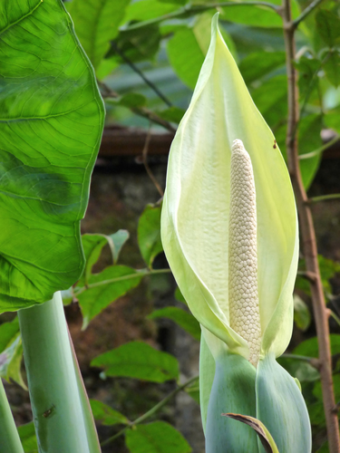

# Cocoyam

> **Node ID**: plants.edible-plants.cocoyam
> **Domain**: [Plants](./index.md)
> **Dependencies**: See prerequisites
> **Enables**: [`Edible Plants`](edible-plants.md)
> **Timeline**: Years 0-5
> **Outputs**: edible_plant_material
> **Critical**: No

## Overview

> *Cocoyam plants in a garden*

> *Image: daSupremo, CC BY-SA 4.0*

Cocoyam

*Xanthosoma sagittifolium* (Araceae) is a root & tuber crop species of major importance for civilization bootstrapping. Chinese taro, Tannia, West Indian kale provides leaves, roots, shoots as its primary edible product and ranks 54/100 on the nutrition score.

Xanthosoma sagittifolium, or tannia, is a tropical flowering plant from the family Araceae. It produces an edible, starchy corm. X. sagittifolium is native to tropical America where it has been first cultivated. Around the 19th century, the plant spread to Southeast Asia and Africa and has been cultivated there ever since. X. sagittifolium is often confused with the related plant Colocasia esculenta (taro), which is similar both in appearance and its uses. Both plants are often collectively named 'cocoyam'. Tannia is among the world’s most important tuber crops and feeds 400 million people worldwide. There are multiple varieties, the two most common being the red flesh and the white flesh variety. They were selectively bred to improve pest and disease resistance, to shorten the time it takes to reach maturity and to improve the cooking quality.

Edible parts: Tubers, Root, Leaves, Vegetable, Leaf stalks, Stem Tannia is a versatile crop with both its corm and leaves suitable for human consumption. The corms can be categorized into smaller secondary corms and main corms. Secondary corms are primarily used in various culinary applications, in similar ways as potatoes. They can be boiled, fried, roasted, steamed, baked, or ground into flour. The leaves of the tannia plant find common culinary use as a leafy green, similar to spinach. In contrast, primary corms are typically designated for animal feed rather than human consumption because of the higher amount of oxalates. In Bolivia, it is called walusa, in Colombia bore, in Costa Rica tiquizque or macal, in Cuba malanga, in Mexico mafafa, in Nicaragua quequisque, in Panama otoe, in Dominican cuisine is called yautía, yautía morada, and yautía coco and ocumo in Venezuela. In Brazil, the leaves are sold as taioba. The tuber (called nampi or malanga) is also used in the cuisine of these countries. The plant is often interplanted within reforestation areas to control weeds and provide shade during the early stages of growth. In Puerto Rican cuisine and Dominican cuisine, the plant and its corm are called yautía. In Dominican Republic as well as in Puerto Rican pasteles en hoja, yautía is ground with squash, potato, green bananas and plantains into a dough-like fluid paste containing pork and ham, and boiled in a banana leaf or paper wrapper. The yautía corm is used in stews, soups, or simply served boiled much like a potato. It is used in local dishes such as guanime, alcapurrias, sancocho, and mondongo. In alcapurrias, it is also ground with green bananas and made into fried croquettes containing picadillo or seafood. Yautía majada is also prepared and consumed when mashed in some instances. Yautía puree is usually served with fish or shellfish cooked in coconut milk. In Suriname and the Netherlands, the plant is called tayer. The shredded root is baked with chicken, fruit juices, salted meat, and spices in the popular Surinamese dish, pom. Eaten over rice or on bread, pom is commonly eaten in Suriname at family gatherings and on special occasions, and is also popular throughout the Netherlands. In Surinamese cuisine the leaves are also often baked with a Maggi-cube (chicken boullion cube) and eaten alongside rice and chicken or salted beef.

Harvesting occurs after about 9 months. Cormels can be removed without moving the mother plant. Corms can be stored for a few weeks. They can be stored for 8 weeks at 7°C with a relative humidity of 80%.

For civilization bootstrapping, cocoyam is significant because of its role as a root & tuber crop. Reliable food production is the foundation upon which all other technological development rests. Understanding the cultivation, processing, and storage of *Xanthosoma sagittifolium* enables communities to establish food security and allocate labor to non-subsistence activities.

*Xanthosoma sagittifolium* is a member of the Araceae family. As a root & tuber crop, it provides essential calories, protein, or other nutrients needed to sustain human populations during the bootstrap process. The ability to produce food reliably from cultivated plants is what separates sedentary civilizations from hunter-gatherer societies, because food surplus allows specialization of labor into toolmaking, construction, and eventually metallurgy and beyond.

This species grows as a perennial or annual depending on climate and management. Propagation is primarily by Seed - rarely produced in cultivation. Division of the smaller corms that are produced on the side of the main corm.. Harvest timing depends on the plant part used: leaves, roots, shoots are typically ready at specific growth stages or seasons.

## Prerequisites

### Materials

- Propagation material: Seed - rarely produced in cultivation. Division of the smaller corms that are produced on the side of the main corm.
- Compost or organic matter for soil amendment
- Mulch material for moisture retention and weed suppression

### Equipment

- Hoe or digging stick for soil preparation and planting
- Sickle, machete, or harvesting knife for crop harvest
- Drying racks or flat drying surfaces for post-harvest processing
- Storage containers: woven baskets, ceramic jars, or sacks for dried product
- Winnowing baskets or screens if processing grains or seeds

### Knowledge

- Species identification: A herb up to 2 m tall. It has a short stem. At the top of the stem it produces large leaves. A corm is produced at the base of the plant. It produces about 10 cormels on the underground corm. These are about 15-25 cm long and flask shaped. The get wider towards the tip. Leaves are large and the stal
- Understanding of planting timing relative to local frost dates and rainy seasons
- Knowledge of soil preparation, seed depth, and spacing requirements
- Recognition of common pests and diseases and their early indicators
- Safe preparation methods for any toxic or bitter compounds (see Safety)

### Infrastructure

- Field or garden site with suitable climate, soil type, and sun exposure
- Reliable water access for germination and establishment phase
- Fenced or protected area if animal browsing is a risk
- Storage structure protected from moisture, rodents, and insects

## Process Description

### Cultivation and Propagation

Xanthosoma taro is normally planted by using the top piece of the main central corm or stem. Pieces weighing 1.5 kg are often used. It can also be grown by using the small side corms which may weigh 0.3 kg; or pieces of the corm can be used as long as they have some buds on them. These are often presprouted before planting. To multiply large amounts of planting material and still achieve acceptable yields, the latter method of using sections of the main corm works well. In crop growth, an axillary bud is produced in the axil of each leaf but only some of these develop into cormels. Often 10 or more cormels develop per plant into cormels 15-25 cm long. The crop duration is about 9 months although crops are often left for 12 months before harvesting. Plants are often planted to make the maximum benefit of natural rainfall. It has been recorded that plants increase in total dry matter production for 6 months then the percentage of dry matter in corm and cormels continues to increase while overall dry matter reduces. This effect may be due to lower rainfall near maturity. They can be planted at any time of the year but in dry areas the middle of the dry season should be avoided. Plants are spaced at varying distances but there is often about 0.9m x 1.5m between plants. A closer spacing of 0.5 m x 0.6 m producing a plant density of 36,800 plants per hectare has given high yields, but variations with rainfall regime and other growth conditions undoubetdly alter this. Closer spacing increases planting requirements but reduces weeding requirements. Soil compaction reduces yields drastically. It reduces plant size as well as the shape and number of cormels. Therefore either naturally lose soils from forest fallow or well cultivated soils are needed. The free water table must be at least 45cm below the soil surface for satisfactory yields. Xanthosoma taro grows better in good soils especially ones with plenty of nitrogen. But is can be grown in relatively poor soils and still give a satisfactory amount of food. It is best suited to alluvial soils with a well distributed rainfall. It is tolerant of shade and is therefore used in intercropping under cacao and coconuts. In such conditions yields are reduced but still satisfactory. Plants deficient in nitrogen give stunted growth, small pale green leaves with short leaf stalks. Potassium produces dead edges around the margin of the leaf. Magnesium gives a bright orange colour between the veins. Sometimes a crop of corms can be harvested after 7 or 8 months but often plants take up to one year to grow a good crop. Where plants are on hillsides the corms are often harvested without actually digging out the whole plant. The soil is carefully dug away from the plant and the small corms are broken off the parent plant. The main stem is then covered to produce a new crop. Weed control is important and it is possible to use herbicides in this regard. The corms will store reasonably well under dry cool well ventilated conditions. The corms will also remain in good condition if they are left growing in the ground and just harvested when needed. Propagation: Seed - rarely produced in cultivation. Division of the smaller corms that are produced on the side of the main corm.

### Distribution and Growing Conditions

### Identification

A herb up to 2 m tall. It has a short stem. At the top of the stem it produces large leaves. A corm is produced at the base of the plant. It produces about 10 cormels on the underground corm. These are about 15-25 cm long and flask shaped. The get wider towards the tip. Leaves are large and the stalk joins to the edge of the leaf. The leaves stand erect on stout petioles. There is a vein around the edge of the leaf. The leaf stalks can be 1 m long. The leaf blade is oval and 50-75 cm long. The leaf has triangular lobes at the bottom. The flower is produced below the leaves. The large bract around the flower is pale green and about 20 cm long. The bases of this overlap. The closely arranged spike of flowers is about 15 cm long. The smaller female section is at the bottom and the male section is larger and towards the top. There is a variety with blue on the stalks and leaves that was called Xanthosoma violaceum. X. mafaffa. The leaves are broad and spearhead shape. They are 60-130 cm long. There is a gap in the leaf blade on either side where the stalk joins which helps distinguish it from Xanthosoma sagittifolium. The edges of the leaves are wavy and they can have bluish or white veins. The flowers are of one sex. The spadix is taller than the spathe. The spathe is white and a vase shape. It is constricted below. It is 25 cm tall.

### Edible Parts and Preparation

#### Harvesting

Cocoyam (tannia, *Xanthosoma sagittifolium*) is harvested 9-12 months after planting, when the lower leaves begin to yellow and die back. The main corm and surrounding cormels (secondary corms) are both edible, though cormels are preferred for human consumption due to lower oxalate content and better texture. The main corm is often reserved for animal feed or replanting.

Harvest by cutting back the above-ground foliage, then carefully digging around the root mass with a fork or digging stick. The cormels (15-25 cm long, flask-shaped) snap off the main corm easily. Handle carefully — the corms bruise easily and damaged areas rot rapidly in storage. Fresh corms can be stored for only 2-8 weeks at 7°C and 80% relative humidity. At ambient tropical temperatures, they deteriorate within 1-2 weeks.

Important distinction from taro (*Colocasia esculenta*): cocoyam cormels grow surrounding a central main corm; taro produces a single large central corm. The two species are frequently confused and collectively called "cocoyam" in West Africa, but their cultivation and processing are similar.

#### Calcium Oxalate and Cooking Safety

**WARNING**: Raw cocoyam contains calcium oxalate crystals (raphides) — microscopic needle-shaped structures that cause severe burning sensation, throat irritation, and swelling of the lips and mouth if consumed without thorough cooking. The oxalate content is highest in the main corm and lower in the cormels, but all parts must be cooked before eating.

**Mandatory cooking before consumption**: Boil cormels for 20-30 minutes in salted or unsalted water until completely tender. Adding a pinch of baking soda (sodium bicarbonate) to the cooking water accelerates oxalate breakdown by raising the pH. The cooking water contains dissolved oxalates — always discard it. Never eat raw or undercooked cocoyam.

Peel the cormels before or after boiling (peeling after is easier — the skin slips off cooked cormels). Some varieties cause skin irritation during peeling of raw corms — wear gloves if handling raw cocoyam causes itching or burning of the hands.

The leaves and young shoots also contain oxalates and must be cooked like the corms — boil for 15-20 minutes minimum. Despite this requirement, cocoyam leaves are an important green vegetable in many tropical cuisines, with protein content of 2.5% and very high vitamin A (3,300 μg/100g).

#### Cooking Methods

- **Boiling**: The most common preparation. Peel and cut cormels into chunks. Boil 20-30 minutes until a fork pierces easily. Drain and discard cooking water. Serve as a starchy staple alongside stews and sauces. Boiled cocoyam has a texture similar to potato but slightly denser and more glutinous.
- **Pounding (fufu)**: After boiling until very soft (30-40 minutes), drain and pound the cooked cormels in a large wooden mortar with a heavy pestle until smooth and elastic (10-15 minutes of vigorous pounding). The resulting fufu is a staple food across West Africa, eaten by tearing off a small piece with the fingers and dipping into soup. Fufu can also be made from a mixture of cocoyam and cassava or plantain.
- **Frying**: Slice boiled cocoyam into slabs or cubes and deep-fry or pan-fry until golden. Serves as a snack or side dish.
- **Roasting**: Wrap unpeeled cormels in leaves or foil and bury in hot embers for 30-45 minutes. The skin chars and peels away, leaving a smoky-flavored starchy interior.
- **Flour**: Peel, slice thin (3-5 mm), and sun-dry cormels for 3-5 days until brittle. Mill the dried slices into flour using a stone mill or mortar. Cocoyam flour stores for 6-12 months and is used for porridges and as a thickener. The drying and milling process further reduces oxalate content.

#### Nutritional Profile

Cocoyam cormels provide approximately 134 kcal/100g (cooked), with 1.6% protein, 30-33% carbohydrate, and modest levels of vitamin C (13.6 mg/100g raw) and iron (0.4 mg/100g). The starch is highly digestible, making cocoyam suitable as infant food once properly cooked. The leaves are nutritionally superior to the corms: 34 kcal/100g but with 2.5% protein and exceptional vitamin A content (3,300 μg/100g).

## Quantitative Parameters

### Nutritional Composition (per 100g)

| Part | Moisture | kJ | kcal | Protein | Vit A | Vit C | Iron | Zinc |
| --- | --- | --- | --- | --- | --- | --- | --- | --- |
| Root | 67.1 | 559 | 134 | 1.6 | 5 | 13.6 | 0.4 | 0.5 |
| Leaves | 90.6 | 143 | 34 | 2.5 | 3300 | 37 | 2 | — |
| Shoots | 89 | 139 | 33 | 3.1 | — | 82 | 0.3 | — |

### Growing Parameters

| Parameter | Value | Notes |
|-----------|-------|-------|
| Annual rainfall | 2,100 mm | Growing requirement |
| Germination temperature | 26°C | Optimal |
| Edible parts | Leaves, Roots, Shoots | Primary harvest |

## Processing and Storage

### Non-Food Uses

The plant is used as a nurse-crop for cacao.

### Storage

Fresh roots and tubers can be stored in cool, dark, well-ventilated conditions. Root cellars or pits lined with straw maintain appropriate temperature and humidity. Avoid washing before storage — soil protects the skin. Check stored roots weekly and remove any showing rot to prevent spread. For longer storage, slice and sun-dry, or process into flour. Some tropical tubers store for weeks at ambient temperature; others require processing within days of harvest.

### Material Handling

Handle cocoyam produce with clean hands and tools to prevent contamination. Remove field heat promptly after harvest by moving product to shade. Process within the recommended timeframe to prevent quality loss. Compost crop residues and processing waste to return organic matter to the soil. Label stored products with harvest date, variety, and any treatments applied.

## Scaling Notes

- **Bench scale**: Individual plants or small garden plot (10-50 plants). Output for direct household consumption. Useful for seed saving, variety selection, and learning the crop's behavior under local conditions.
- **Pilot scale**: Field planting of 0.1 to 1 hectare (500-5,000 plants). Staggered planting or sequential harvests to extend availability. Requires basic hand tools and family-level labor. Surplus can be traded or stored.
- **Production scale**: Multi-hectare cultivation with mechanized planting, harvesting, and processing. Requires plow animals or tractors, grain mills or processing equipment, and bulk storage facilities. Enables community-level food security and trade.
  Reported production data: Harvesting occurs after about 9 months. Cormels can be removed without moving the mother plant. Corms can be stored for a few weeks. They can be stored for 8 weeks at 7°C with a relative humidity of 8

Key scaling challenges include maintaining genetic diversity at plantation scale, managing pest and disease pressure in monoculture, and matching post-harvest processing capacity to harvest volume. Seed saving and variety selection at bench scale directly informs decisions about which cultivars to scale up.

## Troubleshooting

| Problem | Probable Cause | Solution |
|---------|---------------|----------|
| Poor germination | Old seed, wrong soil temperature, planted too deep, or insufficient moisture | Use fresh seed; verify germination temperature range; plant at recommended depth; maintain soil moisture during germination |
| Pest damage | Insect infestation or browsing animals | Hand-pick pests; use companion planting with repellent species; install fencing for larger pests |
| Disease (fungal/bacterial) | Poor air circulation, excessive moisture, infected seed | Space plants adequately; avoid overhead watering; use clean seed from disease-free plants; practice crop rotation |
| Low yield | Nutrient deficiency, water stress, overcrowding, or shade | Amend soil with compost or manure; ensure adequate water at critical growth stages; thin to recommended spacing; plant in full sun |
| Storage losses | Insufficient drying, rodent/insect damage, high humidity | Dry product thoroughly before storage; use sealed containers; inspect stored product regularly; keep storage area clean and dry |
| Quality or safety note | See species-specific notes | There are 57 Xanthosoma species. |

## Safety Considerations

Working with *Xanthosoma sagittifolium* involves the following hazards:

- **Toxicity**: Parts of this plant may contain compounds that are toxic when raw or improperly prepared. Always follow proper preparation procedures before consumption. Verify with multiple authoritative sources.
- Tool injuries during harvest and processing — use sharp tools in good condition and cut away from the body
- Allergic reactions to plant compounds — sensitive individuals should test small quantities first
- Sun exposure and heat stress during field work — schedule heavy work for early morning or late afternoon
- Musculoskeletal strain from repetitive harvesting motions — vary tasks and take regular breaks

### Personal Protective Equipment

- Sturdy gloves when handling plants with irritant sap, spines, or rough surfaces
- Long sleeves and trousers for field work to reduce skin exposure to irritants and insects
- Eye protection when using cutting tools overhead or near face level
- Sun hat and sunscreen for extended field work

### Emergency Procedures

- For suspected plant poisoning: stop eating immediately, save a sample of the plant material, and seek medical attention. Do not induce vomiting unless directed by a medical professional.
- For tool lacerations: apply direct pressure with a clean cloth, elevate the wound, and seek medical attention for cuts deeper than skin level.
- For allergic reaction (swelling, difficulty breathing): discontinue exposure immediately and seek emergency medical help.

## Quality Control

### Acceptance Criteria

- Harvest product shows expected color, texture, size, and flavor for the variety grown
- No visible mold, rot, pest damage, or foreign material in stored product
- Dried products are brittle throughout with no flexible or moist spots
- Seeds intended for storage test at below 14% moisture content

### Testing Methods

- **Visual inspection**: check for discoloration, mold, insect damage, or foreign material
- **Bite test (seeds/grains)**: properly dried seeds crack cleanly; under-dried seeds dent or feel leathery
- **Smell test**: fresh product has characteristic aroma; off-odors indicate spoilage or contamination
- **Snap test (dried products)**: properly dried material snaps rather than bends

### Sampling Protocol

For field-scale production, inspect every 10th plant during harvest for disease and pest damage. Grade each batch by size and quality before storage. Record yield per unit area to track productivity trends across seasons and identify declining performance early.

## Variations and Alternatives

### Other Uses

### Additional Information

It is a commercially cultivated vegetable. Of considerable importance in many coastal and mid altitude areas of Papua New Guinea especially in wetter areas. A major root crop in the humid tropics.

### Notes

There are 57 Xanthosoma species.

### Related Species

- [Water Yam](water-yam.md)
- [Taro](taro.md)
- [Lesser Yam](lesser-yam.md)
- [Beet](beet.md)
- [Jerusalem Artichoke](jerusalem-artichoke.md)

### Cultivar Selection

Within *Xanthosoma sagittifolium*, considerable variation exists in yield, disease resistance, climate adaptation, and quality characteristics. When establishing a cocoyam crop, select varieties adapted to local conditions: day length, temperature range, rainfall pattern, and soil type. Landrace varieties — locally adapted populations maintained by traditional farmers — often outperform modern cultivars under low-input conditions because they have been selected for resilience rather than maximum yield under optimal conditions.

Seed saving from the best-performing plants each generation gradually adapts the variety to local conditions. Select for vigor, disease resistance, appropriate maturity timing, and product quality. Maintain genetic diversity by saving seed from multiple plants rather than a single individual, which preserves the population's ability to adapt to changing conditions and disease pressures.

### Crop Rotation and Companion Planting

*Xanthosoma sagittifolium* benefits from crop rotation to prevent buildup of species-specific pests and diseases. Avoid planting in the same field in consecutive seasons where possible. Follow with a different crop family to break pest cycles and maintain soil health.

Companion planting with aromatic herbs or flowering plants can deter pests and attract beneficial insects. Avoid planting near species that compete for the same nutrients or harbor shared pathogens.

## References

- [Edible Plants](edible-plants.md) — parent capability
- [Plants Domain](./index.md) — domain overview and related capabilities
- [Agave](agave.md) — example plant article format
- [Food Processing](../food-processing/index.md) — downstream processing of harvested crops
- [Agriculture](../agriculture/index.md) — cultivation systems and crop rotation
- Family: Araceae
- Distribution: United Arab Emirates, Afghanistan, Antigua &amp; Barbuda, Armenia, Angola, Argentina, American Samoa, Australia, Azerbaijan, Barbados, Bangladesh, Burkina Faso, Bahrain, Burundi, Benin, Brunei, Bolivia, Brazil, Bahamas, Bhutan and 137 more
- Data sourced from Food Plants International, Wikipedia, and iNaturalist via the Edible Plant Database (ZIM)
- Plants for a Future (pfaf.org) — supplementary cultivation and use data

---
*Part of the [Bootciv Tech Tree](../index.md) · [Plants](./index.md) · [All Domains](../index.md)*
