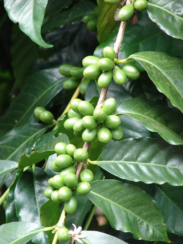

# Coffee

> **Node ID**: plants.edible-plants.coffee
> **Domain**: [Plants](./index.md)
> **Dependencies**: See prerequisites
> **Enables**: [`Edible Plants`](edible-plants.md)
> **Timeline**: Years 0-5
> **Outputs**: edible_plant_material
> **Critical**: No

## Overview

> *A coffee plant (Coffea arabica), its flower and fruit segments bordered by six scenes illustrating its use by man. Coloured lithograph, c. 1840. Iconographic Collections Keywords: Coffee*

> *Image: Wikimedia Commons contributor, CC BY 4.0*

Coffee

*Coffea arabica* (Rubiaceae) is a beverage & stimulant crop species of major importance for civilization bootstrapping. Arabian coffee provides leaves, seeds/nuts, spice/beverage as its primary edible product.

Coffea arabica (), also known as the Arabica coffee, is a species of flowering plant in the coffee and madder family Rubiaceae. It is believed to be the first species of coffee to have been cultivated and is the dominant cultivar, representing about 60% of global production. Coffee produced from the less acidic, more bitter, and more highly caffeinated robusta bean (C. canephora) makes up most of the remaining coffee production. The natural populations of Coffea arabica are restricted to the forests of South Ethiopia and Yemen.

Edible parts: Seeds, Leaves, Herb, Spice, Leaves - tea Coffea arabica accounts for 60% of the world's coffee production. The dried seeds ('beans') are roasted, ground and brewed into one of the two most popular beverages in the world. Coffee is also widely used as a flavouring in ice cream, pastries, candies and liqueurs, and an extract from the seeds serves the same purpose. The seeds have been used as a masticatory since ancient times, and when cooked in butter can be made into rich flat cakes. Dried, roasted green seeds are used as an appetizer, and chocolate-covered roasted seeds are eaten as a gourmet snack. The red fruits and leaves are chewed for their stimulating properties. The cooked leaves have a strong brown colour, a good texture and a relatively neutral flavour with only a hint of bitterness; they contain more caffeine than the fruit and are sometimes brewed as a tea substitute.

Plants normally self pollinate. The fruit develops over 9 months. Coffee bushes bear fruit after 3-4 years and can continue to do so for 50 or 60 years. For best quality the outer layer of the seeds is removed in a pulping machine then fermented while wet for 12-24 hours before drying in the sun and having the parchment removed in a hulling machine. Five kgs of fresh berries would yield about 1 kg of dried clean coffee.

For civilization bootstrapping, coffee is significant because of its role as a beverage & stimulant crop. Reliable food production is the foundation upon which all other technological development rests. Understanding the cultivation, processing, and storage of *Coffea arabica* enables communities to establish food security and allocate labor to non-subsistence activities.

*Coffea arabica* is a member of the Rubiaceae family. As a beverage & stimulant crop, it provides essential calories, protein, or other nutrients needed to sustain human populations during the bootstrap process. The ability to produce food reliably from cultivated plants is what separates sedentary civilizations from hunter-gatherer societies, because food surplus allows specialization of labor into toolmaking, construction, and eventually metallurgy and beyond.

This species grows as a perennial or annual depending on climate and management. Propagation is primarily by Propagation is usually by seed. Optimum germination temperature is around 30–32°C; below 10°C germination is very slow. Seed viability is comparatively short and it is advisable to sow within two months of harvesting, as older seed takes longer to germinate and loses viability over time. Seeds can be planted with the attached parchment, but germination is quicker when this is removed. Seedlings can be raised in shaded nurseries and planted into permanent positions when 6–12 months old. Propagation is also possible by layering, air layering, budding, or single leaf-bud cuttings, which is the most commonly used cutting method.. Harvest timing depends on the plant part used: leaves, seeds/nuts, spice/beverage are typically ready at specific growth stages or seasons.

## Prerequisites

### Materials

- Propagation material: Propagation is usually by seed. Optimum germination temperature is around 30–32°C; below 10°C germination is very slow. Seed viability is comparatively short and it is advisable to sow within two months of harvesting, as older seed takes longer to germinate and loses viability over time. Seeds can be planted with the attached parchment, but germination is quicker when this is removed. Seedlings can be raised in shaded nurseries and planted into permanent positions when 6–12 months old. Propagation is also possible by layering, air layering, budding, or single leaf-bud cuttings, which is the most commonly used cutting method.
- Compost or organic matter for soil amendment
- Mulch material for moisture retention and weed suppression

### Equipment

- Hoe or digging stick for soil preparation and planting
- Sickle, machete, or harvesting knife for crop harvest
- Drying racks or flat drying surfaces for post-harvest processing
- Storage containers: woven baskets, ceramic jars, or sacks for dried product
- Winnowing baskets or screens if processing grains or seeds

### Knowledge

- Species identification: An evergreen shrub. It grows to 3-5 m high and spreads to 3 m across. The stem is slender and the branches are flexible. The leaves are glossy green, oblong, and tapering towards the tip. They occur opposite each other and have easy to see veins. The leaves are 10-15 cm long by 5 cm wide. The flower
- Understanding of planting timing relative to local frost dates and rainy seasons
- Knowledge of soil preparation, seed depth, and spacing requirements
- Recognition of common pests and diseases and their early indicators
- Safe preparation methods for any toxic or bitter compounds (see Safety)

### Infrastructure

- Field or garden site with suitable climate, soil type, and sun exposure
- Reliable water access for germination and establishment phase
- Fenced or protected area if animal browsing is a risk
- Storage structure protected from moisture, rodents, and insects

## Process Description

### Cultivation and Propagation

Coffea arabica can be grown at elevations from 1,300 to 2,800 metres in equatorial regions, with 1,500 - 1,900 metres being most common. The minimum elevation reduces to about 500 metres at a latitude around 15°N or S, whilst in the subtropics, it can be grown from sea level to 1,000 metres. The plant can tolerate low temperatures but not frost. It grows best in areas where annual daytime temperatures are within the range of 14 - 28°c but can tolerate 10 - 34°c. It prefers a mean annual rainfall in the range 1,400 - 2,300mm, but tolerates 750 - 4,200mm. With too much rainfall, the plant tends to develop wood at the expense of flowers and fruits. One to two months of less than 50mm rain facilitates uniform flowering. Heavy rain during and after harvest is not desirable. Coffea arabica prefers a position in light shade. Shading improves leaf and shoot growth but reduces root growth. Coffea arabica prefers deep friable soil on undulating land. Plants are unsuited to stiff clay or sandy soils but are considered tolerant of acid soils. It prefers a pH in the range of 5.5 - 7, tolerating 4.3 - 8.4. Plants can begin to bear within 2 - 3 years and fully bear at the age of 6 - 8 years. The optimum yield of clean, dry coffee beans is 2- 3 tonnes/ha, obtained in Kenya. The average yields are about 0.5 tonnes/ha in Brazil and 0.9 tonnes/ha in Africa. Coffee plants can produce economic yields for 30 - 40 years on average, though this can vary from 10 - 70 years and plants of 80 - 100 years are known. Two to four years after planting, Coffea arabica produces small, white, highly fragrant flowers. The sweet fragrance resembles the sweet smell of jasmine flowers. Following the flowers, red berries appear, which are harvested for the coffee beans inside. The plant is tetraploid, and over 30 mutations have been recognized. In bisexual flowers, pollen is shed shortly after the flower opens, and the stigma is receptive immediately. Self-pollination can occur, as seed sets, even when the flowers are bagged. Pollination is also by honeybees, which collect nectar and pollen from the flowers. Inferior coffee results from picking berries too early or too late. Dwarf varieties are available. Propagation: Propagation is usually by seed. Optimum germination temperature is around 30–32°C; below 10°C germination is very slow. Seed viability is comparatively short and it is advisable to sow within two months of harvesting, as older seed takes longer to germinate and loses viability over time. Seeds can be planted with the attached parchment, but germination is quicker when this is removed. Seedlings can be raised in shaded nurseries and planted into permanent positions when 6–12 months old. Propagation is also possible by layering, air layering, budding, or single leaf-bud cuttings, which is the most commonly used cutting method.

### Distribution and Growing Conditions

### Identification

An evergreen shrub. It grows to 3-5 m high and spreads to 3 m across. The stem is slender and the branches are flexible. The leaves are glossy green, oblong, and tapering towards the tip. They occur opposite each other and have easy to see veins. The leaves are 10-15 cm long by 5 cm wide. The flowering stalks grow from these side branches and have 1-4 flowers. The flowers are white, with 5 petals. They have a scent. Flowers occur in clusters in the axils of leaves. The fruit are green but change to red when ripe. They contain 2 seeds. The seeds are grey-green. They are about 12 mm long. They are flattened on the side where they are pressed together. Coffee seeds are commonly called "beans".

### Edible Parts and Preparation

#### Cherry-to-Cup Processing Chain

Coffee processing transforms the fruit (cherry) of *Coffea arabica* into the roasted bean used for brewing. The complete chain has seven major stages, each critically affecting final flavor quality.

#### Stage 1: Cherry Harvesting

Coffee cherries are hand-picked selectively (only ripe red cherries) or strip-picked (all cherries at once). Selective picking produces higher quality but requires 3-4 passes through the plantation at 7-10 day intervals during the 2-4 month harvest season. A skilled picker harvests 50-100 kg of cherries per day. Coffee bushes begin bearing 3-4 years after planting and continue for 30-60 years.

Cherry composition by weight: skin and pulp (~45%), mucilage (~15%), parchment (~7%), silver skin (~1%), green bean (~32%). Approximately 5 kg of fresh cherries yield 1 kg of dried green beans.

#### Stage 2: Pulping (Wet Process)

The wet (washed) process produces the highest quality coffee and is used for virtually all Arabica:

1. Sort cherries by floating: defective and underripe cherries float in water; sinkers are sound. Remove floaters.
2. Pass cherries through a pulping machine (hand-cranked or motorized) that squeezes the fruit between a rotating drum and a screen, separating the skin and most of the pulp from the bean. Manual alternative: press cherries against a coarse screen by hand or with a wooden pestle. The bean emerges still coated in a sticky mucilage layer.
3. The pulped beans are separated from the removed skins by flotation in a channel of running water.

#### Stage 3: Fermentation

The sticky mucilage (pectinaceous layer) is removed by controlled fermentation:

1. Place pulped beans in a fermentation tank (concrete, wood, or plastic). Beans should be submerged in water or kept moist.
2. Ferment at ambient temperature (18-28°C) for 12-36 hours. Natural pectinolytic microorganisms break down the mucilage. Shorter fermentation (12-18 hours) in warm climates; longer (24-36 hours) in cooler conditions.
3. Test for completion: rub a handful of beans between hands — the mucilage should slip off cleanly, leaving the beans feeling rough and gritty (like wet pebbles), not slimy.
4. **Do not over-ferment**: beyond 36-48 hours, off-flavors develop (fruity, fermented, "stinker" beans) that permanently taint the coffee. Over-fermentation is the most common quality failure at this stage.

Alternative dry (natural) process: skip pulping and fermentation entirely. Dry whole cherries in the sun. Produces a fruitier, heavier-bodied coffee but with less consistency. Common in Ethiopia and Brazil for lower-grade Arabica and for all Robusta.

#### Stage 4: Washing and Sorting

After fermentation, wash the beans thoroughly in clean water, agitating to remove all residual mucilage. Use a series of washing channels or vats. Discard any beans that float at this stage — they are defective (insect-damaged, hollow, or over-fermented). Washed beans are called "parchment coffee" because the bean is still enclosed in its parchment (endocarp) layer.

#### Stage 5: Drying

Drying is the most critical step for long-term quality. Target: 10.5-12% moisture content. Beans that are too moist mold in storage; beans that are too dry become brittle and shatter during hulling.

- **Sun drying**: Spread parchment coffee in thin layers (2-3 cm) on raised drying tables (mesh or bamboo slats) or concrete patios. Turn frequently (every 30-60 minutes during peak sun) for even drying. Requires 10-15 days of good weather. Cover at night or during rain to prevent re-wetting. At higher altitudes (1,500-2,000 m) and lower temperatures, drying takes longer.
- **Mechanical drying**: If available, use a hot-air dryer at 40-50°C for 24-48 hours. Temperatures above 50°C damage the bean and create off-flavors. Mechanical drying is faster but requires fuel and equipment.
- **Test for dryness**: Bite a bean — at proper moisture it is hard and cracks cleanly. At high moisture it is leathery or soft. Alternatively, squeeze a handful — properly dried beans rattle sharply.

Properly dried parchment coffee stores for 6-12 months before quality degradation begins. Store in breathable bags (jute or sisac) in a cool, dry, well-ventilated warehouse. The parchment layer protects the green bean from damage and moisture.

#### Stage 6: Hulling and Sorting

Hulling removes the dry parchment (endocarp) and silver skin from the dried green bean. Traditional method: pound the dried parchment coffee in a mortar with a pestle, then winnow the chaff. At production scale, pass through a hulling machine (friction or impact type) that strips the parchment mechanically.

After hulling, sort green beans by size (sieve grading), density (air classification), and color (hand-picking or optical sorting). Remove defective beans: black (over-fermented), sour (under-fermented), insect-damaged, broken, or discolored. Even 1-2% defective beans significantly affects cup quality.

#### Stage 7: Roasting

Roasting transforms green coffee chemically and physically. Green beans have no aroma; roasting develops 800+ flavor compounds through Maillard reactions, caramelization, and pyrolysis:

| Roast Level | Temperature | Time | Bean Color | Flavor Profile |
|-------------|-------------|------|------------|----------------|
| Light | 180-195°C | 8-10 min | Light brown, dry surface | Bright acidity, origin flavors prominent, fruity/floral |
| Medium | 195-210°C | 10-13 min | Medium brown, dry surface | Balanced acidity and body, caramel sweetness, nutty |
| Medium-dark | 210-225°C | 12-14 min | Dark brown, slight oil | Lower acidity, bittersweet, chocolate, spicy |
| Dark | 225-240°C | 13-15 min | Very dark, oily surface | Low acidity, smoky, bittersweet, carbon notes |

Roasting method: heat beans in a pan, drum, or rotating cylinder over fire or in an oven. Agitate constantly for even roasting — beans scorch easily if stationary. Listen for the "first crack" at approximately 196°C (beans pop audibly as water vapor expands) — this marks the beginning of light roast. A second crack at approximately 224°C signals dark roast. Cool beans rapidly after reaching the desired level by spreading thin on a metal surface or tumbling in a sieve — residual heat continues roasting if beans are piled.

Roasted beans lose 15-20% of their green weight during roasting (primarily water and volatile compounds) but increase in volume by 30-50%. Roasted coffee stales rapidly — use within 2-4 weeks for best flavor. Store in a cool, dark, airtight container.

#### Brewing Methods

Ground roasted coffee is extracted with hot water to produce the beverage:

- **Boiling (cowboy/Turkish)**: Add very fine grounds directly to water, bring to a boil, let settle 2 minutes. Simplest method. Produces a thick, strong, sediment-heavy cup.
- **Decoction (Turkish/ibrik)**: Combine very fine grounds with cold water in a long-handled pot (cezve/ibrik), heat slowly to near-boiling (90-95°C). The foam rises but should not boil over. Repeat the heating cycle 2-3 times. Pour unfiltered into a cup; grounds settle. The traditional method throughout the Ottoman world.
- **Infusion (French press)**: Coarsely ground coffee steeped in water at 92-96°C for 4 minutes, then a metal mesh screen is pressed down to separate grounds. Produces a full-bodied cup with suspended oils (no paper filter to absorb them).
- **Percolation (drip/pour-over)**: Hot water (92-96°C) poured over medium-ground coffee in a filter (cloth, paper, or metal mesh). Gravity draws water through the grounds. Clean, clear cup with pronounced acidity. Water temperature is critical — boiling water scorches coffee, producing bitterness; water below 85°C under-extracts, producing sourness.
- **Decoction (cowboy coffee, simplest bootstrap method)**: Add coarse grounds to a pot of water, bring to a rolling boil for 2-3 minutes, remove from heat, add a splash of cold water to settle grounds, pour carefully. Minimum equipment: a metal or clay pot and a fire.

Standard ratio: 50-60 g ground coffee per liter of water for standard-strength brew. Adjust to taste. Caffeine content: approximately 80-100 mg per 200 ml cup of Arabica coffee.

## Quantitative Parameters

### Growing Parameters

| Parameter | Value | Notes |
|-----------|-------|-------|
| Altitude | 1,000–2,000 m | Growing elevation |
| Germination temperature | 10°C | Optimal |
| Hardiness zones | 10-11 | USDA |
| Edible parts | Leaves, Seeds/Nuts, Spice/Beverage | Primary harvest |

## Processing and Storage

### Non-Food Uses

The plant is often intercropped with food crops such as corn, beans or rice during its early years of growth, and is useful as an understorey plant or hedge. Coffelite, a type of plastic, is made from coffee beans. Coffee combined with iodine is used as a deodorant. The seeds contain caffeine, which has been described as a natural herbicide — it selectively inhibits germination of Amaranthus spinosus seeds. The bark can be made into pulp and parchment or used as manure and mulch. The whitish wood is hard, dense, heavy, tough, durable and takes a polish well; it is suitable for tables, chairs and turnery. Coffea arabica can be grown in a large container of 35 litres or more, and will also grow as an indoor plant, though it is unlikely to fruit indoors.

### Storage

Dry seeds thoroughly to below 14% moisture content before storage. Spread in thin layers on drying racks in full sun, stirring periodically. Test dryness by biting: properly dried seeds crack rather than dent. Store in airtight containers (ceramic jars with tight lids, sealed woven bags) in a cool, dry, dark location. Protect from rodents and insects with tight lids or by mixing with inert ash. Under good conditions, dried grains and legumes store for 1-5 years with minimal loss.

### Material Handling

Handle coffee produce with clean hands and tools to prevent contamination. Remove field heat promptly after harvest by moving product to shade. Process within the recommended timeframe to prevent quality loss. Compost crop residues and processing waste to return organic matter to the soil. Label stored products with harvest date, variety, and any treatments applied.

## Scaling Notes

- **Bench scale**: Individual plants or small garden plot (10-50 plants). Output for direct household consumption. Useful for seed saving, variety selection, and learning the crop's behavior under local conditions.
- **Pilot scale**: Field planting of 0.1 to 1 hectare (500-5,000 plants). Staggered planting or sequential harvests to extend availability. Requires basic hand tools and family-level labor. Surplus can be traded or stored.
- **Production scale**: Multi-hectare cultivation with mechanized planting, harvesting, and processing. Requires plow animals or tractors, grain mills or processing equipment, and bulk storage facilities. Enables community-level food security and trade.
  Reported production data: Plants normally self pollinate. The fruit develops over 9 months. Coffee bushes bear fruit after 3-4 years and can continue to do so for 50 or 60 years. For best quality the outer layer of the seeds i

Key scaling challenges include maintaining genetic diversity at plantation scale, managing pest and disease pressure in monoculture, and matching post-harvest processing capacity to harvest volume. Seed saving and variety selection at bench scale directly informs decisions about which cultivars to scale up.

## Troubleshooting

| Problem | Probable Cause | Solution |
|---------|---------------|----------|
| Poor germination | Old seed, wrong soil temperature, planted too deep, or insufficient moisture | Use fresh seed; verify germination temperature range; plant at recommended depth; maintain soil moisture during germination |
| Pest damage | Insect infestation or browsing animals | Hand-pick pests; use companion planting with repellent species; install fencing for larger pests |
| Disease (fungal/bacterial) | Poor air circulation, excessive moisture, infected seed | Space plants adequately; avoid overhead watering; use clean seed from disease-free plants; practice crop rotation |
| Low yield | Nutrient deficiency, water stress, overcrowding, or shade | Amend soil with compost or manure; ensure adequate water at critical growth stages; thin to recommended spacing; plant in full sun |
| Storage losses | Insufficient drying, rodent/insect damage, high humidity | Dry product thoroughly before storage; use sealed containers; inspect stored product regularly; keep storage area clean and dry |
| Quality or safety note | See species-specific notes | There are about 40 Coffea species. They are mostly in Africa. In Botanical Gardens in Slovenia presumably in a hot house. |

## Safety Considerations

Working with *Coffea arabica* involves the following hazards:

- **Toxicity**: Parts of this plant may contain compounds that are toxic when raw or improperly prepared. Always follow proper preparation procedures before consumption. Verify with multiple authoritative sources.
- Tool injuries during harvest and processing — use sharp tools in good condition and cut away from the body
- Allergic reactions to plant compounds — sensitive individuals should test small quantities first
- Sun exposure and heat stress during field work — schedule heavy work for early morning or late afternoon
- Musculoskeletal strain from repetitive harvesting motions — vary tasks and take regular breaks

### Personal Protective Equipment

- Sturdy gloves when handling plants with irritant sap, spines, or rough surfaces
- Long sleeves and trousers for field work to reduce skin exposure to irritants and insects
- Eye protection when using cutting tools overhead or near face level
- Sun hat and sunscreen for extended field work

### Emergency Procedures

- For suspected plant poisoning: stop eating immediately, save a sample of the plant material, and seek medical attention. Do not induce vomiting unless directed by a medical professional.
- For tool lacerations: apply direct pressure with a clean cloth, elevate the wound, and seek medical attention for cuts deeper than skin level.
- For allergic reaction (swelling, difficulty breathing): discontinue exposure immediately and seek emergency medical help.

## Quality Control

### Acceptance Criteria

- Harvest product shows expected color, texture, size, and flavor for the variety grown
- No visible mold, rot, pest damage, or foreign material in stored product
- Dried products are brittle throughout with no flexible or moist spots
- Seeds intended for storage test at below 14% moisture content

### Testing Methods

- **Visual inspection**: check for discoloration, mold, insect damage, or foreign material
- **Bite test (seeds/grains)**: properly dried seeds crack cleanly; under-dried seeds dent or feel leathery
- **Smell test**: fresh product has characteristic aroma; off-odors indicate spoilage or contamination
- **Snap test (dried products)**: properly dried material snaps rather than bends

### Sampling Protocol

For field-scale production, inspect every 10th plant during harvest for disease and pest damage. Grade each batch by size and quality before storage. Record yield per unit area to track productivity trends across seasons and identify declining performance early.

## Variations and Alternatives

### Medicinal Uses

The seeds contain caffeine, a widely used stimulant added to proprietary painkillers to enhance the effect of aspirin and paracetamol. They also contain theobromine and theophylline, and chlorogenic acid, which is both stimulant and diuretic as well as a known allergen. The seed is a bitter, aromatic, stimulant herb with diuretic effects that also controls vomiting. It is reported to be analgesic, aphrodisiac, anorexic, antidotal, cardiotonic, CNS-stimulant, counter-irritant, hypnotic, galactagogue and nervine. Though not typically classified as a medicinal herb, coffee is a highly effective general stimulant with a particular effect on the central nervous system, improving perception and physical performance. It has been found to help in some cases of headache or migraine. An enema made using coffee beans is an effective cleanser for the large bowel. Coffee is a folk remedy for asthma, atropine poisoning, fever, flu, headache, jaundice, malaria, migraine, narcosis, nephrosis, opium poisoning, sores and vertigo.

### Other Uses

### Additional Information

It is cultivated.

### Notes

There are about 40 Coffea species. They are mostly in Africa. In Botanical Gardens in Slovenia presumably in a hot house.

### Related Species

- [Tea](tea.md)
- [Cacao](cacao.md)
- [Tobacco](tobacco.md)

### Cultivar Selection

Within *Coffea arabica*, considerable variation exists in yield, disease resistance, climate adaptation, and quality characteristics. When establishing a coffee crop, select varieties adapted to local conditions: day length, temperature range, rainfall pattern, and soil type. Landrace varieties — locally adapted populations maintained by traditional farmers — often outperform modern cultivars under low-input conditions because they have been selected for resilience rather than maximum yield under optimal conditions.

Seed saving from the best-performing plants each generation gradually adapts the variety to local conditions. Select for vigor, disease resistance, appropriate maturity timing, and product quality. Maintain genetic diversity by saving seed from multiple plants rather than a single individual, which preserves the population's ability to adapt to changing conditions and disease pressures.

### Crop Rotation and Companion Planting

*Coffea arabica* benefits from crop rotation to prevent buildup of species-specific pests and diseases. Avoid planting in the same field in consecutive seasons where possible. Follow with a different crop family to break pest cycles and maintain soil health.

Companion planting with aromatic herbs or flowering plants can deter pests and attract beneficial insects. Avoid planting near species that compete for the same nutrients or harbor shared pathogens.

## References

- [Edible Plants](edible-plants.md) — parent capability
- [Plants Domain](./index.md) — domain overview and related capabilities
- [Agave](agave.md) — example plant article format
- [Food Processing](../food-processing/index.md) — downstream processing of harvested crops
- [Agriculture](../agriculture/index.md) — cultivation systems and crop rotation
- Family: Rubiaceae
- Distribution: United Arab Emirates, Afghanistan, Antigua &amp; Barbuda, Armenia, Angola, Argentina, Australia, Azerbaijan, Barbados, Bangladesh, Burkina Faso, Bahrain, Burundi, Benin, Brunei, Bolivia, Brazil, Bahamas, Bhutan, Botswana and 136 more
- Data sourced from Food Plants International, Wikipedia, and iNaturalist via the Edible Plant Database (ZIM)
- Plants for a Future (pfaf.org) — supplementary cultivation and use data

---
*Part of the [Bootciv Tech Tree](../index.md) · [Plants](./index.md) · [All Domains](../index.md)*
