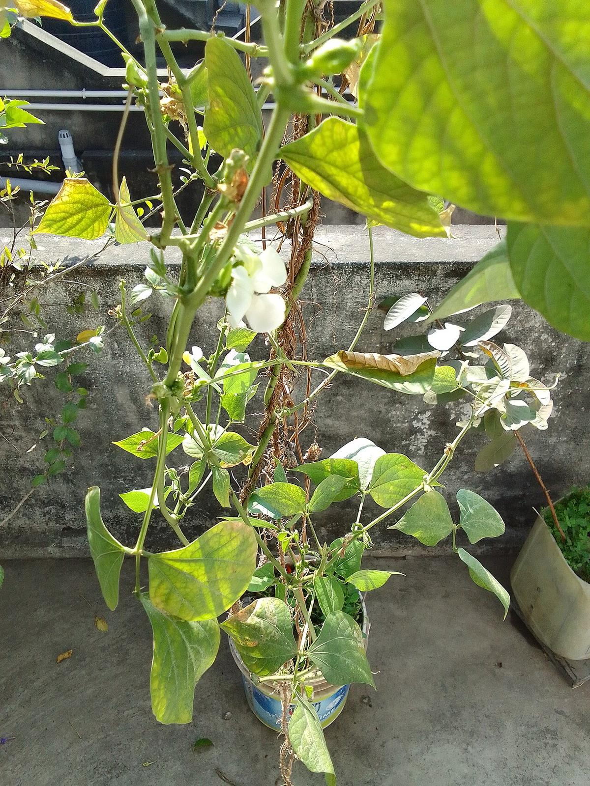

# Common Bean

> **Node ID**: plants.edible-plants.common-bean
> **Domain**: [Plants](./index.md)
> **Dependencies**: See prerequisites
> **Enables**: [`Edible Plants`](edible-plants.md)
> **Timeline**: Years 0-5
> **Outputs**: edible_plant_material
> **Critical**: Yes

## Overview

> *Amino acid score of common bean*

> *Image: Qnc, CC BY-SA 3.0*

Common Bean

*Phaseolus vulgaris* (Fabaceae) is a staple food crop species of major importance for civilization bootstrapping. Common bean provides leaves, seeds/nuts as its primary edible product and ranks 65/100 on the nutrition score.

Phaseolus vulgaris, the common bean, is a herbaceous annual plant. Its botanical classification, along with other Phaseolus species, is as a member of the legume family, Fabaceae. It forms a green-leaved vine which produces beans inside of pods. The common bean has a long history of cultivation. All wild members of the species have a climbing habit, but many cultivars are classified either as bush beans or climbing beans, depending on their style of growth. In 2022, 28 million tonnes of dry common beans were produced worldwide, led by India with 23% of the total. Raw dry beans contain the toxic compound phytohaemagglutinin, which can be deactivated by boiling the beans for 30 minutes. In addition to the beans, the unripe green pods are used for food. The leaf is occasionally used as a vegetable and the straw as fodder.

Edible parts: Pods, Seeds, Leaves, Vegetable Immature green seedpods can be eaten raw or cooked — they have a mild flavour and should only be cooked briefly. For a continued supply of pods, pick them while still small and tender, as flowering slows once seeds begin forming inside the pods. Immature seeds are boiled or steamed and used as a vegetable. Mature seeds are dried and stored; they must be thoroughly cooked before eating and are best soaked in water for about 12 hours first. They can be boiled, baked, pureed, ground into a powder, or fermented into tempeh. The powdered seed works as a protein-enriching additive to flour and can also be used in soups. Seeds can be sprouted and used in salads or cooked. Roasted seeds have been used as a coffee substitute. Very young leaves can be eaten raw as a salad; older leaves are cooked as a potherb. Nutritional composition of leaves per 100g fresh weight: 36 calories; water 86.8%; protein 3.6g; fat 0.4g; carbohydrate 6.6g; fibre 2.8g; ash 2.6g; calcium 2.74mg; phosphorus 75mg; iron 9.2mg; vitamin A 3230mg; thiamine (B1) 0.18mg; riboflavin (B2) 0.06mg; niacin 1.3mg; vitamin C 110mg.

Dwarf kinds take 6-8 weeks to mature and climbing types take 10-12 weeks. Picking starts 2 weeks after flowering. Yields of dried beans of 1,200 kg per hectare are possible. Dried leaves can be stored for later use.

For civilization bootstrapping, common bean is significant because of its role as a staple crop. Reliable food production is the foundation upon which all other technological development rests. Understanding the cultivation, processing, and storage of *Phaseolus vulgaris* enables communities to establish food security and allocate labor to non-subsistence activities.

*Phaseolus vulgaris* is a member of the Fabaceae family. As a staple food crop, it provides essential calories, protein, or other nutrients needed to sustain human populations during the bootstrap process. The ability to produce food reliably from cultivated plants is what separates sedentary civilizations from hunter-gatherer societies, because food surplus allows specialization of labor into toolmaking, construction, and eventually metallurgy and beyond.

This species grows as a perennial or annual depending on climate and management. Propagation is primarily by Pre-soak the seed for 12 hours in warm water and sow in mid-spring in a greenhouse. Germination should occur within 10 days. Prick seedlings out into individual pots when large enough to handle, and plant out after the last expected frosts. Seed can also be sown in situ in late spring, though it may not ripen in a cool summer.. Harvest timing depends on the plant part used: leaves, seeds/nuts are typically ready at specific growth stages or seasons.

## Prerequisites

### Materials

- Propagation material: Pre-soak the seed for 12 hours in warm water and sow in mid-spring in a greenhouse. Germination should occur within 10 days. Prick seedlings out into individual pots when large enough to handle, and plant out after the last expected frosts. Seed can also be sown in situ in late spring, though it may not ripen in a cool summer.
- Compost or organic matter for soil amendment
- Mulch material for moisture retention and weed suppression

### Equipment

- Hoe or digging stick for soil preparation and planting
- Sickle, machete, or harvesting knife for crop harvest
- Drying racks or flat drying surfaces for post-harvest processing
- Storage containers: woven baskets, ceramic jars, or sacks for dried product
- Winnowing baskets or screens if processing grains or seeds

### Knowledge

- Species identification: This bean has very many varieties and varies a lot in details. Both short and climbing cultivated varieties of this bean occur. It has a long taproot. Climbing forms can be 2-3 m tall. Bush types are 20-60 cm tall. The leaves are carried one after another along the stem and the leaves have 3 leaflet
- Understanding of planting timing relative to local frost dates and rainy seasons
- Knowledge of soil preparation, seed depth, and spacing requirements
- Recognition of common pests and diseases and their early indicators
- Safe preparation methods for any toxic or bitter compounds (see Safety)

### Infrastructure

- Field or garden site with suitable climate, soil type, and sun exposure
- Reliable water access for germination and establishment phase
- Fenced or protected area if animal browsing is a risk
- Storage structure protected from moisture, rodents, and insects

## Process Description

### Cultivation and Propagation

Plants are grown from seed. Seed should preferably be planted on raised beds. Climbing types need stakes. Plants are self fertilised. Seeds remain viable for 2 years. Germination is normally good if seed have been well stored. In many places these beans are inter-cropped with other plants. If they are grown on their own, bush types can be spaced at 25 cm by 25 cm. Or they can be put closer together in rows wider apart to make weeding and harvesting easier. For dried beans, once the pods are mature and turning yellow, the whole plants are pulled, then dried and threshed. About 50-75 kg of seed will sow a hectare. Most French bean varieties are daylength neutral so day length does not affect flowering. Propagation: Pre-soak the seed for 12 hours in warm water and sow in mid-spring in a greenhouse. Germination should occur within 10 days. Prick seedlings out into individual pots when large enough to handle, and plant out after the last expected frosts. Seed can also be sown in situ in late spring, though it may not ripen in a cool summer.

### Distribution and Growing Conditions

### Identification

This bean has very many varieties and varies a lot in details. Both short and climbing cultivated varieties of this bean occur. It has a long taproot. Climbing forms can be 2-3 m tall. Bush types are 20-60 cm tall. The leaves are carried one after another along the stem and the leaves have 3 leaflets. The leaf stalk has a groove on the top. The side leaflets are asymmetrical in shape. The leaflets can be 8-15 cm by 5-10 cm. The flowers are in the axils of leaves and have few flowers in a loose form. Flowers are white to purple and pods smooth. Pods are slender and 8-20 cm long by 1-1.5 cm wide. The pods are straight or slightly curved and with a beak at the end. Pods often have 10-12 seeds which are kidney shaped and coloured. There are more than 500 cultivated varieties.

### Edible Parts and Preparation

## Quantitative Parameters

### Nutritional Composition (per 100g)

| Part | Moisture | kJ | kcal | Protein | Vit A | Vit C | Iron | Zinc |
| --- | --- | --- | --- | --- | --- | --- | --- | --- |
| Seeds dry | 10 | 1386 | 332 | 25 | 10 | 1 | 8 | 2.8 |
| Green Pod + Seed | 77.3 | 351 | 84 | 6.6 | 668 | 25 | 1.8 | 1 |
| Seeds green boiled | 80.4 | 304 | 73 | 5.6 | — | 17 | 1.3 | — |
| Green fresh Pods | 88 | 151 | 36 | 2.5 | 750 | 27 | 1.4 | 0.2 |
| Seeds green | 92 | 142 | 34 | 3 | — | 20 | 0.8 | 0.2 |
| Seeds sprouted | 90.7 | 121 | 29 | 4.2 | 0 | 38.7 | 0.8 | 0.4 |
| Leaves raw | 86.8 | — | 36 | 3.6 | — | — | — | — |

### Growing Parameters

| Parameter | Value | Notes |
|-----------|-------|-------|
| Annual rainfall | 350 mm | Growing requirement |
| Germination temperature | 9.5°C | Optimal |
| Hardiness zones | 8-11 | USDA |
| Edible parts | Leaves, Seeds/Nuts | Primary harvest |

## Processing and Storage

### Non-Food Uses

A brown dye is obtained from red kidney beans. The plant contains phaseolin, which has fungicidal activity. Water from cooking the beans is effective at reviving woollen fabrics. The plant residue left after harvesting dried beans can be used as a source of biomass.

### Storage

Dry seeds thoroughly to below 14% moisture content before storage. Spread in thin layers on drying racks in full sun, stirring periodically. Test dryness by biting: properly dried seeds crack rather than dent. Store in airtight containers (ceramic jars with tight lids, sealed woven bags) in a cool, dry, dark location. Protect from rodents and insects with tight lids or by mixing with inert ash. Under good conditions, dried grains and legumes store for 1-5 years with minimal loss.

### Material Handling

Handle common bean produce with clean hands and tools to prevent contamination. Remove field heat promptly after harvest by moving product to shade. Process within the recommended timeframe to prevent quality loss. Compost crop residues and processing waste to return organic matter to the soil. Label stored products with harvest date, variety, and any treatments applied.

## Scaling Notes

- **Bench scale**: Individual plants or small garden plot (10-50 plants). Output for direct household consumption. Useful for seed saving, variety selection, and learning the crop's behavior under local conditions.
- **Pilot scale**: Field planting of 0.1 to 1 hectare (500-5,000 plants). Staggered planting or sequential harvests to extend availability. Requires basic hand tools and family-level labor. Surplus can be traded or stored.
- **Production scale**: Multi-hectare cultivation with mechanized planting, harvesting, and processing. Requires plow animals or tractors, grain mills or processing equipment, and bulk storage facilities. Enables community-level food security and trade.
  Reported production data: Dwarf kinds take 6-8 weeks to mature and climbing types take 10-12 weeks. Picking starts 2 weeks after flowering. Yields of dried beans of 1,200 kg per hectare are possible. Dried leaves can be stored

Key scaling challenges include maintaining genetic diversity at plantation scale, managing pest and disease pressure in monoculture, and matching post-harvest processing capacity to harvest volume. Seed saving and variety selection at bench scale directly informs decisions about which cultivars to scale up.

## Troubleshooting

| Problem | Probable Cause | Solution |
|---------|---------------|----------|
| Poor germination | Old seed, wrong soil temperature, planted too deep, or insufficient moisture | Use fresh seed; verify germination temperature range; plant at recommended depth; maintain soil moisture during germination |
| Pest damage | Insect infestation or browsing animals | Hand-pick pests; use companion planting with repellent species; install fencing for larger pests |
| Disease (fungal/bacterial) | Poor air circulation, excessive moisture, infected seed | Space plants adequately; avoid overhead watering; use clean seed from disease-free plants; practice crop rotation |
| Low yield | Nutrient deficiency, water stress, overcrowding, or shade | Amend soil with compost or manure; ensure adequate water at critical growth stages; thin to recommended spacing; plant in full sun |
| Storage losses | Insufficient drying, rodent/insect damage, high humidity | Dry product thoroughly before storage; use sealed containers; inspect stored product regularly; keep storage area clean and dry |

## Safety Considerations

Working with *Phaseolus vulgaris* involves the following hazards:

- **Toxicity**: Parts of this plant may contain compounds that are toxic when raw or improperly prepared. Always follow proper preparation procedures before consumption. Verify with multiple authoritative sources.
- Tool injuries during harvest and processing — use sharp tools in good condition and cut away from the body
- Allergic reactions to plant compounds — sensitive individuals should test small quantities first
- Sun exposure and heat stress during field work — schedule heavy work for early morning or late afternoon
- Musculoskeletal strain from repetitive harvesting motions — vary tasks and take regular breaks

### Personal Protective Equipment

- Sturdy gloves when handling plants with irritant sap, spines, or rough surfaces
- Long sleeves and trousers for field work to reduce skin exposure to irritants and insects
- Eye protection when using cutting tools overhead or near face level
- Sun hat and sunscreen for extended field work

### Emergency Procedures

- For suspected plant poisoning: stop eating immediately, save a sample of the plant material, and seek medical attention. Do not induce vomiting unless directed by a medical professional.
- For tool lacerations: apply direct pressure with a clean cloth, elevate the wound, and seek medical attention for cuts deeper than skin level.
- For allergic reaction (swelling, difficulty breathing): discontinue exposure immediately and seek emergency medical help.

## Quality Control

### Acceptance Criteria

- Harvest product shows expected color, texture, size, and flavor for the variety grown
- No visible mold, rot, pest damage, or foreign material in stored product
- Dried products are brittle throughout with no flexible or moist spots
- Seeds intended for storage test at below 14% moisture content

### Testing Methods

- **Visual inspection**: check for discoloration, mold, insect damage, or foreign material
- **Bite test (seeds/grains)**: properly dried seeds crack cleanly; under-dried seeds dent or feel leathery
- **Smell test**: fresh product has characteristic aroma; off-odors indicate spoilage or contamination
- **Snap test (dried products)**: properly dried material snaps rather than bends

### Sampling Protocol

For field-scale production, inspect every 10th plant during harvest for disease and pest damage. Grade each batch by size and quality before storage. Record yield per unit area to track productivity trends across seasons and identify declining performance early.

## Variations and Alternatives

### Medicinal Uses

The green pods are mildly diuretic and contain a substance that lowers blood sugar levels; dried mature pods are also reported to be used in the treatment of diabetes. The seed is diuretic, hypoglycaemic, and hypotensive. Ground into flour, it is applied externally to treat ulcers. The seed is also used in the treatment of cancer of the blood. When bruised and boiled with garlic, the seeds have been used to treat persistent coughs. The root is dangerously narcotic. A homeopathic remedy made from the entire fresh herb is used to treat rheumatism, arthritis, and disorders of the urinary tract.

### Other Uses

### Additional Information

It is a commercially cultivated vegetable. Of considerable importance at high altitude locations in the tropics.

### Related Species

- [Wheat](wheat.md)
- [Rice](rice.md)
- [Maize](maize.md)
- [Potato](potato.md)
- [Cassava](cassava.md)

### Cultivar Selection

Within *Phaseolus vulgaris*, considerable variation exists in yield, disease resistance, climate adaptation, and quality characteristics. When establishing a common bean crop, select varieties adapted to local conditions: day length, temperature range, rainfall pattern, and soil type. Landrace varieties — locally adapted populations maintained by traditional farmers — often outperform modern cultivars under low-input conditions because they have been selected for resilience rather than maximum yield under optimal conditions.

Seed saving from the best-performing plants each generation gradually adapts the variety to local conditions. Select for vigor, disease resistance, appropriate maturity timing, and product quality. Maintain genetic diversity by saving seed from multiple plants rather than a single individual, which preserves the population's ability to adapt to changing conditions and disease pressures.

### Crop Rotation and Companion Planting

*Phaseolus vulgaris* benefits from crop rotation to prevent buildup of species-specific pests and diseases. Avoid planting in the same field in consecutive seasons where possible. Follow with a different crop family to break pest cycles and maintain soil health.

Companion planting with aromatic herbs or flowering plants can deter pests and attract beneficial insects. Avoid planting near species that compete for the same nutrients or harbor shared pathogens.

## References

- [Edible Plants](edible-plants.md) — parent capability
- [Plants Domain](./index.md) — domain overview and related capabilities
- [Agave](agave.md) — example plant article format
- [Food Processing](../food-processing/index.md) — downstream processing of harvested crops
- [Agriculture](../agriculture/index.md) — cultivation systems and crop rotation
- Family: Fabaceae
- Distribution: Andorra, United Arab Emirates, Afghanistan, Antigua &amp; Barbuda, Albania, Armenia, Angola, Argentina, Austria, Australia, Azerbaijan, Bosnia &amp; Herzegovina, Barbados, Bangladesh, Belgium, Burkina Faso, Bulgaria, Bahrain, Burundi, Benin and 182 more
- Data sourced from Food Plants International, Wikipedia, and iNaturalist via the Edible Plant Database (ZIM)
- Plants for a Future (pfaf.org) — supplementary cultivation and use data

---
*Part of the [Bootciv Tech Tree](../index.md) · [Plants](./index.md) · [All Domains](../index.md)*
