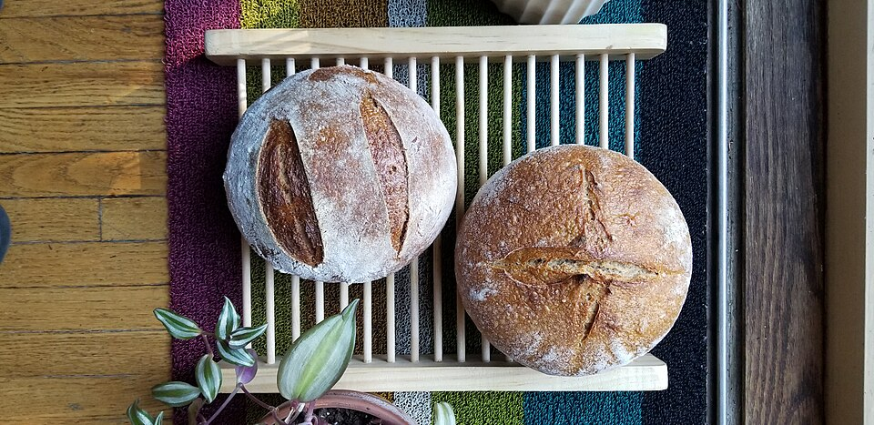

# Einkorn Wheat

> **Node ID**: plants.edible-plants.einkorn-wheat
> **Domain**: [Plants](./index.md)
> **Dependencies**: See prerequisites
> **Enables**: [`Edible Plants`](edible-plants.md)
> **Timeline**: Years 0-5
> **Outputs**: edible_plant_material
> **Critical**: No

## Overview

> *Image: CallMeBarcode, CC BY 4.0*

Einkorn Wheat

*Triticum monococcum* (Poaceae) is a staple food crop species of major importance for civilization bootstrapping. Cultivated einkorn, Einkorn wheat, Small spelt provides seeds/nuts as its primary edible product and ranks 61/100 on the nutrition score.

A 1 m tall annual wheat flowering June to July with seed maturity in August to September. Wind-pollinated hermaphrodite that tolerates sandy, loamy, and clay soils with good drainage, including nutritionally poor soils. Adapts to mildly acid through mildly alkaline pH. Requires full sun and accepts both dry and moist conditions. Not frost tender.

Edible parts: Seeds, Cereal The seed is cooked and most commonly ground into flour for use as a cereal. It is not well suited to bread-making, likely due to a low gluten content. The seed retains its glumes after threshing, which makes processing more difficult.

For civilization bootstrapping, einkorn wheat is significant because of its role as a staple crop. Reliable food production is the foundation upon which all other technological development rests. Understanding the cultivation, processing, and storage of *Triticum monococcum* enables communities to establish food security and allocate labor to non-subsistence activities.

*Triticum monococcum* is a member of the Poaceae family. As a staple food crop, it provides essential calories, protein, or other nutrients needed to sustain human populations during the bootstrap process. The ability to produce food reliably from cultivated plants is what separates sedentary civilizations from hunter-gatherer societies, because food surplus allows specialization of labor into toolmaking, construction, and eventually metallurgy and beyond.

This species grows as a perennial or annual depending on climate and management. Propagation is primarily by Sow seed in early spring or autumn directly in situ, barely covering it. Germination should occur within a few days.. Harvest timing depends on the plant part used: seeds/nuts are typically ready at specific growth stages or seasons.

## Prerequisites

### Materials

- Propagation material: Sow seed in early spring or autumn directly in situ, barely covering it. Germination should occur within a few days.
- Compost or organic matter for soil amendment
- Mulch material for moisture retention and weed suppression

### Equipment

- Hoe or digging stick for soil preparation and planting
- Sickle, machete, or harvesting knife for crop harvest
- Drying racks or flat drying surfaces for post-harvest processing
- Storage containers: woven baskets, ceramic jars, or sacks for dried product
- Winnowing baskets or screens if processing grains or seeds

### Knowledge

- Species identification: A grass plant. It is a one seeded wheat. The grains are small, flinty and like rice.
- Understanding of planting timing relative to local frost dates and rainy seasons
- Knowledge of soil preparation, seed depth, and spacing requirements
- Recognition of common pests and diseases and their early indicators
- Safe preparation methods for any toxic or bitter compounds (see Safety)

### Infrastructure

- Field or garden site with suitable climate, soil type, and sun exposure
- Reliable water access for germination and establishment phase
- Fenced or protected area if animal browsing is a risk
- Storage structure protected from moisture, rodents, and insects

## Process Description

### Cultivation and Propagation

An easily grown plant, it succeeds in most well-drained soils in a sunny position. A low yielding species, but it succeeds in poor rocky soils and thrives in a short growing season. This is supposedly the oldest species of wheat, it probably arose over 10,000 years ago and is still occasionally cultivated for its edible seed in the mountains of Germany, Switzerland and Italy. A diploid species. Propagation: Sow seed in early spring or autumn directly in situ, barely covering it. Germination should occur within a few days.

### Distribution and Growing Conditions

### Identification

A grass plant. It is a one seeded wheat. The grains are small, flinty and like rice.

### Edible Parts and Preparation

## Quantitative Parameters

### Nutritional Composition (per 100g)

| Part | Moisture | kJ | kcal | Protein | Vit A | Vit C | Iron | Zinc |
| --- | --- | --- | --- | --- | --- | --- | --- | --- |
| Seeds | 12.4 | 1399 | 331 | 9.5 | — | — | 3.2 | 3.6 |

### Growing Parameters

| Parameter | Value | Notes |
|-----------|-------|-------|
| Edible parts | Seeds/Nuts | Primary harvest |

## Processing and Storage

### Non-Food Uses

The straw serves many purposes, including as a biomass fuel, thatching material, and garden mulch. Fibre extracted from the stems can be used to make paper: stems are harvested in late summer after seed collection, cut into usable pieces, soaked in clear water for 24 hours, cooked for 2 hours in lye or soda ash, then beaten in a ball mill for 1½ hours, producing a green-tan paper. Starch from the seed is used for laundering and sizing textiles, and can also be converted to alcohol for use as a fuel.

### Storage

Dry seeds thoroughly to below 14% moisture content before storage. Spread in thin layers on drying racks in full sun, stirring periodically. Test dryness by biting: properly dried seeds crack rather than dent. Store in airtight containers (ceramic jars with tight lids, sealed woven bags) in a cool, dry, dark location. Protect from rodents and insects with tight lids or by mixing with inert ash. Under good conditions, dried grains and legumes store for 1-5 years with minimal loss.

### Material Handling

Handle einkorn wheat produce with clean hands and tools to prevent contamination. Remove field heat promptly after harvest by moving product to shade. Process within the recommended timeframe to prevent quality loss. Compost crop residues and processing waste to return organic matter to the soil. Label stored products with harvest date, variety, and any treatments applied.

## Scaling Notes

- **Bench scale**: Individual plants or small garden plot (10-50 plants). Output for direct household consumption. Useful for seed saving, variety selection, and learning the crop's behavior under local conditions.
- **Pilot scale**: Field planting of 0.1 to 1 hectare (500-5,000 plants). Staggered planting or sequential harvests to extend availability. Requires basic hand tools and family-level labor. Surplus can be traded or stored.
- **Production scale**: Multi-hectare cultivation with mechanized planting, harvesting, and processing. Requires plow animals or tractors, grain mills or processing equipment, and bulk storage facilities. Enables community-level food security and trade.

Key scaling challenges include maintaining genetic diversity at plantation scale, managing pest and disease pressure in monoculture, and matching post-harvest processing capacity to harvest volume. Seed saving and variety selection at bench scale directly informs decisions about which cultivars to scale up.

## Troubleshooting

| Problem | Probable Cause | Solution |
|---------|---------------|----------|
| Poor germination | Old seed, wrong soil temperature, planted too deep, or insufficient moisture | Use fresh seed; verify germination temperature range; plant at recommended depth; maintain soil moisture during germination |
| Pest damage | Insect infestation or browsing animals | Hand-pick pests; use companion planting with repellent species; install fencing for larger pests |
| Disease (fungal/bacterial) | Poor air circulation, excessive moisture, infected seed | Space plants adequately; avoid overhead watering; use clean seed from disease-free plants; practice crop rotation |
| Low yield | Nutrient deficiency, water stress, overcrowding, or shade | Amend soil with compost or manure; ensure adequate water at critical growth stages; thin to recommended spacing; plant in full sun |
| Storage losses | Insufficient drying, rodent/insect damage, high humidity | Dry product thoroughly before storage; use sealed containers; inspect stored product regularly; keep storage area clean and dry |

## Safety Considerations

Working with *Triticum monococcum* involves the following hazards:

- Tool injuries during harvest and processing — use sharp tools in good condition and cut away from the body
- Allergic reactions to plant compounds — sensitive individuals should test small quantities first
- Sun exposure and heat stress during field work — schedule heavy work for early morning or late afternoon
- Musculoskeletal strain from repetitive harvesting motions — vary tasks and take regular breaks

### Personal Protective Equipment

- Sturdy gloves when handling plants with irritant sap, spines, or rough surfaces
- Long sleeves and trousers for field work to reduce skin exposure to irritants and insects
- Eye protection when using cutting tools overhead or near face level
- Sun hat and sunscreen for extended field work

### Emergency Procedures

- For suspected plant poisoning: stop eating immediately, save a sample of the plant material, and seek medical attention. Do not induce vomiting unless directed by a medical professional.
- For tool lacerations: apply direct pressure with a clean cloth, elevate the wound, and seek medical attention for cuts deeper than skin level.
- For allergic reaction (swelling, difficulty breathing): discontinue exposure immediately and seek emergency medical help.

## Quality Control

### Acceptance Criteria

- Harvest product shows expected color, texture, size, and flavor for the variety grown
- No visible mold, rot, pest damage, or foreign material in stored product
- Dried products are brittle throughout with no flexible or moist spots
- Seeds intended for storage test at below 14% moisture content

### Testing Methods

- **Visual inspection**: check for discoloration, mold, insect damage, or foreign material
- **Bite test (seeds/grains)**: properly dried seeds crack cleanly; under-dried seeds dent or feel leathery
- **Smell test**: fresh product has characteristic aroma; off-odors indicate spoilage or contamination
- **Snap test (dried products)**: properly dried material snaps rather than bends

### Sampling Protocol

For field-scale production, inspect every 10th plant during harvest for disease and pest damage. Grade each batch by size and quality before storage. Record yield per unit area to track productivity trends across seasons and identify declining performance early.

## Variations and Alternatives

### Medicinal Uses

None known

### Other Uses

### Additional Information

It is a cultivated food plant.

### Related Species

- [Wheat](wheat.md)
- [Rice](rice.md)
- [Maize](maize.md)
- [Potato](potato.md)
- [Cassava](cassava.md)

### Cultivar Selection

Within *Triticum monococcum*, considerable variation exists in yield, disease resistance, climate adaptation, and quality characteristics. When establishing a einkorn wheat crop, select varieties adapted to local conditions: day length, temperature range, rainfall pattern, and soil type. Landrace varieties — locally adapted populations maintained by traditional farmers — often outperform modern cultivars under low-input conditions because they have been selected for resilience rather than maximum yield under optimal conditions.

Seed saving from the best-performing plants each generation gradually adapts the variety to local conditions. Select for vigor, disease resistance, appropriate maturity timing, and product quality. Maintain genetic diversity by saving seed from multiple plants rather than a single individual, which preserves the population's ability to adapt to changing conditions and disease pressures.

### Crop Rotation and Companion Planting

*Triticum monococcum* benefits from crop rotation to prevent buildup of species-specific pests and diseases. Avoid planting in the same field in consecutive seasons where possible. Follow with a different crop family to break pest cycles and maintain soil health.

Companion planting with aromatic herbs or flowering plants can deter pests and attract beneficial insects. Avoid planting near species that compete for the same nutrients or harbor shared pathogens.

## References

- [Edible Plants](edible-plants.md) — parent capability
- [Plants Domain](./index.md) — domain overview and related capabilities
- [Agave](agave.md) — example plant article format
- [Food Processing](../food-processing/index.md) — downstream processing of harvested crops
- [Agriculture](../agriculture/index.md) — cultivation systems and crop rotation
- Family: Poaceae
- Distribution: Andorra, United Arab Emirates, Afghanistan, Antigua &amp; Barbuda, Albania, Armenia, Angola, Austria, Azerbaijan, Bosnia &amp; Herzegovina, Barbados, Bangladesh, Belgium, Burkina Faso, Bulgaria, Bahrain, Burundi, Benin, Brunei, Bahamas and 149 more
- Data sourced from Food Plants International, Wikipedia, and iNaturalist via the Edible Plant Database (ZIM)
- Plants for a Future (pfaf.org) — supplementary cultivation and use data

---
*Part of the [Bootciv Tech Tree](../index.md) · [Plants](./index.md) · [All Domains](../index.md)*
