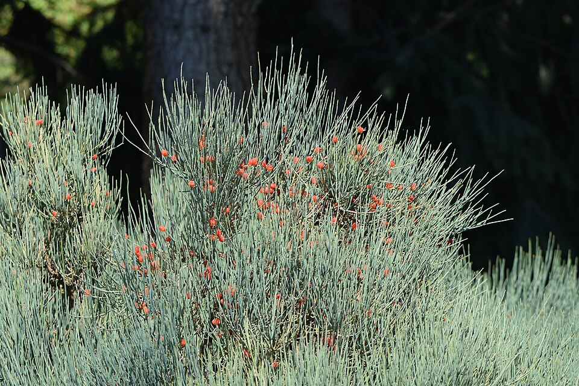

# Ephedra

> **Node ID**: plants.medicinal.ephedra
> **Domain**: [Plants](./index.md)
> **Dependencies**: See prerequisites
> **Enables**: [`Health`](../health/index.md)
> **Timeline**: Years 2-4
> **Outputs**: ephedrine (bronchodilator, decongestant), pseudoephedrine
> **Critical**: No — useful respiratory medicine but alternatives exist

## Overview

> *Image: Krzysztof Ziarnek, Kenraiz, CC BY-SA 4.0*

Ephedra (*Ephedra sinica*, known as ma huang in Chinese medicine) is a gymnosperm shrub native to arid regions of China and Mongolia that produces ephedrine and pseudoephedrine in its green stems. These alkaloids are sympathomimetic amines that dilate the airways (bronchodilation), constrict blood vessels (decongestant), and stimulate the central nervous system. Ephedrine has been used in Chinese medicine for over 5,000 years to treat asthma, colds, and congestion.

Ephedrine works by stimulating adrenergic receptors, mimicking the effect of adrenaline. It relaxes smooth muscle in the airways (making breathing easier in asthma), shrinks swollen nasal tissue (relieving congestion), and increases heart rate and blood pressure. The standard dose is 25-50 mg of ephedrine, 2-3 times per day.

The plant grows 30-60 cm tall with jointed, leafless green stems that photosynthesize. It is adapted to arid, semi-desert conditions with 150-400 mm annual rainfall, poor sandy or gravelly soils, and extreme temperature fluctuations. It is one of the few medicinal plants that thrives in harsh desert conditions where little else grows.

Ephedrine was the primary asthma treatment worldwide until the development of synthetic beta-2 agonists (albuterol/salbutamol) in the 1960s. It remains effective and can be produced from the plant at a low technology level. Pseudoephedrine, a related compound, is the most common decongestant in over-the-counter cold medications.

The plant is a source of concern because ephedrine can be misused as a stimulant and as a precursor for methamphetamine manufacture. At appropriate medical doses, it is safe for short-term use. Long-term use or high doses cause tolerance, dependence, and cardiovascular strain.

Primary outputs: `ephedrine` (bronchodilator for asthma), `pseudoephedrine` (decongestant for colds).

## Prerequisites

### Materials

- Ephedra seeds or rooted cuttings
- Arid or semi-arid site with well-drained, sandy or gravelly soil
- Climate with 150-400 mm annual rainfall

### Equipment

- Harvesting sickle or knife
- Drying screens or racks
- Grinding equipment (mortar and pestle, or mill)
- Extraction vessel (pot or percolator)
- Filter cloth
- Precise weighing equipment for dosing

### Knowledge

- Ephedra species identification (several species produce ephedrine; *E. sinica* is the standard)
- Stem harvest timing and technique
- Hot water extraction of alkaloids
- Dose calculation and safety limits
- Contraindications (heart disease, high blood pressure, anxiety)

### Infrastructure

- Arid planting site
- Drying area with good ventilation
- Medicine preparation workspace

## Process Description

### Cultivation and Harvest

1. Sow seeds in sandy, well-drained soil in spring. Germination is slow and irregular (30-60% over 2-4 weeks). Alternatively, propagate from stem cuttings or divisions.
2. Space plants 30-50 cm apart. Ephedra requires minimal water once established. Overwatering promotes root rot.
3. Allow 2-3 years of growth before first harvest. Alkaloid content increases with plant age.
4. Harvest green stems in late summer to autumn (August-October) when alkaloid content peaks. Cut stems 5-10 cm above the ground. The root crown survives and regrows.
5. Dry stems in a warm, well-ventilated area for 5-10 days until brittle. Avoid direct sunlight, which degrades alkaloids.
6. Grind dried stems to a coarse powder. Store in sealed containers away from light.

### Ephedrine Extraction and Use

1. **Simple decoction**: Add 3-5 g of dried stem powder to 250 ml of boiling water. Simmer for 15 minutes. Strain. Drink 1 cup, 2-3 times per day. Each cup contains approximately 15-30 mg of total alkaloids.
2. **Concentrated decoction**: Boil 30 g of dried stem in 500 ml of water until reduced to 250 ml. Strain. Take 15-30 ml (1-2 tablespoons) as a dose.
3. **Alkaloid extraction (higher technology)**: Extract ground stems with acidified water (1% hydrochloric acid or vinegar) at 60°C for 2 hours. Filter. Add alkali (sodium carbonate or lime) to raise pH to 9-10. Ephedrine free base precipitates or can be extracted with organic solvent (kerosene, ether). Crude ephedrine is obtained by evaporation.

### Process Parameters

| Parameter | Range | Notes |
|-----------|-------|-------|
| Total alkaloids (dried stems) | 0.5-2.5% | Varies by species and growing conditions |
| Ephedrine content | 30-90% of total alkaloids | Primary active compound |
| Pseudoephedrine content | 10-40% of total alkaloids | Secondary active compound |
| Therapeutic dose (ephedrine) | 25-50 mg, 2-3x/day | For asthma or congestion |
| Dried stem equivalent per dose | 2-5 g | Approximate |
| Maximum daily dose (ephedrine) | 150 mg | Do not exceed |
| Stem yield per hectare per harvest | 500-2,000 kg (dry) | 2-3 year old planting |
| Alkaloid yield per hectare | 2.5-50 kg | Depending on variety and conditions |
| First harvest age | 2-3 years | From seed |
| Optimal rainfall | 150-400 mm/year | Arid/semi-arid |
| Drying time | 5-10 days | Warm, ventilated, away from sun |
| Plant spacing | 30-50 cm | In well-drained rows |
| Regrowth after cutting | 2-3 months | New stems from crown |
| Alkaloid ratio (ephedrine:pseudoephedrine) | 3:1 to 8:1 | Species-dependent |

### Extraction and Processing Details

Ephedrine extraction from Ephedra stems uses the alkaloid's dual solubility behavior. Ephedrine free base is soluble in organic solvents and insoluble in water. Ephedrine hydrochloride (salt form) is soluble in water and insoluble in organic solvents. This property allows efficient separation from plant material.

The classic extraction method: boil ground stems in acidified water (1% hydrochloric acid or 5% vinegar) for 2 hours. Filter. Cool the extract to room temperature. Add sodium carbonate (washing soda) or lime to raise pH to 9-10. Ephedrine free base precipitates as white crystals or can be extracted into kerosene or diethyl ether. If using kerosene, separate the kerosene layer and evaporate to obtain crude ephedrine. Purify by dissolving in dilute acid and reprecipitating with alkali.

Yield varies from 0.5-2.5% total alkaloids by dry weight of stems. A 10 kg batch of dried stems from a community plot might yield 50-250 g of crude alkaloids — enough for 1,000-10,000 therapeutic doses. The alkaloid mixture from *E. sinica* is typically 60-80% ephedrine and 20-40% pseudoephedrine, with trace amounts of related compounds.

### Cultivation in Arid Zones

Ephedra is uniquely valuable because it produces medicine in arid zones where few other medicinal plants survive. It requires no irrigation after establishment, tolerates temperatures from -20°C to 45°C, and grows in soils too poor or too dry for food crops. The plant is long-lived (15-30 years) and can be harvested annually by cutting stems above the crown.

Propagation is the main challenge: seeds have low and irregular germination (30-60%), and seedlings grow slowly in their first year. The most reliable method is transplanting 1-year-old seedlings from a nursery bed. Once transplanted to the field, survival rates exceed 90%. Stem cuttings rooted in sand also work but with lower success rates (40-60%).

## Safety Considerations

- Ephedrine stimulates the cardiovascular system. It increases heart rate and blood pressure. Do not use in patients with heart disease, high blood pressure, thyroid disorders, or anxiety.
- Overdose causes nervousness, insomnia, palpitations, headache, sweating, and at high doses, cardiac arrhythmia and stroke.
- Ephedrine is physically addictive with regular use. Tolerance develops within 1-2 weeks of daily use. Do not use for more than 7 consecutive days without a break.
- Do not combine with other stimulants (caffeine, nicotine) as effects are additive and increase cardiovascular risk.
- Ephedrine can cause dangerous interactions with MAO inhibitors and other antidepressants.
- Keep away from children. The therapeutic dose is small and easy to exceed with raw plant material.
- Long-term ephedrine use can cause psychological dependence.

### Personal Protective Equipment

- No special PPE for plant handling
- Precise measurement equipment for dosing
- Labels on all preparations

## Quality Control

### Acceptance Criteria

- **Dried stems**: Green to yellow-green, brittle, no mold, no brown discoloration
- **Stem powder**: Yellow-green, slightly astringent taste, no visible contaminants

### Testing Methods

- Taste test: ephedra has a distinctive bitter, slightly astringent taste. Weak taste may indicate low alkaloid content.
- Physiological test: a small dose (1 g of dried stem as tea) should produce mild alertness and nasal decongestion within 30 minutes. If no effect, the batch may be low in alkaloids.

## Scaling Notes

- **Household plot** (1 m²): 5-10 plants. Annual stem yield: 200-500 g dried. Sufficient for household respiratory medicine.
- **Community plot** (0.01 hectare): 500-1,000 plants. Annual stem yield: 20-100 kg dried. Supports community pharmacy for respiratory conditions.

## Troubleshooting

| Problem | Probable Cause | Solution |
|---------|---------------|----------|
| Stems have low alkaloid content | Harvested too early or wrong species | Wait 2+ years; confirm *E. sinica* or other high-alkaloid species |
| Patient develops palpitations | Ephedrine dose too high | Reduce dose; discontinue if persistent |
| No bronchodilation effect | Under-dosing or non-responsive condition | Increase dose gradually; verify asthma diagnosis |
| Plant dies in field | Root rot from overwatering | Reduce irrigation; ensure excellent drainage |
| Seeds fail to germinate | Old seeds or excess moisture | Use fresh seeds; plant in dry, sandy conditions |

## Variations and Alternatives

- **Ephedra equisetina**: Higher alkaloid content than *E. sinica*. Central Asian species.
- **Ephedra nevadensis** (Mormon tea): North American species with very low alkaloid content. Used as a beverage, not a medicine.
- **Synthetic ephedrine**: Produced industrially from benzaldehyde and methylamine. Requires organic chemistry capability.
- **Albuterol/salbutamol**: Synthetic beta-2 agonist. More selective bronchodilation with fewer cardiovascular side effects. Requires pharmaceutical industry.
- **Caffeine**: Milder bronchodilator. Less effective than ephedrine but safer and more widely available.
- **Stramonium** (*Datura stramonium*): Contains atropine, a bronchodilator. smoked as asthma cigarettes historically. Extremely toxic — the therapeutic dose is very close to the lethal dose. Not recommended.
- **Coffee/tea** (*Coffea arabica*, *Camellia sinensis*): Caffeine provides mild bronchodilation and stimulant effects. Safer than ephedrine but less effective for acute asthma.

### Combination Therapies

Ephedrine is most effective when combined with theophylline (found in tea) for asthma treatment, as the two compounds act through different mechanisms to dilate airways. Traditional Chinese medicine formulations combining ephedra with other herbs (glycyrrhiza, ginkgo) may modify the side-effect profile, though the evidence is primarily traditional rather than clinical. For acute congestion, ephedrine nasal drops (5-10 mg/ml in saline) provide rapid relief within minutes.

## References

- [Health](../health/index.md) — respiratory medicine and treatment
- [White Willow](./salix-alba.md) — comparison medicinal plant
- [Plants Domain](./index.md) — domain overview and related capabilities

### Ephedra Species Comparison

Several *Ephedra* species produce ephedrine alkaloids, but the concentration and ratio of
compounds varies significantly between species. *E. sinica* (Chinese ma huang) contains
0.5-2.5% total alkaloids with 60-80% ephedrine. *E. equisetina* (Central Asian species)
contains similar levels but with a higher proportion of pseudoephedrine. *E. nevadensis*
(Mormon tea, North American) contains only trace amounts and is used as a beverage rather
than medicine.

For practical medical use, the critical distinction is between medicinal species (*E. sinica*,
*E. equisetina*, *E. intermedia*) and non-medicinal species that produce negligible alkaloids.
Correct identification is essential: medicinal species have woody, jointed stems with paired
leaves reduced to scales, while non-medicinal North American species are generally larger
and more branched.

### Combination with Other Medicinal Plants

Traditional Chinese medicine formulas combining ephedra with other herbs achieve effects
that pure ephedrine cannot replicate. The classic formula *ma huang tang* combines ephedra
with cinnamon bark, apricot kernel, and licorice root to treat respiratory infections.
The licorice modulates ephedra's cardiovascular effects while the apricot kernel provides
complementary bronchodilation. These combination approaches reduce side effects while
maintaining therapeutic efficacy — a principle applicable to any plant-based medicine system.

Ephedra is one of the oldest medicinal plants in continuous use, with a documented history spanning over 5,000 years in Chinese medicine. The plant's ability to grow in harsh desert conditions where few other medicinal plants survive makes it a strategic resource for arid-zone healthcare. In traditional practice, ephedra was combined with other herbs to modify its stimulant effects and reduce side effects.

### Ephedra Summary

This species represents an important component of a diversified food production system.
No single crop provides complete nutrition, and dietary diversity is essential for human
health. A civilization bootstrap food system should include grains, legumes, roots, fruits,

---
*Part of the [Bootciv Tech Tree](../index.md) · [Plants](./index.md) · [All Domains](../index.md)*
