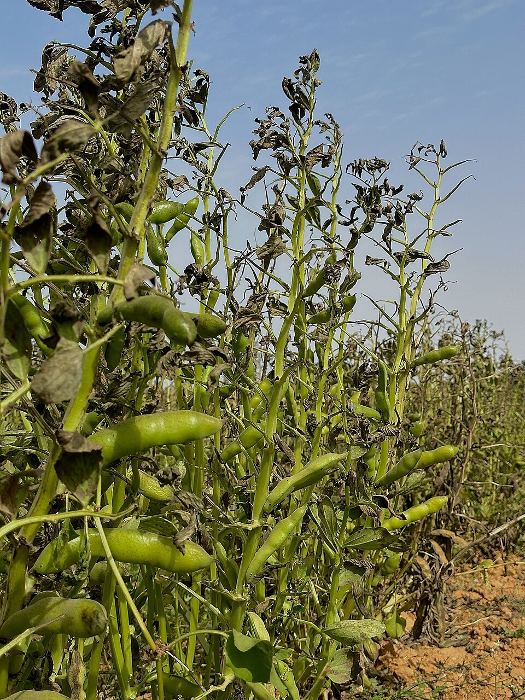

# Fava Bean

> **Node ID**: plants.edible-plants.fava-bean
> **Domain**: [Plants](./index.md)
> **Dependencies**: See prerequisites
> **Enables**: [`Edible Plants`](edible-plants.md)
> **Timeline**: Years 0-5
> **Outputs**: edible_plant_material
> **Critical**: No

## Overview

> *Image: Mhmd.abdrzg, CC BY-SA 4.0*

Fava Bean

*Vicia faba* (Fabaceae) is a legumes & pulse species of major importance for civilization bootstrapping. Broad bean, Faba bean provides leaves, seeds/nuts, flowers as its primary edible product and ranks 74/100 on the nutrition score.

Vicia faba, commonly known as the broad bean, fava bean, or faba bean, is a species of vetch, a flowering plant in the pea and bean family Fabaceae. It is widely cultivated as a crop for human consumption, and also as a cover crop. Varieties with smaller, harder seeds that are fed to horses or other animals are called field bean, tic bean or tick bean. This legume is commonly consumed in many national and regional cuisines. Some people have favism, a hemolytic response to the consumption of broad beans, a condition linked to a metabolic disorder known as G6PDD. Otherwise the beans, with the outer seed coat removed, can be eaten raw or cooked. With young seed pods, the outer seed coat can be eaten, and in very young pods, the entire seed pod can be eaten.

Edible parts: Seeds, Leaves, Pods, Vegetable, Flowers Raw mature broad beans are 11% water, 58% carbohydrates, 26% protein, and 2% fat. A 100-gram reference amount supplies 1,425 kJ (341 kcal; 341 Cal) of food energy and numerous essential nutrients in high content (20% or more of the Daily Value, DV). Folate (26% DV), and dietary minerals, such as manganese, phosphorus, magnesium, and iron (range of 52 to 77% DV), have considerable content. B vitamins have moderate to rich content (19 to 48% DV). Broad beans present the highest protein-to-carbohydrate ratio among other popular pulse crops, such as chickpea, pea and lentil. Moreover, their consumption is recommended along with cereals as both foods are complementary in supplying all essential amino acids. Broad beans are generally eaten while still young and tender, enabling harvesting to begin as early as the middle of spring for plants started under glass or overwintered in a protected location, but even the main crop sown in early spring will be ready from mid to late summer. Horse beans, left to mature fully, are usually harvested in the late autumn, and are then eaten as a pulse. The immature pods are also cooked and eaten, and the young leaves of the plant can also be eaten, either raw or cooked as a pot herb (like spinach). Preparing broad beans involves first removing the beans from their pods, then steaming or boiling the beans, either whole or after parboiling them to loosen their exterior coating, which is then removed. The beans can be fried, causing the skin to split open, and then salted and/or spiced to produce a savory, crunchy snack.

Time to maturity is 12-16 weeks. Yields in the cool tropics vary between 1 and 2 tons per hectare.

For civilization bootstrapping, fava bean is significant because of its role as a legumes & pulse. Reliable food production is the foundation upon which all other technological development rests. Understanding the cultivation, processing, and storage of *Vicia faba* enables communities to establish food security and allocate labor to non-subsistence activities.

*Vicia faba* is a member of the Fabaceae family. As a legumes & pulse, it provides essential calories, protein, or other nutrients needed to sustain human populations during the bootstrap process. The ability to produce food reliably from cultivated plants is what separates sedentary civilizations from hunter-gatherer societies, because food surplus allows specialization of labor into toolmaking, construction, and eventually metallurgy and beyond.

This species grows as a perennial or annual depending on climate and management. Propagation is primarily by Seed - pre-soak for 24 hours in warm water and then sow in situ in succession. Germination should take place in about 7 - 10 days. By making fresh sowings every 3 weeks you will have a continuous supply of fresh young seeds throughout the growing season.. Harvest timing depends on the plant part used: leaves, seeds/nuts, flowers are typically ready at specific growth stages or seasons.

## Prerequisites

### Materials

- Propagation material: Seed - pre-soak for 24 hours in warm water and then sow in situ in succession. Germination should take place in about 7 - 10 days. By making fresh sowings every 3 weeks you will have a continuous supply of fresh young seeds throughout the growing season.
- Compost or organic matter for soil amendment
- Mulch material for moisture retention and weed suppression

### Equipment

- Hoe or digging stick for soil preparation and planting
- Sickle, machete, or harvesting knife for crop harvest
- Drying racks or flat drying surfaces for post-harvest processing
- Storage containers: woven baskets, ceramic jars, or sacks for dried product
- Winnowing baskets or screens if processing grains or seeds

### Knowledge

- Species identification: An upright plant up to 1 m tall. Plants vary in height from 30 cm to 180 cm. It has a well developed taproot. It has square stems which are hollow. They have wings at the angles. There can be 1-7 branches from near the base of the plant. The leaves have leaflets along the leaf stalk and ending in a short point. There are 2-6 leaflets, each 5-10 cm long. Flowers are white with black spots, borne 1-6 per stalk. Pods are large and fleshy, 5-30 cm long, containing several large beans.
- Understanding of planting timing relative to local frost dates and rainy seasons
- Knowledge of soil preparation, seed depth, and spacing requirements
- Recognition of common pests and diseases and their early indicators
- Safe preparation methods for any toxic or bitter compounds (see Safety)

### Infrastructure

- Field or garden site with suitable climate, soil type, and sun exposure
- Reliable water access for germination and establishment phase
- Fenced or protected area if animal browsing is a risk
- Storage structure protected from moisture, rodents, and insects

## Process Description

### Cultivation and Propagation

The crop is grown from seed. Seeds are sown at 15 to 40 cm spacing. If the seed pod formation is poor, it can be improved by pinching out the tops of the plants when in flower. Hand pollination also helps. Plants are self pollinated but also cross pollinated by insects. Propagation: Seed - pre-soak for 24 hours in warm water and then sow in situ in succession. Germination should take place in about 7 - 10 days. By making fresh sowings every 3 weeks you will have a continuous supply of fresh young seeds throughout the growing season.

### Distribution and Growing Conditions

### Identification

An upright plant up to 1 m tall. Plants vary in height from 30 cm to 180 cm. It has a well developed taproot. It has square stems which are hollow. They have wings at the angles. There can be 1-7 branches from near the base of the plant. The leaves have leaflets along the leaf stalk and ending in a short point. There are 2-6 leaflets. These are 5-10 cm long. Flowers occur in the axils of leaves and there are 1-6 flowers on a stalk. The flowers are white with black spots. Pods are large and fat and contain several large beans inside. The pods are 5-10 cm long in field varieties and can be 30 cm long in garden varieties. They are fleshy with a white velvety lining. They become tough and hard at maturity. The seeds can vary a lot in shape and size. They can be flat or rounded and white, green, brown, purple or black. They are 1-2.6 cm long. The hilum along the seeds is prominent.

### Edible Parts and Preparation

**Edible parts**: Seeds, leaves, pods (immature), flowers.

**Preparation methods** by maturity stage:

| Stage | Part | Preparation | Notes |
|-------|------|-------------|-------|
| Young pods (5-10 cm) | Whole pod | Steam or sauté 5-8 min | Tender, no stringing needed |
| Green seeds | Shelled beans | Boil 3-5 min or steam | Remove outer skin after cooking by pinching |
| Mature/dried seeds | Dried beans | Soak 12 hr, boil 45-60 min | Must cook thoroughly to neutralize anti-nutrients |
| Young leaves | Leaves | Raw in salads or cooked as pot herb | Harvest sparingly to avoid reducing yield |
| Flowers | Blossoms | Raw or battered and fried | Seasonal, short harvest window |

Broad beans present the highest protein-to-carbohydrate ratio among pulse crops (chickpea, pea, lentil). Their consumption alongside cereals provides all essential amino acids, making fava-cereal combinations a complete protein source without animal products.

## Quantitative Parameters

### Nutritional Composition (per 100g)

| Part | Moisture | kJ | kcal | Protein | Vit A | Vit C | Iron | Zinc |
| --- | --- | --- | --- | --- | --- | --- | --- | --- |
| Dried Seeds | 10 | 1448 | 346 | 26.2 | 130 | 16 | 6.7 | — |
| Fresh Seeds raw | 76 | 315 | 75 | 7.1 | 35 | 140 | 1.9 | 0.6 |
| Fresh Seeds boiled | 83.7 | 259 | 62 | 4.8 | 27 | 20 | 1.5 | 0.5 |

### Growing Parameters

| Parameter | Value | Notes |
|-----------|-------|-------|
| Germination temperature | 4°C | Optimal |
| Hardiness zones | 8-10 | USDA |
| Edible parts | Leaves, Seeds/Nuts, Flowers | Primary harvest |

## Processing and Storage

### Non-Food Uses

A fibre is obtained from the stems. The burnt stems are rich in potassium and can be used in making soap. The dried stems can be burnt as a fuel. The stems and leaves are sometimes used as a green manure. Broad beans grow well with carrots, cauliflowers, beet, cucumber, cabbages, leeks, celeriac, corn and potatoes, but is inhibited by onions, garlic and shallots.

### Storage

Dry seeds thoroughly to below 14% moisture content before storage. Spread in thin layers on drying racks in full sun, stirring periodically. Test dryness by biting: properly dried seeds crack rather than dent. Store in airtight containers (ceramic jars with tight lids, sealed woven bags) in a cool, dry, dark location. Protect from rodents and insects with tight lids or by mixing with inert ash. Under good conditions, dried grains and legumes store for 1-5 years with minimal loss.

### Material Handling

Handle fava bean produce with clean hands and tools to prevent contamination. Remove field heat promptly after harvest by moving product to shade. Process within the recommended timeframe to prevent quality loss. Compost crop residues and processing waste to return organic matter to the soil. Label stored products with harvest date, variety, and any treatments applied.

## Scaling Notes

- **Bench scale**: Individual plants or small garden plot (10-50 plants). Output for direct household consumption. Useful for seed saving, variety selection, and learning the crop's behavior under local conditions.
- **Pilot scale**: Field planting of 0.1 to 1 hectare (500-5,000 plants). Staggered planting or sequential harvests to extend availability. Requires basic hand tools and family-level labor. Surplus can be traded or stored.
- **Production scale**: Multi-hectare cultivation with mechanized planting, harvesting, and processing. Requires plow animals or tractors, grain mills or processing equipment, and bulk storage facilities. Enables community-level food security and trade.
  Reported production data: Time to maturity is 12-16 weeks. Yields in the cool tropics vary between 1 and 2 tons per hectare.

Key scaling challenges include maintaining genetic diversity at plantation scale, managing pest and disease pressure in monoculture, and matching post-harvest processing capacity to harvest volume. Seed saving and variety selection at bench scale directly informs decisions about which cultivars to scale up.

## Troubleshooting

| Problem | Probable Cause | Solution |
|---------|---------------|----------|
| Poor germination | Old seed, wrong soil temperature, planted too deep, or insufficient moisture | Use fresh seed; verify germination temperature range; plant at recommended depth; maintain soil moisture during germination |
| Pest damage | Insect infestation or browsing animals | Hand-pick pests; use companion planting with repellent species; install fencing for larger pests |
| Disease (fungal/bacterial) | Poor air circulation, excessive moisture, infected seed | Space plants adequately; avoid overhead watering; use clean seed from disease-free plants; practice crop rotation |
| Low yield | Nutrient deficiency, water stress, overcrowding, or shade | Amend soil with compost or manure; ensure adequate water at critical growth stages; thin to recommended spacing; plant in full sun |
| Storage losses | Insufficient drying, rodent/insect damage, high humidity | Dry product thoroughly before storage; use sealed containers; inspect stored product regularly; keep storage area clean and dry |
| Quality or safety note | See species-specific notes | There are about 140 Vicia species. They are mostly temperate. |

## Safety Considerations

Working with *Vicia faba* involves the following hazards:

- **Toxicity**: Parts of this plant may contain compounds that are toxic when raw or improperly prepared. Always follow proper preparation procedures before consumption. Verify with multiple authoritative sources.
- Tool injuries during harvest and processing — use sharp tools in good condition and cut away from the body
- Allergic reactions to plant compounds — sensitive individuals should test small quantities first
- Sun exposure and heat stress during field work — schedule heavy work for early morning or late afternoon
- Musculoskeletal strain from repetitive harvesting motions — vary tasks and take regular breaks

### Personal Protective Equipment

- Sturdy gloves when handling plants with irritant sap, spines, or rough surfaces
- Long sleeves and trousers for field work to reduce skin exposure to irritants and insects
- Eye protection when using cutting tools overhead or near face level
- Sun hat and sunscreen for extended field work

### Emergency Procedures

- For suspected plant poisoning: stop eating immediately, save a sample of the plant material, and seek medical attention. Do not induce vomiting unless directed by a medical professional.
- For tool lacerations: apply direct pressure with a clean cloth, elevate the wound, and seek medical attention for cuts deeper than skin level.
- For allergic reaction (swelling, difficulty breathing): discontinue exposure immediately and seek emergency medical help.

## Quality Control

### Acceptance Criteria

- Harvest product shows expected color, texture, size, and flavor for the variety grown
- No visible mold, rot, pest damage, or foreign material in stored product
- Dried products are brittle throughout with no flexible or moist spots
- Seeds intended for storage test at below 14% moisture content

### Testing Methods

- **Visual inspection**: check for discoloration, mold, insect damage, or foreign material
- **Bite test (seeds/grains)**: properly dried seeds crack cleanly; under-dried seeds dent or feel leathery
- **Smell test**: fresh product has characteristic aroma; off-odors indicate spoilage or contamination
- **Snap test (dried products)**: properly dried material snaps rather than bends

### Sampling Protocol

For field-scale production, inspect every 10th plant during harvest for disease and pest damage. Grade each batch by size and quality before storage. Record yield per unit area to track productivity trends across seasons and identify declining performance early.

## Variations and Alternatives

### Medicinal Uses

The seedpods are diuretic and lithotripic. The inside of the green pods is rubbed on warts to remove them.

### Other Uses

### Additional Information

It is a commercially cultivated vegetable. Moderately common in some highland areas of Papua New Guinea but does not produce well. It is a major crop in China.

### Notes

There are about 140 Vicia species. They are mostly temperate.

### Related Species

- [Garden Pea](garden-pea.md)
- [Lentil](lentil.md)
- [Chickpea](chickpea.md)
- [Cowpea](cowpea.md)
- [White Lupin](white-lupin.md)

### Cultivar Selection

Within *Vicia faba*, considerable variation exists in yield, disease resistance, climate adaptation, and quality characteristics. When establishing a fava bean crop, select varieties adapted to local conditions: day length, temperature range, rainfall pattern, and soil type. Landrace varieties — locally adapted populations maintained by traditional farmers — often outperform modern cultivars under low-input conditions because they have been selected for resilience rather than maximum yield under optimal conditions.

Seed saving from the best-performing plants each generation gradually adapts the variety to local conditions. Select for vigor, disease resistance, appropriate maturity timing, and product quality. Maintain genetic diversity by saving seed from multiple plants rather than a single individual, which preserves the population's ability to adapt to changing conditions and disease pressures.

### Crop Rotation and Companion Planting

*Vicia faba* is a nitrogen-fixing legume, making it an excellent predecessor crop for nitrogen-demanding cereals and brassicas. The root nodules host Rhizobium bacteria that convert atmospheric nitrogen into plant-available forms, leaving residual nitrogen in the soil after harvest. Rotate with non-legume crops to break pest and disease cycles.

Companion planting with aromatic herbs or flowering plants can deter pests and attract beneficial insects. Avoid planting near species that compete for the same nutrients or harbor shared pathogens.

## References

- [Edible Plants](edible-plants.md) — parent capability
- [Plants Domain](./index.md) — domain overview and related capabilities
- [Agave](agave.md) — example plant article format
- [Food Processing](../food-processing/index.md) — downstream processing of harvested crops
- [Agriculture](../agriculture/index.md) — cultivation systems and crop rotation
- Family: Fabaceae
- Distribution: Andorra, United Arab Emirates, Afghanistan, Antigua &amp; Barbuda, Albania, Armenia, Angola, Argentina, Austria, Australia, Azerbaijan, Bosnia &amp; Herzegovina, Barbados, Bangladesh, Belgium, Burkina Faso, Bulgaria, Bahrain, Burundi, Benin and 177 more
- Data sourced from Food Plants International, Wikipedia, and iNaturalist via the Edible Plant Database (ZIM)
- Plants for a Future (pfaf.org) — supplementary cultivation and use data

---
*Part of the [Bootciv Tech Tree](../index.md) · [Plants](./index.md) · [All Domains](../index.md)*
