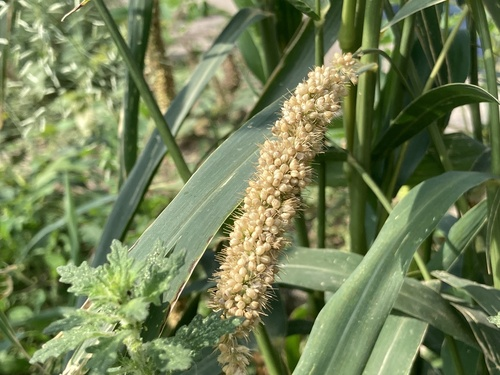

# Foxtail Millet

> **Node ID**: plants.edible-plants.foxtail-millet
> **Domain**: [Plants](./index.md)
> **Dependencies**: See prerequisites
> **Enables**: [`Edible Plants`](edible-plants.md)
> **Timeline**: Years 0-5
> **Outputs**: edible_plant_material
> **Critical**: No

## Overview

> *Foxtail millet (Setaria italica) seeds, India. It is an annual grass grown for human food.*

> *Image: Salil Kumar Mukherjee, CC BY-SA 4.0*

Foxtail Millet

*Setaria italica* (Poaceae) is a staple food crop species of major importance for civilization bootstrapping. Foxtail millet, Indian millet provides seeds/nuts as its primary edible product and ranks 62/100 on the nutrition score.

An annual grass reaching 0.5 m tall with a spread of 0.1 m, hardy to UK zone 6. Flowers August to October with seeds ripening September to October. The plant is hermaphroditic and wind-pollinated. It grows in light sandy, medium loamy, and heavy clay soils, preferring well-drained conditions across mildly acid to mildly alkaline pH ranges. Cannot grow in shade, prefers moist soil, and tolerates drought.

Edible parts: Seeds, Cereal The seeds of foxtail millet can be cooked and eaten as sweet or savoury dishes in all the same ways as rice, or ground into flour for porridge, cakes, and puddings. Sprouting the seed before use makes it slightly sweeter. Most cultivars are non-glutinous, making them suitable for people with coeliac disease. The grain is considered nutritious and is often recommended for the elderly and for pregnant women. Per 100g (dry weight): 384 calories, 10.7g protein, 3.3g fat, 84.2g carbohydrate, 1.4g fibre, 1.8g ash; minerals include 37mg calcium, 275mg phosphorus, 6.2mg iron, 8mg sodium, 281mg potassium; vitamins include 0.48mg thiamine (B1), 0.14mg riboflavin (B2), and 2.48mg niacin.

It grows quickly. Plants mature in 80-120 days. Flowering occurs over 10-15 days. Plants can be self or cross pollinated. Yields of 800-900 kg/ha are common and straw yields for livestock feed can be up to 2,500 kg/ha.

For civilization bootstrapping, foxtail millet is significant because of its role as a staple crop. Reliable food production is the foundation upon which all other technological development rests. Understanding the cultivation, processing, and storage of *Setaria italica* enables communities to establish food security and allocate labor to non-subsistence activities.

*Setaria italica* is a member of the Poaceae family. As a staple food crop, it provides essential calories, protein, or other nutrients needed to sustain human populations during the bootstrap process. The ability to produce food reliably from cultivated plants is what separates sedentary civilizations from hunter-gatherer societies, because food surplus allows specialization of labor into toolmaking, construction, and eventually metallurgy and beyond.

This species grows as a perennial or annual depending on climate and management. Propagation is primarily by Sow seed in early spring in a greenhouse, barely covering it. Germination is usually quick and good. Prick out seedlings into individual pots as soon as they are large enough to handle and grow them on quickly. Plant out in late spring after the last expected frosts. For larger quantities, seed can be sown in situ in mid-spring, though plants may come into flower later and may not ripen seed in a cool summer.. Harvest timing depends on the plant part used: seeds/nuts are typically ready at specific growth stages or seasons.

## Prerequisites

### Materials

- Propagation material: Sow seed in early spring in a greenhouse, barely covering it. Germination is usually quick and good. Prick out seedlings into individual pots as soon as they are large enough to handle and grow them on quickly. Plant out in late spring after the last expected frosts. For larger quantities, seed can be sown in situ in mid-spring, though plants may come into flower later and may not ripen seed in a cool summer.
- Compost or organic matter for soil amendment
- Mulch material for moisture retention and weed suppression

### Equipment

- Hoe or digging stick for soil preparation and planting
- Sickle, machete, or harvesting knife for crop harvest
- Drying racks or flat drying surfaces for post-harvest processing
- Storage containers: woven baskets, ceramic jars, or sacks for dried product
- Winnowing baskets or screens if processing grains or seeds

### Knowledge

- Species identification: An annual millet grass. It grows 1-1.5 m tall. It can be tinged with purple colour. The stalks are upright and the section between the nodes is hollow. It develops tillers from the base. It has along leaf sheath. The leaf blade is 30-45 cm long by 1.2-2.5 cm wide. It has a prominent midrib and taper
- Understanding of planting timing relative to local frost dates and rainy seasons
- Knowledge of soil preparation, seed depth, and spacing requirements
- Recognition of common pests and diseases and their early indicators
- Safe preparation methods for any toxic or bitter compounds (see Safety)

### Infrastructure

- Field or garden site with suitable climate, soil type, and sun exposure
- Reliable water access for germination and establishment phase
- Fenced or protected area if animal browsing is a risk
- Storage structure protected from moisture, rodents, and insects

## Process Description

### Cultivation and Propagation

Plants are grown by seed. Seed can be broadcast or drilled. Pure stands require 8-10 kg/ha of seed. Plants are harvested by cutting off the ears. Propagation: Sow seed in early spring in a greenhouse, barely covering it. Germination is usually quick and good. Prick out seedlings into individual pots as soon as they are large enough to handle and grow them on quickly. Plant out in late spring after the last expected frosts. For larger quantities, seed can be sown in situ in mid-spring, though plants may come into flower later and may not ripen seed in a cool summer.

### Distribution and Growing Conditions

### Identification

An annual millet grass. It grows 1-1.5 m tall. It can be tinged with purple colour. The stalks are upright and the section between the nodes is hollow. It develops tillers from the base. It has along leaf sheath. The leaf blade is 30-45 cm long by 1.2-2.5 cm wide. It has a prominent midrib and tapers towards the tip. The flower is a spike-like branching flower 7.5-25 cm long by 1.2-5 cm wide. The side branches carry 6-12 small spikes each with 1-3 bristles. The mature grain is 2 mm long. There are many named cultivated varieties.

### Edible Parts and Preparation

**Edible parts**: Seeds (grain), prepared as cooked grain, flour, porridge, or fermented foods.

**Threshing**:

Foxtail millet has a compact, bristly seed head (panicle) 7-25 cm long and 1-5 cm wide. The grain is small (2 mm) and enclosed in a papery husk (palea and lemma) that must be removed before cooking:

1. **Harvest**: Cut seed heads when they turn from green to straw-yellow and the bristles become dry and brittle. Harvest promptly — foxtail millet is prone to shattering if left too long.
2. **Dry**: Spread cut heads on drying racks or a clean surface in the sun for 2-3 days until thoroughly dry.
3. **Thresh**: Beat dried heads with a wooden stick or flail on a hard surface. The small grains separate readily — foxtail millet threshes more easily than finger millet because the spikelets are less tightly held. Throughput: 15-25 kg grain/hour by hand. Alternatively, rub the heads between gloved hands (the bristles can irritate bare skin).
4. **Winnow**: Toss the threshed mixture in a basket in a light breeze. The lightweight chaff and bristles blow away while the grain falls. The bristles are irritating to skin and eyes — wear gloves and work upwind.

**Dehulling (abrasive mill)**:

The grain is enclosed in a thin but tough husk that does not separate during threshing (foxtail millet is a hulled millet, unlike proso millet which is naked). Dehulling is essential for palatability:

1. **Mortar and pestle**: The traditional method. Pound grain in a large wooden mortar with a heavy pestle for 10-15 minutes. The abrasive action loosens the husks. Winnow to separate husks from grain. Recovery: 60-75% dehulled grain. Some breakage occurs. Repeat pounding on partially dehulled grain to increase recovery.
2. **Abrasive (pearl) mill**: A rotating stone or emery-coated disc that grinds the husks off the grain. This is significantly faster and more efficient: 85-95% dehulling in a single pass at throughputs of 50-100 kg/hour. The mill must be adjusted so the abrasive action removes the husk without grinding into the grain itself. Setting: gap of 1.0-1.5 mm, depending on grain size.
3. **Rice huller**: A rubber-roller huller designed for rice works well for foxtail millet with minor adjustment. The rollers strip the husk by friction. This is the preferred method when available.
4. **Test for complete dehulling**: Rub a sample of the grain between wet hands. Fully dehulled grain feels smooth; residual husks feel rough and papery. Inspect visually — dehulled grain is yellowish and glossy; hulled grain appears dull and darker.

Dehulling ratio: approximately 1.3 kg unhulled grain yields 1 kg dehulled grain (23% husk by weight).

**Milling**:

Once dehulled, foxtail millet mills easily into flour:

- **Stone mill (quern)**: Set gap slightly wider than for wheat (the grain is smaller and harder). Single pass produces fine flour. Throughput: 2-4 kg/hour on a hand quern.
- **Hammer mill**: Fast and efficient with a 0.5 mm screen. Produces uniform fine flour.
- The flour is pale yellow, slightly sweet, and gluten-free. It has a shorter shelf life than wheat flour due to higher fat content in the bran — store in cool, dry conditions and use within 2-3 months of milling.

**Cooking (1 part grain : 2-3 parts water, 15-20 min)**:

Dehulled foxtail millet cooks quickly and is versatile:

1. **Basic cooked grain**: Rinse 1 part dehulled grain. Bring 2-3 parts water to a boil. Add grain, stir once, and reduce heat to a simmer. Cook 15-20 minutes until water is absorbed and grain is tender. Fluff with a fork. The cooked grain is light, slightly sticky, and has a mild, slightly nutty flavor. It can substitute directly for rice or couscous in most dishes.
2. **Porridge**: Use 1 part grain to 4-5 parts water. Cook 25-30 minutes until thick and soft. Sweeten with honey or fruit. This is the traditional preparation across northern China.
3. **Flatbread**: Mix flour with hot water to form a dough. Knead briefly (no gluten development needed or possible). Flatten into thin rounds and cook on a hot griddle 2-3 minutes per side. The bread is dense and crumbly — best eaten fresh.
4. **Fermented foods**: In China and Korea, foxtail millet is fermented with rhizopus or aspergillus molds to produce fermented pastes and beverages. Soak grain 12 hours, steam until tender, inoculate with a starter culture, and ferment 2-3 days. The fermentation breaks down anti-nutrients and produces a sweet, tangy food.

**Water ratios summary**:

| Preparation | Grain:Water ratio | Cooking time | Result |
|-------------|-------------------|--------------|--------|
| Fluffy grain | 1:2 | 15-20 min | Separate, light grains |
| Sticky grain | 1:1.5 | 15-20 min | Clumping, similar to sticky rice |
| Porridge | 1:4-5 | 25-30 min | Thick, creamy |
| Flour paste | 1:8 (flour:water) | 10 min | Smooth, pourable |

### Nutritional and Practical Significance

Foxtail millet was one of the first cereals domesticated, with archaeological evidence from the Peiligang culture in China dating to ~6000 BCE. Its rapid maturation (80-120 days), drought tolerance, and reliable yields on marginal soils made it a foundational crop for early Chinese agriculture before rice and wheat became dominant.

Nutritional advantages: gluten-free (safe for celiac individuals), good protein quality (10-12% protein with favorable amino acid profile), and rich in B vitamins and minerals. The grain contains significant levels of neuroprotective compounds, including several phenolic acids and flavonoids not found in rice or wheat. Per 100g dry grain: 341 kcal, 9.5-12 g protein, 3.3 g fat, 63-67 g carbohydrate.

Foxtail millet is particularly valuable as a short-season catch crop: if a primary crop (wheat, rice, or maize) fails due to drought, pest, or weather, foxtail millet can be planted in its place and produce a grain harvest within 80-100 days. This "insurance crop" role has sustained farming communities across northern China, Central Asia, and the Indian subcontinent for millennia.

### Comparison with Other Millets

| Property | Foxtail | Finger | Pearl | Proso |
|----------|---------|--------|-------|-------|
| Grain size (mm) | 2 | 1-2 | 2-3 | 2-3 |
| Days to maturity | 80-120 | 90-150 | 75-90 | 60-90 |
| Yield (kg/ha) | 800-1,200 | 450-1,600 | 500-1,500 | 600-1,000 |
| Dehulling difficulty | Moderate | Easy | Moderate | Easy (naked) |
| Cooking time (dehulled) | 15-20 min | 25-30 min | 20-25 min | 15-20 min |
| Protein (%) | 10-12 | 6-8 | 8-12 | 10-12 |
| Calcium (mg/100g) | 37 | 344 | 42 | 14 |
| Gluten-free | Yes | Yes | Yes | Yes |

## Quantitative Parameters

### Nutritional Composition (per 100g)

| Part | Moisture | kJ | kcal | Protein | Vit A | Vit C | Iron | Zinc |
| --- | --- | --- | --- | --- | --- | --- | --- | --- |
| Seeds | 13.5 | 1425 | 341 | 9.5 | — | — | 5.5 | 3.5 |

### Growing Parameters

| Parameter | Value | Notes |
|-----------|-------|-------|
| Yield | 900 kg/ha | Reported yield |
| Growing period | 80–120 days | Maturity range |
| Edible parts | Seeds/Nuts | Primary harvest |

## Processing and Storage

### Non-Food Uses

The plant can be sown in contour strips for erosion control. The straw is used for thatching and bedding in countries such as India. The bran contains up to 9% oil and can be used for oil extraction.

### Storage

Dry seeds thoroughly to below 14% moisture content before storage. Spread in thin layers on drying racks in full sun, stirring periodically. Test dryness by biting: properly dried seeds crack rather than dent. Store in airtight containers (ceramic jars with tight lids, sealed woven bags) in a cool, dry, dark location. Protect from rodents and insects with tight lids or by mixing with inert ash. Under good conditions, dried grains and legumes store for 1-5 years with minimal loss.

### Material Handling

Handle foxtail millet produce with clean hands and tools to prevent contamination. Remove field heat promptly after harvest by moving product to shade. Process within the recommended timeframe to prevent quality loss. Compost crop residues and processing waste to return organic matter to the soil. Label stored products with harvest date, variety, and any treatments applied.

## Scaling Notes

- **Bench scale**: Individual plants or small garden plot (10-50 plants). Output for direct household consumption. Useful for seed saving, variety selection, and learning the crop's behavior under local conditions.
- **Pilot scale**: Field planting of 0.1 to 1 hectare (500-5,000 plants). Staggered planting or sequential harvests to extend availability. Requires basic hand tools and family-level labor. Surplus can be traded or stored.
- **Production scale**: Multi-hectare cultivation with mechanized planting, harvesting, and processing. Requires plow animals or tractors, grain mills or processing equipment, and bulk storage facilities. Enables community-level food security and trade.
  Reported production data: It grows quickly. Plants mature in 80-120 days. Flowering occurs over 10-15 days. Plants can be self or cross pollinated. Yields of 800-900 kg/ha are common and straw yields for livestock feed can be 2,000-4,000 kg/ha. Grain protein content ranges from 10-12%.

Key scaling challenges include maintaining genetic diversity at plantation scale, managing pest and disease pressure in monoculture, and matching post-harvest processing capacity to harvest volume. Seed saving and variety selection at bench scale directly informs decisions about which cultivars to scale up.

## Troubleshooting

| Problem | Probable Cause | Solution |
|---------|---------------|----------|
| Poor germination | Old seed, wrong soil temperature, planted too deep, or insufficient moisture | Use fresh seed; verify germination temperature range; plant at recommended depth; maintain soil moisture during germination |
| Pest damage | Insect infestation or browsing animals | Hand-pick pests; use companion planting with repellent species; install fencing for larger pests |
| Disease (fungal/bacterial) | Poor air circulation, excessive moisture, infected seed | Space plants adequately; avoid overhead watering; use clean seed from disease-free plants; practice crop rotation |
| Low yield | Nutrient deficiency, water stress, overcrowding, or shade | Amend soil with compost or manure; ensure adequate water at critical growth stages; thin to recommended spacing; plant in full sun |
| Storage losses | Insufficient drying, rodent/insect damage, high humidity | Dry product thoroughly before storage; use sealed containers; inspect stored product regularly; keep storage area clean and dry |
| Quality or safety note | See species-specific notes | There are about 130 Setaria species. They are mainly in the tropics and subtropics. |

## Safety Considerations

Working with *Setaria italica* involves the following hazards:

- Tool injuries during harvest and processing — use sharp tools in good condition and cut away from the body
- Allergic reactions to plant compounds — sensitive individuals should test small quantities first
- Sun exposure and heat stress during field work — schedule heavy work for early morning or late afternoon
- Musculoskeletal strain from repetitive harvesting motions — vary tasks and take regular breaks

### Personal Protective Equipment

- Sturdy gloves when handling plants with irritant sap, spines, or rough surfaces
- Long sleeves and trousers for field work to reduce skin exposure to irritants and insects
- Eye protection when using cutting tools overhead or near face level
- Sun hat and sunscreen for extended field work

### Emergency Procedures

- For suspected plant poisoning: stop eating immediately, save a sample of the plant material, and seek medical attention. Do not induce vomiting unless directed by a medical professional.
- For tool lacerations: apply direct pressure with a clean cloth, elevate the wound, and seek medical attention for cuts deeper than skin level.
- For allergic reaction (swelling, difficulty breathing): discontinue exposure immediately and seek emergency medical help.

## Quality Control

### Acceptance Criteria

- Harvest product shows expected color, texture, size, and flavor for the variety grown
- No visible mold, rot, pest damage, or foreign material in stored product
- Dried products are brittle throughout with no flexible or moist spots
- Seeds intended for storage test at below 14% moisture content

### Testing Methods

- **Visual inspection**: check for discoloration, mold, insect damage, or foreign material
- **Bite test (seeds/grains)**: properly dried seeds crack cleanly; under-dried seeds dent or feel leathery
- **Smell test**: fresh product has characteristic aroma; off-odors indicate spoilage or contamination
- **Snap test (dried products)**: properly dried material snaps rather than bends

### Sampling Protocol

For field-scale production, inspect every 10th plant during harvest for disease and pest damage. Grade each batch by size and quality before storage. Record yield per unit area to track productivity trends across seasons and identify declining performance early.

## Variations and Alternatives

### Medicinal Uses

The germinated seed of yellow-seeded cultivars is astringent, digestive, emollient, and stomachic, used in treating dyspepsia, poor digestion, and food stagnancy in the abdomen. White seeds are refrigerant and used for cholera and fever. Green seeds are diuretic and considered strengthening to virility.

### Other Uses

### Additional Information

Foxtail millet is cultivated as a cereal in China. It has many cultivars.

### Notes

There are about 130 Setaria species. They are mainly in the tropics and subtropics.

### Related Species

- [Wheat](wheat.md)
- [Rice](rice.md)
- [Maize](maize.md)
- [Potato](potato.md)
- [Cassava](cassava.md)

### Cultivar Selection

Within *Setaria italica*, considerable variation exists in yield, disease resistance, climate adaptation, and quality characteristics. When establishing a foxtail millet crop, select varieties adapted to local conditions: day length, temperature range, rainfall pattern, and soil type. Landrace varieties — locally adapted populations maintained by traditional farmers — often outperform modern cultivars under low-input conditions because they have been selected for resilience rather than maximum yield under optimal conditions.

Seed saving from the best-performing plants each generation gradually adapts the variety to local conditions. Select for vigor, disease resistance, appropriate maturity timing, and product quality. Maintain genetic diversity by saving seed from multiple plants rather than a single individual, which preserves the population's ability to adapt to changing conditions and disease pressures.

### Crop Rotation and Companion Planting

*Setaria italica* benefits from crop rotation to prevent buildup of species-specific pests and diseases. Avoid planting in the same field in consecutive seasons where possible. Follow with a different crop family to break pest cycles and maintain soil health.

Companion planting with aromatic herbs or flowering plants can deter pests and attract beneficial insects. Avoid planting near species that compete for the same nutrients or harbor shared pathogens.

## References

- [Edible Plants](edible-plants.md) — parent capability
- [Plants Domain](./index.md) — domain overview and related capabilities
- [Agave](agave.md) — example plant article format
- [Food Processing](../food-processing/index.md) — downstream processing of harvested crops
- [Agriculture](../agriculture/index.md) — cultivation systems and crop rotation
- Family: Poaceae
- Distribution: Andorra, United Arab Emirates, Afghanistan, Antigua &amp; Barbuda, Albania, Armenia, Angola, Argentina, Austria, Australia, Azerbaijan, Bosnia &amp; Herzegovina, Barbados, Bangladesh, Belgium, Burkina Faso, Bulgaria, Bahrain, Burundi, Benin and 168 more
- Data sourced from Food Plants International, Wikipedia, and iNaturalist via the Edible Plant Database (ZIM)
- Plants for a Future (pfaf.org) — supplementary cultivation and use data

---
*Part of the [Bootciv Tech Tree](../index.md) · [Plants](./index.md) · [All Domains](../index.md)*
