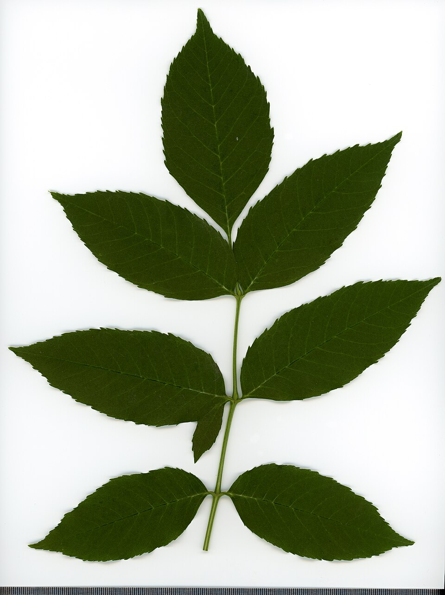

# European Ash

> **Node ID**: plants.timber.european-ash
> **Domain**: [Plants](./index.md)
> **Dependencies**: See prerequisites
> **Enables**: [`Machine Tools`](../machine-tools/index.md), [`Construction`](../construction/index.md)
> **Timeline**: Years 5-40
> **Outputs**: timber (tool handles, bentwood), wood for wheels and shafts
> **Critical**: Yes — premier wood for tool handles, bentwood furniture, and impact-resistant applications

## Overview

> *Fraxinus. Leaf adaxial side. Herbarium of the city Elektrostal Moscow Oblast, 2020 year. Created by scanography. Collection D.Makeev. Scale 1 unit = 1 mm. These are original colors. Please do not make edit.*

> *Image: Dmitry Makeev, CC BY-SA 4.0*

European ash (*Fraxinus excelsior*) produces wood with exceptional toughness, flexibility, and shock resistance. It is the traditional choice for tool handles, baseball bats, wagon wheel rims, bentwood furniture, and any application where wood must absorb repeated impacts without splitting. The wood bends readily when steamed, making it the basis of the bentwood industry that produces chairs, baskets, and boat frames.

Ash wood has a pale cream to light brown color with a pronounced, straight grain. The ring-porous structure creates a distinctive visual pattern that resembles oak but without the medullary rays. Density ranges from 590 to 700 kg/m³ at 12% moisture content, placing it among the heavier European hardwoods.

The tree grows 20 to 35 meters tall with a trunk diameter of 0.6 to 1.5 meters at maturity. Ash tolerates a wide range of soils but grows fastest on moist, fertile, alkaline sites. It reaches harvestable size in 40 to 60 years. The wood has low natural durability (class 5, not durable) and must be kept dry for structural use. This limits outdoor applications unless the wood is protected by paint, oil, or sheltered design.

Ash is threatened by ash dieback (caused by the fungus *Hymenoscyphus fraxineus*) across Europe. Trees showing resistance should be identified and preserved as seed sources.

Primary outputs: `timber` for tool handles, bentwood, and vehicle components.

## Prerequisites

### Materials

- Seeds (samaras) collected from mature trees in autumn, or seedlings from a nursery
- Deep, moist, well-drained soil with pH 6.0-7.5
- Steam source for bending operations (boiling water or steam box)

### Equipment

- Felling axe, crosscut saw, or chainsaw for harvest
- Drawknife and spokeshave for handle shaping
- Steam box (wooden box with steam inlet) or boiling tank for bending
- Bending form (jig) for shaping steamed wood
- Clamps and straps for holding bentwood in shape during drying

### Knowledge

- Identification of ash by compound leaves (7-13 leaflets), opposite branching, and distinctive black buds
- Understanding of growth ring orientation and its effect on bending performance
- Steam bending temperatures, times, and springback compensation
- Handle grain orientation: grain must run parallel to the handle length for maximum strength

### Infrastructure

- Plantation or managed woodland with access road
- Steam bending setup: steam source (boiler), steam box, bending forms
- Seasoning yard for air drying sawn timber
- Workshop with vise and shaping tools for handle production

## Process Description

### Timber Production

1. Select trees with straight, branch-free lower trunks (clear bole of 4-6 meters). Winter felling when sap is down minimizes checking and staining.
2. Fell, limb, and buck into logs. Ash logs are prone to rapid discoloration (blue stain) if not processed within 2-3 weeks of felling, especially in warm weather.
3. Saw logs into boards or billets. For handle stock, quarter-sawn or radial-cut billets provide the straightest grain run.
4. Season boards with stickers in a covered stack. Ash seasons relatively quickly: 25 mm boards air dry in 3-4 months, 50 mm stock in 6-12 months. Kiln drying at 60°C is common to prevent stain.
5. For bending stock, cut billets to the grain direction required, with grain running parallel to the longest dimension. Reject any stock with grain runout (grain exiting the face of the piece).

### Steam Bending

1. Cut bending stock to dimensions slightly oversized (5-10% longer and 2-3 mm wider than final size to account for compression and springback).
2. Place stock in a steam box at 100°C. Steaming time: 1 hour per 25 mm of thickness. A 25 mm thick strip requires approximately 1 hour; a 50 mm piece requires 2 hours.
3. Remove the steamed piece and immediately place it on the bending form. Apply even pressure, working from the center outward to prevent checking on the tension (outer) face.
4. Clamp the piece to the form and allow it to cool and dry in place for 24 to 48 hours.
5. Remove from the form. The piece will spring back (relax) slightly, typically 2-5 degrees less than the form angle. Compensate by over-bending on the form.
6. Allow the bent piece to dry for an additional 1-2 weeks before final shaping.

### Tool Handle Manufacture

1. Select straight-grained ash billets with grain running parallel to the handle length. Reject any piece with grain deviation exceeding 1:15 slope.
2. Rough shape the handle with a drawknife, following the grain. Taper from the head end (where the tool head mounts) to the grip end.
3. Refine with a spokeshave, creating an oval or octagonal cross-section at the grip for comfort.
4. Cut the eye (mortise) at the head end to match the tool head tang or socket. For a hammer or axe, this is a tapered oval hole.
5. Sand smooth and treat with linseed oil to prevent drying and checking. Re-oil handles every 6-12 months during use.

### Process Parameters

| Parameter | Range | Notes |
|-----------|-------|-------|
| Wood density (12% MC) | 590-700 kg/m³ | Heavier than pine, lighter than oak |
| Bending strength (MOR) | 103-120 MPa | High for European hardwoods |
| Impact bending strength | 80-110 kJ/m² | Among the highest of any timber species |
| Modulus of elasticity | 10,000-12,800 MPa | Stiff, yet flexible enough for bending |
| Compression parallel to grain | 46-56 MPa | Moderate |
| Steam bending temperature | 100°C | Saturated steam |
| Steaming time | 1 hour per 25 mm thickness | Minimum for plasticization |
| Seasoning time (25 mm board) | 3-4 months | Air dried |
| Seasoning time (50 mm stock) | 6-12 months | Air dried |
| Natural durability | Class 5 (not durable) | Must be kept dry or treated |
| Volumetric shrinkage | 12.5-14.5% | Moderate to high |
| Tree height at maturity | 20-35 m | 40-60 years |

### Steam Bending Technical Details

Steam bending works by plasticizing the lignin that binds cellulose fibers in the wood cell walls. At 100°C in saturated steam, lignin softens sufficiently to allow the wood to deform without breaking. The key to successful bending is maintaining full steam saturation: any air pockets in the steam box create cool spots where the wood remains rigid and will crack when bent.

Minimum bend radius for ash is approximately 6 times the stock thickness (6:1 ratio). A 25 mm thick strip can be bent to a 150 mm radius without a strap. Using a tension strap (a metal band on the outside of the bend) prevents stretching of the outer fibers and allows tighter bends, down to 4:1 ratio. Springback is unavoidable: the piece relaxes 2-5 degrees from the form angle after removal. Compensate by over-bending on the form or by using a form that is 3-5 degrees tighter than the desired final angle.

Ash accepts steam bending better than almost any other European hardwood because of its long, straight fibers and ring-porous structure. White ash (*F. americana*) is even better. Oak and beech also bend but require longer steaming and are more prone to surface checking on the tension face.

### Tool Handle Design Principles

A well-designed tool handle transfers force from the user's hand to the tool head without creating pressure points, vibration, or risk of splitting. The grain must run parallel to the handle's length for the entire length — any grain deviation creates a weak point where the handle will eventually break under impact.

For impact tools (hammers, axes, mauls), the handle should have some flexibility to absorb shock. Ash excels at this because it bends without breaking and returns to shape. The handle eye (where the tool head mounts) should be slightly tapered so the head wedges tighter with each impact. The grip end should be shaped to fill the hand comfortably, typically oval or octagonal in cross-section, not round (which allows the handle to spin in the hand).

## Safety Considerations

- Ash wood dust is a respiratory irritant and suspected carcinogen (IARC Group 1). Wear a dust mask or respirator when sanding or machining ash.
- Steam bending involves handling wood at 100°C. Wear thick leather gloves and long sleeves to prevent steam burns.
- Bending forms and clamps are under significant tension. Broken steamed wood can snap violently. Stand clear of the tension side during bending.
- Felling mature ash trees is hazardous. Ash is prone to barber-chairing (splitting up the trunk during felling) because of its ring-porous structure. Use a bore cut and leave adequate hinge wood.
- Ash dieback produces brittle, dry branches (deadwood) that can fall without warning. Do not work under the canopy of infected trees.

### Personal Protective Equipment

- Dust mask (N95 minimum) or respirator for sanding and machining operations
- Leather gloves for steam bending and handle shaping
- Safety glasses when using drawknife, spokeshave, or power tools
- Hard hat when felling or working under ash trees

## Quality Control

### Acceptance Criteria

- **Tool handles**: Grain runs parallel to handle length for the full length, no knots larger than 6 mm, no checks or shakes, moisture content 10-15%
- **Bentwood**: Smooth curves with no surface checking on the tension face, uniform bending radius, springback within 5 degrees of form angle
- **Structural timber**: No heartshake, knot clusters limited to 50 mm in 2-meter length, slope of grain less than 1:12

### Testing Methods

- Grain direction check: run a marking gauge along the handle surface. If the gauge catches or skips, grain runout is present and the piece should be rejected for handle use.
- Impact test for handles: clamp the handle at one end and strike the free end with a mallet. A good ash handle flexes and returns without cracking. Cracks indicate cross-grain or hidden defects.
- Moisture content by weight method: weigh sample, oven-dry at 103°C, reweigh. Target: 10-15% for handles, 12-18% for structural timber.

## Scaling Notes

- **Single tree**: Yields 0.5 to 2.0 cubic meters of sawn timber, enough for 50-200 tool handles.
- **Woodland management**: Sustained yield from 10 hectares of managed ash woodland (mixed with other species) provides 5-15 cubic meters of ash timber per year.
- **Bentwood furniture production**: Requires a dedicated steam box (2-4 meters long for chair components), multiple bending forms, and clamping stations. A two-person workshop can produce 10-20 bentwood chairs per week.
- **Key bottleneck**: Grain selection for handle stock. Only a fraction of any ash log yields handle-grade straight grain. The rest goes to furniture, flooring, or lower-grade uses.

## Troubleshooting

| Problem | Probable Cause | Solution |
|---------|---------------|----------|
| Handle splits during use | Cross-grain or grain runout in the handle | Select billets with grain running full handle length; reject any with slope >1:15 |
| Blue stain on sawn timber | Delayed processing after felling, warm weather | Process logs within 1 week of felling; stack with stickers immediately |
| Bentwood cracks on tension face | Insufficient steaming time or too sharp a bend radius | Increase steaming time; use a larger minimum bend radius (10× thickness minimum) |
| Bentwood springback exceeds 5 degrees | Insufficient drying time on form, or wood too green | Extend clamping time on form to 48 hours; use wood at 20-25% MC for bending |
| Ash dieback killing plantation | Fungal infection (*H. fraxineus*) from infected leaf litter | Remove and destroy infected trees; plant diverse species mix; identify and propagate resistant individuals |

## Variations and Alternatives

- **White ash** (*Fraxinus americana*): North American species with nearly identical properties. Preferred for baseball bats and tool handles in North America. Slightly higher density (600-720 kg/m³).
- **Hickory** (*Carya ovata*): Higher impact resistance and better natural durability than ash. The traditional choice for axe handles in North America. Harder to bend but superior for high-impact tools.
- **Oak** (*Quercus robur*): Stronger and more durable than ash, but less flexible and much harder to steam bend. Use oak where durability matters more than flexibility.
- **Beech** (*Fagus sylvatica*): Steam bends well and is widely available, but lower impact resistance than ash. Suitable for bentwood furniture where impact loading is not a concern.
- **Hazel** (*Corylus avellana*): Coppiced shoots provide flexible withies for basket weaving and light structural frameworks. Not as strong as ash but available on a 5-7 year rotation.

### Additional Uses

Ash wood produces excellent firewood, burning hot with minimal smoke even when green (one of the few woods that can be burned unseasoned). Ash keys (winged seeds) were traditionally pickled as a condiment in Britain. The tree is also valued in mixed forestry as a nurse species: its light canopy allows understory growth, and its leaf litter decomposes rapidly, enriching the soil. Ash coppice on a 10-15 year cycle provides poles for fencing, tool handles, and light construction.

## References

- [Machine Tools](../machine-tools/index.md) — tool handles are critical for hand tool operation
- [Construction](../construction/index.md) — structural timber applications
- [Textiles](../textiles/index.md) — bentwood frames for textile equipment
- [Plants Domain](./index.md) — domain overview and related capabilities
- [Scots Pine](./pinus-sylvestris.md) — comparison timber species

### Ash in Traditional Woodworking

Ash has been the preferred wood for tool handles across Europe for centuries. The combination
of toughness (absorbs impact without breaking), flexibility (bends under load and returns),
and workability (easy to shape with hand tools) makes it ideal for hammer handles, axe helves,
shovel shafts, scythe snaths, and any application where the handle receives repeated shocks.

The key to a durable ash handle is grain selection. The grain must run parallel to the handle's
length for the entire length. Any point where the grain exits the surface creates a weak spot
where the handle will eventually break under impact. Experienced handle-makers test each billet
by running a fingernail along the surface — if the nail catches, there is grain runout and the
billet is rejected. This careful selection means that only 10-20% of a typical ash log yields
handle-grade stock; the remainder goes to furniture, flooring, or lower-grade uses.

Ash wood also produces excellent firewood, burning hot with a bright flame and minimal smoke.
It is one of the few woods that can be burned green (unseasoned) with acceptable results,
making it a reliable fuel source even when time for seasoning is limited.

Ash is one of the best firewoods available in Europe, burning hot and long with minimal smoke. It is unique among European hardwoods in that it can be burned green (fresh-cut) with reasonable efficiency, because ash has a relatively low moisture content even when freshly felled. The rhyme "Ash wood wet or ash wood dry, a king will warm his hands by" reflects this valued property.

### European Ash Summary

This species represents an important component of a diversified food production system.

---
*Part of the [Bootciv Tech Tree](../index.md) · [Plants](./index.md) · [All Domains](../index.md)*
