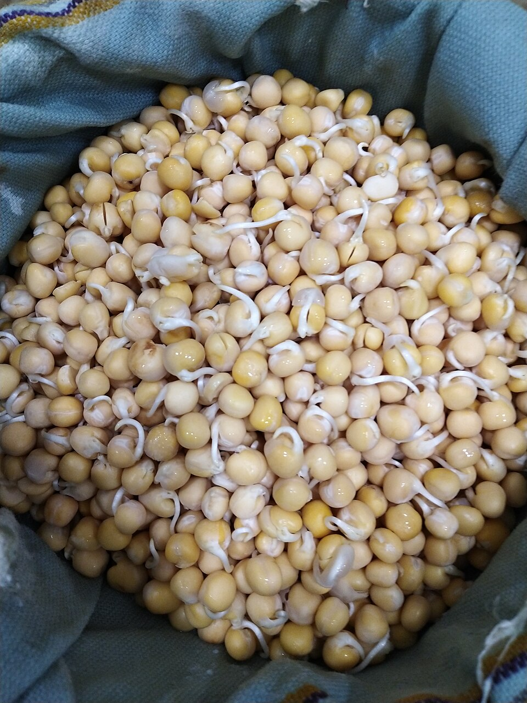

# Garden Pea

> **Node ID**: plants.edible-plants.garden-pea
> **Domain**: [Plants](./index.md)
> **Dependencies**: See prerequisites
> **Enables**: [`Edible Plants`](edible-plants.md)
> **Timeline**: Years 0-5
> **Outputs**: edible_plant_material
> **Critical**: Yes

## Overview

> *Garden pea sprouts ready to be boiled*

> *Image: Yarzaryeni, CC BY 3.0*

Garden Pea

*Pisum sativum* (Fabaceae) is a legumes & pulse species of major importance for civilization bootstrapping. Pea provides leaves, seeds/nuts, flowers as its primary edible product and ranks 67/100 on the nutrition score.

An annual legume growing to 2m tall, hardy to UK zone 3. Flowers May to September with seeds ripening July to October. Hermaphrodite, self-fertile, occasionally bee-pollinated. Capable of fixing atmospheric nitrogen. Prefers light sandy and medium loamy well-drained soils. Requires neutral to mildly alkaline pH. Needs full sun and moist soil conditions.

Edible parts: Seeds, Pods, Leaves, Vegetable, Flowers Immature seedpods can be eaten raw or cooked; they have a sweet flavour though the flesh layer is thin with a fibrous layer beneath. Immature seeds are sweet and delicious eaten raw or lightly cooked — good in salads or as a simple vegetable. The mature seeds are protein-rich and can be cooked as a vegetable or added to soups, and may also be sprouted for use in salads and soups. Dried mature seeds can be ground into a powder to boost the protein content of flour for bread-making. The roasted seed serves as a coffee substitute. Leaves and young shoots are cooked and used as a potherb; the young shoots taste like fresh peas, are exceptionally tender, and can also be used raw in salads. Nutritional composition per 100g of fresh green seed (44 calories): water 76.5%, protein 6.2g, fat 0.4g, carbohydrate 16.9g, fibre 2.4g, ash 0.9g; calcium 32mg, phosphorus 102mg, iron 1.2mg, sodium 6mg, potassium 350mg; vitamin A 405mg, thiamine (B1) 0.28mg, riboflavin (B2) 0.11mg, niacin 2.8mg, vitamin C 27mg.

For civilization bootstrapping, garden pea is significant because of its role as a legumes & pulse. Reliable food production is the foundation upon which all other technological development rests. Understanding the cultivation, processing, and storage of *Pisum sativum* enables communities to establish food security and allocate labor to non-subsistence activities.

*Pisum sativum* is a member of the Fabaceae family. As a legumes & pulse, it provides essential calories, protein, or other nutrients needed to sustain human populations during the bootstrap process. The ability to produce food reliably from cultivated plants is what separates sedentary civilizations from hunter-gatherer societies, because food surplus allows specialization of labor into toolmaking, construction, and eventually metallurgy and beyond.

This species grows as a perennial or annual depending on climate and management. Propagation is primarily by Pre-soak the seed for 24 hours in warm water, then sow in situ in succession from late winter until early summer. A minimum temperature of 10°C is required for germination, which should occur within 7–10 days. Earlier sowings should use hardy round-seeded varieties; later sowings can use the tastier wrinkle-seeded types. Sowing every 3 weeks provides a continuous supply of fresh young seeds from early summer to early autumn. To grow peas to maturity, sow by mid-spring. Protect seed from mice. A further sowing can be made in mid to late autumn, timed so plants reach 15–20cm before the coldest part of winter sets in; they should then overwinter well and grow away rapidly in spring. Choose a suitably hardy variety for this autumn sowing.. Harvest timing depends on the plant part used: leaves, seeds/nuts, flowers are typically ready at specific growth stages or seasons.

## Prerequisites

### Materials

- Propagation material: Pre-soak the seed for 24 hours in warm water, then sow in situ in succession from late winter until early summer. A minimum temperature of 10°C is required for germination, which should occur within 7–10 days. Earlier sowings should use hardy round-seeded varieties; later sowings can use the tastier wrinkle-seeded types. Sowing every 3 weeks provides a continuous supply of fresh young seeds from early summer to early autumn. To grow peas to maturity, sow by mid-spring. Protect seed from mice. A further sowing can be made in mid to late autumn, timed so plants reach 15–20cm before the coldest part of winter sets in; they should then overwinter well and grow away rapidly in spring. Choose a suitably hardy variety for this autumn sowing.
- Compost or organic matter for soil amendment
- Mulch material for moisture retention and weed suppression

### Equipment

- Hoe or digging stick for soil preparation and planting
- Sickle, machete, or harvesting knife for crop harvest
- Drying racks or flat drying surfaces for post-harvest processing
- Storage containers: woven baskets, ceramic jars, or sacks for dried product
- Winnowing baskets or screens if processing grains or seeds

### Knowledge

- Species identification: A short lived herb plant. A creeping plant with white or pink flowers. Plants can be 30 cm to 150 cm tall. It has a well developed tap root and many slender side roots. The stem is weak and round. Leaves are made up of 1-3 pairs of leaflets and a branched tendril at the end. There are large leaf lik
- Understanding of planting timing relative to local frost dates and rainy seasons
- Knowledge of soil preparation, seed depth, and spacing requirements
- Recognition of common pests and diseases and their early indicators
- Safe preparation methods for any toxic or bitter compounds (see Safety)

### Infrastructure

- Field or garden site with suitable climate, soil type, and sun exposure
- Reliable water access for germination and establishment phase
- Fenced or protected area if animal browsing is a risk
- Storage structure protected from moisture, rodents, and insects

## Process Description

### Cultivation and Propagation

Requires a well-drained moisture retentive soil. Prefers a calcareous soil. Prefers a pH in the range 6 to 7.5. Prefers a rich loamy soil. A light soil and a sheltered position is best for early sowings. Peas have long been cultivated as a food crop and a number of distinct forms have emerged which have been classified as follows. A separate record has been made for each form:- P. sativum. The garden pea, including petit pois. Widely cultivated for its sweet-tasting edible immature seeds, as well as the immature seedpods and mature seeds, there are many named varieties and these can provide a crop from May to October. P. sativum arvense. The field pea. Hardier than the garden pea, but not of such good culinary value, it is more often grown as a green manure or for the dried seeds. P. sativum elatius. This is the original form of the species and is still found growing wild in Turkey. P. sativum elatius pumilio. A short, small-flowered form of the above. P. sativum macrocarpon. The edible-pod pea has a swollen, fibre-free and very sweet seedpod which is eaten when immature. The garden pea is widely cultivated and there are many named varieties. There are two basic types of varieties, those with round seeds and those with wrinkled seeds. Round seeded varieties are hardier and can be sown in the autumn to provide an early crop in May or June, wrinkled varieties are sweeter and tastier but are not so hardy and are sown in spring to early summer. Within these two categories, there are dwarf cultivars and climbing cultivars, the taller types tend to yield more heavily and for a longer period but smaller forms are easier to grow, often do not need supports and can give heavier crops from the area of land used (though less from each plant). Cultivars developed for their edible young seeds tend to have pods containing a lot of fibre but some cultivars have now been selected for their larger and fibre-free pods - these cultivars are harder to grow for their seed, especially in damp climates, because the seed has a greater tendency to rot in wet weather. Peas are good growing companions for radishes, carrots, cucumbers, sweet corn, beans and turnips. They are inhibited by alliums, gladiolus, fennel and strawberries growing nearby. There is some evidence that if Chinese mustard (Brassica juncea) is grown as a green manure before sowing peas this will reduce the incidence of soil-borne root rots. This species has a symbiotic relationship with certain soil bacteria, these bacteria form nodules on the roots and fix atmospheric nitrogen. Some of this nitrogen is utilized by the growing plant but some can also be used by other plants growing nearby. When removing plant remains at the end of the growing season, it is best to only remove the aerial parts of the plant, leaving the roots in the ground to decay and release their nitrogen. Pisum sativum (common pea) is typically grown as a cool-season annual and is suited to USDA Hardiness Zones 2 through 9. It is not frost-tender during early stages and can be sown very early in spring, often as soon as the soil is workable. In warmer zones (8–9), it can also be grown as a fall or winter crop, as peas prefer cool temperatures and tend to struggle in the heat of summer. While not a perennial, the plant can tolerate light frosts, especially before flowering. Because of its adaptability and short growing season, Pisum sativum is widely cultivated across a broad range of temperate climates. Propagation: Pre-soak the seed for 24 hours in warm water, then sow in situ in succession from late winter until early summer. A minimum temperature of 10°C is required for germination, which should occur within 7–10 days. Earlier sowings should use hardy round-seeded varieties; later sowings can use the tastier wrinkle-seeded types. Sowing every 3 weeks provides a continuous supply of fresh young seeds from early summer to early autumn. To grow peas to maturity, sow by mid-spring. Protect seed from mice. A further sowing can be made in mid to late autumn, timed so plants reach 15–20cm before the coldest part of winter sets in; they should then overwinter well and grow away rapidly in spring. Choose a suitably hardy variety for this autumn sowing.

### Distribution and Growing Conditions

### Identification

A short lived herb plant. A creeping plant with white or pink flowers. Plants can be 30 cm to 150 cm tall. It has a well developed tap root and many slender side roots. The stem is weak and round. Leaves are made up of 1-3 pairs of leaflets and a branched tendril at the end. There are large leaf like stipules at the base of the leaf. The lower half of these stipules has teeth. The flowers occur in the axils of leaves and are either on their own or in 2-3 flowered clusters with equal length stalks. The flowers are pink or purple in varieties grown for dry seeds and usually white in kinds grown for fresh pods. The pods are swollen and green and can have up to 10 seeds inside. Seed shape can vary. Large numbers of varieties have been recorded. Now Lathyrus oleraceus

### Edible Parts and Preparation

## Quantitative Parameters

### Nutritional Composition (per 100g)

| Part | Moisture | kJ | kcal | Protein | Vit A | Vit C | Iron | Zinc |
| --- | --- | --- | --- | --- | --- | --- | --- | --- |
| Seed - raw | 78.5 | 283 | 68 | 5.8 | 300 | 25 | 1.9 | 0.7 |
| Seed - boiled | 80 | 223 | 53 | 5 | 300 | 15 | 1.2 | 0.5 |
| Leaves | — | — | — | 89 | — | — | — | — |
| Leaves - dry | 3.3 | — | — | 46.6 | — | — | — | — |

### Growing Parameters

| Parameter | Value | Notes |
|-----------|-------|-------|
| Germination temperature | 13°C | Optimal |
| Hardiness zones | 7-9 | USDA |
| Edible parts | Leaves, Seeds/Nuts, Flowers | Primary harvest |

## Processing and Storage

### Non-Food Uses

As a nitrogen-fixing legume, the common pea improves soil fertility through a symbiotic relationship with Rhizobium bacteria in its root nodules, making it valuable as a green manure or cover crop in organic and regenerative farming systems. Plant residues after harvest contribute organic matter that enhances soil structure and microbial life. Its climbing habit makes it useful in polycultures and companion planting. The flowers attract bees and beneficial insects, including predatory wasps, particularly in early spring. Dried pea vines have been used as livestock bedding, and fibrous stems can be added to mulch or compost.

### Storage

Dry seeds thoroughly to below 14% moisture content before storage. Spread in thin layers on drying racks in full sun, stirring periodically. Test dryness by biting: properly dried seeds crack rather than dent. Store in airtight containers (ceramic jars with tight lids, sealed woven bags) in a cool, dry, dark location. Protect from rodents and insects with tight lids or by mixing with inert ash. Under good conditions, dried grains and legumes store for 1-5 years with minimal loss.

### Material Handling

Handle garden pea produce with clean hands and tools to prevent contamination. Remove field heat promptly after harvest by moving product to shade. Process within the recommended timeframe to prevent quality loss. Compost crop residues and processing waste to return organic matter to the soil. Label stored products with harvest date, variety, and any treatments applied.

## Scaling Notes

- **Bench scale**: Individual plants or small garden plot (10-50 plants). Output for direct household consumption. Useful for seed saving, variety selection, and learning the crop's behavior under local conditions.
- **Pilot scale**: Field planting of 0.1 to 1 hectare (500-5,000 plants). Staggered planting or sequential harvests to extend availability. Requires basic hand tools and family-level labor. Surplus can be traded or stored.
- **Production scale**: Multi-hectare cultivation with mechanized planting, harvesting, and processing. Requires plow animals or tractors, grain mills or processing equipment, and bulk storage facilities. Enables community-level food security and trade.

Key scaling challenges include maintaining genetic diversity at plantation scale, managing pest and disease pressure in monoculture, and matching post-harvest processing capacity to harvest volume. Seed saving and variety selection at bench scale directly informs decisions about which cultivars to scale up.

## Troubleshooting

| Problem | Probable Cause | Solution |
|---------|---------------|----------|
| Poor germination | Old seed, wrong soil temperature, planted too deep, or insufficient moisture | Use fresh seed; verify germination temperature range; plant at recommended depth; maintain soil moisture during germination |
| Pest damage | Insect infestation or browsing animals | Hand-pick pests; use companion planting with repellent species; install fencing for larger pests |
| Disease (fungal/bacterial) | Poor air circulation, excessive moisture, infected seed | Space plants adequately; avoid overhead watering; use clean seed from disease-free plants; practice crop rotation |
| Low yield | Nutrient deficiency, water stress, overcrowding, or shade | Amend soil with compost or manure; ensure adequate water at critical growth stages; thin to recommended spacing; plant in full sun |
| Storage losses | Insufficient drying, rodent/insect damage, high humidity | Dry product thoroughly before storage; use sealed containers; inspect stored product regularly; keep storage area clean and dry |
| Quality or safety note | See species-specific notes | There are 2 Pisum species. |

## Safety Considerations

Working with *Pisum sativum* involves the following hazards:

- **Toxicity**: Parts of this plant may contain compounds that are toxic when raw or improperly prepared. Always follow proper preparation procedures before consumption. Verify with multiple authoritative sources.
- Tool injuries during harvest and processing — use sharp tools in good condition and cut away from the body
- Allergic reactions to plant compounds — sensitive individuals should test small quantities first
- Sun exposure and heat stress during field work — schedule heavy work for early morning or late afternoon
- Musculoskeletal strain from repetitive harvesting motions — vary tasks and take regular breaks

### Personal Protective Equipment

- Sturdy gloves when handling plants with irritant sap, spines, or rough surfaces
- Long sleeves and trousers for field work to reduce skin exposure to irritants and insects
- Eye protection when using cutting tools overhead or near face level
- Sun hat and sunscreen for extended field work

### Emergency Procedures

- For suspected plant poisoning: stop eating immediately, save a sample of the plant material, and seek medical attention. Do not induce vomiting unless directed by a medical professional.
- For tool lacerations: apply direct pressure with a clean cloth, elevate the wound, and seek medical attention for cuts deeper than skin level.
- For allergic reaction (swelling, difficulty breathing): discontinue exposure immediately and seek emergency medical help.

## Quality Control

### Acceptance Criteria

- Harvest product shows expected color, texture, size, and flavor for the variety grown
- No visible mold, rot, pest damage, or foreign material in stored product
- Dried products are brittle throughout with no flexible or moist spots
- Seeds intended for storage test at below 14% moisture content

### Testing Methods

- **Visual inspection**: check for discoloration, mold, insect damage, or foreign material
- **Bite test (seeds/grains)**: properly dried seeds crack cleanly; under-dried seeds dent or feel leathery
- **Smell test**: fresh product has characteristic aroma; off-odors indicate spoilage or contamination
- **Snap test (dried products)**: properly dried material snaps rather than bends

### Sampling Protocol

For field-scale production, inspect every 10th plant during harvest for disease and pest damage. Grade each batch by size and quality before storage. Record yield per unit area to track productivity trends across seasons and identify declining performance early.

## Variations and Alternatives

### Medicinal Uses

The seed is contraceptive, fungistatic and spermacidal. Dried and powdered seed has been used as a poultice on the skin with appreciable effect on many types of skin complaint, including acne. Seed oil given to women once a month has shown promise as a contraceptive by interfering with the action of progesterone and inhibiting endometrial development. In trials, it reduced pregnancy rates in women by 60% over a two-year period and achieved a 50% reduction in male sperm count.

### Other Uses

### Additional Information

It is a commercially cultivated vegetable. Gaining importance in some highlands areas in the tropics. About 20 million tons of peas are grown each year worldwide.

### Notes

There are 2 Pisum species.

### Related Species

- [Lentil](lentil.md)
- [Chickpea](chickpea.md)
- [Cowpea](cowpea.md)
- [Fava Bean](fava-bean.md)
- [White Lupin](white-lupin.md)

### Cultivar Selection

Within *Pisum sativum*, considerable variation exists in yield, disease resistance, climate adaptation, and quality characteristics. When establishing a garden pea crop, select varieties adapted to local conditions: day length, temperature range, rainfall pattern, and soil type. Landrace varieties — locally adapted populations maintained by traditional farmers — often outperform modern cultivars under low-input conditions because they have been selected for resilience rather than maximum yield under optimal conditions.

Seed saving from the best-performing plants each generation gradually adapts the variety to local conditions. Select for vigor, disease resistance, appropriate maturity timing, and product quality. Maintain genetic diversity by saving seed from multiple plants rather than a single individual, which preserves the population's ability to adapt to changing conditions and disease pressures.

### Crop Rotation and Companion Planting

*Pisum sativum* is a nitrogen-fixing legume, making it an excellent predecessor crop for nitrogen-demanding cereals and brassicas. The root nodules host Rhizobium bacteria that convert atmospheric nitrogen into plant-available forms, leaving residual nitrogen in the soil after harvest. Rotate with non-legume crops to break pest and disease cycles.

Companion planting with aromatic herbs or flowering plants can deter pests and attract beneficial insects. Avoid planting near species that compete for the same nutrients or harbor shared pathogens.

## References

- [Edible Plants](edible-plants.md) — parent capability
- [Plants Domain](./index.md) — domain overview and related capabilities
- [Agave](agave.md) — example plant article format
- [Food Processing](../food-processing/index.md) — downstream processing of harvested crops
- [Agriculture](../agriculture/index.md) — cultivation systems and crop rotation
- Family: Fabaceae
- Distribution: Andorra, United Arab Emirates, Afghanistan, Antigua &amp; Barbuda, Albania, Armenia, Angola, Argentina, Austria, Australia, Azerbaijan, Bosnia &amp; Herzegovina, Barbados, Bangladesh, Belgium, Burkina Faso, Bulgaria, Bahrain, Burundi, Benin and 178 more
- Data sourced from Food Plants International, Wikipedia, and iNaturalist via the Edible Plant Database (ZIM)
- Plants for a Future (pfaf.org) — supplementary cultivation and use data

---
*Part of the [Bootciv Tech Tree](../index.md) · [Plants](./index.md) · [All Domains](../index.md)*
