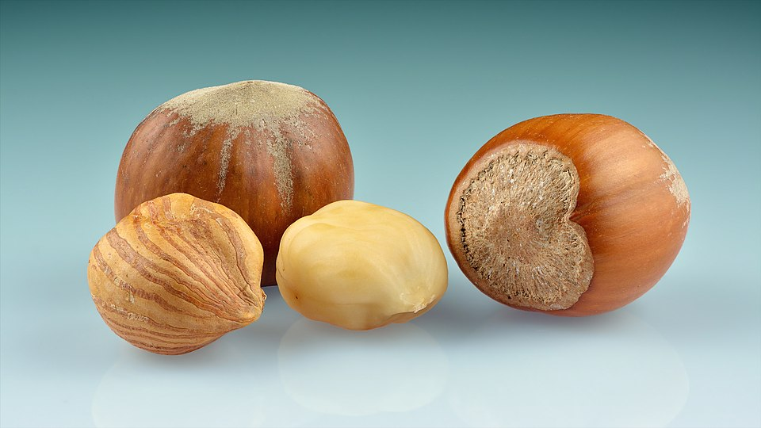
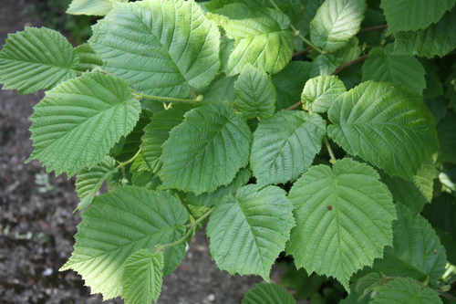

# Hazel

> **Node ID**: plants.edible-plants.hazel
> **Domain**: [Plants](./index.md)
> **Dependencies**: See prerequisites
> **Enables**: [`Edible Plants`](edible-plants.md)
> **Timeline**: Years 0-5
> **Outputs**: edible_plant_material
> **Critical**: No

## Overview

> *Hazelnuts (Corylus avellana) – whole with two kernels (one is peeled)*

> *Image: Ivar Leidus, CC BY-SA 4.0*

Hazel

*Corylus avellana* (Betulaceae) is a fruit & nut tree species of major importance for civilization bootstrapping. Hazel nuts, Cob-nut Hazel, Filberts provides leaves, seeds/nuts, flowers as its primary edible product and ranks 68/100 on the nutrition score.

Corylus avellana, the common hazel, is a species of flowering plant in the birch family Betulaceae. The shrubs usually grow 3–8 metres (10–26 feet) tall. The nut is round, in contrast to the longer filbert nut. Common hazel is native to Europe and Western Asia. The species is mainly cultivated for its nuts. The name 'hazelnut' applies to the nuts of any species in the genus Corylus, but in commercial contexts usually describes C. avellana. This hazelnut or cob nut (sometimes cobnut), the kernel of the seed, is edible and used raw, roasted, or ground into a paste. Historically, the shrub was an important component of the hedgerows used as field boundaries in lowland England. The wood was grown as coppice, with the poles used for wattle-and-daub building and agricultural fencing.

Edible parts: Nuts, Seeds, Flavouring, Spice, Oil, Flowers, Buds, Leaves The seed can be eaten raw or roasted and is used in breads, cakes, biscuits, and sweets. It is an excellent nut for eating out of hand and can also be blended into a plant milk. The seed is rich in oil and ripens in mid to late autumn; it will likely need protection from squirrels. Stored unshelled in a cool place, nuts keep for at least 12 months. A clear yellow edible oil pressed from the seed is used in salad dressings and baking. Per 100g dry weight, the seed provides 650 calories and contains: water 0%, protein 16g, fat 60g, carbohydrate 20g, fibre 4g, ash 2.8g, calcium 250mg, phosphorus 400mg, iron 4mg, sodium 2.1mg, potassium 900mg, thiamine (B1) 0.3mg, riboflavin (B2) 0.5mg, niacin 5.3mg, and vitamin C 6mg.

Nuts are produced 3-4 years after planting. Layered plants produce nuts in 2-3 years. Yields of 4-6 kg of nuts per tree, are average. Nuts fall when mature. Nuts store well. They should be kept dry and cool.

For civilization bootstrapping, hazel is significant because of its role as a fruit & nut tree. Reliable food production is the foundation upon which all other technological development rests. Understanding the cultivation, processing, and storage of *Corylus avellana* enables communities to establish food security and allocate labor to non-subsistence activities.

*Corylus avellana* is a member of the Betulaceae family. As a fruit & nut tree, it provides essential calories, protein, or other nutrients needed to sustain human populations during the bootstrap process. The ability to produce food reliably from cultivated plants is what separates sedentary civilizations from hunter-gatherer societies, because food surplus allows specialization of labor into toolmaking, construction, and eventually metallurgy and beyond.

This species grows as a perennial or annual depending on climate and management. Propagation is primarily by Seed is best sown as soon as it is harvested in autumn in a cold frame, germinating in late winter or spring. Stored seed should be pre-soaked in warm water for 48 hours, then given 2 weeks of warm stratification followed by 3–4 months of cold stratification; it germinates in 1–6 months at 20°C. When large enough to handle, prick seedlings out into individual pots and grow on in a cold frame or sheltered spot outdoors through their first winter, then plant out in late spring or early summer. Layering in autumn is easy and takes about 6 months. Division of suckers in early spring is very easy; divisions can be planted straight into permanent positions.. Harvest timing depends on the plant part used: leaves, seeds/nuts, flowers, spice/beverage are typically ready at specific growth stages or seasons.

## Prerequisites

### Materials

- Propagation material: Seed is best sown as soon as it is harvested in autumn in a cold frame, germinating in late winter or spring. Stored seed should be pre-soaked in warm water for 48 hours, then given 2 weeks of warm stratification followed by 3–4 months of cold stratification; it germinates in 1–6 months at 20°C. When large enough to handle, prick seedlings out into individual pots and grow on in a cold frame or sheltered spot outdoors through their first winter, then plant out in late spring or early summer. Layering in autumn is easy and takes about 6 months. Division of suckers in early spring is very easy; divisions can be planted straight into permanent positions.
- Compost or organic matter for soil amendment
- Mulch material for moisture retention and weed suppression

### Equipment

- Hoe or digging stick for soil preparation and planting
- Sickle, machete, or harvesting knife for crop harvest
- Drying racks or flat drying surfaces for post-harvest processing
- Storage containers: woven baskets, ceramic jars, or sacks for dried product
- Winnowing baskets or screens if processing grains or seeds

### Knowledge

- Species identification: A small deciduous tree up to 7 m high. It spreads to 3-5 m across. The stem is erect, with smooth, brown bark and hairy twigs. The trees sucker a lot, which produces a clumpy bush. The leaves are rounded, tapering to a point, with a heart shaped base. They are 10 cm long, and dull, dark green. The e
- Understanding of planting timing relative to local frost dates and rainy seasons
- Knowledge of soil preparation, seed depth, and spacing requirements
- Recognition of common pests and diseases and their early indicators
- Safe preparation methods for any toxic or bitter compounds (see Safety)

### Infrastructure

- Field or garden site with suitable climate, soil type, and sun exposure
- Reliable water access for germination and establishment phase
- Fenced or protected area if animal browsing is a risk
- Storage structure protected from moisture, rodents, and insects

## Process Description

### Cultivation and Propagation

An easily grown plant, it succeeds in most soils, but is in general more productive of seeds when grown on soils of moderate fertility. It does less well in rich heavy soils or poor ones. Does well in a loamy soil. Very suitable for an alkaline soil, but it dislikes very acid soils. Succeeds in a pH range 4.5 to 8.5, but prefers a range of 5 to 7. Plants are fairly wind tolerant. A very hardy plant, succeeding in all areas of Britain. The flowers, however, are produced in late winter and early spring and can be damaged by heavy frosts at this time. A parent, together with C. maxima, of many cultivated forms of filberts and cob nuts. There are many named varieties. Plants are self-fertile but a more certain crop is obtained if more than one cultivar is grown. The main difference between cob nuts and filberts is that the husk of a filbert is longer than the seed and often completely encloses it, whilst the husk on a cob nut is shorter than the seed. Squirrels are a major pest of this plant, often decimating the crop of nuts. Often grown as a coppiced shrub in woodlands, the stems have a variety of uses. Members of this genus bear transplanting well and can be easily moved even when relatively large. A food plant for the caterpillars of many lepidoptera species. A clumping plant, forming a colony from shoots away from the crown but with a limited spread. Most Corylus species are not self-fertile and require cross-pollination from another variety to produce nuts. Hazelnuts are typically harvested in late summer to early autumn, when the nuts have matured and fallen from the trees. Hazels flower in late winter to early spring, with male catkins producing pollen before the female flowers emerge. Corylus species are considered medium to fast-growing, reaching a height of about 3 to 6 meters (10 to 20 feet) within 5 to 10 years, depending on the specific variety and growing conditions. Propagation: Seed is best sown as soon as it is harvested in autumn in a cold frame, germinating in late winter or spring. Stored seed should be pre-soaked in warm water for 48 hours, then given 2 weeks of warm stratification followed by 3–4 months of cold stratification; it germinates in 1–6 months at 20°C. When large enough to handle, prick seedlings out into individual pots and grow on in a cold frame or sheltered spot outdoors through their first winter, then plant out in late spring or early summer. Layering in autumn is easy and takes about 6 months. Division of suckers in early spring is very easy; divisions can be planted straight into permanent positions.

### Distribution and Growing Conditions

### Identification

A small deciduous tree up to 7 m high. It spreads to 3-5 m across. The stem is erect, with smooth, brown bark and hairy twigs. The trees sucker a lot, which produces a clumpy bush. The leaves are rounded, tapering to a point, with a heart shaped base. They are 10 cm long, and dull, dark green. The edges of the leaves have saw-like teeth. The leaves are hairy. Male and female flowers are separate, on the one tree. Male flowers are greenish-yellow stalks, like cat's tails. They are 8 cm long and hang downwards. The female flowers are very small, and in groups of four. The fruit are brown nuts 2 cm across. A green husk covers the nut, but then shrinks to allow the nut to darken and ripen. Plants within the Hazel nut group hybridise easily, giving rise to new kinds.

### Edible Parts and Preparation

Hazel produces one of the most calorie-dense nuts available: 672 kcal and 60% fat per 100g of kernel. The nuts, oil, and coppiced wood all serve critical bootstrap functions:

**Harvesting**: Hazelnuts ripen in late summer to early autumn (August-October depending on climate). The husk (involucre) shrinks and opens as the nut matures, allowing it to drop. Traditional harvest method: shake tree branches vigorously with a long pole or by hand, then gather fallen nuts from the ground. Spread tarps or blankets beneath the canopy before shaking to speed collection. Nuts can also be picked directly from the bush when the husk begins to dry and turn brown. Wear gloves — hazel branches are rough and the husks can be prickly. Harvest promptly before squirrels, mice, and birds take the crop — a single squirrel can strip a mature bush in days.

**Drying**: Fresh hazelnuts contain 20-30% moisture. Dry within 2-4 weeks of harvest to prevent mold and rancidity. Spread nuts in a single layer on screens, racks, or a clean dry floor in a warm (25-35°C), well-ventilated, dry location. Stir or turn every 2-3 days. Nuts are adequately dry when the kernel is firm and snaps rather than bends, and the shell is hard and brittle. Test by cracking open a sample: the kernel should be cream-colored and firm throughout with no soft or dark spots. Target moisture: below 8% for long-term storage. Shell nuts before or after drying — unshelled nuts dry more slowly but the shell provides physical protection during storage.

### Oil Pressing

Hazelnut kernels contain 45-60% oil by weight, one of the highest oil contents among temperate nuts. The oil is clear, pale yellow, with a mild nutty flavor:

1. **Prepare kernels**: Shell nuts if not already done. Remove any shriveled, moldy, or discolored kernels. Grind kernels to a coarse meal using a stone mill or mortar — not too fine (makes pressing difficult) or too coarse (reduces oil yield). Target particle size: 1-3 mm.

2. **Press**: Use a wedge press, screw press, or lever press. Cold pressing (no heating) preserves flavor and quality — apply steady, increasing pressure over 30-60 minutes. The oil flows from the press cake and collects in a container below. A single pressing extracts 60-70% of available oil. For higher yield: break up the press cake, lightly warm to 40-50°C (warm to the touch, not hot), and re-press. Second pressing yields an additional 10-15% oil but with somewhat lower quality.

3. **Clarify**: Allow pressed oil to settle for 24-48 hours in a covered container. Sediment (fine particles) settles to the bottom. Decant or siphon the clear oil off the sediment. Filter through fine cloth if further clarification is needed. The oil keeps for 6-12 months in sealed containers stored cool and dark.

4. **Press cake**: The remaining meal after pressing contains 15-25% residual oil and 20-30% protein. Use as animal feed, grind into flour for human consumption, or press again for lower-grade oil.

### Coppicing for Structural Poles

Hazel is one of the premier coppicing species in temperate Europe, producing straight, flexible poles on a 7-10 year rotation:

1. **Establish coppice stool**: Plant hazel stools (stumps) at 2-3 meter spacing in rows. Hazel naturally forms multi-stemmed clumps. For coppice management, cut the initial stems back to 5-10 cm above ground level in winter during the first or second year after planting. This stimulates vigorous multi-stem regrowth from the stool.

2. **Rotation cycle**: Allow regrowth for 7-10 years. At this age, poles reach 3-6 meters in length and 2-5 cm diameter at the base — ideal for wattle-and-daub building, hedgelaying, garden stakes (pea sticks), fencing hurdles, basket hoops, and thatching spars. Shorter rotations (4-5 years) produce thinner rods suitable for basketry and binding; longer rotations (12-15 years) produce thicker poles for structural use.

3. **Harvest (winter)**: Cut all stems from the stool during the dormant season (November-March) using a billhook, axe, or saw. Cut at an angle just above the stool, close to ground level, leaving a smooth surface that sheds water. Avoid damaging the stool — nicked or torn stools are susceptible to rot. A healthy stool can be re-coppiced every 7-10 years for 60-100+ years.

4. **Sorting and seasoning**: Sort cut poles by length, diameter, and straightness. Bundle by grade. Season (air-dry) poles for 3-6 months under cover before use to reduce weight and improve durability. Green (fresh) hazel poles are flexible and can be bent for hoops and arches — use green for wattle work; use seasoned for structural elements.

5. **Yield**: A well-managed hazel coppice produces 2-5 tonnes of dry poles per hectare per rotation (7-10 years), or 200-700 kg/ha/year on a sustained yield basis.

### Process Parameters

| Parameter | Range | Notes |
|-----------|-------|-------|
| Kernel oil content | 45-60% | By weight, one of highest among temperate nuts |
| Oil yield (cold press) | 60-70% | Of available oil; re-press yields 10-15% more |
| Nut drying time | 2-4 weeks | At 25-35°C, well-ventilated |
| Target storage moisture | <8% | For nut kernels |
| Coppice rotation | 7-10 years | 4-5 years for thin basketry rods |
| Pole yield per hectare | 2-5 tonnes | Per rotation (dry weight) |
| Stool productive lifespan | 60-100+ years | If properly managed |
| Nut yield per bush | 4-6 kg | Average; mature bushes in good conditions |
| Nut calorie density | 672 kcal/100g | Kernel, dry |
| Kernel protein | 12-16% | By weight |

## Quantitative Parameters

### Nutritional Composition (per 100g)

| Part | Moisture | kJ | kcal | Protein | Vit A | Vit C | Iron | Zinc |
| --- | --- | --- | --- | --- | --- | --- | --- | --- |
| Seed | 5.2 | 2810 | 672 | 11.96 | — | 3 | 3.8 | 1.9 |

### Growing Parameters

| Parameter | Value | Notes |
|-----------|-------|-------|
| Germination temperature | 8°C | Optimal |
| Hardiness zones | 4-8 | USDA |
| Edible parts | Leaves, Seeds/Nuts, Flowers, Spice/Beverage | Primary harvest |

## Processing and Storage

### Non-Food Uses

Hazels work well in agroforestry systems as hedging, windbreaks, or for erosion control, and can be intercropped with other plants to benefit soil health and biodiversity. The seed contains up to 65% of a non-drying oil used in paints and cosmetics. Whole seeds can be used to polish and oil wood, giving an easy application and a good finish. Finely ground seeds are used as an ingredient in cosmetic face masks. Plants grown as a tall hedge should be left untrimmed or only lightly trimmed if a seed crop is wanted. Bark and leaves are a source of tannin. The wood is soft, easy to split, and not very durable but is beautifully veined; it is used for inlay work, small furniture, hurdles, wattles, basketry, and pea sticks. Twigs are used as dowsing rods. The wood yields good quality charcoal valued by artists. Hazels produce wind-pollinated catkins that are not rich in nectar but do provide pollen that some insects utilise. The nuts are a valuable food source for birds, small mammals, and insects, and the dense foliage provides shelter and nesting habitat, with leaf litter supporting a variety of organisms. Rough bark and dense foliage also offer overwintering sites for invertebrates.

### Storage

Dry seeds thoroughly to below 14% moisture content before storage. Spread in thin layers on drying racks in full sun, stirring periodically. Test dryness by biting: properly dried seeds crack rather than dent. Store in airtight containers (ceramic jars with tight lids, sealed woven bags) in a cool, dry, dark location. Protect from rodents and insects with tight lids or by mixing with inert ash. Under good conditions, dried grains and legumes store for 1-5 years with minimal loss.

### Material Handling

Handle hazel produce with clean hands and tools to prevent contamination. Remove field heat promptly after harvest by moving product to shade. Process within the recommended timeframe to prevent quality loss. Compost crop residues and processing waste to return organic matter to the soil. Label stored products with harvest date, variety, and any treatments applied.

## Scaling Notes

- **Bench scale**: Individual plants or small garden plot (10-50 plants). Output for direct household consumption. Useful for seed saving, variety selection, and learning the crop's behavior under local conditions.
- **Pilot scale**: Field planting of 0.1 to 1 hectare (500-5,000 plants). Staggered planting or sequential harvests to extend availability. Requires basic hand tools and family-level labor. Surplus can be traded or stored.
- **Production scale**: Multi-hectare cultivation with mechanized planting, harvesting, and processing. Requires plow animals or tractors, grain mills or processing equipment, and bulk storage facilities. Enables community-level food security and trade.
  Reported production data: Nuts are produced 3-4 years after planting. Layered plants produce nuts in 2-3 years. Yields of 4-6 kg of nuts per tree, are average. Nuts fall when mature. Nuts store well. They should be kept dry an

Key scaling challenges include maintaining genetic diversity at plantation scale, managing pest and disease pressure in monoculture, and matching post-harvest processing capacity to harvest volume. Seed saving and variety selection at bench scale directly informs decisions about which cultivars to scale up.

## Troubleshooting

| Problem | Probable Cause | Solution |
|---------|---------------|----------|
| Poor germination | Old seed, wrong soil temperature, planted too deep, or insufficient moisture | Use fresh seed; verify germination temperature range; plant at recommended depth; maintain soil moisture during germination |
| Pest damage | Insect infestation or browsing animals | Hand-pick pests; use companion planting with repellent species; install fencing for larger pests |
| Disease (fungal/bacterial) | Poor air circulation, excessive moisture, infected seed | Space plants adequately; avoid overhead watering; use clean seed from disease-free plants; practice crop rotation |
| Low yield | Nutrient deficiency, water stress, overcrowding, or shade | Amend soil with compost or manure; ensure adequate water at critical growth stages; thin to recommended spacing; plant in full sun |
| Storage losses | Insufficient drying, rodent/insect damage, high humidity | Dry product thoroughly before storage; use sealed containers; inspect stored product regularly; keep storage area clean and dry |
| Quality or safety note | See species-specific notes | There are about 15 Corylus species. |

## Safety Considerations

Working with *Corylus avellana* involves the following hazards:

- **Toxicity**: Parts of this plant may contain compounds that are toxic when raw or improperly prepared. Always follow proper preparation procedures before consumption. Verify with multiple authoritative sources.
- Tool injuries during harvest and processing — use sharp tools in good condition and cut away from the body
- Allergic reactions to plant compounds — sensitive individuals should test small quantities first
- Sun exposure and heat stress during field work — schedule heavy work for early morning or late afternoon
- Musculoskeletal strain from repetitive harvesting motions — vary tasks and take regular breaks

### Personal Protective Equipment

- Sturdy gloves when handling plants with irritant sap, spines, or rough surfaces
- Long sleeves and trousers for field work to reduce skin exposure to irritants and insects
- Eye protection when using cutting tools overhead or near face level
- Sun hat and sunscreen for extended field work

### Emergency Procedures

- For suspected plant poisoning: stop eating immediately, save a sample of the plant material, and seek medical attention. Do not induce vomiting unless directed by a medical professional.
- For tool lacerations: apply direct pressure with a clean cloth, elevate the wound, and seek medical attention for cuts deeper than skin level.
- For allergic reaction (swelling, difficulty breathing): discontinue exposure immediately and seek emergency medical help.

## Quality Control

### Acceptance Criteria

- Harvest product shows expected color, texture, size, and flavor for the variety grown
- No visible mold, rot, pest damage, or foreign material in stored product
- Dried products are brittle throughout with no flexible or moist spots
- Seeds intended for storage test at below 14% moisture content

### Testing Methods

- **Visual inspection**: check for discoloration, mold, insect damage, or foreign material
- **Bite test (seeds/grains)**: properly dried seeds crack cleanly; under-dried seeds dent or feel leathery
- **Smell test**: fresh product has characteristic aroma; off-odors indicate spoilage or contamination
- **Snap test (dried products)**: properly dried material snaps rather than bends

### Sampling Protocol

For field-scale production, inspect every 10th plant during harvest for disease and pest damage. Grade each batch by size and quality before storage. Record yield per unit area to track productivity trends across seasons and identify declining performance early.

## Variations and Alternatives

### Medicinal Uses

The bark, leaves, catkins, and fruits are all sometimes used medicinally, with astringent, diaphoretic, febrifuge, nutritive, and odontalgic properties. The seed is stomachic and tonic. The oil has a gentle but consistent and effective action against threadworm or pinworm infection in babies and young children.

### Other Uses

### Additional Information

It is a cultivated plant. It is sold in local markets. Seeds have been introduced into Papua New Guinea for trial plantings only and are not really a suitable plant for the country.

### Notes

There are about 15 Corylus species.

### Related Species

- [Apple](apple.md)
- [Grape](grape.md)
- [Fig](fig.md)
- [Olive](olive.md)
- [Coconut](coconut.md)

### Cultivar Selection

Within *Corylus avellana*, considerable variation exists in yield, disease resistance, climate adaptation, and quality characteristics. When establishing a hazel crop, select varieties adapted to local conditions: day length, temperature range, rainfall pattern, and soil type. Landrace varieties — locally adapted populations maintained by traditional farmers — often outperform modern cultivars under low-input conditions because they have been selected for resilience rather than maximum yield under optimal conditions.

Seed saving from the best-performing plants each generation gradually adapts the variety to local conditions. Select for vigor, disease resistance, appropriate maturity timing, and product quality. Maintain genetic diversity by saving seed from multiple plants rather than a single individual, which preserves the population's ability to adapt to changing conditions and disease pressures.

### Crop Rotation and Companion Planting

*Corylus avellana* benefits from crop rotation to prevent buildup of species-specific pests and diseases. Avoid planting in the same field in consecutive seasons where possible. Follow with a different crop family to break pest cycles and maintain soil health.

Companion planting with aromatic herbs or flowering plants can deter pests and attract beneficial insects. Avoid planting near species that compete for the same nutrients or harbor shared pathogens.

## References

- [Edible Plants](edible-plants.md) — parent capability
- [Plants Domain](./index.md) — domain overview and related capabilities
- [Agave](agave.md) — example plant article format
- [Food Processing](../food-processing/index.md) — downstream processing of harvested crops
- [Agriculture](../agriculture/index.md) — cultivation systems and crop rotation
- Family: Betulaceae
- Distribution: Andorra, United Arab Emirates, Afghanistan, Antigua &amp; Barbuda, Albania, Armenia, Argentina, Austria, Australia, Azerbaijan, Bosnia &amp; Herzegovina, Barbados, Bangladesh, Belgium, Bulgaria, Bahrain, Brunei, Bolivia, Brazil, Bahamas and 128 more
- Data sourced from Food Plants International, Wikipedia, and iNaturalist via the Edible Plant Database (ZIM)
- Plants for a Future (pfaf.org) — supplementary cultivation and use data

---
*Part of the [Bootciv Tech Tree](../index.md) · [Plants](./index.md) · [All Domains](../index.md)*

