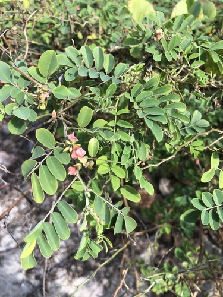

# True Indigo

> **Node ID**: plants.dye.true-indigo
> **Domain**: [Plants](./index.md)
> **Dependencies**: See prerequisites
> **Enables**: [`Textiles`](../textiles/index.md)
> **Timeline**: Years 0-2
> **Outputs**: blue dye (indigotin), green manure
> **Critical**: No — blue dye is important but woad provides a temperate-zone alternative

## Overview

> *True Indigo (Indigofera tinctoria)*

> *Image: Dinesh Valke, CC BY-SA 4.0*

True indigo (*Indigofera tinctoria*) is a tropical legume that produces the most important blue dye in human history. The plant contains indican, a glucoside that, when processed through fermentation and oxidation, yields indigotin, the intense blue pigment that gave indigo its name. For over 5,000 years, indigo was the primary source of blue colorant across Asia, Africa, and the Americas.

The dye extracted from indigo leaves is chemically identical regardless of the plant species used. What makes *Indigofera tinctoria* special is its high indican content (0.2-0.8% of fresh leaf weight) and its tropical adaptability. It grows as a semi-woody shrub 1-2 meters tall, produces multiple harvests per year, and fixes nitrogen in the soil as a legume.

Indigo dye is unique among natural dyes because it is a vat dye. Unlike most plant dyes that bond directly to fiber with a mordant, indigo requires a reduction step to become soluble. The insoluble blue pigment is reduced to a soluble yellow-green form (leuco-indigo) in an alkaline vat, fiber is dipped in the vat, and when the fiber is removed and exposed to air, the dye oxidizes back to its insoluble blue form. This process is repeated 2-5 times to build up deeper color.

The reduction was traditionally achieved by bacterial fermentation in an alkaline vat (using urine, wood ash lye, or lime as the alkali, and bran, molasses, or dates as the bacterial food source). This makes indigo dyeing accessible at a very low technology level, requiring only clay pots, water, and patience.

Primary outputs: `blue_dye` (indigotin) for textiles, `green_manure` for soil improvement.

## Prerequisites

### Materials

- Indigo seeds (small, brown, 2-3 mm)
- Tropical or subtropical climate with 1,000-2,000 mm annual rainfall
- Well-drained soil with pH 6.0-7.5
- Alkali for vat: wood ash lye, slaked lime, or urine
- Reducing agent: wheat bran, molasses, overripe fruit, or dates

### Equipment

- Harvesting sickle for cutting plants
- Fermentation vats (clay pots, wooden tubs, or stone-lined pits)
- Stirring poles for vat management
- Beating or churning tools for oxidation
- Cloth or basket strainers for leaf removal
- Dye vat for cloth immersion (clay pot or wooden tub)
- Rope or sticks for hanging dyed cloth

### Knowledge

- Indican extraction through leaf fermentation
- Vat reduction chemistry: how to maintain the reducing environment
- Dipping technique: how to immerse and oxidize cloth for even color
- Color depth control: number of dips determines shade
- Alkali preparation: making wood ash lye or lime solution

### Infrastructure

- Indigo plantation with access to water for vat processing
- Fermentation area with multiple vats
- Dye vat setup in a sheltered location (protection from rain diluting the vat)
- Drying lines for dyed cloth

## Process Description

### Leaf Harvest and Dye Extraction

1. Plant seeds at the start of the rainy season, 2-3 cm deep in rows 30-45 cm apart. Germination in 5-10 days. Plants reach 1-2 meters in 3-4 months.
2. First harvest: cut plants 15-20 cm above ground when they begin to flower (3-4 months after planting). Subsequent harvests every 2-3 months from regrowth. A plantation produces 3-4 harvests per year for 2-3 years before replanting.
3. Immediately after harvest, steep the cut leafy branches in a fermentation vat filled with water. Submerge completely. Weight down with stones if needed.
4. Ferment for 12-24 hours. The water turns yellow-green as indican hydrolyzes to indoxyl. The leaves should feel soft and release their color when squeezed.
5. Remove the spent leaves (compost them). The remaining yellow-green liquid contains indoxyl.
6. Beat or churn the liquid vigorously for 15-30 minutes to introduce air. The indoxyl oxidizes to indigotin, forming blue particles suspended in the water. The liquid turns blue.
7. Allow the indigo to settle (4-8 hours). Decant the clear supernatant liquid. The blue sludge at the bottom is raw indigo paste.
8. Collect the paste and dry it in the sun for 1-3 days, stirring periodically. Form into cakes or balls for storage and trade. Dried indigo keeps indefinitely.

### Vat Dyeing Process

1. Prepare the dye vat: dissolve 50-100 g of dried indigo paste in 5-10 liters of warm water (40-50°C). Add alkali (200-400 g wood ash lye or 50-100 g slaked lime). Add reducing agent (200-400 g wheat bran or 100-200 g molasses).
2. Stir gently and allow the vat to ferment and reduce for 12-24 hours. The liquid turns from blue to yellow-green when reduction is complete. A coppery surface film indicates a healthy vat.
3. Test the vat by dipping a small cloth strip. Remove it: if it turns from yellow-green to blue as it airs, the vat is ready.
4. Wet the cloth to be dyed and immerse it in the vat for 3-5 minutes, working it gently to ensure penetration.
5. Remove the cloth and expose it to air. It will change from yellow-green to blue as the dye oxidizes. Allow 10-15 minutes for full oxidation.
6. Repeat dips for deeper color: 2 dips for light blue, 3-4 for medium, 5-6 for dark navy.
7. After final dip, rinse the cloth in clean water and dry in the shade (direct sun can unevenly fade the dye).

### Process Parameters

| Parameter | Range | Notes |
|-----------|-------|-------|
| Indican content (fresh leaves) | 0.2-0.8% | Varies by variety and growing conditions |
| Indigo yield per hectare per year | 20-50 kg (dried paste) | From 3-4 leaf harvests |
| Leaf yield per hectare per harvest | 5,000-15,000 kg | Fresh weight |
| Fermentation time | 12-24 hours | Water temperature 25-35°C |
| Oxidation time (vat to blue) | 15-30 minutes | Beating/churning |
| Vat reduction time | 12-24 hours | Fermentation at 30-40°C |
| Dips for light blue | 2 | Each dip 3-5 minutes |
| Dips for medium blue | 3-4 | Each dip 3-5 minutes |
| Dips for dark navy | 5-6 | Each dip 3-5 minutes |
| Alkali (wood ash lye) pH | 10-11 | For vat |
| Dye fastness (light) | Good to very good | For cotton and wool |
| Dye fastness (wash) | Good | Indigo bonds mechanically, not chemically |
| Nitrogen fixation per hectare | 40-80 kg/year | As a legume green manure benefit |
| Plant density for dye crop | 100,000-200,000/ha | Dense planting for leaf production |

### Dye Extraction Processing Details

The extraction of indigotin from indigo leaves is a biochemical process in two stages: enzymatic hydrolysis of indican to indoxyl, followed by air oxidation of indoxyl to indigotin. The fermentation step (steeping leaves in water for 12-24 hours) activates plant enzymes that convert indican to indoxyl and glucose. Temperature control is important: below 20°C, fermentation is slow; above 40°C, the enzymes denature. The optimal range is 25-35°C.

The oxidation step (beating/churning the fermentation liquor) introduces atmospheric oxygen that converts water-soluble indoxyl to insoluble indigotin particles. Vigorous beating for 15-30 minutes maximizes particle formation. The indigotin particles are heavier than water and settle over 4-8 hours. The settled sludge is approximately 20-40% indigotin by weight, with the remainder being plant proteins, minerals, and other organic matter.

Extraction efficiency from leaf to dried paste is typically 20-40% of theoretical maximum. Losses occur during fermentation (incomplete hydrolysis), oxidation (indoxyl lost to side reactions), settling (fine particles remain suspended), and drying (surface oxidation degrades some product). Experienced dyers achieve 30-40% recovery; beginners may achieve only 15-20%.

### Vat Chemistry in Practice

The indigo vat is a reducing environment maintained by bacterial fermentation. The bacteria consume the reducing agent (bran, molasses) and produce hydrogen, which reduces the insoluble blue indigotin to soluble yellow-green leuco-indigo. The alkali (wood ash lye at pH 10-11) maintains conditions where leuco-indigo is stable and soluble.

A healthy vat has several indicators: the surface shows an iridescent coppery-blue film (oxidized indigo at the air-water interface), the liquid beneath is clear yellow-green (reduced leuco-indigo), and the vat smells yeasty and slightly sweet, not putrid. A putrid smell indicates wrong bacteria and the vat should be refreshed with new reducing agent.

Temperature maintenance is critical in cold climates. A traditional method is to partially bury the vat in the ground, which provides insulation, or to build a low fire beneath the vat. The vat must stay between 30-45°C for optimal bacterial activity. Below 25°C, reduction stops; above 50°C, bacteria die.

## Safety Considerations

- The fermentation vat produces hydrogen sulfide and other gases. Work in a well-ventilated area. Do not lean over enclosed fermentation vessels.
- Wood ash lye and lime are caustic. Wear gloves and eye protection when handling alkali. Rinse skin immediately if contact occurs.
- Indigo paste can cause allergic skin reactions in sensitive individuals. Test on a small skin area before prolonged handling.
- The beating/churning step for oxidation is physically demanding. Use proper body mechanics to avoid back and shoulder strain.
- Dried indigo paste is a fine powder that can irritate the respiratory tract. Wear a dust mask when crumbling or dissolving dried indigo.

### Personal Protective Equipment

- Rubber or leather gloves for vat work and alkali handling
- Eye protection when working with lye or lime
- Dust mask when handling dried indigo powder
- Rubber boots for standing in dye vat area

## Quality Control

### Acceptance Criteria

- **Dried indigo paste**: Deep blue color, no mold, no leaf debris, brittle when dry
- **Dyed cloth (light blue)**: Even color, no streaks or patches, colorfast to hand-rubbing
- **Dyed cloth (dark navy)**: Deep, even color, no undyed areas, minimal crocking (rub-off)

### Testing Methods

- Rub test: vigorously rub dyed cloth against white cloth. Minimal blue transfer indicates good fixation.
- Light test: expose half of a dyed sample to direct sun for 48 hours. Compare with the covered half. Acceptable fading is less than 20%.
- Wash test: wash dyed cloth in warm water with mild soap. Rinse water should run nearly clear after the first wash.
- Indigo content of paste: dissolve 1 g of paste in concentrated sulfuric acid, dilute, and compare color against a standard. Higher technology method; at low tech levels, visual comparison suffices.

## Scaling Notes

- **Household garden** (0.01 hectare): 2-5 kg of dried indigo paste per year. Enough to dye household textiles and clothing.
- **Village plot** (0.5 hectare): 10-25 kg of dried indigo per year. Supports a community dye operation.
- **Commercial plantation** (5 hectares): 100-250 kg of dried indigo per year. Trade-quality production.
- **Bottleneck**: The extraction process loses 60-80% of the potential dye through incomplete extraction, oxidation at wrong stages, and settling losses. Skill and careful processing significantly affect yield.

## Troubleshooting

| Problem | Probable Cause | Solution |
|---------|---------------|----------|
| Vat stays blue, does not reduce | Insufficient reducing agent or wrong temperature | Add more bran/molasses; ensure vat is warm (30-40°C) |
| Dye color is gray, not blue | Vat too dilute or oxidation incomplete | Increase indigo concentration; allow more oxidation time between dips |
| Cloth dyed unevenly | Cloth not pre-wetted, or vat not stirred properly | Always wet cloth before dipping; stir vat gently before each immersion |
| Indigo rubs off cloth easily (crocking) | Insufficient oxidation between dips | Allow 15 minutes of air exposure between dips; increase total number of dips |
| Fermentation vat smells like rot, not yeasty | Wrong bacteria dominant; too hot or anaerobic | Reduce temperature; skim off surface scum; add fresh reducing agent |
| Leaf fermentation yields no color | Leaves harvested too old, or variety low in indican | Harvest at flowering stage; test different varieties |

## Variations and Alternatives

- **Woad** (*Isatis tinctoria*): Temperate-zone source of the same indigotin. Lower yield per hectare (5-15 kg dried dye) but grows in cold climates where *Indigofera* cannot.
- **Asian indigo** (*Persicaria tinctoria*): Japanese indigo, a temperate annual. Contains similar indican. Easier to process in cool climates.
- **Indigo Carmine**: Synthetic indigo (produced from petroleum) has largely replaced natural indigo since 1897. Chemically identical but much cheaper.
- **Direct blue dyes**: Some berries (indigo, elderberry) produce blue colorants, but none match indigo's light-fastness and wash-fastness.
- **Logwood** (*Haematoxylum campechianum*): Produces a deep blue-black dye with iron mordant. Not a true blue but useful for dark shades on textiles.

### Historical Significance

Indigo was one of the most valuable trade commodities in human history, driving colonial exploitation and trade routes for millennia. The plant's ability to produce a permanent, fade-resistant blue made it irreplaceable for textile dyeing until synthetic indigo was developed in 1897. For civilization bootstrapping, indigo provides the most durable blue dye available from any natural source, critical for marking textiles, creating visual codes, and producing textiles that resist fading during outdoor use.

## References

- [Textiles](../textiles/index.md) — textile dyeing processes
- [Madder](./rubia-tinctorum.md) — red dye plant for comparison
- [Woad](./isatis-tinctoria.md) — temperate-zone blue dye alternative
- [Plants Domain](./index.md) — domain overview and related capabilities

### Indigo as a Trade Commodity

Natural indigo was one of the most valuable commodities in world trade for over 3,000 years.
Indigo cakes were compact, non-perishable, and extremely concentrated (20-40% indigotin),
making them ideal for long-distance trade. A single kilogram of quality indigo paste can dye
10-20 kg of cotton fiber a deep, permanent blue.

The indigo trade connected India, Southeast Asia, West Africa, and the Americas through
commercial networks that predated European colonial expansion. Indian indigo was exported
to Rome, the Islamic world, and China. West African indigo was traded across the Sahara.
Pre-Columbian American indigo (*Indigofera suffruticosa*) was used throughout Mesoamerica
and the Andes. This global distribution means that indigo-producing plants and knowledge
are available in virtually every tropical region.

For civilization bootstrapping, indigo provides the most permanent, fade-resistant blue dye
available from any natural source. Combined with madder (red) and weld (yellow), a complete
primary-color dye palette is achievable from three cultivated plants.

---
*Part of the [Bootciv Tech Tree](../../index.md) · [Plants](./index.md) · [All Domains](../../index.md)*
