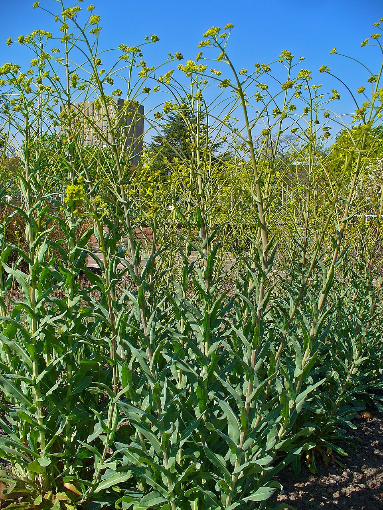

# Woad

> **Node ID**: plants.dye.woad
> **Domain**: [Plants](./index.md)
> **Dependencies**: See prerequisites
> **Enables**: [`Textiles`](../textiles/index.md)
> **Timeline**: Years 0-1
> **Outputs**: blue dye (indigotin), green dye (over-dyed with yellow)
> **Critical**: No — the temperate alternative to tropical indigo, but lower yield per hectare

## Overview

> *Isatis tinctoria, Brassicaceae, Woad, habitus; Botanical Garden KIT, Karlsruhe, Germany.*

> *Image: H. Zell, CC BY-SA 3.0*

Woad (*Isatis tinctoria*) is a biennial herb native to southeastern Europe and western Asia that produces the same blue dye (indigotin) as tropical indigo (*Indigofera tinctoria*). For over 2,000 years, woad was the only source of blue dye available in temperate Europe. The ancient Britons painted themselves with woad before battle, and woad remained the primary blue dyestuff in Europe until Portuguese traders brought tropical indigo in the 16th century.

Woad's advantage is cold hardiness. It grows as a biennial in temperate climates (hardy to -20°C), producing a rosette of leaves in its first year and a tall flowering stalk in the second. The first-year leaves contain the dye. The indican content is lower than tropical indigo (0.1-0.3% vs. 0.2-0.8% fresh leaf weight), meaning more land and more processing are needed for the same amount of blue dye.

The extraction process is similar to indigo: leaves are harvested, fermented in water to release indoxyl, and the liquor is oxidized to precipitate indigotin. Woad processing differs in that the leaves are typically crushed into a ball (woad ball) rather than processed into a dry powder, because woad contains less dye and the traditional European processing optimized for ball form.

Woad balls were a major trade commodity in medieval Europe. Toulouse, Erfurt, and other cities grew rich on woad production. The dye produces clear blues that are slightly grayer and softer than tropical indigo, a quality that was actually preferred for some textile applications.

The plant is a prolific self-seeder and can become invasive. In its second year, it produces thousands of seeds. This makes it easy to establish but requires management to prevent unwanted spread.

Primary outputs: `blue_dye` (indigotin) for textiles, available in temperate climates.

## Prerequisites

### Materials

- Woad seeds (small, winged, brown)
- Temperate climate with well-drained, fertile soil (pH 6.5-7.5)
- Alkali for vat: wood ash lye, slaked lime, or stale urine
- Reducing agent: wheat bran, molasses, or madder roots (traditional woad vat uses madder as a catalyst)

### Equipment

- Stone or wooden trough for leaf crushing
- Fermentation vats (wooden tubs or clay pots)
- Stirring and beating tools for oxidation
- Cloth for straining
- Dye vat for cloth immersion

### Knowledge

- First-year leaf harvest timing (maximum dye content in late summer)
- Woad ball formation technique for storage
- Traditional woad vat fermentation using madder and bran
- Vat dyeing technique (identical to indigo vat dyeing)

### Infrastructure

- Woad field with well-drained soil
- Processing area with crushing and fermentation vats
- Drying area for woad balls
- Dye house with vat setup

## Process Description

### Leaf Harvest

1. Sow woad seeds in early spring, 1 cm deep in rows 30 cm apart. Germination in 7-14 days.
2. Thin seedlings to 15-20 cm apart. Plants form a rosette of broad, fleshy leaves.
3. Harvest first-year leaves in late summer (July-September) when they are fully grown but before frost. Cut leaves 5 cm above the crown to allow regrowth. A second, smaller harvest is possible 4-6 weeks later.
4. Process leaves immediately after harvest. Woad leaves lose dye content rapidly after picking (30% loss in 12 hours).

### Dye Extraction (Woad Ball Method)

1. Crush freshly harvested leaves in a stone trough or between rollers. The goal is to break the leaf cells and release the indican-rich sap.
2. Form the crushed leaf pulp into balls (5-10 cm diameter) by squeezing out excess liquid and pressing firmly.
3. Dry the woad balls in the sun for 1-2 weeks until hard. The balls turn dark blue-black as surface indican oxidizes.
4. Store dried woad balls in a dry place. They keep for 1-2 years with gradual loss of dye strength.

### Vat Preparation (Traditional Woad Vat)

1. Crumble 500 g of dried woad balls into a vat with 20 liters of warm water (40-50°C).
2. Add 100 g of ground madder root (acts as a fermentation catalyst, not a dye in this context), 200 g of wheat bran, and 100 g of wood ash lye or slaked lime.
3. Stir and maintain at 35-45°C for 3-5 days. The vat ferments and the indigotin reduces to soluble leuco form. The liquid turns yellow-green when ready.
4. Test by dipping a cloth strip: yellow-green to blue oxidation indicates the vat is active.
5. Dyed cloth is immersed, removed, and oxidized identically to the indigo vat process (see [True Indigo](./indigofera-tinctoria.md)).

### Process Parameters

| Parameter | Range | Notes |
|-----------|-------|-------|
| Indican content (fresh leaves) | 0.1-0.3% | Lower than tropical indigo |
| Dried woad ball yield per hectare | 500-1,500 kg | From first-year leaf harvest |
| Indigotin yield per hectare | 5-15 kg | Much lower than tropical indigo (20-50 kg) |
| Leaf harvest per hectare | 10,000-20,000 kg | Fresh weight, first harvest |
| First harvest timing | 3-4 months after sowing | Late summer |
| Second harvest | 4-6 weeks after first | Smaller yield |
| Woad ball drying time | 1-2 weeks | In sun |
| Vat fermentation time | 3-5 days | At 35-45°C |
| Dips for medium blue | 4-6 | More than tropical indigo due to lower concentration |
| Light fastness | Good to very good | Comparable to indigo |
| Hardiness | -20°C | Temperate-climate advantage |
| Woad ball indigotin content | 2-5% | Much lower than tropical indigo paste |
| Plant density (dye crop) | 150,000-250,000/ha | Dense first-year rosette planting |

### Woad Processing Details

Woad processing differs from tropical indigo processing primarily in the intermediate storage form. Woad balls preserve the dye precursor through partial fermentation and drying, allowing dyers to store material for months and process cloth year-round rather than only during the harvest season. This was crucial in medieval Europe, where the short growing season concentrated leaf production into a few weeks.

The crushing step that forms woad balls is the key innovation. Freshly harvested leaves are crushed in a stone trough or between wooden rollers until the cell walls rupture and the leaf becomes a wet pulp. This pulp is then hand-formed into balls and dried. During drying, enzymatic processes within the ball partially convert indican to indigotin, giving the ball its characteristic dark blue-black color.

When preparing a woad vat, the dried balls are crumbled and steeped in warm water with madder root (which provides a natural reducing catalyst) and bran (bacterial food). The vat takes 3-5 days to ferment and reduce, longer than a tropical indigo vat because woad balls contain less dye and more plant material per unit of indigotin. Patience and temperature maintenance are the main skills required.

### Temperate-Zone Dye Strategy

In temperate zones without access to tropical indigo, woad is the primary blue dye source. Combined with madder (red) and weld or dyer's broom (yellow), the three primary colors are covered. Over-dyeing woad-blue with yellow dyes produces green; over-dyeing with madder produces purple. A complete dye palette is achievable from these three temperate plants.

Woad's lower yield per hectare compared to tropical indigo (5-15 kg vs. 20-50 kg of indigotin) means that blue cloth is more expensive in temperate regions. This economic pressure drove the adoption of tropical indigo in Europe once trade routes were established. For a self-sufficient temperate community, woad provides adequate blue dye for essential textile needs.

## Safety Considerations

- The fermentation vat produces foul-smelling gases (hydrogen sulfide, ammonia). Work in well-ventilated areas. Medieval woad processing was banished to the edges of towns for this reason.
- Woad balls are dusty and the dust irritates the respiratory tract. Wear a mask when crumbling balls.
- Wood ash lye and lime are caustic. Wear gloves and eye protection.
- Woad is invasive in some regions. Prevent seed set by harvesting all second-year flower stalks or by growing as a managed annual crop.

### Personal Protective Equipment

- Gloves for vat work and alkali handling
- Dust mask when crumbling woad balls
- Rubber boots in dye area

## Quality Control

### Acceptance Criteria

- **Fresh leaves**: Dark green, fully expanded, no yellowing or frost damage
- **Woad balls**: Hard, dark blue-black exterior, blue interior when broken, no mold
- **Dyed cloth**: Even blue color, no patches, moderate rub-fastness

### Testing Methods

- Leaf freshness: crush a leaf and smell. Fresh leaves have a sharp, cabbage-like odor. Wilted leaves smell sweet and fermented.
- Ball quality: break a ball open. Deep blue-purple interior indicates good dye content. Green interior indicates incomplete processing or old stock.
- Dye strength: dip a standard white wool sample and compare shade against a reference swatch.

## Scaling Notes

- **Household plot** (0.01 hectare): 5-10 kg of woad balls per year. Dyes a few garments blue.
- **Village plot** (1 hectare): 500-1,500 kg of woad balls. 5-15 kg of indigotin. Supports community dyeing.
- **Commercial scale** (10 hectares): 5,000-15,000 kg of woad balls. Requires mechanized leaf crushing and organized processing.
- **Bottleneck**: The lower indican content means 3-4 times more land is needed than for tropical indigo. For temperate regions, this is unavoidable.

## Troubleshooting

| Problem | Probable Cause | Solution |
|---------|---------------|----------|
| Leaves yield no blue color | Harvested too early or frost-damaged | Harvest mature leaves before first frost |
| Woad balls mold during drying | Dried too slowly or in humid conditions | Dry in full sun with good air circulation |
| Vat does not reduce | Temperature too low, insufficient fermentation time | Maintain at 35-45°C; extend fermentation time |
| Blue color too pale | Low dye concentration in vat | Use more woad balls per vat; increase number of dips |
| Second-year plants crowding crop | Self-seeding from previous year | Remove second-year plants before seed set; rotate crop location |

## Variations and Alternatives

- **True indigo** (*Indigofera tinctoria*): Tropical source of identical indigotin. 3-4 times the yield per hectare but requires tropical climate.
- **Japanese indigo** (*Persicaria tinctoria*): Temperate annual with higher indican content than woad (0.2-0.5%). Easier extraction process. Better choice where available.
- **Synthetic indigo**: Chemically identical, much cheaper, eliminates the need for either woad or tropical indigo at higher technology levels.
- **Elderberry** (*Sambucus nigra*): Berries produce a fugitive blue-purple dye on wool with alum mordant. Not light-fast but useful for temporary coloring.

### Dual-Use as a Medicinal Plant

Woad root (called *ban lan gen* in Chinese medicine) and leaf (*da qing ye*) have been used in traditional Chinese medicine for centuries as antiviral and anti-inflammatory agents. The root contains indican derivatives with demonstrated antiviral activity. While woad's primary value for civilization bootstrapping is as a dye plant, its medicinal properties provide additional benefit in communities that cultivate it. Preparations from the root are used to treat sore throat, fever, and inflammatory skin conditions.

## References

- [Textiles](../textiles/index.md) — textile dyeing processes
- [True Indigo](./indigofera-tinctoria.md) — tropical blue dye for comparison
- [Madder](./rubia-tinctorum.md) — red dye plant, also used as woad vat catalyst
- [Plants Domain](./index.md) — domain overview and related capabilities

### Woad in Medieval European Economy

Woad was a major economic force in medieval Europe. The cities of Toulouse (France), Erfurt
(Germany), and Sermoneta (Italy) grew wealthy from woad production and trade. Woad merchants
formed powerful guilds, and woad processing districts were distinctly identifiable by the
pungent smell of fermentation vats — a smell so characteristic that woad processing was
banished to the outskirts of most towns.

The dye produced a range of blues that were valued for different purposes: pale woad blue for
everyday clothing, medium blue for merchant class garments, and deep woad-indigo blue for
aristocratic textiles. The shade could be modified by the number of dips, the strength of the
vat, and the mordant used. Woad-blue fabric was a marker of social status across medieval Europe.

The introduction of tropical indigo in the 16th century disrupted the European woad industry.
Tropical indigo produced 3-4 times more dye per hectare, making it cheaper despite the cost
of overseas transport. Woad cultivation declined sharply but never disappeared entirely —
it remained in use for traditional dyeing in rural areas where imported indigo was expensive
or unavailable.

Woad was so important to the medieval English economy that the Right Worshipful Company of Dyers, one of London's ancient livery companies, regulated woad processing standards. The company established quality grades for woad balls and enforced fair trading practices. Woad cultivation and processing provided employment for thousands of workers across England, France, and Germany during the medieval period.

### Woad Summary

This species represents an important component of a diversified food production system.
No single crop provides complete nutrition, and dietary diversity is essential for human
health. A civilization bootstrap food system should include grains, legumes, roots, fruits,

---
*Part of the [Bootciv Tech Tree](../index.md) · [Plants](./index.md) · [All Domains](../index.md)*
