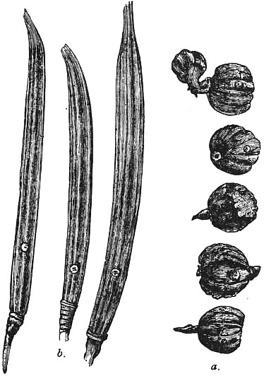

# Jute

> **Node ID**: plants.edible-plants.jute
> **Domain**: [Plants](./index.md)
> **Dependencies**: See prerequisites
> **Enables**: [`Edible Plants`](edible-plants.md)
> **Timeline**: Years 0-5
> **Outputs**: edible_plant_material
> **Critical**: No

## Overview

> *Jute — Capsules of Jute Plants. a, Corchorus capsularis; b, C. olitorius*

> *Image: AnonymousUnknown author, Public domain*

Jute

*Corchorus olitorius* (Malvaceae) is a fiber & industrial crop species of major importance for civilization bootstrapping. Jute, Bush Okra provides fruit, leaves, seeds/nuts as its primary edible product and ranks 61/100 on the nutrition score.

Jute mallow or Jew's mallow or Mallow leaves or Nalita jute (Corchorus olitorius, also known as "Jute leaves", "Tossa jute", "Mloukheyeh" "muteezi", "lunkomba", "ewedu" and "West African sorrel") is a species of shrub in the family Malvaceae. Together with C. capsularis it is the primary source of jute fiber. The leaves and young fruits are used as a vegetable, the dried leaves are used for tea and as a soup thickener, and the seeds are edible.

Edible parts: Leaves, Seeds, Vegetable, Fruit, Leaves - tea Young leaves can be added raw to salads, while older leaves and stem tops are cooked as a pot-herb. The leaves are high in protein and quickly become mucilaginous when cooked; they are slimy unless fried. Dried leaves can be used as a thickener in soups, or sun-dried, pounded into flour and stored for a significant period. Leaves and young shoots are normally harvested when about 20–30cm long.

First leaves can be harvested after 5-6 weeks. Tips about 20-30 cm long are picked. Production of edible green tips, is not large. 7-8 kg of leaf tips can be harvested from 3-8 pickings over 3-4 months. Seeds can be collected after 13-15 weeks. If seeds of a particular variety are desired, it is necessary to grow these plants 16 m away from other plants, to avoid cross pollination. Seeds can be stored for 8-12 months in well sealed jars.

For civilization bootstrapping, jute is significant because of its role as a fiber & industrial crop. Reliable food production is the foundation upon which all other technological development rests. Understanding the cultivation, processing, and storage of *Corchorus olitorius* enables communities to establish food security and allocate labor to non-subsistence activities.

*Corchorus olitorius* is a member of the Malvaceae family. As a fiber & industrial crop, it provides essential calories, protein, or other nutrients needed to sustain human populations during the bootstrap process. The ability to produce food reliably from cultivated plants is what separates sedentary civilizations from hunter-gatherer societies, because food surplus allows specialization of labor into toolmaking, construction, and eventually metallurgy and beyond.

This species grows as a perennial or annual depending on climate and management. Propagation is primarily by Pre-soak seed for 24 hours in warm water, then sow in situ. Seeds are often broadcast into fine seedbeds at the beginning of the wet season; mixing them with sand helps achieve even distribution. Seeds can be slow to germinate, but soaking in hot water can help overcome this. A spacing of 20–30cm between plants is suitable.. Harvest timing depends on the plant part used: fruit, leaves, seeds/nuts, spice/beverage are typically ready at specific growth stages or seasons.

## Prerequisites

### Materials

- Propagation material: Pre-soak seed for 24 hours in warm water, then sow in situ. Seeds are often broadcast into fine seedbeds at the beginning of the wet season; mixing them with sand helps achieve even distribution. Seeds can be slow to germinate, but soaking in hot water can help overcome this. A spacing of 20–30cm between plants is suitable.
- Compost or organic matter for soil amendment
- Mulch material for moisture retention and weed suppression

### Equipment

- Hoe or digging stick for soil preparation and planting
- Sickle, machete, or harvesting knife for crop harvest
- Drying racks or flat drying surfaces for post-harvest processing
- Storage containers: woven baskets, ceramic jars, or sacks for dried product
- Winnowing baskets or screens if processing grains or seeds

### Knowledge

- Species identification: An annual herb. It is upright, branching, and slightly woody. Plants vary in height, shape, leafiness and hairiness. Plants grown for leaves are usually only 30 cm tall. They also have many branches. Leaves are shiny and have leaf stalks. The leaves have teeth along the edge. The tips of the lowest leaf teeth have long bristles. Flowers are small and yellow, borne in clusters in the leaf axils. Fruit is a cylindrical capsule 2-5 cm long containing numerous small seeds.
- Understanding of planting timing relative to local frost dates and rainy seasons
- Knowledge of soil preparation, seed depth, and spacing requirements
- Recognition of common pests and diseases and their early indicators
- Safe preparation methods for any toxic or bitter compounds (see Safety)

### Infrastructure

- Field or garden site with suitable climate, soil type, and sun exposure
- Reliable water access for germination and establishment phase
- Fenced or protected area if animal browsing is a risk
- Storage structure protected from moisture, rodents, and insects

## Process Description

### Cultivation and Propagation

Plants grow well in the lowland tropics, up to an elevation of around 700 metres. They are reported to tolerate an annual precipitation between 400 and 4290mm, an annual average temperature range of 16.8 to 27.5°c. Prefers a very fertile, humus-rich, well-drained alluvial soil, though it is extremely tolerant of soil conditions. It grows best in a hot humid climate. Tolerates very wet conditions according to one report whilst another says that it does not tolerate waterlogged soils. Some cultivars are sensitive to excess water in the soil, especially when they are young. Tolerates a pH in the range of 4.5 to 8.2. There are two important cultivar-groups:- Olitorius Group. These are the forms mainly grown for their edible leaves. They are characterized by a plant height lower than 2 metres, often not more than 1 metre, and a more or less heavily branched plant habit. There are many named forms within this group. Textilis Group. These are the forms mainly grown for their fibre. The plants are usually larger, up to 4 metres, perhaps even 5 metres tall, and only slightly branched at the top. The first harvest, by cutting shoots 20 - 30cm long, may take place 4 - 6 weeks after transplanting, at a height of 10 - 20cm above the ground. This cutting stimulates the development of side shoots. Subsequently, every 2 - 3 weeks, a cutting may take place, with a total of 2 - 8 cuttings possible. For a once-over harvest from a direct sown crop, the plants are uprooted or cut at ground level when they are 30 - 40cm tall, 3 - 5 weeks after emergence and before the development of fruits. In Nigeria, a yield of 20 - 25kg from a 10 square metre bed (25 tonnes per hectare) may be expected from 3 - 9 cuttings of 'Amugbadu' during a period of 3 - 4 months. A yield of 38 tonnes per hectare was obtained from a well-fertilized field of cultivar 'Ewondo' in the Cameroon. Farmers however, usually obtain average yields of 5 - 15 tonnes. The world average jute yield is about 1.9 tonnes of raw fibre per hectare, but yields of 5 tonnes have been obtained in Bangladesh with improved cultivars grown under optimal agronomic conditions. Intercropped with Vigna, jute has yielded 3,270 kilos compared to 2290 kilos when monocropped. A commercially cultivated vegetable and an important vegetable in arid areas. Part of the national dish of Egypt. Propagation: Pre-soak seed for 24 hours in warm water, then sow in situ. Seeds are often broadcast into fine seedbeds at the beginning of the wet season; mixing them with sand helps achieve even distribution. Seeds can be slow to germinate, but soaking in hot water can help overcome this. A spacing of 20–30cm between plants is suitable.

### Distribution and Growing Conditions

### Identification

An annual herb. It is upright, branching, and slightly woody. Plants vary in height, shape, leafiness and hairiness. Plants grown for leaves are usually only 30 cm tall. They also have many branches. Leaves are shiny and have leaf stalks. The leaves have teeth along the edge. The tips of the lowest leaves in each side, have long bristle like structures. Small clusters of yellow flowers grow in the axils of the leaves. The fruit are ridged capsules. They can be 7 cm long. These have partitions across them between the seeds. A ripe capsules contains 180-230 seeds. The seeds are dull grey and with four faces and one long point. Each seed has one pale line along it.

### Edible Parts and Preparation

### Fiber Harvesting for Jute

Jute is the highest-yielding bast fiber crop: 1,500-2,500 kg/ha dry fiber under tropical conditions. The two cultivated species — *Corchorus capsularis* (white jute) and *C. olitorius* (tossa jute) — are processed identically for fiber. Tossa jute (*C. olitorius*) produces stronger fiber; white jute (*C. capsularis*) is easier to ret and produces whiter fiber.

**Harvest timing**: Cut stems at ground level before pod formation, typically 90-120 days after sowing when lower leaves begin to yellow and shed. Harvesting after pod formation reduces fiber quality — the stems become woody and the fiber coarse and brittle. The optimal window is narrow: 5-7 days between acceptable quality and over-maturity. Plants grow 2-4 m tall at harvest for fiber varieties (Textilis Group).

**Cutting**: Use a sickle or sharp knife to cut stems close to the ground. Discard the top 20-30 cm (thin, weak fiber) and the root end (contaminated with soil). Cut stems into uniform lengths of 1.5-2.5 m. Tie into bundles of 20-30 stems for retting. Remove leaves by hand or by beating bundles against the ground — leaves reduce retting efficiency and stain fiber.

### Water Retting

Jute is exclusively water-retted (dew retting does not work well for jute due to the thick, succulent stems that require sustained moisture). The retting process is the single most important quality-determining step:

**Location**: Stagnant or slow-moving water at 25-35°C — ponds, roadside ditches, flooded fields, or slow rivers. Still water produces better results than fast-flowing water because the anaerobic bacteria responsible for pectin decomposition thrive in stagnant conditions.

**Duration**: 5-15 days depending on water temperature, stem thickness, and the maturity of the jute:

| Water temperature | Duration | Notes |
|-------------------|----------|-------|
| 20-25°C | 12-15 days | Cool conditions, slow retting |
| 25-30°C | 8-12 days | Standard tropical conditions |
| 30-35°C | 5-8 days | Warm water, fast retting |

**Method**: Submerge bundles in water, weighting them down with bamboo poles, stones, or earth to prevent floating. Ensure stems are fully immersed — exposed portions will not ret properly. Check readiness after 5 days by bending a stem and attempting to pull fiber from the woody core. The fiber should slip free easily, separating cleanly in a long ribbon. If it requires force, retting is incomplete. If the fiber feels weak, mushy, or discolored, it is over-retted. Check every 2 days after the first test.

**Critical quality factors**: Over-retting is the most common cause of quality loss — fibers become weak (tensile strength drops below 400 MPa) and discolored (dark brown or black). Under-retting produces coarse, stiff fiber with adhering bark fragments. The retting water becomes anaerobic and foul-smelling; locate retting ponds away from drinking water sources.

### Stripping, Washing, and Drying

After retting, the fiber must be extracted from the stems and prepared for use:

1. **Stripping**: Stand in the retting water or on the pond bank. Take a retted stem, snap the woody core at a point 30-40 cm from the root end, and grip the exposed fiber. Pull the fiber ribbon upward, peeling it away from the woody core in long strips. Each stem yields 4-6 fiber ribbons. Alternatively, beat the retted stems with a wooden mallet to loosen the fiber, then strip by hand. Skilled strippers process 30-40 kg dry fiber per day.

2. **Washing**: Rinse stripped fiber thoroughly in clean water to remove residual bark, pectin slime, and woody fragments. Agitate by hand or by dragging fiber through flowing water. Clean fiber is light golden-brown; dirty or stained fiber indicates insufficient washing or dirty retting water.

3. **Drying**: Spread washed fiber in thin layers on bamboo racks, fences, or clean ground in full sun. Turn periodically for even drying. Drying time: 2-3 days in sunny weather, longer if overcast. Fiber is adequately dry when it snaps when bent sharply. Moisture content should be below 14% for storage. Never dry fiber directly on soil — it picks up dirt and stains.

4. **Grading**: Sort dried fiber by quality for trade and use:

| Grade | Color | Strength | Length | Use |
|-------|-------|----------|--------|-----|
| Grade A (Superior) | Light golden, uniform | Strong, pliable | 1.5-4 m | Fine sacking, carpet backing |
| Grade B (Good) | Golden to light brown | Good strength | 1.0-3 m | Standard burlap, bags |
| Grade C (Fair) | Brown, some discoloration | Moderate | 0.5-2 m | Coarse sacking, twine |
| Grade D (Inferior) | Dark brown, stained | Weak, brittle | <1 m | Paper pulp, compost |

Grade is assessed by visual inspection (color, cleanliness), hand-feel (strength, flexibility), and length measurement. Skilled graders sort 200-300 kg per day.

### Jute Stick Byproduct

The woody core remaining after fiber extraction — jute sticks — constitutes 4-5 tonnes/ha. Uses include:
- **Fuel**: Jute sticks burn well with calorific value of 15-17 MJ/kg, used for cooking fires and brick kilns
- **Fencing**: Dried sticks are sturdy enough for light fencing and garden supports
- **Charcoal**: Carbonize in earth kilns for cooking fuel
- **Particleboard**: Chip and bind with resin for low-cost building panels

### Edible Leaves (Jute Mallow)

*Corchorus olitorius* is widely cultivated across Africa, the Middle East, and South Asia as a leaf vegetable (jute mallow, ewedu, mloukhiyeh). The leaves are nutritionally significant:

- **Harvesting**: Pick young leaves and stem tips (20-30 cm) beginning 5-6 weeks after planting. Continue harvesting every 2-3 weeks for 3-4 months, yielding 7-8 kg leaf tips per 10 m² per season (7-8 tonnes/ha).
- **Preparation**: Cook leaves like spinach — boil, steam, or add to soups and stews. Leaves become mucilaginous (slimy) when cooked, valued as a natural thickener in soups. In Egypt, mloukhiyeh is a national dish of cooked jute leaves in coriander-garlic broth served over rice.
- **Nutrition** (per 100g raw leaves): 58 kcal, 4.5 g protein, 6,410 μg vitamin A, 80 mg vitamin C, 7.2 mg iron. Rich in folate, calcium, and potassium.
- **Drying**: Sun-dry leaves for storage. Dried leaves are ground into flour used as a soup thickener, extending availability year-round.

### Process Parameters

| Parameter | Range | Notes |
|-----------|-------|-------|
| Dry fiber yield | 1,500-2,500 kg/ha | Highest of any bast fiber crop |
| Growing cycle | 90-120 days | Cut before pod formation |
| Water retting at 25-30°C | 8-12 days | Stagnant or slow-moving water |
| Water retting at 30-35°C | 5-8 days | Warm water |
| Stripping rate | 30-40 kg dry fiber/person/day | Skilled worker |
| Sun drying time | 2-3 days | Full sun, thin layers |
| Jute stick yield | 4,000-5,000 kg/ha | Woody core byproduct |
| Fiber tensile strength | ~400 MPa | Weaker than hemp or flax |
| Fiber length | 1-4 m | Bundle length from stripping |
| Leaf tip yield | 7-8 tonnes/ha | Over 3-4 months of harvesting |
| Leaf vitamin A (raw) | 6,410 μg/100g | Extremely high |
| Leaf vitamin C (raw) | 80 mg/100g | Comparable to citrus |
| Leaf protein (raw) | 4.5 g/100g | Good for a leaf vegetable |
| Required rainfall | 1,500-2,500 mm | Tropical monsoon climate |
| Optimal temperature | 25-35°C | During growing season |

## Quantitative Parameters

### Nutritional Composition (per 100g)

| Part | Moisture | kJ | kcal | Protein | Vit A | Vit C | Iron | Zinc |
| --- | --- | --- | --- | --- | --- | --- | --- | --- |
| Leaves raw | 80.4 | 244 | 58 | 4.5 | 6410 | 80 | 7.2 | — |
| Leaves cooked | 87.2 | 155 | 37 | 3.4 | 156 | 33 | 3.1 | 0.8 |

### Growing Parameters

| Parameter | Value | Notes |
|-----------|-------|-------|
| Annual rainfall | 1,000 mm | Growing requirement |
| Germination temperature | 35°C | Optimal |
| Edible parts | Fruit, Leaves, Seeds/Nuts, Spice/Beverage | Primary harvest |

## Processing and Storage

### Non-Food Uses

The stems yield jute fibre, considered inferior to that from C. capsularis. The fibre is somewhat coarse and used mainly for sackcloth. This species tends to branch, complicating fibre extraction; planting closely together reduces branching. When used for papermaking, the fibres are cooked for 2 hours with lye and ball milled for 4½ hours, producing a grey or buff paper. The very light, soft wood is used to make sulphur matches.

### Storage

Dry seeds thoroughly to below 14% moisture content before storage. Spread in thin layers on drying racks in full sun, stirring periodically. Test dryness by biting: properly dried seeds crack rather than dent. Store in airtight containers (ceramic jars with tight lids, sealed woven bags) in a cool, dry, dark location. Protect from rodents and insects with tight lids or by mixing with inert ash. Under good conditions, dried grains and legumes store for 1-5 years with minimal loss.

### Material Handling

Handle jute produce with clean hands and tools to prevent contamination. Remove field heat promptly after harvest by moving product to shade. Process within the recommended timeframe to prevent quality loss. Compost crop residues and processing waste to return organic matter to the soil. Label stored products with harvest date, variety, and any treatments applied.

## Scaling Notes

- **Bench scale**: Individual plants or small garden plot (10-50 plants). Output for direct household consumption. Useful for seed saving, variety selection, and learning the crop's behavior under local conditions.
- **Pilot scale**: Field planting of 0.1 to 1 hectare (500-5,000 plants). Staggered planting or sequential harvests to extend availability. Requires basic hand tools and family-level labor. Surplus can be traded or stored.
- **Production scale**: Multi-hectare cultivation with mechanized planting, harvesting, and processing. Requires plow animals or tractors, grain mills or processing equipment, and bulk storage facilities. Enables community-level food security and trade.
  Reported production data: First leaves can be harvested after 5-6 weeks. Tips about 20-30 cm long are picked. Production of edible green tips, is not large. 7-8 kg of leaf tips can be harvested from 3-8 pickings over 3-4 month

Key scaling challenges include maintaining genetic diversity at plantation scale, managing pest and disease pressure in monoculture, and matching post-harvest processing capacity to harvest volume. Seed saving and variety selection at bench scale directly informs decisions about which cultivars to scale up.

## Troubleshooting

| Problem | Probable Cause | Solution |
|---------|---------------|----------|
| Poor germination | Old seed, wrong soil temperature, planted too deep, or insufficient moisture | Use fresh seed; verify germination temperature range; plant at recommended depth; maintain soil moisture during germination |
| Pest damage | Insect infestation or browsing animals | Hand-pick pests; use companion planting with repellent species; install fencing for larger pests |
| Disease (fungal/bacterial) | Poor air circulation, excessive moisture, infected seed | Space plants adequately; avoid overhead watering; use clean seed from disease-free plants; practice crop rotation |
| Low yield | Nutrient deficiency, water stress, overcrowding, or shade | Amend soil with compost or manure; ensure adequate water at critical growth stages; thin to recommended spacing; plant in full sun |
| Storage losses | Insufficient drying, rodent/insect damage, high humidity | Dry product thoroughly before storage; use sealed containers; inspect stored product regularly; keep storage area clean and dry |
| Quality or safety note | See species-specific notes | There are about 100 Corchorus species. They are also put in the family Tiliaceae. |

## Safety Considerations

Working with *Corchorus olitorius* involves the following hazards:

- **Toxicity**: Parts of this plant may contain compounds that are toxic when raw or improperly prepared. Always follow proper preparation procedures before consumption. Verify with multiple authoritative sources.
- Tool injuries during harvest and processing — use sharp tools in good condition and cut away from the body
- Allergic reactions to plant compounds — sensitive individuals should test small quantities first
- Sun exposure and heat stress during field work — schedule heavy work for early morning or late afternoon
- Musculoskeletal strain from repetitive harvesting motions — vary tasks and take regular breaks

### Personal Protective Equipment

- Sturdy gloves when handling plants with irritant sap, spines, or rough surfaces
- Long sleeves and trousers for field work to reduce skin exposure to irritants and insects
- Eye protection when using cutting tools overhead or near face level
- Sun hat and sunscreen for extended field work

### Emergency Procedures

- For suspected plant poisoning: stop eating immediately, save a sample of the plant material, and seek medical attention. Do not induce vomiting unless directed by a medical professional.
- For tool lacerations: apply direct pressure with a clean cloth, elevate the wound, and seek medical attention for cuts deeper than skin level.
- For allergic reaction (swelling, difficulty breathing): discontinue exposure immediately and seek emergency medical help.

## Quality Control

### Acceptance Criteria

- Harvest product shows expected color, texture, size, and flavor for the variety grown
- No visible mold, rot, pest damage, or foreign material in stored product
- Dried products are brittle throughout with no flexible or moist spots
- Seeds intended for storage test at below 14% moisture content

### Testing Methods

- **Visual inspection**: check for discoloration, mold, insect damage, or foreign material
- **Bite test (seeds/grains)**: properly dried seeds crack cleanly; under-dried seeds dent or feel leathery
- **Smell test**: fresh product has characteristic aroma; off-odors indicate spoilage or contamination
- **Snap test (dried products)**: properly dried material snaps rather than bends

### Sampling Protocol

For field-scale production, inspect every 10th plant during harvest for disease and pest damage. Grade each batch by size and quality before storage. Record yield per unit area to track productivity trends across seasons and identify declining performance early.

## Variations and Alternatives

### Medicinal Uses

The leaves are demulcent, diuretic, febrifuge and tonic, and are used to treat chronic cystitis, gonorrhoea and dysuria. A cold infusion is said to restore appetite and strength. The seeds are purgative. Injections of olitoriside, an extract from the plant, markedly improve cardiac insufficiencies without cumulative effects, and may serve as a substitute for strophanthin.

### Other Uses

### Additional Information

It is a commercially cultivated vegetable. An important vegetable in arid areas. It may not be used a lot in Papua New Guinea. It is a part of the national dish of Egypt. Leaves are sold in local markets.

### Notes

There are about 100 Corchorus species. They are also put in the family Tiliaceae.

### Related Species

- [Cotton](cotton.md)
- [Flax](flax.md)
- [Hemp](hemp.md)
- [Ramie](ramie.md)
- [Kenaf](kenaf.md)

### Cultivar Selection

Within *Corchorus olitorius*, considerable variation exists in yield, disease resistance, climate adaptation, and quality characteristics. When establishing a jute crop, select varieties adapted to local conditions: day length, temperature range, rainfall pattern, and soil type. Landrace varieties — locally adapted populations maintained by traditional farmers — often outperform modern cultivars under low-input conditions because they have been selected for resilience rather than maximum yield under optimal conditions.

Seed saving from the best-performing plants each generation gradually adapts the variety to local conditions. Select for vigor, disease resistance, appropriate maturity timing, and product quality. Maintain genetic diversity by saving seed from multiple plants rather than a single individual, which preserves the population's ability to adapt to changing conditions and disease pressures.

### Crop Rotation and Companion Planting

*Corchorus olitorius* benefits from crop rotation to prevent buildup of species-specific pests and diseases. Avoid planting in the same field in consecutive seasons where possible. Follow with a different crop family to break pest cycles and maintain soil health.

Companion planting with aromatic herbs or flowering plants can deter pests and attract beneficial insects. Avoid planting near species that compete for the same nutrients or harbor shared pathogens.

## References

- [Edible Plants](edible-plants.md) — parent capability
- [Plants Domain](./index.md) — domain overview and related capabilities
- [Agave](agave.md) — example plant article format
- [Textiles](../textiles/index.md) — jute fiber processing (retting, stripping, spinning, weaving)
- [Textiles / Rope Making](../textiles/rope-making.md) — jute rope and twine production
- [Food Processing](../food-processing/index.md) — downstream processing of harvested crops
- [Agriculture](../agriculture/index.md) — cultivation systems and crop rotation
- Family: Malvaceae
- Distribution: Andorra, United Arab Emirates, Afghanistan, Antigua &amp; Barbuda, Albania, Armenia, Angola, Argentina, Austria, Australia, Azerbaijan, Bosnia &amp; Herzegovina, Barbados, Bangladesh, Belgium, Burkina Faso, Bulgaria, Bahrain, Burundi, Benin and 168 more
- Data sourced from Food Plants International, Wikipedia, and iNaturalist via the Edible Plant Database (ZIM)
- Plants for a Future (pfaf.org) — supplementary cultivation and use data

---
*Part of the [Bootciv Tech Tree](../index.md) · [Plants](./index.md) · [All Domains](../index.md)*
