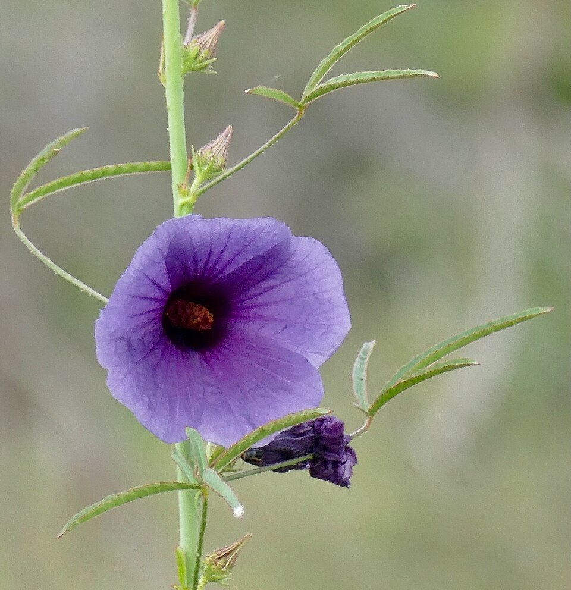

# Kenaf

> **Node ID**: plants.edible-plants.kenaf
> **Domain**: [Plants](./index.md)
> **Dependencies**: See prerequisites
> **Enables**: [`Edible Plants`](edible-plants.md)
> **Timeline**: Years 0-5
> **Outputs**: edible_plant_material
> **Critical**: No

## Overview

> *Image: Bernard DUPONT from FRANCE, CC BY-SA 2.0*

Kenaf

*Hibiscus cannabinus* (Malvaceae) is a fiber & industrial crop species of major importance for civilization bootstrapping. Vegetable kenaf, Indian hemp provides fruit, leaves, seeds/nuts as its primary edible product and ranks 63/100 on the nutrition score.

Hibiscus cannabinus is a frost-tender annual or perennial growing rapidly to 1.8 m, hardy to UK zone 10. Hermaphroditic flowers appear August-September with seeds ripening October-November; insect pollination and self-fertility occur. The plant attracts wildlife, accommodates light sandy to heavy clay soils with good drainage, tolerates mildly acid to basic pH, requires full sun, and prefers moist conditions.

Edible parts: Leaves, Seeds, Pods, Fruit, Flowers, Seeds - oil, Bark, Gum, Vegetable Young leaves are cooked and used as a potherb or added to soups. They have an acid, sorrel-like flavour. Seeds can be roasted or ground into flour and made into a type of cake. The root is edible but very fibrous, mucilaginous, and without much flavour. An edible oil is extracted from the seeds, with yields varying from 2 to 10 tonnes per hectare.

For civilization bootstrapping, kenaf is significant because of its role as a fiber & industrial crop. Reliable food production is the foundation upon which all other technological development rests. Understanding the cultivation, processing, and storage of *Hibiscus cannabinus* enables communities to establish food security and allocate labor to non-subsistence activities.

*Hibiscus cannabinus* is a member of the Malvaceae family. As a fiber & industrial crop, it provides essential calories, protein, or other nutrients needed to sustain human populations during the bootstrap process. The ability to produce food reliably from cultivated plants is what separates sedentary civilizations from hunter-gatherer societies, because food surplus allows specialization of labor into toolmaking, construction, and eventually metallurgy and beyond.

This species grows as a perennial or annual depending on climate and management. Propagation is primarily by Sow seed in early spring in a warm greenhouse. Germination is usually fairly rapid. Prick seedlings into individual pots when large enough. For annual cultivation, plant out into permanent positions in early summer with frame or cloche protection until established. To grow as perennials, keep plants in the greenhouse through their first year and plant out in early summer of the following year. Take half-ripe cuttings in July or August in a frame, and overwinter in a warm greenhouse before planting out after the last expected frosts.. Harvest timing depends on the plant part used: fruit, leaves, seeds/nuts, flowers, bark/sap are typically ready at specific growth stages or seasons.

## Prerequisites

### Materials

- Propagation material: Sow seed in early spring in a warm greenhouse. Germination is usually fairly rapid. Prick seedlings into individual pots when large enough. For annual cultivation, plant out into permanent positions in early summer with frame or cloche protection until established. To grow as perennials, keep plants in the greenhouse through their first year and plant out in early summer of the following year. Take half-ripe cuttings in July or August in a frame, and overwinter in a warm greenhouse before planting out after the last expected frosts.
- Compost or organic matter for soil amendment
- Mulch material for moisture retention and weed suppression

### Equipment

- Hoe or digging stick for soil preparation and planting
- Sickle, machete, or harvesting knife for crop harvest
- Drying racks or flat drying surfaces for post-harvest processing
- Storage containers: woven baskets, ceramic jars, or sacks for dried product
- Winnowing baskets or screens if processing grains or seeds

### Knowledge

- Species identification: A herb. It can grow from seed each year or keep growing from year to year. It grows up to 3.5 m high. It has a few sharp spines. The leaf stalk is 6-20 cm long. The leaf blade has 2 forms. The leaves lower on the stem are heart shaped and those higher on the stem have 4-7 lobes arranged like fingers
- Understanding of planting timing relative to local frost dates and rainy seasons
- Knowledge of soil preparation, seed depth, and spacing requirements
- Recognition of common pests and diseases and their early indicators
- Safe preparation methods for any toxic or bitter compounds (see Safety)

### Infrastructure

- Field or garden site with suitable climate, soil type, and sun exposure
- Reliable water access for germination and establishment phase
- Fenced or protected area if animal browsing is a risk
- Storage structure protected from moisture, rodents, and insects

## Process Description

### Cultivation and Propagation

Prefers a well-drained humus rich fertile soil in full sun. Tolerates most soils but prefers a light sandy soil. Plants are adapted to a wide range of soils and climatic conditions. Kenaf is reported to tolerate an annual precipitation in the range of 57 to 410cm, an annual temperature range of 11.1 to 27.5°C and a pH in the range of 4.3 to 8.2 (though it prefers neutral to slightly acid). The plant is frost-sensitive and damaged by heavy rains with strong winds. Kenaf is widely cultivated in tropical and subtropical areas of the world, where it is grown mainly as a fibre crop but also for its seeds and leaves. It is not very hardy outdoors in Britain; it requires a frost-free climate. It can, however, probably be grown as an annual. A fast-growing plant, it can be harvested in 3 - 4 months from seed. The plant requires temperatures in the range of 15 - 25°c. It succeeds as a crop as far north in N. America as Indiana, Iowa, Kansas and Nebraska. Plants are daylight sensitive, they remain vegetative and do not flower until the daylength is less than 12.5 hr/day. Two weeks of very cloudy days will induce flowering as daylength approaches 12.5 hr. The plant has a deep-penetrating taproot with deep-seated laterals. Plants, including any varieties, are partially self-fertile. Kenaf is typically harvested in late summer to early autumn when the plants reach maturity. Kenaf usually flowers in summer. Kenaf grows rapidly, reaching 2 to 3 meters (6 to 10 feet) within 4 to 5 months after planting. Propagation: Sow seed in early spring in a warm greenhouse. Germination is usually fairly rapid. Prick seedlings into individual pots when large enough. For annual cultivation, plant out into permanent positions in early summer with frame or cloche protection until established. To grow as perennials, keep plants in the greenhouse through their first year and plant out in early summer of the following year. Take half-ripe cuttings in July or August in a frame, and overwinter in a warm greenhouse before planting out after the last expected frosts.

### Distribution and Growing Conditions

### Identification

A herb. It can grow from seed each year or keep growing from year to year. It grows up to 3.5 m high. It has a few sharp spines. The leaf stalk is 6-20 cm long. The leaf blade has 2 forms. The leaves lower on the stem are heart shaped and those higher on the stem have 4-7 lobes arranged like fingers on a hand. These lobes are sword shaped and 2-12 cm long by 0.6-2 cm wide. They have teeth around the edge. They taper at the tip. The flowers are yellow, white or ivory and red at the base. They occur singly in the axils of leaves. They are large and up to 10 cm across. They have very short stalks. The fruit is a capsule about 1.5 cm across. The seeds are kidney shaped.

### Edible Parts and Preparation

## Quantitative Parameters

### Nutritional Composition (per 100g)

| Part | Moisture | kJ | kcal | Protein | Vit A | Vit C | Iron | Zinc |
| --- | --- | --- | --- | --- | --- | --- | --- | --- |
| Seeds dried | 8.1 | 1785 | 427 | 20.2 | — | — | — | — |
| Leaves | 79 | 280 | 67 | 5.5 | 34 | — | 12.1 | — |

### Growing Parameters

| Parameter | Value | Notes |
|-----------|-------|-------|
| Annual rainfall | 635 mm | Growing requirement |
| Hardiness zones | 10-12 | USDA |
| Edible parts | Fruit, Leaves, Seeds/Nuts, Flowers, Bark/Sap | Primary harvest |

## Processing and Storage

### Non-Food Uses

Kenaf can be used for erosion control and as a cover crop to improve soil health. It accumulates minerals including selenium and boron and can be used as a bioremedial tool for removing these from contaminated soil. The stems yield a fibre that is a good jute substitute, though slightly coarser. Fibre strands measure 1.5–3 metres in length and are used for rope, cordage, canvas, sacking, carpet backing, nets, tablecloths, and similar products. For the best fibre quality, stems should be harvested shortly after flowering; the finest fibre comes from the base of the stems, so hand pulling is often preferred over machine harvesting. Average fibre yields are around 1.25 tonnes per hectare, though 2.7 tonnes has been achieved in Cuba. Stem pulp has been used in paper making. The seed contains 18–35% of a semi-drying oil similar to groundnut oil, used for burning, lubrication, soap making, and the production of linoleum, paints, and varnishes. Stems have been used as plant supports for runner beans. Soot from the stems provides a black pigment for dyes. The stem has also been used as a base for fire-drilling. Flowers attract bees, butterflies, and other pollinators with their nectar and pollen. The foliage provides habitat for beneficial insects, and leaf litter can serve as shelter for invertebrates.

### Storage

Dry seeds thoroughly to below 14% moisture content before storage. Spread in thin layers on drying racks in full sun, stirring periodically. Test dryness by biting: properly dried seeds crack rather than dent. Store in airtight containers (ceramic jars with tight lids, sealed woven bags) in a cool, dry, dark location. Protect from rodents and insects with tight lids or by mixing with inert ash. Under good conditions, dried grains and legumes store for 1-5 years with minimal loss.

### Material Handling

Handle kenaf produce with clean hands and tools to prevent contamination. Remove field heat promptly after harvest by moving product to shade. Process within the recommended timeframe to prevent quality loss. Compost crop residues and processing waste to return organic matter to the soil. Label stored products with harvest date, variety, and any treatments applied.

## Scaling Notes

- **Bench scale**: Individual plants or small garden plot (10-50 plants). Output for direct household consumption. Useful for seed saving, variety selection, and learning the crop's behavior under local conditions.
- **Pilot scale**: Field planting of 0.1 to 1 hectare (500-5,000 plants). Staggered planting or sequential harvests to extend availability. Requires basic hand tools and family-level labor. Surplus can be traded or stored.
- **Production scale**: Multi-hectare cultivation with mechanized planting, harvesting, and processing. Requires plow animals or tractors, grain mills or processing equipment, and bulk storage facilities. Enables community-level food security and trade.

Key scaling challenges include maintaining genetic diversity at plantation scale, managing pest and disease pressure in monoculture, and matching post-harvest processing capacity to harvest volume. Seed saving and variety selection at bench scale directly informs decisions about which cultivars to scale up.

## Troubleshooting

| Problem | Probable Cause | Solution |
|---------|---------------|----------|
| Poor germination | Old seed, wrong soil temperature, planted too deep, or insufficient moisture | Use fresh seed; verify germination temperature range; plant at recommended depth; maintain soil moisture during germination |
| Pest damage | Insect infestation or browsing animals | Hand-pick pests; use companion planting with repellent species; install fencing for larger pests |
| Disease (fungal/bacterial) | Poor air circulation, excessive moisture, infected seed | Space plants adequately; avoid overhead watering; use clean seed from disease-free plants; practice crop rotation |
| Low yield | Nutrient deficiency, water stress, overcrowding, or shade | Amend soil with compost or manure; ensure adequate water at critical growth stages; thin to recommended spacing; plant in full sun |
| Storage losses | Insufficient drying, rodent/insect damage, high humidity | Dry product thoroughly before storage; use sealed containers; inspect stored product regularly; keep storage area clean and dry |
| Quality or safety note | See species-specific notes | There are about 220 Hibiscus species. |

## Safety Considerations

Working with *Hibiscus cannabinus* involves the following hazards:

- Tool injuries during harvest and processing — use sharp tools in good condition and cut away from the body
- Allergic reactions to plant compounds — sensitive individuals should test small quantities first
- Sun exposure and heat stress during field work — schedule heavy work for early morning or late afternoon
- Musculoskeletal strain from repetitive harvesting motions — vary tasks and take regular breaks

### Personal Protective Equipment

- Sturdy gloves when handling plants with irritant sap, spines, or rough surfaces
- Long sleeves and trousers for field work to reduce skin exposure to irritants and insects
- Eye protection when using cutting tools overhead or near face level
- Sun hat and sunscreen for extended field work

### Emergency Procedures

- For suspected plant poisoning: stop eating immediately, save a sample of the plant material, and seek medical attention. Do not induce vomiting unless directed by a medical professional.
- For tool lacerations: apply direct pressure with a clean cloth, elevate the wound, and seek medical attention for cuts deeper than skin level.
- For allergic reaction (swelling, difficulty breathing): discontinue exposure immediately and seek emergency medical help.

## Quality Control

### Acceptance Criteria

- Harvest product shows expected color, texture, size, and flavor for the variety grown
- No visible mold, rot, pest damage, or foreign material in stored product
- Dried products are brittle throughout with no flexible or moist spots
- Seeds intended for storage test at below 14% moisture content

### Testing Methods

- **Visual inspection**: check for discoloration, mold, insect damage, or foreign material
- **Bite test (seeds/grains)**: properly dried seeds crack cleanly; under-dried seeds dent or feel leathery
- **Smell test**: fresh product has characteristic aroma; off-odors indicate spoilage or contamination
- **Snap test (dried products)**: properly dried material snaps rather than bends

### Sampling Protocol

For field-scale production, inspect every 10th plant during harvest for disease and pest damage. Grade each batch by size and quality before storage. Record yield per unit area to track productivity trends across seasons and identify declining performance early.

## Variations and Alternatives

### Medicinal Uses

The juice of the flowers, mixed with sugar and black pepper, is used to treat biliousness with acidity. The seeds are considered aphrodisiac and are added to the diet to promote weight gain. Externally, seeds are applied as a poultice for pains and bruises. The leaves are purgative, and a leaf infusion is used to treat coughs. In Ayurvedic medicine, the leaves are used for dysentery and bilious, blood, and throat disorders. Powdered leaves are applied to Guinea worms in Africa. Stem peelings have been used in the treatment of anaemia, fatigue, and lassitude.

### Other Uses

### Additional Information

Leaves are sold in markets. It is high yielding and popular.

### Notes

There are about 220 Hibiscus species.

### Related Species

- [Cotton](cotton.md)
- [Flax](flax.md)
- [Hemp](hemp.md)
- [Ramie](ramie.md)
- [Jute](jute.md)

### Cultivar Selection

Within *Hibiscus cannabinus*, considerable variation exists in yield, disease resistance, climate adaptation, and quality characteristics. When establishing a kenaf crop, select varieties adapted to local conditions: day length, temperature range, rainfall pattern, and soil type. Landrace varieties — locally adapted populations maintained by traditional farmers — often outperform modern cultivars under low-input conditions because they have been selected for resilience rather than maximum yield under optimal conditions.

Seed saving from the best-performing plants each generation gradually adapts the variety to local conditions. Select for vigor, disease resistance, appropriate maturity timing, and product quality. Maintain genetic diversity by saving seed from multiple plants rather than a single individual, which preserves the population's ability to adapt to changing conditions and disease pressures.

### Crop Rotation and Companion Planting

*Hibiscus cannabinus* benefits from crop rotation to prevent buildup of species-specific pests and diseases. Avoid planting in the same field in consecutive seasons where possible. Follow with a different crop family to break pest cycles and maintain soil health.

Companion planting with aromatic herbs or flowering plants can deter pests and attract beneficial insects. Avoid planting near species that compete for the same nutrients or harbor shared pathogens.

## References

- [Edible Plants](edible-plants.md) — parent capability
- [Plants Domain](./index.md) — domain overview and related capabilities
- [Agave](agave.md) — example plant article format
- [Textiles](../textiles/index.md) — kenaf fiber processing and cordage production
- [Paper / Chemistry](../chemistry/index.md) — kenaf pulp for papermaking
- [Food Processing](../food-processing/index.md) — downstream processing of harvested crops
- [Agriculture](../agriculture/index.md) — cultivation systems and crop rotation
- Family: Malvaceae
- Distribution: Andorra, United Arab Emirates, Afghanistan, Antigua &amp; Barbuda, Albania, Armenia, Angola, Austria, Australia, Azerbaijan, Bosnia &amp; Herzegovina, Barbados, Bangladesh, Belgium, Burkina Faso, Bulgaria, Bahrain, Burundi, Benin, Brunei and 148 more
- Data sourced from Food Plants International, Wikipedia, and iNaturalist via the Edible Plant Database (ZIM)
- Plants for a Future (pfaf.org) — supplementary cultivation and use data

---
*Part of the [Bootciv Tech Tree](../index.md) · [Plants](./index.md) · [All Domains](../index.md)*
