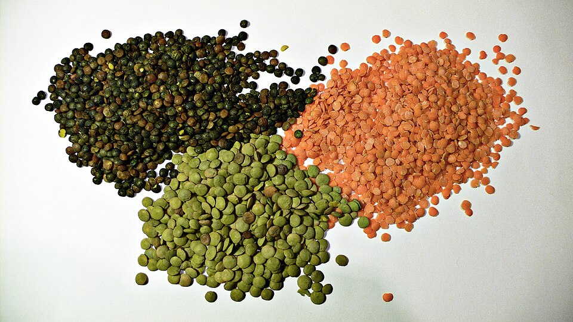

# Lentil

> **Node ID**: plants.edible-plants.lentil
> **Domain**: [Plants](./index.md)
> **Dependencies**: See prerequisites
> **Enables**: [`Edible Plants`](edible-plants.md)
> **Timeline**: Years 0-5
> **Outputs**: edible_plant_material
> **Critical**: Yes

## Overview

> *Image: Whoisjohngalt, CC BY-SA 4.0*

Lentil

*Lens culinaris* (Fabaceae) is a legumes & pulse species of major importance for civilization bootstrapping. Lentil provides seeds/nuts as its primary edible product.

Edible parts: Seed, Seedpod Seed - cooked or sprouted and eaten raw. A very nutritious food, the seeds can be cooked on their own or added to soups, stews etc. The seed can be soaked for 12 hours in warm water and then allowed to sprout for about 5 days. They have a crunchy, fresh flavour. Lentils are more digestible than many legumes. The dried seed can also be ground into a powder and used with cereal flours in making bread etc, this greatly enhances the value of the protein in the bread. The seed stores better if it is left in its husk. Young seedpods - used fresh or cooked like green beans.

For civilization bootstrapping, lentil is significant because of its role as a legumes & pulse. Reliable food production is the foundation upon which all other technological development rests. Understanding the cultivation, processing, and storage of *Lens culinaris* enables communities to establish food security and allocate labor to non-subsistence activities.

*Lens culinaris* is a member of the Fabaceae family. As a legumes & pulse, it provides essential calories, protein, or other nutrients needed to sustain human populations during the bootstrap process. The ability to produce food reliably from cultivated plants is what separates sedentary civilizations from hunter-gatherer societies, because food surplus allows specialization of labor into toolmaking, construction, and eventually metallurgy and beyond.

This species grows as a perennial or annual depending on climate and management. Propagation is primarily by Seed - sow early April in situ. Some cultivars are probably suitable for sowing outdoors in the autumn, at least in the milder parts of the country.. Harvest timing depends on the plant part used: seeds/nuts are typically ready at specific growth stages or seasons.

## Prerequisites

### Materials

- Propagation material: Seed - sow early April in situ. Some cultivars are probably suitable for sowing outdoors in the autumn, at least in the milder parts of the country.
- Compost or organic matter for soil amendment
- Mulch material for moisture retention and weed suppression

### Equipment

- Hoe or digging stick for soil preparation and planting
- Sickle, machete, or harvesting knife for crop harvest
- Drying racks or flat drying surfaces for post-harvest processing
- Storage containers: woven baskets, ceramic jars, or sacks for dried product
- Winnowing baskets or screens if processing grains or seeds

### Knowledge

- Species identification: Lens culinaris is a ANNUAL growing to 0.5 m (1ft 8in). It is not frost tender. The species is hermaphrodite (has both male and female organs) and is pollinated by Cleistogomy (self-pollinating without flowers ever opening). The plant is self-fertile. It can fix Nitrogen. Suitable for: light (sandy),
- Understanding of planting timing relative to local frost dates and rainy seasons
- Knowledge of soil preparation, seed depth, and spacing requirements
- Recognition of common pests and diseases and their early indicators
- Safe preparation methods for any toxic or bitter compounds (see Safety)

### Infrastructure

- Field or garden site with suitable climate, soil type, and sun exposure
- Reliable water access for germination and establishment phase
- Fenced or protected area if animal browsing is a risk
- Storage structure protected from moisture, rodents, and insects

## Process Description

### Cultivation and Propagation

An easily grown plant, it prefers a sandy soil in a warm sunny sheltered position. Another report says that it does best on clay. It produces most seed when grown on poorer soils. Lentils are widely cultivated in warm temperate and tropical zones for their edible and very nutritious seed, there are many named varieties. The plants are much hardier than is commonly supposed and many of these varieties can succeed in Britain, particularly in warm summers. There is at least one, called 'WH2040', that can withstand temperatures as low as -23°c in the seedling stage. 'Chilean' is a low-growing plant that can be grown in the winter in areas where winter vegetables can be grown. 'Har. Len' tolerates temperatures down to -10°c and performs very well in gardens. The plants take the same time as peas to mature, so lentils are a potential commercial crop for Britain. Yields of up to 2 tonnes per hectare are possible. The main problem with growing them as a commercial crop is that they are produced by using cheap labour in many countries which makes it very difficult for British farmers to compete on prices. However, this does not preclude their being grown in the garden and allotment. Lentils are also beneficial to grow as part of a rotation on the farm or garden. They have a symbiotic relationship with certain soil bacteria, these bacteria form nodules on the roots and fix atmospheric nitrogen. Some of this nitrogen is utilized by the growing plant but some can also be used by other plants growing nearby and, if the roots are left in the ground when the seeds are harvested, this will provide a source of nitrogen for the next crop. Propagation: Seed - sow early April in situ. Some cultivars are probably suitable for sowing outdoors in the autumn, at least in the milder parts of the country.

### Distribution and Growing Conditions

Original habitat is obscure, possibly the Mediterranean. TEMPERATE ASIA: Afghanistan (east), Cyprus, Iran, Iraq, Israel, Jordan, Lebanon, Syria, Turkey, Azerbaijan, Georgia, Kazakhstan (south), Tajikistan, Turkmenistan, Uzbekistan TROPICAL ASIA: Pakistan (northwest) EUROPE: Greece

### Identification

Lens culinaris is a ANNUAL growing to 0.5 m (1ft 8in). It is not frost tender. The species is hermaphrodite (has both male and female organs) and is pollinated by Cleistogomy (self-pollinating without flowers ever opening). The plant is self-fertile. It can fix Nitrogen. Suitable for: light (sandy), medium (loamy) and heavy (clay) soils, prefers well-drained soil and can grow in nutritionally poor soil. Suitable pH: mildly acid, neutral and basic (mildly alkaline) soils. It cannot grow in the shade. It prefers dry or moist soil.

### Edible Parts and Preparation

## Quantitative Parameters

### Growing Parameters

| Parameter | Value | Notes |
|-----------|-------|-------|
| Edible parts | Seeds/Nuts | Primary harvest |

## Processing and Storage

### Non-Food Uses

Fuel Green manure. Agroforestry Uses: The plant can be used as a green manure. Lentil is mainly grown as a sole crop, but sometimes mixed with other crops, e.g. in India with barley, mustard or castor. Other Uses: The seeds are a source of starch for the textile and printing industries. The plant remains, after the seed has been harvested, can be used as a fuel.

### Storage

Dry seeds thoroughly to below 14% moisture content before storage. Spread in thin layers on drying racks in full sun, stirring periodically. Test dryness by biting: properly dried seeds crack rather than dent. Store in airtight containers (ceramic jars with tight lids, sealed woven bags) in a cool, dry, dark location. Protect from rodents and insects with tight lids or by mixing with inert ash. Under good conditions, dried grains and legumes store for 1-5 years with minimal loss.

### Material Handling

Handle lentil produce with clean hands and tools to prevent contamination. Remove field heat promptly after harvest by moving product to shade. Process within the recommended timeframe to prevent quality loss. Compost crop residues and processing waste to return organic matter to the soil. Label stored products with harvest date, variety, and any treatments applied.

## Scaling Notes

- **Bench scale**: Individual plants or small garden plot (10-50 plants). Output for direct household consumption. Useful for seed saving, variety selection, and learning the crop's behavior under local conditions.
- **Pilot scale**: Field planting of 0.1 to 1 hectare (500-5,000 plants). Staggered planting or sequential harvests to extend availability. Requires basic hand tools and family-level labor. Surplus can be traded or stored.
- **Production scale**: Multi-hectare cultivation with mechanized planting, harvesting, and processing. Requires plow animals or tractors, grain mills or processing equipment, and bulk storage facilities. Enables community-level food security and trade.

Key scaling challenges include maintaining genetic diversity at plantation scale, managing pest and disease pressure in monoculture, and matching post-harvest processing capacity to harvest volume. Seed saving and variety selection at bench scale directly informs decisions about which cultivars to scale up.

## Troubleshooting

| Problem | Probable Cause | Solution |
|---------|---------------|----------|
| Poor germination | Old seed, wrong soil temperature, planted too deep, or insufficient moisture | Use fresh seed; verify germination temperature range; plant at recommended depth; maintain soil moisture during germination |
| Pest damage | Insect infestation or browsing animals | Hand-pick pests; use companion planting with repellent species; install fencing for larger pests |
| Disease (fungal/bacterial) | Poor air circulation, excessive moisture, infected seed | Space plants adequately; avoid overhead watering; use clean seed from disease-free plants; practice crop rotation |
| Low yield | Nutrient deficiency, water stress, overcrowding, or shade | Amend soil with compost or manure; ensure adequate water at critical growth stages; thin to recommended spacing; plant in full sun |
| Storage losses | Insufficient drying, rodent/insect damage, high humidity | Dry product thoroughly before storage; use sealed containers; inspect stored product regularly; keep storage area clean and dry |

## Safety Considerations

Working with *Lens culinaris* involves the following hazards:

- **Toxicity**: Parts of this plant may contain compounds that are toxic when raw or improperly prepared. Always follow proper preparation procedures before consumption. Verify with multiple authoritative sources.
- Tool injuries during harvest and processing — use sharp tools in good condition and cut away from the body
- Allergic reactions to plant compounds — sensitive individuals should test small quantities first
- Sun exposure and heat stress during field work — schedule heavy work for early morning or late afternoon
- Musculoskeletal strain from repetitive harvesting motions — vary tasks and take regular breaks

### Personal Protective Equipment

- Sturdy gloves when handling plants with irritant sap, spines, or rough surfaces
- Long sleeves and trousers for field work to reduce skin exposure to irritants and insects
- Eye protection when using cutting tools overhead or near face level
- Sun hat and sunscreen for extended field work

### Emergency Procedures

- For suspected plant poisoning: stop eating immediately, save a sample of the plant material, and seek medical attention. Do not induce vomiting unless directed by a medical professional.
- For tool lacerations: apply direct pressure with a clean cloth, elevate the wound, and seek medical attention for cuts deeper than skin level.
- For allergic reaction (swelling, difficulty breathing): discontinue exposure immediately and seek emergency medical help.

## Quality Control

### Acceptance Criteria

- Harvest product shows expected color, texture, size, and flavor for the variety grown
- No visible mold, rot, pest damage, or foreign material in stored product
- Dried products are brittle throughout with no flexible or moist spots
- Seeds intended for storage test at below 14% moisture content

### Testing Methods

- **Visual inspection**: check for discoloration, mold, insect damage, or foreign material
- **Bite test (seeds/grains)**: properly dried seeds crack cleanly; under-dried seeds dent or feel leathery
- **Smell test**: fresh product has characteristic aroma; off-odors indicate spoilage or contamination
- **Snap test (dried products)**: properly dried material snaps rather than bends

### Sampling Protocol

For field-scale production, inspect every 10th plant during harvest for disease and pest damage. Grade each batch by size and quality before storage. Record yield per unit area to track productivity trends across seasons and identify declining performance early.

## Variations and Alternatives

### Medicinal Uses

Laxative Poultice. The seeds are mucilaginous and laxative. They are considered to be useful in the treatment of constipation and other intestinal affections. Made into a paste, they are a useful cleansing application in foul and indolent ulcers.

### Other Uses

### Related Species

- [Garden Pea](garden-pea.md)
- [Chickpea](chickpea.md)
- [Cowpea](cowpea.md)
- [Fava Bean](fava-bean.md)
- [White Lupin](white-lupin.md)

### Cultivar Selection

Within *Lens culinaris*, considerable variation exists in yield, disease resistance, climate adaptation, and quality characteristics. When establishing a lentil crop, select varieties adapted to local conditions: day length, temperature range, rainfall pattern, and soil type. Landrace varieties — locally adapted populations maintained by traditional farmers — often outperform modern cultivars under low-input conditions because they have been selected for resilience rather than maximum yield under optimal conditions.

Seed saving from the best-performing plants each generation gradually adapts the variety to local conditions. Select for vigor, disease resistance, appropriate maturity timing, and product quality. Maintain genetic diversity by saving seed from multiple plants rather than a single individual, which preserves the population's ability to adapt to changing conditions and disease pressures.

### Crop Rotation and Companion Planting

*Lens culinaris* is a nitrogen-fixing legume, making it an excellent predecessor crop for nitrogen-demanding cereals and brassicas. The root nodules host Rhizobium bacteria that convert atmospheric nitrogen into plant-available forms, leaving residual nitrogen in the soil after harvest. Rotate with non-legume crops to break pest and disease cycles.

Companion planting with aromatic herbs or flowering plants can deter pests and attract beneficial insects. Avoid planting near species that compete for the same nutrients or harbor shared pathogens.

*Lens culinaris* is a nitrogen-fixing legume, making it an excellent predecessor for cereals. The root nodules host Rhizobium bacteria that convert atmospheric nitrogen to plant-available forms, leaving 30-40 kg/ha of residual nitrogen in the soil after harvest. Lentil's semi-erect growth habit and relatively short stature make it compatible with intercropping systems. Rotate with wheat or barley for maximum benefit to both crops.

## References

- [Edible Plants](edible-plants.md) — parent capability
- [Plants Domain](./index.md) — domain overview and related capabilities
- [Agave](agave.md) — example plant article format
- [Food Processing](../food-processing/index.md) — downstream processing of harvested crops
- [Agriculture](../agriculture/index.md) — cultivation systems and crop rotation
- Family: Fabaceae
- Data sourced from Food Plants International, Wikipedia, and iNaturalist via the Edible Plant Database (ZIM)
- Plants for a Future (pfaf.org) — supplementary cultivation and use data

Lentils are among the most drought-tolerant grain legumes, producing reliable yields with as little as 250-300 mm of growing-season rainfall. The crop fixes 40-90 kg of nitrogen per hectare through rhizobial symbiosis, making it an excellent rotation crop before nitrogen-demanding cereals. Cooking time varies by variety: red lentils cook in 15-20 minutes, while green and brown varieties require 30-45 minutes.

Lentils are self-pollinating with a low outcrossing rate (less than 0.5%), making seed saving straightforward and reliable. Selected varieties breed true from seed, allowing communities to maintain and improve their own lentil germplasm without specialized breeding programs. This genetic stability makes lentils an excellent crop for seed-saving traditions and local adaptation.

---
*Part of the [Bootciv Tech Tree](../index.md) · [Plants](./index.md) · [All Domains](../index.md)*
