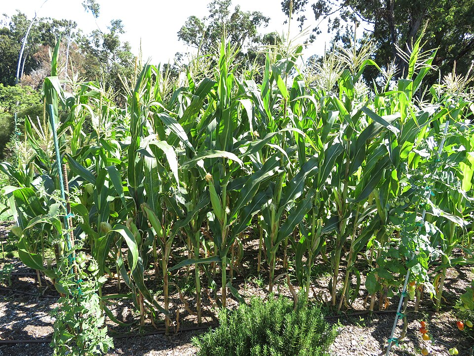

# Maize

> **Node ID**: plants.edible-plants.maize
> **Domain**: [Plants](./index.md)
> **Dependencies**: See prerequisites
> **Enables**: [`Edible Plants`](edible-plants.md)
> **Timeline**: Years 0-5
> **Outputs**: edible_plant_material
> **Critical**: Yes

## Overview

> *Zea mays (Corn) Hawaiian Supersweet 10 in veggie garden flowers and fruit at Hawea Pl Olinda, Maui, Hawaii. July 20, 2020 #200720-7807 - Image by Starr Environmental*

> *Image: Forest and Kim Starr, CC BY 2.0*

Maize

*Zea mays* (Poaceae) is a staple food crop species of major importance for civilization bootstrapping. Corn, Maize provides leaves, seeds/nuts, flowers as its primary edible product and ranks 68/100 on the nutrition score.

Annual reaching 2 m tall, growing at fast rate. Hardy to UK zone 3 but frost tender. Flowers July to October with seeds ripening September to October. Monoecious with wind pollination. Tolerates light sandy, medium loamy, and heavy clay soils with good drainage. Grows in mildly acidic to neutral soils. Requires full sun and prefers moist soil.

Edible parts: Seeds, Leaves, Cereal, Flowers, Vegetable Corn is one of the most widely grown food plants in the world. The seed can be eaten raw or cooked before fully ripe; sweet corn varieties have been developed specifically for this purpose and have particularly sweet, flavoursome seeds. Mature seed can be dried and used whole or ground into flour — it has a mild flavour and is especially valued as a thickening agent in foods such as custards. Starch extracted from the grain is used in confectionery and noodles. Certain varieties can be oven-heated to make popcorn. The seed can also be sprouted for use in uncooked breads and cereals. The fresh succulent silks — the flowering parts of the cob — are edible. An edible all-purpose culinary oil is obtained from the seed and used in salads and for cooking. Pollen, which is rich in protein, is used as a soup ingredient; it is harvested by tapping the flowering heads over a bowl, and collecting the pollen also helps improve seed fertilisation. The roasted seed serves as a coffee substitute. The pith of the stem can be chewed like sugar cane and is sometimes made into a syrup. Nutritional composition per 100g of fresh seed: 361 calories; water 10.6%; protein 9.4g; fat 4.3g; carbohydrate 74.4g; fibre 1.8g; ash 1.3g; calcium 9mg; phosphorus 290mg; iron 2.5mg; vitamin A 140mg; thiamine (B1) 0.43mg; riboflavin (B2) 0.1mg; niacin 1.9mg.

In warm moist soil seeds geminate in 2-3 days after planting. Cobs are harvested when the grains are full and the tassel is just starting to turn brown. This is normally about 50 days after fertilisation. It is sweetest eaten soon after harvesting. Drought and unfavourable weather can result in the silks of the female flowers emerging after the pollen has been shed. This results in poorly pollinated cobs.

For civilization bootstrapping, maize is significant because of its role as a staple crop. Reliable food production is the foundation upon which all other technological development rests. Understanding the cultivation, processing, and storage of *Zea mays* enables communities to establish food security and allocate labor to non-subsistence activities.

*Zea mays* is a member of the Poaceae family. As a staple food crop, it provides essential calories, protein, or other nutrients needed to sustain human populations during the bootstrap process. The ability to produce food reliably from cultivated plants is what separates sedentary civilizations from hunter-gatherer societies, because food surplus allows specialization of labor into toolmaking, construction, and eventually metallurgy and beyond.

This species grows as a perennial or annual depending on climate and management. Propagation is primarily by Sow seed in April in individual pots in a greenhouse, grow on quickly, and plant out after the last expected frosts. A direct outdoor sowing — particularly of less sweet varieties — can be attempted in May.. Harvest timing depends on the plant part used: leaves, seeds/nuts, flowers are typically ready at specific growth stages or seasons.

## Prerequisites

### Materials

- Propagation material: Sow seed in April in individual pots in a greenhouse, grow on quickly, and plant out after the last expected frosts. A direct outdoor sowing — particularly of less sweet varieties — can be attempted in May.
- Compost or organic matter for soil amendment
- Mulch material for moisture retention and weed suppression

### Equipment

- Hoe or digging stick for soil preparation and planting
- Sickle, machete, or harvesting knife for crop harvest
- Drying racks or flat drying surfaces for post-harvest processing
- Storage containers: woven baskets, ceramic jars, or sacks for dried product
- Winnowing baskets or screens if processing grains or seeds

### Knowledge

- Species identification: A grass. It is an annual plant 2-3 m high. It has a single stem. The stem is solid. It can be 2-3 cm across. Usually there are 14 internodes but this can vary from 8-21. It is a large grass family plant with prop roots near the base. Some forms produce tillers near the base. Seed roots feed the plan
- Understanding of planting timing relative to local frost dates and rainy seasons
- Knowledge of soil preparation, seed depth, and spacing requirements
- Recognition of common pests and diseases and their early indicators
- Safe preparation methods for any toxic or bitter compounds (see Safety)

### Infrastructure

- Field or garden site with suitable climate, soil type, and sun exposure
- Reliable water access for germination and establishment phase
- Fenced or protected area if animal browsing is a risk
- Storage structure protected from moisture, rodents, and insects

## Process Description

### Cultivation and Propagation

Requires a warm position a well drained soil and ample moisture in the growing season. Prefers a pH in the range 5.5 to 6.8. Requires a rich soil if it is to do well. Corn is widely cultivated for its edible seed, especially in tropical and warm temperate zones of the world, there are many named varieties. Unfortunately, the plant is not frost tolerant and so needs to be started off under glass in Britain if a reasonable crop is to be grown. There are five main types:- Sweetcorn is of fairly recent development. It has very sweet, soft-skinned grains that can be eaten raw or cooked before they are fully ripe. Cultivars have been developed that can produce a worthwhile crop even in the more northerly latitudes of Britain if a suitable warm sunny sheltered site is chosen[238, K. Popcorn is a primitive form with hard-skinned grains. When roasted, these grains 'explode' to form the popular snack 'popcorn'. Waxy corn is used mainly in the Far East. It has a tapioca-like starch. Flint corn, which shrinks on drying, can have white, yellow, purple, red or blue-black grains. It is not so sweet and also takes longer to mature so is a problematic crop in Britain. There are many other uses for this plant as detailed below. Dent corn has mostly white to yellow grains. This and Flint corn are widely grown for oils, cornflour, cereals and silage crops. Corn grows well with early potatoes, legumes, dill, cucurbits and sunflowers, it dislikes growing with tomatoes. In garden design, as well as the above-ground architecture of a plant, root structure considerations help in choosing plants that work together for their optimal soil requirements including nutrients and water. Propagation: Sow seed in April in individual pots in a greenhouse, grow on quickly, and plant out after the last expected frosts. A direct outdoor sowing — particularly of less sweet varieties — can be attempted in May.

### Distribution and Growing Conditions

### Identification

A grass. It is an annual plant 2-3 m high. It has a single stem. The stem is solid. It can be 2-3 cm across. Usually there are 14 internodes but this can vary from 8-21. It is a large grass family plant with prop roots near the base. Some forms produce tillers near the base. Seed roots feed the plant initially then casual side roots develop from the lowest node on the plant and continue supplying the plants nutrients. Roots can go sideways for 1 m or downwards for 2-3 m. It is a very variable plant and due to cross pollination variation continues and all forms hybridize. Leaves are produce one after another along opposite sides of the stem and there are between 8 and 21 leaves. The leaf sheath wraps around the stem but opens towards the top of the sheath. The leaf blade is 30-150 cm long and 5-15 cm wide. The leaf blade has a pronounced midrib and is often wavy along the edge. The male flower or tassel is at the top. The female flower is called the ear. It is on a short stalk in the axils of one of the largest leaves about half way down the stem. In the axils of the leaves it produces a large cob wrapped in leaves. The kernels develop in an even number of rows carrying 4-30 grains along the length of the cob. Cobs commonly have 300-1,000 grains. Normally only one or two cobs develop per plant. The seed endosperm is soft in dent types, hard in flint and popcorn types and have more sugar in sweet types.

### Edible Parts and Preparation

#### Harvesting and Drying

1. Harvest field corn (dent or flint types) when kernels are fully mature and the husks have dried to a pale tan. The kernels should be hard and dented (dent types) or smooth and rounded (flint types). Moisture content at harvest: 20-25%.
2. Peel back husks and leave ears on the stalk to field-dry for 2-3 weeks in dry weather, or harvest and lay on drying racks under cover. Target moisture: below 14% for safe storage.
3. Shell kernels from the cob by hand (rubbing two ears together) or by beating with a wooden flail. Winnow to remove chaff and silk fragments.
4. For sweet corn: harvest when kernels are plump and milky (about 20 days after silk emergence). Consume or preserve immediately — sugar converts to starch within hours of picking.

#### Nixtamalization (Alkali Processing)

Nixtamalization is the essential process that makes maize nutritionally complete. Raw maize contains niacin (vitamin B3) bound in a form called niacytin that humans cannot absorb. Without treatment, a maize-based diet causes pellagra (diarrhea, dermatitis, dementia, death). Alkali treatment with slaked lime (calcium hydroxide, Ca(OH)₂) liberates bound niacin, softens the pericarp (outer hull), and enriches the grain with calcium.

**Procedure:**

1. Prepare a 1-2% slaked lime solution: dissolve 10-20 g of slaked lime (food-grade calcium hydroxide) per liter of water. Slaked lime is produced by heating limestone (calcium carbonate) to produce quicklime (calcium oxide), then adding water — see [Chemistry](../chemistry/index.md).
2. Add whole dried maize kernels to the lime solution in a clay or iron pot. Use approximately 1 part maize to 2 parts lime solution by volume.
3. Bring to a boil (80-100°C) and simmer for 30-60 minutes. The kernels will swell and the pericarp (outer skin) will loosen and turn yellow-orange from the dissolved lime.
4. Remove from heat and allow to steep in the lime solution for 8-16 hours (overnight). The steeping period allows the alkali to penetrate the endosperm fully, converting bound niacin to bioavailable niacin and gelatinizing surface starch.
5. Drain the lime solution (nejayote — rich in dissolved pericarp, calcium, and nutrients; can be used as a binder for adobe bricks or added to animal feed). Wash the nixtamalized kernels (now called *nixtamal*) thoroughly in clean water, rubbing by hand to remove the loosened pericarp and excess lime. Change water 2-3 times until the water runs clear and the kernels feel smooth.
6. The cleaned nixtamal is now ready for grinding into masa (dough) on a metate (flat stone grinder) or stone mill. The masa has a cohesive, pliable texture from the gelatinized surface starch, allowing it to be pressed flat into tortillas (15-20 cm diameter, 1-2 mm thick) and cooked on a hot clay griddle (comal) for 1-2 minutes per side.

**Yields and ratios:** 1 kg dry maize → ~2.3 kg nixtamal (water absorbed during cooking and steeping) → ~2.2 kg masa. The masa does not keep well — use within 12 hours at room temperature or refrigerate for up to 3 days. For longer storage, dry the nixtamalized kernels and grind into masa flour (masa harina), which stores for months.

**Nutritional impact:** Nixtamalization increases available niacin by 30-50×, adds 50-100 mg calcium per 100 g of tortilla (from the lime), and improves protein digestibility by 5-10%. Without this process, populations relying on untreated maize as a dietary staple are at risk for pellagra.

#### Dry Milling (Cornmeal, Grits, Flour)

1. For cornmeal or grits, start with dried whole kernels (not nixtamalized). Pass through a stone mill or metate. Coarse grind produces grits (particles 1-2 mm); fine grind produces cornmeal (0.2-0.5 mm) or flour (below 0.2 mm).
2. Sift through woven mesh to separate particle sizes. The coarsest fraction (hulls and large fragments) is re-ground or used as animal feed. The finest fraction is corn flour for baking.
3. Cornmeal keeps for 3-6 months in dry storage. Stone-ground cornmeal retains the germ, which adds nutrition but reduces shelf life due to fat oxidation. For longer storage, remove the germ by sieving or use whole-grain meal promptly.

#### Fuel from Stalks and Cobs

After harvest, the entire above-ground maize plant provides fuel and fiber:

- **Dried stalks**: 2-3 m tall, air-dry to 15-20% moisture in 2-4 weeks. Burn directly as fuel (heating value ~15-17 MJ/kg dry matter, comparable to hardwood). One hectare of maize produces 5-8 tonnes of dry stover. Stalks also serve as construction material (wattle infill), mulch, and animal fodder.
- **Corn cobs**: After shelling, dried cobs burn hot and clean. Heating value ~18 MJ/kg dry. Excellent as kindling or as fuel for cooking fires. Also used as abrasive for polishing, as absorbent material, and as a filler in construction (cob brick aggregate). Yield: approximately 1.5-2 tonnes of cobs per hectare.
- **Husks**: Dried husks can be woven into mats, baskets, or doll figures. As fuel, they burn quickly and serve as tinder.

#### Process Parameters

| Parameter | Range | Notes |
|-----------|-------|-------|
| Nixtamalization lime concentration | 1-2% (w/v) | Ca(OH)₂ in water |
| Nixtamalization cook time | 30-60 min | At 80-100°C |
| Nixtamalization steep time | 8-16 hours | Room temperature after cooking |
| Masa yield from dry maize | 2.2 kg/kg | Including water absorbed |
| Calcium gain from nixtamalization | 50-100 mg/100 g tortilla | From lime treatment |
| Niacin liberation factor | 30-50× increase | Bound → bioavailable |
| Stover yield per hectare | 5-8 tonnes (dry) | Stalks + leaves + cobs |
| Cob yield per hectare | 1.5-2 tonnes (dry) | After shelling |
| Stover heating value | 15-17 MJ/kg (dry) | Comparable to hardwood |
| Cornmeal shelf life | 3-6 months | Whole grain; longer if degermed |

## Quantitative Parameters

### Nutritional Composition (per 100g)

| Part | Moisture | kJ | kcal | Protein | Vit A | Vit C | Iron | Zinc |
| --- | --- | --- | --- | --- | --- | --- | --- | --- |
| Seeds (mature) | 10.4 | 1528 | 366 | 10 | 100 | 4 | 4.9 | — |

### Growing Parameters

| Parameter | Value | Notes |
|-----------|-------|-------|
| Growing period | 2–3 days | Maturity range |
| Germination temperature | 10°C | Optimal |
| Hardiness zones | 8-10 | USDA |
| Edible parts | Leaves, Seeds/Nuts, Flowers | Primary harvest |

## Processing and Storage

### Non-Food Uses

A glue is made from the starch in the seed; this starch is also used in cosmetics and the manufacture of glucose. A semi-drying oil obtained from the seed has industrial uses in the manufacture of linoleum, paints, varnishes, and soaps. The corn spathes are used to produce paper, straw hats, and small woven articles such as baskets. Fibre from the stems and seed husks is also used for papermaking: harvested in late summer after the seed, cut into usable pieces, soaked in clear water for 24 hours, cooked for 2 hours in soda ash, then beaten in a ball mill for 1½ hours. The resulting fibres produce a light greenish-cream paper. Care should be taken not to overcook the fibre, as this produces a sticky pulp that is very difficult to form into paper. Dried cobs are used as fuel. The pith of the stems is used as a packing material.

### Storage

Dry seeds thoroughly to below 14% moisture content before storage. Spread in thin layers on drying racks in full sun, stirring periodically. Test dryness by biting: properly dried seeds crack rather than dent. Store in airtight containers (ceramic jars with tight lids, sealed woven bags) in a cool, dry, dark location. Protect from rodents and insects with tight lids or by mixing with inert ash. Under good conditions, dried grains and legumes store for 1-5 years with minimal loss.

### Material Handling

Handle maize produce with clean hands and tools to prevent contamination. Remove field heat promptly after harvest by moving product to shade. Process within the recommended timeframe to prevent quality loss. Compost crop residues and processing waste to return organic matter to the soil. Label stored products with harvest date, variety, and any treatments applied.

## Scaling Notes

- **Bench scale**: Individual plants or small garden plot (10-50 plants). Output for direct household consumption. Useful for seed saving, variety selection, and learning the crop's behavior under local conditions.
- **Pilot scale**: Field planting of 0.1 to 1 hectare (500-5,000 plants). Staggered planting or sequential harvests to extend availability. Requires basic hand tools and family-level labor. Surplus can be traded or stored.
- **Production scale**: Multi-hectare cultivation with mechanized planting, harvesting, and processing. Requires plow animals or tractors, grain mills or processing equipment, and bulk storage facilities. Enables community-level food security and trade.
  Reported production data: In warm moist soil seeds geminate in 2-3 days after planting. Cobs are harvested when the grains are full and the tassel is just starting to turn brown. This is normally about 50 days after fertilisat

Key scaling challenges include maintaining genetic diversity at plantation scale, managing pest and disease pressure in monoculture, and matching post-harvest processing capacity to harvest volume. Seed saving and variety selection at bench scale directly informs decisions about which cultivars to scale up.

## Troubleshooting

| Problem | Probable Cause | Solution |
|---------|---------------|----------|
| Poor germination | Old seed, wrong soil temperature, planted too deep, or insufficient moisture | Use fresh seed; verify germination temperature range; plant at recommended depth; maintain soil moisture during germination |
| Pest damage | Insect infestation or browsing animals | Hand-pick pests; use companion planting with repellent species; install fencing for larger pests |
| Disease (fungal/bacterial) | Poor air circulation, excessive moisture, infected seed | Space plants adequately; avoid overhead watering; use clean seed from disease-free plants; practice crop rotation |
| Low yield | Nutrient deficiency, water stress, overcrowding, or shade | Amend soil with compost or manure; ensure adequate water at critical growth stages; thin to recommended spacing; plant in full sun |
| Storage losses | Insufficient drying, rodent/insect damage, high humidity | Dry product thoroughly before storage; use sealed containers; inspect stored product regularly; keep storage area clean and dry |
| Quality or safety note | See species-specific notes | There are 4 Zea species. They are annual grasses from Central America. |

## Safety Considerations

Working with *Zea mays* involves the following hazards:

- **Toxicity**: Parts of this plant may contain compounds that are toxic when raw or improperly prepared. Always follow proper preparation procedures before consumption. Verify with multiple authoritative sources.
- Tool injuries during harvest and processing — use sharp tools in good condition and cut away from the body
- Allergic reactions to plant compounds — sensitive individuals should test small quantities first
- Sun exposure and heat stress during field work — schedule heavy work for early morning or late afternoon
- Musculoskeletal strain from repetitive harvesting motions — vary tasks and take regular breaks

### Personal Protective Equipment

- Sturdy gloves when handling plants with irritant sap, spines, or rough surfaces
- Long sleeves and trousers for field work to reduce skin exposure to irritants and insects
- Eye protection when using cutting tools overhead or near face level
- Sun hat and sunscreen for extended field work

### Emergency Procedures

- For suspected plant poisoning: stop eating immediately, save a sample of the plant material, and seek medical attention. Do not induce vomiting unless directed by a medical professional.
- For tool lacerations: apply direct pressure with a clean cloth, elevate the wound, and seek medical attention for cuts deeper than skin level.
- For allergic reaction (swelling, difficulty breathing): discontinue exposure immediately and seek emergency medical help.

## Quality Control

### Acceptance Criteria

- Harvest product shows expected color, texture, size, and flavor for the variety grown
- No visible mold, rot, pest damage, or foreign material in stored product
- Dried products are brittle throughout with no flexible or moist spots
- Seeds intended for storage test at below 14% moisture content

### Testing Methods

- **Visual inspection**: check for discoloration, mold, insect damage, or foreign material
- **Bite test (seeds/grains)**: properly dried seeds crack cleanly; under-dried seeds dent or feel leathery
- **Smell test**: fresh product has characteristic aroma; off-odors indicate spoilage or contamination
- **Snap test (dried products)**: properly dried material snaps rather than bends

### Sampling Protocol

For field-scale production, inspect every 10th plant during harvest for disease and pest damage. Grade each batch by size and quality before storage. Record yield per unit area to track productivity trends across seasons and identify declining performance early.

## Variations and Alternatives

### Medicinal Uses

A decoction of the leaves and roots is used in the treatment of strangury, dysuria, and gravel. The corn silks are cholagogue, demulcent, diuretic, lithontripic, mildly stimulant, and vasodilator. They also lower blood sugar levels and are used in treating diabetes mellitus, as well as cystitis, gonorrhoea, and gout. The silks are best harvested before pollination and used fresh, as they tend to lose their diuretic effect when stored and can become purgative. A decoction of the cob is used in the treatment of nosebleeds and menorrhagia. The seed is diuretic and mildly stimulant, and makes a good emollient poultice for ulcers, swellings, and rheumatic pains. It is widely used in the treatment of cancer, tumours, and warts, and contains allantoin — a cell-proliferant and wound-healing substance also found in comfrey (Symphytum officinale) — which speeds the healing process. The plant is said to have anticancer properties and is experimentally hypoglycaemic and hypotensive.

### Other Uses

### Additional Information

It is a commercially cultivated vegetable. Common in most areas of Papua New Guinea but never as a staple food. It is a major staple food of Central and East Africa.

### Notes

There are 4 Zea species. They are annual grasses from Central America.

### Related Species

- [Wheat](wheat.md)
- [Rice](rice.md)
- [Potato](potato.md)
- [Cassava](cassava.md)
- [Sweet Potato](sweet-potato.md)

### Cultivar Selection

Within *Zea mays*, considerable variation exists in yield, disease resistance, climate adaptation, and quality characteristics. When establishing a maize crop, select varieties adapted to local conditions: day length, temperature range, rainfall pattern, and soil type. Landrace varieties — locally adapted populations maintained by traditional farmers — often outperform modern cultivars under low-input conditions because they have been selected for resilience rather than maximum yield under optimal conditions.

Seed saving from the best-performing plants each generation gradually adapts the variety to local conditions. Select for vigor, disease resistance, appropriate maturity timing, and product quality. Maintain genetic diversity by saving seed from multiple plants rather than a single individual, which preserves the population's ability to adapt to changing conditions and disease pressures.

### Crop Rotation and Companion Planting

*Zea mays* benefits from crop rotation to prevent buildup of species-specific pests and diseases. Avoid planting in the same field in consecutive seasons where possible. Follow with a different crop family to break pest cycles and maintain soil health.

Companion planting with aromatic herbs or flowering plants can deter pests and attract beneficial insects. Avoid planting near species that compete for the same nutrients or harbor shared pathogens.

## References

- [Edible Plants](edible-plants.md) — parent capability
- [Plants Domain](./index.md) — domain overview and related capabilities
- [Agave](agave.md) — example plant article format
- [Food Processing](../food-processing/index.md) — downstream processing of harvested crops
- [Agriculture](../agriculture/index.md) — cultivation systems and crop rotation
- Family: Poaceae
- Distribution: Andorra, United Arab Emirates, Afghanistan, Antigua &amp; Barbuda, Albania, Armenia, Angola, Argentina, Austria, Australia, Azerbaijan, Bosnia &amp; Herzegovina, Barbados, Bangladesh, Belgium, Burkina Faso, Bulgaria, Bahrain, Burundi, Benin and 180 more
- Data sourced from Food Plants International, Wikipedia, and iNaturalist via the Edible Plant Database (ZIM)
- Plants for a Future (pfaf.org) — supplementary cultivation and use data

---
*Part of the [Bootciv Tech Tree](../../index.md) · [Plants](./index.md) · [All Domains](../../index.md)*
