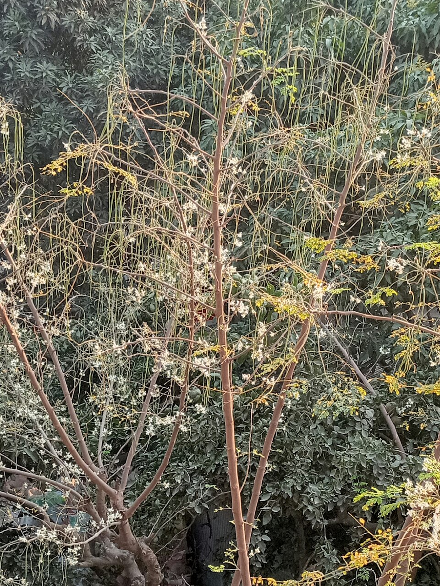

# Moringa

> **Node ID**: plants.edible-plants.moringa
> **Domain**: [Plants](./index.md)
> **Dependencies**: See prerequisites
> **Enables**: [`Edible Plants`](edible-plants.md)
> **Timeline**: Years 0-5
> **Outputs**: edible_plant_material
> **Critical**: Yes

## Overview

> *Moringa oleifera with pods and flowers in Bangladesh*

> *Image: Cottonseed, CC BY-SA 4.0*

Moringa

*Moringa oleifera* (Moringaceae) is a medicinal & spice plant species of major importance for civilization bootstrapping. Horseradish Tree, Moringa provides leaves, roots, seeds/nuts as its primary edible product.

Edible parts: Flowers Inner bark Leaves Oil Root Seed Seedpod Shoots Tea. Young leaves and shoots - raw or cooked. Added to salads, cooked as a potherb and added to soups and curries. They have a mustard-like flavour. The leaves contain 7 - 10% protein. (This almost certainly refers to the dried leaf.) The leaves are very nutritious, being rich in vitamins, minerals and the sulphur-containing amino acids methionine and cystine, which are often in short supply. The young, tender seedlings make an excellent cooked vegetable. Flowers - raw or cooked. Added to salads, cooked as a potherb and added to soups and curries. They can also be used to make a tea. Seedpods. The long, bean-like pods are used in soups and curries, or made into pickles. The young pods are said to have a taste reminiscent of asparagus and can be eaten raw. The pods can be 15 - 45cm long. Seeds. The immature seeds are eaten like peas. A sweet flavour. Mature seeds, when roasted or fried, are said to resemble peanuts in flavour. An oil obtained from the seeds is used in salads and cooking. Pleasantly flavoured, it resembles olive oil and is an excellent salad oil. The oil is clear and odourless and does not become rancid quickly. The seeds from mature pods (which can be 40-50 cm long) are browned in a skillet, mashed and placed in boiling water, which causes the oil to float to the surface. The pungent root is used like horseradish (Armoracea rusticana) as a hot flavouring in foods. Even when free of the bark, the condiment when used in excess may be harmful. A reddish gum obtained from the bark is used as a seasoning. Used in a similar manner to gum tragacanth.

For civilization bootstrapping, moringa is significant because of its role as a medicinal & spice plant. Reliable food production is the foundation upon which all other technological development rests. Understanding the cultivation, processing, and storage of *Moringa oleifera* enables communities to establish food security and allocate labor to non-subsistence activities.

*Moringa oleifera* is a member of the Moringaceae family. As a medicinal & spice plant, it provides essential calories, protein, or other nutrients needed to sustain human populations during the bootstrap process. The ability to produce food reliably from cultivated plants is what separates sedentary civilizations from hunter-gatherer societies, because food surplus allows specialization of labor into toolmaking, construction, and eventually metallurgy and beyond.

This species grows as a perennial or annual depending on climate and management. Propagation is primarily by Seed - can be sown either directly, in containers or in a nursery seedbed, preferably with around 50% shade. No seed pre-treatment is required and seeds sprout readily in 1 - 2 weeks. Plants can be ready for planting out within 3 months of germination. Plants raised from seed produce fruit of unpredictable quality. Germination rates for fresh seeds are around 80%, going down to about 50% after 12 months storage, but no seeds survive 2 years of storage. Cuttings of half-ripe wood. Easy. Stem cuttings are usually preferred because they root easily. Large limbs can be planted to make an instant living fence. Branches 100 - 150cm in length, with a diameter of up to 4cm will root readily in just a few months. Shield budding is successful, and budded trees begin to bear in 6 months and continue to give a good crop for 13 years.. Harvest timing depends on the plant part used: leaves, roots, seeds/nuts, flowers, shoots, bark/sap are typically ready at specific growth stages or seasons.

## Prerequisites

### Materials

- Propagation material: Seed - can be sown either directly, in containers or in a nursery seedbed, preferably with around 50% shade. No seed pre-treatment is required and seeds sprout readily in 1 - 2 weeks. Plants can be ready for planting out within 3 months of germination. Plants raised from seed produce fruit of unpredictable quality. Germination rates for fresh seeds are around 80%, going down to about 50% after 12 months storage, but no seeds survive 2 years of storage. Cuttings of half-ripe wood. Easy. Stem cuttings are usually preferred because they root easily. Large limbs can be planted to make an instant living fence. Branches 100 - 150cm in length, with a diameter of up to 4cm will root readily in just a few months. Shield budding is successful, and budded trees begin to bear in 6 months and continue to give a good crop for 13 years.
- Compost or organic matter for soil amendment
- Mulch material for moisture retention and weed suppression

### Equipment

- Hoe or digging stick for soil preparation and planting
- Sickle, machete, or harvesting knife for crop harvest
- Drying racks or flat drying surfaces for post-harvest processing
- Storage containers: woven baskets, ceramic jars, or sacks for dried product
- Winnowing baskets or screens if processing grains or seeds

### Knowledge

- Species identification: Moringa oleifera is a deciduous Tree growing to 8 m (26ft) by 8 m (26ft) at a fast rate. See above for USDA hardiness. It is hardy to UK zone 10 and is frost tender. The flowers are pollinated by Bees, Sunbirds. The plant is self-fertile. It is noted for attracting wildlife. Suitable for: light (san
- Understanding of planting timing relative to local frost dates and rainy seasons
- Knowledge of soil preparation, seed depth, and spacing requirements
- Recognition of common pests and diseases and their early indicators
- Safe preparation methods for any toxic or bitter compounds (see Safety)

### Infrastructure

- Field or garden site with suitable climate, soil type, and sun exposure
- Reliable water access for germination and establishment phase
- Fenced or protected area if animal browsing is a risk
- Storage structure protected from moisture, rodents, and insects

## Process Description

### Cultivation and Propagation

It grows best in areas where annual daytime temperatures are within the range 20 - 35°c, but can tolerate 7 - 48°c. The plant is quite cold hardy and is not harmed by light frosts, but it can be killed back to ground level by a freeze. It quickly sends out new growth from the trunk when cut, or from the ground when frozen. It prefers a mean annual rainfall in the range 700 - 2,200mm, but tolerates 400 - 2,600mm. Easily grown in a well-drained soil in a sunny position, tolerating a wide range of soil types. It grows best on fertile and well drained sandy soil, clay or clay loam but is in general suitable for light, medium and heavy soils thoigh it will not withstand salinity. It has a special tolerance to shallow soil and is tolerant of low fertility. Prefers a pH in the range 5.5 - 7, tolerating 5 - 8.5. Established plants are quite drought tolerant but yield much less foliage when continuously under water stress. Grows better if given shelter from strong winds. Moringa is an extremely fast-growing tree, and within 1- 3 months trees can reach 2.5 metres in height. Growth rates of 3 - 4 metres per year is not unusual for young plants Young trees raised from seed start flowering after 2 years. In trees grown from cuttings the first fruits may be expected 6 - 12 months after planting. Flowering often precedes or coincides with the formation of new leaves, and can occur throughout the year in non-seasonal climates. Constant pruning of up to 1.5 metres per year is suggested to obtain a thick-limbed and multibranched shrub. It coppices and pollards well. The sweet smelling flowers are produced throughout the year. In the warmer parts of its range the plant can produce a second crop of seeds each year. There is at least one named variety. Flowering Time: Late Spring/Early Summer. Bloom Color: White/Near White. Spacing: 8-10 ft. (2.4-3 m). Moringa oleifera is generally self-fertile. Leaves can be harvested throughout the year, while pods are typically harvested in late Summer to early Autumn. Moringa flowers in Spring to early Summer. Moringa is a fast-growing tree, often reaching maturity in about 6-8 months under optimal conditions. Propagation: Seed - can be sown either directly, in containers or in a nursery seedbed, preferably with around 50% shade. No seed pre-treatment is required and seeds sprout readily in 1 - 2 weeks. Plants can be ready for planting out within 3 months of germination. Plants raised from seed produce fruit of unpredictable quality. Germination rates for fresh seeds are around 80%, going down to about 50% after 12 months storage, but no seeds survive 2 years of storage. Cuttings of half-ripe wood. Easy. Stem cuttings are usually preferred because they root easily. Large limbs can be planted to make an instant living fence. Branches 100 - 150cm in length, with a diameter of up to 4cm will root readily in just a few months. Shield budding is successful, and budded trees begin to bear in 6 months and continue to give a good crop for 13 years.

### Distribution and Growing Conditions

E. Asia - Indian subcontinent. TROPICAL ASIA: India (north), Pakistan,

### Identification

Moringa oleifera is a deciduous Tree growing to 8 m (26ft) by 8 m (26ft) at a fast rate. See above for USDA hardiness. It is hardy to UK zone 10 and is frost tender. The flowers are pollinated by Bees, Sunbirds. The plant is self-fertile. It is noted for attracting wildlife. Suitable for: light (sandy), medium (loamy) and heavy (clay) soils and prefers well-drained soil. Suitable pH: mildly acid and neutral soils and can grow in saline soils. It cannot grow in the shade. It can tolerate drought. The plant can tolerates strong winds but not maritime exposure.

### Edible Parts and Preparation

## Quantitative Parameters

### Growing Parameters

| Parameter | Value | Notes |
|-----------|-------|-------|
| Edible parts | Leaves, Roots, Seeds/Nuts, Flowers, Shoots, Bark/Sap | Primary harvest |

## Processing and Storage

### Non-Food Uses

Cosmetic Dye Fencing Fertilizer Fibre Filter Fodder Fuel Gum Hedge Oil Pioneer Plant support Scourer Shelterbelt Soap making Soil conditioner String Tannin Weaving Wood Agroforestry uses: Moringa is often used as a multi-purpose tree in agroforestry systems. It is a fast-growing shade tree, provides green manure, and can improve soil fertility. Plants can be grown as an informal hedge, providing wind protection, shade and support for climbing garden plants. Widely used for live fences and hedges in many areas. Stakes root easily and are stable, and cuttings planted in lines are used particularly around houses and gardens. Because its shade can be controlled well Moringa oleifera is suitable for planting in alley cropping and in vegetable gardens. When trees reach 1.5 metres, farmers prune them (at 50cm from the ground or at ground level for older ones) once or twice a year. In alley cropping, an intra-row spacing of 2 metres is used. In the wet season cereals are grown between the lines, in the dry season vegetables. Because the tree is fast growing and readily colonizes areas such as stream banks and savannah, it makes a very good pioneer species for establishing a woodland garden. It is able to provide food after just a few months and also providing shelter to help other plants to establish. Other Uses The oil obtained from the mature seed and pods, known as 'oil of ben', has been used to lubricate watches and other fine machinery[63 , 238 , 287 , 303 ]. It is also used in perfumery, artist's paints, soaps and ointments. It is yellowish, non-drying, has good keeping qualities but eventually turns rancid. The powdered seeds are used to clarify sugar cane juice. A suspension of the ground seed is used as a primary coagulant. It can clarify water of any degree of visible turbidity. At high turbidity, its action is almost as fast as that of alum, but at medium and low turbidity, good clarification is obtained if a small cloth bag filled with the powdered seeds is swirled round in the turbid water. To prepare the seed for use as a coagulant, remove the seed coat and wings. The white kernel is then crushed to a powder, using a mortar or placing it in a cloth and crushing it with a stone. The powder should be mixed with a small amount of water, stirred, then poured through a tea strainer before being added to the turbid water. The seed cake residue from oil extraction can also be used for water purification. The seed contains a protein (cationic polyelectrolyte) that acts as a flocculant in water purification. It also contains a non-protein flocculant that is more effective in purifying low-turbidity water. The bark, when beaten, produces a fibre used to make small ropes and mats. A study on the production of rayon-grade pulp from M. Oleifera by a prehydrolyzed sulphate process in India shows that it is suitable as a raw material for the production of high alpha cellulose pulp for use in cellophane and textiles. When the tree is injured, the stem exudes a gum that is used in calico printing. The bark is used for tanning. The wood yields a blue dye. The crushed leaves are used to clean pots, pans and walls. The press cake left after oil extraction from the seeds can be used as a soil conditioner or as fertilizer. The wood is very soft, corky and light, and is useful only for light construction work. It is pulped as a source of rayon and cellophane. The soft and light wood burns smoke-free and is an acceptable firewood for cooking but makes poor charcoal. It has a density of 0.5-0.7 and yields approximately 4600 kcal/kg.

### Storage

Dry seeds thoroughly to below 14% moisture content before storage. Spread in thin layers on drying racks in full sun, stirring periodically. Test dryness by biting: properly dried seeds crack rather than dent. Store in airtight containers (ceramic jars with tight lids, sealed woven bags) in a cool, dry, dark location. Protect from rodents and insects with tight lids or by mixing with inert ash. Under good conditions, dried grains and legumes store for 1-5 years with minimal loss.

### Material Handling

Handle moringa produce with clean hands and tools to prevent contamination. Remove field heat promptly after harvest by moving product to shade. Process within the recommended timeframe to prevent quality loss. Compost crop residues and processing waste to return organic matter to the soil. Label stored products with harvest date, variety, and any treatments applied.

## Scaling Notes

- **Bench scale**: Individual plants or small garden plot (10-50 plants). Output for direct household consumption. Useful for seed saving, variety selection, and learning the crop's behavior under local conditions.
- **Pilot scale**: Field planting of 0.1 to 1 hectare (500-5,000 plants). Staggered planting or sequential harvests to extend availability. Requires basic hand tools and family-level labor. Surplus can be traded or stored.
- **Production scale**: Multi-hectare cultivation with mechanized planting, harvesting, and processing. Requires plow animals or tractors, grain mills or processing equipment, and bulk storage facilities. Enables community-level food security and trade.

Key scaling challenges include maintaining genetic diversity at plantation scale, managing pest and disease pressure in monoculture, and matching post-harvest processing capacity to harvest volume. Seed saving and variety selection at bench scale directly informs decisions about which cultivars to scale up.

## Troubleshooting

| Problem | Probable Cause | Solution |
|---------|---------------|----------|
| Poor germination | Old seed, wrong soil temperature, planted too deep, or insufficient moisture | Use fresh seed; verify germination temperature range; plant at recommended depth; maintain soil moisture during germination |
| Pest damage | Insect infestation or browsing animals | Hand-pick pests; use companion planting with repellent species; install fencing for larger pests |
| Disease (fungal/bacterial) | Poor air circulation, excessive moisture, infected seed | Space plants adequately; avoid overhead watering; use clean seed from disease-free plants; practice crop rotation |
| Low yield | Nutrient deficiency, water stress, overcrowding, or shade | Amend soil with compost or manure; ensure adequate water at critical growth stages; thin to recommended spacing; plant in full sun |
| Storage losses | Insufficient drying, rodent/insect damage, high humidity | Dry product thoroughly before storage; use sealed containers; inspect stored product regularly; keep storage area clean and dry |

## Safety Considerations

Working with *Moringa oleifera* involves the following hazards:

- **Toxicity**: Parts of this plant may contain compounds that are toxic when raw or improperly prepared. Always follow proper preparation procedures before consumption. Verify with multiple authoritative sources.
- Tool injuries during harvest and processing — use sharp tools in good condition and cut away from the body
- Allergic reactions to plant compounds — sensitive individuals should test small quantities first
- Sun exposure and heat stress during field work — schedule heavy work for early morning or late afternoon
- Musculoskeletal strain from repetitive harvesting motions — vary tasks and take regular breaks

### Personal Protective Equipment

- Sturdy gloves when handling plants with irritant sap, spines, or rough surfaces
- Long sleeves and trousers for field work to reduce skin exposure to irritants and insects
- Eye protection when using cutting tools overhead or near face level
- Sun hat and sunscreen for extended field work

### Emergency Procedures

- For suspected plant poisoning: stop eating immediately, save a sample of the plant material, and seek medical attention. Do not induce vomiting unless directed by a medical professional.
- For tool lacerations: apply direct pressure with a clean cloth, elevate the wound, and seek medical attention for cuts deeper than skin level.
- For allergic reaction (swelling, difficulty breathing): discontinue exposure immediately and seek emergency medical help.

## Quality Control

### Acceptance Criteria

- Harvest product shows expected color, texture, size, and flavor for the variety grown
- No visible mold, rot, pest damage, or foreign material in stored product
- Dried products are brittle throughout with no flexible or moist spots
- Seeds intended for storage test at below 14% moisture content

### Testing Methods

- **Visual inspection**: check for discoloration, mold, insect damage, or foreign material
- **Bite test (seeds/grains)**: properly dried seeds crack cleanly; under-dried seeds dent or feel leathery
- **Smell test**: fresh product has characteristic aroma; off-odors indicate spoilage or contamination
- **Snap test (dried products)**: properly dried material snaps rather than bends

### Sampling Protocol

For field-scale production, inspect every 10th plant during harvest for disease and pest damage. Grade each batch by size and quality before storage. Record yield per unit area to track productivity trends across seasons and identify declining performance early.

## Variations and Alternatives

### Medicinal Uses

Abortifacient Antiasthmatic Antibiotic Antifungal Antiinflammatory Antirheumatic Appetizer Astringent Cardiac Demulcent Digestive Diuretic Expectorant Kidney Laxative Odontalgic Rubefacient Skin Tonic Vesicant. The horseradish tree is a nutritious, diuretic, laxative herb that is expectorant, increases milk flow, controls bacterial infections and is rubefacient when applied topically. It contains a potent antibiotic. Ben oil, obtained from the seeds, has no taste, smell or colour and is exceptionally resistant to oxidation. The young leaves are taken internally to increase the milk flow in nursing mothers. The root is used as a vesicant. The alkaloid spirachin (a nerve paralyzer) has been found in the roots. The root juice is used internally in the treatment of asthma, gout, rheumatism, enlarged spleen and liver, bladder and kidney stones, inflammatory conditions. Externally, the root is used to treat boils, ulcers, glandular swellings, infected wounds, skin diseases, dental infections, snake bites and gout. The roots and bark are used for cardiac and circulatory problems, as a tonic and for inflammation. The bark is an appetizer and digestive. The gum is demulcent, diuretic, astringent and abortifacient. It is used in cough syrups and in the treatment of asthma. The bark and gum are used in the treatment of tuberculosis and septicaemia. Flowers and immature fruits are said to be a good rubefacient. A decoction of the flowers is used as a cold remedy. The seeds are effective against skin-infecting bacteria Staphylococcus aureus and Pseudomonas aeruginosa. They contain the potent antibiotic and fungicide terygospermin. Oil of Ben is used for hysteria, scurvy, prostate problems and bladder troubles. A number of compounds with medicinal properties have been isolated. The fruit and leaf contain oxalic acid, the bark moringinine, the stem vanillin, the flower kaempferol and quercetin and the root spirochin and pterygospermin. The seeds contain a glucosinolate that on hydrolysis yields 4-(alpha-L-rhamnosyloxy)-benzylisothiocyanate, an active bactericide and fungicide.

### Other Uses

### Related Species

- [Ginger](ginger.md)
- [Turmeric](turmeric.md)
- [Black Pepper](black-pepper.md)

### Cultivar Selection

Within *Moringa oleifera*, considerable variation exists in yield, disease resistance, climate adaptation, and quality characteristics. When establishing a moringa crop, select varieties adapted to local conditions: day length, temperature range, rainfall pattern, and soil type. Landrace varieties — locally adapted populations maintained by traditional farmers — often outperform modern cultivars under low-input conditions because they have been selected for resilience rather than maximum yield under optimal conditions.

Seed saving from the best-performing plants each generation gradually adapts the variety to local conditions. Select for vigor, disease resistance, appropriate maturity timing, and product quality. Maintain genetic diversity by saving seed from multiple plants rather than a single individual, which preserves the population's ability to adapt to changing conditions and disease pressures.

### Crop Rotation and Companion Planting

*Moringa oleifera* benefits from crop rotation to prevent buildup of species-specific pests and diseases. Avoid planting in the same field in consecutive seasons where possible. Follow with a different crop family to break pest cycles and maintain soil health.

Companion planting with aromatic herbs or flowering plants can deter pests and attract beneficial insects. Avoid planting near species that compete for the same nutrients or harbor shared pathogens.

*Moringa oleifera* is a fast-growing tropical tree that can be managed as an annual (cut at 1-2m height for leaf production) or as a perennial tree. The seeds contain a cationic protein that acts as a natural coagulant, capable of clarifying turbid water. This water purification property makes moringa exceptionally valuable in a bootstrap context where water treatment infrastructure is limited. Intercrop with vegetables and legumes in alley cropping systems.

## References

- [Edible Plants](edible-plants.md) — parent capability
- [Plants Domain](./index.md) — domain overview and related capabilities
- [Agave](agave.md) — example plant article format
- [Food Processing](../food-processing/index.md) — downstream processing of harvested crops
- [Agriculture](../agriculture/index.md) — cultivation systems and crop rotation
- Family: Moringaceae
- Data sourced from Food Plants International, Wikipedia, and iNaturalist via the Edible Plant Database (ZIM)
- Plants for a Future (pfaf.org) — supplementary cultivation and use data

Moringa is often called the "miracle tree" because every part is useful: leaves (high in protein, vitamins A and C, calcium, and iron), seed pods (eaten as a vegetable when young), seeds (yield 30-40% edible oil that does not become rancid), seed cake (water purifier that clarifies turbid water), bark (fiber), and roots (horseradish-flavored condiment). The tree grows 3-5 meters in its first year and can be harvested for leaves within 3-4 months of planting.
Moringa seed powder clarifies turbid water by binding to suspended particles and bacteria,
causing them to settle. One seed treats 1-2 liters of water. This water purification use is
particularly valuable in regions where fuel for boiling water is scarce. The tree's rapid
growth and multiple harvests per year make it one of the most productive leaf vegetable crops.

---
*Part of the [Bootciv Tech Tree](../index.md) · [Plants](./index.md) · [All Domains](../index.md)*
