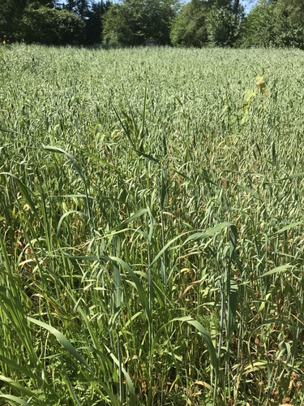

# Oat

> **Node ID**: plants.edible-plants.oat
> **Domain**: [Plants](./index.md)
> **Dependencies**: See prerequisites
> **Enables**: [`Edible Plants`](edible-plants.md)
> **Timeline**: Years 0-5
> **Outputs**: edible_plant_material
> **Critical**: No

## Overview

> *Avena sativa Aaltertroshaver (middle), Triticum dicoccum (left), Avena sativa black oat (right)*

> *Image: Rasbak, CC BY-SA 3.0*

Oat

*Avena sativa* (Poaceae) is a staple food crop species of major importance for civilization bootstrapping. Oats provides seeds/nuts as its primary edible product and ranks 61/100 on the nutrition score.

A hardy annual oat growing 0.9 m tall, hardy to UK zone 3. Flowers June to July with seed maturation August to October. Wind-pollinated, hermaphroditic, and self-fertile. Accommodates light sandy, medium loamy, and heavy clay soils including nutritionally poor soils, preferring well-drained conditions. Tolerates mildly acid through very acid soils and neutral to mildly alkaline soils. Requires full sun and adapts to dry or moist conditions with drought tolerance.

Edible parts: Seeds, Cereal, Sprouted Seeds, Seedlings Edible Parts: Oil Seed Edible Uses: Coffee Oil Seed - cooked. The seed ripens in the latter half of summer and, when harvested and dried, can store for several years. It has a floury texture and a mild, somewhat creamy flavour. It can be used as a staple food crop in either savoury or sweet dishes. Used as a cereal, it is probably best known as the breakfast cereal porridge but it can also be used in many other ways. The seed can be sprouted and used in salads, the grain can also be ground into a flour and used in making biscuits, sourdough etc. It is fairly low in gluten, and so is not really suitable for making bread. The seed is an especially good food for convalescents and people with stomach problems. Oat flour produced in the dry-milling operation currently is used as an antioxidant in food products. Oat flour inhibits rancidity and increases the length of shelf-stability of fatty foods such as vegetable oils. Whilst cultivated oats average about 17% protein, scientists screening thousands of samples of cultivated and wild species found that the wild species averaged 27% with some forms ranging up to 37%. Oats are also one of the cereals used as a basic ingredient for making whisky. Oats are harvested when grain is in the hard dough stage and straw is slightly green (when the moisture content of the grain is 14% or less). If too ripe, shattering causes seed loss. Crop is usually cut with binder and left in the field until dry and then threshed. In mechanized societies, oats are combined directly from standing grain. For this type of harvesting, crop must be fully ripe, usually when the straw has lost greenness and glumes have become white. Crop may be combined from windrow, or cut with a header harvester when the crop is dead ripe. Seeds are threshed and cleaned by winnowing, and artificially dried to below 14% moisture for storage. The roasted seed is a coffee substitute. An edible oil is obtained from the seed, it is used in the manufacture of breakfast cereals.

For civilization bootstrapping, oat is significant because of its role as a staple crop. Reliable food production is the foundation upon which all other technological development rests. Understanding the cultivation, processing, and storage of *Avena sativa* enables communities to establish food security and allocate labor to non-subsistence activities.

*Avena sativa* is a member of the Poaceae family. As a staple food crop, it provides essential calories, protein, or other nutrients needed to sustain human populations during the bootstrap process. The ability to produce food reliably from cultivated plants is what separates sedentary civilizations from hunter-gatherer societies, because food surplus allows specialization of labor into toolmaking, construction, and eventually metallurgy and beyond.

This species grows as a perennial or annual depending on climate and management. Propagation is primarily by Seed - sow in situ in early spring or in the autumn. Only just cover the seed. Germination should take place within 2 weeks.. Harvest timing depends on the plant part used: seeds/nuts are typically ready at specific growth stages or seasons.

## Prerequisites

### Materials

- Propagation material: Seed - sow in situ in early spring or in the autumn. Only just cover the seed. Germination should take place within 2 weeks.
- Compost or organic matter for soil amendment
- Mulch material for moisture retention and weed suppression

### Equipment

- Hoe or digging stick for soil preparation and planting
- Sickle, machete, or harvesting knife for crop harvest
- Drying racks or flat drying surfaces for post-harvest processing
- Storage containers: woven baskets, ceramic jars, or sacks for dried product
- Winnowing baskets or screens if processing grains or seeds

### Knowledge

- Species identification: An annual grass plant and cereal with an open spreading flower head. It can grow up to 1 or 1.5 m tall. The stalks are moderately stout. The leaves are narrow and sword shaped. They are flat and 45 cm long by 25 cm wide. The flower arrangement is an open panicle. This is in a head 50 cm long. The fl
- Understanding of planting timing relative to local frost dates and rainy seasons
- Knowledge of soil preparation, seed depth, and spacing requirements
- Recognition of common pests and diseases and their early indicators
- Safe preparation methods for any toxic or bitter compounds (see Safety)

### Infrastructure

- Field or garden site with suitable climate, soil type, and sun exposure
- Reliable water access for germination and establishment phase
- Fenced or protected area if animal browsing is a risk
- Storage structure protected from moisture, rodents, and insects

## Process Description

### Cultivation and Propagation

Oats are an easily grown crop that succeeds in any moderately fertile soil in full sun. They prefer a poor dry soil and tolerate cool moist conditions. Plants are reported to tolerate an annual precipitation of 20 to 180cm, an average annual temperature range of 5 to 26°C, and a pH of 4.5 to 8.6. They thrive on a wide range of soils of ample, but not excessive, fertility. Well-drained neutral soils in regions where annual rainfall is 77cm or more are best. Loam soils are best, especially silt and clay loams. The plants are also reported to tolerate aluminium, disease, frost, fungus, herbicides, hydrogen fluoride, mycobacterium, nematode, rust, SO2, smut, and virus. Oats have a long history of cultivation as a food crop and are believed to be derived chiefly from two species, wild oat (A. fatua L.) and wild red oat (A. sterilis L.). They are widely cultivated for their seed, used as a source of protein, as well as for hay, as winter cover, and are used as a pasture crop in the growing or 'milk' stage. Oats are long-day plants, grown in cool climates in the Old and New World temperate zones, succeeding under variable conditions. Oats usually are not very winter hardy, although winter hardy cvs have been developed. A very hardy plant according to another report, the cultivated oat succeeds as far north as latitude 70°n and is widely cultivated in temperate zones for its edible seed, there are many named varieties. Although lower yielding than wheat (Triticum spp.), it is able to withstand a wider range of climatic conditions and is therefore more cultivated in cooler and wetter areas. Hot dry weather just before heading causes heads to blast and yields of seed to decrease. Self-pollination is normal, but cross-pollination by wind also occurs. If you wish to save the seed for sowing, each variety should be isolated about 180 metres away from other varieties. Oats grow well with vetch but they inhibit the growth of apricot trees. Oats are in general easily grown plants but, especially when grown on a small scale, the seed is often completely eaten out by birds. Some sort of netting seems to be the best answer on a garden scale. Avena sativa, commonly known as common oat, is a cool-season annual typically suited to USDA Hardiness Zones 3 through 10. While not a perennial, it is relatively cold-tolerant during its early growth stages and can withstand light frosts, making it ideal for early spring or fall planting depending on the region. Oats grow best in temperatures between 55 and 75°F (13 to 24°C) and are generally sown in the spring in colder zones or in the fall in warmer zones for use as a winter cover crop. Though it won’t survive hard frosts like some perennial grasses, its fast growth and tolerance of cooler conditions make it a popular choice for short-season grain production, as well as for use as green manure, forage, or mulch in regenerative and organic farming systems. Propagation: Seed - sow in situ in early spring or in the autumn. Only just cover the seed. Germination should take place within 2 weeks.

### Distribution and Growing Conditions

### Identification

An annual grass plant and cereal with an open spreading flower head. It can grow up to 1 or 1.5 m tall. The stalks are moderately stout. The leaves are narrow and sword shaped. They are flat and 45 cm long by 25 cm wide. The flower arrangement is an open panicle. This is in a head 50 cm long. The flowers are held to one side of the stem. The fruit is a grain tightly enclosed by the glume.

### Edible Parts and Preparation

#### Harvesting

Oats are unique among cereals in that the grain is typically cut while still slightly immature and then allowed to ripen in the windrow (swath). This prevents shattering losses and produces higher-quality grain:

1. **Swathing (cutting)**: Cut the oat crop with a sickle, scythe, or swather when kernel moisture reaches approximately 35% (late milk to early dough stage). The panicles should still have a greenish tint and the straw is slightly green, not fully yellow. At this stage, the kernels are plump but not yet brittle.
2. Lay cut stalks in rows (windrows) on the stubble to dry. The stubble elevates the windrow off the ground, allowing air circulation underneath.
3. Allow the windrows to dry for 3-7 days in dry weather. The grain continues to mature (after-ripening) while drying. Target kernel moisture: below 14% for safe storage.
4. If direct-heading (cutting and threshing in one pass, as with a combine), wait until the straw has lost all greenness and the glumes have turned white. This is riskier — late-harvested oats shatter easily.

#### Threshing and Cleaning

1. **Hand threshing**: Beat the dried oat panicles against a hard surface or flail with a wooden stick. The loose hulls (chaff) and grain separate from the straw.
2. **Treading**: Spread the windrowed oat sheaves on a hard floor and drive livestock (oxen, horses) in circles over them. Throughput: 100-200 kg/hour.
3. **Winnowing**: Toss the threshed mixture into a light breeze from a wide, shallow basket. The light chaff blows away while the heavier oat groats (hulled kernels) fall straight down. Repeat 3-5 times until clean.
4. The resulting product is **whole oat grain with hulls attached**. Covered oat varieties (the majority) retain a tough, fibrous hull tightly encasing the groat. This hull is inedible and must be removed.

#### Dehulling

Removing the oat hull is more difficult than for wheat or rice because the hull is tightly fused to the groat. Several methods work:

1. **Steam-and-roll method** (most practical at basic technology levels):
   - Steam whole oat grains for 10-20 minutes to soften the hull and partially gelatinize the groat surface.
   - Pass the steamed grain through a roller (two smooth stone or iron cylinders rotating toward each other). The roller cracks the hull and flattens the groat slightly.
   - Winnow or sift to separate the lighter hull fragments from the heavier groats. A sieve with 2-3 mm openings retains groats while hull fragments pass through.
   - Dehulling efficiency: 80-90% in a single pass. Re-steam and re-roll the fraction that still has hulls attached.

2. **Abrasive dehulling** (traditional stone mill method):
   - Pass grain through a stone mill set with a wide gap (wider than for flour milling). The abrasive action of the stones scrapes off the hulls without crushing the groat.
   - Sieve and winnow to separate. Losses are higher (10-15% of groats broken), but the method requires only a standard stone mill.

3. **Impact dehulling**: Hit the grains against a hard surface at high speed. Used in mechanized operations but not practical at basic technology levels.

Yield: 60-70% of the whole oat grain weight is groat (edible kernel). The remaining 30-40% is hull, which is useful as fuel (heating value ~16 MJ/kg dry), animal feed roughage, or mulch.

#### Rolling and Flour Production

1. **Rolled oats**: Steam cleaned groats for 15-30 minutes to soften them. Pass through a roller to flatten into flakes 0.5-1 mm thick. The steaming partially cooks the groat (gelatinizes starch), making rolled oats quicker-cooking than raw groats. Rolled oats store well for 6-12 months in dry, sealed containers.
2. **Steel-cut (Irish) oats**: Chop groats into 2-4 pieces with a heavy blade or stone mill set to a coarse crush. Takes longer to cook than rolled oats but produces a chewier, more flavorful porridge.
3. **Oat flour**: Grind groats on a stone mill to a fine powder (particle size below 0.2 mm). Oat flour is naturally gluten-free (or very low gluten) and produces dense, moist baked goods. It does not rise well in yeast breads but makes excellent flatbreads, biscuits, and porridge.
4. **Oat bran**: The outer layer of the groat, separated by sieving after coarse grinding. Rich in soluble fiber (β-glucan), which has demonstrated cholesterol-lowering effects. A health-promoting food additive.

#### Storage

Oats have a higher fat content than wheat or rice (5-9% vs. 1.5-2%), which makes them more prone to rancidity in storage. The intact hull protects the groat during storage, so store as whole grain (with hulls) and dehull only as needed:

- **Whole grain (hulled)**: Below 14% moisture, cool and dry. 1-2 years in sealed containers. The hull provides physical protection and slows oxidation.
- **Rolled oats**: 6-12 months. The increased surface area from rolling accelerates rancidity.
- **Oat flour**: 3-6 months. Grind small batches as needed rather than storing large quantities.
- **Seed oats**: Same conditions as food oats, but select from the best-yielding plants. Test germination before planting — below 85% germination rate indicates seed should be used for food and fresh seed obtained.

#### Oat Straw

After threshing, the oat straw has significant value beyond the grain:

- **Animal feed**: Oat straw is more palatable and nutritious than wheat straw (higher protein, softer stems). Use as winter fodder for cattle, sheep, and goats.
- **Mulch**: Spread 5-10 cm thick around plants to suppress weeds and retain soil moisture. Avoid using oat straw as mulch near strawberries (transmits stem and bulb eelworm).
- **Thatching**: Oat straw is a traditional thatching material for roofs. Bundle straw into tight bundles (yealms) and layer from eaves to ridge, securing with wooden pegs.
- **Biomass fuel**: Burn directly in cooking fires. Heating value ~15 MJ/kg dry.
- **Bedding**: Absorbent and comfortable bedding for livestock.

#### Process Parameters

| Parameter | Range | Notes |
|-----------|-------|-------|
| Swathing moisture | ~35% kernel moisture | Greenish panicles |
| Windrow drying time | 3-7 days | To below 14% moisture |
| Groat yield (by weight) | 60-70% | Of whole oat grain |
| Hull fraction | 30-40% | Fibrous, inedible but useful |
| Steaming time (dehulling) | 10-20 minutes | Before rolling |
| Oat fat content | 5-9% | Higher than wheat, prone to rancidity |
| Whole oat storage | 1-2 years | In hull, below 14% moisture, cool/dry |
| Rolled oat storage | 6-12 months | Higher surface area, faster rancidity |
| Oat flour storage | 3-6 months | Grind as needed |
| Straw heating value | ~15 MJ/kg (dry) | Comparable to other cereal straws |

## Quantitative Parameters

### Nutritional Composition (per 100g)

| Part | Moisture | kJ | kcal | Protein | Vit A | Vit C | Iron | Zinc |
| --- | --- | --- | --- | --- | --- | --- | --- | --- |
| Seeds | 11 | 1563 | 374 | 13.1 | — | — | 4.6 | — |
| Sprouts | — | — | — | — | — | — | — | — |

### Growing Parameters

| Parameter | Value | Notes |
|-----------|-------|-------|
| Edible parts | Seeds/Nuts | Primary harvest |

## Processing and Storage

### Non-Food Uses

Biomass Cosmetic Fibre Mulch Oil Paper Repellent Thatching The straw has a wide range of uses such as for bio-mass, fibre, mulch, paper-making, building board and thatching. It has also been used as a stuffing material for mattresses and these are said to be of great benefit for sufferers from rheumatism. Some caution is advised in its use as a mulch since oat straw can infest strawberries with stem and bulb eelworm. Oat hulls are basic in production of furfural, a chemical intermediate in the production of many industrial products such as nylon, lubricating oils, butadiene, phenolic resin glues, and rubber tread compositions. Oats hulls supply about 22% of the required furfural raw materials. Rice hulls, corn cobs, bagasse, and beech woods make up much of the remainder. Oats hulls are also used in the manufacture of construction boards, cellulose pulp and as a filter in breweries. A handful of the grains, thrown into the bath water, will help to keep the skin soft because of their emollient action. An extract of oat straw prevents feeding by the striped cucumber beetle. Special Uses

### Storage

Dry seeds thoroughly to below 14% moisture content before storage. Spread in thin layers on drying racks in full sun, stirring periodically. Test dryness by biting: properly dried seeds crack rather than dent. Store in airtight containers (ceramic jars with tight lids, sealed woven bags) in a cool, dry, dark location. Protect from rodents and insects with tight lids or by mixing with inert ash. Under good conditions, dried grains and legumes store for 1-5 years with minimal loss.

### Material Handling

Handle oat produce with clean hands and tools to prevent contamination. Remove field heat promptly after harvest by moving product to shade. Process within the recommended timeframe to prevent quality loss. Compost crop residues and processing waste to return organic matter to the soil. Label stored products with harvest date, variety, and any treatments applied.

## Scaling Notes

- **Bench scale**: Individual plants or small garden plot (10-50 plants). Output for direct household consumption. Useful for seed saving, variety selection, and learning the crop's behavior under local conditions.
- **Pilot scale**: Field planting of 0.1 to 1 hectare (500-5,000 plants). Staggered planting or sequential harvests to extend availability. Requires basic hand tools and family-level labor. Surplus can be traded or stored.
- **Production scale**: Multi-hectare cultivation with mechanized planting, harvesting, and processing. Requires plow animals or tractors, grain mills or processing equipment, and bulk storage facilities. Enables community-level food security and trade.

Key scaling challenges include maintaining genetic diversity at plantation scale, managing pest and disease pressure in monoculture, and matching post-harvest processing capacity to harvest volume. Seed saving and variety selection at bench scale directly informs decisions about which cultivars to scale up.

## Troubleshooting

| Problem | Probable Cause | Solution |
|---------|---------------|----------|
| Poor germination | Old seed, wrong soil temperature, planted too deep, or insufficient moisture | Use fresh seed; verify germination temperature range; plant at recommended depth; maintain soil moisture during germination |
| Pest damage | Insect infestation or browsing animals | Hand-pick pests; use companion planting with repellent species; install fencing for larger pests |
| Disease (fungal/bacterial) | Poor air circulation, excessive moisture, infected seed | Space plants adequately; avoid overhead watering; use clean seed from disease-free plants; practice crop rotation |
| Low yield | Nutrient deficiency, water stress, overcrowding, or shade | Amend soil with compost or manure; ensure adequate water at critical growth stages; thin to recommended spacing; plant in full sun |
| Storage losses | Insufficient drying, rodent/insect damage, high humidity | Dry product thoroughly before storage; use sealed containers; inspect stored product regularly; keep storage area clean and dry |
| Quality or safety note | See species-specific notes | There are about 25 Avena species. |

## Safety Considerations

Working with *Avena sativa* involves the following hazards:

- **Toxicity**: Parts of this plant may contain compounds that are toxic when raw or improperly prepared. Always follow proper preparation procedures before consumption. Verify with multiple authoritative sources.
- Tool injuries during harvest and processing — use sharp tools in good condition and cut away from the body
- Allergic reactions to plant compounds — sensitive individuals should test small quantities first
- Sun exposure and heat stress during field work — schedule heavy work for early morning or late afternoon
- Musculoskeletal strain from repetitive harvesting motions — vary tasks and take regular breaks

### Personal Protective Equipment

- Sturdy gloves when handling plants with irritant sap, spines, or rough surfaces
- Long sleeves and trousers for field work to reduce skin exposure to irritants and insects
- Eye protection when using cutting tools overhead or near face level
- Sun hat and sunscreen for extended field work

### Emergency Procedures

- For suspected plant poisoning: stop eating immediately, save a sample of the plant material, and seek medical attention. Do not induce vomiting unless directed by a medical professional.
- For tool lacerations: apply direct pressure with a clean cloth, elevate the wound, and seek medical attention for cuts deeper than skin level.
- For allergic reaction (swelling, difficulty breathing): discontinue exposure immediately and seek emergency medical help.

## Quality Control

### Acceptance Criteria

- Harvest product shows expected color, texture, size, and flavor for the variety grown
- No visible mold, rot, pest damage, or foreign material in stored product
- Dried products are brittle throughout with no flexible or moist spots
- Seeds intended for storage test at below 14% moisture content

### Testing Methods

- **Visual inspection**: check for discoloration, mold, insect damage, or foreign material
- **Bite test (seeds/grains)**: properly dried seeds crack cleanly; under-dried seeds dent or feel leathery
- **Smell test**: fresh product has characteristic aroma; off-odors indicate spoilage or contamination
- **Snap test (dried products)**: properly dried material snaps rather than bends

### Sampling Protocol

For field-scale production, inspect every 10th plant during harvest for disease and pest damage. Grade each batch by size and quality before storage. Record yield per unit area to track productivity trends across seasons and identify declining performance early.

## Variations and Alternatives

### Medicinal Uses

Anticholesterolemic Antidiarrhoeal Antirheumatic Antiseborrheic Antispasmodic Cancer Cardiac Diuretic Eczema Emollient Hypoglycaemic Nervine Nutritive Poultice Stimulant Whilst used mainly as a food, oat grain does also have medicinal properties. In particular oats are a nutritious food that gently restores vigour after debilitating illnesses, helps lower cholesterol levels in the blood and also increases stamina. The seed is a mealy nutritive herb that is antispasmodic, cardiac, diuretic, emollient, nervine and stimulant. The seed contains the antitumor compound b-sitosterol and has been used as a folk remedy for tumours. A gruel made from the ground seed is used as a mild nutritious aliment in inflammatory cases, fevers and after parturition. It should be avoided in cases of dyspepsia accompanied with acidity of the stomach. A tincture of the ground seed in alcohol is useful as a nervine and uterine tonic. A decoction strained into a bath will help to soothe itchiness and eczema. A poultice made from the ground seeds is used in the treatment of eczema and dry skin. When consumed regularly, oat germ reduces blood cholesterol levels. Oat straw and the grain are prescribed to treat general debility and a wide range of nervous conditions[254. They are mildly antidepressant, gently raising energy levels and supporting an over-stressed nervous system. They are of particular value in helping a person to cope with the exhaustion that results from multiple sclerosis, chronic neurological pain and insomnia. Oats are thought to stimulate sufficient nervous energy to help relieve insomnia. An alcoholic extraction of oats has been reported to be a deterrent for smoking, though reports that oat extract helped correct the tobacco habit have been disproven. A tincture of the plant has been used as a nerve stimulant and to treat opium addiction. In an article riddled with errors, the Globe (February 28, 1984) reports that oat straw, usually taken as a tea, is a sexual nerve tonic. The German Commission E Monographs, a therapeutic guide to herbal medicine, approve Avena sativa for inflammation of the skin, warts (see for critics of commission E).

### Other Uses

### Additional Information

It is a cultivated food plant.

### Notes

There are about 25 Avena species.

### Related Species

- [Wheat](wheat.md)
- [Rice](rice.md)
- [Maize](maize.md)
- [Potato](potato.md)
- [Cassava](cassava.md)

### Cultivar Selection

Within *Avena sativa*, considerable variation exists in yield, disease resistance, climate adaptation, and quality characteristics. When establishing a oat crop, select varieties adapted to local conditions: day length, temperature range, rainfall pattern, and soil type. Landrace varieties — locally adapted populations maintained by traditional farmers — often outperform modern cultivars under low-input conditions because they have been selected for resilience rather than maximum yield under optimal conditions.

Seed saving from the best-performing plants each generation gradually adapts the variety to local conditions. Select for vigor, disease resistance, appropriate maturity timing, and product quality. Maintain genetic diversity by saving seed from multiple plants rather than a single individual, which preserves the population's ability to adapt to changing conditions and disease pressures.

### Crop Rotation and Companion Planting

*Avena sativa* benefits from crop rotation to prevent buildup of species-specific pests and diseases. Avoid planting in the same field in consecutive seasons where possible. Follow with a different crop family to break pest cycles and maintain soil health.

Companion planting with aromatic herbs or flowering plants can deter pests and attract beneficial insects. Avoid planting near species that compete for the same nutrients or harbor shared pathogens.

## References

- [Edible Plants](edible-plants.md) — parent capability
- [Plants Domain](./index.md) — domain overview and related capabilities
- [Agave](agave.md) — example plant article format
- [Food Processing](../food-processing/index.md) — downstream processing of harvested crops
- [Agriculture](../agriculture/index.md) — cultivation systems and crop rotation
- Family: Poaceae
- Distribution: Andorra, United Arab Emirates, Afghanistan, Antigua &amp; Barbuda, Albania, Armenia, Angola, Argentina, Austria, Australia, Azerbaijan, Bosnia &amp; Herzegovina, Barbados, Bangladesh, Belgium, Burkina Faso, Bulgaria, Bahrain, Burundi, Benin and 176 more
- Data sourced from Food Plants International, Wikipedia, and iNaturalist via the Edible Plant Database (ZIM)
- Plants for a Future (pfaf.org) — supplementary cultivation and use data

---
*Part of the [Bootciv Tech Tree](../../index.md) · [Plants](./index.md) · [All Domains](../../index.md)*
