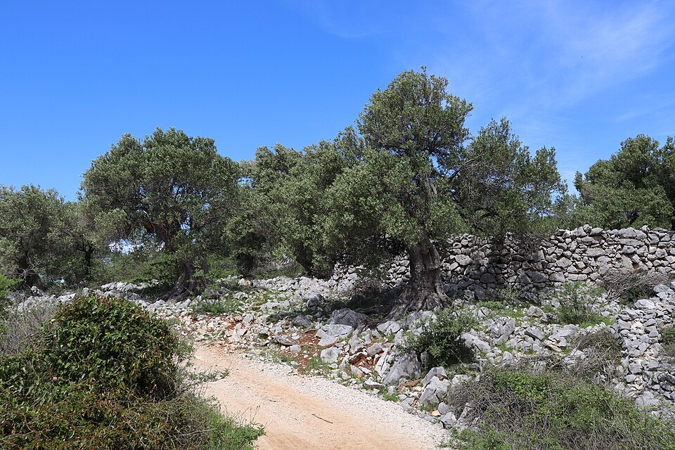

# Olive

> **Node ID**: plants.edible-plants.olive
> **Domain**: [Plants](./index.md)
> **Dependencies**: See prerequisites
> **Enables**: [`Edible Plants`](edible-plants.md)
> **Timeline**: Years 0-5
> **Outputs**: edible_plant_material
> **Critical**: Yes

## Overview

> *Nature reserve Olive-Gardens, Lun, Croatia.*

> *Image: Palauenc05, CC BY-SA 4.0*

Olive

*Olea europaea* (Oleaceae) is a fruit & nut tree species of major importance for civilization bootstrapping. Olive, African olive, European olive provides fruit, leaves as its primary edible product.

Edible parts: Fruit, Leaves, Manna, Oil, Oil Oil. Olive fruits are widely used, especially in the Mediterranean, as a relish and flavouring for foods. The fruit is usually pickled or cured with water, brine, oil, salt or lye. They can also be dried in the sun and eaten without curing when they are called 'fachouilles'. The cured fruits are eaten as a relish, stuffed with pimentos or almonds, or used in breads, soups, salads etc. 'Olives schiacciate' are olives picked green, crushed, cured in oil and used as a salad. The fruit contains 20 - 50µ vitamin D per 100g. The fruit is up to 4cm long. The seed is rich in an edible non-drying oil, this is used in salads and cooking and, because of its distinct flavour, is considered a condiment[4, 46, 57, 89, 171, 183]. There are various grades of the oil, the finest (known as 'Extra Virgin') is produced by cold pressing the seeds without using heat or chemical solvents. The seed of unpalatable varieties is normally used and this oil has the lowest percentage of acidity and therefore the best flavour. Other grades of the oil come from seeds that are heated (which enables more oil to be expressed but has a deleterious effect on the quality) or from using chemical solvents on seed that has already been pressed for higher grades of oil. Olive oil is mono-unsaturated and regular consumption is thought to reduce the risk of circulatory diseases. The seed contains albumen, it is the only seed known to do this. Leaves. No more details are given. An edible manna is obtained from the tree.

For civilization bootstrapping, olive is significant because of its role as a fruit & nut tree. Reliable food production is the foundation upon which all other technological development rests. Understanding the cultivation, processing, and storage of *Olea europaea* enables communities to establish food security and allocate labor to non-subsistence activities.

*Olea europaea* is a member of the Oleaceae family. As a fruit & nut tree, it provides essential calories, protein, or other nutrients needed to sustain human populations during the bootstrap process. The ability to produce food reliably from cultivated plants is what separates sedentary civilizations from hunter-gatherer societies, because food surplus allows specialization of labor into toolmaking, construction, and eventually metallurgy and beyond.

This species grows as a perennial or annual depending on climate and management. Propagation is primarily by Seed - sow late winter in a shady position in a greenhouse. Home produced seed should be given a period of cold stratification first. Where possible, it is best to sow the seed as soon as it is ripe in a greenhouse in the autumn. Prick out the seedlings into individual pots when they are large enough to handle and grow them on in the greenhouse for at least their first winter, perhaps for their first 2 - 3 winters. Plant them out into their permanent positions in early summer and give them some protection from winter cold for at least their first winter outdoors. Cuttings of half-ripe wood, 5 - 10cm with a heel, July/August in a frame. Good percentage.. Harvest timing depends on the plant part used: fruit, leaves are typically ready at specific growth stages or seasons.

## Prerequisites

### Materials

- Propagation material: Seed - sow late winter in a shady position in a greenhouse. Home produced seed should be given a period of cold stratification first. Where possible, it is best to sow the seed as soon as it is ripe in a greenhouse in the autumn. Prick out the seedlings into individual pots when they are large enough to handle and grow them on in the greenhouse for at least their first winter, perhaps for their first 2 - 3 winters. Plant them out into their permanent positions in early summer and give them some protection from winter cold for at least their first winter outdoors. Cuttings of half-ripe wood, 5 - 10cm with a heel, July/August in a frame. Good percentage.
- Compost or organic matter for soil amendment
- Mulch material for moisture retention and weed suppression

### Equipment

- Hoe or digging stick for soil preparation and planting
- Sickle, machete, or harvesting knife for crop harvest
- Drying racks or flat drying surfaces for post-harvest processing
- Storage containers: woven baskets, ceramic jars, or sacks for dried product
- Winnowing baskets or screens if processing grains or seeds

### Knowledge

- Species identification: Olea europaea is an evergreen Tree growing to 10 m (32ft) by 8 m (26ft) at a slow rate. See above for USDA hardiness. It is hardy to UK zone 8. It is in leaf all year, in flower from August to September. The species is hermaphrodite (has both male and female organs) and is pollinated by Wind. The pl
- Understanding of planting timing relative to local frost dates and rainy seasons
- Knowledge of soil preparation, seed depth, and spacing requirements
- Recognition of common pests and diseases and their early indicators
- Safe preparation methods for any toxic or bitter compounds (see Safety)

### Infrastructure

- Field or garden site with suitable climate, soil type, and sun exposure
- Reliable water access for germination and establishment phase
- Fenced or protected area if animal browsing is a risk
- Storage structure protected from moisture, rodents, and insects

## Process Description

### Cultivation and Propagation

Easily grown in a loamy soil and tolerating infertile soils, it prefers a well-drained deep fertile soil. A drought resistant plant once established, it succeeds in dry soils. Requires a sunny position. Tolerates salty air. Plants are slow-growing and very long-lived. The olive is very commonly cultivated in Mediterranean climates for its edible seed, there are many named varieties. Trees can produce a crop when they are 6 years old and continue producing a commercial yield for the next 50 years - many trees continue to give good yields for hundreds of years, even when their trunk is hollow. They succeed outdoors in the milder areas of Britain, though plants rarely produce fruit when grown in this country, preferring warm temperate regions with mild moist winters and hot dry summers. Some reports say that trees often fruit in south-western England. Generally, older trees are hardy to about -10°c. They require the protection of a south facing wall when grown in the London area. At least some cultivars are self-fertile. Some cultivars have been selected mainly for their fruits whilst others have been selected for their oil. 'Mission' is grown for its edible fruits. It is vigorous, prolific and very cold resistant. 'Moraiolo' is grown for its oil, it is very hardy and strong-growing. Flower production depends on a 12 - 15 week period of diurnally fluctuating temperatures with at least 2 months averaging below 10°c. Pruning can encourage non-fruiting water-shoots. Weighing down or arching the branches can encourage fruiting. The plants fruit best on wood that is one year old so any pruning should take this into account. An olive branch is a traditional symbol of peace, laurel leaves were used by the ancient Greeks to crown winners of the Olympic games. Plants have male flowers and bisexual flowers. Olives can be self-fertile, but cross-pollination with another variety often improves fruit set and yield. Olives are typically harvested in Autumn, from late September to November (Northern Hemisphere), depending on the variety and region. Olive trees flower in Spring, usually from April to June (Northern Hemisphere), with flowers appearing in clusters. Olives have a slow to moderate growth rate, generally growing about 1-2 feet per year until maturity, which can take 3 to 5 years for fruiting, and full production may take 7 to 10 years. Propagation: Seed - sow late winter in a shady position in a greenhouse. Home produced seed should be given a period of cold stratification first. Where possible, it is best to sow the seed as soon as it is ripe in a greenhouse in the autumn. Prick out the seedlings into individual pots when they are large enough to handle and grow them on in the greenhouse for at least their first winter, perhaps for their first 2 - 3 winters. Plant them out into their permanent positions in early summer and give them some protection from winter cold for at least their first winter outdoors. Cuttings of half-ripe wood, 5 - 10cm with a heel, July/August in a frame. Good percentage.

### Distribution and Growing Conditions

### Identification

Olea europaea is an evergreen Tree growing to 10 m (32ft) by 8 m (26ft) at a slow rate. See above for USDA hardiness. It is hardy to UK zone 8. It is in leaf all year, in flower from August to September. The species is hermaphrodite (has both male and female organs) and is pollinated by Wind. The plant is self-fertile. It is noted for attracting wildlife. Suitable for: light (sandy), medium (loamy) and heavy (clay) soils, prefers well-drained soil and can grow in nutritionally poor soil. Suitable pH: mildly acid, neutral and basic (mildly alkaline) soils. It cannot grow in the shade. It prefers dry or moist soil and can tolerate drought.

### Edible Parts and Preparation

## Quantitative Parameters

### Growing Parameters

| Parameter | Value | Notes |
|-----------|-------|-------|
| Edible parts | Fruit, Leaves | Primary harvest |

## Processing and Storage

### Non-Food Uses

Dye Hair Oil Oil Soil stabilization Wood Agroforestry uses: Olive trees are excellent for agroforestry as they provide shade, prevent soil erosion, and improve soil quality. They can also be used as windbreaks. The non-drying oil obtained from the seed is also used for soap making, lighting and as a lubricant. The oil is a good hair tonic and dandruff treatment. Maroon and purple dyes are obtained from whole fresh ripe fruits. Blue and black dyes are obtained from the skins of fresh, ripe fruits. A yellow/green dye is obtained from the leaves. Plants are used to stabilize dry, dusty hillsides. Wood - very hard, heavy, beautifully grained, takes a fine polish and is slightly fragrant. It is used in turnery and cabinet making, being much valued by woodworkers.

### Storage

Fresh fruit is highly perishable. Process within days of harvest by drying, fermenting, or preserving. For drying: slice thinly and spread on racks in full sun or near a heat source until leathery and no longer moist inside. Dried fruit stores for months in sealed containers kept cool and dark. Fermented products (wine, vinegar) extend storage further. Some fruits can be stored fresh for weeks in cool conditions.

### Material Handling

Handle olive produce with clean hands and tools to prevent contamination. Remove field heat promptly after harvest by moving product to shade. Process within the recommended timeframe to prevent quality loss. Compost crop residues and processing waste to return organic matter to the soil. Label stored products with harvest date, variety, and any treatments applied.

## Scaling Notes

- **Bench scale**: Individual plants or small garden plot (10-50 plants). Output for direct household consumption. Useful for seed saving, variety selection, and learning the crop's behavior under local conditions.
- **Pilot scale**: Field planting of 0.1 to 1 hectare (500-5,000 plants). Staggered planting or sequential harvests to extend availability. Requires basic hand tools and family-level labor. Surplus can be traded or stored.
- **Production scale**: Multi-hectare cultivation with mechanized planting, harvesting, and processing. Requires plow animals or tractors, grain mills or processing equipment, and bulk storage facilities. Enables community-level food security and trade.

Key scaling challenges include maintaining genetic diversity at plantation scale, managing pest and disease pressure in monoculture, and matching post-harvest processing capacity to harvest volume. Seed saving and variety selection at bench scale directly informs decisions about which cultivars to scale up.

## Troubleshooting

| Problem | Probable Cause | Solution |
|---------|---------------|----------|
| Poor germination | Old seed, wrong soil temperature, planted too deep, or insufficient moisture | Use fresh seed; verify germination temperature range; plant at recommended depth; maintain soil moisture during germination |
| Pest damage | Insect infestation or browsing animals | Hand-pick pests; use companion planting with repellent species; install fencing for larger pests |
| Disease (fungal/bacterial) | Poor air circulation, excessive moisture, infected seed | Space plants adequately; avoid overhead watering; use clean seed from disease-free plants; practice crop rotation |
| Low yield | Nutrient deficiency, water stress, overcrowding, or shade | Amend soil with compost or manure; ensure adequate water at critical growth stages; thin to recommended spacing; plant in full sun |
| Storage losses | Insufficient drying, rodent/insect damage, high humidity | Dry product thoroughly before storage; use sealed containers; inspect stored product regularly; keep storage area clean and dry |

## Safety Considerations

Working with *Olea europaea* involves the following hazards:

- **Toxicity**: Parts of this plant may contain compounds that are toxic when raw or improperly prepared. Always follow proper preparation procedures before consumption. Verify with multiple authoritative sources.
- Tool injuries during harvest and processing — use sharp tools in good condition and cut away from the body
- Allergic reactions to plant compounds — sensitive individuals should test small quantities first
- Sun exposure and heat stress during field work — schedule heavy work for early morning or late afternoon
- Musculoskeletal strain from repetitive harvesting motions — vary tasks and take regular breaks

### Personal Protective Equipment

- Sturdy gloves when handling plants with irritant sap, spines, or rough surfaces
- Long sleeves and trousers for field work to reduce skin exposure to irritants and insects
- Eye protection when using cutting tools overhead or near face level
- Sun hat and sunscreen for extended field work

### Emergency Procedures

- For suspected plant poisoning: stop eating immediately, save a sample of the plant material, and seek medical attention. Do not induce vomiting unless directed by a medical professional.
- For tool lacerations: apply direct pressure with a clean cloth, elevate the wound, and seek medical attention for cuts deeper than skin level.
- For allergic reaction (swelling, difficulty breathing): discontinue exposure immediately and seek emergency medical help.

## Quality Control

### Acceptance Criteria

- Harvest product shows expected color, texture, size, and flavor for the variety grown
- No visible mold, rot, pest damage, or foreign material in stored product
- Dried products are brittle throughout with no flexible or moist spots
- Seeds intended for storage test at below 14% moisture content

### Testing Methods

- **Visual inspection**: check for discoloration, mold, insect damage, or foreign material
- **Bite test (seeds/grains)**: properly dried seeds crack cleanly; under-dried seeds dent or feel leathery
- **Smell test**: fresh product has characteristic aroma; off-odors indicate spoilage or contamination
- **Snap test (dried products)**: properly dried material snaps rather than bends

### Sampling Protocol

For field-scale production, inspect every 10th plant during harvest for disease and pest damage. Grade each batch by size and quality before storage. Record yield per unit area to track productivity trends across seasons and identify declining performance early.

## Variations and Alternatives

### Medicinal Uses

Antipruritic Antiseptic Astringent Bach Cholagogue Demulcent Emollient Febrifuge Hypoglycaemic Laxative Malaria Sedative. The oil from the pericarp is cholagogue, a nourishing demulcent, emollient and laxative. Eating the oil reduces gastric secretions and is therefore of benefit to patients suffering from hyperacidity. The oil is also used internally as a laxative and to treat peptic ulcers. It is used externally to treat pruritis, the effects of stings or burns and as a vehicle for liniments. Used with alcohol it is a good hair tonic and used with oil of rosemary it is a good treatment for dandruff. The oil is also commonly used as a base for liniments and ointments. The leaves are antiseptic, astringent, febrifuge and sedative. A decoction is used in treating obstinate fevers, they also have a tranquillising effect on nervous tension and hypertension. Experimentally, they have been shown to decrease blood sugar levels by 17 - 23%. Externally, they are applied to abrasions. The bark is astringent, bitter and febrifuge. It is said to be a substitute for quinine in the treatment of malaria. In warm countries the bark exudes a gum-like substance that has been used as a vulnerary. The plant is used in Bach flower remedies - the keywords for prescribing it are 'Complete exhaustion' and 'Mental fatigue'.

### Other Uses

### Related Species

- [Apple](apple.md)
- [Grape](grape.md)
- [Fig](fig.md)
- [Coconut](coconut.md)
- [Plantain](plantain.md)

### Cultivar Selection

Within *Olea europaea*, considerable variation exists in yield, disease resistance, climate adaptation, and quality characteristics. When establishing a olive crop, select varieties adapted to local conditions: day length, temperature range, rainfall pattern, and soil type. Landrace varieties — locally adapted populations maintained by traditional farmers — often outperform modern cultivars under low-input conditions because they have been selected for resilience rather than maximum yield under optimal conditions.

Seed saving from the best-performing plants each generation gradually adapts the variety to local conditions. Select for vigor, disease resistance, appropriate maturity timing, and product quality. Maintain genetic diversity by saving seed from multiple plants rather than a single individual, which preserves the population's ability to adapt to changing conditions and disease pressures.

### Crop Rotation and Companion Planting

*Olea europaea* benefits from crop rotation to prevent buildup of species-specific pests and diseases. Avoid planting in the same field in consecutive seasons where possible. Follow with a different crop family to break pest cycles and maintain soil health.

Companion planting with aromatic herbs or flowering plants can deter pests and attract beneficial insects. Avoid planting near species that compete for the same nutrients or harbor shared pathogens.

Olive trees are extremely long-lived perennials (centuries to millennia) that define the permanent landscape. Intercropping with cereals, legumes, or pasture between tree rows is traditional throughout the Mediterranean. Olives tolerate competition from understory crops once established. The deep root system draws nutrients from soil layers unavailable to annual crops, and leaf litter returns organic matter to the surface.

## References

- [Edible Plants](edible-plants.md) — parent capability
- [Plants Domain](./index.md) — domain overview and related capabilities
- [Agave](agave.md) — example plant article format
- [Food Processing](../food-processing/index.md) — downstream processing of harvested crops
- [Agriculture](../agriculture/index.md) — cultivation systems and crop rotation
- Family: Oleaceae
- Data sourced from Food Plants International, Wikipedia, and iNaturalist via the Edible Plant Database (ZIM)
- Plants for a Future (pfaf.org) — supplementary cultivation and use data

Olive trees are among the longest-lived fruit trees, producing commercially for 300-600 years with some specimens exceeding 1,000 years. The trees require a Mediterranean climate with hot, dry summers and mild, wet winters. Olive oil is the primary cooking oil of the Mediterranean and serves as lamp fuel, soap base, and lubricant. The spent pomace (press residue) can be further extracted with solvents or used as fuel.
Olive wood is dense, hard, and beautifully figured, making it valued for carving, turned objects,
and cutting boards. The wood is too small and irregular for structural lumber but produces
exceptional decorative pieces. Olive pomace (the residue from oil pressing) can be further
extracted with solvents or burned as fuel, providing additional value from the harvest.

---
*Part of the [Bootciv Tech Tree](../index.md) · [Plants](./index.md) · [All Domains](../index.md)*
