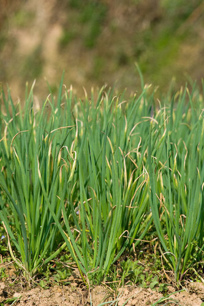

# Onion

> **Node ID**: plants.edible-plants.onion
> **Domain**: [Plants](./index.md)
> **Dependencies**: See prerequisites
> **Enables**: [`Edible Plants`](edible-plants.md)
> **Timeline**: Years 0-5
> **Outputs**: edible_plant_material
> **Critical**: Yes

## Overview

> *Image: USDAgov, Public domain*

Onion

*Allium cepa* (Amaryllidaceae) is a vegetable crop species of major importance for civilization bootstrapping. Bulb onion provides leaves, roots, seeds/nuts as its primary edible product and ranks 18/100 on the nutrition score.

An evergreen bulb growing to 60cm at medium rate, hardy to UK zone 5 and not frost tender. Flowers June to July; hermaphroditic and self-fertile. Attracts wildlife. Prefers light to medium well-drained soils, thrives in mildly acid to very alkaline pH, and requires full sun and moist soil.

Edible parts: Leaves, Bulbs, Seeds, Herb, Spice, Vegetable, Flowers The bulb is eaten raw or cooked and is one of the most widely used vegetables in the world, growing 10cm or more in diameter. Raw, it can be sliced into salads or sandwich fillings; it is also baked or boiled as a vegetable in its own right, and commonly used to flavour soups, stews, and countless other cooked dishes. Some cultivars are selected for smaller, hotter bulbs specifically suited to pickling. Leaves of spring onion cultivars are harvested while young and actively growing for use in salads; the bulbs of these types are small and typically eaten along with the leaves. Successional sowing makes leaves available year-round. Flowers are eaten raw as a salad garnish, though they are somewhat dry and less pleasant than those of many related species. Seeds are sprouted and eaten, with a delicious onion flavour. Nutritional values per 100g fresh weight: 72 calories; water 79.8%; protein 2.5g; fat 0.1g; carbohydrate 16.8g; fibre 0.7g; ash 0.8g; calcium 37mg; phosphorus 60mg; iron 1.2mg; sodium 12mg; potassium 334mg; thiamine (B1) 0.06mg; riboflavin (B2) 0.02mg; niacin 0.2mg; vitamin C 8mg.

For civilization bootstrapping, onion is significant because of its role as a vegetable crop. Reliable food production is the foundation upon which all other technological development rests. Understanding the cultivation, processing, and storage of *Allium cepa* enables communities to establish food security and allocate labor to non-subsistence activities.

*Allium cepa* is a member of the Amaryllidaceae family. As a vegetable crop, it provides essential calories, protein, or other nutrients needed to sustain human populations during the bootstrap process. The ability to produce food reliably from cultivated plants is what separates sedentary civilizations from hunter-gatherer societies, because food surplus allows specialization of labor into toolmaking, construction, and eventually metallurgy and beyond.

This species grows as a perennial or annual depending on climate and management. Propagation is primarily by Early sowings can be made in February in a greenhouse for planting out in late spring. The main sowing is in March or April in a well-prepared outdoor seedbed. A further sowing of winter-hardy varieties (Japanese onions are widely used for this) can be made outdoors in August; these overwinter and produce bulbs in June of the following year. Onion sets can be planted out in March or April. Sets are produced by sowing seed thickly in an outdoor seedbed in May or June on soil that is not too rich — seedlings will remain small in their first year, producing bulbs of about 1–2cm diameter. These are harvested in late summer, stored in a cool, frost-free place over winter, and planted out the following April. A proportion will bolt to seed but most should develop into good-sized bulbs.. Harvest timing depends on the plant part used: leaves, roots, seeds/nuts, flowers, spice/beverage are typically ready at specific growth stages or seasons.

## Prerequisites

### Materials

- Propagation material: Early sowings can be made in February in a greenhouse for planting out in late spring. The main sowing is in March or April in a well-prepared outdoor seedbed. A further sowing of winter-hardy varieties (Japanese onions are widely used for this) can be made outdoors in August; these overwinter and produce bulbs in June of the following year. Onion sets can be planted out in March or April. Sets are produced by sowing seed thickly in an outdoor seedbed in May or June on soil that is not too rich — seedlings will remain small in their first year, producing bulbs of about 1–2cm diameter. These are harvested in late summer, stored in a cool, frost-free place over winter, and planted out the following April. A proportion will bolt to seed but most should develop into good-sized bulbs.
- Compost or organic matter for soil amendment
- Mulch material for moisture retention and weed suppression

### Equipment

- Hoe or digging stick for soil preparation and planting
- Sickle, machete, or harvesting knife for crop harvest
- Drying racks or flat drying surfaces for post-harvest processing
- Storage containers: woven baskets, ceramic jars, or sacks for dried product
- Winnowing baskets or screens if processing grains or seeds

### Knowledge

- Species identification: An onion family plant. A herb with a two year life cycle. Normally it develops fattened bulbs at the base. It has a shallow fibrous root system. The actual stem in very short and condensed. Leaves are produced in an alternate fashion one after the other from the top of this stem. Successive leaves g
- Understanding of planting timing relative to local frost dates and rainy seasons
- Knowledge of soil preparation, seed depth, and spacing requirements
- Recognition of common pests and diseases and their early indicators
- Safe preparation methods for any toxic or bitter compounds (see Safety)

### Infrastructure

- Field or garden site with suitable climate, soil type, and sun exposure
- Reliable water access for germination and establishment phase
- Fenced or protected area if animal browsing is a risk
- Storage structure protected from moisture, rodents, and insects

## Process Description

### Cultivation and Propagation

Prefers a sunny sheltered position in a rich light well-drained soil. Prefers a pH of at least 6.5. Plants tolerate a pH in the range of 4.5 to 8.3. Onions are best grown in a Mediterranean climate, the hot dry summers ensuring that the bulbs are ripened fully. For best growth, however, cool weather is desirable at the early stages of growth. Plants are frost-tolerant but prolonged temperatures below 10°c cause the bulb to flower. Optimum growth takes place at temperatures between 20 and 25°c. Bulb formation takes place in response to long-day conditions. Plants are perennial but the cultivated forms often die after flowering in their second year though they can perennate by means of off-sets. The onion was one of the first plants to be cultivated for food and medicine. It is very widely cultivated in most parts of the world for its edible bulb and leaves, there are many named varieties capable of supplying bulbs all the year round. This species was derived in cultivation from A. oschaninii. Most forms are grown mainly for their edible bulbs but a number of varieties, the spring onions and everlasting onions, have been selected for their edible leaves. There are several sub-species:- Allium cepa 'Perutile' is the everlasting onion with a growth habit similar to chives, it is usually evergreen and can supply fresh leaves all winter. Allium cepa aggregatum includes the shallot and the potato onion. These are true perennials, the bulb growing at or just below the surface of the ground and increasing by division. Plants can be divided annually when they die down in the summer to provide bulbs for eating and propagation. Allium cepa proliferum is the tree onion, it produces bulbils instead of flowers in the inflorescence. These bulbils have a nice strong onion flavour and can be used raw, cooked or pickled. Onions grow well with most plants, especially roses, carrots, beet and chamomile, but they inhibit the growth of legumes. This plant is a bad companion for alfalfa, each species negatively affecting the other. Members of this genus are rarely if ever troubled by browsing deer. Alliums are typically harvested in late spring to early summer, when the bulbs mature and the tops begin to yellow. Allium species typically flower in late spring to early summer, depending on the species and local climate conditions. Allium species generally have a moderate growth rate, with bulbs typically taking about 100 to 150 days from planting to harvest, depending on the variety and growing conditions. Propagation: Early sowings can be made in February in a greenhouse for planting out in late spring. The main sowing is in March or April in a well-prepared outdoor seedbed. A further sowing of winter-hardy varieties (Japanese onions are widely used for this) can be made outdoors in August; these overwinter and produce bulbs in June of the following year. Onion sets can be planted out in March or April. Sets are produced by sowing seed thickly in an outdoor seedbed in May or June on soil that is not too rich — seedlings will remain small in their first year, producing bulbs of about 1–2cm diameter. These are harvested in late summer, stored in a cool, frost-free place over winter, and planted out the following April. A proportion will bolt to seed but most should develop into good-sized bulbs.

### Distribution and Growing Conditions

### Identification

An onion family plant. A herb with a two year life cycle. Normally it develops fattened bulbs at the base. It has a shallow fibrous root system. The actual stem in very short and condensed. Leaves are produced in an alternate fashion one after the other from the top of this stem. Successive leaves grow up inside, then burst through the leaf sheath of the previous leaf. Leaves are thin and long. They are slightly to markedly flattened on the upper surface. Long day lengths and warm temperatures help the leaf bases become swollen and store food reserves. Flowers are greenish white in colour. Flowers develop on a rounded head with stalks all coming from the centre. Flowers in the rounded head open irregularly. There are no bulbils on the flower-head. There are short day cultivars that will form bulbs in the tropics.

### Edible Parts and Preparation

## Quantitative Parameters

### Nutritional Composition (per 100g)

| Part | Moisture | kJ | kcal | Protein | Vit A | Vit C | Iron | Zinc |
| --- | --- | --- | --- | --- | --- | --- | --- | --- |
| Bulbs raw | 92.8 | 99 | 24 | 0.9 | 0 | 10 | 0.3 | 0.1 |
| Bulbs boiled | 96.6 | 53 | 13 | 0.6 | 0 | 6 | 0.3 | 0.1 |
| Leaves | 90 | — | — | 1.4 | 49 | — | 0.5 | 0.5 |
| Bulbs | — | — | — | — | — | — | — | — |

### Growing Parameters

| Parameter | Value | Notes |
|-----------|-------|-------|
| Germination temperature | 21°C | Optimal |
| Hardiness zones | 5-10 | USDA |
| Edible parts | Leaves, Roots, Seeds/Nuts, Flowers, Spice/Beverage | Primary harvest |

## Processing and Storage

### Non-Food Uses

Plant juice acts as a moth repellent and can be rubbed onto the skin to repel insects. The juice also serves as a rust preventative on metals and as a polish for copper and glass. A yellow-brown dye is obtained from the dry outer skins of the bulbs. Rubbing onion juice into the scalp is said to promote hair growth and act as a remedy for baldness, and it is also used cosmetically to reduce freckles. The growing plant is said to repel insects and moles. A spray made by covering 1kg of chopped unpeeled onions with boiling water is said to increase the disease and parasite resistance of other plants when applied to them.

### Storage

Dry seeds thoroughly to below 14% moisture content before storage. Spread in thin layers on drying racks in full sun, stirring periodically. Test dryness by biting: properly dried seeds crack rather than dent. Store in airtight containers (ceramic jars with tight lids, sealed woven bags) in a cool, dry, dark location. Protect from rodents and insects with tight lids or by mixing with inert ash. Under good conditions, dried grains and legumes store for 1-5 years with minimal loss.

### Material Handling

Handle onion produce with clean hands and tools to prevent contamination. Remove field heat promptly after harvest by moving product to shade. Process within the recommended timeframe to prevent quality loss. Compost crop residues and processing waste to return organic matter to the soil. Label stored products with harvest date, variety, and any treatments applied.

## Scaling Notes

- **Bench scale**: Individual plants or small garden plot (10-50 plants). Output for direct household consumption. Useful for seed saving, variety selection, and learning the crop's behavior under local conditions.
- **Pilot scale**: Field planting of 0.1 to 1 hectare (500-5,000 plants). Staggered planting or sequential harvests to extend availability. Requires basic hand tools and family-level labor. Surplus can be traded or stored.
- **Production scale**: Multi-hectare cultivation with mechanized planting, harvesting, and processing. Requires plow animals or tractors, grain mills or processing equipment, and bulk storage facilities. Enables community-level food security and trade.

Key scaling challenges include maintaining genetic diversity at plantation scale, managing pest and disease pressure in monoculture, and matching post-harvest processing capacity to harvest volume. Seed saving and variety selection at bench scale directly informs decisions about which cultivars to scale up.

## Troubleshooting

| Problem | Probable Cause | Solution |
|---------|---------------|----------|
| Poor germination | Old seed, wrong soil temperature, planted too deep, or insufficient moisture | Use fresh seed; verify germination temperature range; plant at recommended depth; maintain soil moisture during germination |
| Pest damage | Insect infestation or browsing animals | Hand-pick pests; use companion planting with repellent species; install fencing for larger pests |
| Disease (fungal/bacterial) | Poor air circulation, excessive moisture, infected seed | Space plants adequately; avoid overhead watering; use clean seed from disease-free plants; practice crop rotation |
| Low yield | Nutrient deficiency, water stress, overcrowding, or shade | Amend soil with compost or manure; ensure adequate water at critical growth stages; thin to recommended spacing; plant in full sun |
| Storage losses | Insufficient drying, rodent/insect damage, high humidity | Dry product thoroughly before storage; use sealed containers; inspect stored product regularly; keep storage area clean and dry |
| Quality or safety note | See species-specific notes | There are about 300-700 Allium species. Most species of Allium are edible (Flora of China). All alliums are edible but they may not all be worth eatin |

## Safety Considerations

Working with *Allium cepa* involves the following hazards:

- **Toxicity**: Parts of this plant may contain compounds that are toxic when raw or improperly prepared. Always follow proper preparation procedures before consumption. Verify with multiple authoritative sources.
- Tool injuries during harvest and processing — use sharp tools in good condition and cut away from the body
- Allergic reactions to plant compounds — sensitive individuals should test small quantities first
- Sun exposure and heat stress during field work — schedule heavy work for early morning or late afternoon
- Musculoskeletal strain from repetitive harvesting motions — vary tasks and take regular breaks

### Personal Protective Equipment

- Sturdy gloves when handling plants with irritant sap, spines, or rough surfaces
- Long sleeves and trousers for field work to reduce skin exposure to irritants and insects
- Eye protection when using cutting tools overhead or near face level
- Sun hat and sunscreen for extended field work

### Emergency Procedures

- For suspected plant poisoning: stop eating immediately, save a sample of the plant material, and seek medical attention. Do not induce vomiting unless directed by a medical professional.
- For tool lacerations: apply direct pressure with a clean cloth, elevate the wound, and seek medical attention for cuts deeper than skin level.
- For allergic reaction (swelling, difficulty breathing): discontinue exposure immediately and seek emergency medical help.

## Quality Control

### Acceptance Criteria

- Harvest product shows expected color, texture, size, and flavor for the variety grown
- No visible mold, rot, pest damage, or foreign material in stored product
- Dried products are brittle throughout with no flexible or moist spots
- Seeds intended for storage test at below 14% moisture content

### Testing Methods

- **Visual inspection**: check for discoloration, mold, insect damage, or foreign material
- **Bite test (seeds/grains)**: properly dried seeds crack cleanly; under-dried seeds dent or feel leathery
- **Smell test**: fresh product has characteristic aroma; off-odors indicate spoilage or contamination
- **Snap test (dried products)**: properly dried material snaps rather than bends

### Sampling Protocol

For field-scale production, inspect every 10th plant during harvest for disease and pest damage. Grade each batch by size and quality before storage. Record yield per unit area to track productivity trends across seasons and identify declining performance early.

## Variations and Alternatives

### Medicinal Uses

Though rarely used as a dedicated medicinal herb, the onion offers a broad range of beneficial effects and promotes general health when eaten regularly, especially raw. The bulb is anthelmintic, anti-inflammatory, antiseptic, antispasmodic, carminative, diuretic, expectorant, febrifuge, hypoglycaemic, hypotensive, lithontripic, stomachic, and tonic. Regular dietary use helps offset tendencies toward angina, arteriosclerosis, and heart attack, and is useful in preventing oral infection and tooth decay. Baked onions can be applied as a poultice to draw pus from sores. Fresh onion juice is an effective first-aid treatment for bee and wasp stings, bites, grazes, and fungal skin complaints. Warmed juice dropped into the ear relieves earache. Onion juice also aids scar tissue formation on wounds, speeding healing, and has been used cosmetically to reduce freckles. Bulbs of red cultivars, harvested when mature in summer, are used to prepare a homeopathic remedy particularly suited to symptoms including running eyes and nose. The German Commission E Monographs approve onion for appetite loss, arteriosclerosis, dyspeptic complaints, fevers and colds, cough and bronchitis, hypertension, tendency to infection, inflammation of the mouth and pharynx, and the common cold.

### Other Uses

### Additional Information

In Papua New Guinea, it is not widely grown but is popular and imported for sale. It is a commercially cultivated vegetable.

### Notes

There are about 300-700 Allium species. Most species of Allium are edible (Flora of China). All alliums are edible but they may not all be worth eating! They have also been put in the family Alliaceae.

### Related Species

- [Cabbage](cabbage.md)
- [Wild Tomato](wild-tomato.md)
- [Carrot](carrot.md)
- [Garlic](garlic.md)
- [Squash](squash.md)

### Cultivar Selection

Within *Allium cepa*, considerable variation exists in yield, disease resistance, climate adaptation, and quality characteristics. When establishing a onion crop, select varieties adapted to local conditions: day length, temperature range, rainfall pattern, and soil type. Landrace varieties — locally adapted populations maintained by traditional farmers — often outperform modern cultivars under low-input conditions because they have been selected for resilience rather than maximum yield under optimal conditions.

Seed saving from the best-performing plants each generation gradually adapts the variety to local conditions. Select for vigor, disease resistance, appropriate maturity timing, and product quality. Maintain genetic diversity by saving seed from multiple plants rather than a single individual, which preserves the population's ability to adapt to changing conditions and disease pressures.

### Crop Rotation and Companion Planting

*Allium cepa* benefits from crop rotation to prevent buildup of species-specific pests and diseases. Avoid planting in the same field in consecutive seasons where possible. Follow with a different crop family to break pest cycles and maintain soil health.

Companion planting with aromatic herbs or flowering plants can deter pests and attract beneficial insects. Avoid planting near species that compete for the same nutrients or harbor shared pathogens.

## References

- [Edible Plants](edible-plants.md) — parent capability
- [Plants Domain](./index.md) — domain overview and related capabilities
- [Agave](agave.md) — example plant article format
- [Food Processing](../food-processing/index.md) — downstream processing of harvested crops
- [Agriculture](../agriculture/index.md) — cultivation systems and crop rotation
- Family: Amaryllidaceae
- Distribution: Andorra, United Arab Emirates, Afghanistan, Antigua &amp; Barbuda, Albania, Armenia, Angola, Argentina, Austria, Australia, Azerbaijan, Bosnia &amp; Herzegovina, Barbados, Bangladesh, Belgium, Burkina Faso, Bulgaria, Bahrain, Burundi, Benin and 177 more
- Data sourced from Food Plants International, Wikipedia, and iNaturalist via the Edible Plant Database (ZIM)
- Plants for a Future (pfaf.org) — supplementary cultivation and use data

---
*Part of the [Bootciv Tech Tree](../index.md) · [Plants](./index.md) · [All Domains](../index.md)*
