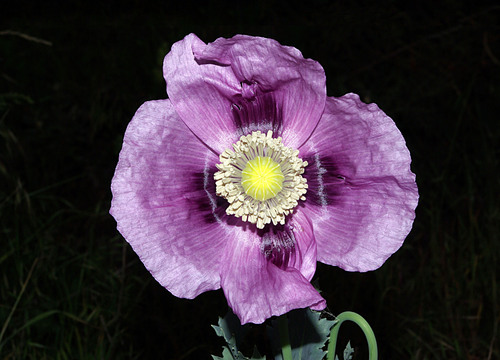

# Opium Poppy

> **Node ID**: plants.edible-plants.opium-poppy
> **Domain**: [Plants](./index.md)
> **Dependencies**: See prerequisites
> **Enables**: [`Edible Plants`](edible-plants.md)
> **Timeline**: Years 0-5
> **Outputs**: edible_plant_material
> **Critical**: No

## Overview

> *Opium poppy (Papaver somniferum): flowering and fruiting plants. Colour process print, c. 1924. Iconographic Collections*

> *Image: Wikimedia Commons contributor, CC BY 4.0*

Opium Poppy

*Papaver somniferum* (Papaveraceae) is a oilseed & spice crop species of major importance for civilization bootstrapping. Opium poppy, Breadseed poppy provides leaves, seeds/nuts, flowers as its primary edible product and ranks 72/100 on the nutrition score.

Papaver somniferum, commonly known as the opium poppy or breadseed poppy, is a species of flowering plant in the family Papaveraceae. It is the species of plant from which both opium and poppy seeds are derived and is also a valuable ornamental plant grown in gardens. Its native range is the western Mediterranean region, but has since been obscured by widespread introduction and cultivation since ancient times to the present day. It is now naturalised across much of the world with temperate climates.

Edible parts: Seeds, Herb, Spice, Oil, Leaves, Flowers The seeds can be eaten raw or cooked and are widely used as a flavouring in cakes, bread, and fruit salads, imparting a pleasant nutty taste. Crushed and sweetened seeds are used as a filling in crepes, strudels, and pastries. The seeds are highly nutritious, containing approximately 22.7% protein, 48% fat, 9.8% carbohydrate, and 7.1% ash, and are a good source of lecithin. Although the capsules are 3cm or more in diameter and easy to harvest, the individual seeds are small. The seeds are safe to eat and contain very little if any narcotic alkaloids; however, their ingestion may produce urine test results similar to those seen in morphine or heroin users. Young leaves can be eaten raw or cooked and must be used before flower buds form; in some countries they are eaten at the seedling stage. One report indicates the leaves contain no narcotic principles, though some caution is still advised. A high-quality edible drying oil with an almond flavour is pressed from the seeds and makes a good substitute for olive oil. Nutritional figures per 100g of fresh seed: 533 calories; water 6.8%; protein 18g; fat 44.7g; carbohydrate 23.7g; fibre 6.3g; ash 6.8g; calcium 1448mg; phosphorus 848mg; iron 9.4mg; magnesium 2.3mg; sodium 21mg; potassium 700mg; thiamine (B1) 0.95mg; riboflavin (B2) 0.17mg; niacin 0.98mg.

There are about 2 million seeds in a kg.

For civilization bootstrapping, opium poppy is significant because of its role as a oilseed & spice crop. Reliable food production is the foundation upon which all other technological development rests. Understanding the cultivation, processing, and storage of *Papaver somniferum* enables communities to establish food security and allocate labor to non-subsistence activities.

*Papaver somniferum* is a member of the Papaveraceae family. As a oilseed & spice crop, it provides essential calories, protein, or other nutrients needed to sustain human populations during the bootstrap process. The ability to produce food reliably from cultivated plants is what separates sedentary civilizations from hunter-gatherer societies, because food surplus allows specialization of labor into toolmaking, construction, and eventually metallurgy and beyond.

This species grows as a perennial or annual depending on climate and management. Propagation is primarily by Sow seed in spring or autumn directly in situ.. Harvest timing depends on the plant part used: leaves, seeds/nuts, flowers, spice/beverage are typically ready at specific growth stages or seasons.

## Prerequisites

### Materials

- Propagation material: Sow seed in spring or autumn directly in situ.
- Compost or organic matter for soil amendment
- Mulch material for moisture retention and weed suppression

### Equipment

- Hoe or digging stick for soil preparation and planting
- Sickle, machete, or harvesting knife for crop harvest
- Drying racks or flat drying surfaces for post-harvest processing
- Storage containers: woven baskets, ceramic jars, or sacks for dried product
- Winnowing baskets or screens if processing grains or seeds

### Knowledge

- Species identification: An annual plant which grows up to 60-150 cm high. It is 20 cm across. The leaves are coarsely toothed and clasp the stem. They are smooth and undivided. They are wavy. They are blue-green. The flowers are showy. They are cup shaped and red, white or purple. They are on long erect flower stalks. The seed capsule is round and 2-8 cm diameter, containing numerous tiny kidney-shaped seeds. The whole plant exudes a milky latex when cut.
- Understanding of planting timing relative to local frost dates and rainy seasons
- Knowledge of soil preparation, seed depth, and spacing requirements
- Recognition of common pests and diseases and their early indicators
- Safe preparation methods for any toxic or bitter compounds (see Safety)

### Infrastructure

- Field or garden site with suitable climate, soil type, and sun exposure
- Reliable water access for germination and establishment phase
- Fenced or protected area if animal browsing is a risk
- Storage structure protected from moisture, rodents, and insects

## Process Description

### Cultivation and Propagation

Prefers a rich well-drained sandy loam in a sunny position. Requires a moist soil but does not do well on wet clays. Prefers a sandy loam or a chalky soil. Plants often self-sow in British gardens. The opium poppy is a very ornamental plant that is often cultivated in the flower garden. There are many named varieties, some of which have been developed for their edible uses. The plant is widely grown, often illegally, in warm temperate and tropical climates for the substances contained in its sap. These are often used medicinally as pain killers, especially in the treatment of terminally ill patients suffering extreme pain, they are also used for their narcotic effects by some people. These substances are highly addictive and lead to a shortening of the life span if used with any frequency. In cool temperate zones the plant does not produce sufficient of the narcotic principles to make their extraction feasible and cultivation of the plant is perfectly legal in Britain. Plants have ripened their seeds as far north as latitude 69°n in Norway. Members of this genus are rarely if ever troubled by browsing deer or rabbits. Propagation: Sow seed in spring or autumn directly in situ.

### Distribution and Growing Conditions

### Identification

An annual plant which grows up to 60-150 cm high. It is 20 cm across. The leaves are coarsely toothed and clasp the stem. They are smooth and undivided. They are wavy. They are blue-green. The flowers are showy. They are cup shaped and red, white or purple. They are on long erect flower stalks. The fruit is a seed pod. It yields a milky sap. The capsule is 2-5 cm wide.

### Edible Parts and Preparation

## Quantitative Parameters

### Nutritional Composition (per 100g)

| Part | Moisture | kJ | kcal | Protein | Vit A | Vit C | Iron | Zinc |
| --- | --- | --- | --- | --- | --- | --- | --- | --- |
| Seed | 6.8 | 2231 | 534 | 18 | 0 | 3 | 9.4 | 10.2 |

### Growing Parameters

| Parameter | Value | Notes |
|-----------|-------|-------|
| Hardiness zones | 7-10 | USDA |
| Edible parts | Leaves, Seeds/Nuts, Flowers, Spice/Beverage | Primary harvest |

## Processing and Storage

### Non-Food Uses

The seeds yield 44–50% of an edible drying oil that is excellent for lighting, burning longer than most oils. The oil is also used in paints and soap making.

### Storage

Dry seeds thoroughly to below 14% moisture content before storage. Spread in thin layers on drying racks in full sun, stirring periodically. Test dryness by biting: properly dried seeds crack rather than dent. Store in airtight containers (ceramic jars with tight lids, sealed woven bags) in a cool, dry, dark location. Protect from rodents and insects with tight lids or by mixing with inert ash. Under good conditions, dried grains and legumes store for 1-5 years with minimal loss.

### Material Handling

Handle opium poppy produce with clean hands and tools to prevent contamination. Remove field heat promptly after harvest by moving product to shade. Process within the recommended timeframe to prevent quality loss. Compost crop residues and processing waste to return organic matter to the soil. Label stored products with harvest date, variety, and any treatments applied.

## Scaling Notes

- **Bench scale**: Individual plants or small garden plot (10-50 plants). Output for direct household consumption. Useful for seed saving, variety selection, and learning the crop's behavior under local conditions.
- **Pilot scale**: Field planting of 0.1 to 1 hectare (500-5,000 plants). Staggered planting or sequential harvests to extend availability. Requires basic hand tools and family-level labor. Surplus can be traded or stored.
- **Production scale**: Multi-hectare cultivation with mechanized planting, harvesting, and processing. Requires plow animals or tractors, grain mills or processing equipment, and bulk storage facilities. Enables community-level food security and trade.
  Reported production data: There are about 2 million seeds in a kg.

Key scaling challenges include maintaining genetic diversity at plantation scale, managing pest and disease pressure in monoculture, and matching post-harvest processing capacity to harvest volume. Seed saving and variety selection at bench scale directly informs decisions about which cultivars to scale up.

## Troubleshooting

| Problem | Probable Cause | Solution |
|---------|---------------|----------|
| Poor germination | Old seed, wrong soil temperature, planted too deep, or insufficient moisture | Use fresh seed; verify germination temperature range; plant at recommended depth; maintain soil moisture during germination |
| Pest damage | Insect infestation or browsing animals | Hand-pick pests; use companion planting with repellent species; install fencing for larger pests |
| Disease (fungal/bacterial) | Poor air circulation, excessive moisture, infected seed | Space plants adequately; avoid overhead watering; use clean seed from disease-free plants; practice crop rotation |
| Low yield | Nutrient deficiency, water stress, overcrowding, or shade | Amend soil with compost or manure; ensure adequate water at critical growth stages; thin to recommended spacing; plant in full sun |
| Storage losses | Insufficient drying, rodent/insect damage, high humidity | Dry product thoroughly before storage; use sealed containers; inspect stored product regularly; keep storage area clean and dry |
| Quality or safety note | See species-specific notes | There are 70-100 Papaver species. Opium poppy production is illegal in several countries. |

## Safety Considerations

Working with *Papaver somniferum* involves the following hazards:

- **Toxicity**: Parts of this plant may contain compounds that are toxic when raw or improperly prepared. Always follow proper preparation procedures before consumption. Verify with multiple authoritative sources.
- Tool injuries during harvest and processing — use sharp tools in good condition and cut away from the body
- Allergic reactions to plant compounds — sensitive individuals should test small quantities first
- Sun exposure and heat stress during field work — schedule heavy work for early morning or late afternoon
- Musculoskeletal strain from repetitive harvesting motions — vary tasks and take regular breaks

### Personal Protective Equipment

- Sturdy gloves when handling plants with irritant sap, spines, or rough surfaces
- Long sleeves and trousers for field work to reduce skin exposure to irritants and insects
- Eye protection when using cutting tools overhead or near face level
- Sun hat and sunscreen for extended field work

### Emergency Procedures

- For suspected plant poisoning: stop eating immediately, save a sample of the plant material, and seek medical attention. Do not induce vomiting unless directed by a medical professional.
- For tool lacerations: apply direct pressure with a clean cloth, elevate the wound, and seek medical attention for cuts deeper than skin level.
- For allergic reaction (swelling, difficulty breathing): discontinue exposure immediately and seek emergency medical help.

## Quality Control

### Acceptance Criteria

- Harvest product shows expected color, texture, size, and flavor for the variety grown
- No visible mold, rot, pest damage, or foreign material in stored product
- Dried products are brittle throughout with no flexible or moist spots
- Seeds intended for storage test at below 14% moisture content

### Testing Methods

- **Visual inspection**: check for discoloration, mold, insect damage, or foreign material
- **Bite test (seeds/grains)**: properly dried seeds crack cleanly; under-dried seeds dent or feel leathery
- **Smell test**: fresh product has characteristic aroma; off-odors indicate spoilage or contamination
- **Snap test (dried products)**: properly dried material snaps rather than bends

### Sampling Protocol

For field-scale production, inspect every 10th plant during harvest for disease and pest damage. Grade each batch by size and quality before storage. Record yield per unit area to track productivity trends across seasons and identify declining performance early.

## Variations and Alternatives

### Medicinal Uses

The opium poppy contains a wide range of alkaloids and has long been valued medicinally, particularly for pain relief. Its use, especially of the extracted alkaloids opium and morphine, can become addictive and it should only be used under the supervision of a qualified practitioner. The dried latex from unripe green seed capsules is the richest source of active alkaloids including morphine. It is collected by making shallow incisions in the capsules after the petals fall, taking care not to penetrate the capsule interior; the latex exudes and dries in air before being scraped off. This latex is anodyne, antitussive, astringent, diaphoretic, emmenagogue, hypnotic, narcotic, and sedative. It has also been used as an antispasmodic and expectorant for certain coughs, and its astringent properties make it useful in treating dysentery. A homeopathic remedy prepared from the dried latex is used for constipation, fevers, and insomnia.

### Other Uses

### Additional Information

It is cultivated.

### Notes

There are 70-100 Papaver species. Opium poppy production is illegal in several countries.

### Related Species

- [Sunflower](sunflower.md)
- [Oil Palm](oil-palm.md)
- [Rapeseed](rapeseed.md)
- [Sesame](sesame.md)
- [Safflower](safflower.md)

### Cultivar Selection

Within *Papaver somniferum*, considerable variation exists in yield, disease resistance, climate adaptation, and quality characteristics. When establishing a opium poppy crop, select varieties adapted to local conditions: day length, temperature range, rainfall pattern, and soil type. Landrace varieties — locally adapted populations maintained by traditional farmers — often outperform modern cultivars under low-input conditions because they have been selected for resilience rather than maximum yield under optimal conditions.

Seed saving from the best-performing plants each generation gradually adapts the variety to local conditions. Select for vigor, disease resistance, appropriate maturity timing, and product quality. Maintain genetic diversity by saving seed from multiple plants rather than a single individual, which preserves the population's ability to adapt to changing conditions and disease pressures.

### Crop Rotation and Companion Planting

*Papaver somniferum* benefits from crop rotation to prevent buildup of species-specific pests and diseases. Avoid planting in the same field in consecutive seasons where possible. Follow with a different crop family to break pest cycles and maintain soil health.

Companion planting with aromatic herbs or flowering plants can deter pests and attract beneficial insects. Avoid planting near species that compete for the same nutrients or harbor shared pathogens.

## References

- [Edible Plants](edible-plants.md) — parent capability
- [Plants Domain](./index.md) — domain overview and related capabilities
- [Agave](agave.md) — example plant article format
- [Food Processing](../food-processing/index.md) — downstream processing of harvested crops
- [Agriculture](../agriculture/index.md) — cultivation systems and crop rotation
- Family: Papaveraceae
- Distribution: Andorra, United Arab Emirates, Afghanistan, Antigua &amp; Barbuda, Albania, Armenia, Argentina, Austria, Australia, Azerbaijan, Bosnia &amp; Herzegovina, Barbados, Bangladesh, Belgium, Bulgaria, Bahrain, Brunei, Bolivia, Brazil, Bahamas and 115 more
- Data sourced from Food Plants International, Wikipedia, and iNaturalist via the Edible Plant Database (ZIM)
- Plants for a Future (pfaf.org) — supplementary cultivation and use data

---
*Part of the [Bootciv Tech Tree](../index.md) · [Plants](./index.md) · [All Domains](../index.md)*
