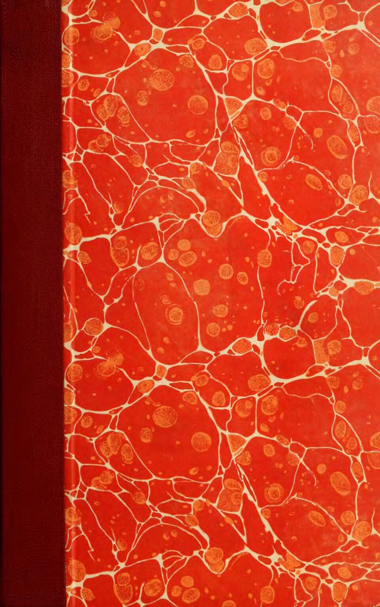
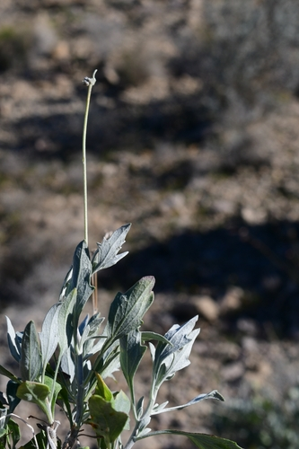

# Guayule

> **Node ID**: plants.rubber.guayule
> **Domain**: [Plants](./index.md)
> **Dependencies**: See prerequisites
> **Enables**: [`Chemistry`](../chemistry/index.md), [`Machine Tools`](../machine-tools/index.md)
> **Timeline**: Years 2-5
> **Outputs**: natural rubber (cis-1,4-polyisoprene), resin
> **Critical**: No — backup rubber source for arid zones where Hevea cannot grow

## Overview

> *Publication by Francis Ernest Lloyd of Alabama Polytechnic Institute (now Auburn University) on the culture, history, and needs for cultivating Pathenium argentatum Gray (Guayule).*

> *Image: Francis Ernest Lloyd, Public domain*

Guayule (*Parthenium argentatum*) is a desert shrub native to the southwestern United States and northern Mexico that produces natural rubber in its stems and roots. Unlike the tropical rubber tree (*Hevea brasiliensis*), guayule grows in arid and semi-arid conditions with 250-500 mm annual rainfall, making it the only practical rubber source for dry climates.

The rubber content in guayule stems is 5-20% of dry weight, concentrated in the bark and parenchyma cells (not in latex vessels like Hevea). The rubber is chemically similar to Hevea rubber (both are cis-1,4-polyisoprene) but with slightly different molecular weight distribution. Guayule rubber is suitable for most applications where Hevea rubber is used, including tires, gaskets, seals, and elastic bands.

The extraction process differs fundamentally from Hevea. Instead of tapping latex from living trees, guayule is harvested by cutting the entire shrub, grinding it, and extracting rubber from the plant tissue using a solvent or mechanical process. The shrub regrows from the root crown after harvest, allowing multiple harvests on a 2-3 year cycle.

Guayule was developed as a commercial rubber source during World War II when the Japanese occupation of Southeast Asia cut off Hevea supplies to the Allies. The Emergency Rubber Project established 13,000 hectares of guayule in California. After the war, cheap Hevea rubber returned and guayule was abandoned. It remains a strategic backup for rubber production in regions distant from the tropics.

The shrub grows 30-90 cm tall with silvery-gray foliage. It is extremely drought-tolerant, surviving on 250 mm annual rainfall. It tolerates temperatures from -10°C to 45°C and grows in alkaline, rocky soils where few other crops survive.

Primary outputs: `natural_rubber` for waterproofing, elastic materials, and tire production.

## Prerequisites

### Materials

- Guayule seeds or nursery transplants
- Arid/semi-arid site with well-drained soil (pH 7.0-8.5)
- Solvent for rubber extraction (acetone, hexane, or kerosene) if using solvent extraction

### Equipment

- Mechanical harvester (sickle or mower) for cutting shrubs
- Grinding equipment (hammer mill or stone mill) for breaking down plant tissue
- Extraction vessel (sealed tank or pot) for solvent extraction
- Filter cloth or press for separating rubber from plant debris
- Washing and drying equipment for finished rubber

### Knowledge

- Harvest timing: rubber content peaks at 2-3 years of growth
- Solvent extraction chemistry: dissolving rubber from ground plant material
- Rubber coagulation: precipitating rubber from solvent solution
- Vulcanization: sulfur treatment to improve rubber properties
- Safety procedures for handling solvents

### Infrastructure

- Arid planting site (guayule does not tolerate waterlogging)
- Processing area with grinding and extraction equipment
- Solvent storage (flammable, requires safe handling)
- Drying area for finished rubber sheets

## Process Description

### Planting and Harvest

1. Start seeds in a nursery. Guayule seeds are tiny and have low germination (20-40%). Sow densely in flats and transplant seedlings at 6-8 weeks to the field.
2. Space transplants 30-45 cm apart in rows 90-120 cm apart. Irrigate to establish (first 2-3 months), then rely on natural rainfall.
3. Allow plants to grow for 2-3 years. Rubber content increases with plant age, peaking at 2-3 years in optimal conditions.
4. Harvest by cutting the entire shrub at ground level. The root crown survives and regrows for subsequent harvests on a 2-3 year cycle.
5. Harvested biomass can be processed immediately or dried for later processing.

### Rubber Extraction (Solvent Method)

1. Dry harvested stems in the sun for 3-5 days until brittle.
2. Grind the dried material in a hammer mill or stone mill to a coarse powder (1-5 mm particles). The grinding breaks open the cells containing rubber particles.
3. Place the ground material in an extraction vessel. Cover with solvent (acetone or hexane). The solvent dissolves the rubber and resin from the plant tissue.
4. Agitate or stir for 2-4 hours at room temperature. Drain the solvent-rubber solution through a filter cloth.
5. Repeat extraction 2-3 times with fresh solvent to maximize yield.
6. Coagulate the rubber by adding the solvent solution to a large volume of water while stirring vigorously. The rubber precipitates as a spongy mass.
7. Collect the coagulated rubber and wash repeatedly in clean water to remove residual solvent.
8. Press the rubber between rollers to remove excess water. Dry the sheets for 3-7 days.

### Rubber Extraction (Mechanical Method, Low Technology)

1. Grind fresh (not dried) guayule stems in a mill or mortar to break cell walls.
2. Add water to the ground material and beat or churn vigorously. The rubber particles coagulate and float to the surface as a frothy layer.
3. Skim the rubber froth from the surface. Repeat beating and skimming until no more rubber floats.
4. Wash the collected rubber in clean water and press into sheets.
5. Dry the sheets. This method yields lower purity rubber than solvent extraction but requires no solvents.

### Process Parameters

| Parameter | Range | Notes |
|-----------|-------|-------|
| Rubber content (dry stems) | 5-20% | Varies by variety, age, and growing conditions |
| Rubber yield per hectare per harvest | 300-800 kg | From 2-3 year old plants |
| Biomass yield per hectare | 5,000-10,000 kg (dry) | Above-ground harvest |
| Solvent:biomass ratio | 3:1 to 5:1 | By volume |
| Extraction time | 2-4 hours per batch | Room temperature |
| Rubber recovery rate | 60-80% | Of total rubber in biomass |
| Shrub height at harvest | 30-90 cm | 2-3 year old plants |
| Regrowth cycle | 2-3 years | From root crown |
| Optimal rainfall | 250-500 mm/year | Arid to semi-arid |
| Temperature tolerance | -10 to 45°C | Very hardy |
| Vulcanization temperature | 140-160°C | With sulfur (2-4% by weight) |
| Vulcanization time | 15-60 minutes | Depending on product thickness |
| Guayule rubber molecular weight | 1.0-2.5 million Daltons | Comparable to Hevea |
| Resin content (co-extracted) | 15-25% of total extract | Must be separated for quality rubber |

### Solvent Extraction Details

Guayule rubber extraction is fundamentally different from Hevea rubber extraction because the rubber is stored in individual parenchyma cells throughout the stem rather than in specialized latex vessels. The grinding step must rupture these cells to release the rubber particles. A hammer mill or stone mill that reduces the dried stems to 1-5 mm particles provides adequate cell rupture.

The solvent dissolves both rubber and resin (a mixture of terpenes, fatty acids, and other low-molecular-weight compounds). Resin constitutes 15-25% of the total solvent extract and must be separated from the rubber for quality products. The traditional method is acetone pre-extraction: first extract the ground biomass with acetone to remove resins, then extract with hexane to recover purified rubber. This two-solvent system produces rubber with properties close to Hevea rubber.

The mechanical (water-based) extraction method avoids solvents entirely but produces lower-quality rubber. The rubber particles coagulate by mechanical entanglement during beating, forming a spongy mass that is skimmed off. This rubber contains 20-40% resin and plant debris, making it suitable only for basic applications (elastic bands, waterproof coatings) where high purity is not required. For most bootstrap applications, this lower-quality rubber is adequate.

### Byproducts and Resin Utilization

The resin co-extracted with guayule rubber contains terpenoids with insecticidal and antifungal properties. The bagasse (spent plant material after extraction) can be burned as fuel or processed into particleboard. The high resin content of guayule bagasse (even after extraction) makes it burn hot and fast, suitable for boiler fuel in the extraction facility itself.

## Safety Considerations

- Solvents (acetone, hexane) are extremely flammable. Work outdoors or in a well-ventilated, spark-free environment. No open flames or sparks near solvent processing.
- Acetone and hexane vapors cause dizziness, headache, and at high concentrations, unconsciousness. Ensure ventilation. Use respirators if working in enclosed spaces.
- Guayule contains parthenium compounds that cause contact dermatitis in some individuals (related to the allergenic weed *Parthenium hysterophorus*). Wear gloves when handling fresh plant material.
- Coagulated rubber in water creates a slippery surface. Prevent slip hazards in processing areas.
- Sulfur vulcanization produces hydrogen sulfide gas at high temperatures. Work in well-ventilated areas.

### Personal Protective Equipment

- Chemical-resistant gloves for solvent handling
- Respirator (organic vapor cartridge) for solvent processing
- Safety glasses or face shield for grinding operations
- Fire-resistant apron for vulcanization work

## Quality Control

### Acceptance Criteria

- **Raw rubber**: Pale tan to light brown, no visible plant debris, elastic when stretched, no solvent odor
- **Vulcanized rubber**: Returns to original shape after 100% elongation, no cracks after 500 flex cycles, surface smooth and uniform

### Testing Methods

- Elasticity test: stretch a rubber strip to 200% of original length and release. Good rubber snaps back without permanent deformation.
- Purity test: dissolve rubber in solvent. Pure rubber dissolves completely. Residue indicates contamination with plant material or resin.
- Ash test: burn a small sample. Pure rubber burns with a black, sooty flame and leaves minimal ash. High ash indicates mineral contamination.
- Stress-strain test: hang increasing weights from a standard rubber strip. Record elongation at each weight. Compare against reference values.

## Scaling Notes

- **Test plot** (0.1 hectare): 1,000-2,000 plants. Rubber yield: 3-8 kg per harvest. Sufficient for experimental processing.
- **Plantation** (10 hectares): 100,000-200,000 plants. Annual rubber yield: 1-4 tonnes (from staggered harvesting). Requires mechanized grinding and extraction.
- **Commercial operation** (100+ hectares): 10-40 tonnes rubber per year. Competes with small Hevea plantations in output but at much higher processing cost.
- **Bottleneck**: Solvent extraction requires large volumes of solvent. Solvent recovery (distillation of used solvent for reuse) is essential for economic operation.

## Troubleshooting

| Problem | Probable Cause | Solution |
|---------|---------------|----------|
| Low rubber yield from biomass | Plants harvested too young or variety low in rubber | Wait 2-3 years; select high-yield varieties |
| Rubber contaminated with plant debris | Insufficient filtering after extraction | Filter through finer cloth; re-dissolve and re-filter |
| Rubber does not coagulate from solvent | Solvent too concentrated or water too little | Dilute solvent solution; add to larger volume of water |
| Vulcanized rubber cracks | Under-vulcanized or sulfur distribution uneven | Increase vulcanization time; ensure thorough mixing of sulfur |
| Solvent loss high during processing | Evaporation or poor vessel sealing | Use sealed vessels; cover extraction tanks; implement solvent recovery |
| Plant dieback in field | Root rot from overwatering or poor drainage | Improve drainage; do not irrigate established plants |

## Variations and Alternatives

- **Hevea brasiliensis** (Para rubber tree): The primary commercial rubber source. Higher yield per hectare (1,000-2,000 kg/year), easier extraction (tapped latex), but requires tropical climate.
- **Russian dandelion** (*Taraxacum kok-saghyz*): Temperate rubber source from root latex. Very low yield per hectare but grows in cold climates. Potential for small-scale rubber production.
- **Goldenrod** (*Solidago leavenworthii*): Produces rubber in stems. Low yield, investigated by Thomas Edison and Henry Ford. Not commercially viable.
- **Gutta-percha** (*Palaquium gutta*): Produces trans-polyisoprene (hard, non-elastic rubber). Used for electrical insulation and dental fillings. Tropical tree.
- **Sunflower** (*Helianthus annuus*): Some wild species produce rubber in stems and roots. Very low yield but widely adaptable annual crop. Potential for marginal rubber production in temperate zones.

### Strategic Rubber Independence

For a civilization bootstrap scenario, guayule provides rubber independence in arid zones where neither Hevea (tropical) nor Russian dandelion (cold temperate) can grow. The southwestern United States, northern Mexico, the Middle East, and arid regions of Australia and Africa are all potential guayule rubber production zones. The ability to produce rubber domestically — rather than importing from distant tropical regions — is strategically valuable for a self-sufficient civilization. Even at lower yield per hectare than Hevea, guayule rubber reduces dependency on tropical supply chains.

## References

- [Chemistry](../chemistry/index.md) — rubber chemistry and vulcanization
- [Machine Tools](../machine-tools/index.md) — rubber seals and gaskets for machinery
- [English Oak](./quercus-robur.md) — tannins used in leather processing, a related industrial material
- [Plants Domain](./index.md) — domain overview and related capabilities

### Guayule Rubber Quality

Guayule rubber is chemically almost identical to Hevea rubber (both are cis-1,4-polyisoprene)
and can be used interchangeably for most applications. The key difference is molecular weight
distribution: guayule rubber has a slightly broader distribution, which affects processing
behavior but not end-use performance. Tensile strength, elongation, and tear resistance of
guayule vulcanizates are within 5-10% of Hevea values.

One advantage of guayule rubber is its low protein content. Hevea latex contains proteins
that cause allergic reactions in 1-6% of the general population. Guayule rubber is essentially
hypoallergenic because the extraction process removes virtually all plant proteins. This makes
guayule rubber the preferred material for medical gloves and other products where latex
allergy is a concern.

Guayule rubber production was revived during the 2000s due to concerns about latex allergy from Hevea rubber. The US government invested in guayule research as a domestic rubber source, and several pilot processing plants were built in Arizona. While production remains small compared to Hevea, guayule represents a strategically important rubber alternative for arid regions.

### Guayule Summary

---
*Part of the [Bootciv Tech Tree](../index.md) · [Plants](./index.md) · [All Domains](../index.md)*

