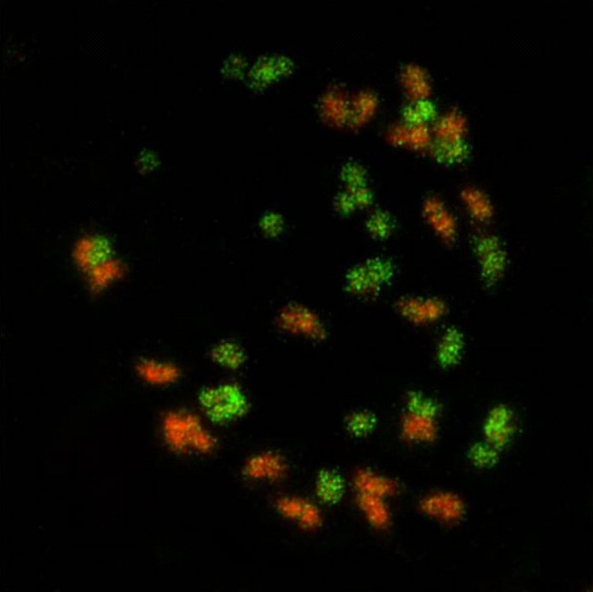

# Peanut

> **Node ID**: plants.edible-plants.peanut
> **Domain**: [Plants](./index.md)
> **Dependencies**: See prerequisites
> **Enables**: [`Edible Plants`](edible-plants.md)
> **Timeline**: Years 0-5
> **Outputs**: edible_plant_material
> **Critical**: Yes

## Overview

> *Karyotype of cultivated peanut (Arachis hypogaea). Allotetraploid with an AABB genome (2n = 4x = 40). Genomes from A.duranensis (AA genome) in green and A. ipaënsis (BB genome) in red.*

> *Image: Patricia M Guimarães Olivier GarsmeurKarina ProiteSoraya CM Leal-BertioliGuilhermo SeijoChristian ChaineDavid J BertioliAngelique D'Hont, CC BY 2.0*

Peanut

*Arachis hypogaea* (Fabaceae) is a legumes & pulse species of major importance for civilization bootstrapping. Peanut provides leaves, seeds/nuts as its primary edible product.

Edible parts: Leaves, Oil, Oil, Seed, Seedpod Oil. Seed - raw, cooked or ground into a powder. Peanuts are a staple food in many tropical zones and are widely exported to temperate area of the world. The seeds have a delicious nutty flavour and can be eaten on their own either raw or roasted. The seeds are commonly ground up and used as peanut butter in sandwiches etc. They can also be cooked in a variety of dishes and are also ground into a powder when they can be used with cereals to greatly improve the protein content of breads, cakes etc. The seed is very rich in protein and oil, it is also a good source of minerals and vitamins, especially the B complex. A nutritional analysis is available. A non-drying edible oil is obtained from the seed. This is one of the most commonly used edible oils is the world. It is similar in composition to olive oil and is often used in cooking, making margarines, salad oils etc. The oilseed cake is said to be a good source of arginine and glutamic acid, used in treating mental deficiencies. The roasted seed makes an excellent coffee substitute. Young pods may be consumed as a vegetable. Young leaves and tips are suitable as a cooked green vegetable. Javanese use the tips for lablab, and germinating seeds to make toge.

For civilization bootstrapping, peanut is significant because of its role as a legumes & pulse. Reliable food production is the foundation upon which all other technological development rests. Understanding the cultivation, processing, and storage of *Arachis hypogaea* enables communities to establish food security and allocate labor to non-subsistence activities.

*Arachis hypogaea* is a member of the Fabaceae family. As a legumes & pulse, it provides essential calories, protein, or other nutrients needed to sustain human populations during the bootstrap process. The ability to produce food reliably from cultivated plants is what separates sedentary civilizations from hunter-gatherer societies, because food surplus allows specialization of labor into toolmaking, construction, and eventually metallurgy and beyond.

This species grows as a perennial or annual depending on climate and management. Propagation is primarily by Seed - pre-soak for 12 hours in warm water and sow the seed in mid spring in a warm greenhouse. Germination should take place within 2 weeks. When large enough to handle, prick the seedlings out into individual pots of fairly rich soil and grow them on fast, planting them out after the last expected frosts and giving them some protection (such as a cloche) until they have settled down and are growing well.. Harvest timing depends on the plant part used: leaves, seeds/nuts are typically ready at specific growth stages or seasons.

## Prerequisites

### Materials

- Propagation material: Seed - pre-soak for 12 hours in warm water and sow the seed in mid spring in a warm greenhouse. Germination should take place within 2 weeks. When large enough to handle, prick the seedlings out into individual pots of fairly rich soil and grow them on fast, planting them out after the last expected frosts and giving them some protection (such as a cloche) until they have settled down and are growing well.
- Compost or organic matter for soil amendment
- Mulch material for moisture retention and weed suppression

### Equipment

- Hoe or digging stick for soil preparation and planting
- Sickle, machete, or harvesting knife for crop harvest
- Drying racks or flat drying surfaces for post-harvest processing
- Storage containers: woven baskets, ceramic jars, or sacks for dried product
- Winnowing baskets or screens if processing grains or seeds

### Knowledge

- Species identification: Arachis hypogaea is a ANNUAL growing to 0.3 m (1ft). See above for USDA hardiness. It is hardy to UK zone 8 and is frost tender. The species is hermaphrodite (has both male and female organs) and is pollinated by Insects. The plant is self-fertile. It can fix Nitrogen. Suitable for: light (sandy), m
- Understanding of planting timing relative to local frost dates and rainy seasons
- Knowledge of soil preparation, seed depth, and spacing requirements
- Recognition of common pests and diseases and their early indicators
- Safe preparation methods for any toxic or bitter compounds (see Safety)

### Infrastructure

- Field or garden site with suitable climate, soil type, and sun exposure
- Reliable water access for germination and establishment phase
- Fenced or protected area if animal browsing is a risk
- Storage structure protected from moisture, rodents, and insects

## Process Description

### Cultivation and Propagation

Prefers a light humus-rich well-drained soil in a warm sunny sheltered position, though it will tolerate heavier soils. Plants prefer hot dry conditions when the crop is ripening. Peanuts are quite tolerant of acid soils, and aluminium, requiring a minimum of lime for acceptable yields. Tolerates a pH in the range 4.3 to 8.7. Plants are not frost-hardy and most cultivars require too long a growing season to make them a viable crop in Britain. Some cultivars, however (listed below), have a shorter growing season and are worthy of more research in this country. The peanut is widely cultivated in the tropics and sub-tropics for its edible seed and oil contained in the seed, there are many named varieties. It grows best between latitudes 40° south and 40° north. Yields average about 1 tonne of unshelled nuts per hectare, about 80% of this weight is edible seeds (erect forms) and 60 - 75% (running forms). Crops can be grown at further distances from the equator but yields are likely to be poor. There are three main groups of cultivars:- 'Virginia' has large seeds, 'Valencia' has four seeds per pod and 'Spanish' has the smallest seeds. There are running and erect forms in each group. The erect forms mature more quickly and are therefore more likely to succeed in colder areas. 'Early Spanish' matures in 105 days and has cropped reliably as far north as Canada. 'Spanish' matures in 110 days and crops in Canada if grown in a light sandy soil with southern exposure. Plants are, in general, self-pollinating, though occasional outcrossing by bees occurs. This species has a symbiotic relationship with certain soil bacteria, these bacteria form nodules on the roots and fix atmospheric nitrogen. Some of this nitrogen is utilized by the growing plant but some can also be used by other plants growing nearby. When removing plant remains at the end of the growing season, it is best to only remove the aerial parts of the plant, leaving the roots in the ground to decay and release their nitrogen. Propagation: Seed - pre-soak for 12 hours in warm water and sow the seed in mid spring in a warm greenhouse. Germination should take place within 2 weeks. When large enough to handle, prick the seedlings out into individual pots of fairly rich soil and grow them on fast, planting them out after the last expected frosts and giving them some protection (such as a cloche) until they have settled down and are growing well.

### Distribution and Growing Conditions

S. America. Coming Soon

### Identification

Arachis hypogaea is a ANNUAL growing to 0.3 m (1ft). See above for USDA hardiness. It is hardy to UK zone 8 and is frost tender. The species is hermaphrodite (has both male and female organs) and is pollinated by Insects. The plant is self-fertile. It can fix Nitrogen. Suitable for: light (sandy), medium (loamy) and heavy (clay) soils and prefers well-drained soil. Suitable pH: mildly acid, neutral and basic (mildly alkaline) soils and can grow in very acid and very alkaline soils. It cannot grow in the shade. It prefers moist soil.

### Edible Parts and Preparation

#### Digging (Harvesting)

Peanuts are unique among legumes in producing their seed pods underground. Harvest requires digging the entire plant:

1. **Timing**: Dig when leaves turn yellow and begin to drop (typically 120-150 days after planting for Virginia types, 90-110 days for Spanish/Valencia types). Check maturity by sampling a few plants — the inner shell should be dark (brown to black) and the kernels should fill the pod fully. Pods with light inner shells are immature.
2. **Digging**: Loosen the soil around the plant with a fork or digging stick, working 15-20 cm away from the stem to avoid cutting through pods. The taproot and pod cluster extend 5-15 cm below the soil surface. Lift the entire plant gently — pulling by the tops breaks the pegs and leaves pods in the ground.
3. Shake off loose soil. The pods will be attached to the root crown in a cluster. Do not wash — moisture promotes mold during curing.

#### Drying and Curing

Proper drying is critical for safe storage. Inadequately dried peanuts are extremely susceptible to mold, including the dangerous *Aspergillus flavus* that produces aflatoxin:

1. **Windrow curing** (initial drying): Lay the dug plants on the soil surface with the pods facing up (foliage on the ground, peanuts exposed to air) for 2-3 days in dry, sunny weather. This initial field drying reduces pod moisture from 40-50% to 20-25%. If rain threatens, move plants under cover immediately — wet curing promotes mold.
2. **Further curing**: After windrow drying, strip the pods from the plants by hand or fork. Spread pods in a thin layer (5-8 cm deep) on drying racks, screens, or a clean dry floor in a well-ventilated shed. Turn daily. Cure for 2-4 weeks until pod moisture drops below 10%.
3. **Moisture test**: Shake a pod — the kernels should rattle inside. Bite a kernel — it should be crunchy with no give (below 8% moisture). Properly cured peanuts store for 6-12 months.
4. **Shell or store in-shell**: Peanuts store better in the shell (the pod provides physical protection). Shell only as needed. Shelled peanuts are more vulnerable to oxidation, mold, and insect damage.

> **⚠️ AFLATOXIN WARNING**
>
> **Aflatoxin is one of the most potent naturally occurring carcinogens known.** It is produced by the mold *Aspergillus flavus* and *Aspergillus parasiticus*, which grow on peanuts (and other grains/nuts) stored in warm, humid conditions (above 25°C, above 14% moisture). Aflatoxin contamination is invisible — moldy-looking peanuts may or may not contain aflatoxin, and clean-looking peanuts can be contaminated.
>
> **The risk is severe:** Aflatoxin causes liver cancer, immune suppression, and acute poisoning (aflatoxicosis). Children are especially vulnerable. There is no safe dose — chronic exposure even at very low levels increases cancer risk.
>
> **Prevention measures:**
> - **Dry peanuts to below 10% moisture** before storage. Moisture is the single most important risk factor.
> - **Store in cool, dry, dark conditions** — below 25°C, below 65% humidity, in breathable containers (never sealed plastic bags where condensation occurs).
> - **Inspect visually before eating or processing** — discard any nuts showing mold, discoloration (greenish, blackish, or white patches), shriveling, or off-odors (musty, earthy smell).
> - **Sort aggressively** — remove any damaged, discolored, or lightweight nuts that float in water (a traditional screening method: aflatoxin-contaminated kernels are often less dense).
> - **Do not eat moldy peanuts.** Cooking, roasting, and boiling do NOT destroy aflatoxin — it is heat-stable and survives normal cooking temperatures (decomposes only above 250°C).
> - **High-risk environments**: Humid tropical regions are highest risk. Post-harvest rain, flooding, or storage in damp buildings dramatically increase contamination. In these regions, dry peanuts immediately after digging and maintain strict moisture control.
> - **Animal feed caution**: Aflatoxin-contaminated peanut cake (residue from oil pressing) passes the toxin into milk, meat, and eggs of animals that consume it. Do not feed moldy peanuts or peanut cake to dairy animals.

#### Roasting

Roasting develops the characteristic peanut flavor, improves digestibility, and reduces moisture content for safer storage:

1. **Dry roasting**: Spread shelled raw peanuts in a single layer on a flat metal pan or clay griddle. Roast at 175°C for 15-20 minutes, stirring every 5 minutes to prevent scorching. The skins will darken and crack, and the kernels turn from pale cream to golden brown. Test by biting — the interior should be uniformly golden with no raw (white) center.
2. **Oil roasting**: Submerge raw shelled peanuts in hot oil (peanut oil, if available) at 170-175°C for 10-15 minutes. Drain and salt immediately while the oil on the surface is still hot. Oil-roasted peanuts have a richer flavor but shorter shelf life due to absorbed oil.
3. **Fire roasting** (basic technology): Place in-shell peanuts in a pan over an open fire. Shake or stir continuously for 15-20 minutes. The shells char on the outside and the kernels roast inside. This method provides some aflatoxin risk reduction — the heat kills surface mold, though it does not destroy aflatoxin already present in the kernel.
4. Cool roasted peanuts completely before storing. Moisture from condensation on warm nuts promotes mold.

#### Oil Pressing

Peanuts are one of the best oil crops for hand-pressing: 40-50% oil content by weight (shelled), higher than any other common legume:

1. **Cold pressing** (preferred for food quality): Shell and clean peanuts. Lightly crush or flake the kernels using a stone mill or mortar (do not grind to a paste — particle size of 1-2 mm allows oil to flow). Load into a screw press or wedge press. Apply pressure gradually. Oil flows from the press into a collection vessel.
2. **Yield**: Cold pressing extracts 30-40% of the kernel weight as oil (60-80% of available oil). The remaining press cake still contains 10-15% oil and 40-50% protein.
3. **Filtering**: Allow pressed oil to settle for 24-48 hours. The sediment (fine particles) settles to the bottom. Decant the clear oil. For finer filtering, pass through a cloth or fine mesh screen.
4. **Storage**: Peanut oil stores well for 6-12 months in sealed containers kept cool and dark. The oil has a high smoke point (227°C), making it excellent for frying.
5. **Press cake (oil cake/meal)**: The solid residue after pressing contains 40-50% protein. Use as high-quality animal feed (poultry, cattle, pigs), or grind into peanut flour for human consumption. **Critical**: Discard press cake from any batch showing signs of mold — aflatoxin concentrates in the press cake during oil extraction.

#### Process Parameters

| Parameter | Range | Notes |
|-----------|-------|-------|
| Days to maturity | 90-150 | Spanish (90-110), Virginia (120-150) |
| Pod moisture at dig | 40-50% | Must be reduced rapidly |
| Windrow curing time | 2-3 days | Initial field drying |
| Final curing time | 2-4 weeks | To below 10% moisture |
| Target storage moisture | Below 10% | Critical for aflatoxin prevention |
| Aflatoxin risk threshold | Above 14% moisture, above 25°C | *Aspergillus flavus* growth zone |
| Roasting temperature | 175°C | 15-20 minutes |
| Oil content (shelled) | 40-50% | One of the highest oil legumes |
| Cold press oil yield | 30-40% of kernel weight | 60-80% of available oil |
| Smoke point (peanut oil) | 227°C | Excellent for frying |
| Press cake protein | 40-50% | High-quality animal feed |
| Storage life (in shell) | 6-12 months | Below 10% moisture, cool/dry/dark |

## Quantitative Parameters

### Growing Parameters

| Parameter | Value | Notes |
|-----------|-------|-------|
| Edible parts | Leaves, Seeds/Nuts | Primary harvest |

## Processing and Storage

### Non-Food Uses

Biomass Oil Oil. The seeds yield a non-drying oil that has a wide range of uses including the manufacture of pharmaceuticals, soaps, cold creams, pomades and lubricants, paints, emulsions for insect control, and fuel for diesel engines. Peanut hulls are used for furfural, fuel, as a filler for fertilizers or for sweeping compounds.

### Storage

Dry seeds thoroughly to below 14% moisture content before storage. Spread in thin layers on drying racks in full sun, stirring periodically. Test dryness by biting: properly dried seeds crack rather than dent. Store in airtight containers (ceramic jars with tight lids, sealed woven bags) in a cool, dry, dark location. Protect from rodents and insects with tight lids or by mixing with inert ash. Under good conditions, dried grains and legumes store for 1-5 years with minimal loss.

### Material Handling

Handle peanut produce with clean hands and tools to prevent contamination. Remove field heat promptly after harvest by moving product to shade. Process within the recommended timeframe to prevent quality loss. Compost crop residues and processing waste to return organic matter to the soil. Label stored products with harvest date, variety, and any treatments applied.

## Scaling Notes

- **Bench scale**: Individual plants or small garden plot (10-50 plants). Output for direct household consumption. Useful for seed saving, variety selection, and learning the crop's behavior under local conditions.
- **Pilot scale**: Field planting of 0.1 to 1 hectare (500-5,000 plants). Staggered planting or sequential harvests to extend availability. Requires basic hand tools and family-level labor. Surplus can be traded or stored.
- **Production scale**: Multi-hectare cultivation with mechanized planting, harvesting, and processing. Requires plow animals or tractors, grain mills or processing equipment, and bulk storage facilities. Enables community-level food security and trade.

Key scaling challenges include maintaining genetic diversity at plantation scale, managing pest and disease pressure in monoculture, and matching post-harvest processing capacity to harvest volume. Seed saving and variety selection at bench scale directly informs decisions about which cultivars to scale up.

## Troubleshooting

| Problem | Probable Cause | Solution |
|---------|---------------|----------|
| Poor germination | Old seed, wrong soil temperature, planted too deep, or insufficient moisture | Use fresh seed; verify germination temperature range; plant at recommended depth; maintain soil moisture during germination |
| Pest damage | Insect infestation or browsing animals | Hand-pick pests; use companion planting with repellent species; install fencing for larger pests |
| Disease (fungal/bacterial) | Poor air circulation, excessive moisture, infected seed | Space plants adequately; avoid overhead watering; use clean seed from disease-free plants; practice crop rotation |
| Low yield | Nutrient deficiency, water stress, overcrowding, or shade | Amend soil with compost or manure; ensure adequate water at critical growth stages; thin to recommended spacing; plant in full sun |
| Storage losses | Insufficient drying, rodent/insect damage, high humidity | Dry product thoroughly before storage; use sealed containers; inspect stored product regularly; keep storage area clean and dry |

## Safety Considerations

Working with *Arachis hypogaea* involves the following hazards:

- **Toxicity**: Parts of this plant may contain compounds that are toxic when raw or improperly prepared. Always follow proper preparation procedures before consumption. Verify with multiple authoritative sources.
- Tool injuries during harvest and processing — use sharp tools in good condition and cut away from the body
- Allergic reactions to plant compounds — sensitive individuals should test small quantities first
- Sun exposure and heat stress during field work — schedule heavy work for early morning or late afternoon
- Musculoskeletal strain from repetitive harvesting motions — vary tasks and take regular breaks

### Personal Protective Equipment

- Sturdy gloves when handling plants with irritant sap, spines, or rough surfaces
- Long sleeves and trousers for field work to reduce skin exposure to irritants and insects
- Eye protection when using cutting tools overhead or near face level
- Sun hat and sunscreen for extended field work

### Emergency Procedures

- For suspected plant poisoning: stop eating immediately, save a sample of the plant material, and seek medical attention. Do not induce vomiting unless directed by a medical professional.
- For tool lacerations: apply direct pressure with a clean cloth, elevate the wound, and seek medical attention for cuts deeper than skin level.
- For allergic reaction (swelling, difficulty breathing): discontinue exposure immediately and seek emergency medical help.

## Quality Control

### Acceptance Criteria

- Harvest product shows expected color, texture, size, and flavor for the variety grown
- No visible mold, rot, pest damage, or foreign material in stored product
- Dried products are brittle throughout with no flexible or moist spots
- Seeds intended for storage test at below 14% moisture content

### Testing Methods

- **Visual inspection**: check for discoloration, mold, insect damage, or foreign material
- **Bite test (seeds/grains)**: properly dried seeds crack cleanly; under-dried seeds dent or feel leathery
- **Smell test**: fresh product has characteristic aroma; off-odors indicate spoilage or contamination
- **Snap test (dried products)**: properly dried material snaps rather than bends

### Sampling Protocol

For field-scale production, inspect every 10th plant during harvest for disease and pest damage. Grade each batch by size and quality before storage. Record yield per unit area to track productivity trends across seasons and identify declining performance early.

## Variations and Alternatives

### Medicinal Uses

Antiseborrheic Aperient Demulcent Emollient Pectoral. The oil from the seed is aperient, demulcent, emollient and pectoral. The seed is used mainly as a nutritive food. The seeds have been used in folk medicine as an anti-inflammatory, aphrodisiac and decoagulant. Peanuts play a small role in various folk pharmacopoeias. In China the nuts are considered demulcent, pectoral, and peptic; the oil aperient and emollient, taken internally in milk for treating gonorrhoea, externally for treating rheumatism. In Zimbabwe the peanut is used in folk remedies for plantar warts. Haemostatic and vasoconstrictor activity are reported. The alcoholic extract is said to affect isolated smooth muscles and frog hearts like acetylcholine. The alcoholic lipoid fraction of the seed is said to prevent haemophiliac tendencies and for the treatment of some blood disorders (mucorrhagia and arthritic haemorrhages) in haemophilia.

### Other Uses

### Related Species

- [Garden Pea](garden-pea.md)
- [Lentil](lentil.md)
- [Chickpea](chickpea.md)
- [Cowpea](cowpea.md)
- [Fava Bean](fava-bean.md)

### Cultivar Selection

Within *Arachis hypogaea*, considerable variation exists in yield, disease resistance, climate adaptation, and quality characteristics. When establishing a peanut crop, select varieties adapted to local conditions: day length, temperature range, rainfall pattern, and soil type. Landrace varieties — locally adapted populations maintained by traditional farmers — often outperform modern cultivars under low-input conditions because they have been selected for resilience rather than maximum yield under optimal conditions.

Seed saving from the best-performing plants each generation gradually adapts the variety to local conditions. Select for vigor, disease resistance, appropriate maturity timing, and product quality. Maintain genetic diversity by saving seed from multiple plants rather than a single individual, which preserves the population's ability to adapt to changing conditions and disease pressures.

### Crop Rotation and Companion Planting

*Arachis hypogaea* is a nitrogen-fixing legume, making it an excellent predecessor crop for nitrogen-demanding cereals and brassicas. The root nodules host Rhizobium bacteria that convert atmospheric nitrogen into plant-available forms, leaving residual nitrogen in the soil after harvest. Rotate with non-legume crops to break pest and disease cycles.

Companion planting with aromatic herbs or flowering plants can deter pests and attract beneficial insects. Avoid planting near species that compete for the same nutrients or harbor shared pathogens.

*Arachis hypogaea* is a nitrogen-fixing legume that enriches soil for subsequent crops. The unique "pegging" growth habit — where fertilized flowers push a stalk into the soil where the pod develops underground — requires loose, well-drained soil. Rotate with cereals or cotton. Avoid following other legumes to reduce root rot and nematode buildup. Peanuts make an excellent predecessor for maize, sorghum, or cotton.

## References

- [Edible Plants](edible-plants.md) — parent capability
- [Plants Domain](./index.md) — domain overview and related capabilities
- [Agave](agave.md) — example plant article format
- [Food Processing](../food-processing/index.md) — downstream processing of harvested crops
- [Agriculture](../agriculture/index.md) — cultivation systems and crop rotation
- Family: Fabaceae
- Data sourced from Food Plants International, Wikipedia, and iNaturalist via the Edible Plant Database (ZIM)
- Plants for a Future (pfaf.org) — supplementary cultivation and use data

Peanuts are unique among legumes in producing their seed pods underground. The plant flowers above ground, then the fertilized ovary elongates into a "peg" that pushes into the soil where the pod develops. Peanuts contain 40-50% oil and 25-30% protein, making them one of the most calorie-dense field crops. The oil is an excellent cooking oil with a high smoke point (227°C).

Peanuts are nitrogen-fixing legumes that add 50-150 kg of nitrogen per hectare to the soil, making them excellent rotation crops. The plant thrives in sandy, well-drained soils with warm temperatures (25-30°C optimal). Peanut hay (the above-ground biomass after pod harvest) provides nutritious animal fodder containing 8-12% protein. The pressed oil cake from oil extraction contains 40-50% protein and serves as high-quality animal feed.

---
*Part of the [Bootciv Tech Tree](../../index.md) · [Plants](./index.md) · [All Domains](../../index.md)*
