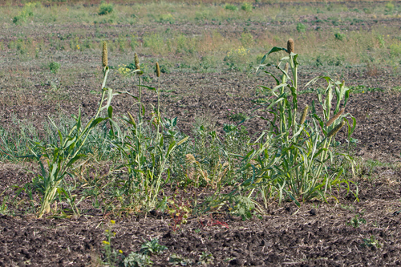

# Pearl Millet

> **Node ID**: plants.edible-plants.pearl-millet
> **Domain**: [Plants](./index.md)
> **Dependencies**: See prerequisites
> **Enables**: [`Edible Plants`](edible-plants.md)
> **Timeline**: Years 0-5
> **Outputs**: edible_plant_material
> **Critical**: No

## Overview

> *Image: Vis M, CC BY-SA 4.0*

Pearl Millet

*Pennisetum glaucum* (Poaceae) is a staple food crop species of major importance for civilization bootstrapping. Bullrush millet, Pearl millet provides seeds/nuts as its primary edible product and ranks 63/100 on the nutrition score.

Annual grass reaching 3 m tall, flowering and seeding September to October, wind-pollinated hermaphroditic species. Grows in light sandy or medium loamy, well-drained soils tolerating poor nutrition. Adapts to mildly acidic to basic pH, requires full sun, tolerates dry to moist conditions and drought.

Edible parts: Seeds, Cereal The seeds can be eaten raw or cooked, used much like rice in sweet or savoury dishes, or ground into a flour for bread, porridge, and similar preparations. The grain is commonly fermented to produce various foods, and the sweet-tasting grains are eaten raw by children. The seeds are highly nutritious.

It takes from 75-180 days to maturity. The heads can be picked by hand or the plant removed. Some types need to be picked 2 or 3 times as heads mature.

For civilization bootstrapping, pearl millet is significant because of its role as a staple crop. Reliable food production is the foundation upon which all other technological development rests. Understanding the cultivation, processing, and storage of *Pennisetum glaucum* enables communities to establish food security and allocate labor to non-subsistence activities.

*Pennisetum glaucum* is a member of the Poaceae family. As a staple food crop, it provides essential calories, protein, or other nutrients needed to sustain human populations during the bootstrap process. The ability to produce food reliably from cultivated plants is what separates sedentary civilizations from hunter-gatherer societies, because food surplus allows specialization of labor into toolmaking, construction, and eventually metallurgy and beyond.

This species grows as a perennial or annual depending on climate and management. Propagation is primarily by Sow seed in spring in a greenhouse. Once seedlings are large enough to handle, prick them out into individual pots and plant them out in early summer.. Harvest timing depends on the plant part used: seeds/nuts are typically ready at specific growth stages or seasons.

## Prerequisites

### Materials

- Propagation material: Sow seed in spring in a greenhouse. Once seedlings are large enough to handle, prick them out into individual pots and plant them out in early summer.
- Compost or organic matter for soil amendment
- Mulch material for moisture retention and weed suppression

### Equipment

- Hoe or digging stick for soil preparation and planting
- Sickle, machete, or harvesting knife for crop harvest
- Drying racks or flat drying surfaces for post-harvest processing
- Storage containers: woven baskets, ceramic jars, or sacks for dried product
- Winnowing baskets or screens if processing grains or seeds

### Knowledge

- Species identification: A millet grass. It is an annual grass. It grows to 3 m tall. The leaf blades are 20-100 cm long by 2-5 cm wide. The flower is dense and 40-50 cm long by 1.2-1.5 cm wide. They also vary a lot in shape and size. Plants that tiller produce smaller heads. The species varies a lot. There are 13 cultivate
- Understanding of planting timing relative to local frost dates and rainy seasons
- Knowledge of soil preparation, seed depth, and spacing requirements
- Recognition of common pests and diseases and their early indicators
- Safe preparation methods for any toxic or bitter compounds (see Safety)

### Infrastructure

- Field or garden site with suitable climate, soil type, and sun exposure
- Reliable water access for germination and establishment phase
- Fenced or protected area if animal browsing is a risk
- Storage structure protected from moisture, rodents, and insects

## Process Description

### Cultivation and Propagation

Plants are grown from seed. It is usually sown directly into the field. The plant density is adjusted to suit rainfall and soil fertility. The spacing is 45 cm apart up to 200 cm apart. It is also intercropped with other crops such as cowpea, sorghum and peanut. Crops are normally weeded 2 or 3 times. Propagation: Sow seed in spring in a greenhouse. Once seedlings are large enough to handle, prick them out into individual pots and plant them out in early summer.

### Distribution and Growing Conditions

### Identification

A millet grass. It is an annual grass. It grows to 3 m tall. The leaf blades are 20-100 cm long by 2-5 cm wide. The flower is dense and 40-50 cm long by 1.2-1.5 cm wide. They also vary a lot in shape and size. Plants that tiller produce smaller heads. The species varies a lot. There are 13 cultivated, 15 weed and 6 wild races of this grass. It has a cylindrical ear like a bullrush. The grains are small and round and have a shiny grey colour like pearls. There are thousands of cultivated varieties. Possibly now Cenchrus americanus (L.) Morrone

### Edible Parts and Preparation

## Quantitative Parameters

### Nutritional Composition (per 100g)

| Part | Moisture | kJ | kcal | Protein | Vit A | Vit C | Iron | Zinc |
| --- | --- | --- | --- | --- | --- | --- | --- | --- |
| Seeds | 11.6 | 1442 | 345 | 10.5 | 0 | 0 | 6.5 | 1.7 |

### Growing Parameters

| Parameter | Value | Notes |
|-----------|-------|-------|
| Growing period | 75–180 days | Maturity range |
| Annual rainfall | 600 mm | Growing requirement |
| Edible parts | Seeds/Nuts | Primary harvest |

## Processing and Storage

### Non-Food Uses

None known Special Uses

### Storage

Dry seeds thoroughly to below 14% moisture content before storage. Spread in thin layers on drying racks in full sun, stirring periodically. Test dryness by biting: properly dried seeds crack rather than dent. Store in airtight containers (ceramic jars with tight lids, sealed woven bags) in a cool, dry, dark location. Protect from rodents and insects with tight lids or by mixing with inert ash. Under good conditions, dried grains and legumes store for 1-5 years with minimal loss.

### Material Handling

Handle pearl millet produce with clean hands and tools to prevent contamination. Remove field heat promptly after harvest by moving product to shade. Process within the recommended timeframe to prevent quality loss. Compost crop residues and processing waste to return organic matter to the soil. Label stored products with harvest date, variety, and any treatments applied.

## Scaling Notes

- **Bench scale**: Individual plants or small garden plot (10-50 plants). Output for direct household consumption. Useful for seed saving, variety selection, and learning the crop's behavior under local conditions.
- **Pilot scale**: Field planting of 0.1 to 1 hectare (500-5,000 plants). Staggered planting or sequential harvests to extend availability. Requires basic hand tools and family-level labor. Surplus can be traded or stored.
- **Production scale**: Multi-hectare cultivation with mechanized planting, harvesting, and processing. Requires plow animals or tractors, grain mills or processing equipment, and bulk storage facilities. Enables community-level food security and trade.
  Reported production data: It takes from 75-180 days to maturity. The heads can be picked by hand or the plant removed. Some types need to be picked 2 or 3 times as heads mature.

Key scaling challenges include maintaining genetic diversity at plantation scale, managing pest and disease pressure in monoculture, and matching post-harvest processing capacity to harvest volume. Seed saving and variety selection at bench scale directly informs decisions about which cultivars to scale up.

## Troubleshooting

| Problem | Probable Cause | Solution |
|---------|---------------|----------|
| Poor germination | Old seed, wrong soil temperature, planted too deep, or insufficient moisture | Use fresh seed; verify germination temperature range; plant at recommended depth; maintain soil moisture during germination |
| Pest damage | Insect infestation or browsing animals | Hand-pick pests; use companion planting with repellent species; install fencing for larger pests |
| Disease (fungal/bacterial) | Poor air circulation, excessive moisture, infected seed | Space plants adequately; avoid overhead watering; use clean seed from disease-free plants; practice crop rotation |
| Low yield | Nutrient deficiency, water stress, overcrowding, or shade | Amend soil with compost or manure; ensure adequate water at critical growth stages; thin to recommended spacing; plant in full sun |
| Storage losses | Insufficient drying, rodent/insect damage, high humidity | Dry product thoroughly before storage; use sealed containers; inspect stored product regularly; keep storage area clean and dry |
| Quality or safety note | See species-specific notes | There are about 100 Pennisetum species. Chemical composition: Protein = 11.5%. Fat = 6.03%. Carbohydrate = 40.73%. Ash = 8.23%. |

## Safety Considerations

Working with *Pennisetum glaucum* involves the following hazards:

- **Toxicity**: Parts of this plant may contain compounds that are toxic when raw or improperly prepared. Always follow proper preparation procedures before consumption. Verify with multiple authoritative sources.
- Tool injuries during harvest and processing — use sharp tools in good condition and cut away from the body
- Allergic reactions to plant compounds — sensitive individuals should test small quantities first
- Sun exposure and heat stress during field work — schedule heavy work for early morning or late afternoon
- Musculoskeletal strain from repetitive harvesting motions — vary tasks and take regular breaks

### Personal Protective Equipment

- Sturdy gloves when handling plants with irritant sap, spines, or rough surfaces
- Long sleeves and trousers for field work to reduce skin exposure to irritants and insects
- Eye protection when using cutting tools overhead or near face level
- Sun hat and sunscreen for extended field work

### Emergency Procedures

- For suspected plant poisoning: stop eating immediately, save a sample of the plant material, and seek medical attention. Do not induce vomiting unless directed by a medical professional.
- For tool lacerations: apply direct pressure with a clean cloth, elevate the wound, and seek medical attention for cuts deeper than skin level.
- For allergic reaction (swelling, difficulty breathing): discontinue exposure immediately and seek emergency medical help.

## Quality Control

### Acceptance Criteria

- Harvest product shows expected color, texture, size, and flavor for the variety grown
- No visible mold, rot, pest damage, or foreign material in stored product
- Dried products are brittle throughout with no flexible or moist spots
- Seeds intended for storage test at below 14% moisture content

### Testing Methods

- **Visual inspection**: check for discoloration, mold, insect damage, or foreign material
- **Bite test (seeds/grains)**: properly dried seeds crack cleanly; under-dried seeds dent or feel leathery
- **Smell test**: fresh product has characteristic aroma; off-odors indicate spoilage or contamination
- **Snap test (dried products)**: properly dried material snaps rather than bends

### Sampling Protocol

For field-scale production, inspect every 10th plant during harvest for disease and pest damage. Grade each batch by size and quality before storage. Record yield per unit area to track productivity trends across seasons and identify declining performance early.

## Variations and Alternatives

### Medicinal Uses

The plant acts as an appetiser and tonic, and is considered useful in treating heart diseases. The fruits have been rubbed directly onto open facial pimples to help clear them.

### Other Uses

### Additional Information

It is cultivated for its grain. It is the second most important native African cereal. It is grown on 14 million hectares in Africa and 11 million hectares in India and Pakistan. It is the staple food of 100 million people.

### Notes

There are about 100 Pennisetum species. Chemical composition: Protein = 11.5%. Fat = 6.03%. Carbohydrate = 40.73%. Ash = 8.23%.

### Related Species

- [Wheat](wheat.md)
- [Rice](rice.md)
- [Maize](maize.md)
- [Potato](potato.md)
- [Cassava](cassava.md)

### Cultivar Selection

Within *Pennisetum glaucum*, considerable variation exists in yield, disease resistance, climate adaptation, and quality characteristics. When establishing a pearl millet crop, select varieties adapted to local conditions: day length, temperature range, rainfall pattern, and soil type. Landrace varieties — locally adapted populations maintained by traditional farmers — often outperform modern cultivars under low-input conditions because they have been selected for resilience rather than maximum yield under optimal conditions.

Seed saving from the best-performing plants each generation gradually adapts the variety to local conditions. Select for vigor, disease resistance, appropriate maturity timing, and product quality. Maintain genetic diversity by saving seed from multiple plants rather than a single individual, which preserves the population's ability to adapt to changing conditions and disease pressures.

### Crop Rotation and Companion Planting

*Pennisetum glaucum* benefits from crop rotation to prevent buildup of species-specific pests and diseases. Avoid planting in the same field in consecutive seasons where possible. Follow with a different crop family to break pest cycles and maintain soil health.

Companion planting with aromatic herbs or flowering plants can deter pests and attract beneficial insects. Avoid planting near species that compete for the same nutrients or harbor shared pathogens.

## References

- [Edible Plants](edible-plants.md) — parent capability
- [Plants Domain](./index.md) — domain overview and related capabilities
- [Agave](agave.md) — example plant article format
- [Food Processing](../food-processing/index.md) — downstream processing of harvested crops
- [Agriculture](../agriculture/index.md) — cultivation systems and crop rotation
- Family: Poaceae
- Distribution: Andorra, United Arab Emirates, Afghanistan, Antigua &amp; Barbuda, Albania, Armenia, Angola, Austria, Australia, Azerbaijan, Bosnia &amp; Herzegovina, Barbados, Bangladesh, Belgium, Burkina Faso, Bulgaria, Bahrain, Burundi, Benin, Brunei and 148 more
- Data sourced from Food Plants International, Wikipedia, and iNaturalist via the Edible Plant Database (ZIM)
- Plants for a Future (pfaf.org) — supplementary cultivation and use data

---
*Part of the [Bootciv Tech Tree](../index.md) · [Plants](./index.md) · [All Domains](../index.md)*
