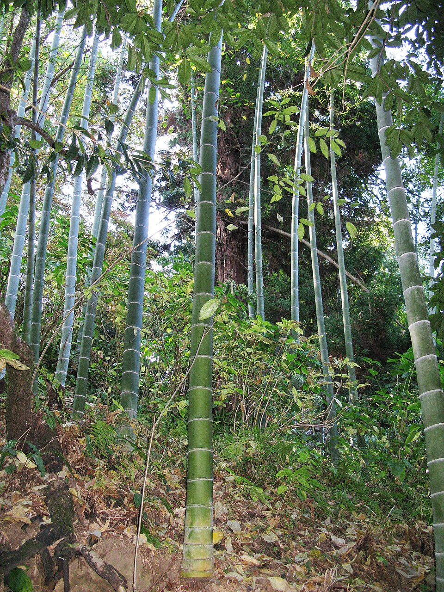

# Moso Bamboo

> **Node ID**: plants.structural.moso-bamboo
> **Domain**: [Plants](./index.md)
> **Dependencies**: See prerequisites
> **Enables**: [`Construction`](../construction/index.md), [`Textiles`](../textiles/index.md)
> **Timeline**: Years 3-8
> **Outputs**: structural culms (construction, scaffolding), fiber (paper, textiles), edible shoots
> **Critical**: No — versatile structural material but timber can substitute in most applications

## Overview

> *Taken in Bathumi*

> *Image: Lazaregagnidze, CC BY-SA 4.0*

Moso bamboo (*Phyllostachys edulis*) is the largest temperate bamboo species, producing culms (stems) 10-20 meters tall and 8-18 cm in diameter that are among the most versatile structural materials in the natural world. Bamboo has a higher tensile strength than steel by weight, grows to harvestable size in 3-5 years (vs. 40-80 years for timber trees), and regenerates from the same root system after harvest.

A single moso bamboo plant produces new culms annually from its underground rhizome network, reaching full height in just 60-90 days. The culms emerge at full diameter and grow by elongation, not by thickening. After emergence, the culm takes 3-5 years to mature (lignify and harden) before it is suitable for structural use. Once mature, culms remain standing for 8-12 years before beginning to decline.

Bamboo's mechanical properties are remarkable. The tensile strength of bamboo fibers (350-500 MPa) exceeds that of many steels by weight. The hollow, tubular structure gives bamboo excellent stiffness-to-weight ratio, similar to engineered tubular sections. This makes it ideal for scaffolding, poles, framing, and any application where light weight and high strength are needed.

Beyond structural use, bamboo can be split into strips for weaving baskets, mats, and wall panels. The fiber can be processed into paper and textiles (bamboo rayon). Young shoots are edible and commercially important in East Asian cuisine.

Moso bamboo is native to China and Taiwan, where it covers over 5 million hectares. It grows in temperate to subtropical climates with 1,000-2,000 mm annual rainfall, tolerating temperatures to -18°C. It is the primary bamboo species for commercial production worldwide.

Primary outputs: `structural_culms` for construction and scaffolding, `fiber` for paper and textiles, `edible_shoots` for food.

## Prerequisites

### Materials

- Moso bamboo rhizome divisions or nursery propagules (seeds are rare; bamboo flowers once every 60-120 years)
- Well-drained, fertile, loamy soil (pH 5.0-6.5)
- Temperate to subtropical climate with 1,000-2,000 mm rainfall

### Equipment

- Sharp machete or saw for culm harvest
- Splitting tools (knife, maul) for making strips
- Boring tools for joinery (holes for bolts or pins)
- Preservation treatment tank (borax/boric acid solution)

### Knowledge

- Culm selection for harvest (3-5 year old culms are optimal)
- Bamboo preservation treatment (borax immersion to prevent insect attack)
- Joinery techniques: lashing, pinning, bolting, and fish-mouth notching
- Splitting technique for consistent strip production

### Infrastructure

- Bamboo grove with space for rhizome spread (bamboo spreads aggressively; install root barriers if containment is needed)
- Treatment tank for borax preservation
- Covered storage for treated culms

## Process Description

### Culm Harvest and Treatment

1. Select culms that are 3-5 years old (identified by color: mature culms are dull green to yellow-green with lichen growth; young culms are bright green with culm sheaths). Harvest in the dry season when starch content is lowest (reduces insect attack).
2. Cut the culm at ground level with a saw or machete, just above the first node. Avoid splitting the butt end.
3. Remove branches by cutting flush with the culm surface.
4. **Preservation treatment**: submerge freshly cut culms in a solution of 5-10% borax (sodium borate) and 2-5% boric acid for 7-14 days. The borate penetrates the culm and prevents powderpost beetle and termite attack. Vertical soaking (standing the culms in a tank of solution) is most effective.
5. Air dry treated culms in a covered, well-ventilated area for 4-8 weeks until moisture content drops below 15%.

### Construction Use

1. **Scaffolding**: lash bamboo culms together with natural cord or wire at intersections. The fish-mouth joint (a V-shaped notch cut into one culm to cradle another) provides strong, stable connections.
2. **Framing**: use 8-12 cm diameter culms as posts and beams. Connect with bolts, pins (dowel joints through drilled holes), or lashings. Bamboo's hollow interior allows hidden bolt connections.
3. **Wall panels**: split culms lengthwise into strips 1-3 cm wide. Weave strips into panels. Plaster with mud or lime for solid walls.
4. **Flooring**: split large culms and flatten them. Lay as flooring or sub-flooring. Bamboo flooring is hard, smooth, and durable.

### Fiber and Paper Production

1. Split culms into thin strips (2-5 mm wide).
2. For paper: chip the strips and cook in alkali (5-10% sodium hydroxide or wood ash lye) at 100-120°C for 2-4 hours to break down lignin and separate fibers. Beat the cooked fiber into pulp and form into sheets using standard papermaking technique.
3. For textile fiber: crush and ret the strips (soak in water for bacterial decomposition of pectins), then comb to separate individual fibers.

### Process Parameters

| Parameter | Range | Notes |
|-----------|-------|-------|
| Tensile strength (fiber) | 350-500 MPa | Higher than steel by weight |
| Compressive strength (culm) | 40-80 MPa | Comparable to concrete |
| Density (dry culm) | 600-800 kg/m³ | Light for a structural material |
| Modulus of elasticity | 10,000-20,000 MPa | Stiff |
| Culm height | 10-20 m | At maturity |
| Culm diameter | 8-18 cm | At base |
| Wall thickness | 8-20 mm | At base, thinning toward top |
| Time to full height | 60-90 days | From emergence |
| Culm maturity age | 3-5 years | For structural use |
| Annual culm production | 3-8 per plant | From established rhizome |
| Treatment time (borate) | 7-14 days | Soaking |
| Drying time | 4-8 weeks | Air dried, covered |
| Optimal rainfall | 1,000-2,000 mm/year | Temperate/subtropical |
| Hardiness | -18°C | Cold-tolerant for bamboo |
| Culm growth rate | 30-100 cm/day | During peak emergence period |
| Rhizome spread rate | 1-3 m/year | Without containment barriers |
| Edible shoot yield | 2-5 tonnes/ha/year | From mature grove |

### Bamboo Construction Details

Bamboo's hollow tubular structure gives it an exceptional strength-to-weight ratio. The fiber distribution in the culm wall is optimized by nature: dense fibers near the outer surface resist compression and bending, while the interior is lighter parenchyma tissue. This gradient structure is difficult to replicate in manufactured materials.

The fish-mouth joint (cutting a V-shaped notch into one culm so it cradles another) is the fundamental bamboo connection. The notch must follow the curve of the cradled culm precisely for maximum contact area. Lashing with natural fiber cord, wire, or split bamboo strips secures the joint. For permanent structures, bolt connections through drilled holes provide the strongest joints — the hollow interior allows through-bolts with washers on both sides.

Bamboo splits naturally when nailed because the fibers run longitudinally. Always pre-drill holes before using nails or screws, or use lashing and bolting techniques instead. For flooring and wall panels, split bamboo strips are woven into mats that can be plastered with mud, lime, or cement for solid wall construction.

### Preservation and Longevity

Untreated bamboo is attacked by powderpost beetles ( genus *Dinoderus*) within months of harvest, reducing structural integrity. The borate treatment method (soaking in 5-10% sodium borate solution for 7-14 days) is the most effective low-technology preservation method. Borate salts are toxic to insects and fungi but have low mammalian toxicity, making treated bamboo safe for indoor use.

Alternative preservation methods: smoking culms over a fire (deposits creosote compounds that deter insects), soaking in water for 4-6 weeks (leaches out starches that attract beetles), and lime washing (painting with slaked lime solution). These methods are less effective than borate treatment but require no imported chemicals.

Harvest timing affects natural durability. Culms cut during the dry season (when starch content is lowest) are inherently more resistant to insect attack than those cut during the growing season. A simple test for harvest timing: cut a thin cross-section and apply iodine solution. Dark blue staining indicates high starch content — wait longer before harvesting.

## Safety Considerations

- Splitting bamboo produces sharp, splinter-like fragments that can cause deep puncture wounds. Wear gloves and eye protection when splitting.
- Fresh bamboo culm edges are razor-sharp after cutting. Handle cut ends with care.
- Borate treatment solution is a mild irritant. Avoid skin contact and eye exposure. Rinse with water if contact occurs.
- Bamboo scaffolding at height is a fall hazard. Ensure lashings are tight and inspect regularly.
- Powderpost beetles attack untreated bamboo, boring holes that weaken the culm and produce fine powder. Always treat culms before use in structures.

### Personal Protective Equipment

- Heavy leather gloves for splitting and cutting
- Safety glasses for all cutting and splitting operations
- Rubber gloves for borate treatment
- Hard hat when working with bamboo scaffolding

## Quality Control

### Acceptance Criteria

- **Structural culms**: Straight, minimum 3 years old, no cracks, no beetle holes, wall thickness minimum 8 mm at base, treated with borate
- **Split strips**: Uniform width, no splintering, flexible (not brittle)
- **Paper fiber**: Long, clean fibers, no lignin discoloration

### Testing Methods

- Age test: scratch the culm surface. Mature culms have hard, smooth bark. Young culms have softer bark that marks easily.
- Beetle check: tap the culm with a metal object. A clear ring indicates solid culm. A dull thud indicates internal beetle damage.
- Strength test: support a culm at both ends and apply weight at the center. A 10 cm diameter culm should support 200+ kg without breaking.

## Scaling Notes

- **Household grove** (100 m²): 20-50 plants. Annual culm yield: 60-400 mature culms. Sufficient for household construction and crafts.
- **Community grove** (1 hectare): 2,000-5,000 plants. Annual culm yield: 6,000-40,000 mature culms. Supports a village construction industry.
- **Key advantage**: perpetual harvest from the same root system. No replanting needed. Culms regenerate annually.

## Troubleshooting

| Problem | Probable Cause | Solution |
|---------|---------------|----------|
| Culms crack during drying | Dried too fast or in direct sun | Dry slowly in shade; seal ends with wax to slow moisture loss |
| Beetle attack on stored culms | Inadequate borate treatment | Extend soaking time; increase borate concentration; store dry |
| Culms too thin for structural use | Harvested too young or poor growing conditions | Wait 3-5 years; ensure adequate soil fertility and moisture |
| Bamboo spreading beyond intended area | Rhizome growth unchecked | Install root barrier (60 cm deep) around planting; harvest shoots at the boundary |
| Split strips uneven or splintering | Wrong splitting technique or dull tools | Use sharp splitting knife; start splits at the node; follow the grain |

## Variations and Alternatives

- **Giant bamboo** (*Dendrocalamus giganteus*): Tropical species with 20-30 meter culms, 15-25 cm diameter. Larger than moso but requires tropical climate.
- **Bambusa vulgaris**: Common tropical bamboo. Widely available but lower structural quality than moso.
- **Timber**: Scots pine, oak, or ash provide alternative structural materials in regions where bamboo cannot grow. Slower to produce but longer-lasting if kept dry.
- **Engineered bamboo**: Laminated bamboo panels and beams produced by splitting, planing, gluing, and pressing bamboo strips. Superior dimensional stability and strength. Requires adhesive technology.
- **Bamboo charcoal**: Bamboo makes excellent charcoal with a fine pore structure. It is also processed into activated carbon for water filtration, producing a higher surface area than wood-based activated carbon.
- **Bamboo textile (rayon)**: At higher technology levels, bamboo cellulose can be dissolved and regenerated as rayon fiber. The process requires carbon disulfide and sodium hydroxide. The resulting fabric is soft, moisture-wicking, and antibacterial.

## References

- [Construction](../construction/index.md) — bamboo as structural material
- [Textiles](../textiles/index.md) — bamboo fiber for textiles and paper
- [Scots Pine](./pinus-sylvestris.md) — comparison structural timber
- [Paper Mulberry](./broussonetia-papyrifera.md) — comparison fiber/paper source
- [Plants Domain](./index.md) — domain overview and related capabilities

### Bamboo in Earthquake-Resistant Construction

Bamboo's combination of high tensile strength and flexibility makes it exceptionally resistant
to earthquake forces. Unlike rigid masonry or concrete structures that crack under lateral
loads, bamboo buildings flex and return to their original position. This property has been
demonstrated in earthquake-prone regions of Colombia and the Philippines, where bamboo
structures have survived earthquakes that destroyed surrounding concrete buildings.

The key to earthquake-resistant bamboo construction is flexible joinery. Lashed connections
allow the building frame to move without breaking, dissipating earthquake energy through
joint rotation rather than member failure. Rigid bolted or glued connections are actually
less desirable in seismic zones because they concentrate stress at the joint.

### Bamboo Charcoal and Activated Carbon

Bamboo charcoal is produced by pyrolyzing culms in an earth-covered pit or retort at 400-600°C.
The charcoal has a fine pore structure and very high surface area, making it more effective
than wood charcoal for water filtration. Bamboo activated carbon (treated with steam at
800-1000°C) has a surface area of 300-500 m²/g, suitable for filtering organic contaminants,
chlorine, and heavy metals from drinking water. This application makes bamboo charcoal a
valuable material for water purification in a civilization bootstrap scenario.

Bamboo's annual renewal capacity — producing new culms each year from the same root system — gives it a significant sustainability advantage over timber trees that require decades to replace. A managed bamboo grove produces structural material continuously without replanting, making it one of the most renewable structural materials available. This perpetual productivity aligns well with the needs of a civilization that must maintain infrastructure without depleting natural resources.

---
*Part of the [Bootciv Tech Tree](../index.md) · [Plants](./index.md) · [All Domains](../index.md)*
