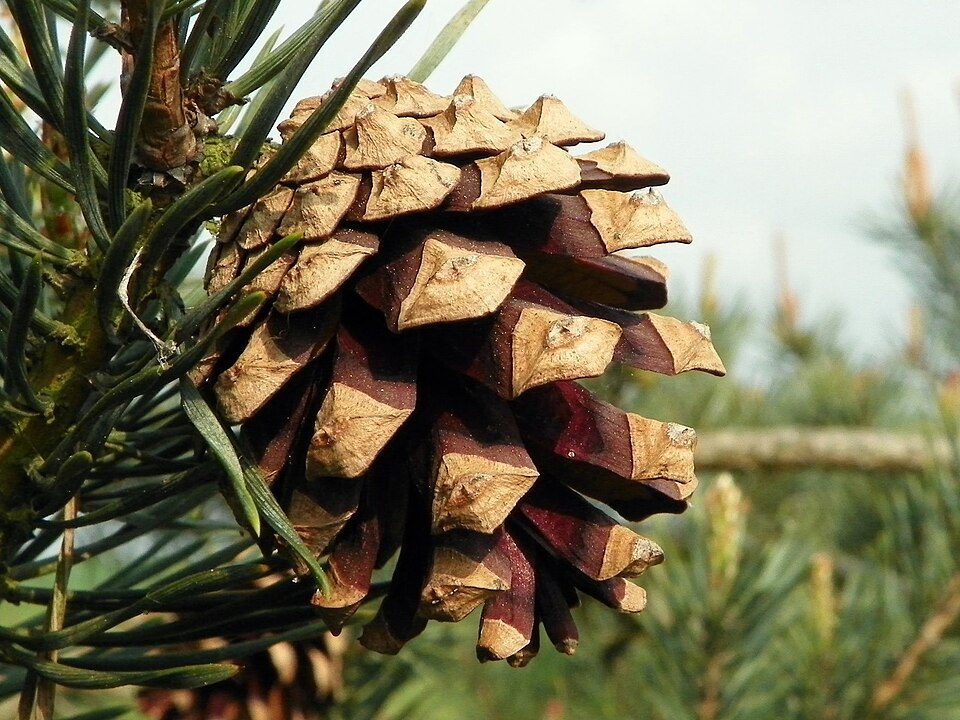

# Scots Pine

> **Node ID**: plants.timber.scots-pine
> **Domain**: [Plants](./index.md)
> **Dependencies**: See prerequisites
> **Enables**: [`Construction`](../construction/index.md), [`Chemistry`](../chemistry/index.md)
> **Timeline**: Years 0-30
> **Outputs**: timber, resin, turpentine, charcoal
> **Critical**: Yes — primary construction timber for temperate zones, plus resin derivatives for waterproofing and solvents

## Overview

> *Scots Pine (Pinus sylvestris), Great Ashby District Park, 28 April 2011.*

> *Image: AnemoneProjectors (talk), CC BY-SA 2.0*

Scots pine (*Pinus sylvestris*) is the most widely distributed pine in the world, native to Eurasia from Scotland to Siberia and from Scandinavia to the Mediterranean. It produces straight-grained, moderately strong timber suitable for construction framing, flooring, poles, and pit props. Beyond timber, the tree yields resin that can be processed into turpentine (solvent), rosin (soldering flux, violin bow treatment), and pitch (waterproofing for boats and barrels).

The wood has a distinct color contrast: creamy-white sapwood and reddish-brown heartwood. The heartwood is moderately durable against decay, making it suitable for outdoor use without chemical treatment when heartwood is selected. Density ranges from 470 to 530 kg/m³ at 12% moisture content.

Scots pine grows on poor soils where hardwoods struggle, making it the default construction timber for northern and eastern Europe. It matures to harvestable size in 40 to 80 years depending on site quality. The tree reaches 20 to 35 meters in height with a trunk diameter of 0.5 to 1.0 meters at maturity.

Primary outputs: `timber` for construction, `resin` for chemical processing, `charcoal` from wood waste.

## Prerequisites

### Materials

- Seed cones from mature trees (collect in autumn when cones begin to open)
- Well-drained soil: sandy loam, gravel, or rocky ground preferred
- Access to standing timber for harvest (40+ year rotation)

### Equipment

- Axe or crosscut saw for felling
- Wedges and maul for splitting
- Drawknife or spokeshave for shaping
- Adze for squaring beams
- Resin collection cups or clay pots for tapping
- Distillation apparatus (copper still or retort) for turpentine production

### Knowledge

- Identification of Scots pine vs. other conifers (paired needles, 2.5-5 cm long, twisted, blue-green)
- Understanding of grain orientation and shake (ring separation) defects
- Seasoning schedules for pine timber (air drying vs. kiln)
- Resin tapping technique to avoid killing the tree
- Turpentine distillation temperatures and safety

### Infrastructure

- Forest stand or plantation with road access for timber extraction
- Sawing area with log rests and pit saw or water-powered sawmill
- Covered seasoning yard with stickers (spacers) for air drying
- Resin collection trail with cup placement stations
- Distillation setup away from living areas (turpentine vapor is flammable)

## Process Description

### Timber Production

1. Select mature trees (40-80 years) with straight, clear trunks. Winter felling (sap down) produces timber that seasons faster and resists insect attack better than spring-felled wood.
2. Fell the tree with axe or crosscut saw, cutting a face notch on the fall side then back-cutting to the hinge. Directional felling prevents hang-ups and damage to surrounding trees.
3. Limb the trunk, cutting branches flush with the trunk surface. Cut the trunk into logs of desired length (typically 2.4 to 6 meters).
4. Transport logs to the sawing area. For pit sawing, place the log on trestles above a pit, with one sawyer above and one below.
5. Saw the log into boards, beams, or planks. For construction timber, saw to dimensions plus 5 mm oversize to account for shrinkage during seasoning.
6. Stack sawn timber with stickers (thin wooden spacers) between each layer for air circulation. Place the stack on raised bearers off the ground.
7. Season for 6 to 18 months depending on thickness. Boards under 25 mm thickness season in 3 to 6 months; beams over 100 mm require 12 to 24 months.

### Resin Tapping

1. Select trees at least 25 cm diameter at breast height. Make a blaze (bark removal) on the trunk face away from prevailing wind, about 30 cm wide and 50 cm above ground.
2. Cut a horizontal collection channel (gutter) at the base of the blaze, angled slightly downward to drain resin into a collection cup.
3. Above the channel, make a series of fresh cuts (streaks) into the exposed wood, 1-2 cm deep, angled upward. Resin flows from these cuts down the face into the cup.
4. Collect resin from cups every 7 to 14 days. Refresh the streak cuts weekly by removing 2-3 mm of wood to maintain flow.
5. A healthy tree yields 2 to 4 kg of resin per season (April to October). Continue tapping the same tree for 5 to 8 years before moving to a fresh face.

### Turpentine and Rosin Production

1. Filter collected resin through cloth to remove bark fragments and insects.
2. Heat the resin gently in a copper still or retort to 150-170°C. Turpentine (the volatile fraction) vaporizes and passes through a condenser (coiled copper tube in cold water) where it condenses to liquid.
3. Collect turpentine in sealed containers. Yield: approximately 15-25% of raw resin weight.
4. The remaining solid in the still is rosin (colophony). Pour it into molds while hot. Yield: approximately 65-75% of raw resin weight.
5. Further heating of rosin to 350-400°C produces pitch (a thicker, darker product used for waterproofing).

### Process Parameters

| Parameter | Range | Notes |
|-----------|-------|-------|
| Wood density (12% MC) | 470-530 kg/m³ | Heartwood denser than sapwood |
| Bending strength (MOR) | 78-100 MPa | Dry, clear wood |
| Compression parallel to grain | 40-53 MPa | Dry, clear wood |
| Modulus of elasticity | 9,000-12,000 MPa | Stiffness rating |
| Seasoning time (25 mm board) | 3-6 months | Air dried, covered stack |
| Seasoning time (100 mm beam) | 12-24 months | Air dried |
| Resin yield per tree per season | 2-4 kg | Active tapping season April-October |
| Turpentine yield from resin | 15-25% by weight | Distilled at 150-170°C |
| Rosin yield from resin | 65-75% by weight | Residual after turpentine removal |
| Rotation age for timber | 40-80 years | Depending on site quality |
| Pitch yield from further heating | 5-10% of rosin | Heated to 350-400°C |
| Turpentine boiling point | 156-170°C | Fractionation range |
| Charcoal yield from pine wood | 20-30% by weight | In earth-covered pit or retort |

### Resin and Naval Stores Processing

Pine resin processing produces a family of materials known collectively as "naval stores" — so named because they were essential for waterproofing ships. The product cascade from raw resin is: turpentine (volatile solvent, 15-25%), rosin (solid resin, 65-75%), and pitch (thick, dark waterproofing compound, 5-10% of original resin weight).

Turpentine is a mixture of terpenes (primarily alpha-pinene and beta-pinene) with a boiling range of 156-170°C. It is an excellent solvent for fats, oils, resins, and waxes. For civilization bootstrapping, turpentine serves as a paint thinner, cleaning solvent, and chemical feedstock. It can be further processed by dry distillation to produce pine oil, pine tar, and charcoal.

Rosin (colophony) is a brittle, amber-colored solid at room temperature that melts at 70-80°C. It is used as a soldering flux (removing oxide from metal surfaces to allow solder adhesion), a violin bow treatment (providing friction between bow and string), a paper sizing agent (making paper less absorbent), and an ingredient in varnishes and sealing wax. Rosin is also the binder in traditional violin bows and the grip-enhancer used by gymnasts, baseball pitchers, and ballet dancers.

### Timber Seasoning and Use

Pine seasons faster than hardwoods due to its lower density and more open cell structure. For construction use, target 15-20% moisture content (air-dried). For interior joinery and furniture, target 8-12% (may require kiln drying). Pine timber that will be pressure-treated with preservatives should be seasoned to 25-30% moisture before treatment, as the preservative must penetrate the cell walls.

Pine is particularly susceptible to blue stain fungi, which discolors the wood without affecting structural strength. Blue-stained pine is structurally sound but visually inferior. Prevent staining by processing logs quickly after felling (within 2-3 weeks) and stacking sawn timber with good air circulation.

## Safety Considerations

- Turpentine is flammable (flash point 35°C) and its vapors form explosive mixtures with air. Distill outdoors or in a well-ventilated, fire-proof structure. Keep fire extinguishers (sand or chemical) accessible.
- Turpentine vapor irritates eyes, skin, and respiratory tract. Chronic exposure causes kidney damage. Work in open air or with forced ventilation. Avoid inhalation of concentrated vapors.
- Pine resin and rosin cause contact dermatitis in sensitized individuals. Wear gloves when handling raw resin and hot rosin.
- Felling trees is hazardous. Always plan the fall direction, clear an escape route at 45° from the fall line, and never work alone. A hung tree (lodged in another tree) requires professional extraction.
- Splitting pine with wedges produces flying chip fragments. Wear eye protection.
- Hot rosin (200°C+) causes severe burns on skin contact. Use long-handled ladles and wear heavy leather gloves when pouring.

### Personal Protective Equipment

- Leather gloves for felling, limbing, and resin handling
- Eye protection (safety glasses or face shield) for splitting, sawing, and hot rosin work
- Long pants and boots with ankle support for forest work
- Respiratory protection (cloth mask minimum) when working with turpentine vapor

## Quality Control

### Acceptance Criteria

- **Construction timber**: Straight grain, no spiral grain exceeding 1:12 slope, no heartshake (radial cracks through the heart), knots tight and less than 50 mm diameter in structural members
- **Resin**: Clean, free of bark debris, water content below 5%. Dark or crystallized resin is lower quality but still usable
- **Turpentine**: Clear, colorless to pale yellow liquid, specific gravity 0.855-0.868 at 20°C
- **Rosin**: Transparent, amber-colored solid, free of charred particles

### Testing Methods

- Visual inspection of timber for grain defects, knot size, and seasoning checks (end cracks)
- Moisture content testing by weight: weigh a sample board, oven-dry at 103°C for 24 hours, reweigh. Target moisture content: 12-18% for construction, 8-12% for interior finishing
- Turpentine purity: specific gravity measurement with a hydrometer. Values outside 0.855-0.868 indicate contamination or incomplete distillation
- Rosin grade: visual comparison with standard color grades (water-white through dark). Lighter grades are higher quality

### Sampling Protocol

For timber, inspect every board for defects before grading into structural or finishing categories. For resin, collect a sample from each tree's production for the season and check clarity and water content. For distilled products, measure specific gravity of each batch.

## Scaling Notes

- **Individual tree**: Resin tapping yields 2-4 kg per season. Turpentine production from one tree: 0.3-1.0 kg per season.
- **Small plantation** (5-10 hectares): 500-2,000 trees of tapping age. Resin yield: 1-8 tonnes per season. Provides enough turpentine and rosin for local needs.
- **Commercial plantation** (100+ hectares): Requires organized tapping crews, distillation equipment scaled to throughput, and road access for timber extraction. Timber harvest on sustained-yield basis: harvest 2-3% of standing volume per year.
- **Bottleneck**: Turpentine distillation capacity. A single copper still processes 20-50 kg of resin per batch, requiring 3-4 hours per batch. Multiple stills or larger equipment needed for plantation-scale production.

## Troubleshooting

| Problem | Probable Cause | Solution |
|---------|---------------|----------|
| Timber warps during seasoning | Stack unevenly, stickers misaligned, or rapid drying | Restack with uniform stickers, protect from direct sun and wind |
| Resin flow stops from tapped face | Cuts have healed over or tree is stressed | Refresh streak cuts; if tree appears stressed, move to a new tree |
| Turpentine cloudy or milky | Water contamination in resin | Pre-dry resin, separate water layer before distillation |
| Rosin dark and charred | Overheating in still | Reduce heat; do not exceed 200°C during initial distillation |
| Spiral grain makes timber twist | Tree harvested from a site with strong prevailing winds | Select trees with straight grain for construction; use spiral-grained wood for non-structural purposes |
| Pine beetle infestation | Overcrowded stand, stressed trees | Thin stand to reduce competition; remove and burn infested trees promptly |

## Variations and Alternatives

- **Pitch pine** (*Pinus rigida*): North American species with similar properties. Higher resin content, used for the same purposes where native.
- **Maritime pine** (*Pinus pinaster*): Mediterranean species with superior resin yield (4-6 kg per tree per season). Preferred for commercial resin production in France and Iberia.
- **Norway spruce** (*Picea abies*): Lighter timber (410-450 kg/m³) but less durable. Preferred for musical instrument soundboards and interior paneling.
- **Douglas fir** (*Pseudotsuga menziesii*): Stronger timber (MOR 85-120 MPa) and faster growing. Where available, outperforms Scots pine for structural beams.
- **Charcoal from pine**: Pine charcoal burns hot and fast, suitable for forging but inferior to hardwood charcoal for sustained smelting. Use pine charcoal for blacksmithing, hardwood charcoal for iron smelting.
- **Pine needle tea**: Fresh pine needles provide vitamin C (30-50 mg per 100 g of needles). Steep chopped needles in hot water for 10 minutes. Avoid needles from *Pinus ponderosa* and other species with toxic isocupressic acid.
- **Fatwood**: The resin-saturated heartwood of dead pine stumps. Burns like a torch even when wet. An excellent fire-starting material found in old pine forests. Contains 60-80% resin by weight.

## References

- [Construction](../construction/index.md) — primary consumer of pine timber
- [Chemistry](../chemistry/index.md) — turpentine as solvent feedstock
- [Energy: Charcoal](../energy/charcoal.md) — charcoal production from wood waste
- [Textiles](../textiles/index.md) — rosin used in paper sizing
- [Plants Domain](./index.md) — domain overview and related capabilities

### Pine in Northern Construction

Scots pine is the default construction timber across northern and eastern Europe, from Scotland
to Siberia. Its availability on poor soils, rapid early growth, and workability with hand tools
made it the timber of choice for log cabins, barns, bridges, and pit props. Pine logs can be
worked green (fresh-cut) with an axe and adze, allowing construction without sawn lumber.

Log cabin construction with pine follows a tradition stretching back thousands of years. The
logs are stacked horizontally, notched at the corners (saddle notch or full-scribe joinery),
and the gaps between logs are sealed with moss, clay, or oakum (tarred hemp fiber). A pine
log cabin with a properly fitted roof lasts 50-100 years. The heartwood is moderately durable
against decay; selecting heartwood logs for the bottom courses extends building life.

Pine pitch (the thick, dark residue from further heating rosin) waterproofs boat hulls, barrel
seams, and cordage. Mixed with animal fat and charcoal, pitch forms a durable sealant that
remains flexible in cold weather and resists softening in heat. Pine pitch was the standard
waterproofing material for wooden ships throughout the age of sail.

---
*Part of the [Bootciv Tech Tree](../index.md) · [Plants](./index.md) · [All Domains](../index.md)*
