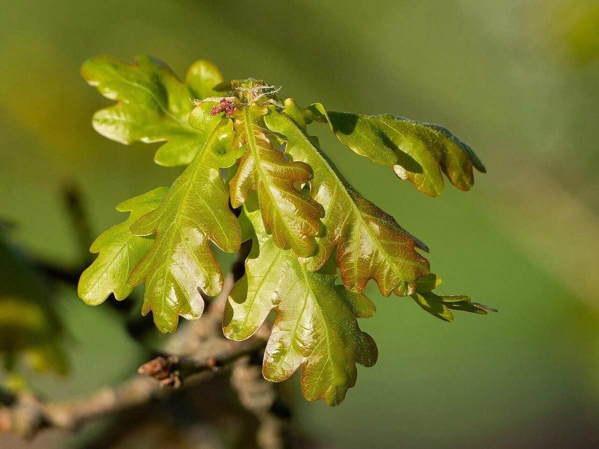

# English Oak

> **Node ID**: plants.timber.english-oak
> **Domain**: [Plants](./index.md)
> **Dependencies**: See prerequisites
> **Enables**: [`Construction`](../construction/index.md), [`Marine`](../marine/index.md), [`Metals`](../metals/index.md)
> **Timeline**: Years 10-120
> **Outputs**: durable timber, tannin bark, barrel staves, charcoal
> **Critical**: Yes — the foundational timber of Western civilization for shipbuilding, barrel-making, and structural beams

## Overview

> *Ternary diagram plotting the shape of live oak trees based upon crown spread, girth and height*

> *Image: Edfrank01, CC BY-SA 3.0*

English oak (*Quercus robur*) is the most important timber tree of European history. Its wood built the ships that explored and traded across every ocean, the barrels that stored wine, beer, and provisions on long voyages, the beams that held up cathedrals, and the tannin bark that turned animal hides into durable leather. No other single tree species has contributed as many essential materials to the development of Western technology.

Oak wood is strong, hard, and durable. The heartwood is rated Class 2 (durable), lasting 15-25 years in ground contact and indefinitely when kept dry. Density ranges from 560 to 700 kg/m³ at 12% moisture content. The characteristic medullary rays produce the distinctive "silver grain" pattern visible on quarter-sawn surfaces. These rays also make oak resistant to splitting along the plane of the rays, a property exploited in barrel-making and boat-building.

The bark contains 8-15% tannins by dry weight, making it the traditional source of tanning agents for leather production across Europe. Oak gallnuts (growth induced by wasp larvae on oak leaves) contain 50-70% tannic acid and were the premier source of ink and dye mordant for centuries.

Oak is a slow-growing, long-lived tree (500-1,000+ years), reaching 20-40 meters tall with a trunk diameter of 1-3 meters at maturity. Timber-quality trees require 80-150 years to produce clear, straight heartwood. Coppiced oak (cut to the stump and allowed to regrow) produces poles and bark on a 15-25 year cycle.

Primary outputs: `timber` for construction and shipbuilding, `tannin_bark` for leather tanning, `barrel_staves` for liquid storage, `charcoal` for smelting.

## Prerequisites

### Materials

- Acorns collected in autumn from selected mother trees
- Deep, fertile, well-drained soil with pH 5.5-7.5
- Space for long-rotation forestry (oak is not a quick crop)

### Equipment

- Felling axe, crosscut saw, or chainsaw
- Wedges and splitting maul for cleft oak production
- Drawknife, adze, and chisels for barrel-making and boat-building
- Bark peeling spud (for tannin bark harvest in spring)
- Cooper's tools: jointer plane, hoop driver, croze, and howell for barrel-making

### Knowledge

- Identification of oak by lobed leaves, acorns on long stalks (pedunculate), and rugged bark
- Understanding of medullary rays and their effect on splitting behavior
- Barrel-making (cooperage) technique: heating staves over a fire to bend them
- Oak tanning process: bark extraction and hide immersion
- Coppice management for sustained bark and pole production

### Infrastructure

- Oak woodland or plantation with long-term access (80-150 year rotation)
- Cooperage workshop for barrel production
- Tanning pits for leather processing
- Charcoal burning area for wood waste utilization

## Process Description

### Timber Production

1. Select mature trees (80-150 years) with straight, clear boles. Oak is typically crown-thinned at 20-30 year intervals throughout its life to encourage straight, knot-free growth.
2. Fell in winter when sap is down. Oak felled in summer is more prone to staining and insect attack.
3. Saw or cleave (split) logs into desired dimensions. Cleft oak (riven along the rays) is stronger than sawn oak because cleaving follows the natural grain, avoiding grain runout. For barrel staves and boat planking, cleft oak is strongly preferred.
4. Air dry in a covered stack. Oak seasons very slowly: 25 mm boards need 6-12 months; 50 mm beams need 1-2 years. Oversize timber for large beams (200 mm+) may require 3-5 years of air drying.
5. Target moisture content: 12-18% for construction, 10-14% for interior joinery and furniture.

### Barrel Making (Cooperage)

1. Select straight-grained oak, preferably cleft (riven) rather than sawn, from a tree 80-120 years old. The wood should have tight, even grain with no large knots.
2. Split the log into stave blanks, each approximately 700-900 mm long, 80-120 mm wide, and 25-35 mm thick. The grain must run the full length of the stave.
3. Shape each stave with a drawknife to a slightly tapered profile (wider at the middle, narrower at the ends) and beveled edges that will form tight joints when assembled.
4. Assemble the staves inside a metal hoop (truss hoop), starting with the widest stave and working around. The barrel shape begins to emerge as staves are added.
5. Place a fire inside the partially assembled barrel to heat and soften the wood. Tighten the hoops progressively as the staves become pliable.
6. Drive the hoops tight when the staves are still warm. Cut the croze (the groove that holds the barrel head) at each end.
7. Fit the barrel heads (flat discs of oak) into the croze. Drive the final hoops tight. Test the barrel by filling with water. A well-made oak barrel is watertight without any sealant.

### Tannin Bark Harvest

1. Harvest bark in spring (April-May) when the sap is rising and bark peels easily from the wood.
2. Fell the tree and immediately strip the bark using a barking spud (a flat, chisel-like tool). Starting at the base, work upward, prying the bark off in long strips.
3. Dry the bark strips in the sun for 2-4 weeks until brittle. Mill the dried bark to a coarse powder.
4. For tanning: pack the milled bark into pits and cover with water. Allow to steep for several days, creating tannin liquor. Immerse prepared hides in the liquor for 6-18 months, moving them periodically to ensure even tanning.

### Process Parameters

| Parameter | Range | Notes |
|-----------|-------|-------|
| Wood density (12% MC) | 560-700 kg/m³ | Heavy hardwood |
| Bending strength (MOR) | 85-110 MPa | Strong |
| Compression parallel to grain | 45-58 MPa | Good |
| Modulus of elasticity | 9,000-12,500 MPa | Stiff |
| Volumetric shrinkage | 10.0-13.5% | High — slow, careful drying required |
| Natural durability (heartwood) | Class 2 (durable) | 15-25 years ground contact |
| Tannin content in bark | 8-15% dry weight | Primary European tanning agent |
| Tannin content in gallnuts | 50-70% | Highest natural tannin source |
| Seasoning time (25 mm board) | 6-12 months | Air dried, covered |
| Seasoning time (100 mm beam) | 2-4 years | Air dried |
| Barrel maturation release | 0.5-2.0% volume/year | Oak compounds migrate into stored liquid |
| Rotation age (timber) | 80-150 years | Very long rotation |
| Coppice rotation (bark/poles) | 15-25 years | Much shorter cycle |
| Charcoal yield from oak wood | 25-35% by weight | Dense, slow-burning charcoal |
| Acorn yield per mature tree | 20-100 kg | Varies by year (mast years every 2-5 years) |

### Cooperage Details

The craft of cooperage (barrel-making) requires oak with specific grain characteristics. The best stave oak comes from trees grown at medium density on well-drained slopes, producing slow, even annual rings (2-3 mm width). Fast-grown oak with wide rings is coarse-textured and more porous. The grain must run straight and parallel to the stave length for the entire 700-900 mm stave length.

The toasting step (placing fire inside the assembled barrel) serves three purposes: it bends the staves into the final barrel shape, it caramelizes the oak sugars and breaks down lignin into flavor compounds (vanillin, lactones), and it creates a slightly charred interior surface that acts as a filter for stored liquids. Different toast levels (light, medium, heavy) produce different flavor profiles in wine and spirits.

White oak (*Quercus alba*) from North America produces the tightest barrels because tyloses (cellular outgrowths) block the vessels in the heartwood, preventing liquid penetration. European oak (*Q. robur*) lacks complete tyloses and may require an interior sealant (brewer's pitch) for some liquid storage applications. Without pitch lining, European oak barrels work well for wine and spirits but may slowly seep water.

### Oak Gallnuts and Iron Gall Ink

Oak gallnuts (caused by gall wasp larvae, primarily *Cynips gallae-tinctoriae*) contain 50-70% tannic acid — the highest natural concentration of any plant material. When mixed with iron sulfate, gallnut extract produces iron gall ink, the standard writing ink of Europe from the 5th century through the 19th century. Iron gall ink is permanent, waterproof, and chemically bonded to the paper or parchment surface. The Declaration of Independence and the US Constitution were written in iron gall ink.

To make iron gall ink: crush 20 g of dried gallnuts, soak in 100 ml of water for 24 hours, strain. Add 5 g of iron sulfate (green vitriol) and 5 g of gum arabic. The mixture turns black as the iron-tannate complex forms. Dilute with water to writing consistency. The ink darkens further as it oxidizes on the page over several days.

## Safety Considerations

- Oak sawdust is a respiratory irritant and suspected carcinogen. Wear an N95 respirator or better during all machining operations.
- Tannin solutions are astringent and can cause skin irritation with prolonged contact. Wear gloves when handling tanning liquor and wet bark.
- The cooper's fire (used to heat staves for bending) is an open flame hazard. Keep fire extinguishing equipment nearby and ensure ventilation for smoke.
- Splitting oak with wedges and maul produces flying fragments. Wear eye protection. Never use a steel wedge with a steel maul (spark risk in dry conditions).
- Tanning pits are a drowning hazard, especially for children and animals. Fence and cover pits when not in active use.
- Old oak trees frequently have decay pockets and suspended dead branches (widow-makers). Inspect the canopy before felling and never work under a damaged tree.

### Personal Protective Equipment

- N95 respirator for sanding, sawing, and machining operations
- Leather gloves for bark stripping, splitting, and cooper work
- Safety glasses for splitting, sawing, and any operation with flying debris
- Waterproof gloves for tanning pit work
- Hard hat for woodland operations and felling

## Quality Control

### Acceptance Criteria

- **Structural timber**: Heartwood, no shake, knot size under 50 mm in 2-meter length, grain slope less than 1:10
- **Barrel staves**: Straight grain running full length, no sapwood, no knots, ring-porous structure with tight annual rings (slow-grown oak preferred)
- **Tannin bark**: Clean inner bark surface, no rot, no wood adhering to the bark. Color: buff to light brown
- **Charcoal**: Hard, dense, rings, clean break, no uncarbonized wood visible

### Testing Methods

- Heartwood check: color is light brown to golden brown. Sapwood is pale cream and must be excluded for durability.
- Stave grain test: tap the stave with a knuckle. Clear ring = straight grain. Dull thud = cross-grain defect.
- Barrel water test: fill completed barrel with water. No leaks within 30 minutes. Minor seepage that stops as the wood swells is acceptable.
- Tannin strength test: add iron sulfate solution to tannin liquor. A dark blue-black color indicates strong tannin concentration.

## Scaling Notes

- **Individual tree**: 1-5 cubic meters of sawn timber, 100-300 kg of bark, 200-400 staves from a well-formed tree.
- **Coppice woodland** (5 hectares): 500-1,000 coppice stools on a 20-year rotation yield 25-50 stools per year, producing 2-5 tonnes of bark and 50-100 cubic meters of pole wood annually.
- **Cooperage**: A skilled cooper produces 3-6 barrels per day by hand. Industrial cooperages with mechanized stave preparation produce 100+ barrels per day.
- **Tannery**: A small tannery processing 100 hides per year requires approximately 10-20 tonnes of oak bark per year.
- **Critical bottleneck**: The 80-150 year rotation for timber-quality oak means it cannot be rush-produced. Planting oak is an investment for grandchildren. Coppice bark and pole production on 15-25 year cycles provide intermediate returns.

## Troubleshooting

| Problem | Probable Cause | Solution |
|---------|---------------|----------|
| Timber checks during drying | Too-rapid drying, especially of thick sections | Seal end grain with wax; reduce drying rate; use slower sticker spacing |
| Barrel leaks at stave joints | Staves not properly shaped or fire-bent | Reheat and tighten hoops; if persistent, replace faulty staves |
| Tanning liquor weak | Insufficient bark, or bark too old | Add fresh bark; increase steep time; test with iron sulfate |
| Hides not fully tanned | Insufficient immersion time, or tannin too weak | Extend tanning time (some heavy hides need 18+ months); refresh tannin liquor |
| Oak sapwood attacked by powderpost beetles | Sapwood left on timber | Remove all sapwood during processing; heartwood is naturally resistant |
| Gallnut yield low | Insufficient gall wasp activity | Cannot be easily controlled; gallnut production is opportunistic |

## Variations and Alternatives

- **Sessile oak** (*Quercus petraea*): Similar timber properties, found on drier, upland sites. Acorns have no stalk (sessile). Often treated interchangeably with *Q. robur* for timber.
- **White oak** (*Quercus alba*): North American species with superior barrel-making properties. Tyloses block the vessels, making white oak truly waterproof. European oak is less reliable for tight barrels.
- **Chestnut** (*Castanea sativa*): Similar tannin content in wood, used for tanning where oak bark is scarce. Chestnut wood tannin is extracted from wood chips, not bark.
- **Quebracho** (*Schinopsis lorentzii*): South American hardwood with 20-30% tannin content, far exceeding oak bark. Imported for industrial tanning where available.
- **Acacia** (*Acacia mearnsii*): Black wattle bark contains 30-40% tannin, much higher than oak. Used for tanning in Australia and South Africa.

### Acorn as Food Source

Oak acorns are edible after processing to remove bitter tannins. The processing involves shelling, grinding, and leaching the acorn meal in water (changing the water repeatedly over 1-3 days) until the bitterness is removed. The resulting acorn flour is nutritious (high in fat, protein, and complex carbohydrates) and can be used for bread, porridge, and cakes. Sweet acorns from white oaks (*Quercus alba* group) require less leaching than bitter acorns from red oaks (*Q. robur* group). Acorn flour was a staple food for many indigenous peoples and provides a reliable food source from long-lived oak trees that produce massive crops in mast years.

## References

- [Construction](../construction/index.md) — structural timber applications
- [Marine](../marine/index.md) — shipbuilding and barrel-making for provisions
- [Metals](../metals/index.md) — oak charcoal for smelting
- [Scots Pine](./pinus-sylvestris.md) — comparison timber species
- [Black Wattle](./acacia-mearnsii.md) — alternative tannin source
- [Plants Domain](./index.md) — domain overview and related capabilities

### Oak in Shipbuilding

English oak was the primary shipbuilding timber of the Royal Navy for over 400 years. The
heartwood's natural durability in contact with water (Class 2) and its resistance to marine
borers made it the preferred material for hull planking, frames, and keels. A single
ship-of-the-line required 3,000-5,000 mature oak trees — approximately 60 hectares of
managed oak woodland per ship.

The technique of green oak construction (using freshly felled, unseasoned oak) was essential
to shipbuilding. Green oak is easier to work than seasoned oak, and the joints tighten as the
wood shrinks during seasoning in place. The hull was designed so that the natural shrinkage
of the oak planking would compress the caulking (hemp fiber and tar driven into the seams)
tighter, making the ship more watertight as it aged.

Oaks produce a full acorn crop (mast year) every 2-5 years, with light crops in between.
In mast years, a single mature oak can produce 20,000-50,000 acorns. This irregular but
abundant seed production supports wildlife populations and provides opportunities for
large-scale seed collection and planting in favorable years.

---
*Part of the [Bootciv Tech Tree](../index.md) · [Plants](./index.md) · [All Domains](../index.md)*
