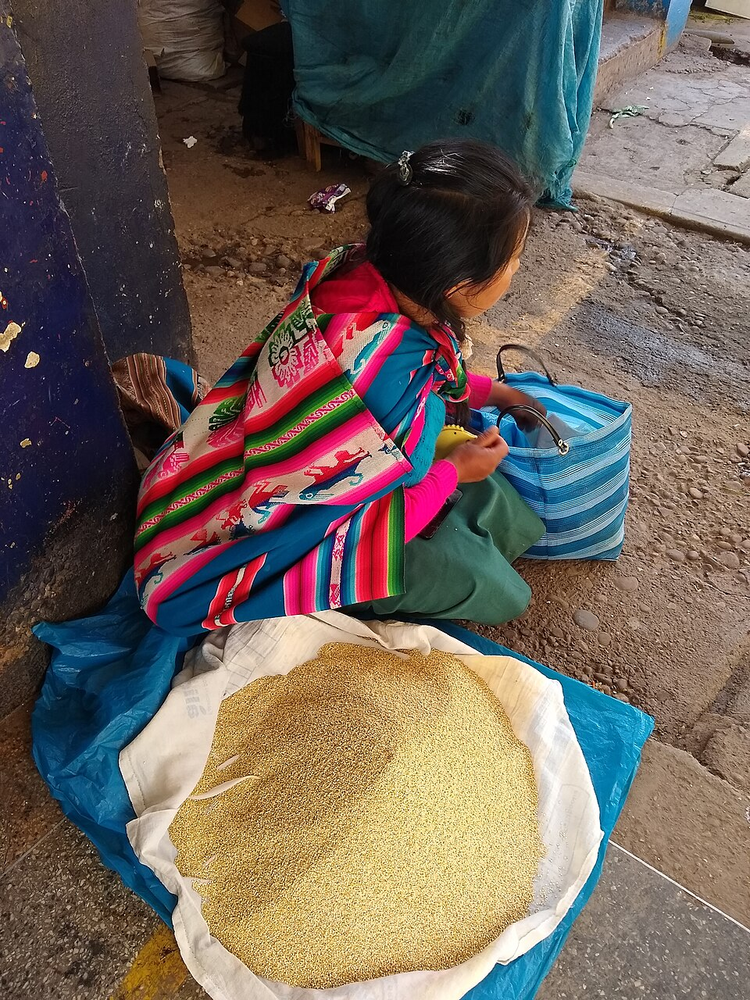

# Quinoa

> **Node ID**: plants.edible-plants.quinoa
> **Domain**: [Plants](./index.md)
> **Dependencies**: See prerequisites
> **Enables**: [`Edible Plants`](edible-plants.md)
> **Timeline**: Years 0-5
> **Outputs**: edible_plant_material
> **Critical**: No

## Overview

> *Quinoa (Chenopodium quinoa)*

> *Image: Philipp, CC0*

Quinoa

*Chenopodium quinoa* (Amaranthaceae) is a staple food crop species of major importance for civilization bootstrapping. Quinoa provides leaves, seeds/nuts as its primary edible product and ranks 77/100 on the nutrition score.

Fast-growing annual reaching 1.5 m tall by 0.3 m wide with wind-pollinated hermaphroditic flowers from July to August and seeds maturing August to September. Hardy to UK zone 10, frost-tender. Tolerates light sandy, medium loamy, and heavy clay soils, thriving in well-drained and nutritionally poor conditions across mildly acid to very alkaline pH ranges. Requires full sun, tolerates drought and strong winds but not maritime exposure.

Edible parts: Leaves, Seeds, Vegetable The seed has a pleasant, mild flavour and readily absorbs the flavours of other ingredients, making it versatile across a wide range of dishes. It can be used in all the ways rice is used, both in savoury and sweet preparations, or ground into a powder and cooked as a porridge. The seed can also be sprouted and added to salads, though many people find the sprouted form unpleasant. Before use, the seed must be thoroughly soaked and rinsed to remove the saponin coating on the seed surface. Nutritionally, quinoa seed is outstanding: it contains approximately 38% carbohydrate, 19% protein, 5% fat, and 5% sugar. The protein is rich in the amino acids lysine, methionine, and cystine, giving it a biological value comparable to milk — with 2–6% more protein and a better amino acid balance than wheat. Young leaves can be eaten raw or cooked like spinach, though large quantities of raw leaves should be avoided due to toxicity concerns.

A life cycle varies between 120-240 days. Plants are harvested when mature then allowed to lie for 30-45 days before threshing. Yields of 400-1 200 kg per hectare occur.

For civilization bootstrapping, quinoa is significant because of its role as a staple crop. Reliable food production is the foundation upon which all other technological development rests. Understanding the cultivation, processing, and storage of *Chenopodium quinoa* enables communities to establish food security and allocate labor to non-subsistence activities.

*Chenopodium quinoa* is a member of the Amaranthaceae family. As a staple food crop, it provides essential calories, protein, or other nutrients needed to sustain human populations during the bootstrap process. The ability to produce food reliably from cultivated plants is what separates sedentary civilizations from hunter-gatherer societies, because food surplus allows specialization of labor into toolmaking, construction, and eventually metallurgy and beyond.

This species grows as a perennial or annual depending on climate and management. Propagation is primarily by Sow seed in April directly in situ, either broadcast or in rows approximately 25 cm apart, thinning plants to around 10 cm spacing. Germination is rapid, even in fairly dry conditions. Take care not to weed out seedlings, as they closely resemble some common garden weeds.. Harvest timing depends on the plant part used: leaves, seeds/nuts are typically ready at specific growth stages or seasons.

## Prerequisites

### Materials

- Propagation material: Sow seed in April directly in situ, either broadcast or in rows approximately 25 cm apart, thinning plants to around 10 cm spacing. Germination is rapid, even in fairly dry conditions. Take care not to weed out seedlings, as they closely resemble some common garden weeds.
- Compost or organic matter for soil amendment
- Mulch material for moisture retention and weed suppression

### Equipment

- Hoe or digging stick for soil preparation and planting
- Sickle, machete, or harvesting knife for crop harvest
- Drying racks or flat drying surfaces for post-harvest processing
- Storage containers: woven baskets, ceramic jars, or sacks for dried product
- Winnowing baskets or screens if processing grains or seeds

### Knowledge

- Species identification: A small herb. It grows 20 cm to 3 m high. The taproot is branched. The leaves vary in shape. They are toothed and somewhat grey-green. The flowers are grouped in clusters on the stalk. The flowers are small and without stalks. They are in dense clusters at the top of the plant. The seeds are 1-2.6 m
- Understanding of planting timing relative to local frost dates and rainy seasons
- Knowledge of soil preparation, seed depth, and spacing requirements
- Recognition of common pests and diseases and their early indicators
- Safe preparation methods for any toxic or bitter compounds (see Safety)

### Infrastructure

- Field or garden site with suitable climate, soil type, and sun exposure
- Reliable water access for germination and establishment phase
- Fenced or protected area if animal browsing is a risk
- Storage structure protected from moisture, rodents, and insects

## Process Description

### Cultivation and Propagation

a cultivated food crop. A plant of higher elevations in the tropics, it has also been successfully grown in the temperate and subtropical zones. Plants tolerate light frosts at any stage in their development except when flowering. An easily grown plant, it requires a rich moist well-drained soil and a warm position if it is to do really well, but it also succeeds in less than optimum conditions. Tolerates a pH range from 6 to 8.5 and moderate soil salinity. Plants are quite wind resistant. Plants are drought tolerant once they are established. The plant is day-length sensitive and many varieties fail to flower properly away from equatorial regions, however those varieties coming from the south of its range in Chile are more likely to do well in Britain. Different cultivars take from 90 - 220 days from seed sowing to harvest. Yields as high as 5 tonnes per hectare have been recorded in the Andes, which compares favourably with wheat in that area. Young plants look remarkably like the common garden weed fat hen (Chenopodium album). Be careful not to weed the seedlings out in error. The seed is not attacked by birds because it has a coating of bitter tasting saponins. These saponins are very easily removed by soaking the seed overnight and then thoroughly rinsing it until there is no sign of any soapiness in the water. The seed itself is very easy to harvest by hand on a small scale and is usually ripe in August. Cut down the plants when the first ripe seeds are falling easily from the flower head, lay out the stems on a sheet in a warm dry position for a few days and then simply beat the stems against a wall or some other surface, the seed will fall out easily if it is fully ripe and then merely requires winnowing to get rid of the chaff. Propagation: Sow seed in April directly in situ, either broadcast or in rows approximately 25 cm apart, thinning plants to around 10 cm spacing. Germination is rapid, even in fairly dry conditions. Take care not to weed out seedlings, as they closely resemble some common garden weeds.

### Distribution and Growing Conditions

### Identification

A small herb. It grows 20 cm to 3 m high. The taproot is branched. The leaves vary in shape. They are toothed and somewhat grey-green. The flowers are grouped in clusters on the stalk. The flowers are small and without stalks. They are in dense clusters at the top of the plant. The seeds are 1-2.6 mm across. They can be white, yellow, red, purple, brown or black. Plants vary a lot in colour, flowering and other ways.

### Saponin Removal (Critical Step)

Quinoa seeds have a natural coating of saponins — bitter, soapy-tasting compounds that deter birds and insects. Saponins must be removed before consumption; they cause a harsh, bitter taste and can cause mild gastrointestinal irritation in sensitive individuals. Three methods, in order of thoroughness:

**Method 1 — Washing/Soaking (for home-scale processing)**:
1. Place quinoa in a fine-mesh strainer or bowl. Rinse under cold running water while rubbing the seeds vigorously between your palms or against the mesh. The soapy foam produced is the saponins dissolving.
2. Soak the rinsed seeds in cold water for 30-60 minutes. Rub seeds again and drain.
3. Repeat the wash-rinse cycle 2-3 times until the water runs clear and no foam forms when agitated. This indicates saponins have been adequately removed.
4. Taste a few raw seeds — if still bitter, repeat the washing process.
5. This method removes most saponins from low-saponin ("sweet") varieties. High-saponin ("bitter") varieties may require more aggressive treatment.

**Method 2 — Abrasive Dehulling (for production-scale processing)**:
1. Pass dry quinoa seeds through a stone mill or abrasive polisher with the grinding plates set wider than normal — close enough to abrade the outer saponin layer but not crush the seed.
2. Winnow or sieve the abraded material to remove the powdery saponin residue.
3. Follow with a water rinse (Method 1) for complete removal.
4. This is the industrial method: mechanical abrasion removes 80-90% of saponins, followed by water washing for the remainder.
5. Traditional Andean method: rub seeds against a stone surface (similar to a metate) with the flat of the hand or a stone, then winnow the residue.

**Method 3 — Alkaline Wash (for bitter/high-saponin varieties)**:
1. Prepare a dilute alkaline solution: dissolve wood ash (potash, primarily potassium carbonate) in water at roughly 1 tablespoon ash per liter. Allow to settle and decant the clear liquid.
2. Soak quinoa in the alkaline solution for 10-15 minutes. The alkali hydrolyzes saponins, breaking them down into soluble compounds.
3. Drain and rinse thoroughly with clean water 3-4 times to remove all alkaline residue.
4. This method is particularly effective for bitter varieties with saponin content above 1% (by dry weight).

### Cooking

Quinoa cooks similarly to rice and can substitute for rice, couscous, or bulgur in most dishes:

1. Rinse quinoa (even pre-washed commercial quinoa benefits from a quick rinse).
2. Combine quinoa and water at a 1:2 ratio (1 cup quinoa to 2 cups water) in a pot. Add salt to taste.
3. Bring to a rolling boil, then reduce heat to low and cover tightly.
4. Simmer for 12-15 minutes until water is absorbed and the germ ring (a tiny white spiral) is visible on each seed, indicating the grain has "popped."
5. Remove from heat, keep covered, and let stand for 5 minutes. Fluff with a fork before serving.
6. Cooked quinoa yields approximately 3 cups per cup of dry grain. Nutritional profile per 100g cooked: 120 kcal, 4.4g protein, 2.8g fiber.

### Sprouting

Sprouting quinoa enhances nutrient bioavailability, reduces phytic acid, and increases vitamin content:

1. Rinse quinoa and soak in water for 4-6 hours (not longer — quinoa sprouts quickly and extended soaking can cause fermentation).
2. Drain completely. Place in a jar covered with cheesecloth or a fine mesh screen, or spread on a damp cloth.
3. Rinse and drain twice daily (morning and evening). Keep at room temperature (18-22°C) away from direct sunlight.
4. Sprouts emerge within 12-24 hours and reach 2-5 mm in 2-3 days — the optimal harvest window.
5. Use sprouted quinoa in salads, as a topping, or lightly steamed. Do not cook for extended periods as this destroys the nutritional benefits of sprouting.
6. Refrigerate sprouts and use within 2-3 days. Sprouting does not remove all saponins — wash seeds before sprouting.

### Edible Parts and Preparation

Seeds are the primary edible product, requiring saponin removal before cooking. Young leaves can be eaten raw in small quantities or cooked like spinach, but should not be consumed in large amounts raw due to oxalate content. The seed's outstanding nutritional profile — 12-16% protein with a complete amino acid profile including lysine (rare in grains) — makes quinoa one of the most nutritionally valuable plant foods available.

## Quantitative Parameters

### Nutritional Composition (per 100g)

| Part | Moisture | kJ | kcal | Protein | Vit A | Vit C | Iron | Zinc |
| --- | --- | --- | --- | --- | --- | --- | --- | --- |
| Seeds | 12 | 1449 | 347 | 12 | — | — | 7 | — |
| Leaves | 85 | 202 | 48 | 5 | 1800 | 100 | 4 | — |

### Growing Parameters

| Parameter | Value | Notes |
|-----------|-------|-------|
| Growing period | 120–240 days | Maturity range |
| Annual rainfall | 250 mm | Growing requirement |
| Germination temperature | 5°C | Optimal |
| Hardiness zones | 8-11 | USDA |
| Edible parts | Leaves, Seeds/Nuts | Primary harvest |

## Processing and Storage

### Non-Food Uses

Gold and green dyes can be obtained from the whole plant. The saponins rinsed from the seed during preparation can be saved and diluted with water to create a spray that deters birds and insects from growing plants. The spray remains effective for a few weeks or until washed off by rain.

### Storage

Dry seeds thoroughly to below 14% moisture content before storage. Spread in thin layers on drying racks in full sun, stirring periodically. Test dryness by biting: properly dried seeds crack rather than dent. Store in airtight containers (ceramic jars with tight lids, sealed woven bags) in a cool, dry, dark location. Protect from rodents and insects with tight lids or by mixing with inert ash. Under good conditions, dried grains and legumes store for 1-5 years with minimal loss.

### Material Handling

Handle quinoa produce with clean hands and tools to prevent contamination. Remove field heat promptly after harvest by moving product to shade. Process within the recommended timeframe to prevent quality loss. Compost crop residues and processing waste to return organic matter to the soil. Label stored products with harvest date, variety, and any treatments applied.

## Scaling Notes

- **Bench scale**: Individual plants or small garden plot (10-50 plants). Output for direct household consumption. Useful for seed saving, variety selection, and learning the crop's behavior under local conditions.
- **Pilot scale**: Field planting of 0.1 to 1 hectare (500-5,000 plants). Staggered planting or sequential harvests to extend availability. Requires basic hand tools and family-level labor. Surplus can be traded or stored.
- **Production scale**: Multi-hectare cultivation with mechanized planting, harvesting, and processing. Requires plow animals or tractors, grain mills or processing equipment, and bulk storage facilities. Enables community-level food security and trade.
  Reported production data: A life cycle varies between 120-240 days. Plants are harvested when mature then allowed to lie for 30-45 days before threshing. Yields of 400-1 200 kg per hectare occur.

Key scaling challenges include maintaining genetic diversity at plantation scale, managing pest and disease pressure in monoculture, and matching post-harvest processing capacity to harvest volume. Seed saving and variety selection at bench scale directly informs decisions about which cultivars to scale up.

## Troubleshooting

| Problem | Probable Cause | Solution |
|---------|---------------|----------|
| Poor germination | Old seed, wrong soil temperature, planted too deep, or insufficient moisture | Use fresh seed; verify germination temperature range; plant at recommended depth; maintain soil moisture during germination |
| Pest damage | Insect infestation or browsing animals | Hand-pick pests; use companion planting with repellent species; install fencing for larger pests |
| Disease (fungal/bacterial) | Poor air circulation, excessive moisture, infected seed | Space plants adequately; avoid overhead watering; use clean seed from disease-free plants; practice crop rotation |
| Low yield | Nutrient deficiency, water stress, overcrowding, or shade | Amend soil with compost or manure; ensure adequate water at critical growth stages; thin to recommended spacing; plant in full sun |
| Storage losses | Insufficient drying, rodent/insect damage, high humidity | Dry product thoroughly before storage; use sealed containers; inspect stored product regularly; keep storage area clean and dry |
| Quality or safety note | See species-specific notes | There are about 100-150-250 Chenopodium species. They are mostly in temperate regions. It suits the high altitude tropics. The protein is good quality |

## Safety Considerations

Working with *Chenopodium quinoa* involves the following hazards:

- **⚠ Saponin toxicity (IMPORTANT)**: Quinoa seeds are coated with saponins — bitter, soapy compounds that cause gastrointestinal distress (nausea, vomiting, diarrhea) if consumed without removal. **All quinoa must be washed, soaked, or abraded before cooking.** Rinse seeds under running water while rubbing vigorously between hands until no foam forms — typically 2-3 wash cycles. For high-saponin (bitter) varieties, use abrasive dehulling or alkaline wash (see Saponin Removal section). Unwashed quinoa tastes extremely bitter and soapy. Saponins also occur in raw leaves — boil leaves before eating and do not consume large quantities raw. The saponin-rich rinse water can be saved and diluted as an insecticidal spray for crops (non-toxic to plants at 1:10 dilution).
- Tool injuries during harvest and processing — use sharp tools in good condition and cut away from the body
- Allergic reactions to plant compounds — sensitive individuals should test small quantities first
- Sun exposure and heat stress during field work — schedule heavy work for early morning or late afternoon
- Musculoskeletal strain from repetitive harvesting motions — vary tasks and take regular breaks

### Personal Protective Equipment

- Sturdy gloves when handling plants with irritant sap, spines, or rough surfaces
- Long sleeves and trousers for field work to reduce skin exposure to irritants and insects
- Eye protection when using cutting tools overhead or near face level
- Sun hat and sunscreen for extended field work

### Emergency Procedures

- For suspected plant poisoning: stop eating immediately, save a sample of the plant material, and seek medical attention. Do not induce vomiting unless directed by a medical professional.
- For tool lacerations: apply direct pressure with a clean cloth, elevate the wound, and seek medical attention for cuts deeper than skin level.
- For allergic reaction (swelling, difficulty breathing): discontinue exposure immediately and seek emergency medical help.

## Quality Control

### Acceptance Criteria

- Harvest product shows expected color, texture, size, and flavor for the variety grown
- No visible mold, rot, pest damage, or foreign material in stored product
- Dried products are brittle throughout with no flexible or moist spots
- Seeds intended for storage test at below 14% moisture content

### Testing Methods

- **Visual inspection**: check for discoloration, mold, insect damage, or foreign material
- **Bite test (seeds/grains)**: properly dried seeds crack cleanly; under-dried seeds dent or feel leathery
- **Smell test**: fresh product has characteristic aroma; off-odors indicate spoilage or contamination
- **Snap test (dried products)**: properly dried material snaps rather than bends

### Sampling Protocol

For field-scale production, inspect every 10th plant during harvest for disease and pest damage. Grade each batch by size and quality before storage. Record yield per unit area to track productivity trends across seasons and identify declining performance early.

## Variations and Alternatives

### Medicinal Uses

None known.

### Other Uses

### Additional Information

It is a cultivated food crop. It is a commercially cultivated vegetable.

### Notes

There are about 100-150-250 Chenopodium species. They are mostly in temperate regions. It suits the high altitude tropics. The protein is good quality because of its amino acid balance. It has 2-6% more protein and better amino acid balance than wheat. The saponins in the skin protect it from insects. Also put in the family Chenopodiaceae.

### Related Species

- [Wheat](wheat.md)
- [Rice](rice.md)
- [Maize](maize.md)
- [Potato](potato.md)
- [Cassava](cassava.md)

### Cultivar Selection

Within *Chenopodium quinoa*, considerable variation exists in yield, disease resistance, climate adaptation, and quality characteristics. When establishing a quinoa crop, select varieties adapted to local conditions: day length, temperature range, rainfall pattern, and soil type. Landrace varieties — locally adapted populations maintained by traditional farmers — often outperform modern cultivars under low-input conditions because they have been selected for resilience rather than maximum yield under optimal conditions.

Seed saving from the best-performing plants each generation gradually adapts the variety to local conditions. Select for vigor, disease resistance, appropriate maturity timing, and product quality. Maintain genetic diversity by saving seed from multiple plants rather than a single individual, which preserves the population's ability to adapt to changing conditions and disease pressures.

### Crop Rotation and Companion Planting

*Chenopodium quinoa* benefits from crop rotation to prevent buildup of species-specific pests and diseases. Avoid planting in the same field in consecutive seasons where possible. Follow with a different crop family to break pest cycles and maintain soil health.

Companion planting with aromatic herbs or flowering plants can deter pests and attract beneficial insects. Avoid planting near species that compete for the same nutrients or harbor shared pathogens.

## References

- [Edible Plants](edible-plants.md) — parent capability
- [Plants Domain](./index.md) — domain overview and related capabilities
- [Agave](agave.md) — example plant article format
- [Food Processing](../food-processing/index.md) — downstream processing of harvested crops
- [Agriculture](../agriculture/index.md) — cultivation systems and crop rotation
- Family: Amaranthaceae
- Distribution: Andorra, United Arab Emirates, Afghanistan, Antigua &amp; Barbuda, Albania, Armenia, Argentina, Austria, Australia, Azerbaijan, Bosnia &amp; Herzegovina, Barbados, Bangladesh, Belgium, Bulgaria, Bahrain, Brunei, Bolivia, Brazil, Bahamas and 109 more
- Data sourced from Food Plants International, Wikipedia, and iNaturalist via the Edible Plant Database (ZIM)
- Plants for a Future (pfaf.org) — supplementary cultivation and use data

---
*Part of the [Bootciv Tech Tree](../index.md) · [Plants](./index.md) · [All Domains](../index.md)*
