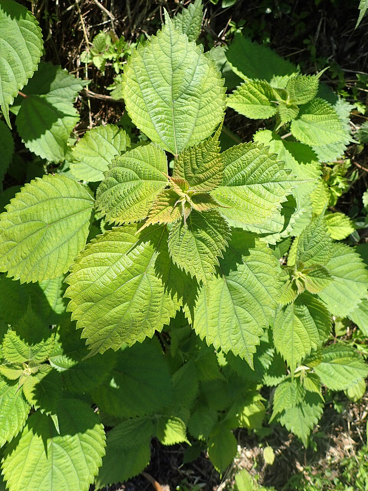
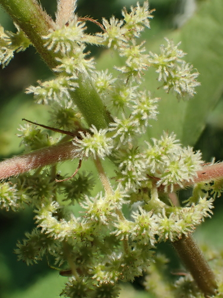

# Ramie

> **Node ID**: plants.edible-plants.ramie
> **Domain**: [Plants](./index.md)
> **Dependencies**: See prerequisites
> **Enables**: [`Edible Plants`](edible-plants.md)
> **Timeline**: Years 0-5
> **Outputs**: edible_plant_material
> **Critical**: No

## Overview

> *Boehmeria nivea in Batumi, Georgia (Caucasus)*

> *Image: Krzysztof Ziarnek, Kenraiz, CC BY-SA 4.0*

Ramie

*Boehmeria nivea* (Urticaceae) is a fiber & industrial crop species of major importance for civilization bootstrapping. Ramie provides leaves, roots, seeds/nuts as its primary edible product.

Boehmeria nivea, commonly known as ramie, Chinese grass or Chinese silk plant, is a monoecious shrub or subshrub in the family Urticaceae commonly found in China. It is native to warm temperate and tropical regions of the eastern Himalaya, and east and southeastern Asia. It grows to 2 metres tall, with alternately-arranged leaves 7–15 cm long and 6–12 cm broad, oval-acuminate with a serrated margin. Boehmeria nivea has been cultivated in China and elsewhere in southeast Asia for thousands of years, as the source of the fibre crop ramie. It has been introduced into tropical and subtropical parts of other continents, such the southeastern United States.

Edible parts: Root, Leaves, Seeds - oil, Flowers, Stem Edible Parts: Leaves Root Edible Uses: Edible portion: Root, Leaves, Seeds – oil. Root - peeled and boiled. A pleasant, sweet taste. We can detect very little flavour, but the root has a very strange mucilaginous texture that does not appeal to most people who have tried it. Once in the mouth, it takes a lot of chewing before it is ready to be swallowed. The leaves are used for making cakes. This report could refer to the plants use as a poultice. They are also used as a dye to make black rice cake.

For civilization bootstrapping, ramie is significant because of its role as a fiber & industrial crop. Reliable food production is the foundation upon which all other technological development rests. Understanding the cultivation, processing, and storage of *Boehmeria nivea* enables communities to establish food security and allocate labor to non-subsistence activities.

*Boehmeria nivea* is a member of the Urticaceae family. As a fiber & industrial crop, it provides essential calories, protein, or other nutrients needed to sustain human populations during the bootstrap process. The ability to produce food reliably from cultivated plants is what separates sedentary civilizations from hunter-gatherer societies, because food surplus allows specialization of labor into toolmaking, construction, and eventually metallurgy and beyond.

This species grows as a perennial or annual depending on climate and management. Propagation is primarily by Seed - sow in pots and only just cover the seed. When they are large enough to handle, prick the seedlings out into individual pots and plant them out when at least 20cm tall. Division. Very easy, larger divisions can be planted straight into their permanent positions whilst smaller clumps are best planted in a nursery until they are growing away well. Layering. Basal cuttings. Harvest new shoots when they are about 10 - 15cm long with plenty of underground stem. Pot them up into individual pots and keep them in light shade until they are rooting well.. Harvest timing depends on the plant part used: leaves, roots, seeds/nuts, flowers, shoots are typically ready at specific growth stages or seasons.

## Prerequisites

### Materials

- Propagation material: Seed - sow in pots and only just cover the seed. When they are large enough to handle, prick the seedlings out into individual pots and plant them out when at least 20cm tall. Division. Very easy, larger divisions can be planted straight into their permanent positions whilst smaller clumps are best planted in a nursery until they are growing away well. Layering. Basal cuttings. Harvest new shoots when they are about 10 - 15cm long with plenty of underground stem. Pot them up into individual pots and keep them in light shade until they are rooting well.
- Compost or organic matter for soil amendment
- Mulch material for moisture retention and weed suppression

### Equipment

- Hoe or digging stick for soil preparation and planting
- Sickle, machete, or harvesting knife for crop harvest
- Drying racks or flat drying surfaces for post-harvest processing
- Storage containers: woven baskets, ceramic jars, or sacks for dried product
- Winnowing baskets or screens if processing grains or seeds

### Knowledge

- Species identification: An erect shrub which grows from year to year. It is 1-3 m tall. The underground roots are thick storage roots. The leaves occur one after another along opposite sides of the stem. The leaves have long leaf stalks and are oval but broad. They have teeth along the edge. They are 7.5-15 cm long by 5-10
- Understanding of planting timing relative to local frost dates and rainy seasons
- Knowledge of soil preparation, seed depth, and spacing requirements
- Recognition of common pests and diseases and their early indicators
- Safe preparation methods for any toxic or bitter compounds (see Safety)

### Infrastructure

- Field or garden site with suitable climate, soil type, and sun exposure
- Reliable water access for germination and establishment phase
- Fenced or protected area if animal browsing is a risk
- Storage structure protected from moisture, rodents, and insects

## Process Description

### Cultivation and Propagation

It can be grown from seed. It is more commonly grown from cuttings of the rhizome. Sections 15-25 cm long are planted at a depth of 5-8 cm. Suckers and stem cuttings can also be used. Propagation: Seed - sow in pots and only just cover the seed. When they are large enough to handle, prick the seedlings out into individual pots and plant them out when at least 20cm tall. Division. Very easy, larger divisions can be planted straight into their permanent positions whilst smaller clumps are best planted in a nursery until they are growing away well. Layering. Basal cuttings. Harvest new shoots when they are about 10 - 15cm long with plenty of underground stem. Pot them up into individual pots and keep them in light shade until they are rooting well.

### Distribution and Growing Conditions

### Identification

An erect shrub which grows from year to year. It is 1-3 m tall. The underground roots are thick storage roots. The leaves occur one after another along opposite sides of the stem. The leaves have long leaf stalks and are oval but broad. They have teeth along the edge. They are 7.5-15 cm long by 5-10 cm wide. The leaves are white underneath. The more tropical form does not have hairs under the leaf. The flowers are small. They occur in the axils of leaves. The flowers have separate sexes. The male flowers are lower down and the female flowers higher up. The fruit is a small dry one seeded fruit. It is brownish-yellow and about 1 mm long. Flowers are wind pollinated.

### Edible Parts and Preparation

Root — peeled and boiled; pleasant, sweet taste but very mucilaginous texture requiring extensive chewing. Leaves are used for making cakes and as a dye for black rice cake. Flowers are used in some traditional preparations. The edible uses are secondary to ramie's value as a fiber crop.

### Harvesting for Fiber

Ramie is a perennial shrub harvested repeatedly from established stands, productive for 6-8 years:

1. **Timing**: Cut stems 2-3 times per year on a 60-90 day growth cycle. The first harvest of the season produces the best fiber quality. Stems are ready when they reach 1-1.5 m tall and the lower leaves begin to yellow — fiber strength peaks and pectin content is optimal for degumming.
2. **Method**: Cut stems at ground level with a sickle or machete. Handle carefully — fresh stems should be processed within hours for best decortication results. Stems left overnight begin to dry, making bark removal significantly harder.
3. **Yield**: 800-1,200 kg/ha dry degummed fiber per year across multiple harvests. A single hectare of mature ramie produces more usable fiber than equivalent area of cotton, making it one of the most productive fiber crops per unit area.
4. **Stand management**: After 6-8 years, yields decline and stands should be replanted from rhizome divisions. Divide established clumps in early spring for new plantings.

### Decortication (Green Bark Removal)

Unlike other bast fibers (flax, hemp, jute) which require retting, ramie is decorticated from fresh (green) stems:

1. Cut stems at ground level and transport immediately to the processing area.
2. Remove leaves by hand or by pulling stems through a narrow gap between two vertical stakes.
3. **Scrape fresh stems** with a blunt knife or specialized decortication blade to remove the outer bark and separate the fibrous inner bark (bast) from the woody core. The scraping motion runs from stem base to tip, peeling away long strips of bark.
4. The raw fiber strips (ribbons) are creamy-white to pale green, 1-2 m long, and contain 20-30% gum (pectin, hemicellulose, and other non-cellulosic material) that must be removed before spinning.
5. Fresh decortication is critical — dried stems resist bark removal. If immediate processing is impossible, keep stems moist by covering with damp cloth for up to 12 hours.

### Chemical Degumming (NaOH Method)

Raw ramie fiber contains 20-30% gum that makes it stiff, coarse, and unspinnable. Chemical degumming is the standard industrial process and produces the highest quality fiber:

1. **Prepare alkali solution**: Dissolve sodium hydroxide (NaOH) in water at a concentration of 1-4% by weight (10-40 g NaOH per liter of water). Higher concentrations degum faster but may damage cellulose fibers if overdone. Start with 2% for a balance of speed and safety.
2. **Boil raw fiber**: Submerge raw decorticated ribbons completely in the NaOH solution. Heat to 90-100°C and maintain at a rolling boil for 1-2 hours. Stir occasionally to ensure even treatment. The NaOH hydrolyzes pectins, hemicellulose, and other gums, dissolving them into the solution.
3. **Monitor progress**: After 1 hour, remove a small fiber sample and rinse it. Properly degummed fiber appears white, feels soft and silky, and separates easily into fine filaments. If still stiff or gummy, continue boiling in 15-minute increments. Over-treatment (above 2 hours in 4% NaOH) degrades cellulose and weakens the fiber.
4. **Wash thoroughly**: Remove degummed fiber from the solution and wash repeatedly in clean water — at least 5-6 rinses — until all alkali residue is removed and rinse water runs clear. Residual NaOH causes fiber yellowing and weakening over time. A simple litmus test (paper turns blue in presence of alkali) confirms complete removal.
5. **Neutralize (optional)**: For critical applications, dip washed fiber in a dilute acetic acid (vinegar) solution (1-2% concentration) to neutralize any remaining alkali, then rinse again.
6. **Bleach (optional)**: For pure white fiber, soak degummed ramie in a 2-3% hydrogen peroxide solution at 60-70°C for 30-60 minutes. This removes residual color without damaging cellulose.
7. **Dry**: Hang degummed fiber in loose bundles in the sun or a well-ventilated area. Dry completely before storage. Degummed ramie is white to cream-colored with a distinctive silky luster.

### Biological Degumming (Low-Technology Alternative)

Where NaOH is not available, biological degumming uses microbial fermentation:

1. Submerge raw ramie ribbons in water tanks at 30-40°C for 24-48 hours.
2. Naturally occurring bacteria (primarily *Bacillus* species) ferment and break down pectins and gums.
3. Test readiness: properly degummed fiber is soft, pliable, and separates into fine filaments.
4. Wash thoroughly in clean water and dry.
5. Biological degumming produces softer fiber than chemical methods but takes longer and gives less consistent results. Suitable for small-scale or low-technology contexts.

### Ramie Fiber Properties

Ramie produces one of the strongest natural fibers known — the benchmark bast fiber for tensile strength:

| Property | Value | Notes |
|----------|-------|-------|
| Tensile strength (fiber cell) | 870-1,100 MPa | 5-6x stronger than cotton; strongest natural bast fiber |
| Tensile strength (fiber bundle) | 400-600 MPa | After degumming |
| Individual fiber cell length | 10-20 cm | Longest of any bast fiber; contributes to high yarn strength |
| Fiber cell diameter | 20-80 μm | |
| Density | 1.48-1.55 g/cm³ | Denser than cotton (1.54) |
| Cellulose content | 85-90% (degummed) | Very high; one of the purest cellulose fibers |
| Moisture regain | 12-14% | At 65% relative humidity |
| Color (degummed) | White to cream | Distinctive silky luster |
| Elasticity | Poor (1-3% elongation) | Stiffer than cotton; prone to wrinkling |
| Rot resistance | Excellent | Resists degradation in water — preferred for fishing nets |
| Moth resistance | Reported moth-proof | Unique among plant fibers |

Key strengths: highest tensile strength of any natural fiber, excellent rot and moth resistance, silky luster, holds dye well, improves in strength when wet.

Key weaknesses: poor elasticity (stiff, brittle handle), low abrasion resistance, prone to wrinkling, requires degumming before use (adds processing cost and chemical requirement).

### Spinning and Blending

Degummed ramie is stiff and has poor elasticity, making pure ramie yarn difficult to spin and uncomfortable for clothing. Practical spinning requires blending:

1. **Carding**: Pass degummed ramie fiber through carding combs to align fibers and remove any remaining gum particles.
2. **Blending**: Mix ramie with softer, more elastic fibers before spinning. Common blends: ramie-cotton (50:50 or 40:60), ramie-wool, ramie-polyester. The blend partners provide elasticity and softness while ramie contributes strength and luster.
3. **Spinning**: Ring spinning or mule spinning produces ramie-blend yarn. Pure ramie yarn is possible but results in stiff, wiry fabric best suited for industrial applications (filter cloth, canvas, fishing nets).
4. **Fabric uses**: Blended ramie-cotton cloth is lightweight, strong, lustrous, and breathable — similar in feel to linen but with higher tensile strength. Pure ramie fabric is used for fishing nets (rot resistance in water), canvas, upholstery, and industrial filters.

## Quantitative Parameters

### Growing Parameters

| Parameter | Value | Notes |
|-----------|-------|-------|
| Edible parts | Leaves, Roots, Seeds/Nuts, Flowers, Shoots | Primary harvest |

## Processing and Storage

### Non-Food Uses

Fibre Fodder Paper Agroforestry Uses: Planted to prevent erosion in gullies. Other Uses A fibre is obtained from the inner bark of the stem - of excellent quality, it is highly water-resistant and has a greater tensile strength than cotton. It is used for textiles, linen etc and is said to be moth-proof. It is best harvested as the female flowers open. The outer bark is removed and then the fibrous inner bark is taken off and boiled before being woven into thread. The fibres are the longest known in the plant realm. The tensile strength is 7 times that of silk and 8 times that of cotton, this is improved on wetting the fibre. The fibre is also used for making paper. The leaves are removed from the stems, the stems are steamed and the fibres stripped off. The fibres are cooked for 2 hours with lye, fresh material might require longer cooking, and they are then beaten in a Hollander beater before being made into paper. Special Uses Carbon Farming

### Storage

Dry seeds thoroughly to below 14% moisture content before storage. Spread in thin layers on drying racks in full sun, stirring periodically. Test dryness by biting: properly dried seeds crack rather than dent. Store in airtight containers (ceramic jars with tight lids, sealed woven bags) in a cool, dry, dark location. Protect from rodents and insects with tight lids or by mixing with inert ash. Under good conditions, dried grains and legumes store for 1-5 years with minimal loss.

### Material Handling

Handle ramie produce with clean hands and tools to prevent contamination. Remove field heat promptly after harvest by moving product to shade. Process within the recommended timeframe to prevent quality loss. Compost crop residues and processing waste to return organic matter to the soil. Label stored products with harvest date, variety, and any treatments applied.

## Scaling Notes

- **Bench scale**: Individual plants or small garden plot (10-50 plants). Output for direct household consumption. Useful for seed saving, variety selection, and learning the crop's behavior under local conditions.
- **Pilot scale**: Field planting of 0.1 to 1 hectare (500-5,000 plants). Staggered planting or sequential harvests to extend availability. Requires basic hand tools and family-level labor. Surplus can be traded or stored.
- **Production scale**: Multi-hectare cultivation with mechanized planting, harvesting, and processing. Requires plow animals or tractors, grain mills or processing equipment, and bulk storage facilities. Enables community-level food security and trade.

Key scaling challenges include maintaining genetic diversity at plantation scale, managing pest and disease pressure in monoculture, and matching post-harvest processing capacity to harvest volume. Seed saving and variety selection at bench scale directly informs decisions about which cultivars to scale up.

## Troubleshooting

| Problem | Probable Cause | Solution |
|---------|---------------|----------|
| Poor germination | Old seed, wrong soil temperature, planted too deep, or insufficient moisture | Use fresh seed; verify germination temperature range; plant at recommended depth; maintain soil moisture during germination |
| Pest damage | Insect infestation or browsing animals | Hand-pick pests; use companion planting with repellent species; install fencing for larger pests |
| Disease (fungal/bacterial) | Poor air circulation, excessive moisture, infected seed | Space plants adequately; avoid overhead watering; use clean seed from disease-free plants; practice crop rotation |
| Low yield | Nutrient deficiency, water stress, overcrowding, or shade | Amend soil with compost or manure; ensure adequate water at critical growth stages; thin to recommended spacing; plant in full sun |
| Storage losses | Insufficient drying, rodent/insect damage, high humidity | Dry product thoroughly before storage; use sealed containers; inspect stored product regularly; keep storage area clean and dry |
| Quality or safety note | See species-specific notes | The plant is often grown for the fibres. There are about 100 Boehmeria species. They grow in the tropics and subtropics. It is used in medicine. |

## Safety Considerations

Working with *Boehmeria nivea* involves the following hazards:

- Tool injuries during harvest and processing — use sharp tools in good condition and cut away from the body
- Allergic reactions to plant compounds — sensitive individuals should test small quantities first
- Sun exposure and heat stress during field work — schedule heavy work for early morning or late afternoon
- Musculoskeletal strain from repetitive harvesting motions — vary tasks and take regular breaks

### Personal Protective Equipment

- Sturdy gloves when handling plants with irritant sap, spines, or rough surfaces
- Long sleeves and trousers for field work to reduce skin exposure to irritants and insects
- Eye protection when using cutting tools overhead or near face level
- Sun hat and sunscreen for extended field work

### Emergency Procedures

- For suspected plant poisoning: stop eating immediately, save a sample of the plant material, and seek medical attention. Do not induce vomiting unless directed by a medical professional.
- For tool lacerations: apply direct pressure with a clean cloth, elevate the wound, and seek medical attention for cuts deeper than skin level.
- For allergic reaction (swelling, difficulty breathing): discontinue exposure immediately and seek emergency medical help.

## Quality Control

### Acceptance Criteria

- Harvest product shows expected color, texture, size, and flavor for the variety grown
- No visible mold, rot, pest damage, or foreign material in stored product
- Dried products are brittle throughout with no flexible or moist spots
- Seeds intended for storage test at below 14% moisture content

### Testing Methods

- **Visual inspection**: check for discoloration, mold, insect damage, or foreign material
- **Bite test (seeds/grains)**: properly dried seeds crack cleanly; under-dried seeds dent or feel leathery
- **Smell test**: fresh product has characteristic aroma; off-odors indicate spoilage or contamination
- **Snap test (dried products)**: properly dried material snaps rather than bends

### Sampling Protocol

For field-scale production, inspect every 10th plant during harvest for disease and pest damage. Grade each batch by size and quality before storage. Record yield per unit area to track productivity trends across seasons and identify declining performance early.

## Variations and Alternatives

### Medicinal Uses

Antiphlogistic Astringent Demulcent Diuretic Febrifuge Haemostatic Poultice Resolvent Vulnerary Women's complaints Antiphlogistic, demulcent, diuretic, febrifuge, haemostatic and vulnerary. Used to prevent miscarriages and promote the drainage of pus. The leaves are astringent and resolvent. They are used in the treatment of fluxes and wounds. The root contains the flavonoid rutin. It is antiabortifacient, antibacterial, cooling, demulcent, diuretic, resolvent and uterosedative. It is used in the treatment of threatened abortions, colic of pregnancy, haemorrhoids, leucorrhoea, impetigo etc. The fresh root is pounded into a mush and used as a poultice.

### Other Uses

### Notes

The plant is often grown for the fibres. There are about 100 Boehmeria species. They grow in the tropics and subtropics. It is used in medicine.

### Related Species

- [Cotton](cotton.md)
- [Flax](flax.md)
- [Hemp](hemp.md)
- [Kenaf](kenaf.md)
- [Jute](jute.md)

### Cultivar Selection

Within *Boehmeria nivea*, considerable variation exists in yield, disease resistance, climate adaptation, and quality characteristics. When establishing a ramie crop, select varieties adapted to local conditions: day length, temperature range, rainfall pattern, and soil type. Landrace varieties — locally adapted populations maintained by traditional farmers — often outperform modern cultivars under low-input conditions because they have been selected for resilience rather than maximum yield under optimal conditions.

Seed saving from the best-performing plants each generation gradually adapts the variety to local conditions. Select for vigor, disease resistance, appropriate maturity timing, and product quality. Maintain genetic diversity by saving seed from multiple plants rather than a single individual, which preserves the population's ability to adapt to changing conditions and disease pressures.

### Crop Rotation and Companion Planting

*Boehmeria nivea* benefits from crop rotation to prevent buildup of species-specific pests and diseases. Avoid planting in the same field in consecutive seasons where possible. Follow with a different crop family to break pest cycles and maintain soil health.

Companion planting with aromatic herbs or flowering plants can deter pests and attract beneficial insects. Avoid planting near species that compete for the same nutrients or harbor shared pathogens.

## References

- [Edible Plants](edible-plants.md) — parent capability
- [Plants Domain](./index.md) — domain overview and related capabilities
- [Agave](agave.md) — example plant article format
- [Textiles](../textiles/index.md) — ramie fiber degumming, spinning, and fabric production
- [Textiles / Fibers](../textiles/fibers.md) — natural fiber properties and processing comparison
- [Food Processing](../food-processing/index.md) — downstream processing of harvested crops
- [Agriculture](../agriculture/index.md) — cultivation systems and crop rotation
- Family: Urticaceae
- Distribution: United Arab Emirates, Afghanistan, Antigua &amp; Barbuda, Armenia, Angola, Argentina, Australia, Azerbaijan, Barbados, Bangladesh, Burkina Faso, Bahrain, Burundi, Benin, Brunei, Bolivia, Brazil, Bahamas, Bhutan, Botswana and 133 more
- Data sourced from Food Plants International, Wikipedia, and iNaturalist via the Edible Plant Database (ZIM)
- Plants for a Future (pfaf.org) — supplementary cultivation and use data

---
*Part of the [Bootciv Tech Tree](../index.md) · [Plants](./index.md) · [All Domains](../index.md)*

