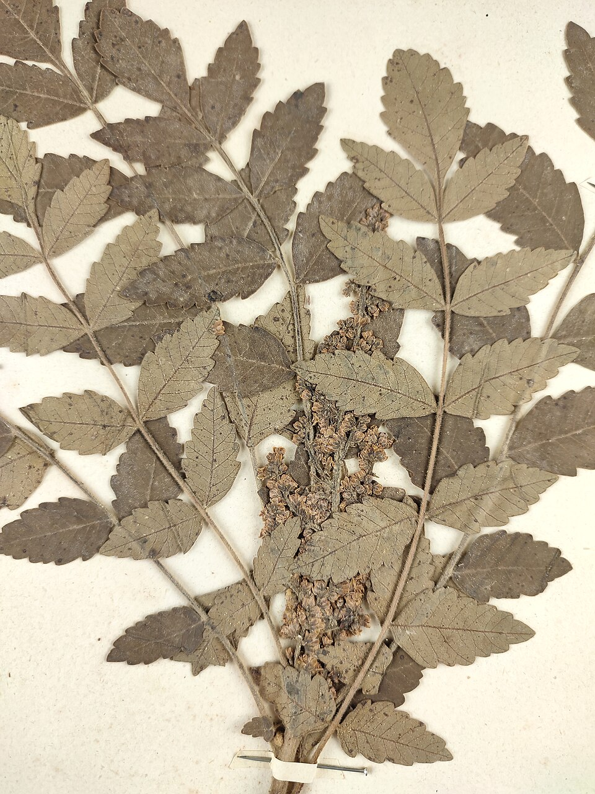

# Sicilian Sumac

> **Node ID**: plants.tannin.sicilian-sumac
> **Domain**: [Plants](./index.md)
> **Dependencies**: See prerequisites
> **Enables**: [`Textiles`](../textiles/index.md), [`Food Processing`](../food-processing/index.md)
> **Timeline**: Years 1-3
> **Outputs**: tannin leaves (15-25% tannin), dye (brown/black), spice (dried berries)
> **Critical**: No — versatile tannin and dye source but lower yield than wattle or quebracho

## Overview

> *Detail - Anacardiaceae Rhus coriaria L.*

> *Image: Giuseppe Frizzi, Public domain*

Sicilian sumac (*Rhus coriaria*) is a deciduous shrub native to the Mediterranean region and western Asia, cultivated for its tannin-rich leaves, dye-producing bark and roots, and tart, lemony berries used as a spice. The leaves contain 15-25% tannin by dry weight, making sumac a moderately concentrated tannin source that is particularly valued for producing light, flexible leather suited for gloving, garment, and bookbinding leather.

Sumac tannins are gallotannins (hydrolyzable tannins), distinct from the condensed tannins of wattle and quebracho. Gallotannin-tanned leather is softer, lighter in color (cream to pale yellow), and more flexible than leather tanned with condensed tannins. This makes sumac the preferred tannin for light leathers where flexibility and pale color matter more than waterproof firmness.

The shrub grows 1-3 meters tall, tolerates drought and poor soils, and thrives in Mediterranean climates with hot, dry summers and mild, wet winters. It produces small, hairy, red berries that are dried and ground into a tangy spice used throughout Middle Eastern and Mediterranean cuisine. The spice has been traded since antiquity.

Sumac also produces brown and black dyes. The leaves and twigs yield a brown dye on wool with iron mordant and a yellow-tan dye with alum mordant. The combination of tannin, dye, and food uses makes sumac one of the most versatile non-edible utility plants in the Mediterranean basin.

Primary outputs: `tannin_leaves` for light leather tanning, `brown_dye` for textiles, `spice_berries` for food seasoning.

## Prerequisites

### Materials

- Sumac seeds or root cuttings for propagation
- Mediterranean or semi-arid climate with well-drained soil
- Alum and iron mordants for dyeing

### Equipment

- Harvesting sickle for leaves and branches
- Drying racks or screens
- Grinding equipment (mortar and pestle or stone mill)
- Tanning vats (smaller than for heavy leather)
- Dye pots for textile dyeing

### Knowledge

- Leaf harvest timing for maximum tannin content
- Tannin extraction from dried leaves
- Light leather tanning technique (sumac-specific)
- Berry processing for spice production
- Dye extraction from bark and roots

### Infrastructure

- Sumac planting (can be grown as a hedge or field crop)
- Drying area for leaves and berries
- Small-scale tanning operation
- Spice grinding and storage facility

## Process Description

### Leaf Harvest and Tannin Extraction

1. Propagate from seed (scarify and stratify) or root cuttings. Plant 1-2 meters apart in rows. First harvest at 2-3 years.
2. Harvest leaves in mid-summer when tannin content peaks (June-August in the northern hemisphere). Cut branches 30 cm above ground; the shrub regrows for subsequent harvests.
3. Dry leaves in thin layers in the sun for 3-5 days until brittle. Turn daily.
4. Grind dried leaves to a coarse powder. Store in sealed containers away from moisture.
5. Extract tannin by steeping leaf powder in hot water (60-70°C) at 1:5 ratio for 4-8 hours. Strain through cloth.

### Light Leather Tanning

1. Prepare thin hides (sheep, goat, or calfskin) by fleshing, dehairing, and scudding.
2. Immerse hides in sumac tannin liquor at moderate concentration. Sumac tans faster than oak or wattle: thin hides (goat, sheep) are fully tanned in 5-14 days.
3. Move hides to fresh tannin liquor every 2-3 days for even penetration.
4. Remove tanned leather when fully penetrated (cut a test strip: uniform pale color throughout). Oil lightly and dry in the shade.
5. Finish by stretching and burnishing. Sumac-tanned leather is cream to pale yellow, soft, and flexible.

### Spice Production

1. Harvest ripe berry clusters in late summer when they turn dark red. The berries are covered in a fine, tart, malic acid-rich fuzz.
2. Dry berry clusters in the sun for 3-5 days until brittle.
3. Separate berries from stems by rubbing and winnowing.
4. Grind dried berries in a mortar or mill to a coarse, reddish-purple powder.
5. Store in sealed containers. The spice keeps its flavor for 6-12 months.

### Process Parameters

| Parameter | Range | Notes |
|-----------|-------|-------|
| Tannin content (dried leaves) | 15-25% | Moderate; good for light leather |
| Leaf yield per hectare per year | 2,000-5,000 kg (dry) | From established plants, 2-3 harvests |
| Tannin yield per hectare per year | 300-1,250 kg | From leaf extraction |
| Berry yield per hectare | 500-2,000 kg (dry) | Spice production |
| Shrub height | 1-3 m | Compact, manageable |
| First harvest age | 2-3 years | From planting |
| Productive lifespan | 15-25 years | Per planting |
| Leaf drying time | 3-5 days | In sun |
| Tannin extraction temperature | 60-70°C | Hot but not boiling |
| Light leather tanning time | 5-14 days | For thin hides |
| Leather color | Cream to pale yellow | Distinctive sumac shade |
| Drought tolerance | High | Survives on 300 mm annual rainfall |
| Plant density for tannin crop | 5,000-10,000/ha | Spacing 1-2 m |
| Dye color range | Brown to black | With iron mordant |
| Berry harvest timing | Late summer | When berries turn dark red |

### Tannin Extraction and Leather Processing

Sumac tannins (gallotannins) differ from wattle tannins (condensed tannins) in their behavior during leather tanning. Gallotannins are smaller molecules that penetrate hides faster and produce a more pliable leather. This makes sumac the preferred tannin for thin, flexible leathers: bookbinding, gloving, garment leather, and hat leather. For heavy leather (shoe soles, harness), wattle or quebracho tannins are superior because their larger molecules fill the hide more completely, producing firmer leather.

The extraction process is simpler than for bark tannins because sumac leaves are thin and release their tannins readily in hot water. A single extraction at 60-70°C for 4-8 hours recovers 70-80% of available tannins. A second extraction of the same leaf material recovers an additional 10-15%. The extraction temperature should not exceed 70°C; higher temperatures extract bitter non-tannin compounds that discolor the leather.

Sumac-tanned leather was historically preferred for Turkish morocco leather (used in fine bookbinding) and for the thin, flexible leather used in gloves. The leather has a distinctive cream to pale yellow color that takes dye evenly, making it an excellent base for colored leather goods.

### Dye Production from Sumac

Sumac leaves and twigs produce a reliable brown dye on wool, cotton, and silk. With alum mordant, the color is tan to khaki. With iron mordant (ferrous sulfate), the color shifts to deep brown or black. The high tannin content of sumac makes it an excellent pre-mordant as well: cloth treated with sumac tannin accepts other dyes more readily. Sumac black (sumac tannin plus iron) was one of the standard black dyes of the ancient Mediterranean textile industry.

## Safety Considerations

- Sumac berries and leaves are safe to handle. The plant is not toxic.
- Do not confuse Sicilian sumac (*Rhus coriaria*) with poison sumac (*Toxicodendron vernix*), a North American species in a different genus that causes severe contact dermatitis. Poison sumac has white berries; Sicilian sumac has red berries.
- Sumac spice powder is a fine dust that can irritate the respiratory tract. Wear a mask during grinding.
- Tannin solutions can cause skin dryness. Wear gloves during extended tanning work.

### Personal Protective Equipment

- Dust mask when grinding leaves or berries
- Gloves for tanning operations
- Eye protection when grinding

## Quality Control

### Acceptance Criteria

- **Dried leaves**: Green-brown color, brittle, no mold, no stems or woody material
- **Sumac spice**: Reddish-purple powder, tart and lemony flavor, no stem fragments
- **Sumac-tanned leather**: Uniform cream color, soft and flexible, no raw spots

### Testing Methods

- Leaf tannin test: steep 10 g of leaf powder in 100 ml hot water for 2 hours. Add iron sulfate solution. Dark blue-black color indicates high tannin.
- Spice quality: taste a small amount. Good sumac is sharply tart and astringent with a citrus-like flavor. Bland or bitter spice is past its prime.
- Leather flexibility: fold the leather 180° and press firmly. Good light leather folds without cracking.

## Scaling Notes

- **Household planting** (0.01 hectare): 50-100 shrubs. Annual leaf yield: 20-50 kg (dry). Annual berry yield: 5-20 kg (dry). Sufficient for household tanning and spice.
- **Village planting** (1 hectare): 5,000-10,000 shrubs. Annual tannin yield: 300-1,250 kg. Annual spice yield: 500-2,000 kg. Supports community tanning and spice trade.
- **Key advantage**: Multiple harvests per year from the same plants. Quick return (2-3 years to first harvest). Grows on poor, dry soils where other crops fail.

## Troubleshooting

| Problem | Probable Cause | Solution |
|---------|---------------|----------|
| Leaf tannin content low | Harvested too early in the season | Harvest in mid-summer when leaves are mature |
| Leather too soft and weak | Over-tanned or hides too thin | Reduce tanning time; use appropriate hide thickness |
| Spice lacks flavor | Berries harvested unripe or stored too long | Harvest when dark red; use within 12 months |
| Leaves mold during drying | Dried too slowly or in humid weather | Dry in thin layers; increase air circulation |
| Shrub dies after harvest | Cut too close to ground or during drought | Leave 30 cm of stem; avoid harvesting during extreme drought |

## Variations and Alternatives

- **Stag's horn sumac** (*Rhus typhina*): North American species with similar tannin content. Leaves and bark used for tanning. Not used for spice.
- **Chinese sumac** (*Rhus chinensis*): Host of the Chinese gallnut, which contains 60-70% tannic acid. The gallnuts are a superior tannin source where available.
- **Oak gallnuts**: Oak galls contain 50-70% tannic acid. Higher concentration than sumac leaves but seasonal and opportunistic.
- **Black wattle** (*Acacia mearnsii*): Much higher tannin yield per hectare but suited to tropical/subtropical climates. Produces heavy leather, not light leather.
- **Chestnut** (*Castanea sativa*): Wood chips contain 8-12% tannin. Another source of hydrolyzable tannins for light leather. Temperate climate.
- **Tara** (*Caesalpinia spinosa*): Peruvian tree pods with 40-60% tannin. A high-yield alternative where tropical/subtropical conditions allow cultivation.

## References

- [Textiles](../textiles/index.md) — leather processing for light goods
- [Food Processing](../food-processing/index.md) — spice production and preservation
- [Black Wattle](./acacia-mearnsii.md) — comparison tannin source for heavy leather
- [Madder](./rubia-tinctorum.md) — dye plant for comparison
- [Plants Domain](./index.md) — domain overview and related capabilities

### Sumac in Mediterranean Agriculture

Sumac is ideally suited to Mediterranean agroforestry systems. The shrub tolerates drought,
poor soils, and hot exposures that limit other crops. It can be planted as a hedgerow along
field boundaries, providing tannin and spice while serving as a windbreak and erosion barrier.
The deep root system accesses moisture and nutrients from soil layers below the reach of
annual crops, reducing competition with interplanted vegetables or grains.

In traditional Levantine agriculture, sumac was grown as part of a mixed planting that included
olive trees, grape vines, and field crops. The sumac shrubs occupied the margins and rocky
outcrops where other crops could not grow, adding tannin, dye, and spice production without
displacing food crops from the best land. This land-use efficiency made sumac an important
secondary crop throughout the eastern Mediterranean.

### Sumac Dye in Leather and Textiles

Sumac produces one of the most light-fast brown dyes available from any plant source. On wool
with iron mordant, the color is a deep, warm brown that resists fading for years of sun
exposure. The high tannin content of sumac also makes it an excellent pre-mordant: fabric
treated with sumac tannin before dyeing with other plant colors shows improved color uptake
and fastness across all dye types.

Sumac's role as a dual-purpose plant (tannin source and spice) makes it particularly valuable for small-scale agriculture. The same planting provides raw material for leather tanning, textile dyeing, and food seasoning — three essential functions from a single drought-tolerant shrub. This versatility is especially important in Mediterranean climates where water is scarce and multi-use crops are essential.

### Sicilian Sumac Summary

This species represents an important component of a diversified food production system.
No single crop provides complete nutrition, and dietary diversity is essential for human

---
*Part of the [Bootciv Tech Tree](../index.md) · [Plants](./index.md) · [All Domains](../index.md)*
