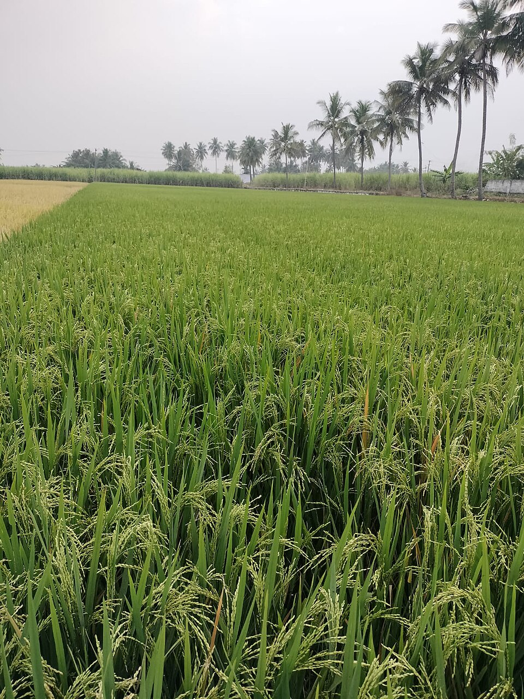

# Rice

> **Node ID**: plants.edible-plants.rice
> **Domain**: [Plants](./index.md)
> **Dependencies**: See prerequisites
> **Enables**: [`Edible Plants`](edible-plants.md)
> **Timeline**: Years 0-5
> **Outputs**: edible_plant_material
> **Critical**: Yes

## Overview

> *Image: Unknown authorUnknown author, Public domain*

Rice

*Oryza sativa* (Poaceae) is a staple food crop species of major importance for civilization bootstrapping. Rice provides seeds/nuts as its primary edible product and ranks 52/100 on the nutrition score.

Oryza sativa, having the common name Asian cultivated rice, is the much more common of the two rice species cultivated as a cereal, the other species being O. glaberrima, African rice. It was first domesticated in the Yangtze River basin in China 13,500 to 8,200 years ago. Oryza sativa belongs to the genus Oryza and the BOP clade in the grass family Poaceae. With a genome consisting of 430 Mbp across 12 chromosomes, it is renowned for being easy to genetically modify and is a model organism for the study of the biology of cereals and monocots.

Edible parts: Seeds, Cereal, Husks -oil The seed is the primary food product and can be boiled or steamed. It features in a huge range of savoury and sweet dishes worldwide — including curries, Far Eastern cuisines, paella, risotto, and rice pudding. The grain can also be popped like popcorn to make a breakfast cereal. An oil extracted from the seed is used in cooking and as a salad oil.

There are about 20 Oryza species. The B Vitamins are in the outer layers of brown rice.

For civilization bootstrapping, rice is significant because of its role as a staple crop. Reliable food production is the foundation upon which all other technological development rests. Understanding the cultivation, processing, and storage of *Oryza sativa* enables communities to establish food security and allocate labor to non-subsistence activities.

*Oryza sativa* is a member of the Poaceae family. As a staple food crop, it provides essential calories, protein, or other nutrients needed to sustain human populations during the bootstrap process. The ability to produce food reliably from cultivated plants is what separates sedentary civilizations from hunter-gatherer societies, because food surplus allows specialization of labor into toolmaking, construction, and eventually metallurgy and beyond.

This species grows as a perennial or annual depending on climate and management. Propagation is primarily by Propagate by seed.. Harvest timing depends on the plant part used: seeds/nuts are typically ready at specific growth stages or seasons.

## Prerequisites

### Materials

- Propagation material: Propagate by seed.
- Compost or organic matter for soil amendment
- Mulch material for moisture retention and weed suppression

### Equipment

- Hoe or digging stick for soil preparation and planting
- Sickle, machete, or harvesting knife for crop harvest
- Drying racks or flat drying surfaces for post-harvest processing
- Storage containers: woven baskets, ceramic jars, or sacks for dried product
- Winnowing baskets or screens if processing grains or seeds

### Knowledge

- Species identification: An annual grass with hollow stems. The stems can be 30 cm to 150 cm tall. (Floating varieties can be 5 m long.) The nodes are solid and swollen. The stem is protected by a skin layer which can often be high in silicon. A clump of shoots are produced as tillers from buds in the lower leaf axils. The inflorescence is a terminal panicle 15-30 cm long bearing spikelets that contain the grain. Each panicle produces 100-300 grains.
- Understanding of planting timing relative to local frost dates and rainy seasons
- Knowledge of soil preparation, seed depth, and spacing requirements
- Recognition of common pests and diseases and their early indicators
- Safe preparation methods for any toxic or bitter compounds (see Safety)

### Infrastructure

- Field or garden site with suitable climate, soil type, and sun exposure
- Reliable water access for germination and establishment phase
- Fenced or protected area if animal browsing is a risk
- Storage structure protected from moisture, rodents, and insects

## Process Description

### Cultivation and Propagation

Rice can be grown in the moist tropics and subtropics, succeeding at elevations up to 2,500 metres. It grows best in areas where annual daytime temperatures are within the range 20 - 30°c, but can tolerate 10 - 36°c. Growth ceases below 10°c and plants have no tolerance to frost. It prefers a mean annual rainfall in the range 1,500 - 2,000mm, but tolerates 1,000 - 4,000mm. Requires a wet to inundated soil and a position in full sun. Prefers a pH in the range 5.5 - 7, tolerating 4.5 - 9. Depending upon variety, rice can mature a crop of seed in anything from 60 - 200 days. There are many named varieties that have been developed to suit a wide diversity of climates and soil types. These can be grouped into two main forms:- Lowland - this is grown in land that is flooded during the growing season. Upland - this form does not require submersion by water. There are many different cultivars of each form. Some of these cultivars are starchy and are more suited to use in cakes, soups, pastry, breakfast foods etc. Other cultivars have a sweeter, glutinous texture, these are used for special purposes such as sweetmeats. Within these divisions, the varieties are further defined by whether they have short, medium or long grains. Long grained forms usually have the highest value, though short-grained forms are preferred in many countries. Flowering Time: Late Summer/Early Fall. Bloom Color: Cream/Tan. Spacing: 18-24 in. (45-60 cm). Propagation: Propagate by seed.

### Distribution and Growing Conditions

A tropical plant. It grows in tropical and subtropical countries. Plants are grown in both flooded and dryland sites. It will grow over a range of conditions but is normally between sea level and 900 metres altitude in the tropics. Occasionally it is grown up to 1600 m. In Nepal it grows to about 2800 m altitude. It needs a frost free period of over 130 days. It suits hardiness zones 9-12. Coming Soon

### Identification

An annual grass with hollow stems. The stems can be 30 cm to 150 cm tall. (Floating varieties can be 5 m long.) The nodes are solid and swollen. The stem is protected by a skin layer which can often be high in silicon. A clump of shoots are produced as tillers from buds in the lower leaf axils. The leaves are narrow and hairy. They taper towards the tip. Each stem produces 10-20 leaves and the seeds hang from the flower stalk at the top. Some varieties are glutinous and cling together when cooked.

### Edible Parts and Preparation

## Quantitative Parameters

### Nutritional Composition (per 100g)

| Part | Moisture | kJ | kcal | Protein | Vit A | Vit C | Iron | Zinc |
| --- | --- | --- | --- | --- | --- | --- | --- | --- |
| Seed white | 11.4 | 1530 | 366 | 6.4 | — | 0 | 1.9 | — |
| Seed brown | 13.5 | 1480 | 354 | 7.6 | — | — | 2.8 | — |
| Seed white | 68.4 | 544 | 130 | 2.7 | 0 | 0 | 1.2 | 0.49 |

### Growing Parameters

| Parameter | Value | Notes |
|-----------|-------|-------|
| Hardiness zones | 9-12 | USDA |
| Edible parts | Seeds/Nuts | Primary harvest |

## Processing and Storage

### Non-Food Uses

Rice straw is woven into hats and shoes and used for thatching, repairing houses, constructing grain storage structures, making ropes, packaging, and bags. In Vietnam it serves as a fuel. In China, India, Indonesia, and Pakistan it is used in paper production. Rice starch is used in cosmetics, laundering starch, and textiles. Oil from the seed is used in soap manufacture and can be made into a plastic packaging material. The grain husks are used as a fuel, as an addition to concrete, for making hardboard, and as an abrasive.

### Storage

Dry seeds thoroughly to below 14% moisture content before storage. Spread in thin layers on drying racks in full sun, stirring periodically. Test dryness by biting: properly dried seeds crack rather than dent. Store in airtight containers (ceramic jars with tight lids, sealed woven bags) in a cool, dry, dark location. Protect from rodents and insects with tight lids or by mixing with inert ash. Under good conditions, dried grains and legumes store for 1-5 years with minimal loss.

### Material Handling

Handle rice produce with clean hands and tools to prevent contamination. Remove field heat promptly after harvest by moving product to shade. Process within the recommended timeframe to prevent quality loss. Compost crop residues and processing waste to return organic matter to the soil. Label stored products with harvest date, variety, and any treatments applied.

## Scaling Notes

- **Bench scale**: Individual plants or small garden plot (10-50 plants). Output for direct household consumption. Useful for seed saving, variety selection, and learning the crop's behavior under local conditions.
- **Pilot scale**: Field planting of 0.1 to 1 hectare (500-5,000 plants). Staggered planting or sequential harvests to extend availability. Requires basic hand tools and family-level labor. Surplus can be traded or stored.
- **Production scale**: Multi-hectare cultivation with mechanized planting, harvesting, and processing. Requires plow animals or tractors, grain mills or processing equipment, and bulk storage facilities. Enables community-level food security and trade.
  Reported production data: There are about 20 Oryza species. The B Vitamins are in the outer layers of brown rice.

Key scaling challenges include maintaining genetic diversity at plantation scale, managing pest and disease pressure in monoculture, and matching post-harvest processing capacity to harvest volume. Seed saving and variety selection at bench scale directly informs decisions about which cultivars to scale up.

## Troubleshooting

| Problem | Probable Cause | Solution |
|---------|---------------|----------|
| Poor germination | Old seed, wrong soil temperature, planted too deep, or insufficient moisture | Use fresh seed; verify germination temperature range; plant at recommended depth; maintain soil moisture during germination |
| Pest damage | Insect infestation or browsing animals | Hand-pick pests; use companion planting with repellent species; install fencing for larger pests |
| Disease (fungal/bacterial) | Poor air circulation, excessive moisture, infected seed | Space plants adequately; avoid overhead watering; use clean seed from disease-free plants; practice crop rotation |
| Low yield | Nutrient deficiency, water stress, overcrowding, or shade | Amend soil with compost or manure; ensure adequate water at critical growth stages; thin to recommended spacing; plant in full sun |
| Storage losses | Insufficient drying, rodent/insect damage, high humidity | Dry product thoroughly before storage; use sealed containers; inspect stored product regularly; keep storage area clean and dry |

## Safety Considerations

Working with *Oryza sativa* involves the following hazards:

- Tool injuries during harvest and processing — use sharp tools in good condition and cut away from the body
- Allergic reactions to plant compounds — sensitive individuals should test small quantities first
- Sun exposure and heat stress during field work — schedule heavy work for early morning or late afternoon
- Musculoskeletal strain from repetitive harvesting motions — vary tasks and take regular breaks

### Personal Protective Equipment

- Sturdy gloves when handling plants with irritant sap, spines, or rough surfaces
- Long sleeves and trousers for field work to reduce skin exposure to irritants and insects
- Eye protection when using cutting tools overhead or near face level
- Sun hat and sunscreen for extended field work

### Emergency Procedures

- For suspected plant poisoning: stop eating immediately, save a sample of the plant material, and seek medical attention. Do not induce vomiting unless directed by a medical professional.
- For tool lacerations: apply direct pressure with a clean cloth, elevate the wound, and seek medical attention for cuts deeper than skin level.
- For allergic reaction (swelling, difficulty breathing): discontinue exposure immediately and seek emergency medical help.

## Quality Control

### Acceptance Criteria

- Harvest product shows expected color, texture, size, and flavor for the variety grown
- No visible mold, rot, pest damage, or foreign material in stored product
- Dried products are brittle throughout with no flexible or moist spots
- Seeds intended for storage test at below 14% moisture content

### Testing Methods

- **Visual inspection**: check for discoloration, mold, insect damage, or foreign material
- **Bite test (seeds/grains)**: properly dried seeds crack cleanly; under-dried seeds dent or feel leathery
- **Smell test**: fresh product has characteristic aroma; off-odors indicate spoilage or contamination
- **Snap test (dried products)**: properly dried material snaps rather than bends

### Sampling Protocol

For field-scale production, inspect every 10th plant during harvest for disease and pest damage. Grade each batch by size and quality before storage. Record yield per unit area to track productivity trends across seasons and identify declining performance early.

## Variations and Alternatives

### Medicinal Uses

Rice is regarded as a nutritive, soothing, tonic herb that is diuretic, reduces lactation, aids digestion, and controls sweating. The seeds are taken internally for urinary dysfunction. Seeds, or germinated seeds, are used to treat excessive lactation. Germinated seeds are also taken for poor appetite, indigestion, abdominal discomfort, and bloating. The grains are often cooked with herbs to prepare a medicinal gruel. The rhizome is used internally for night sweats, particularly in cases of tuberculosis and chronic pneumonia; rhizomes are harvested at the end of the growing season and dried for use in decoctions.

### Other Uses

### Related Species

- [Wheat](wheat.md)
- [Maize](maize.md)
- [Potato](potato.md)
- [Cassava](cassava.md)
- [Sweet Potato](sweet-potato.md)

### Cultivar Selection

Within *Oryza sativa*, considerable variation exists in yield, disease resistance, climate adaptation, and quality characteristics. When establishing a rice crop, select varieties adapted to local conditions: day length, temperature range, rainfall pattern, and soil type. Landrace varieties — locally adapted populations maintained by traditional farmers — often outperform modern cultivars under low-input conditions because they have been selected for resilience rather than maximum yield under optimal conditions.

Seed saving from the best-performing plants each generation gradually adapts the variety to local conditions. Select for vigor, disease resistance, appropriate maturity timing, and product quality. Maintain genetic diversity by saving seed from multiple plants rather than a single individual, which preserves the population's ability to adapt to changing conditions and disease pressures.

### Crop Rotation and Companion Planting

*Oryza sativa* benefits from crop rotation to prevent buildup of species-specific pests and diseases. Avoid planting in the same field in consecutive seasons where possible. Follow with a different crop family to break pest cycles and maintain soil health.

Companion planting with aromatic herbs or flowering plants can deter pests and attract beneficial insects. Avoid planting near species that compete for the same nutrients or harbor shared pathogens.

## References

- [Edible Plants](edible-plants.md) — parent capability
- [Plants Domain](./index.md) — domain overview and related capabilities
- [Agave](agave.md) — example plant article format
- [Food Processing](../food-processing/index.md) — downstream processing of harvested crops
- [Agriculture](../agriculture/index.md) — cultivation systems and crop rotation
- Family: Poaceae
- Data sourced from Food Plants International, Wikipedia, and iNaturalist via the Edible Plant Database (ZIM)
- Plants for a Future (pfaf.org) — supplementary cultivation and use data

---
*Part of the [Bootciv Tech Tree](../index.md) · [Plants](./index.md) · [All Domains](../index.md)*
