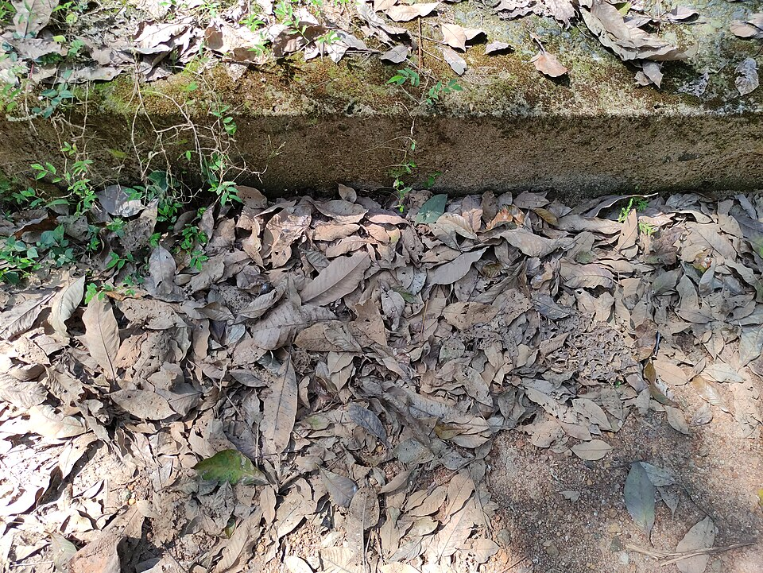

# Rubber Tree

> **Node ID**: plants.edible-plants.rubber-tree
> **Domain**: [Plants](./index.md)
> **Dependencies**: See prerequisites
> **Enables**: [`Edible Plants`](edible-plants.md)
> **Timeline**: Years 0-5
> **Outputs**: edible_plant_material
> **Critical**: Yes

## Overview

> *Image: Vis M, CC BY-SA 4.0*

Rubber Tree

*Hevea brasiliensis* (Euphorbiaceae) is a fiber & industrial crop species of major importance for civilization bootstrapping. Para rubber tree, Caoutchouc tree provides leaves, seeds/nuts as its primary edible product.

Hevea brasiliensis, the Pará rubber tree, sharinga tree, seringueira, or, most commonly, rubber tree or rubber plant, is a flowering plant belonging to the spurge family, Euphorbiaceae. It is originally native to the Amazon basin, but is now pantropical in distribution due to introductions. It is the most economically important member of the genus Hevea, because the milky latex extracted from the tree is the primary source of natural rubber.

Edible parts: Seeds, Leaves The seeds are edible when cooked, and despite being poisonous they serve as a staple food for local peoples in the jungle. Poison is destroyed by prolonged soaking or boiling. The seeds contain 40–50% oil, which is also suitable for use as food. Considered a famine food.

For civilization bootstrapping, rubber tree is significant because of its role as a fiber & industrial crop. Reliable food production is the foundation upon which all other technological development rests. Understanding the cultivation, processing, and storage of *Hevea brasiliensis* enables communities to establish food security and allocate labor to non-subsistence activities.

*Hevea brasiliensis* is a member of the Euphorbiaceae family. As a fiber & industrial crop, it provides essential calories, protein, or other nutrients needed to sustain human populations during the bootstrap process. The ability to produce food reliably from cultivated plants is what separates sedentary civilizations from hunter-gatherer societies, because food surplus allows specialization of labor into toolmaking, construction, and eventually metallurgy and beyond.

This species grows as a perennial or annual depending on climate and management. Propagation is primarily by Seed viability is very short at 7–10 days, so seed should be sown as soon as possible, either in situ with 2 or more seeds per hole followed by selective thinning, or in a nursery bed. Germination takes 1–3 weeks depending on conditions and seed freshness, and is best at around 25°C. Seedlings reach 1–1.5 metres in height within 6 months. Seed storage behaviour is recalcitrant; viability can be maintained for up to 3 months in moist storage using moist charcoal and sawdust in a perforated polythene bag kept at 7–10°C. Whole seed moisture content is 36%; the lowest safe moisture content is 20%, and no seeds survive desiccation to 15%. Seeds are killed by exposure to -5°C for 3–4 hours. Commercial clonal seed is stored at around 4°C, which typically results in reduced but tolerable germination rates. Vegetative propagation is carried out by budding or cuttings; seedlings root well from cuttings, but material from older rubber-bearing trees takes very poorly or not at all.. Harvest timing depends on the plant part used: leaves, seeds/nuts are typically ready at specific growth stages or seasons.

## Prerequisites

### Materials

- Propagation material: Seed viability is very short at 7–10 days, so seed should be sown as soon as possible, either in situ with 2 or more seeds per hole followed by selective thinning, or in a nursery bed. Germination takes 1–3 weeks depending on conditions and seed freshness, and is best at around 25°C. Seedlings reach 1–1.5 metres in height within 6 months. Seed storage behaviour is recalcitrant; viability can be maintained for up to 3 months in moist storage using moist charcoal and sawdust in a perforated polythene bag kept at 7–10°C. Whole seed moisture content is 36%; the lowest safe moisture content is 20%, and no seeds survive desiccation to 15%. Seeds are killed by exposure to -5°C for 3–4 hours. Commercial clonal seed is stored at around 4°C, which typically results in reduced but tolerable germination rates. Vegetative propagation is carried out by budding or cuttings; seedlings root well from cuttings, but material from older rubber-bearing trees takes very poorly or not at all.
- Compost or organic matter for soil amendment
- Mulch material for moisture retention and weed suppression

### Equipment

- Hoe or digging stick for soil preparation and planting
- Sickle, machete, or harvesting knife for crop harvest
- Drying racks or flat drying surfaces for post-harvest processing
- Storage containers: woven baskets, ceramic jars, or sacks for dried product
- Winnowing baskets or screens if processing grains or seeds

### Knowledge

- Species identification: A deciduous tree. It grows 20 m tall. The bark is smooth and grey. The leaves have 3 leaflets. They are dark green and 30-60 cm long. They are arranged in spirals. The flowers are pale yellow and occur in large panicles. They have a scent. The fruit is a capsule. It is large and has 3 lobes. They ar
- Understanding of planting timing relative to local frost dates and rainy seasons
- Knowledge of soil preparation, seed depth, and spacing requirements
- Recognition of common pests and diseases and their early indicators
- Safe preparation methods for any toxic or bitter compounds (see Safety)

### Infrastructure

- Field or garden site with suitable climate, soil type, and sun exposure
- Reliable water access for germination and establishment phase
- Fenced or protected area if animal browsing is a risk
- Storage structure protected from moisture, rodents, and insects

## Process Description

### Cultivation and Propagation

Plants are grown from seeds. Seeds need to be planted fresh. They can also be grown from cuttings. Propagation: Seed viability is very short at 7–10 days, so seed should be sown as soon as possible, either in situ with 2 or more seeds per hole followed by selective thinning, or in a nursery bed. Germination takes 1–3 weeks depending on conditions and seed freshness, and is best at around 25°C. Seedlings reach 1–1.5 metres in height within 6 months. Seed storage behaviour is recalcitrant; viability can be maintained for up to 3 months in moist storage using moist charcoal and sawdust in a perforated polythene bag kept at 7–10°C. Whole seed moisture content is 36%; the lowest safe moisture content is 20%, and no seeds survive desiccation to 15%. Seeds are killed by exposure to -5°C for 3–4 hours. Commercial clonal seed is stored at around 4°C, which typically results in reduced but tolerable germination rates. Vegetative propagation is carried out by budding or cuttings; seedlings root well from cuttings, but material from older rubber-bearing trees takes very poorly or not at all.

### Distribution and Growing Conditions

### Identification

A deciduous tree. It grows 20 m tall. The bark is smooth and grey. The leaves have 3 leaflets. They are dark green and 30-60 cm long. They are arranged in spirals. The flowers are pale yellow and occur in large panicles. They have a scent. The fruit is a capsule. It is large and has 3 lobes. They are held in clusters. The explode on opening. The seeds are speckled and 2.5 cm long.

### Edible Parts and Preparation

## Quantitative Parameters

### Growing Parameters

| Parameter | Value | Notes |
|-----------|-------|-------|
| Annual rainfall | 1,500 mm | Growing requirement |
| Edible parts | Leaves, Seeds/Nuts | Primary harvest |

## Processing and Storage

### Non-Food Uses

Intercropping with coffee or cocoa, possibly alongside ipecac, is feasible. After a few years under legumes, nitrogen fertilizer may not be needed, though phosphorus, magnesium, and potassium can be limiting in some areas. Press cake or extracted meal from the seeds can be used as fertilizer. Latex is obtained by tapping the trunk and is coagulated using acetic acid, formic acid, or alum. This tree is the primary source of natural rubber, used in car tyres, shoes, boots, balls, elastic bands, erasers, and many other products, as well as by local people for domestic items such as water bottles. The seeds yield a semi-drying pale yellow oil known as Para rubber seed oil; boiling removes the toxins and releases the oil, which is used for illumination, soap making, paints, and varnishes. This oil also functions as an effective treatment against houseflies and lice. The pale cream heartwood, sometimes pink-tinged when fresh and darkening to pale straw or pale brown, has a straight to shallowly interlocked grain with a moderately coarse, even texture. Freshly sawn wood has a distinct smell of latex. Poor tapping practices can cause black streaks from bark inclusion. Timber is primarily used for furniture, and also for interior finishes, mouldings, wall panelling, picture frames, drawer guides, cabinet handles, parquet flooring, household utensils, blockboard cores, pallets, crates, coffins, veneer, and glue-laminated timber for staircases and door and window components. It is only moderately durable and should not be used for exterior applications. Offcuts and residues have been used successfully in Malaysia to produce particle board, wood-cement board, and medium-density fibreboard. Rubberwood waste is an excellent growing medium for mushrooms, especially oyster mushrooms (Pleurotus spp.). Formerly used as charcoal or fuel wood for brick making, tobacco drying, and rubber drying.

### Storage

Dry seeds thoroughly to below 14% moisture content before storage. Spread in thin layers on drying racks in full sun, stirring periodically. Test dryness by biting: properly dried seeds crack rather than dent. Store in airtight containers (ceramic jars with tight lids, sealed woven bags) in a cool, dry, dark location. Protect from rodents and insects with tight lids or by mixing with inert ash. Under good conditions, dried grains and legumes store for 1-5 years with minimal loss.

### Material Handling

Handle rubber tree produce with clean hands and tools to prevent contamination. Remove field heat promptly after harvest by moving product to shade. Process within the recommended timeframe to prevent quality loss. Compost crop residues and processing waste to return organic matter to the soil. Label stored products with harvest date, variety, and any treatments applied.

## Scaling Notes

- **Bench scale**: Individual plants or small garden plot (10-50 plants). Output for direct household consumption. Useful for seed saving, variety selection, and learning the crop's behavior under local conditions.
- **Pilot scale**: Field planting of 0.1 to 1 hectare (500-5,000 plants). Staggered planting or sequential harvests to extend availability. Requires basic hand tools and family-level labor. Surplus can be traded or stored.
- **Production scale**: Multi-hectare cultivation with mechanized planting, harvesting, and processing. Requires plow animals or tractors, grain mills or processing equipment, and bulk storage facilities. Enables community-level food security and trade.

Key scaling challenges include maintaining genetic diversity at plantation scale, managing pest and disease pressure in monoculture, and matching post-harvest processing capacity to harvest volume. Seed saving and variety selection at bench scale directly informs decisions about which cultivars to scale up.

## Troubleshooting

| Problem | Probable Cause | Solution |
|---------|---------------|----------|
| Poor germination | Old seed, wrong soil temperature, planted too deep, or insufficient moisture | Use fresh seed; verify germination temperature range; plant at recommended depth; maintain soil moisture during germination |
| Pest damage | Insect infestation or browsing animals | Hand-pick pests; use companion planting with repellent species; install fencing for larger pests |
| Disease (fungal/bacterial) | Poor air circulation, excessive moisture, infected seed | Space plants adequately; avoid overhead watering; use clean seed from disease-free plants; practice crop rotation |
| Low yield | Nutrient deficiency, water stress, overcrowding, or shade | Amend soil with compost or manure; ensure adequate water at critical growth stages; thin to recommended spacing; plant in full sun |
| Storage losses | Insufficient drying, rodent/insect damage, high humidity | Dry product thoroughly before storage; use sealed containers; inspect stored product regularly; keep storage area clean and dry |
| Quality or safety note | See species-specific notes | There are 9 Hevea species. |

## Safety Considerations

Working with *Hevea brasiliensis* involves the following hazards:

- **Toxicity**: Parts of this plant may contain compounds that are toxic when raw or improperly prepared. Always follow proper preparation procedures before consumption. Verify with multiple authoritative sources.
- Tool injuries during harvest and processing — use sharp tools in good condition and cut away from the body
- Allergic reactions to plant compounds — sensitive individuals should test small quantities first
- Sun exposure and heat stress during field work — schedule heavy work for early morning or late afternoon
- Musculoskeletal strain from repetitive harvesting motions — vary tasks and take regular breaks

### Personal Protective Equipment

- Sturdy gloves when handling plants with irritant sap, spines, or rough surfaces
- Long sleeves and trousers for field work to reduce skin exposure to irritants and insects
- Eye protection when using cutting tools overhead or near face level
- Sun hat and sunscreen for extended field work

### Emergency Procedures

- For suspected plant poisoning: stop eating immediately, save a sample of the plant material, and seek medical attention. Do not induce vomiting unless directed by a medical professional.
- For tool lacerations: apply direct pressure with a clean cloth, elevate the wound, and seek medical attention for cuts deeper than skin level.
- For allergic reaction (swelling, difficulty breathing): discontinue exposure immediately and seek emergency medical help.

## Quality Control

### Acceptance Criteria

- Harvest product shows expected color, texture, size, and flavor for the variety grown
- No visible mold, rot, pest damage, or foreign material in stored product
- Dried products are brittle throughout with no flexible or moist spots
- Seeds intended for storage test at below 14% moisture content

### Testing Methods

- **Visual inspection**: check for discoloration, mold, insect damage, or foreign material
- **Bite test (seeds/grains)**: properly dried seeds crack cleanly; under-dried seeds dent or feel leathery
- **Smell test**: fresh product has characteristic aroma; off-odors indicate spoilage or contamination
- **Snap test (dried products)**: properly dried material snaps rather than bends

### Sampling Protocol

For field-scale production, inspect every 10th plant during harvest for disease and pest damage. Grade each batch by size and quality before storage. Record yield per unit area to track productivity trends across seasons and identify declining performance early.

## Variations and Alternatives

### Medicinal Uses

None known.

### Other Uses

### Additional Information

It is cultivated.

### Notes

There are 9 Hevea species.

### Related Species

- [Cotton](cotton.md)
- [Flax](flax.md)
- [Hemp](hemp.md)
- [Ramie](ramie.md)
- [Kenaf](kenaf.md)

### Cultivar Selection

Within *Hevea brasiliensis*, considerable variation exists in yield, disease resistance, climate adaptation, and quality characteristics. When establishing a rubber tree crop, select varieties adapted to local conditions: day length, temperature range, rainfall pattern, and soil type. Landrace varieties — locally adapted populations maintained by traditional farmers — often outperform modern cultivars under low-input conditions because they have been selected for resilience rather than maximum yield under optimal conditions.

Seed saving from the best-performing plants each generation gradually adapts the variety to local conditions. Select for vigor, disease resistance, appropriate maturity timing, and product quality. Maintain genetic diversity by saving seed from multiple plants rather than a single individual, which preserves the population's ability to adapt to changing conditions and disease pressures.

### Crop Rotation and Companion Planting

*Hevea brasiliensis* benefits from crop rotation to prevent buildup of species-specific pests and diseases. Avoid planting in the same field in consecutive seasons where possible. Follow with a different crop family to break pest cycles and maintain soil health.

Companion planting with aromatic herbs or flowering plants can deter pests and attract beneficial insects. Avoid planting near species that compete for the same nutrients or harbor shared pathogens.

## References

- [Edible Plants](edible-plants.md) — parent capability
- [Plants Domain](./index.md) — domain overview and related capabilities
- [Agave](agave.md) — example plant article format
- [Polymers](../polymers/index.md) — natural rubber processing, vulcanization, and elastomer production
- [Textiles / Waterproofing](../textiles/finishing.md) — rubberized fabric and waterproof coatings
- [Food Processing](../food-processing/index.md) — downstream processing of harvested crops
- [Agriculture](../agriculture/index.md) — cultivation systems and crop rotation
- Family: Euphorbiaceae
- Distribution: United Arab Emirates, Afghanistan, Antigua &amp; Barbuda, Armenia, Angola, Argentina, Australia, Azerbaijan, Barbados, Bangladesh, Burkina Faso, Bahrain, Burundi, Benin, Brunei, Bolivia, Brazil, Bahamas, Bhutan, Botswana and 132 more
- Data sourced from Food Plants International, Wikipedia, and iNaturalist via the Edible Plant Database (ZIM)
- Plants for a Future (pfaf.org) — supplementary cultivation and use data

---
*Part of the [Bootciv Tech Tree](../index.md) · [Plants](./index.md) · [All Domains](../index.md)*
