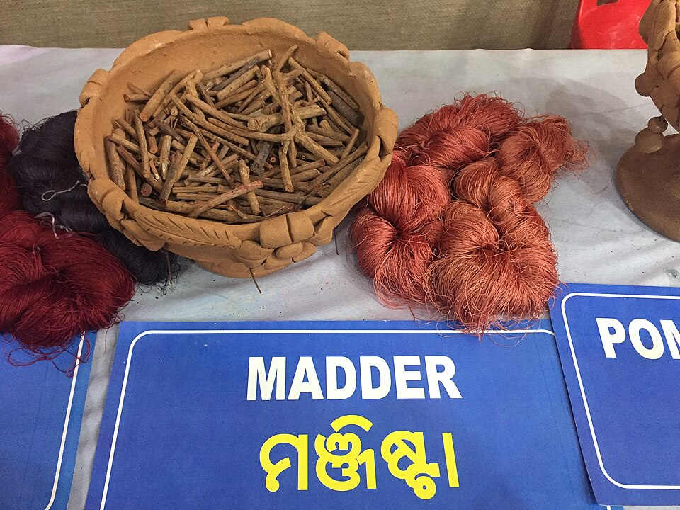

# Madder

> **Node ID**: plants.dye.madder
> **Domain**: [Plants](./index.md)
> **Dependencies**: See prerequisites
> **Enables**: [`Textiles`](../textiles/index.md)
> **Timeline**: Years 1-3
> **Outputs**: red dye (alizarin), orange dye (purpurin)
> **Critical**: No — the most important historical red dye but alternatives exist

## Overview

> *Using natural dyes to color the yarn of Tasar silk.*

> *Image: Sailesh Patnaik, CC BY-SA 4.0*

Madder (*Rubia tinctorum*) is a perennial climbing plant whose roots produce alizarin, the most important red dye in history. For over 5,000 years, from ancient Egypt through the Industrial Revolution, madder root was the primary source of stable, permanent red colorant across Europe, the Middle East, and Asia. The British Army's iconic red coats were dyed with madder until the invention of synthetic alizarin in 1868.

The dye comes from the dried roots, which contain 1-4% dye compounds (alizarin and purpurin) by dry weight. Alizarin produces a clear, cool red; purpurin contributes warmer orange-red tones. The exact shade depends on the mordant used: alum mordant produces true red, iron mordant produces deep brown-red, and tin mordant produces bright scarlet.

Madder is a mordant dye, meaning it requires a metal salt (mordant) to bond permanently to fiber. Alum (potassium aluminum sulfate) is the standard mordant for madder, producing the classic "Turkey red" that was the most valued textile color for centuries. The mordanting process must be completed before dyeing.

The plant grows 60-150 cm tall with whorls of prickly leaves and small yellow flowers. It requires 2-3 years of root growth before the first harvest. The roots spread horizontally just below the soil surface, reaching 30-60 cm long. After harvest, roots are dried, ground, and stored. Dried madder root keeps its dye properties for years.

Primary outputs: `red_dye` (alizarin) for textiles and leather, `orange_dye` (purpurin).

## Prerequisites

### Materials

- Madder root crowns or seeds for propagation
- Well-drained, deep, fertile soil with pH 6.0-7.5
- Alum (potassium aluminum sulfate) or other mordant salts
- Water for dye extraction and dyeing

### Equipment

- Digging fork for root harvest
- Drying racks or screens for roots
- Grinding equipment (mortar and pestle, or stone mill)
- Dye pot (copper, stainless steel, or ceramic; avoid iron which alters the color)
- Stirring pole
- Thermometer or temperature estimation by hand
- Cloth for straining dye liquor

### Knowledge

- Root harvesting timing (2-3 year old roots have maximum dye content)
- Mordanting technique: alum mordant preparation and application
- Dye extraction: simmering ground root to release alizarin
- Temperature control during dyeing (madder degrades above 80°C)
- Color modification through mordant selection

### Infrastructure

- Madder bed or field (2-3 year crop)
- Drying and storage facility for harvested roots
- Dye house with dye pots, water supply, and ventilation
- Mordanting vats (separate from dye vats)

## Process Description

### Root Cultivation and Harvest

1. Plant madder root crowns or stratified seeds in spring, in rows 30-45 cm apart. Space plants 20-30 cm apart within rows.
2. Allow plants to grow for 2-3 years. Top growth dies back each winter and regrows in spring. Do not harvest before the second year; first-year roots contain insufficient dye.
3. In autumn of the second or third year, dig the horizontal roots carefully with a fork. Avoid breaking roots; longer pieces are more valuable. The roots are 3-8 mm in diameter and 30-60 cm long, growing just below the surface.
4. Wash roots to remove soil. Cut into 5-10 cm pieces and dry in a warm, well-ventilated area for 1-2 weeks until brittle.
5. Grind dried roots to a coarse powder using a mortar or mill. Store in sealed containers away from light.

### Mordanting (Alum)

1. Dissolve alum (potassium aluminum sulfate) at 10-15% of fiber weight in warm water. For 1 kg of wool: 100-150 g of alum.
2. Wet the fiber thoroughly in warm water. Add the fiber to the alum solution.
3. Heat gradually to 70-80°C over 30 minutes. Hold at 70-80°C for 60 minutes, stirring occasionally.
4. Allow to cool in the bath. Remove fiber and rinse lightly. The mordanted fiber can be used immediately or dried and stored for later dyeing.

### Dyeing with Madder

1. Prepare the dye bath: soak 50-100 g of ground madder root per 100 g of fiber in water overnight.
2. Heat the dye bath gradually to 60-75°C. Do not exceed 80°C, which browns the dye and dulls the color. Hold at temperature for 60-90 minutes.
3. Strain out the root powder through cloth. Return the clear red dye liquor to the pot.
4. Add the wet, mordanted fiber to the dye bath. Heat gently to 60-75°C and maintain for 60-90 minutes, stirring occasionally for even color.
5. Allow the fiber to cool in the dye bath for enhanced color depth.
6. Remove fiber and rinse in cool water until the rinse water runs clear. Dry in the shade.

### Process Parameters

| Parameter | Range | Notes |
|-----------|-------|-------|
| Alizarin content (dried root) | 1-4% | Varies by age, soil, and variety |
| Root dye yield per hectare | 50-200 kg (dye equivalent) | From 2-3 year crop |
| Dried root yield per hectare | 2,000-5,000 kg | After 2-3 years growth |
| Alum mordant rate | 10-15% of fiber weight | Standard for wool and cotton |
| Dye bath temperature | 60-75°C | Never exceed 80°C |
| Dyeing time | 60-90 minutes | At temperature |
| Root to fiber ratio | 50-100% (ground root:fiber weight) | More root = deeper color |
| Color range (alum mordant) | True red to deep red | Cool red tones |
| Color range (iron mordant) | Brown-red to maroon | Dark, muted tones |
| Color range (tin mordant) | Scarlet to bright red | Warm, vivid tones |
| Light fastness | Very good (6-7 on 8 scale) | One of the most lightfast natural dyes |
| Wash fastness | Good to very good | With proper mordanting |
| Root growth depth | 5-15 cm | Horizontal, just below surface |
| Dye extraction temperature | 60-75°C | Never exceed 80°C |

### Dyeing Process Details

The Turkey red process — the most prized madder dye application — was a complex multi-step procedure developed in the Levant and perfected in 18th-century Europe. It involved repeated applications of alum mordant, oil treatment (olive oil), and madder dye over several weeks. The resulting red was the most permanent, brilliant red achievable with natural materials. A simplified version adequate for civilization bootstrapping uses alum mordant followed by madder dyeing at 60-75°C.

Temperature control is the single most important variable in madder dyeing. Above 80°C, alizarin degrades to brown compounds and the dye bath shifts from clear red to muddy brown. Below 60°C, dye uptake is slow and incomplete. The optimal range is 65-75°C, maintained for 60-90 minutes. A thermometer is helpful; without one, the water should be hot to the touch but not bubbling (simmering is too hot).

The root-to-fiber ratio determines color depth. A 1:2 ratio (50 g root per 100 g fiber) produces medium red. A 1:1 ratio produces deep red. A 2:1 ratio produces very dark red approaching burgundy. Multiple dye baths (remordanting between baths) produce the deepest colors.

### Mordant Chemistry

Alum (potassium aluminum sulfate) is the standard mordant for madder. The aluminum ions form coordination bonds between the hydroxyl groups of alizarin and the amino groups in wool fiber (keratin), creating a permanent chemical bridge. Without mordant, alizarin washes out of fabric almost entirely. The mordanting step must be thorough: 10-15% alum by fiber weight, heated to 70-80°C for 60 minutes.

Iron mordant (ferrous sulfate) produces darker, cooler shades because iron forms a different colored complex with alizarin. Tin mordant (stannous chloride) produces the brightest, warmest reds but is more expensive and can damage wool fibers if overused. Copper mordant produces reddish-brown tones.

## Safety Considerations

- Alum (potassium aluminum sulfate) is mildly toxic if ingested and irritates mucous membranes. Avoid inhalation of dust. Wash hands after handling.
- Madder root powder stains skin and clothing. The stain is persistent. Wear gloves and old clothing when grinding or handling root powder.
- Dye baths are hot. Use gloves and avoid splashing. Dye stains are extremely difficult to remove from skin and surfaces.
- Iron mordant (ferrous sulfate) is toxic if ingested. Keep away from children and animals.
- Copper dye pots release small amounts of copper into the dye bath. Do not use copper pots for food after dyeing.
- Long-term handling of madder root has been linked to kidney damage in professional dyers. Use gloves and avoid repeated skin contact.

### Personal Protective Equipment

- Rubber gloves for all dyeing and mordanting operations
- Old clothing or apron that can be permanently stained
- Dust mask when grinding dried roots
- Eye protection when handling alum powder

## Quality Control

### Acceptance Criteria

- **Dried root**: Red-orange interior, no mold, brittle-dry, minimum 2 years growth
- **Ground root**: Coarse powder, bright orange-red color, no visible soil particles
- **Dyed wool (alum mordant)**: Even red color, no streaks, rubs dry with minimal transfer, light-fast after 48-hour sun exposure test

### Testing Methods

- Root age check: cross-section of root. Two-year roots show 2 growth rings; three-year roots show 3. Older roots produce more dye.
- Alizarin content estimation: boil 10 g of ground root in 100 ml water for 30 minutes. The resulting color intensity correlates with dye content.
- Color fastness: expose dyed sample to direct sunlight for 1 week. Compare with a covered sample. Acceptable fading is less than 15%.
- Rub fastness: rub dyed fabric vigorously against white cotton. Minimal transfer is acceptable.

## Scaling Notes

- **Household bed** (10 m²): 50-100 plants producing 5-10 kg dried root after 2-3 years. Enough to dye several garments.
- **Field plot** (0.5 hectare): 5,000-10,000 plants. Dried root yield: 1-3 tonnes. Sufficient for a village dye operation or small trade production.
- **Commercial field** (5 hectares): Requires mechanical harvesting equipment for roots. Annual production (from staggered planting): 10-25 tonnes dried root.
- **Bottleneck**: The 2-3 year growing period before first harvest. Plan madder planting well in advance of dye needs.

## Troubleshooting

| Problem | Probable Cause | Solution |
|---------|---------------|----------|
| Dye color is brown instead of red | Bath temperature exceeded 80°C | Maintain bath at 60-75°C; never boil madder |
| Dye color is pale pink | Insufficient root or insufficient mordant | Increase root amount; verify alum mordant was applied correctly |
| Color uneven on fabric | Fabric not pre-wetted or stirred inadequately | Always pre-wet fiber; stir gently but frequently |
| Dye rubs off after drying | Incomplete mordanting or insufficient dye uptake | Re-mordant and re-dye; extend dyeing time |
| Roots low in dye content | Harvested too young or poor soil | Wait minimum 2 years; grow in fertile, alkaline soil |
| Madder plants spreading invasively | Roots spreading beyond planted area | Install root barriers; harvest entire bed every 2-3 years |

## Variations and Alternatives

- **Wild madder** (*Rubia peregrina*): Similar dye properties, native to western Europe. Lower dye content but grows in poorer soils.
- **Indian madder** (*Rubia cordifolia*): Tropical species used in Ayurvedic dyeing traditions. Similar alizarin content. Grows in warm, humid climates.
- **Bedstraw** (*Galium spp.*): Related genus with similar dye compounds in roots. Lower yield but widely available as a wild harvest.
- **Cochineal** (insect, *Dactylopius coccus*): Produces carminic acid, a brighter red than alizarin. Requires prickly pear cactus host. More vivid but less light-fast than madder on cotton.
- **Synthetic alizarin**: First synthetic natural dye (1868). Made from coal tar. Identical to natural alizarin. Eliminated the commercial madder industry.
- **Safflower** (*Carthamus tinctorius*): Produces a water-soluble yellow dye and an insoluble red dye (carthamin). The red is less permanent than madder but requires no mordant.

### Historical and Strategic Significance

Madder was one of the most economically important crops in pre-industrial Europe. The Netherlands, France, and Turkey all had significant madder industries. The development of synthetic alizarin in 1868 (by Graebe and Liebermann) was the first time a natural dye was synthesized in the laboratory, marking the beginning of the synthetic dye industry that would eventually replace most natural dyes. For civilization bootstrapping, madder provides the most light-fast and wash-fast red dye available from any plant source, critical for producing durable dyed textiles that resist fading during outdoor use.

## References

- [Textiles](../textiles/index.md) — textile dyeing processes
- [True Indigo](./indigofera-tinctoria.md) — blue dye plant for comparison
- [English Oak](./quercus-robur.md) — oak gallnuts as mordant source
- [Plants Domain](./index.md) — domain overview and related capabilities

### Madder in Historical Textile Production

Madder was the foundation of the European red dye industry for over 2,000 years. The dye
was used for the British Army's red coats (until 1873), the Turkish flag's red color, and
countless textile traditions across Europe, the Middle East, and Asia. The most valued shade,
Turkey red, required a complex 17-step process developed in the Levant that took 4-6 weeks
to complete. The resulting red was the most permanent, light-fast red achievable with natural
materials.

The simplified alum-mordant process produces a very good red that is adequate for most purposes.
The key variables are mordant quality (pure alum produces the clearest red), root quality
(3-year roots produce the deepest color), and temperature control (never exceed 80°C). With
careful technique, madder produces a red that resists fading for decades of sun exposure,
far exceeding any other natural red dye in permanence.

---
*Part of the [Bootciv Tech Tree](../index.md) · [Plants](./index.md) · [All Domains](../index.md)*
