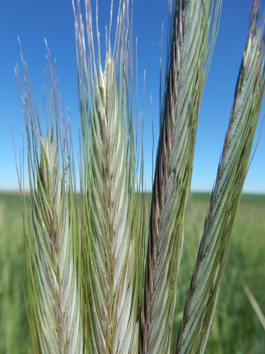

# Rye

> **Node ID**: plants.edible-plants.rye
> **Domain**: [Plants](./index.md)
> **Dependencies**: See prerequisites
> **Enables**: [`Edible Plants`](edible-plants.md)
> **Timeline**: Years 0-5
> **Outputs**: edible_plant_material
> **Critical**: No

## Overview

> *Rye/East Sussex, East Street*

> *Image: Helmut Zozmann, CC BY-SA 2.0*

Rye

*Secale cereale* (Poaceae) is a staple food crop species of major importance for civilization bootstrapping. Rye provides seeds/nuts, spice/beverage as its primary edible product and ranks 63/100 on the nutrition score.

An annual grass reaching 1.8 m (6 ft) tall and 0.1 m (4 in) wide. Hardy to UK zone 3, not frost tender. Flowers May to July; seeds ripen August to September. Hermaphroditic, wind-pollinated. Grows in light sandy, medium loamy, and heavy clay soils, preferring well-drained conditions across mildly acidic to mildly alkaline pH. Requires full sun, prefers moist soil, and tolerates drought. Withstands strong winds but not maritime exposure.

Edible parts: Seeds, Cereal, Sprouts, Seeds - coffee The seed is a widely used cereal, particularly in northern Europe for making bread. It contains around 13% protein and some gluten, though less than wheat, producing a denser loaf. It can also be used in cakes and similar baked goods, and sprouted seeds can be added to salads. Germinated seed is used to produce malt — a sweet substance extracted after roasting — which serves as a sweetening agent and is used in brewing beer. The roasted ungerminated seed can be used as a coffee substitute. Nutritional composition per 100g (dry weight, 380 calories): water 0%, protein 13.2g, fat 2.5g, carbohydrate 82.5g, fibre 2.2g, ash 2g; calcium 44mg, phosphorus 400mg, iron 4mg, sodium 4mg, potassium 524mg; thiamine (B1) 0.4mg, riboflavin (B2) 0.24mg, niacin 1.8mg. (Figures are the median of a reported range.)

For civilization bootstrapping, rye is significant because of its role as a staple crop. Reliable food production is the foundation upon which all other technological development rests. Understanding the cultivation, processing, and storage of *Secale cereale* enables communities to establish food security and allocate labor to non-subsistence activities.

*Secale cereale* is a member of the Poaceae family. As a staple food crop, it provides essential calories, protein, or other nutrients needed to sustain human populations during the bootstrap process. The ability to produce food reliably from cultivated plants is what separates sedentary civilizations from hunter-gatherer societies, because food surplus allows specialization of labor into toolmaking, construction, and eventually metallurgy and beyond.

This species grows as a perennial or annual depending on climate and management. Propagation is primarily by Sow seed in March or October in situ, barely covering the seed. Germination should occur within two weeks.. Harvest timing depends on the plant part used: seeds/nuts, spice/beverage are typically ready at specific growth stages or seasons.

## Prerequisites

### Materials

- Propagation material: Sow seed in March or October in situ, barely covering the seed. Germination should occur within two weeks.
- Compost or organic matter for soil amendment
- Mulch material for moisture retention and weed suppression

### Equipment

- Hoe or digging stick for soil preparation and planting
- Sickle, machete, or harvesting knife for crop harvest
- Drying racks or flat drying surfaces for post-harvest processing
- Storage containers: woven baskets, ceramic jars, or sacks for dried product
- Winnowing baskets or screens if processing grains or seeds

### Knowledge

- Species identification: An annual plant. It is a cereal grass. It grows to 60-200 cm high. It spreads to 30 cm across. It produces tufts. The stem is erect and bluish green. The leaves are rough and narrow. They are 30 cm long and 8 mm wide. The leaves are smooth on the lower surface. The flowers are dense, slender spikele
- Understanding of planting timing relative to local frost dates and rainy seasons
- Knowledge of soil preparation, seed depth, and spacing requirements
- Recognition of common pests and diseases and their early indicators
- Safe preparation methods for any toxic or bitter compounds (see Safety)

### Infrastructure

- Field or garden site with suitable climate, soil type, and sun exposure
- Reliable water access for germination and establishment phase
- Fenced or protected area if animal browsing is a risk
- Storage structure protected from moisture, rodents, and insects

## Process Description

### Cultivation and Propagation

An easily grown plant, it succeeds in most soils but prefers a well-drained light soil in a sunny position. It thrives on infertile, submarginal areas and is renouned for its ability to grow on sandy soils. Established plants are drought tolerant. The plant is reported to tolerate an annual precipitation in the range of of 22 to 176cm, an annual temperature in the range of of 4.3 to 21.3°C and a pH of 4.5 to 8.2. Rye is a widely cultivated temperate zone cereal crop. It is able to withstand severe climatic conditions and can be grown much further north and at higher altitudes than wheat. Average yields vary widely from country to country, the world average is around 1.6 tonnes per hectare with yields of almost 7 tonnes per hectare achieved in Norway. There are many named varieties. Rye is a rather variable species and botanists have divided it into a number of sub-species, all of which could be of value in breeding programmes. These sub-species are briefly listed below:- S. cereale afghanicum (Vavilov.)K.Hammer. Native to the Caucasus, western Asia and India. S. cereale ancestrale Zhuk. Native to western Asia. S. cereale dighoricum Vavilov. Native to the Caucasus and eastern europe. S. cereale segetale Zhuk. Native to temperate Asia. Rye grows well with cornflowers and pansies, though it inhibits the growth of poppies and couch grass. In garden design, as well as the above-ground architecture of a plant, root structure considerations help in choosing plants that work together for their optimal soil requirements including nutrients and water. Propagation: Sow seed in March or October in situ, barely covering the seed. Germination should occur within two weeks.

### Distribution and Growing Conditions

### Identification

An annual plant. It is a cereal grass. It grows to 60-200 cm high. It spreads to 30 cm across. It produces tufts. The stem is erect and bluish green. The leaves are rough and narrow. They are 30 cm long and 8 mm wide. The leaves are smooth on the lower surface. The flowers are dense, slender spikelets. They are 20 cm long. The spikelets are 2-flowered and strongly awned.

### Edible Parts and Preparation

## Quantitative Parameters

### Nutritional Composition (per 100g)

| Part | Moisture | kJ | kcal | Protein | Vit A | Vit C | Iron | Zinc |
| --- | --- | --- | --- | --- | --- | --- | --- | --- |
| Seeds | 12.5 | 1396 | 334 | 12.8 | 0 | 0 | 3 | 5.6 |

### Growing Parameters

| Parameter | Value | Notes |
|-----------|-------|-------|
| Germination temperature | 5°C | Optimal |
| Edible parts | Seeds/Nuts, Spice/Beverage | Primary harvest |

## Processing and Storage

### Non-Food Uses

The straw can be used as a fuel or industrial biomass. It is strong enough for thatching, paper making, and weaving mats and hats, and also serves as packing material for nursery stock, bricks, and tiles, as well as bedding, archery targets, and mushroom compost. Rye is a good green manure crop — fast growing with an extensive, deep root system. Sown in late autumn, it prevents soil erosion and nutrient leaching over winter and can be incorporated into the soil in spring. The root system also makes it useful for soil stabilisation, especially on sandy soils.

### Storage

Dry seeds thoroughly to below 14% moisture content before storage. Spread in thin layers on drying racks in full sun, stirring periodically. Test dryness by biting: properly dried seeds crack rather than dent. Store in airtight containers (ceramic jars with tight lids, sealed woven bags) in a cool, dry, dark location. Protect from rodents and insects with tight lids or by mixing with inert ash. Under good conditions, dried grains and legumes store for 1-5 years with minimal loss.

### Material Handling

Handle rye produce with clean hands and tools to prevent contamination. Remove field heat promptly after harvest by moving product to shade. Process within the recommended timeframe to prevent quality loss. Compost crop residues and processing waste to return organic matter to the soil. Label stored products with harvest date, variety, and any treatments applied.

## Scaling Notes

- **Bench scale**: Individual plants or small garden plot (10-50 plants). Output for direct household consumption. Useful for seed saving, variety selection, and learning the crop's behavior under local conditions.
- **Pilot scale**: Field planting of 0.1 to 1 hectare (500-5,000 plants). Staggered planting or sequential harvests to extend availability. Requires basic hand tools and family-level labor. Surplus can be traded or stored.
- **Production scale**: Multi-hectare cultivation with mechanized planting, harvesting, and processing. Requires plow animals or tractors, grain mills or processing equipment, and bulk storage facilities. Enables community-level food security and trade.

Key scaling challenges include maintaining genetic diversity at plantation scale, managing pest and disease pressure in monoculture, and matching post-harvest processing capacity to harvest volume. Seed saving and variety selection at bench scale directly informs decisions about which cultivars to scale up.

## Troubleshooting

| Problem | Probable Cause | Solution |
|---------|---------------|----------|
| Poor germination | Old seed, wrong soil temperature, planted too deep, or insufficient moisture | Use fresh seed; verify germination temperature range; plant at recommended depth; maintain soil moisture during germination |
| Pest damage | Insect infestation or browsing animals | Hand-pick pests; use companion planting with repellent species; install fencing for larger pests |
| Disease (fungal/bacterial) | Poor air circulation, excessive moisture, infected seed | Space plants adequately; avoid overhead watering; use clean seed from disease-free plants; practice crop rotation |
| Low yield | Nutrient deficiency, water stress, overcrowding, or shade | Amend soil with compost or manure; ensure adequate water at critical growth stages; thin to recommended spacing; plant in full sun |
| Storage losses | Insufficient drying, rodent/insect damage, high humidity | Dry product thoroughly before storage; use sealed containers; inspect stored product regularly; keep storage area clean and dry |
| Quality or safety note | See species-specific notes | There are 6-8 Secale species. |

## Safety Considerations

Working with *Secale cereale* involves the following hazards:

- Tool injuries during harvest and processing — use sharp tools in good condition and cut away from the body
- Allergic reactions to plant compounds — sensitive individuals should test small quantities first
- Sun exposure and heat stress during field work — schedule heavy work for early morning or late afternoon
- Musculoskeletal strain from repetitive harvesting motions — vary tasks and take regular breaks

### Personal Protective Equipment

- Sturdy gloves when handling plants with irritant sap, spines, or rough surfaces
- Long sleeves and trousers for field work to reduce skin exposure to irritants and insects
- Eye protection when using cutting tools overhead or near face level
- Sun hat and sunscreen for extended field work

### Emergency Procedures

- For suspected plant poisoning: stop eating immediately, save a sample of the plant material, and seek medical attention. Do not induce vomiting unless directed by a medical professional.
- For tool lacerations: apply direct pressure with a clean cloth, elevate the wound, and seek medical attention for cuts deeper than skin level.
- For allergic reaction (swelling, difficulty breathing): discontinue exposure immediately and seek emergency medical help.

## Quality Control

### Acceptance Criteria

- Harvest product shows expected color, texture, size, and flavor for the variety grown
- No visible mold, rot, pest damage, or foreign material in stored product
- Dried products are brittle throughout with no flexible or moist spots
- Seeds intended for storage test at below 14% moisture content

### Testing Methods

- **Visual inspection**: check for discoloration, mold, insect damage, or foreign material
- **Bite test (seeds/grains)**: properly dried seeds crack cleanly; under-dried seeds dent or feel leathery
- **Smell test**: fresh product has characteristic aroma; off-odors indicate spoilage or contamination
- **Snap test (dried products)**: properly dried material snaps rather than bends

### Sampling Protocol

For field-scale production, inspect every 10th plant during harvest for disease and pest damage. Grade each batch by size and quality before storage. Record yield per unit area to track productivity trends across seasons and identify declining performance early.

## Variations and Alternatives

### Medicinal Uses

The seed can be made into a poultice and applied to tumours. It also acts as an effective laxative due to its fibrous seed coat.

### Other Uses

### Additional Information

It has occasionally been planted in trials in Papua New Guinea. It is a cultivated food plant.

### Notes

There are 6-8 Secale species.

### Related Species

- [Wheat](wheat.md)
- [Rice](rice.md)
- [Maize](maize.md)
- [Potato](potato.md)
- [Cassava](cassava.md)

### Cultivar Selection

Within *Secale cereale*, considerable variation exists in yield, disease resistance, climate adaptation, and quality characteristics. When establishing a rye crop, select varieties adapted to local conditions: day length, temperature range, rainfall pattern, and soil type. Landrace varieties — locally adapted populations maintained by traditional farmers — often outperform modern cultivars under low-input conditions because they have been selected for resilience rather than maximum yield under optimal conditions.

Seed saving from the best-performing plants each generation gradually adapts the variety to local conditions. Select for vigor, disease resistance, appropriate maturity timing, and product quality. Maintain genetic diversity by saving seed from multiple plants rather than a single individual, which preserves the population's ability to adapt to changing conditions and disease pressures.

### Crop Rotation and Companion Planting

*Secale cereale* benefits from crop rotation to prevent buildup of species-specific pests and diseases. Avoid planting in the same field in consecutive seasons where possible. Follow with a different crop family to break pest cycles and maintain soil health.

Companion planting with aromatic herbs or flowering plants can deter pests and attract beneficial insects. Avoid planting near species that compete for the same nutrients or harbor shared pathogens.

## References

- [Edible Plants](edible-plants.md) — parent capability
- [Plants Domain](./index.md) — domain overview and related capabilities
- [Agave](agave.md) — example plant article format
- [Food Processing](../food-processing/index.md) — downstream processing of harvested crops
- [Agriculture](../agriculture/index.md) — cultivation systems and crop rotation
- Family: Poaceae
- Distribution: Andorra, United Arab Emirates, Afghanistan, Antigua &amp; Barbuda, Albania, Armenia, Angola, Argentina, Austria, Australia, Azerbaijan, Bosnia &amp; Herzegovina, Barbados, Bangladesh, Belgium, Burkina Faso, Bulgaria, Bahrain, Burundi, Benin and 166 more
- Data sourced from Food Plants International, Wikipedia, and iNaturalist via the Edible Plant Database (ZIM)
- Plants for a Future (pfaf.org) — supplementary cultivation and use data

---
*Part of the [Bootciv Tech Tree](../index.md) · [Plants](./index.md) · [All Domains](../index.md)*
