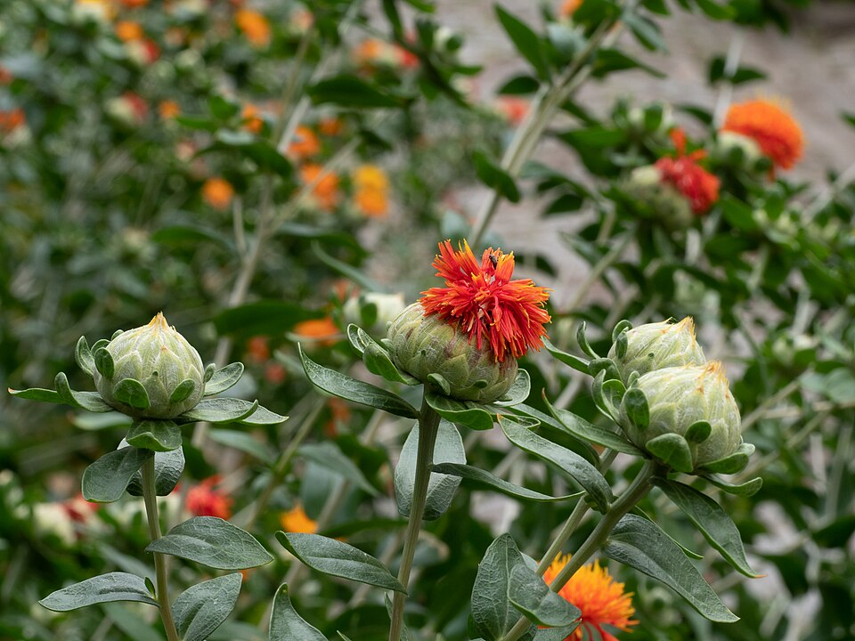

# Safflower

> **Node ID**: plants.edible-plants.safflower
> **Domain**: [Plants](./index.md)
> **Dependencies**: See prerequisites
> **Enables**: [`Edible Plants`](edible-plants.md)
> **Timeline**: Years 0-5
> **Outputs**: edible_plant_material
> **Critical**: No

## Overview

> *OLYMPUS DIGITAL CAMERA*

> *Image: Esin Üstün from Istanbul, Turkey, CC BY 2.0*

Safflower

*Carthamus tinctorius* (Asteraceae) is a oilseed & spice crop species of major importance for civilization bootstrapping. Safflower provides leaves, seeds/nuts, flowers as its primary edible product and ranks 69/100 on the nutrition score.

An annual growing to 1 m tall and 0.4 m wide. Foliage appears May to October; flowers August to October; seeds mature September to October. Hermaphroditic and self-fertile flowers pollinated by insects. Grows in light sandy and medium loamy, well-drained soils and tolerates poor soil. Establishes in mildly acidic to very alkaline pH. Requires full sun, tolerates both dry and moist soils, and handles drought well.

Edible parts: Seeds, Leaves, Seeds - oil, Flowers, Spice, Vegetable An edible oil extracted from the seed contains a higher proportion of essential unsaturated fatty acids and a lower proportion of saturated fatty acids than most other edible vegetable seed oils. Light-coloured and easily clarified, it is used in salad dressings, cooking oils, and margarines. It is considered a very stable oil, regarded as healthier than many alternatives, and its inclusion in the diet is said to help reduce blood cholesterol levels. The seed can also be cooked — roasted, or fried and eaten in chutneys — and the fried seeds are used as a curdling agent for plant milks. Tender young leaves and shoots can be eaten raw or cooked, with a sweet flavour suitable as a spinach substitute; as a food source it is considered a famine food, used only when other options are exhausted. The flowers yield both a yellow and a red dye used in food: the yellow serves as a saffron substitute to flavour and colour dishes.

Plants take 120 days to maturity. Seeds are ripe about 35-40 days after maximum flowering. Plants are harvested when leaves turn brown.

For civilization bootstrapping, safflower is significant because of its role as a oilseed & spice crop. Reliable food production is the foundation upon which all other technological development rests. Understanding the cultivation, processing, and storage of *Carthamus tinctorius* enables communities to establish food security and allocate labor to non-subsistence activities.

*Carthamus tinctorius* is a member of the Asteraceae family. As a oilseed & spice crop, it provides essential calories, protein, or other nutrients needed to sustain human populations during the bootstrap process. The ability to produce food reliably from cultivated plants is what separates sedentary civilizations from hunter-gatherer societies, because food surplus allows specialization of labor into toolmaking, construction, and eventually metallurgy and beyond.

This species grows as a perennial or annual depending on climate and management. Propagation is primarily by Sow seed in spring with gentle heat in a greenhouse. Germination usually occurs within 2–4 weeks at 15°C. Once large enough to handle, prick seedlings into individual pots and plant into permanent positions in late spring or early summer. Seed can also be sown in situ in April or May, though plants may not ripen their seed under those conditions.. Harvest timing depends on the plant part used: leaves, seeds/nuts, flowers, spice/beverage are typically ready at specific growth stages or seasons.

## Prerequisites

### Materials

- Propagation material: Sow seed in spring with gentle heat in a greenhouse. Germination usually occurs within 2–4 weeks at 15°C. Once large enough to handle, prick seedlings into individual pots and plant into permanent positions in late spring or early summer. Seed can also be sown in situ in April or May, though plants may not ripen their seed under those conditions.
- Compost or organic matter for soil amendment
- Mulch material for moisture retention and weed suppression

### Equipment

- Hoe or digging stick for soil preparation and planting
- Sickle, machete, or harvesting knife for crop harvest
- Drying racks or flat drying surfaces for post-harvest processing
- Storage containers: woven baskets, ceramic jars, or sacks for dried product
- Winnowing baskets or screens if processing grains or seeds

### Knowledge

- Species identification: An erect annual herb. It grows to 60-150 cm high. It has any branches. It has spines but the number vary. The stems are white and stiff and round with fine grooves along their length. The kinds with more spiny leaves are better for oil production. The leaves are arranged in spirals around the stem. 
- Understanding of planting timing relative to local frost dates and rainy seasons
- Knowledge of soil preparation, seed depth, and spacing requirements
- Recognition of common pests and diseases and their early indicators
- Safe preparation methods for any toxic or bitter compounds (see Safety)

### Infrastructure

- Field or garden site with suitable climate, soil type, and sun exposure
- Reliable water access for germination and establishment phase
- Fenced or protected area if animal browsing is a risk
- Storage structure protected from moisture, rodents, and insects

## Process Description

### Cultivation and Propagation

Succeeds in ordinary garden soil. Safflower thrives in heavy clays with good water-holding capacity, but will also grow satisfactorily in deep sandy or clay loams with good drainage. It needs soil moisture from the time of planting until it is flowering. It requires a well-drained soil and a position in full sun. Safflower is reported to tolerate an annual precipitation of 20 to 137cm, an annual average temperature range of 6.3 to 27.5deg.C and a pH in the range of 5.4 to 8.2. Plants are reported to tolerate bacteria, disease, drought, frost, fungus, high pH, phage, salt, sand, rust, virus and wind. Safflower grows in the temperate zone in areas where wheat and barley do well, and grows slowly during periods of cool short days in early part of season. Seedlings can withstand temperatures lower than many species; however, varieties differ greatly in their tolerance to frost; in general, frost damages budding and flowering thus reducing yields and quality. Safflower is a long-day plant, requiring a photoperiod of about 14 hours. It is shade and weed intolerant, will not grow as a weed because other wild plants overshadow it before it becomes established. It is about as salt tolerant as cotton, but less so than barley. Safflower matures in from 110-150 days from planting to harvest as a spring crop, as most of it is grown, and from 200 or more days as an autumn-sown crop. It should be harvested when the plant is thoroughly dried. Since the seeds do not shatter easily, it may be harvested by direct combining. The crop is allowed to dry in the fields before threshing. Plants are self-fertile, though cross-pollination also takes place. Plants have a sturdy taproot that can penetrate 2.5 metres into the soil. Safflower has been grown for thousands of years for the dye that can be obtained from the flowers. This is not much used nowadays, having been replaced by chemical dyes, but the plant is still widely cultivated commercially for its oil-rich seed in warm temperate and tropical areas of the world. There are many named varieties. A number of spineless cultivars have been developed, but at present these produce much lower yields of oil than the spiny varieties. Safflower is unlikely to be a worthwhile crop in Britain since it only ripens its seed here in long hot summers. There is more chance of success in the drier eastern part of the country with its usually warmer summers, the cooler moister conditions in the west tend to act against the production of viable seed. Propagation: Sow seed in spring with gentle heat in a greenhouse. Germination usually occurs within 2–4 weeks at 15°C. Once large enough to handle, prick seedlings into individual pots and plant into permanent positions in late spring or early summer. Seed can also be sown in situ in April or May, though plants may not ripen their seed under those conditions.

### Distribution and Growing Conditions

### Identification

An erect annual herb. It grows to 60-150 cm high. It has any branches. It has spines but the number vary. The stems are white and stiff and round with fine grooves along their length. The kinds with more spiny leaves are better for oil production. The leaves are arranged in spirals around the stem. They do not have leaf stalks. The leaves are dark green and glossy. They are 10-15 cm long and 2-4 cm wide. The flower head is made up of many small flowers. They are 13 mm long and like tubes. They are yellow to orange in colour. The fruit is 4 angled and a hard hull and a single white or grey seed. The seed is oblong.

### Edible Parts and Preparation

## Quantitative Parameters

### Nutritional Composition (per 100g)

| Part | Moisture | kJ | kcal | Protein | Vit A | Vit C | Iron | Zinc |
| --- | --- | --- | --- | --- | --- | --- | --- | --- |
| Seeds | 5.6 | 2163 | 517 | 16.18 | 5 | 0 | 4.9 | 5.5 |
| Leaves | — | — | — | — | — | — | — | — |
| Flowers | — | — | — | — | — | — | — | — |
| Seeds - oil | — | — | — | — | — | — | — | — |

### Growing Parameters

| Parameter | Value | Notes |
|-----------|-------|-------|
| Growing period | 35–40 days | Maturity range |
| Altitude | 1600–2000 m | Growing elevation |
| Germination temperature | 20°C | Optimal |
| Hardiness zones | 4-10 | USDA |
| Edible parts | Leaves, Seeds/Nuts, Flowers, Spice/Beverage | Primary harvest |

## Processing and Storage

### Non-Food Uses

The seed yields up to 40% of a drying oil used in lighting, paint, varnishes, linoleum, and wax cloths, and can also serve as a diesel substitute. The oil does not yellow with age. Heated to 300°C for 2 hours and poured into cold water, it solidifies into a gelatinous mass used as a cement for glass, tiles, and stones, or as a substitute for plaster of Paris. Heated to 307°C for 2½ hours, it becomes a stiff elastic solid through polymerisation, suitable for making waterproof cloth. A yellow dye obtained by steeping the flowers in water is used as a saffron substitute; a red dye obtained by steeping in alcohol is used for dyeing cloth and, mixed with talcum powder, as a rouge for colouring the cheeks.

### Storage

Dry seeds thoroughly to below 14% moisture content before storage. Spread in thin layers on drying racks in full sun, stirring periodically. Test dryness by biting: properly dried seeds crack rather than dent. Store in airtight containers (ceramic jars with tight lids, sealed woven bags) in a cool, dry, dark location. Protect from rodents and insects with tight lids or by mixing with inert ash. Under good conditions, dried grains and legumes store for 1-5 years with minimal loss.

### Material Handling

Handle safflower produce with clean hands and tools to prevent contamination. Remove field heat promptly after harvest by moving product to shade. Process within the recommended timeframe to prevent quality loss. Compost crop residues and processing waste to return organic matter to the soil. Label stored products with harvest date, variety, and any treatments applied.

## Scaling Notes

- **Bench scale**: Individual plants or small garden plot (10-50 plants). Output for direct household consumption. Useful for seed saving, variety selection, and learning the crop's behavior under local conditions.
- **Pilot scale**: Field planting of 0.1 to 1 hectare (500-5,000 plants). Staggered planting or sequential harvests to extend availability. Requires basic hand tools and family-level labor. Surplus can be traded or stored.
- **Production scale**: Multi-hectare cultivation with mechanized planting, harvesting, and processing. Requires plow animals or tractors, grain mills or processing equipment, and bulk storage facilities. Enables community-level food security and trade.
  Reported production data: Plants take 120 days to maturity. Seeds are ripe about 35-40 days after maximum flowering. Plants are harvested when leaves turn brown.

Key scaling challenges include maintaining genetic diversity at plantation scale, managing pest and disease pressure in monoculture, and matching post-harvest processing capacity to harvest volume. Seed saving and variety selection at bench scale directly informs decisions about which cultivars to scale up.

## Troubleshooting

| Problem | Probable Cause | Solution |
|---------|---------------|----------|
| Poor germination | Old seed, wrong soil temperature, planted too deep, or insufficient moisture | Use fresh seed; verify germination temperature range; plant at recommended depth; maintain soil moisture during germination |
| Pest damage | Insect infestation or browsing animals | Hand-pick pests; use companion planting with repellent species; install fencing for larger pests |
| Disease (fungal/bacterial) | Poor air circulation, excessive moisture, infected seed | Space plants adequately; avoid overhead watering; use clean seed from disease-free plants; practice crop rotation |
| Low yield | Nutrient deficiency, water stress, overcrowding, or shade | Amend soil with compost or manure; ensure adequate water at critical growth stages; thin to recommended spacing; plant in full sun |
| Storage losses | Insufficient drying, rodent/insect damage, high humidity | Dry product thoroughly before storage; use sealed containers; inspect stored product regularly; keep storage area clean and dry |
| Quality or safety note | See species-specific notes | There are 14 Carthamus species. They are thistle like plants. They are mostly Mediterranean. |

## Safety Considerations

Working with *Carthamus tinctorius* involves the following hazards:

- **Toxicity**: Parts of this plant may contain compounds that are toxic when raw or improperly prepared. Always follow proper preparation procedures before consumption. Verify with multiple authoritative sources.
- Tool injuries during harvest and processing — use sharp tools in good condition and cut away from the body
- Allergic reactions to plant compounds — sensitive individuals should test small quantities first
- Sun exposure and heat stress during field work — schedule heavy work for early morning or late afternoon
- Musculoskeletal strain from repetitive harvesting motions — vary tasks and take regular breaks

### Personal Protective Equipment

- Sturdy gloves when handling plants with irritant sap, spines, or rough surfaces
- Long sleeves and trousers for field work to reduce skin exposure to irritants and insects
- Eye protection when using cutting tools overhead or near face level
- Sun hat and sunscreen for extended field work

### Emergency Procedures

- For suspected plant poisoning: stop eating immediately, save a sample of the plant material, and seek medical attention. Do not induce vomiting unless directed by a medical professional.
- For tool lacerations: apply direct pressure with a clean cloth, elevate the wound, and seek medical attention for cuts deeper than skin level.
- For allergic reaction (swelling, difficulty breathing): discontinue exposure immediately and seek emergency medical help.

## Quality Control

### Acceptance Criteria

- Harvest product shows expected color, texture, size, and flavor for the variety grown
- No visible mold, rot, pest damage, or foreign material in stored product
- Dried products are brittle throughout with no flexible or moist spots
- Seeds intended for storage test at below 14% moisture content

### Testing Methods

- **Visual inspection**: check for discoloration, mold, insect damage, or foreign material
- **Bite test (seeds/grains)**: properly dried seeds crack cleanly; under-dried seeds dent or feel leathery
- **Smell test**: fresh product has characteristic aroma; off-odors indicate spoilage or contamination
- **Snap test (dried products)**: properly dried material snaps rather than bends

### Sampling Protocol

For field-scale production, inspect every 10th plant during harvest for disease and pest damage. Grade each batch by size and quality before storage. Record yield per unit area to track productivity trends across seasons and identify declining performance early.

## Variations and Alternatives

### Medicinal Uses

Safflower is widely grown as a food plant but also carries a broad range of medicinal applications. Modern research has identified several medically active constituents in the flowers, including the capacity to reduce coronary heart disease and lower cholesterol levels. The plant is alterative, analgesic, antibacterial, antiphlogistic, and haemopoietic, and has been used to treat tumours and stomatitis. The flowers are anticholesterolemic, diaphoretic, emmenagogue, laxative, purgative, sedative, and stimulant. They are used to treat menstrual pains and complications by promoting smooth menstrual flow, and ranked third in a survey of 250 potential anti-fertility plants. In domestic practice, flowers substitute or adulterate saffron in treating infant complaints such as measles, fevers, and eruptive skin conditions. Applied externally, they address bruising, sprains, skin inflammations, and wounds. Flowers are harvested in summer and may be used fresh or dried, but should not be stored for longer than 12 months. It is possible to pick only the florets and leave the ovaries intact so seed can still be produced, though this is time-consuming. When combined with Ligusticum wallichii, the plant is said to have a definite therapeutic effect on coronary diseases. The whole plant is also febrifuge, sedative, sudorific, and vermifuge. The seed is diuretic, purgative, and tonic, used in treating rheumatism and tumours, particularly inflammatory tumours of the liver. The oil is charred and applied to heal sores and treat rheumatism; in Iran it is used as a salve for sprains and rheumatism.

### Other Uses

### Additional Information

It is cultivated.

### Notes

There are 14 Carthamus species. They are thistle like plants. They are mostly Mediterranean.

### Related Species

- [Sunflower](sunflower.md)
- [Oil Palm](oil-palm.md)
- [Rapeseed](rapeseed.md)
- [Sesame](sesame.md)
- [Castor](castor.md)

### Cultivar Selection

Within *Carthamus tinctorius*, considerable variation exists in yield, disease resistance, climate adaptation, and quality characteristics. When establishing a safflower crop, select varieties adapted to local conditions: day length, temperature range, rainfall pattern, and soil type. Landrace varieties — locally adapted populations maintained by traditional farmers — often outperform modern cultivars under low-input conditions because they have been selected for resilience rather than maximum yield under optimal conditions.

Seed saving from the best-performing plants each generation gradually adapts the variety to local conditions. Select for vigor, disease resistance, appropriate maturity timing, and product quality. Maintain genetic diversity by saving seed from multiple plants rather than a single individual, which preserves the population's ability to adapt to changing conditions and disease pressures.

### Crop Rotation and Companion Planting

*Carthamus tinctorius* benefits from crop rotation to prevent buildup of species-specific pests and diseases. Avoid planting in the same field in consecutive seasons where possible. Follow with a different crop family to break pest cycles and maintain soil health.

Companion planting with aromatic herbs or flowering plants can deter pests and attract beneficial insects. Avoid planting near species that compete for the same nutrients or harbor shared pathogens.

## References

- [Edible Plants](edible-plants.md) — parent capability
- [Plants Domain](./index.md) — domain overview and related capabilities
- [Agave](agave.md) — example plant article format
- [Food Processing](../food-processing/index.md) — downstream processing of harvested crops
- [Agriculture](../agriculture/index.md) — cultivation systems and crop rotation
- Family: Asteraceae
- Distribution: Andorra, United Arab Emirates, Afghanistan, Antigua &amp; Barbuda, Albania, Armenia, Angola, Argentina, Austria, Australia, Azerbaijan, Bosnia &amp; Herzegovina, Barbados, Bangladesh, Belgium, Burkina Faso, Bulgaria, Bahrain, Burundi, Benin and 176 more
- Data sourced from Food Plants International, Wikipedia, and iNaturalist via the Edible Plant Database (ZIM)
- Plants for a Future (pfaf.org) — supplementary cultivation and use data

---
*Part of the [Bootciv Tech Tree](../index.md) · [Plants](./index.md) · [All Domains](../index.md)*
