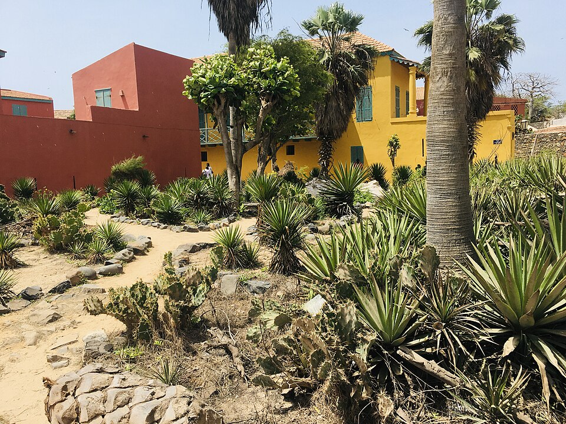

# Sisal

> **Node ID**: plants.edible-plants.sisal
> **Domain**: [Plants](./index.md)
> **Dependencies**: See prerequisites
> **Enables**: [`Edible Plants`](edible-plants.md)
> **Timeline**: Years 0-5
> **Outputs**: edible_plant_material
> **Critical**: No

## Overview

> *Fleurs des alpes et des montagnes : Agave Sisal*

> *Image: Omzo93, CC BY-SA 4.0*

Sisal

*Agave sisalana* (Asparagaceae) is a fiber & industrial crop species of major importance for civilization bootstrapping. Sisal, Hemp provides leaves, flowers, bark/sap as its primary edible product.

Agave sisalana is a fast-growing evergreen perennial reaching 2 m tall and wide. Hardy to UK zone 10 but frost-tender. Self-fertile and able to grow in semi-shade (light woodland) or full sun. Adapts to light sandy, medium loamy, or heavy clay well-drained soils with poor fertility tolerated. Suitable for mildly acidic, neutral, or mildly alkaline pH. Handles dry or moist conditions and tolerates drought.

Edible parts: Leaves, Sap, Plant heart, Flower stalk, Vegetable The heart of new shoots is edible when cooked. Sap from the flower stalk is fermented to make an alcoholic drink. The roots are used in the production of an alcoholic beverage.

The plant is fast growing.

For civilization bootstrapping, sisal is significant because of its role as a fiber & industrial crop. Reliable food production is the foundation upon which all other technological development rests. Understanding the cultivation, processing, and storage of *Agave sisalana* enables communities to establish food security and allocate labor to non-subsistence activities.

*Agave sisalana* is a member of the Asparagaceae family. As a fiber & industrial crop, it provides essential calories, protein, or other nutrients needed to sustain human populations during the bootstrap process. The ability to produce food reliably from cultivated plants is what separates sedentary civilizations from hunter-gatherer societies, because food surplus allows specialization of labor into toolmaking, construction, and eventually metallurgy and beyond.

This species grows as a perennial or annual depending on climate and management. Propagation is primarily by Plants are normally grown from suckers or from bulbils on the flower stalk. Very few seeds will grow. Seed can be collected by allowing pods to dry on the plant before breaking them open. Propagation is also possible by dividing offsets. The whole plant dies after flowering, which normally occurs after 7 years.. Harvest timing depends on the plant part used: leaves, flowers, bark/sap are typically ready at specific growth stages or seasons.

## Prerequisites

### Materials

- Propagation material: Plants are normally grown from suckers or from bulbils on the flower stalk. Very few seeds will grow. Seed can be collected by allowing pods to dry on the plant before breaking them open. Propagation is also possible by dividing offsets. The whole plant dies after flowering, which normally occurs after 7 years.
- Compost or organic matter for soil amendment
- Mulch material for moisture retention and weed suppression

### Equipment

- Hoe or digging stick for soil preparation and planting
- Sickle, machete, or harvesting knife for crop harvest
- Drying racks or flat drying surfaces for post-harvest processing
- Storage containers: woven baskets, ceramic jars, or sacks for dried product
- Winnowing baskets or screens if processing grains or seeds

### Knowledge

- Species identification: A woody herb. It grows for several years. The leaves come out in spirals and have spines. The leaves occur near ground level. The leaves are sword shaped and 2 m long. The leaves end in a sharp dark brown tip. The plant flowers at maturity. The flowers occur in a stem which can be 6-8 m tall. The fl
- Understanding of planting timing relative to local frost dates and rainy seasons
- Knowledge of soil preparation, seed depth, and spacing requirements
- Recognition of common pests and diseases and their early indicators
- Safe preparation methods for any toxic or bitter compounds (see Safety)

### Infrastructure

- Field or garden site with suitable climate, soil type, and sun exposure
- Reliable water access for germination and establishment phase
- Fenced or protected area if animal browsing is a risk
- Storage structure protected from moisture, rodents, and insects

## Process Description

### Cultivation and Propagation

It grows best in areas where annual daytime temperatures are within the range 15 - 27c, but can tolerate 10 - 45c. It can be killed by temperatures of -5c or lower. It prefers a mean annual rainfall in the range 900 - 1,250mm, but tolerates 500 - 1,800mm. Requires a sunny position in a well-drained soil. Prefers a pH in the range 6 - 7.5, tolerating 5.5 - 8. The plant has escaped from cultivation in many of the areas in which it is cultivated and has become invasive in some areas including several of the Pacific Islands and Australia. Harvesting the leaves for fibre can begin 2 - 4 years after planting, depending on temperature, and usually continues for about 10, occasionally up to 20, years before the plant flowers and dies. The average yield is about 0.9 tonnes/ha of dried fibres. On the best plantations in East Africa, yearly yields of 2.0 - 2.5 tonnes/ha of dried fibres are obtained. A monocarpic species - the plant lives for several years without flowering but dies once it does flower. However, it normally produces plenty of suckers during its life and these continue growing, taking about 10 - 15 years in a warm climate, considerably longer in colder ones, before flowering. The roots rarely go deeper than about 35cm. One ton of fibre removes about 30 kg N, 5 kg P, 80 kg K, 65 kg Ca and 40 kg Mg from the field. Because the fibres contain few minerals, most of the nutrients can be returned to the land with the pulp. The main harvest of the agave hearts (piñas) occurs after about 7 to 10 years, typically in late winter to early spring, depending on the climate and growing conditions. Agave usually flowers once it reaches maturity, which can be after 7 to 10 years. The flowering period generally occurs from late spring to summer. Propagation: Plants are normally grown from suckers or from bulbils on the flower stalk. Very few seeds will grow. Seed can be collected by allowing pods to dry on the plant before breaking them open. Propagation is also possible by dividing offsets. The whole plant dies after flowering, which normally occurs after 7 years.

### Distribution and Growing Conditions

### Identification

A woody herb. It grows for several years. The leaves come out in spirals and have spines. The leaves occur near ground level. The leaves are sword shaped and 2 m long. The leaves end in a sharp dark brown tip. The plant flowers at maturity. The flowers occur in a stem which can be 6-8 m tall. The flowers are small and green to yellow. The fruit is a dry capsule which contains seed. Few seed will grow. Some flower buds become thick and develop into bulbils. These can be planted and will grow. Suckers are produced at the base of the leaves.

### Edible Parts and Preparation

The heart of new shoots is edible when cooked. Sap from the flower stalk is fermented to make an alcoholic beverage (pulque-like). Roots are used in production of alcoholic beverages. These food uses are secondary — sisal's primary value is leaf fiber production for rope, twine, and industrial textiles.

### Harvesting for Fiber

Sisal is a perennial succulent producing leaves continuously for 7-10 years before flowering and dying:

1. **First harvest**: Begin harvesting leaves 2-3 years after planting, when leaves reach full length. Suckers planted from established plants mature faster than bulbil-grown plants.
2. **Leaf selection**: Cut outer (oldest) leaves at the base with a sharp machete or sickle. Each mature plant produces 25-30 harvestable leaves per year. Leaves are 1-2 m long, 10-15 cm wide at the base, sword-shaped with a sharp dark brown terminal spine. Inner leaves are left to continue growing.
3. **Frequency**: Harvest every 6-12 months, taking the 3-5 outermost leaves from each plant. More frequent harvesting (every 6 months) produces finer, more flexible fiber; less frequent harvesting (annual) produces coarser, stronger fiber suitable for rope.
4. **Plantation lifespan**: Productive for 7-10 years (sometimes up to 20 years in favorable conditions) before the plant flowers and dies. The plant produces suckers throughout its life that replace it, maintaining the plantation indefinitely with proper management.
5. **Yield**: Average 0.9 tonnes/ha dried fiber per year. Best East African plantations achieve 2.0-2.5 tonnes/ha. Each leaf contains 2-3% dry fiber by weight — approximately 1,000 kg of fresh leaves yields 20-30 kg of dry fiber.
6. **Critical timing**: Process leaves immediately after cutting. Fresh leaves decorticate cleanly; dried leaves resist fiber separation and produce inferior fiber.

### Decortication (Fiber Extraction)

Decortication separates the fibrous strands from the fleshy leaf pulp by mechanical crushing and scraping:

**Mechanical Decortication (Standard Method)**

1. Feed fresh leaves one at a time into a decortication machine: paired rotating rollers (corrugated steel drums) that crush the leaf, followed by a rotating drum fitted with blunt knives that scrape away the crushed pulp.
2. The rollers flatten and crush the fleshy tissue while the blunt knives scrape it away from the longitudinal fiber bundles. The fiber strands pass through; the pulp is flung away by centrifugal force.
3. Water sprays continuously during decortication to wash away loose pulp and prevent fiber damage from friction heat.
4. A single mechanized decorticator processes 200-500 leaves per hour. Throughput depends on leaf size, operator skill, and machine condition.

**Hand Decortication (Low-Technology Method)**

1. Place a fresh leaf on a flat wooden surface or inclined beating board.
2. Beat the leaf with a wooden mallet along its entire length to crush the fleshy pulp and separate it from the fiber strands.
3. Turn the leaf and repeat on the opposite side.
4. Scrape away loosened pulp with a blunt knife or the edge of a wooden blade. Pull the fiber strands free from the remaining pulp.
5. Hand decortication processes 15-30 leaves per hour — slow but requires no machinery. Suitable for small-scale production.

### Washing

After decortication, fibers retain residual pulp and mucilage that must be removed:

1. Rinse fiber strands thoroughly in clean running water or a series of washing tanks. Agitate by hand to dislodge pulp particles.
2. For mechanical operations, pass fibers through a water bath with gentle agitation. Change water frequently to prevent re-deposition of pulp.
3. Washing quality directly affects final fiber grade — residual pulp causes discoloration and reduces fiber strength and flexibility.
4. Properly washed fiber appears clean, pale greenish-white, with no visible pulp residue.

### Drying

1. Spread washed fiber strands loosely on drying racks, lines, or clean flat surfaces in full sun.
2. Dry for 2-3 days, turning periodically to ensure even drying. In tropical sun, fiber dries to below 12% moisture content within 48 hours.
3. Do not dry on bare ground — soil contamination degrades fiber quality. Use raised racks or clean concrete/paved surfaces.
4. Properly dried fiber is stiff, brittle, and pale cream to white in color. Incompletely dried fiber (moisture above 15%) is prone to mold during storage.
4. Artificial drying at 50-60°C in a forced-air dryer reduces drying time to 4-6 hours but requires fuel or electrical energy.

### Brushing (Combing)

1. Pass dried fiber through a brushing machine — a rotating cylinder covered in steel wire bristles that combs and separates the fiber strands.
2. Brushing removes remaining short fibers (tow), residual pulp particles, and loose material. It also aligns the long fibers and produces a smooth, clean finish.
3. Hand brushing: draw fiber bundles through a series of graduated steel combs (hackles), starting coarse and finishing fine. Labor-intensive but produces well-aligned fiber.
4. Brushed fiber should be uniform, smooth, and free of short fibers and debris. This step significantly affects the commercial grade and spinning quality of the final product.

### Grading

Sisal fiber is graded by length, color, cleanliness, and strength. The major international grades:

| Grade | Length | Color | Characteristics |
|-------|--------|-------|-----------------|
| Grade 1 (Superior) | >90 cm | White to cream | Clean, uniform, strong |
| Grade 2 (Good) | 70-90 cm | Pale cream | Minor color variation |
| Grade 3 (Fair) | 50-70 cm | Cream to yellow | Some pulp residue |
| Grade 4 (Reject) | <50 cm | Yellow to brown | Irregular, short, dirty |

Grading is done by visual inspection and manual measurement. Bundle each grade separately for sale. Higher grades command significantly better prices and are used for rope and twine; lower grades go to paper pulp, upholstery stuffing, or reinforcing material.

### Decortication Waste Utilization

Decortication removes ~90% of the leaf mass as waste pulp (bagasse). This waste has economic value:

1. **Biogas production**: Anaerobic digestion of sisal waste in covered tanks produces methane biogas suitable for cooking, lighting, or running engines. One tonne of fresh sisal waste yields approximately 30-40 m³ of biogas (60-65% methane). The biogas can fuel the decortication plant itself, creating a closed energy loop.
2. **Fertilizer/compost**: Sisal waste composts readily. Mix with animal manure and turn periodically for 3-6 months to produce nitrogen-rich compost. The waste contains most of the nutrients removed from the field — returning it as compost maintains soil fertility. One tonne of fiber removes ~30 kg N, 5 kg P, 80 kg K from the field; most of these nutrients are in the waste pulp, not the fiber.
3. **Cattle feed**: Fresh sisal pulp can be fed to cattle in limited quantities (supplement, not sole feed). The pulp contains sugars and moisture but also saponins that limit digestibility. Ensilage (fermentation in sealed pits) improves palatability and feed value.
4. **Paper pulp**: Short fibers and waste material are processed into cellulose pulp for paper and cardboard production, similar to kenaf processing.
5. **Building material**: Dried sisal waste mixed with mud or clay produces lightweight building blocks with improved insulation properties. Can also be pressed into particle board with a suitable binder.

### Sisal Fiber Properties

| Property | Value | Notes |
|----------|-------|-------|
| Fiber length | 1.0-1.5 m | Harvested fiber strand length |
| Tensile strength | 350-600 MPa | Hard fiber; weaker than bast fibers but adequate for rope |
| Density | 1.35-1.45 g/cm³ | |
| Cellulose content | 55-70% | Dry fiber weight |
| Lignin content | 8-14% | |
| Moisture regain | 10-12% | At 65% relative humidity |
| Color (dried) | Pale cream to white | Properly processed |
| Saltwater resistance | Excellent | Does not degrade in marine environments — preferred for marine rope |
| Elasticity | Low (2-3% elongation) | Stiff fiber; sudden rope failure under extreme load |
| UV resistance | Moderate | Degrades with prolonged sun exposure; treat with tar for outdoor rope |

Key strengths: excellent saltwater resistance (unlike hemp or jute, which rot in marine use), long fiber length, drought-tolerant crop, grows on poor soils, low-input cultivation.

Key weaknesses: rope tends to break suddenly (low elasticity, no warning stretch), coarser and stiffer than bast fibers, cannot be spun as finely as jute, degrades under prolonged UV exposure.

## Quantitative Parameters

### Growing Parameters

| Parameter | Value | Notes |
|-----------|-------|-------|
| Hardiness zones | 9-11 | USDA |
| Edible parts | Leaves, Flowers, Bark/Sap | Primary harvest |

## Processing and Storage

### Non-Food Uses

The plant is cultivated for use as fencing and for protection against soil erosion. Short fibres from the leaves, obtained as by-products, are used for production of compost. The leaves yield one of the most important hard fibres commercially, used for making ropes, strings of all kinds, fishing nets, hammocks, door curtains, floor covers, and bags. The fibre cannot be spun as finely as jute and ropes tend to break suddenly. Short fibres are also used to produce cellulose, paper, and upholstery material, and to reinforce plaster boards and paper. Waste material remaining after fibre extraction is reported to be molluscicidal and fungistatic and can be used as mulch. The sharp leaf spines are traditionally used as needles. The flowers are rich in nectar and pollen, attracting pollinators including bees and butterflies.

### Storage

Harvest at peak maturity and process promptly. Most plant products can be preserved by drying, fermenting, or storing in cool conditions. Test storage readiness by checking for residual moisture — properly dried material should be brittle, not flexible. Label all stored products with harvest date and variety.

### Material Handling

Handle sisal produce with clean hands and tools to prevent contamination. Remove field heat promptly after harvest by moving product to shade. Process within the recommended timeframe to prevent quality loss. Compost crop residues and processing waste to return organic matter to the soil. Label stored products with harvest date, variety, and any treatments applied.

## Scaling Notes

- **Bench scale**: Individual plants or small garden plot (10-50 plants). Output for direct household consumption. Useful for seed saving, variety selection, and learning the crop's behavior under local conditions.
- **Pilot scale**: Field planting of 0.1 to 1 hectare (500-5,000 plants). Staggered planting or sequential harvests to extend availability. Requires basic hand tools and family-level labor. Surplus can be traded or stored.
- **Production scale**: Multi-hectare cultivation with mechanized planting, harvesting, and processing. Requires plow animals or tractors, grain mills or processing equipment, and bulk storage facilities. Enables community-level food security and trade.
  Reported production data: The plant is fast growing.

Key scaling challenges include maintaining genetic diversity at plantation scale, managing pest and disease pressure in monoculture, and matching post-harvest processing capacity to harvest volume. Seed saving and variety selection at bench scale directly informs decisions about which cultivars to scale up.

## Troubleshooting

| Problem | Probable Cause | Solution |
|---------|---------------|----------|
| Poor germination | Old seed, wrong soil temperature, planted too deep, or insufficient moisture | Use fresh seed; verify germination temperature range; plant at recommended depth; maintain soil moisture during germination |
| Pest damage | Insect infestation or browsing animals | Hand-pick pests; use companion planting with repellent species; install fencing for larger pests |
| Disease (fungal/bacterial) | Poor air circulation, excessive moisture, infected seed | Space plants adequately; avoid overhead watering; use clean seed from disease-free plants; practice crop rotation |
| Low yield | Nutrient deficiency, water stress, overcrowding, or shade | Amend soil with compost or manure; ensure adequate water at critical growth stages; thin to recommended spacing; plant in full sun |
| Storage losses | Insufficient drying, rodent/insect damage, high humidity | Dry product thoroughly before storage; use sealed containers; inspect stored product regularly; keep storage area clean and dry |
| Quality or safety note | See species-specific notes | There are about 250 Agave species. The Agavaceae are mostly in the tropics and subtropics. |

## Safety Considerations

Working with *Agave sisalana* involves the following hazards:

- Tool injuries during harvest and processing — use sharp tools in good condition and cut away from the body
- Allergic reactions to plant compounds — sensitive individuals should test small quantities first
- Sun exposure and heat stress during field work — schedule heavy work for early morning or late afternoon
- Musculoskeletal strain from repetitive harvesting motions — vary tasks and take regular breaks

### Personal Protective Equipment

- Sturdy gloves when handling plants with irritant sap, spines, or rough surfaces
- Long sleeves and trousers for field work to reduce skin exposure to irritants and insects
- Eye protection when using cutting tools overhead or near face level
- Sun hat and sunscreen for extended field work

### Emergency Procedures

- For suspected plant poisoning: stop eating immediately, save a sample of the plant material, and seek medical attention. Do not induce vomiting unless directed by a medical professional.
- For tool lacerations: apply direct pressure with a clean cloth, elevate the wound, and seek medical attention for cuts deeper than skin level.
- For allergic reaction (swelling, difficulty breathing): discontinue exposure immediately and seek emergency medical help.

## Quality Control

### Acceptance Criteria

- Harvest product shows expected color, texture, size, and flavor for the variety grown
- No visible mold, rot, pest damage, or foreign material in stored product
- Dried products are brittle throughout with no flexible or moist spots
- Seeds intended for storage test at below 14% moisture content

### Testing Methods

- **Visual inspection**: check for discoloration, mold, insect damage, or foreign material
- **Bite test (seeds/grains)**: properly dried seeds crack cleanly; under-dried seeds dent or feel leathery
- **Smell test**: fresh product has characteristic aroma; off-odors indicate spoilage or contamination
- **Snap test (dried products)**: properly dried material snaps rather than bends

### Sampling Protocol

For field-scale production, inspect every 10th plant during harvest for disease and pest damage. Grade each batch by size and quality before storage. Record yield per unit area to track productivity trends across seasons and identify declining performance early.

## Variations and Alternatives

### Medicinal Uses

Sisal is a folk remedy for dysentery, leprosy sores, and syphilis. The leaves contain hecogenin, which is used in the partial synthesis of the drug cortisone, and the plant is a recognised source of hecogenin.

### Other Uses

### Additional Information

It is not known if it is used for food in Papua New Guinea.

### Notes

There are about 250 Agave species. The Agavaceae are mostly in the tropics and subtropics.

### Related Species

- [Cotton](cotton.md)
- [Flax](flax.md)
- [Hemp](hemp.md)
- [Ramie](ramie.md)
- [Kenaf](kenaf.md)

### Cultivar Selection

Within *Agave sisalana*, considerable variation exists in yield, disease resistance, climate adaptation, and quality characteristics. When establishing a sisal crop, select varieties adapted to local conditions: day length, temperature range, rainfall pattern, and soil type. Landrace varieties — locally adapted populations maintained by traditional farmers — often outperform modern cultivars under low-input conditions because they have been selected for resilience rather than maximum yield under optimal conditions.

Seed saving from the best-performing plants each generation gradually adapts the variety to local conditions. Select for vigor, disease resistance, appropriate maturity timing, and product quality. Maintain genetic diversity by saving seed from multiple plants rather than a single individual, which preserves the population's ability to adapt to changing conditions and disease pressures.

### Crop Rotation and Companion Planting

*Agave sisalana* benefits from crop rotation to prevent buildup of species-specific pests and diseases. Avoid planting in the same field in consecutive seasons where possible. Follow with a different crop family to break pest cycles and maintain soil health.

Companion planting with aromatic herbs or flowering plants can deter pests and attract beneficial insects. Avoid planting near species that compete for the same nutrients or harbor shared pathogens.

## References

- [Edible Plants](edible-plants.md) — parent capability
- [Plants Domain](./index.md) — domain overview and related capabilities
- [Agave](agave.md) — example plant article format
- [Food Processing](../food-processing/index.md) — downstream processing of harvested crops
- [Agriculture](../agriculture/index.md) — cultivation systems and crop rotation
- Family: Asparagaceae
- Distribution: United Arab Emirates, Afghanistan, Antigua &amp; Barbuda, Albania, Armenia, Angola, Argentina, Australia, Azerbaijan, Bosnia &amp; Herzegovina, Barbados, Bangladesh, Burkina Faso, Bahrain, Burundi, Benin, Brunei, Bolivia, Brazil, Bahamas and 144 more
- Data sourced from Food Plants International, Wikipedia, and iNaturalist via the Edible Plant Database (ZIM)
- Plants for a Future (pfaf.org) — supplementary cultivation and use data

---
*Part of the [Bootciv Tech Tree](../index.md) · [Plants](./index.md) · [All Domains](../index.md)*
