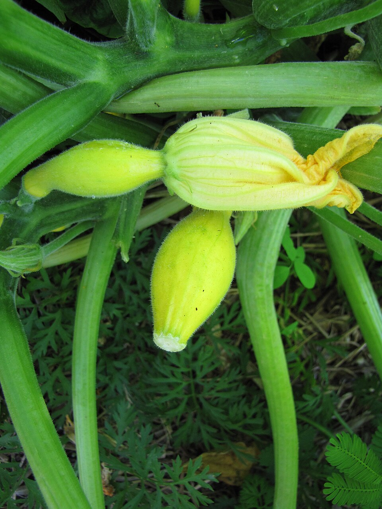

# Squash

> **Node ID**: plants.edible-plants.squash
> **Domain**: [Plants](./index.md)
> **Dependencies**: See prerequisites
> **Enables**: [`Edible Plants`](edible-plants.md)
> **Timeline**: Years 0-5
> **Outputs**: edible_plant_material
> **Critical**: Yes

## Overview

> *starr-110822-8269-plant-Cucurbita_pepo-summer_squash_yellow_zucchini_flower_and_fruit-Hawea_Pl_Olinda*

> *Image: Forest and Kim Starr, CC BY 2.0*

Squash

*Cucurbita pepo* (Cucurbitaceae) is a vegetable crop species of major importance for civilization bootstrapping. Marrow, Pumpkin provides fruit, leaves, seeds/nuts as its primary edible product.

Cucurbita pepo is a cultivated plant of the genus Cucurbita. It yields varieties of winter squash and pumpkin, but the most widespread varieties belong to the subspecies Cucurbita pepo subsp. pepo, called summer squash. It has been domesticated in the Americas for thousands of years, from where it was spread by early colonisers to Europe and later across the rest of the Old World in the context of the Columbian Exchange. Some authors maintain that C. pepo is derived from C. texana, while others suggest that C. texana is merely feral C. pepo. They have a wide variety of uses, especially as a food source. C. pepo seems more closely related to C. fraterna, though disagreements exist about the exact nature of that connection, too. It is a host species for the melonworm moth, the squash vine borer, and the pickleworm. They are also the preferred pollen source for squash bees, which are the primary pollinators in the Americas.

Edible parts: Fruit, Seeds, Leaves, Vegetable, Flowers The fruit is cooked and used as a vegetable; it has a mild, watery flavour and is often harvested very young as courgettes. Because it has little flavour of its own, it is commonly used as a base for savoury dishes — the seeds are scooped out and a filling added before baking. Seeds can be eaten raw or cooked, or ground into a powder and mixed with cereals for bread-making. They are rich in oil with a pleasant nutty flavour, though small and covered in a fibrous coat. Seeds can also be sprouted and used in salads, though some caution is advised. An edible oil is obtained from the seed. Leaves and young stems are cooked as a potherb. Flowers and flower buds can be cooked or dried for later use. The root is reportedly edible when cooked, though this is uncertain. Dried flowers provide 308 calories per 100g, with 26.9g protein, 5.8g fat, 51.9g carbohydrate, 11.5g fibre, and 15.4g ash. Minerals include calcium 904mg, phosphorus 1653mg, and iron 19.2mg per 100g. Vitamins include A 7692mg, thiamine 0.38mg, riboflavin 2.12mg, niacin 11.54mg, and vitamin C 346mg per 100g.

The first usable immature fruit are ready 7-8 weeks after planting.

For civilization bootstrapping, squash is significant because of its role as a vegetable crop. Reliable food production is the foundation upon which all other technological development rests. Understanding the cultivation, processing, and storage of *Cucurbita pepo* enables communities to establish food security and allocate labor to non-subsistence activities.

*Cucurbita pepo* is a member of the Cucurbitaceae family. As a vegetable crop, it provides essential calories, protein, or other nutrients needed to sustain human populations during the bootstrap process. The ability to produce food reliably from cultivated plants is what separates sedentary civilizations from hunter-gatherer societies, because food surplus allows specialization of labor into toolmaking, construction, and eventually metallurgy and beyond.

This species grows as a perennial or annual depending on climate and management. Propagation is primarily by Sow seed in April in a greenhouse in rich soil; germination should take place within 2 weeks. Sow 2 or 3 seeds per pot and thin to the best plant. The seed requires a minimum temperature of 13°C to germinate. Grow on quickly and plant out after the last expected frosts, giving cloche or frame protection for at least the first few weeks outdoors until plants are growing strongly.. Harvest timing depends on the plant part used: fruit, leaves, seeds/nuts, flowers are typically ready at specific growth stages or seasons.

## Prerequisites

### Materials

- Propagation material: Sow seed in April in a greenhouse in rich soil; germination should take place within 2 weeks. Sow 2 or 3 seeds per pot and thin to the best plant. The seed requires a minimum temperature of 13°C to germinate. Grow on quickly and plant out after the last expected frosts, giving cloche or frame protection for at least the first few weeks outdoors until plants are growing strongly.
- Compost or organic matter for soil amendment
- Mulch material for moisture retention and weed suppression

### Equipment

- Hoe or digging stick for soil preparation and planting
- Sickle, machete, or harvesting knife for crop harvest
- Drying racks or flat drying surfaces for post-harvest processing
- Storage containers: woven baskets, ceramic jars, or sacks for dried product
- Winnowing baskets or screens if processing grains or seeds

### Knowledge

- Species identification: A bristly hairy annual vine in the pumpkin family. It has branched tendrils. The stems are angular and prickly. The leaves are roughly triangular. The leaves have 5 lobes which are pointed at the end and are toothed around the edge. Male and female plants are separate on the same plant. Male flowers
- Understanding of planting timing relative to local frost dates and rainy seasons
- Knowledge of soil preparation, seed depth, and spacing requirements
- Recognition of common pests and diseases and their early indicators
- Safe preparation methods for any toxic or bitter compounds (see Safety)

### Infrastructure

- Field or garden site with suitable climate, soil type, and sun exposure
- Reliable water access for germination and establishment phase
- Fenced or protected area if animal browsing is a risk
- Storage structure protected from moisture, rodents, and insects

## Process Description

### Cultivation and Propagation

Requires a rich, well-drained moisture retentive soil and a very warm, sunny and sheltered position. Prefers a pH of 5.5 to 5.9, but tolerates up to 6.8. Plants are tolerant of light shade (This comment is probably more applicable to warmer climates than Britain.). A frost-tender annual plant, the pumpkin or marrow is widely cultivated in temperate and tropical zones for its edible fruit. It has long been grown as a domestic plant and a number of different groups have been developed. Botanists have tried to classify these groups, though there is considerable overlap and clear distinctions are not always possible. Since they are very similar in their cultivation needs, we have treated all the groups together in this entry. The botanists classification is as follows:- C. pepo pepo. This includes the vegetable marrows, zucchinis, pumpkins and ornamental gourds. There are many named varieties and these can vary considerably in size, shape and flavour. The cultivars with larger and rounder fruits are usually called pumpkins, the fruits are harvested in the autumn and can be stored for a few months. The marrows are smaller than pumpkins and generally sausage-shaped. These can also be harvested in the autumn and stored for a few months, but it is more usual to eat them whilst they are still very small, when they are known as courgettes. Harvesting the fruits of the marrows when very small stimulates the plant into making more flowers (and hence fruits) so it can be a very productive way of using the plant. Pumpkins and marrows succeed outdoors most summers in Britain, in fact many of these varieties are well adapted to cool growing conditions and therefore do well in the British climate. C. pepo pepo fraterna. This is the probable progenitor of the marrows and so is of potential value in any breeding programmes. C. pepo ovifera. This group includes various summer squashes including the acorn, crookneck and patty pan squashes. C. pepo ovifera ozarkana. A probable ancestor of the summer squashes, it could be of value in breeding programmes. C. pepo texana. The texas gourd, or wild marrow, is another form that could be of value in breeding programmes. Plants produce both male and female flowers. These are insect pollinated but in cool weather it is worthwhile hand pollinating. Most cultivars are day-length neutral and so are able to flower and fruit throughout the British summer. A fast-growing plant, trailing forms can be used to provide a summer screen. This species does not hybridize naturally with other edible members of this genus. Squashes and pumpkins can be differentiated from each other by their fruit stalk, it is angular and polygonal in pumpkins but thick, soft and round in squashes. Pumpkins grow well with sweetcorn and thornapple but they dislike growing near potatoes. They also grow well with nasturtiums, mint, beans and radishes. Propagation: Sow seed in April in a greenhouse in rich soil; germination should take place within 2 weeks. Sow 2 or 3 seeds per pot and thin to the best plant. The seed requires a minimum temperature of 13°C to germinate. Grow on quickly and plant out after the last expected frosts, giving cloche or frame protection for at least the first few weeks outdoors until plants are growing strongly.

### Distribution and Growing Conditions

### Identification

A bristly hairy annual vine in the pumpkin family. It has branched tendrils. The stems are angular and prickly. The leaves are roughly triangular. The leaves have 5 lobes which are pointed at the end and are toothed around the edge. Male and female plants are separate on the same plant. Male flowers are carried on long grooved flower stalks. Female flowers are borne on shorter more angular stalks. The fruit stalks have furrows along them but are not fattened near the stalk. The fruit vary in shape, size and colour. Often they are oval and yellow and 20 cm long by 15 cm wide. The seeds are smaller than pumpkin and easy to separate from the tissue. The scar at their tip is rounded or horizontal, not oblique. There are a large number of cultivated varieties.

### Edible Parts and Preparation

## Quantitative Parameters

### Growing Parameters

| Parameter | Value | Notes |
|-----------|-------|-------|
| Germination temperature | 29°C | Optimal |
| Hardiness zones | 8-11 | USDA |
| Edible parts | Fruit, Leaves, Seeds/Nuts, Flowers | Primary harvest |

## Processing and Storage

### Non-Food Uses

The seed contains 34–54% of a semi-drying oil, which has been used for lighting.

### Storage

Dry seeds thoroughly to below 14% moisture content before storage. Spread in thin layers on drying racks in full sun, stirring periodically. Test dryness by biting: properly dried seeds crack rather than dent. Store in airtight containers (ceramic jars with tight lids, sealed woven bags) in a cool, dry, dark location. Protect from rodents and insects with tight lids or by mixing with inert ash. Under good conditions, dried grains and legumes store for 1-5 years with minimal loss.

### Material Handling

Handle squash produce with clean hands and tools to prevent contamination. Remove field heat promptly after harvest by moving product to shade. Process within the recommended timeframe to prevent quality loss. Compost crop residues and processing waste to return organic matter to the soil. Label stored products with harvest date, variety, and any treatments applied.

## Scaling Notes

- **Bench scale**: Individual plants or small garden plot (10-50 plants). Output for direct household consumption. Useful for seed saving, variety selection, and learning the crop's behavior under local conditions.
- **Pilot scale**: Field planting of 0.1 to 1 hectare (500-5,000 plants). Staggered planting or sequential harvests to extend availability. Requires basic hand tools and family-level labor. Surplus can be traded or stored.
- **Production scale**: Multi-hectare cultivation with mechanized planting, harvesting, and processing. Requires plow animals or tractors, grain mills or processing equipment, and bulk storage facilities. Enables community-level food security and trade.
  Reported production data: The first usable immature fruit are ready 7-8 weeks after planting.

Key scaling challenges include maintaining genetic diversity at plantation scale, managing pest and disease pressure in monoculture, and matching post-harvest processing capacity to harvest volume. Seed saving and variety selection at bench scale directly informs decisions about which cultivars to scale up.

## Troubleshooting

| Problem | Probable Cause | Solution |
|---------|---------------|----------|
| Poor germination | Old seed, wrong soil temperature, planted too deep, or insufficient moisture | Use fresh seed; verify germination temperature range; plant at recommended depth; maintain soil moisture during germination |
| Pest damage | Insect infestation or browsing animals | Hand-pick pests; use companion planting with repellent species; install fencing for larger pests |
| Disease (fungal/bacterial) | Poor air circulation, excessive moisture, infected seed | Space plants adequately; avoid overhead watering; use clean seed from disease-free plants; practice crop rotation |
| Low yield | Nutrient deficiency, water stress, overcrowding, or shade | Amend soil with compost or manure; ensure adequate water at critical growth stages; thin to recommended spacing; plant in full sun |
| Storage losses | Insufficient drying, rodent/insect damage, high humidity | Dry product thoroughly before storage; use sealed containers; inspect stored product regularly; keep storage area clean and dry |
| Quality or safety note | See species-specific notes | There are 25 Cucurbita species. |

## Safety Considerations

Working with *Cucurbita pepo* involves the following hazards:

- **Toxicity**: Parts of this plant may contain compounds that are toxic when raw or improperly prepared. Always follow proper preparation procedures before consumption. Verify with multiple authoritative sources.
- Tool injuries during harvest and processing — use sharp tools in good condition and cut away from the body
- Allergic reactions to plant compounds — sensitive individuals should test small quantities first
- Sun exposure and heat stress during field work — schedule heavy work for early morning or late afternoon
- Musculoskeletal strain from repetitive harvesting motions — vary tasks and take regular breaks

### Personal Protective Equipment

- Sturdy gloves when handling plants with irritant sap, spines, or rough surfaces
- Long sleeves and trousers for field work to reduce skin exposure to irritants and insects
- Eye protection when using cutting tools overhead or near face level
- Sun hat and sunscreen for extended field work

### Emergency Procedures

- For suspected plant poisoning: stop eating immediately, save a sample of the plant material, and seek medical attention. Do not induce vomiting unless directed by a medical professional.
- For tool lacerations: apply direct pressure with a clean cloth, elevate the wound, and seek medical attention for cuts deeper than skin level.
- For allergic reaction (swelling, difficulty breathing): discontinue exposure immediately and seek emergency medical help.

## Quality Control

### Acceptance Criteria

- Harvest product shows expected color, texture, size, and flavor for the variety grown
- No visible mold, rot, pest damage, or foreign material in stored product
- Dried products are brittle throughout with no flexible or moist spots
- Seeds intended for storage test at below 14% moisture content

### Testing Methods

- **Visual inspection**: check for discoloration, mold, insect damage, or foreign material
- **Bite test (seeds/grains)**: properly dried seeds crack cleanly; under-dried seeds dent or feel leathery
- **Smell test**: fresh product has characteristic aroma; off-odors indicate spoilage or contamination
- **Snap test (dried products)**: properly dried material snaps rather than bends

### Sampling Protocol

For field-scale production, inspect every 10th plant during harvest for disease and pest damage. Grade each batch by size and quality before storage. Record yield per unit area to track productivity trends across seasons and identify declining performance early.

## Variations and Alternatives

### Medicinal Uses

Pumpkin has a long history of medicinal use in Central and North America. It is a gentle remedy particularly valued for removing tapeworms in children and pregnant women, for whom stronger or more toxic treatments are unsuitable. The seeds are mildly diuretic and vermifuge; the whole seed including the husk is used against tapeworms — ground to a fine flour, made into an emulsion with water, and eaten, followed by a purgative to expel parasites. While less potent than the root of Dryopteris felix-mas for this purpose, the seeds are safer for pregnant women, debilitated patients, and children. The seeds are also used to treat hypertrophy of the prostate; being high in zinc, they have been used successfully in early-stage prostate problems. The diuretic action has been applied in treating nephritis and other urinary complaints. The leaves are applied externally to burns, and the plant's sap and fruit pulp can be used similarly. The fruit pulp is prepared as a decoction to relieve intestinal inflammation.

### Other Uses

### Additional Information

It is a commercially cultivated vegetable. Not widely distributed in Papua New Guinea. Not as common as pumpkins. It is sold in local markets.

### Notes

There are 25 Cucurbita species.

### Related Species

- [Cabbage](cabbage.md)
- [Wild Tomato](wild-tomato.md)
- [Carrot](carrot.md)
- [Onion](onion.md)
- [Garlic](garlic.md)

### Cultivar Selection

Within *Cucurbita pepo*, considerable variation exists in yield, disease resistance, climate adaptation, and quality characteristics. When establishing a squash crop, select varieties adapted to local conditions: day length, temperature range, rainfall pattern, and soil type. Landrace varieties — locally adapted populations maintained by traditional farmers — often outperform modern cultivars under low-input conditions because they have been selected for resilience rather than maximum yield under optimal conditions.

Seed saving from the best-performing plants each generation gradually adapts the variety to local conditions. Select for vigor, disease resistance, appropriate maturity timing, and product quality. Maintain genetic diversity by saving seed from multiple plants rather than a single individual, which preserves the population's ability to adapt to changing conditions and disease pressures.

### Crop Rotation and Companion Planting

*Cucurbita pepo* benefits from crop rotation to prevent buildup of species-specific pests and diseases. Avoid planting in the same field in consecutive seasons where possible. Follow with a different crop family to break pest cycles and maintain soil health.

Companion planting with aromatic herbs or flowering plants can deter pests and attract beneficial insects. Avoid planting near species that compete for the same nutrients or harbor shared pathogens.

## References

- [Edible Plants](edible-plants.md) — parent capability
- [Plants Domain](./index.md) — domain overview and related capabilities
- [Agave](agave.md) — example plant article format
- [Food Processing](../food-processing/index.md) — downstream processing of harvested crops
- [Agriculture](../agriculture/index.md) — cultivation systems and crop rotation
- Family: Cucurbitaceae
- Distribution: Andorra, United Arab Emirates, Afghanistan, Antigua &amp; Barbuda, Albania, Armenia, Angola, Argentina, Austria, Australia, Azerbaijan, Bosnia &amp; Herzegovina, Barbados, Bangladesh, Belgium, Burkina Faso, Bulgaria, Bahrain, Burundi, Benin and 179 more
- Data sourced from Food Plants International, Wikipedia, and iNaturalist via the Edible Plant Database (ZIM)
- Plants for a Future (pfaf.org) — supplementary cultivation and use data

---
*Part of the [Bootciv Tech Tree](../index.md) · [Plants](./index.md) · [All Domains](../index.md)*
