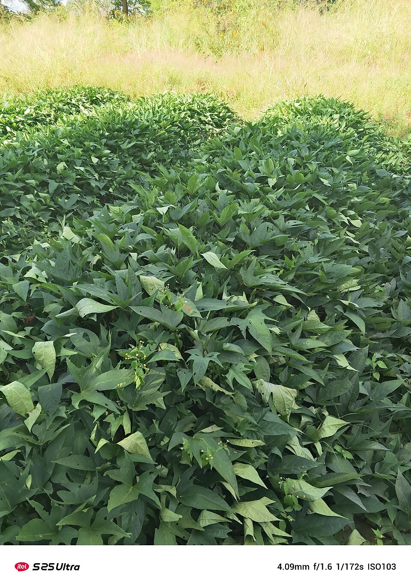

# Sweet Potato

> **Node ID**: plants.edible-plants.sweet-potato
> **Domain**: [Plants](./index.md)
> **Dependencies**: See prerequisites
> **Enables**: [`Edible Plants`](edible-plants.md)
> **Timeline**: Years 0-5
> **Outputs**: edible_plant_material
> **Critical**: Yes

## Overview

> *This is an image with the theme "Farm to Plate" from:*

> *Image: Ivykas, CC BY-SA 4.0*

Sweet Potato

*Ipomoea batatas* (Convolvulaceae) is a staple food crop species of major importance for civilization bootstrapping. Sweet Potato, Black Sweet Potato, Sweet Potato Vine provides leaves, roots, shoots as its primary edible product.

Edible parts: Leaves, Root, Shoots Root - cooked. Sweet and fleshy, it is a delicious staple food and is also very nutritious providing a rich source of vitamins and minerals. There are cultivars with soft, moist flesh and also forms with a more dry flesh. There are also less sweet cultivars, bred for industrial production of starch. In order for the roots to store through the winter, they need to be cured in the sunshine at temperatures around 25°c fr about a week before being stored at around 14°c. Young shoot tips.

For civilization bootstrapping, sweet potato is significant because of its role as a staple crop. Reliable food production is the foundation upon which all other technological development rests. Understanding the cultivation, processing, and storage of *Ipomoea batatas* enables communities to establish food security and allocate labor to non-subsistence activities.

*Ipomoea batatas* is a member of the Convolvulaceae family. As a staple food crop, it provides essential calories, protein, or other nutrients needed to sustain human populations during the bootstrap process. The ability to produce food reliably from cultivated plants is what separates sedentary civilizations from hunter-gatherer societies, because food surplus allows specialization of labor into toolmaking, construction, and eventually metallurgy and beyond.

This species grows as a perennial or annual depending on climate and management. Propagation is primarily by Pre-soak the seed for 12 hours in warm water, or scarify the seed, and sow in individual pots in a greenhouse in early spring. The seed usually germinates in 1 - 3 weeks at 22°c. Plants are extremely resentful of root disturbance, even when they are quite small, and should be potted up almost as soon as they germinate. Grow them on in the greenhouse for at least their first winter then plant them out into their permanent positions in late spring or early summer, after the last expected frosts. Seedlings can be very variable and are likely to be less productive than vegetatively produced plants. Stem cuttings obtained from terminal shoots. Remove the lower leaves and insert the cuttings to half their depth in individual pots.. Harvest timing depends on the plant part used: leaves, roots, shoots are typically ready at specific growth stages or seasons.

## Prerequisites

### Materials

- Propagation material: Pre-soak the seed for 12 hours in warm water, or scarify the seed, and sow in individual pots in a greenhouse in early spring. The seed usually germinates in 1 - 3 weeks at 22°c. Plants are extremely resentful of root disturbance, even when they are quite small, and should be potted up almost as soon as they germinate. Grow them on in the greenhouse for at least their first winter then plant them out into their permanent positions in late spring or early summer, after the last expected frosts. Seedlings can be very variable and are likely to be less productive than vegetatively produced plants. Stem cuttings obtained from terminal shoots. Remove the lower leaves and insert the cuttings to half their depth in individual pots.
- Compost or organic matter for soil amendment
- Mulch material for moisture retention and weed suppression

### Equipment

- Hoe or digging stick for soil preparation and planting
- Sickle, machete, or harvesting knife for crop harvest
- Drying racks or flat drying surfaces for post-harvest processing
- Storage containers: woven baskets, ceramic jars, or sacks for dried product
- Winnowing baskets or screens if processing grains or seeds

### Knowledge

- Species identification: Ipomoea batatas is a perennial climbing vine growing to 3 m at a fast rate. It is hardy to USDA zone 9 and is frost tender. The species is hermaphrodite (has both male and female organs) and is pollinated by insects, especially bees. The plant is self-fertile. Leaves are heart-shaped or lobed, 5-15 cm long, on petioles 5-30 cm long. Storage roots are the primary edible part, variable in shape (fusiform to globular), skin color (white, cream, yellow, orange, red, purple), and flesh color (white, yellow, orange, purple).
- Understanding of planting timing relative to local frost dates and rainy seasons
- Knowledge of soil preparation, seed depth, and spacing requirements
- Recognition of common pests and diseases and their early indicators
- Safe preparation methods for any toxic or bitter compounds (see Safety)

### Infrastructure

- Field or garden site with suitable climate, soil type, and sun exposure
- Reliable water access for germination and establishment phase
- Fenced or protected area if animal browsing is a risk
- Storage structure protected from moisture, rodents, and insects

## Process Description

### Cultivation and Propagation

An easily grown plant. Sweet potato is a plant of the tropics, but can also be grown in the subtropics and, if there is a sufficient growing season of 110 - 170 days, as an annual crop in warmer parts of the temperate zone. It is grown in the tropics at elevations up to 2,800 metres. It grows best in areas where annual daytime temperatures are within the range 18 - 28°c, but can tolerate 10 - 38°c. When dormant, the roots can survive temperatures down to about 1°c, but young growth can be killed by temperatures of 5°c. It prefers a mean annual rainfall in the range 750 - 2,000mm, but tolerates 350 - 5,000mm. An easily grown plant, it prefers a well-drained, sandy loam soil and requires a sunny position. Ample potash in the soil is essential for a good crop. Prefers a pH in the range 5 - 7, tolerating 4 - 8.7. A low humidity as the plants reach maturity is beneficial. Plants grow very vigorously in the tropics. They have escaped from cultivation in some areas and become invasive. Unlike many root crops, the sweet potato begins to store starch at an early age, making early harvests possible. It is one of the most efficient plants to capture the energy of the sun as calories. The plant can mature a crop within 2 months in tropical areas, though at least three months are required in sub-tropical regions. Optimum yields vary from 17.5 - 27.5 tonnes per hectare depending on the cultivar and growing conditions, while average yields are 5 tonnes per hectare in Africa, 10 tonnes in South America and 16 tonnes in Asia. The world highest production yield at 80 tonnes has been obtained in Israel. A short-day plant, it requires less than 11 hours of sunlight per day to initiate flowering. However, day length variation appears to have little effect upon tuber production. Sweet Potato Vine is self-fertile. Harvest typically occurs in late summer to early autumn, usually around 90-120 days after planting, depending on the variety. Sweet Potato Vine flowers in late summer to early autumn. Sweet Potato Vine is a fast-growing plant, often covering ground quickly and reaching full size within a few months. Propagation: Pre-soak the seed for 12 hours in warm water, or scarify the seed, and sow in individual pots in a greenhouse in early spring. The seed usually germinates in 1 - 3 weeks at 22°c. Plants are extremely resentful of root disturbance, even when they are quite small, and should be potted up almost as soon as they germinate. Grow them on in the greenhouse for at least their first winter then plant them out into their permanent positions in late spring or early summer, after the last expected frosts. Seedlings can be very variable and are likely to be less productive than vegetatively produced plants. Stem cuttings obtained from terminal shoots. Remove the lower leaves and insert the cuttings to half their depth in individual pots.

### Distribution and Growing Conditions

Pantropical. NORTHERN AMERICA: Mexico, Veracruz de Ignacio de la Llave,

### Identification

Ipomoea batatas is a PERENNIAL CLIMBER growing to 3 m (9ft 10in) at a fast rate. See above for USDA hardiness. It is hardy to UK zone 9 and is frost tender. The species is hermaphrodite (has both male and female organs) and is pollinated by Insects, especially bees. The plant is self-fertile. It is noted for attracting wildlife. Suitable for: light (sandy) and medium (loamy) soils and prefers well-drained soil. Suitable pH: mildly acid and neutral soils. It cannot grow in the shade. It prefers moist soil.

### Edible Parts and Preparation

### Harvesting

Harvest sweet potato roots when leaves begin to yellow and before the first frost kills the vines — typically 90-150 days after planting, depending on variety and climate. Frost-damaged roots do not store. Cut vines at ground level 2-3 days before digging to let skins begin to set. Dig carefully with a fork or spade, starting 30 cm from the plant center to avoid stabbing roots. Handle roots gently — even minor skin abrasions provide entry for decay organisms during storage. Sort at harvest: separate damaged, cut, or diseased roots for immediate use, and reserve unblemished roots for storage. Yield: 10-40 tonnes per hectare depending on variety and conditions.

### Curing

Curing is essential for storage. It heals harvest wounds, thickens the skin, and converts starches to sugars for sweeter flavor:

1. Place roots in a warm (29-32°C), humid (85-90% relative humidity) environment for 5-10 days.
2. Good air circulation prevents condensation and mold. Stack roots loosely in crates or on racks, not in deep piles.
3. During curing, a suberized (corky) layer forms over cuts and abrasions, sealing them against infection. The starch-to-sugar conversion improves sweetness.
4. After curing, the roots are ready for storage or immediate use. Uncured roots lose moisture rapidly and decay quickly.

A simple curing structure: a small room or pit lined with straw, heated with a fire or hot water containers, with damp burlap covering the roots to maintain humidity.

### Storage

Store cured roots at 13-15°C and 85% relative humidity:

- **Temperature is critical**: Below 10°C causes chilling injury (hard core, off-flavors, decay). Above 15°C accelerates sprouting and weight loss. Never refrigerate sweet potatoes.
- **Humidity**: 85-90% prevents excessive weight loss through shriveling.
- **Ventilation**: Gentle air movement prevents condensation. Pack in crates or slatted bins, not sealed containers.
- **Duration**: Properly cured and stored sweet potatoes keep for 4-7 months. Inspect monthly and remove any showing soft spots or sprouting.
- **Pit storage**: In warm climates, store in underground pits lined with straw, covered with soil and a waterproof cap. The earth provides stable temperature and humidity.

### Cooking

Sweet potatoes are prepared by boiling, baking, frying, or steaming:

- **Baking**: Whole roots at 190°C for 45-60 minutes (until tender when pierced with a fork). Skin can be eaten. Baking maximizes sweetness through continued starch-to-sugar conversion.
- **Boiling**: Peel and cube, boil 20-30 minutes until tender. Boiling is faster but leaches some water-soluble nutrients.
- **Frying**: Slice into chips or strips, deep fry at 175°C for 3-5 minutes.
- **Steaming**: Whole or sliced, steam 25-35 minutes. Preserves nutrients better than boiling.

### Flour Production

Sweet potato flour extends storage life and provides a versatile ingredient:

1. Wash, peel, and slice roots into thin (3-5 mm) chips.
2. Sun-dry for 2-4 days or dry at 60°C for 12-18 hours until brittle (below 10% moisture).
3. Mill dried chips in a hammer mill or stone mill. Sieve to desired fineness.
4. Store in airtight containers. Sweet potato flour is gluten-free and can be used for porridge, flat breads, and as a thickener. Protein content is low (2-4%).

### Slip Propagation

Sweet potatoes are propagated vegetatively from slips (vine cuttings) grown from stored roots:

1. **Bed roots**: In early spring, plant small to medium-sized cured roots in a bed of moist sand or fine soil, burying them halfway. Space 10-15 cm apart.
2. **Warm and water**: Maintain at 24-28°C with consistent moisture. Slips emerge in 7-14 days.
3. **Harvest slips**: When shoots reach 20-30 cm tall (2-3 weeks), gently twist or cut them from the mother root. Each root produces 10-15 slips over multiple harvest cycles at 7-day intervals.
4. **Plant slips**: Plant directly in the field, burying the lower two-thirds of each slip. Root within 5-7 days under warm, moist conditions. Space 30-40 cm apart in rows 75-100 cm apart.

Alternatively, take vine cuttings (30-40 cm) from established plants during the growing season and plant directly — these root quickly and produce a crop in 60-90 days. Vine cuttings are the standard propagation method in tropical areas where continuous growth is possible.

### Process Parameters

| Parameter | Range | Notes |
|-----------|-------|-------|
| Harvest timing | 90-150 days after planting | When leaves yellow, before frost |
| Curing temperature | 29-32°C | With 85-90% humidity |
| Curing duration | 5-10 days | Heals cuts, sweetens roots |
| Storage temperature | 13-15°C | Below 10°C = chilling injury |
| Storage humidity | 85% RH | Prevents shriveling |
| Storage duration | 4-7 months | After proper curing |
| Baking temperature | 190°C | 45-60 minutes |
| Boiling time | 20-30 minutes | Peeled and cubed |
| Flour drying temperature | 60°C | 12-18 hours |
| Slip emergence | 7-14 days | At 24-28°C |
| Slip length at harvest | 20-30 cm | Each root produces 10-15 slips |

## Quantitative Parameters

### Growing Parameters

| Parameter | Value | Notes |
|-----------|-------|-------|
| Edible parts | Leaves, Roots, Shoots | Primary harvest |

## Processing and Storage

### Non-Food Uses

Biomass Fuel Agroforestry uses: It can be used as ground cover to prevent soil erosion, improve soil structure, and suppress weeds. The vines also provide habitat for beneficial organisms. The root is a source of starch. Sweet potato tubers are being examined as a valuable raw material for producing alcohol bio-fuel.

### Storage

Fresh roots and tubers can be stored in cool, dark, well-ventilated conditions. Root cellars or pits lined with straw maintain appropriate temperature and humidity. Avoid washing before storage — soil protects the skin. Check stored roots weekly and remove any showing rot to prevent spread. For longer storage, slice and sun-dry, or process into flour. Some tropical tubers store for weeks at ambient temperature; others require processing within days of harvest.

### Material Handling

Handle sweet potato produce with clean hands and tools to prevent contamination. Remove field heat promptly after harvest by moving product to shade. Process within the recommended timeframe to prevent quality loss. Compost crop residues and processing waste to return organic matter to the soil. Label stored products with harvest date, variety, and any treatments applied.

## Scaling Notes

- **Bench scale**: Individual plants or small garden plot (10-50 plants). Output for direct household consumption. Useful for seed saving, variety selection, and learning the crop's behavior under local conditions.
- **Pilot scale**: Field planting of 0.1 to 1 hectare (500-5,000 plants). Staggered planting or sequential harvests to extend availability. Requires basic hand tools and family-level labor. Surplus can be traded or stored.
- **Production scale**: Multi-hectare cultivation with mechanized planting, harvesting, and processing. Requires plow animals or tractors, grain mills or processing equipment, and bulk storage facilities. Enables community-level food security and trade.

Key scaling challenges include maintaining genetic diversity at plantation scale, managing pest and disease pressure in monoculture, and matching post-harvest processing capacity to harvest volume. Seed saving and variety selection at bench scale directly informs decisions about which cultivars to scale up.

## Troubleshooting

| Problem | Probable Cause | Solution |
|---------|---------------|----------|
| Poor germination | Old seed, wrong soil temperature, planted too deep, or insufficient moisture | Use fresh seed; verify germination temperature range; plant at recommended depth; maintain soil moisture during germination |
| Pest damage | Insect infestation or browsing animals | Hand-pick pests; use companion planting with repellent species; install fencing for larger pests |
| Disease (fungal/bacterial) | Poor air circulation, excessive moisture, infected seed | Space plants adequately; avoid overhead watering; use clean seed from disease-free plants; practice crop rotation |
| Low yield | Nutrient deficiency, water stress, overcrowding, or shade | Amend soil with compost or manure; ensure adequate water at critical growth stages; thin to recommended spacing; plant in full sun |
| Storage losses | Insufficient drying, rodent/insect damage, high humidity | Dry product thoroughly before storage; use sealed containers; inspect stored product regularly; keep storage area clean and dry |

## Safety Considerations

Working with *Ipomoea batatas* involves the following hazards:

- Tool injuries during harvest and processing — use sharp tools in good condition and cut away from the body
- Allergic reactions to plant compounds — sensitive individuals should test small quantities first
- Sun exposure and heat stress during field work — schedule heavy work for early morning or late afternoon
- Musculoskeletal strain from repetitive harvesting motions — vary tasks and take regular breaks

### Personal Protective Equipment

- Sturdy gloves when handling plants with irritant sap, spines, or rough surfaces
- Long sleeves and trousers for field work to reduce skin exposure to irritants and insects
- Eye protection when using cutting tools overhead or near face level
- Sun hat and sunscreen for extended field work

### Emergency Procedures

- For suspected plant poisoning: stop eating immediately, save a sample of the plant material, and seek medical attention. Do not induce vomiting unless directed by a medical professional.
- For tool lacerations: apply direct pressure with a clean cloth, elevate the wound, and seek medical attention for cuts deeper than skin level.
- For allergic reaction (swelling, difficulty breathing): discontinue exposure immediately and seek emergency medical help.

## Quality Control

### Acceptance Criteria

- Harvest product shows expected color, texture, size, and flavor for the variety grown
- No visible mold, rot, pest damage, or foreign material in stored product
- Dried products are brittle throughout with no flexible or moist spots
- Seeds intended for storage test at below 14% moisture content

### Testing Methods

- **Visual inspection**: check for discoloration, mold, insect damage, or foreign material
- **Bite test (seeds/grains)**: properly dried seeds crack cleanly; under-dried seeds dent or feel leathery
- **Smell test**: fresh product has characteristic aroma; off-odors indicate spoilage or contamination
- **Snap test (dried products)**: properly dried material snaps rather than bends

### Sampling Protocol

For field-scale production, inspect every 10th plant during harvest for disease and pest damage. Grade each batch by size and quality before storage. Record yield per unit area to track productivity trends across seasons and identify declining performance early.

## Variations and Alternatives

### Other Uses

### Related Species

- [Wheat](wheat.md)
- [Rice](rice.md)
- [Maize](maize.md)
- [Potato](potato.md)
- [Cassava](cassava.md)

### Cultivar Selection

Within *Ipomoea batatas*, considerable variation exists in yield, disease resistance, climate adaptation, and quality characteristics. When establishing a sweet potato crop, select varieties adapted to local conditions: day length, temperature range, rainfall pattern, and soil type. Landrace varieties — locally adapted populations maintained by traditional farmers — often outperform modern cultivars under low-input conditions because they have been selected for resilience rather than maximum yield under optimal conditions.

Seed saving from the best-performing plants each generation gradually adapts the variety to local conditions. Select for vigor, disease resistance, appropriate maturity timing, and product quality. Maintain genetic diversity by saving seed from multiple plants rather than a single individual, which preserves the population's ability to adapt to changing conditions and disease pressures.

### Crop Rotation and Companion Planting

*Ipomoea batatas* benefits from crop rotation to prevent buildup of species-specific pests and diseases. Avoid planting in the same field in consecutive seasons where possible. Follow with a different crop family to break pest cycles and maintain soil health.

Companion planting with aromatic herbs or flowering plants can deter pests and attract beneficial insects. Avoid planting near species that compete for the same nutrients or harbor shared pathogens.

Sweet potato is an excellent ground cover crop that suppresses weeds through its vigorous vining habit. Rotate with cereals or legumes to break pest cycles. Sweet potato weevil (Cylas formicarius) is the most serious pest; crop rotation and clean harvesting (remove all roots and vines from the field after harvest) reduce weevil populations. Companion plant with marigold or other aromatic plants to deter nematodes in the soil.

### Propagation Methods

Sweet potato is propagated by vine cuttings, not by seed in normal agricultural practice. Select healthy vines 30-40 cm long with 5-7 nodes. Plant by burying the lower two-thirds of the vine in moist soil. Vine cuttings root within 5-7 days under warm conditions. For earliest plantings, sprouts can be started from stored roots in a seedbed: plant small or medium roots in sand, keep moist, and harvest the shoots that emerge after 2-3 weeks. Each root produces 10-15 slips over multiple harvest cycles. This method is essential in temperate regions where vine cuttings cannot survive winter.

## References

- [Edible Plants](edible-plants.md) — parent capability
- [Plants Domain](./index.md) — domain overview and related capabilities
- [Agave](agave.md) — example plant article format
- [Food Processing](../food-processing/index.md) — downstream processing of harvested crops
- [Agriculture](../agriculture/index.md) — cultivation systems and crop rotation
- Family: Convolvulaceae
- Data sourced from Food Plants International, Wikipedia, and iNaturalist via the Edible Plant Database (ZIM)
- Plants for a Future (pfaf.org) — supplementary cultivation and use data

Sweet potato is one of the most efficient calorie-producing crops, yielding 15-40 tonnes per hectare in tropical conditions with minimal inputs. The leaves are also edible and rich in protein, vitamins, and minerals, providing a secondary food source from the same plant. Sweet potato roots can be stored for 2-6 months in cool, dry conditions after curing at 30°C for 5-7 days to heal harvest wounds.
Sweet potato vines can be used as animal fodder, providing a high-protein feed for pigs, cattle,
and rabbits. The vine yield often exceeds the root yield by weight, effectively doubling the
usable biomass from each plant. In many tropical farming systems, sweet potato serves as both
a human food crop and an integrated livestock feed source.

---
*Part of the [Bootciv Tech Tree](../index.md) · [Plants](./index.md) · [All Domains](../index.md)*
