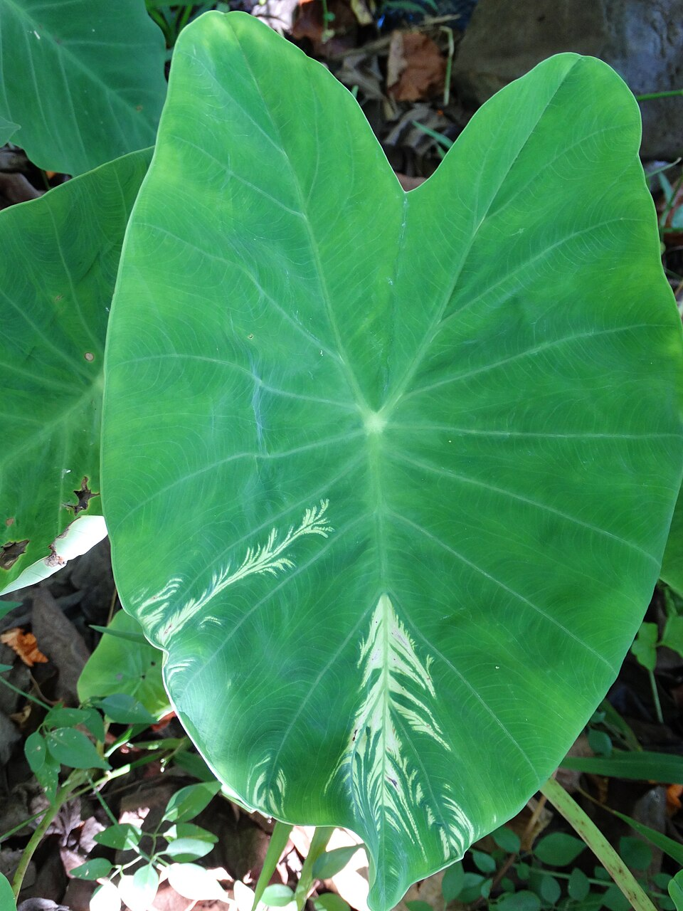

# Taro

> **Node ID**: plants.edible-plants.taro
> **Domain**: [Plants](./index.md)
> **Dependencies**: See prerequisites
> **Enables**: [`Edible Plants`](edible-plants.md)
> **Timeline**: Years 0-5
> **Outputs**: edible_plant_material
> **Critical**: Yes

## Overview

> *Image: Plant pests and diseases, CC0*

Taro

*Colocasia esculenta* (Araceae) is a root & tuber crop species of major importance for civilization bootstrapping. Taro provides leaves, roots, flowers as its primary edible product and ranks 61/100 on the nutrition score.

Fast-growing evergreen perennial reaching 1m tall and wide. Hardy to UK zone 9. Insect-pollinated, self-fertile flowers; noted for attracting wildlife. Accommodates light sandy, medium loamy, and heavy clay soils, tolerating very acidic and saline conditions. Grows in semi-shade or full sun; prefers moist to wet soil across mildly acidic to neutral pH range.

Edible parts: Corm, Leaves, Stalks, Stem, Vegetable, Root, Flowers The corms are edible when thoroughly cooked and can be boiled, baked or fried much like potatoes. They work well in savoury dishes such as soups and curries, or in sweet preparations with coconut milk and sugar. They can also be dried and grated to produce a flour. The corm is a good source of starch with very small starch grains that are easily digestible; this starch is used to make baby food that is considered non-allergenic. Tubers are typically up to 30 cm long and about 15 cm in diameter. The corm must be properly cooked before eating to address the toxicity concerns noted below. Young leaves of some taro varieties are grown specifically for their nutritious foliage; they can be used to wrap other foods for baking or cooked as spinach, but must always be cooked first to destroy calcium oxalate crystals. The stems are also edible — peeled, cut into pieces and boiled in stews, they taste and look somewhat like celery.

Crops mature in 6-18 months. Yields of 5-15 tonnes per hectare are probably average.

For civilization bootstrapping, taro is significant because of its role as a root & tuber crop. Reliable food production is the foundation upon which all other technological development rests. Understanding the cultivation, processing, and storage of *Colocasia esculenta* enables communities to establish food security and allocate labor to non-subsistence activities.

*Colocasia esculenta* is a member of the Araceae family. As a root & tuber crop, it provides essential calories, protein, or other nutrients needed to sustain human populations during the bootstrap process. The ability to produce food reliably from cultivated plants is what separates sedentary civilizations from hunter-gatherer societies, because food surplus allows specialization of labor into toolmaking, construction, and eventually metallurgy and beyond.

This species grows as a perennial or annual depending on climate and management. Propagation is primarily by Seed is possible but this is a cultivated species unlikely to breed true, and plants rarely produce fertile seed. Division is the main propagation method, using suckers or corms. Small unmarketable corms weighing 60–150g from healthy, productive plants are typically used; larger corms can be cut into sections. Other planting material includes the apical 1–2 cm of the main corm with 15–20 cm of leaf stalk attached, side suckers growing from the main corm, or in Ghana, young suckers or mature setts cut from harvested corms. All planting material must come from healthy plants. Cormels are planted at a depth of 50–75 mm.. Harvest timing depends on the plant part used: leaves, roots, flowers, shoots are typically ready at specific growth stages or seasons.

## Prerequisites

### Materials

- Propagation material: Seed is possible but this is a cultivated species unlikely to breed true, and plants rarely produce fertile seed. Division is the main propagation method, using suckers or corms. Small unmarketable corms weighing 60–150g from healthy, productive plants are typically used; larger corms can be cut into sections. Other planting material includes the apical 1–2 cm of the main corm with 15–20 cm of leaf stalk attached, side suckers growing from the main corm, or in Ghana, young suckers or mature setts cut from harvested corms. All planting material must come from healthy plants. Cormels are planted at a depth of 50–75 mm.
- Compost or organic matter for soil amendment
- Mulch material for moisture retention and weed suppression

### Equipment

- Hoe or digging stick for soil preparation and planting
- Sickle, machete, or harvesting knife for crop harvest
- Drying racks or flat drying surfaces for post-harvest processing
- Storage containers: woven baskets, ceramic jars, or sacks for dried product
- Winnowing baskets or screens if processing grains or seeds

### Knowledge

- Species identification: This plant has large flat leaves on the end of upright leaf stalks. It grows up to 1 m high. The leaf stalk or petiole joins the leaf towards the centre of the leaf. The leaves are 20-50 cm long. Near the ground a thickened rounded corm is produced. Around this plant their is normally a ring of smal
- Understanding of planting timing relative to local frost dates and rainy seasons
- Knowledge of soil preparation, seed depth, and spacing requirements
- Recognition of common pests and diseases and their early indicators
- Safe preparation methods for any toxic or bitter compounds (see Safety)

### Infrastructure

- Field or garden site with suitable climate, soil type, and sun exposure
- Reliable water access for germination and establishment phase
- Fenced or protected area if animal browsing is a risk
- Storage structure protected from moisture, rodents, and insects

## Process Description

### Cultivation and Propagation

Taro can be planted from cormels or from the top of the central corm. Other sections of the corm could also be used but this is not commonly done. Flowering of taro and seed production can lead to new cultivars. Flowering can be promoted by the use of gibberellic acid. The general growth pattern is for an increase in top growth, in terms of leaf number, leaf area and petiole length, to continue for about 6 months under tropical lowland conditions then for each of these to decrease and tuber storage to continue to increase. Corm weight increases significantly from 5 to 11 months. Starch content also increases with time but protein content declines over the corm development period. Taro can be grown under flooded conditions but root rots develop if the water becomes stagnant. For flooded cultivation, the land is cleared, ploughed, cultivated and puddled. The aim is to get a field that is flat with embankments allowing the impounding of water. Planting is done into 2-5 cm of standing water. For dryland taro, the soil is prepared by digging, unless a fresh bush fallow is used where the natural friability of the soil allows plants to be put into the undug soil in a small hole that is prepared. Plants are put into a hole 5-7 cm deep or deeper. Mulching to conserve moisture and reduce weed growth in beneficial. Setts from corms normally give higher yield than that from cormels. The greater leaf area and root production may be responsible for this. Setts of about 150 g are optimum. The time of planting is primarily determined by the availability of moisture. Planting is done shortly after the rainfall has become regular, if seasonally distinct wet and dry seasons occur. Higher rainfall, higher temperatures, and higher hours of sunlight, enhance production and determine seasonality of production. Evapotranspiration for flooded taro averages about 4 mm per day, ranging from 1.5 to 7.2 mm, with a total of about 1200 mm for the crop. Intermittent moisture can result in irregular shaped corms. Flooding has been found to be more effective than sprinkler irrigation, or furrow irrigation. Increased suckering, giving greater leaf area, seems to be the reason for this. Taro is sensitive to weed competition throughout most of its growth, but it is more critical during early growth up to 3 - 4 months. About 7-9 weedings are required, to keep the crop clean under tropical lowland conditions, where flooding is not used. Due to the decrease in height and leaf area towards the end of the growth cycle when starch accumulation in the corms is maximum, weed competition and weed control are again significant. Mechanical weeding needs to be shallow to avoid damaging the superficial taro roots. A range of herbicides have been recommended in various situations. Taro produces the highest dry matter yield under full sunlight, but it can still grow under moderate shade. Under shaded conditions it grows more slowly and develops less cormels. They require good moisture conditions and have little tolerance for drought. Taro residue has an allelopathic factor which can reduce the germination and growth of other plants, for example, beans. Taro tends to demand high fertility, and is responsive to additional NPK fertiliser. Higher doses of K increases starch content and higher doses of N increases protein content. Both N and K applications increase oxalic acid content of the tubers. Spacing affects total yield, and marketable, harvestable yield, of corms. Close spacing increases the corm yield per area, and the shoot yield per area, but decreases the corm yield per plant, and the contribution of sucker corms, to the yield. Where spacings of 30 cm x 30 cm are used, giving about 110,000 plants per hectare, a very large amount of planting material is required, which reduces the net return per unit of planting material. A spacing of 60 cm x 60 cm in more common. Wider spacings of 90 cm x 90 cm reduces overall yield. Propagation: Seed is possible but this is a cultivated species unlikely to breed true, and plants rarely produce fertile seed. Division is the main propagation method, using suckers or corms. Small unmarketable corms weighing 60–150g from healthy, productive plants are typically used; larger corms can be cut into sections. Other planting material includes the apical 1–2 cm of the main corm with 15–20 cm of leaf stalk attached, side suckers growing from the main corm, or in Ghana, young suckers or mature setts cut from harvested corms. All planting material must come from healthy plants. Cormels are planted at a depth of 50–75 mm.

### Distribution and Growing Conditions

### Identification

This plant has large flat leaves on the end of upright leaf stalks. It grows up to 1 m high. The leaf stalk or petiole joins the leaf towards the centre of the leaf. The leaves are 20-50 cm long. Near the ground a thickened rounded corm is produced. Around this plant their is normally a ring of small plants called suckers. Many different varieties occur. If left to maturity, a lily type flower is produced in the centre of the plant. It has a spathe 15-30 cm long which is rolled inwards. The flowers are yellow and fused along the stalk. There are many named cultivated varieties. Taro comes in two basic forms. The Dasheen type Colocasia esculenta var. esculenta and Colocasia esculenta var. antiquorum or the Eddoe type. The basic difference is the adaptation of the Eddoe type to storage and survival in seasonally dry places, while the dasheen type needs to be maintained in a more or less continuously growing vegetative stage. These are now recognised as separate species names.

### Edible Parts and Preparation

## Quantitative Parameters

### Nutritional Composition (per 100g)

| Part | Moisture | kJ | kcal | Protein | Vit A | Vit C | Iron | Zinc |
| --- | --- | --- | --- | --- | --- | --- | --- | --- |
| Root | 66.8 | 1231 | 294 | 1.96 | 3 | 5 | 0.68 | 3.2 |
| Root | 72 | 443 | 106 | 2 | — | 6 | 1.1 | 1.7 |
| Leaves | 85 | 210 | 50 | 5 | 57 | 90 | 0.62 | 0.7 |
| Leaf Stalks | 93 | 101 | 24 | 0.5 | 180 | 13 | 0.9 | — |
| Leaves - cooked | 92.2 | 100 | 24 | 2.7 | 424 | 35.5 | 1.2 | 0.2 |
| Root | 59 | — | — | — | — | — | — | — |
| Leaves | 85.9 | — | — | — | 55 | — | 34.2 | — |

### Growing Parameters

| Parameter | Value | Notes |
|-----------|-------|-------|
| Hardiness zones | 9-12 | USDA |
| Edible parts | Leaves, Roots, Flowers, Shoots | Primary harvest |

## Processing and Storage

### Non-Food Uses

Taro can be used in agroforestry systems as a water-loving crop in wetland areas, improving soil moisture retention. It is also grown as an ornamental and used as animal fodder. The plant can provide some habitat value — corms and leaves may be consumed by wildlife, and dense foliage and leaf litter can offer shelter for invertebrates.

### Storage

Fresh roots and tubers can be stored in cool, dark, well-ventilated conditions. Root cellars or pits lined with straw maintain appropriate temperature and humidity. Avoid washing before storage — soil protects the skin. Check stored roots weekly and remove any showing rot to prevent spread. For longer storage, slice and sun-dry, or process into flour. Some tropical tubers store for weeks at ambient temperature; others require processing within days of harvest.

### Material Handling

Handle taro produce with clean hands and tools to prevent contamination. Remove field heat promptly after harvest by moving product to shade. Process within the recommended timeframe to prevent quality loss. Compost crop residues and processing waste to return organic matter to the soil. Label stored products with harvest date, variety, and any treatments applied.

## Scaling Notes

- **Bench scale**: Individual plants or small garden plot (10-50 plants). Output for direct household consumption. Useful for seed saving, variety selection, and learning the crop's behavior under local conditions.
- **Pilot scale**: Field planting of 0.1 to 1 hectare (500-5,000 plants). Staggered planting or sequential harvests to extend availability. Requires basic hand tools and family-level labor. Surplus can be traded or stored.
- **Production scale**: Multi-hectare cultivation with mechanized planting, harvesting, and processing. Requires plow animals or tractors, grain mills or processing equipment, and bulk storage facilities. Enables community-level food security and trade.
  Reported production data: Crops mature in 6-18 months. Yields of 5-15 tonnes per hectare are probably average.

Key scaling challenges include maintaining genetic diversity at plantation scale, managing pest and disease pressure in monoculture, and matching post-harvest processing capacity to harvest volume. Seed saving and variety selection at bench scale directly informs decisions about which cultivars to scale up.

## Troubleshooting

| Problem | Probable Cause | Solution |
|---------|---------------|----------|
| Poor germination | Old seed, wrong soil temperature, planted too deep, or insufficient moisture | Use fresh seed; verify germination temperature range; plant at recommended depth; maintain soil moisture during germination |
| Pest damage | Insect infestation or browsing animals | Hand-pick pests; use companion planting with repellent species; install fencing for larger pests |
| Disease (fungal/bacterial) | Poor air circulation, excessive moisture, infected seed | Space plants adequately; avoid overhead watering; use clean seed from disease-free plants; practice crop rotation |
| Low yield | Nutrient deficiency, water stress, overcrowding, or shade | Amend soil with compost or manure; ensure adequate water at critical growth stages; thin to recommended spacing; plant in full sun |
| Storage losses | Insufficient drying, rodent/insect damage, high humidity | Dry product thoroughly before storage; use sealed containers; inspect stored product regularly; keep storage area clean and dry |
| Quality or safety note | See species-specific notes | Leaf stalks have 3.1 mg per 100 g dry weight and 1.7 mg fresh weight of alpha-tocopherol (Vitamin E). There are 8 Colocasia species. Taro tru Taro tru |

## Safety Considerations

Working with *Colocasia esculenta* involves the following hazards:

- **Toxicity**: Parts of this plant may contain compounds that are toxic when raw or improperly prepared. Always follow proper preparation procedures before consumption. Verify with multiple authoritative sources.
- Tool injuries during harvest and processing — use sharp tools in good condition and cut away from the body
- Allergic reactions to plant compounds — sensitive individuals should test small quantities first
- Sun exposure and heat stress during field work — schedule heavy work for early morning or late afternoon
- Musculoskeletal strain from repetitive harvesting motions — vary tasks and take regular breaks

### Personal Protective Equipment

- Sturdy gloves when handling plants with irritant sap, spines, or rough surfaces
- Long sleeves and trousers for field work to reduce skin exposure to irritants and insects
- Eye protection when using cutting tools overhead or near face level
- Sun hat and sunscreen for extended field work

### Emergency Procedures

- For suspected plant poisoning: stop eating immediately, save a sample of the plant material, and seek medical attention. Do not induce vomiting unless directed by a medical professional.
- For tool lacerations: apply direct pressure with a clean cloth, elevate the wound, and seek medical attention for cuts deeper than skin level.
- For allergic reaction (swelling, difficulty breathing): discontinue exposure immediately and seek emergency medical help.

## Quality Control

### Acceptance Criteria

- Harvest product shows expected color, texture, size, and flavor for the variety grown
- No visible mold, rot, pest damage, or foreign material in stored product
- Dried products are brittle throughout with no flexible or moist spots
- Seeds intended for storage test at below 14% moisture content

### Testing Methods

- **Visual inspection**: check for discoloration, mold, insect damage, or foreign material
- **Bite test (seeds/grains)**: properly dried seeds crack cleanly; under-dried seeds dent or feel leathery
- **Smell test**: fresh product has characteristic aroma; off-odors indicate spoilage or contamination
- **Snap test (dried products)**: properly dried material snaps rather than bends

### Sampling Protocol

For field-scale production, inspect every 10th plant during harvest for disease and pest damage. Grade each batch by size and quality before storage. Record yield per unit area to track productivity trends across seasons and identify declining performance early.

## Variations and Alternatives

### Medicinal Uses

The plant is antibacterial and hypotensive. A decoction of the leaves is drunk to promote menstruation. A decoction combined with parts of other plants is taken to relieve stomach problems and to treat cysts. In New Guinea, leaves are heated over a fire and applied as a poultice to boils. The sap of the leaf stalk is used to treat conjunctivitis. The scraped stem, combined with parts of other plants, is used to stimulate appetite. The plant is also used to treat wounds.

### Other Uses

### Additional Information

It is a commercially cultivated vegetable. It has been a very important food plant in Papua New Guinea. In some areas it is still important but in other areas it has declined because of insect and disease problems. Leaves are sold in local markets.

### Notes

Leaf stalks have 3.1 mg per 100 g dry weight and 1.7 mg fresh weight of alpha-tocopherol (Vitamin E). There are 8 Colocasia species. Taro tru Taro tru (Colocasia esculenta ). This taro is grown by most people in the Southern Highlands even if only in small numbers. It needs to have a fertile soil, so people grow it around houses where they can compost their rubbish. In Tari they grow it on the fertile soil that they have dug out of the drains. Other people grow it in the moist fertile corner of their garden. The leaves and the underground corm are eaten. It is replanted from the top piece of the corm, It suffers badly from the black taro beetle and its larvae which eat the corm. Fortunately the two serious diseases that are ruining many taro crops on the coast (taro blight and taro virus) do not cause damage in the Southern Highlands. Taro tru can be recognised because the leaf stalk joins onto the centre of the leaf blade.

### Related Species

- [Water Yam](water-yam.md)
- [Cocoyam](cocoyam.md)
- [Lesser Yam](lesser-yam.md)
- [Beet](beet.md)
- [Jerusalem Artichoke](jerusalem-artichoke.md)

### Cultivar Selection

Within *Colocasia esculenta*, considerable variation exists in yield, disease resistance, climate adaptation, and quality characteristics. When establishing a taro crop, select varieties adapted to local conditions: day length, temperature range, rainfall pattern, and soil type. Landrace varieties — locally adapted populations maintained by traditional farmers — often outperform modern cultivars under low-input conditions because they have been selected for resilience rather than maximum yield under optimal conditions.

Seed saving from the best-performing plants each generation gradually adapts the variety to local conditions. Select for vigor, disease resistance, appropriate maturity timing, and product quality. Maintain genetic diversity by saving seed from multiple plants rather than a single individual, which preserves the population's ability to adapt to changing conditions and disease pressures.

### Crop Rotation and Companion Planting

*Colocasia esculenta* benefits from crop rotation to prevent buildup of species-specific pests and diseases. Avoid planting in the same field in consecutive seasons where possible. Follow with a different crop family to break pest cycles and maintain soil health.

Companion planting with aromatic herbs or flowering plants can deter pests and attract beneficial insects. Avoid planting near species that compete for the same nutrients or harbor shared pathogens.

## References

- [Edible Plants](edible-plants.md) — parent capability
- [Plants Domain](./index.md) — domain overview and related capabilities
- [Agave](agave.md) — example plant article format
- [Food Processing](../food-processing/index.md) — downstream processing of harvested crops
- [Agriculture](../agriculture/index.md) — cultivation systems and crop rotation
- Family: Araceae
- Distribution: Andorra, United Arab Emirates, Afghanistan, Antigua &amp; Barbuda, Albania, Armenia, Angola, Argentina, American Samoa, Austria, Australia, Azerbaijan, Bosnia &amp; Herzegovina, Barbados, Bangladesh, Belgium, Burkina Faso, Bulgaria, Bahrain, Burundi and 181 more
- Data sourced from Food Plants International, Wikipedia, and iNaturalist via the Edible Plant Database (ZIM)
- Plants for a Future (pfaf.org) — supplementary cultivation and use data

---
*Part of the [Bootciv Tech Tree](../index.md) · [Plants](./index.md) · [All Domains](../index.md)*
