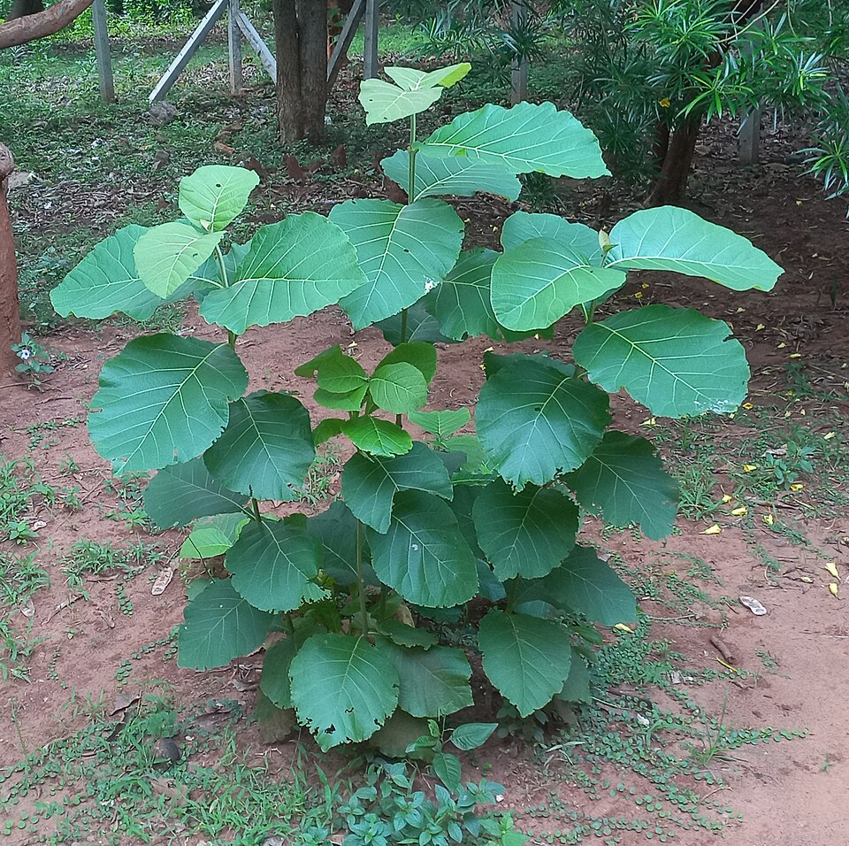
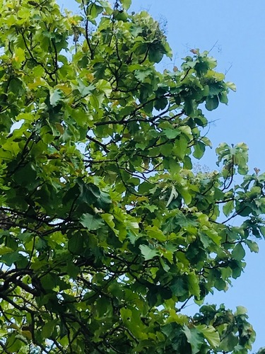

# Teak

> **Node ID**: plants.timber.teak
> **Domain**: [Plants](./index.md)
> **Dependencies**: See prerequisites
> **Enables**: [`Marine`](../marine/index.md), [`Construction`](../construction/index.md)
> **Timeline**: Years 10-80
> **Outputs**: durable timber (shipbuilding, outdoor furniture, structural beams)
> **Critical**: No — superior for marine use but not irreplaceable; oak and treated pine can substitute

## Overview

> *Teak plants at Gudilova temples in Visakhapatnam*

> *Image: Adityamadhav83, CC BY 4.0*

Teak (*Tectona grandis*) is a tropical hardwood renowned for its exceptional natural durability, dimensional stability, and resistance to rot, insects, and weather. It is the gold standard timber for shipbuilding, outdoor furniture, and any application where wood must withstand decades of exposure to rain, sun, and seawater without chemical treatment.

The wood contains natural oils (tectoquinone and other compounds) that repel insects and resist fungal decay. Teak is one of very few timbers rated as Class 1 durability (very durable), meaning it can last 25+ years in ground contact and 100+ years above ground in exposed conditions. Density ranges from 610 to 750 kg/m³ at 12% moisture content.

Teak is native to south and southeast Asia (India, Myanmar, Thailand, Laos). It grows to 30-40 meters tall with a clear bole of 15-25 meters and trunk diameter of 0.75-1.5 meters. The tree is deciduous, dropping its large leaves during the dry season. Plantation-grown teak reaches harvestable size in 20-30 years, though 40-60 year rotations produce larger, higher-quality timber.

The timber seasons well with minimal degrade, works moderately easily with sharp tools, and takes a smooth finish. It has low shrinkage (volumetric shrinkage 7.0-8.1%), making it dimensionally stable in varying humidity. Teak's main limitation is its restricted growing range: it requires tropical or subtropical climates with a distinct dry season and annual rainfall of 1,200-2,500 mm.

Primary outputs: `timber` for marine construction, outdoor structures, and precision applications requiring stability.

## Prerequisites

### Materials

- Teak seeds (drupes) from selected mother trees, or nursery seedlings
- Deep, well-drained, fertile soil with pH 6.5-7.5
- Tropical or subtropical climate with 1,200-2,500 mm annual rainfall and a distinct dry season

### Equipment

- Felling axe, crosscut saw, or chainsaw
- Heavy-duty sawing equipment (teak is dense and abrasive, quickly dulling tools)
- Stackable stickers and bearers for seasoning
- Sharp hand tools: chisels, planes, and saws with high-carbon steel or carbide-tipped blades

### Knowledge

- Identification of teak by large, rough leaves (30-60 cm) and distinctive heartwood color
- Understanding of teak's abrasive silica content and its effect on cutting tools
- Slow seasoning requirements to avoid surface checking
- Log storage in water to prevent staining and insect attack before sawing

### Infrastructure

- Teak plantation with access roads for extraction (logs are heavy: 800-1,000 kg/m³ green)
- Sawmill capable of handling dense hardwood logs
- Covered seasoning yard with concrete or raised platform
- Tropical climate with appropriate rainfall pattern

## Process Description

### Timber Production

1. Select trees for harvest. Optimal age: 40-60 years for natural forest, 20-30 years for plantation. Mark trees and plan extraction routes.
2. Fell during the dry season when sap is low. Teak logs are extremely heavy (green density 800-1,000 kg/m³). Use animal or mechanical power for extraction.
3. Submerge logs in water (pond or river) within 2 weeks of felling to prevent end-checking, staining, and borer attack. Water storage also loosens the bark.
4. Saw logs into desired dimensions. Teak's silica content (up to 1.7% in heartwood) rapidly dulls saw teeth. Resharpen or replace blades frequently.
5. Air dry sawn timber in a covered stack with stickers. Teak seasons slowly: 25 mm boards require 2-4 months, 50 mm stock requires 4-8 months. Kiln drying is possible but must be gradual to avoid honeycombing (internal checking).
6. Final moisture content for use: 10-15% for furniture and joinery, 15-20% for structural and marine use.

### Marine Timber Preparation

1. Select heartwood only. Teak sapwood is not durable and must be excluded from marine applications.
2. Cut to dimensions for planking, decking, or structural members. Teak for boat decking is typically 20-25 mm thick and 60-100 mm wide.
3. Smooth all surfaces. Teak's natural oils make it resistant to paint and most finishes. For decking, leave the surface unfinished and allow it to weather to a silver-gray patina.
4. Fasten with copper, bronze, or galvanized fasteners. Teak's tannins corrode iron and steel fasteners, causing black staining.

### Process Parameters

| Parameter | Range | Notes |
|-----------|-------|-------|
| Wood density (12% MC) | 610-750 kg/m³ | Dense tropical hardwood |
| Bending strength (MOR) | 86-105 MPa | High |
| Compression parallel to grain | 50-65 MPa | High |
| Modulus of elasticity | 9,500-12,000 MPa | Stiff |
| Volumetric shrinkage | 7.0-8.1% | Low — dimensionally stable |
| Natural durability class | 1 (very durable) | 25+ years in ground contact |
| Heartwood silica content | 0.5-1.7% | Abrasive to cutting tools |
| Oil content (heartwood) | 1.5-5.0% | Natural insect and rot resistance |
| Seasoning time (25 mm board) | 2-4 months | Air dried, covered |
| Seasoning time (50 mm stock) | 4-8 months | Air dried, covered |
| Rotation age (plantation) | 20-60 years | Shorter = smaller logs; longer = higher quality |
| Rotation age (natural forest) | 60-120 years | Premium quality timber |
| Green wood density | 800-1,000 kg/m³ | Extremely heavy when fresh-cut |
| Teak oil content (heartwood) | 1.5-5.0% | Tectoquinone and related compounds |
| Log water storage time | 2-12 months | Prevents staining and borer attack |

### Timber Properties and Processing Details

Teak's extraordinary durability comes from a combination of factors: high oil content (1.5-5.0%), silica deposits in the wood cells (0.5-1.7%), and natural preservative compounds including tectoquinone and lapachol. These chemicals make teak unpalatable to termites, resistant to fungal decay, and unattractive to marine borers (teredo worms) that destroy most other timbers in seawater.

The silica content presents both an advantage and a challenge. It contributes to teak's resistance to marine borers and insects but makes the wood extremely abrasive to cutting tools. Saws, planers, and router bits dull 3-5 times faster on teak than on typical hardwoods. Carbide-tipped tools are essential for any machining operation. Traditional hand-tool woodworking with teak requires frequent sharpening of chisels and plane blades.

Teak's low volumetric shrinkage (7.0-8.1%) is among the lowest of any commercial timber, lower than oak (10-13.5%) and much lower than beech (17-20%). This means teak components hold their dimensions across seasonal humidity changes — a critical property for boat decking, door panels, and precision joinery where gaps would be unacceptable.

### Marine Applications

Teak is the premier timber for marine deck planking because it combines durability, dimensional stability, and a non-slip surface that improves when wet. The wood's natural oils prevent water absorption, so teak decking does not swell, shrink, or warp with wet-dry cycling. When weathered, teak develops a fine, even grain texture that provides good traction underfoot.

For boat building, teak is used for decking, trim, rails, hatches, and interior joinery. It is not typically used for structural frames (where oak or other stronger timbers are preferred) because teak's bending strength, while good, is not exceptional. Teak fastenings must be copper, bronze, or silicon bronze — never iron or steel, which react with tannins in the wood to produce black staining and accelerated corrosion.

## Safety Considerations

- Teak dust is a severe respiratory irritant and sensitizer. Repeated exposure causes asthma and contact dermatitis. Wear a properly fitted N95 or better respirator when sanding, sawing, or machining teak.
- Teak splinters are prone to causing infections due to the wood's high oil and silica content. Remove splinters promptly and clean wounds thoroughly.
- The silica content in teak makes it exceptionally abrasive. Saw blades dull quickly and may overheat. Check blade temperature frequently and allow cooling periods.
- Teak logs are extremely heavy. Use mechanical assistance for lifting and moving. Manual handling of green teak logs causes back injuries.
- Teak sawdust is flammable due to oil content. Collect and remove sawdust frequently from work areas. Store away from ignition sources.

### Personal Protective Equipment

- N95 respirator or better for all operations producing dust
- Safety glasses with side shields for sawing and machining
- Heavy leather gloves for handling rough-sawn timber
- Steel-toed boots for log handling

## Quality Control

### Acceptance Criteria

- **Marine grade**: 100% heartwood, no sapwood inclusions, no knots larger than 15 mm, no checks or shakes, grain angle less than 1:10
- **Furniture grade**: Heartwood with sapwood limited to one face, tight knots up to 25 mm allowed, no heartshake
- **Structural grade**: Heartwood, knots up to 50 mm in members over 100 mm thick, slope of grain less than 1:8

### Testing Methods

- Heartwood identification by color: golden-brown to dark brown. Sapwood is pale yellow-white and must be excluded from durable applications.
- Oil content indication: fresh-cut teak has a distinct oily feel and leathery smell. Low-oil timber may indicate inferior stock or sapwood contamination.
- Density test: float test in water. Teak heartwood at 12% MC sinks. Sapwood may float.
- Dimensional stability check: measure a sample board at 12% MC, then expose to 90% humidity for 2 weeks and remeasure. Movement should not exceed 2% in width.

## Scaling Notes

- **Individual tree**: Yields 1-5 cubic meters of sawn timber depending on size and form.
- **Small plantation** (5 hectares): 1,000-2,000 trees. At 25-year rotation, yields approximately 100-300 cubic meters of timber per harvest.
- **Commercial plantation** (100+ hectares): Requires sawmill capacity, road network, and water storage for logs. Sustained annual yield from a well-managed plantation: 5-15 cubic meters per hectare per year.
- **Critical bottleneck**: Time. Teak cannot be rush-grown. Even fast-rotation plantation teak requires 20+ years. This makes teak a strategic resource that must be planted well in advance of need.

## Troubleshooting

| Problem | Probable Cause | Solution |
|---------|---------------|----------|
| Surface checking during seasoning | Too-rapid drying, exposed end grain | Seal end grain with wax or paint; slow the drying rate by covering stacks |
| Tool blades dulling rapidly | Silica content in heartwood | Use carbide-tipped blades; sharpen more frequently; reduce cutting speed |
| Iron staining on wood | Steel or iron fasteners reacting with tannins | Use copper, bronze, or galvanized fasteners only |
| Powderpost beetle attack | Sapwood left in timber | Remove all sapwood; select heartwood-only stock for durable applications |
| Honeycombing during kiln drying | Drying too fast at high temperature | Use a gradual kiln schedule: start at 40°C, increase slowly to 65°C |
| Teak plantation fails | Planting outside suitable climate range | Requires tropical climate with distinct dry season and 1,200+ mm rainfall |

## Variations and Alternatives

- **Plantation teak** vs. **natural forest teak**: Plantation teak grows faster with wider growth rings, lighter color, and lower density (610-680 kg/m³). Natural forest teak is denser (680-750 kg/m³), darker, and more durable. Both are usable for construction.
- **White teak** (*Tectona hamiltoniana*): Endemic to Myanmar, smaller tree with lighter wood. Limited commercial use.
- **Dahat teak** (*Tectona philippinensis*): Philippine endemic, endangered. Not commercially available.
- **Alternative durable timbers**: Greenheart (*Chlorocardium rodiei*), ipe (*Handroanthus spp.*), and purpleheart (*Peltogyne spp.*) offer similar or better durability but different working properties.
- **Treated pine**: For temperate zones where teak cannot grow, pressure-treated Scots pine or Douglas fir provides serviceable outdoor timber at much lower cost, though with inferior dimensional stability.
- **Iroko** (*Milicia excelsa*): African tropical hardwood with similar appearance and durability to teak. Often marketed as "African teak." A practical alternative in west and central Africa.
- **Cedar** (*Cedrus spp.*): Natural decay resistance from aromatic oils. Not as strong as teak but useful for outdoor construction and fencing in temperate and Mediterranean climates.

## References

- [Marine](../marine/index.md) — teak's primary high-value application
- [Construction](../construction/index.md) — structural timber uses
- [Scots Pine](./pinus-sylvestris.md) — temperate-zone alternative timber
- [English Oak](./quercus-robur.md) — alternative durable timber for barrels and boat framing
- [Plants Domain](./index.md) — domain overview and related capabilities

### Teak Plantation Management

Teak plantations require careful management to produce quality timber. The first 5-10 years
are critical: competition from weeds and vines can suppress young teak trees. Regular weeding
(every 2-3 months during the first 2 years) is essential. Thinning at ages 5, 10, and 15
removes suppressed trees and provides space for the best specimens to develop clear, wide boles.

Teak's requirement for a distinct dry season limits its cultivation range. Without a dry period,
the tree grows vegetatively but does not form dense, durable heartwood. The best teak timber
comes from regions with 4-6 months of dry season followed by heavy monsoon rains. India, Myanmar,
Thailand, Indonesia, and Central America all produce quality plantation teak under these conditions.

Pruning lower branches during the first 5-8 years produces clear, knot-free butt logs that
command premium prices. Prune during the dry season to minimize fungal infection. Remove
branches flush with the trunk to promote clean healing. A well-managed plantation with proper
spacing, thinning, and pruning produces merchantable timber in 20-25 years, though 40-60 year
rotations yield larger, higher-quality logs.

Teak's dimensional stability (low volumetric shrinkage of 7-8%) makes it suitable for precision joinery where seasonal movement would cause problems. Door panels, window frames, and laboratory furniture benefit from teak's resistance to warping and swelling across humidity changes. This stability, combined with natural durability, makes teak the preferred wood for ship's wheels, navigational instruments, and scientific equipment housings in marine environments.

### Teak Summary

This species represents an important component of a diversified food production system.
No single crop provides complete nutrition, and dietary diversity is essential for human
health. A civilization bootstrap food system should include grains, legumes, roots, fruits,
vegetables, and nuts to ensure adequate intake of calories, protein, vitamins, and minerals.

The crop's specific growing requirements (soil type, rainfall, temperature range, and
growing season length) determine its geographic suitability. Matching crops to local
conditions is more important than attempting to grow unsuitable crops in marginal

---
*Part of the [Bootciv Tech Tree](../index.md) · [Plants](./index.md) · [All Domains](../index.md)*

