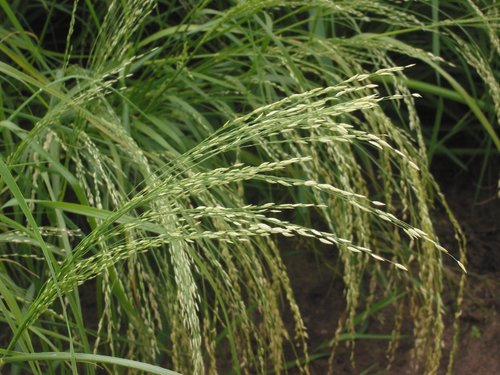

# Teff

> **Node ID**: plants.edible-plants.teff
> **Domain**: [Plants](./index.md)
> **Dependencies**: See prerequisites
> **Enables**: [`Edible Plants`](edible-plants.md)
> **Timeline**: Years 0-5
> **Outputs**: edible_plant_material
> **Critical**: No

## Overview

> *Teff (Eragrostis tef);*

> *Image: Rasbak, CC BY-SA 3.0*

Teff

*Eragrostis tef* (Poaceae) is a staple food crop species of major importance for civilization bootstrapping. Teff provides seeds/nuts as its primary edible product and ranks 65/100 on the nutrition score.

An annual grass growing to 1 m (3 ft 3 in) tall. Hermaphroditic with wind pollination. Flowers August to September, with seeds ripening September to October. Tolerates light sandy, medium loamy, and heavy clay soils with good drainage. Adapts to mildly acidic through mildly alkaline pH. Requires full sun and tolerates both dry and moist soil. Hardy to UK zone 9.

Edible parts: Seeds, Cereal The seed is cooked and used as a cereal for making bread and fermented foods. In Ethiopia, where it is a staple, it is used to make 'enjera' — a fermented, pancake-like bread that is spongy, soft, thin, and sour in taste. The seed is very small but easy to harvest. Protein content is approximately 13%.

It is fast growing. Plants take between 90-120 days for early varieties and 120-160 days for late maturing varieties. Yields range between 300 and 3000 kg per hectare. Seeds can be stored for many years as a reserve food supply.

For civilization bootstrapping, teff is significant because of its role as a staple crop. Reliable food production is the foundation upon which all other technological development rests. Understanding the cultivation, processing, and storage of *Eragrostis tef* enables communities to establish food security and allocate labor to non-subsistence activities.

*Eragrostis tef* is a member of the Poaceae family. As a staple food crop, it provides essential calories, protein, or other nutrients needed to sustain human populations during the bootstrap process. The ability to produce food reliably from cultivated plants is what separates sedentary civilizations from hunter-gatherer societies, because food surplus allows specialization of labor into toolmaking, construction, and eventually metallurgy and beyond.

This species grows as a perennial or annual depending on climate and management. Propagation is primarily by Sow seed in early spring in a greenhouse, barely covering it. Germination is usually quick and reliable. Prick seedlings out into individual pots as soon as they are large enough to handle and plant out after the last expected frost. Seed can also be sown in situ in late April, though cool summers may not provide a long enough growing season for the crop to ripen.. Harvest timing depends on the plant part used: seeds/nuts are typically ready at specific growth stages or seasons.

## Prerequisites

### Materials

- Propagation material: Sow seed in early spring in a greenhouse, barely covering it. Germination is usually quick and reliable. Prick seedlings out into individual pots as soon as they are large enough to handle and plant out after the last expected frost. Seed can also be sown in situ in late April, though cool summers may not provide a long enough growing season for the crop to ripen.
- Compost or organic matter for soil amendment
- Mulch material for moisture retention and weed suppression

### Equipment

- Hoe or digging stick for soil preparation and planting
- Sickle, machete, or harvesting knife for crop harvest
- Drying racks or flat drying surfaces for post-harvest processing
- Storage containers: woven baskets, ceramic jars, or sacks for dried product
- Winnowing baskets or screens if processing grains or seeds

### Knowledge

- Species identification: A millet grass. It is an annual tufted grass. It grows 60-120 cm tall. It has a slender stem and long narrow smooth leaves. The flowers occur in loose open panicles. These are 15-35 cm long. The branches are very thin and droop over. The seeds are very small. They are 1-1.5 mm long. There are about 2,500-3,000 seeds per gram, making teff one of the smallest cereal grains. Seed color ranges from white to dark brown.
- Understanding of planting timing relative to local frost dates and rainy seasons
- Knowledge of soil preparation, seed depth, and spacing requirements
- Recognition of common pests and diseases and their early indicators
- Safe preparation methods for any toxic or bitter compounds (see Safety)

### Infrastructure

- Field or garden site with suitable climate, soil type, and sun exposure
- Reliable water access for germination and establishment phase
- Fenced or protected area if animal browsing is a risk
- Storage structure protected from moisture, rodents, and insects

## Process Description

### Cultivation and Propagation

Teff is best grown in fallowed land or after legume crops. Land preparation needs to be very thorough. A fine firm weed free seed bed is needed. Seed are mostly broadcast. Driving sheep or cattle over the land is used to trample in the seed. 25-30 kg of seed per hectare are recommended. Nitrogen fertiliser is recommended. It is usually harvested with sickles. Propagation: Sow seed in early spring in a greenhouse, barely covering it. Germination is usually quick and reliable. Prick seedlings out into individual pots as soon as they are large enough to handle and plant out after the last expected frost. Seed can also be sown in situ in late April, though cool summers may not provide a long enough growing season for the crop to ripen.

### Distribution and Growing Conditions

### Identification

A millet grass. It is an annual tufted grass. It grows 60-120 cm tall. It has a slender stem and long narrow smooth leaves. The flowers occur in loose open panicles. These are 15-35 cm long. The branches are very thin and droop over. The seeds are very small. They are 1-1.5 mm long. There are about 2500-3000 seeds per gram. A brown seeded and a white seeded kind are recognised.

### Edible Parts and Preparation

## Quantitative Parameters

### Nutritional Composition (per 100g)

| Part | Moisture | kJ | kcal | Protein | Vit A | Vit C | Iron | Zinc |
| --- | --- | --- | --- | --- | --- | --- | --- | --- |
| Seeds | 9.3 | 1541 | 368 | 8.9 | — | — | 9.9 | 20 |

### Growing Parameters

| Parameter | Value | Notes |
|-----------|-------|-------|
| Growing period | 90–120 days | Maturity range |
| Annual rainfall | 1000 mm | Growing requirement |
| Germination temperature | 28°C | Optimal |
| Edible parts | Seeds/Nuts | Primary harvest |

## Processing and Storage

### Non-Food Uses

None known

### Storage

Dry seeds thoroughly to below 14% moisture content before storage. Spread in thin layers on drying racks in full sun, stirring periodically. Test dryness by biting: properly dried seeds crack rather than dent. Store in airtight containers (ceramic jars with tight lids, sealed woven bags) in a cool, dry, dark location. Protect from rodents and insects with tight lids or by mixing with inert ash. Under good conditions, dried grains and legumes store for 1-5 years with minimal loss.

### Material Handling

Handle teff produce with clean hands and tools to prevent contamination. Remove field heat promptly after harvest by moving product to shade. Process within the recommended timeframe to prevent quality loss. Compost crop residues and processing waste to return organic matter to the soil. Label stored products with harvest date, variety, and any treatments applied.

## Scaling Notes

- **Bench scale**: Individual plants or small garden plot (10-50 plants). Output for direct household consumption. Useful for seed saving, variety selection, and learning the crop's behavior under local conditions.
- **Pilot scale**: Field planting of 0.1 to 1 hectare (500-5,000 plants). Staggered planting or sequential harvests to extend availability. Requires basic hand tools and family-level labor. Surplus can be traded or stored.
- **Production scale**: Multi-hectare cultivation with mechanized planting, harvesting, and processing. Requires plow animals or tractors, grain mills or processing equipment, and bulk storage facilities. Enables community-level food security and trade.
  Reported production data: It is fast growing. Plants take between 90-120 days for early varieties and 120-160 days for late maturing varieties. Yields range between 300 and 3000 kg per hectare. Seeds can be stored for many yea

Key scaling challenges include maintaining genetic diversity at plantation scale, managing pest and disease pressure in monoculture, and matching post-harvest processing capacity to harvest volume. Seed saving and variety selection at bench scale directly informs decisions about which cultivars to scale up.

## Troubleshooting

| Problem | Probable Cause | Solution |
|---------|---------------|----------|
| Poor germination | Old seed, wrong soil temperature, planted too deep, or insufficient moisture | Use fresh seed; verify germination temperature range; plant at recommended depth; maintain soil moisture during germination |
| Pest damage | Insect infestation or browsing animals | Hand-pick pests; use companion planting with repellent species; install fencing for larger pests |
| Disease (fungal/bacterial) | Poor air circulation, excessive moisture, infected seed | Space plants adequately; avoid overhead watering; use clean seed from disease-free plants; practice crop rotation |
| Low yield | Nutrient deficiency, water stress, overcrowding, or shade | Amend soil with compost or manure; ensure adequate water at critical growth stages; thin to recommended spacing; plant in full sun |
| Storage losses | Insufficient drying, rodent/insect damage, high humidity | Dry product thoroughly before storage; use sealed containers; inspect stored product regularly; keep storage area clean and dry |
| Quality or safety note | See species-specific notes | The seeds have high food value. There are about 300 Eragrostis species. It is gluten free. It is a C4 plant. It contains no gluten. |

## Safety Considerations

Working with *Eragrostis tef* involves the following hazards:

- Tool injuries during harvest and processing — use sharp tools in good condition and cut away from the body
- Allergic reactions to plant compounds — sensitive individuals should test small quantities first
- Sun exposure and heat stress during field work — schedule heavy work for early morning or late afternoon
- Musculoskeletal strain from repetitive harvesting motions — vary tasks and take regular breaks

### Personal Protective Equipment

- Sturdy gloves when handling plants with irritant sap, spines, or rough surfaces
- Long sleeves and trousers for field work to reduce skin exposure to irritants and insects
- Eye protection when using cutting tools overhead or near face level
- Sun hat and sunscreen for extended field work

### Emergency Procedures

- For suspected plant poisoning: stop eating immediately, save a sample of the plant material, and seek medical attention. Do not induce vomiting unless directed by a medical professional.
- For tool lacerations: apply direct pressure with a clean cloth, elevate the wound, and seek medical attention for cuts deeper than skin level.
- For allergic reaction (swelling, difficulty breathing): discontinue exposure immediately and seek emergency medical help.

## Quality Control

### Acceptance Criteria

- Harvest product shows expected color, texture, size, and flavor for the variety grown
- No visible mold, rot, pest damage, or foreign material in stored product
- Dried products are brittle throughout with no flexible or moist spots
- Seeds intended for storage test at below 14% moisture content

### Testing Methods

- **Visual inspection**: check for discoloration, mold, insect damage, or foreign material
- **Bite test (seeds/grains)**: properly dried seeds crack cleanly; under-dried seeds dent or feel leathery
- **Smell test**: fresh product has characteristic aroma; off-odors indicate spoilage or contamination
- **Snap test (dried products)**: properly dried material snaps rather than bends

### Sampling Protocol

For field-scale production, inspect every 10th plant during harvest for disease and pest damage. Grade each batch by size and quality before storage. Record yield per unit area to track productivity trends across seasons and identify declining performance early.

## Variations and Alternatives

### Medicinal Uses

### Other Uses

### Additional Information

A staple food in some parts of Ethiopia. It is mostly eaten by the wealthier people. It is a cultivated food plant. It is grown on 2.5 million ha.

### Notes

The seeds have high food value. There are about 300 Eragrostis species. It is gluten free. It is a C4 plant. It contains no gluten.

### Related Species

- [Wheat](wheat.md)
- [Rice](rice.md)
- [Maize](maize.md)
- [Potato](potato.md)
- [Cassava](cassava.md)

### Cultivar Selection

Within *Eragrostis tef*, considerable variation exists in yield, disease resistance, climate adaptation, and quality characteristics. When establishing a teff crop, select varieties adapted to local conditions: day length, temperature range, rainfall pattern, and soil type. Landrace varieties — locally adapted populations maintained by traditional farmers — often outperform modern cultivars under low-input conditions because they have been selected for resilience rather than maximum yield under optimal conditions.

Seed saving from the best-performing plants each generation gradually adapts the variety to local conditions. Select for vigor, disease resistance, appropriate maturity timing, and product quality. Maintain genetic diversity by saving seed from multiple plants rather than a single individual, which preserves the population's ability to adapt to changing conditions and disease pressures.

### Crop Rotation and Companion Planting

*Eragrostis tef* benefits from crop rotation to prevent buildup of species-specific pests and diseases. Avoid planting in the same field in consecutive seasons where possible. Follow with a different crop family to break pest cycles and maintain soil health.

Companion planting with aromatic herbs or flowering plants can deter pests and attract beneficial insects. Avoid planting near species that compete for the same nutrients or harbor shared pathogens.

## References

- [Edible Plants](edible-plants.md) — parent capability
- [Plants Domain](./index.md) — domain overview and related capabilities
- [Agave](agave.md) — example plant article format
- [Food Processing](../food-processing/index.md) — downstream processing of harvested crops
- [Agriculture](../agriculture/index.md) — cultivation systems and crop rotation
- Family: Poaceae
- Distribution: Andorra, United Arab Emirates, Afghanistan, Antigua &amp; Barbuda, Albania, Armenia, Angola, Argentina, Austria, Australia, Azerbaijan, Bosnia &amp; Herzegovina, Barbados, Bangladesh, Belgium, Burkina Faso, Bulgaria, Bahrain, Burundi, Benin and 177 more
- Data sourced from Food Plants International, Wikipedia, and iNaturalist via the Edible Plant Database (ZIM)
- Plants for a Future (pfaf.org) — supplementary cultivation and use data

---
*Part of the [Bootciv Tech Tree](../index.md) · [Plants](./index.md) · [All Domains](../index.md)*
