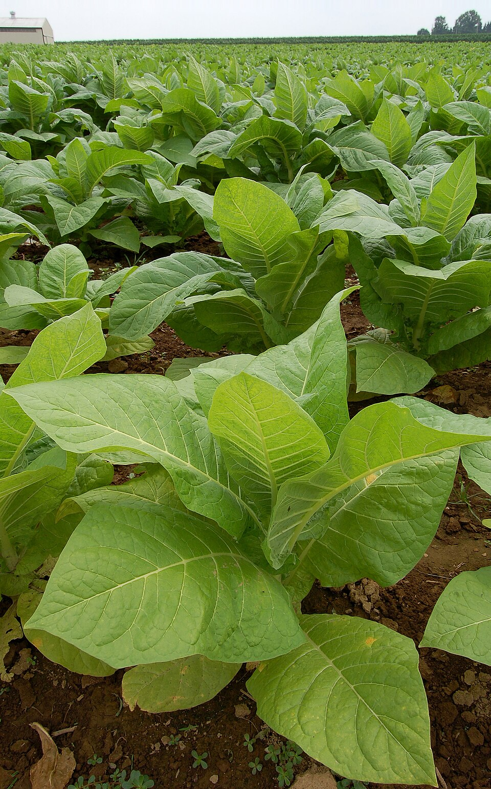

# Tobacco

> **Node ID**: plants.edible-plants.tobacco
> **Domain**: [Plants](./index.md)
> **Dependencies**: See prerequisites
> **Enables**: [`Edible Plants`](edible-plants.md)
> **Timeline**: Years 0-5
> **Outputs**: edible_plant_material
> **Critical**: No

## Overview

> *نبتة تبغ نيكوتيانا*

> *Image: Photo by and (c)2006 Derek Ramsey (Ram-Man), CC BY-SA 4.0*

Tobacco

*Nicotiana tabacum* (Solanaceae) is a beverage & stimulant crop species of major importance for civilization bootstrapping. Tobacco, Cultivated tobacco provides leaves as its primary edible product.

Edible parts: Leaves, Oil Egg OilA protein can be extracted from the leaves. It is an odourless, tasteless white powder and can be added to cereal grains, vegetables, soft drinks and other foods. It can be whipped like egg whites, liquefied or gelled and can take on the flavour and texture of a variety of foods. It is 99.5% protein, contains no salt, fat or cholesterol. It is currently (1991) being tested as a low calorie substitute for mayonnaise and whipped cream.

For civilization bootstrapping, tobacco is significant because of its role as a beverage & stimulant crop. Reliable food production is the foundation upon which all other technological development rests. Understanding the cultivation, processing, and storage of *Nicotiana tabacum* enables communities to establish food security and allocate labor to non-subsistence activities.

*Nicotiana tabacum* is a member of the Solanaceae family. As a beverage & stimulant crop, it provides essential calories, protein, or other nutrients needed to sustain human populations during the bootstrap process. The ability to produce food reliably from cultivated plants is what separates sedentary civilizations from hunter-gatherer societies, because food surplus allows specialization of labor into toolmaking, construction, and eventually metallurgy and beyond.

This species grows as a perennial or annual depending on climate and management. Propagation is primarily by Seed - surface sow in a warm greenhouse about 10 weeks before the last expected spring frosts. The seed usually germinates in 10 - 20 days at 20°c. Keep the soil moist and pot up as soon as the plants are big enough to handle, planting them out after the last expected frosts.. Harvest timing depends on the plant part used: leaves are typically ready at specific growth stages or seasons.

## Prerequisites

### Materials

- Propagation material: Seed - surface sow in a warm greenhouse about 10 weeks before the last expected spring frosts. The seed usually germinates in 10 - 20 days at 20°c. Keep the soil moist and pot up as soon as the plants are big enough to handle, planting them out after the last expected frosts.
- Compost or organic matter for soil amendment
- Mulch material for moisture retention and weed suppression

### Equipment

- Hoe or digging stick for soil preparation and planting
- Sickle, machete, or harvesting knife for crop harvest
- Drying racks or flat drying surfaces for post-harvest processing
- Storage containers: woven baskets, ceramic jars, or sacks for dried product
- Winnowing baskets or screens if processing grains or seeds

### Knowledge

- Species identification: Nicotiana tabacum is a ANNUAL growing to 1.2 m (4ft). See above for USDA hardiness. It is hardy to UK zone 8 and is frost tender. It is in flower from July to September, and the seeds ripen from August to October. The species is hermaphrodite (has both male and female organs) and is pollinated by Be
- Understanding of planting timing relative to local frost dates and rainy seasons
- Knowledge of soil preparation, seed depth, and spacing requirements
- Recognition of common pests and diseases and their early indicators
- Safe preparation methods for any toxic or bitter compounds (see Safety)

### Infrastructure

- Field or garden site with suitable climate, soil type, and sun exposure
- Reliable water access for germination and establishment phase
- Fenced or protected area if animal browsing is a risk
- Storage structure protected from moisture, rodents, and insects

## Process Description

### Cultivation and Propagation

Prefers a well-drained deep rich moist soil in a sunny position. Plants are not very hardy in Britain, but they can be grown as biennials in areas where winter temperatures do not fall below about -5°c. A polymorphic species. Tobacco is very widely cultivated for its leaves, there are many named varieties. As well as being used as an insecticide, the leaves are used to make cigarettes, cigars, snuff and for chewing. There are many long-term health problems associated with these uses, especially from cancer, lung, circulatory and heart diseases. The plant accumulates potassium. The plant has sweetly scented flowers that release most of their scent in the evening and attract moths. Plant requires more than 14 hours daylight per day in order to induce flowering. Propagation: Seed - surface sow in a warm greenhouse about 10 weeks before the last expected spring frosts. The seed usually germinates in 10 - 20 days at 20°c. Keep the soil moist and pot up as soon as the plants are big enough to handle, planting them out after the last expected frosts.

### Harvesting (Priming)

Tobacco leaves do not all mature simultaneously. Harvest by **priming** — removing leaves individually from the bottom of the stalk upward as each tier matures and turns from dark green to lighter green-yellow:

1. **Bottom leaves (lugs)** mature first, 60-70 days after transplanting. These leaves are thinner, lighter in body, and lower in nicotine. Primed first.
2. **Middle leaves (cutters)** mature 7-10 days after the lugs. These are the largest, highest-quality leaves for cigar wrappers and premium cigarette tobacco.
3. **Top leaves (tips)** mature last, 10-14 days after the cutters. Smaller, thicker, and highest in nicotine concentration. Primed last or the entire stalk is cut at ground level and the whole plant hung to cure.

At each priming, remove 2-3 leaves per plant. Handle leaves carefully — bruised leaves cure unevenly and develop dark spots. Carry primed leaves in shallow baskets to the curing facility within 2 hours of harvest to prevent field heat damage.

### Curing Methods

Curing is the controlled drying process that converts raw green tobacco leaves into the aromatic, smokable product. The three traditional methods produce fundamentally different leaf characteristics:

#### Air Curing (4-8 weeks)

Used for burley and cigar filler tobacco. Leaves are hung in well-ventilated barns with open sides:

1. String leaves individually through the stem base onto sticks (laths), spacing leaves 2-3 cm apart to allow air circulation. Hang sticks in tiers in the curing barn.
2. Maintain barn temperature at ambient (15-30°C) with relative humidity 65-75%. The goal is slow, even moisture loss over 4-8 weeks.
3. Leaves progress through color stages: green → yellow → yellow-brown → brown. The final cured leaf is light tan to medium brown, thin, and pliable.
4. Air-cured tobacco has low sugar content (1-5%), moderate nicotine (2-4%), and a mild, smooth flavor. It absorbs flavorings readily, making it the preferred type for flavored cigarette and pipe tobacco blends.

#### Sun Curing (2-3 weeks)

Used for oriental/Turkish tobacco. Leaves are strung on cords and hung in direct sunlight:

1. String leaves on thin cords 3-4 cm apart. Hang cords between posts or on the south-facing wall of a building.
2. Expose to full sun during the day; protect from dew and rain at night by rolling cords under cover or draping with cloth.
3. Sun curing takes 2-3 weeks depending on temperature and humidity. The intense sunlight bleaches the leaves to a bright yellow-gold color.
4. Sun-cured (oriental) tobacco has small leaves (8-15 cm), high sugar content (10-20%), low nicotine (1-2%), and a highly aromatic, spicy flavor. Used as a condiment tobacco in cigarette blends (typically 10-30% of the blend).

#### Flue Curing (5-7 days)

Used for Virginia/brightleaf tobacco. Leaves are cured in enclosed barns with external heat sources (flues):

1. **Day 1 (Yellowing stage, 30-35°C)**: Load leaves into the curing barn, close all ventilation. Maintain 30-35°C with 85-90% relative humidity for 36-48 hours. Leaves turn from green to bright lemon-yellow as chlorophyll breaks down. This is the critical stage — temperature too high causes green-cured leaf (scalding); too low causes house-burn (mold and rot).
2. **Days 2-3 (Fixing stage, 35-45°C)**: Gradually raise temperature to 40-45°C. Open ventilation slightly to begin moisture removal. The yellow color fixes in the leaf. Leaf moisture drops from 80-85% to 30-40%.
3. **Days 4-5 (Drying stage, 50-65°C)**: Raise temperature steadily to 60-65°C with full ventilation. Rapidly drive off remaining moisture. Leaf midribs (stems) are the last to dry. Leaves become crisp and papery.
4. **Day 6-7 (Ordering, 35-40°C)**: Reduce heat and introduce moisture (steam or wet cloth) to bring leaf moisture back to 12-18% for handling. Leaves become pliable but not damp.
5. Flue-cured tobacco has high sugar content (10-25%), moderate nicotine (1.5-3%), and a bright golden-yellow to orange color. It is the primary ingredient in most commercial cigarettes (50-70% of the blend).

### Aging (1-3 years)

After curing, tobacco leaves must be aged to develop smoothness and complexity:

1. Stack cured leaves in hands (bundles of 20-30 leaves tied at the stem) and pack into bales or hogsheads (large wooden barrels). Compress firmly to exclude air.
2. Store at 15-25°C with 60-70% relative humidity for 1-3 years. During aging, enzymatic and chemical reactions mellow harsh flavors, reduce ammonia and other volatile compounds, and develop the characteristic tobacco aroma.
3. Rotate bales periodically for even aging. Inspect for mold every 3-6 months. Properly aged tobacco has a rich, mellow aroma; inadequately aged tobacco is harsh and acrid.

### Nicotine Extraction for Insecticide

Tobacco leaves contain 1-6% nicotine by dry weight, concentrated in the leaf tissue. To produce nicotine sulfate insecticide (effective against aphids, whiteflies, and other soft-bodied insects):

1. Steep 500 g of dried tobacco leaves in 5 liters of water for 24 hours. Strain through cloth. The resulting dark brown liquid contains water-soluble nicotine.
2. Add potash (potassium carbonate) to increase alkalinity, which converts nicotine salts to free nicotine — more toxic to insects. Apply as a spray.
3. **Warning**: Nicotine sulfate is highly toxic to mammals (oral LD50 ~50 mg/kg in rats). Wear gloves, long sleeves, and eye protection when handling. Do not apply to food crops within 7 days of harvest.

### Process Parameters

| Parameter | Range | Notes |
|-----------|-------|-------|
| Nicotine content (dried leaf) | 0.5-8% | Highest in upper (tip) leaves |
| Plants per hectare | 15,000-25,000 | Transplanted seedlings |
| Leaf yield per hectare | 1,500-3,000 kg (dry) | Depends on variety and management |
| Air curing time | 4-8 weeks | Barn-hung, ambient temperature |
| Sun curing time | 2-3 weeks | Direct sunlight exposure |
| Flue curing time | 5-7 days | Heated barn, 30-75°C staged |
| Aging time | 1-3 years | Baled at 60-70% RH |
| Flue cure yellowing temp | 30-35°C | Days 1-2 |
| Flue cure fixing temp | 35-45°C | Days 2-3 |
| Flue cure drying temp | 50-65°C | Days 4-5 |
| Seed oil content | 30-40% | Semi-drying oil |
| Acute nicotine toxicity | ~30-60 mg (adult) | Ingestion; keep from children |

### Distribution and Growing Conditions

S. America. Naturalized in C. and S. Europe. Coming Soon

### Identification

Nicotiana tabacum is a ANNUAL growing to 1.2 m (4ft). See above for USDA hardiness. It is hardy to UK zone 8 and is frost tender. It is in flower from July to September, and the seeds ripen from August to October. The species is hermaphrodite (has both male and female organs) and is pollinated by Bees, Lepidoptera (Moths & Butterflies). It is noted for attracting wildlife. Suitable for: light (sandy), medium (loamy) and heavy (clay) soils and prefers well-drained soil. Suitable pH: mildly acid, neutral and basic (mildly alkaline) soils. It cannot grow in the shade. It prefers moist soil.

### Edible Parts and Preparation

## Quantitative Parameters

### Growing Parameters

| Parameter | Value | Notes |
|-----------|-------|-------|
| Edible parts | Leaves | Primary harvest |

## Processing and Storage

### Non-Food Uses

Insecticide Oil Repellent. All parts of the plant contain nicotine, this has been extracted and used as an insecticide. The dried leaves can also be used, they remain effective for 6 months after drying. The juice of the leaves can be rubbed on the body as an insect repellent. The leaves have been dried and chewed as an intoxicant. The dried leaves are also used as snuff or smoked. This is the main species that is used to make cigarettes and cigars. A drying oil is obtained from the seed. Dynamic accumulator.

### Storage

Harvest at peak maturity and process promptly. Most plant products can be preserved by drying, fermenting, or storing in cool conditions. Test storage readiness by checking for residual moisture — properly dried material should be brittle, not flexible. Label all stored products with harvest date and variety.

### Material Handling

Handle tobacco produce with clean hands and tools to prevent contamination. Remove field heat promptly after harvest by moving product to shade. Process within the recommended timeframe to prevent quality loss. Compost crop residues and processing waste to return organic matter to the soil. Label stored products with harvest date, variety, and any treatments applied.

## Scaling Notes

- **Bench scale**: Individual plants or small garden plot (10-50 plants). Output for direct household consumption. Useful for seed saving, variety selection, and learning the crop's behavior under local conditions.
- **Pilot scale**: Field planting of 0.1 to 1 hectare (500-5,000 plants). Staggered planting or sequential harvests to extend availability. Requires basic hand tools and family-level labor. Surplus can be traded or stored.
- **Production scale**: Multi-hectare cultivation with mechanized planting, harvesting, and processing. Requires plow animals or tractors, grain mills or processing equipment, and bulk storage facilities. Enables community-level food security and trade.

Key scaling challenges include maintaining genetic diversity at plantation scale, managing pest and disease pressure in monoculture, and matching post-harvest processing capacity to harvest volume. Seed saving and variety selection at bench scale directly informs decisions about which cultivars to scale up.

## Troubleshooting

| Problem | Probable Cause | Solution |
|---------|---------------|----------|
| Poor germination | Old seed, wrong soil temperature, planted too deep, or insufficient moisture | Use fresh seed; verify germination temperature range; plant at recommended depth; maintain soil moisture during germination |
| Pest damage | Insect infestation or browsing animals | Hand-pick pests; use companion planting with repellent species; install fencing for larger pests |
| Disease (fungal/bacterial) | Poor air circulation, excessive moisture, infected seed | Space plants adequately; avoid overhead watering; use clean seed from disease-free plants; practice crop rotation |
| Low yield | Nutrient deficiency, water stress, overcrowding, or shade | Amend soil with compost or manure; ensure adequate water at critical growth stages; thin to recommended spacing; plant in full sun |
| Storage losses | Insufficient drying, rodent/insect damage, high humidity | Dry product thoroughly before storage; use sealed containers; inspect stored product regularly; keep storage area clean and dry |

## Safety Considerations

Working with *Nicotiana tabacum* involves the following hazards:

- **⚠ NICOTINE TOXICITY WARNING**: Tobacco leaves contain 0.5-8% nicotine by dry weight depending on variety and leaf position (highest in upper leaves). Nicotine is a potent neurotoxin. **Toxic if ingested in quantity — as little as 30-60 mg of nicotine (equivalent to 2-4 grams of dried tobacco leaf) can cause acute poisoning in adults; 10 mg may be dangerous for children.** Symptoms of nicotine poisoning include nausea, vomiting, dizziness, rapid heart rate, elevated blood pressure, tremors, and in severe cases respiratory failure and death. **Wear gloves during all handling of fresh or cured leaves** — nicotine is absorbed through the skin (transdermally). Wash hands thoroughly after handling. **Keep all tobacco products, leaves, and extracts away from children.** Do not ingest tobacco leaves or preparations. Nicotine sulfate insecticide is especially dangerous — treat with the same caution as any concentrated poison.
- **Toxicity**: Parts of this plant may contain compounds that are toxic when raw or improperly prepared. Always follow proper preparation procedures before consumption. Verify with multiple authoritative sources.
- **Dermatitis risk**: Tobacco plant sap can cause contact dermatitis (green tobacco sickness) during harvesting, especially when leaves are wet with dew or rain. The condition causes nausea, dizziness, and skin rash from nicotine absorption through the skin. Wear long sleeves, gloves, and work in dry conditions when handling live plants.
- Tool injuries during harvest and processing — use sharp tools in good condition and cut away from the body
- Allergic reactions to plant compounds — sensitive individuals should test small quantities first
- Sun exposure and heat stress during field work — schedule heavy work for early morning or late afternoon
- Musculoskeletal strain from repetitive harvesting motions — vary tasks and take regular breaks

### Personal Protective Equipment

- Sturdy gloves when handling plants with irritant sap, spines, or rough surfaces
- Long sleeves and trousers for field work to reduce skin exposure to irritants and insects
- Eye protection when using cutting tools overhead or near face level
- Sun hat and sunscreen for extended field work

### Emergency Procedures

- For suspected plant poisoning: stop eating immediately, save a sample of the plant material, and seek medical attention. Do not induce vomiting unless directed by a medical professional.
- For tool lacerations: apply direct pressure with a clean cloth, elevate the wound, and seek medical attention for cuts deeper than skin level.
- For allergic reaction (swelling, difficulty breathing): discontinue exposure immediately and seek emergency medical help.

## Quality Control

### Acceptance Criteria

- Harvest product shows expected color, texture, size, and flavor for the variety grown
- No visible mold, rot, pest damage, or foreign material in stored product
- Dried products are brittle throughout with no flexible or moist spots
- Seeds intended for storage test at below 14% moisture content

### Testing Methods

- **Visual inspection**: check for discoloration, mold, insect damage, or foreign material
- **Bite test (seeds/grains)**: properly dried seeds crack cleanly; under-dried seeds dent or feel leathery
- **Smell test**: fresh product has characteristic aroma; off-odors indicate spoilage or contamination
- **Snap test (dried products)**: properly dried material snaps rather than bends

### Sampling Protocol

For field-scale production, inspect every 10th plant during harvest for disease and pest damage. Grade each batch by size and quality before storage. Record yield per unit area to track productivity trends across seasons and identify declining performance early.

## Variations and Alternatives

### Medicinal Uses

Antispasmodic Diuretic Emetic Expectorant Homeopathy Irritant Narcotic Sedative Sialagogue. Tobacco has a long history of use by medical herbalists as a relaxant, though since it is a highly additive drug it is seldom employed internally or externally at present. The leaves are antispasmodic, discutient, diuretic, emetic, expectorant, irritant, narcotic, sedative and sialagogue. They are used externally in the treatment of rheumatic swelling, skin diseases and scorpion stings. The plant should be used with great caution, when taken internally it is an addictive narcotic. The active ingredients can also be absorbed through the skin. Wet tobacco leaves can be applied to stings in order to relieve the pain. They are also a certain cure for painful piles. A homeopathic remedy is made from the dried leaves. It is used in the treatment of nausea and travel sickness.

### Other Uses

### Related Species

- [Tea](tea.md)
- [Coffee](coffee.md)
- [Cacao](cacao.md)

### Cultivar Selection

Within *Nicotiana tabacum*, considerable variation exists in yield, disease resistance, climate adaptation, and quality characteristics. When establishing a tobacco crop, select varieties adapted to local conditions: day length, temperature range, rainfall pattern, and soil type. Landrace varieties — locally adapted populations maintained by traditional farmers — often outperform modern cultivars under low-input conditions because they have been selected for resilience rather than maximum yield under optimal conditions.

Seed saving from the best-performing plants each generation gradually adapts the variety to local conditions. Select for vigor, disease resistance, appropriate maturity timing, and product quality. Maintain genetic diversity by saving seed from multiple plants rather than a single individual, which preserves the population's ability to adapt to changing conditions and disease pressures.

### Crop Rotation and Companion Planting

*Nicotiana tabacum* benefits from crop rotation to prevent buildup of species-specific pests and diseases. Avoid planting in the same field in consecutive seasons where possible. Follow with a different crop family to break pest cycles and maintain soil health.

Companion planting with aromatic herbs or flowering plants can deter pests and attract beneficial insects. Avoid planting near species that compete for the same nutrients or harbor shared pathogens.

*Nicotiana tabacum* is a heavy feeder that depletes soil nitrogen and potassium rapidly. Rotate with legumes to restore nitrogen. Tobacco is susceptible to several soil-borne diseases (black root rot, tobacco mosaic virus) that persist in soil for years; avoid replanting tobacco in the same field for at least 3-5 years. The nicotine in tobacco leaves can be extracted and used as an insecticide (nicotine sulfate), providing a secondary use beyond smoking.

## References

- [Edible Plants](edible-plants.md) — parent capability
- [Plants Domain](./index.md) — domain overview and related capabilities
- [Agave](agave.md) — example plant article format
- [Food Processing](../food-processing/index.md) — downstream processing of harvested crops
- [Agriculture](../agriculture/index.md) — cultivation systems and crop rotation
- Family: Solanaceae
- Data sourced from Food Plants International, Wikipedia, and iNaturalist via the Edible Plant Database (ZIM)
- Plants for a Future (pfaf.org) — supplementary cultivation and use data

Tobacco leaves contain 1-6% nicotine by dry weight, concentrated in the leaf tissue. Beyond smoking and chewing tobacco, the plant provides nicotine sulfate insecticide (one of the most potent natural contact insecticides), which is effective against aphids, whiteflies, and other soft-bodied pests. Nicotine sulfate is highly toxic to mammals and must be handled with care. Tobacco seed yields 30-40% semi-drying oil suitable for paint and soap making.
Tobacco cultivation requires significant labor for transplanting, topping (removing flower heads
to redirect growth to leaves), and harvesting. The curing process (air curing, flue curing, or
sun curing) determines the final leaf character. Air-cured burley tobacco takes 4-8 weeks and
produces a mild, low-sugar leaf suitable for cigarette and pipe tobacco production.

---
*Part of the [Bootciv Tech Tree](../index.md) · [Plants](./index.md) · [All Domains](../index.md)*
