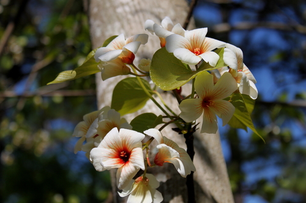

# Tung Tree

> **Node ID**: plants.industrial-oil.tung-tree
> **Domain**: [Plants](./index.md)
> **Dependencies**: See prerequisites
> **Enables**: [`Construction`](../construction/index.md), [`Chemistry`](../chemistry/index.md)
> **Timeline**: Years 3-5
> **Outputs**: tung oil (drying oil for wood finishing, waterproofing)
> **Critical**: No — superior wood finish but linseed oil can substitute

## Overview

> *Tung Oil Tree (Vernicia fordii), Norfolk Botanical Garden*

> *Image: Drew Avery, CC BY 2.0*

The tung tree (*Vernicia fordii*, formerly *Aleurites fordii*) is a deciduous tree native to southern China that produces seeds containing 30-40% tung oil by weight. Tung oil is a drying oil, meaning it polymerizes (hardens) when exposed to air, forming a tough, waterproof, flexible film. It is the premier natural wood finish for furniture, boats, flooring, and any wooden object that needs protection from moisture.

Tung oil dries harder and more water-resistant than linseed oil (the other major drying oil), and it does not darken with age the way linseed oil does. It penetrates deeply into wood grain, providing protection from within rather than forming a surface film. Properly applied tung oil finish can last 5-10 years on exterior wood.

The tree grows 5-10 meters tall with large, lobed leaves and clusters of fruit containing 3-7 seeds each. It is subtropical, tolerating temperatures to -10°C but producing best in warm, humid conditions with 1,000-1,500 mm annual rainfall. Trees begin bearing fruit at 3-5 years of age and reach peak production at 8-15 years.

All parts of the tung tree are toxic if ingested. The seeds contain a toxic protein (tung protein) and phytotoxins. The oil itself is non-toxic after proper processing (heating destroys the toxins), but raw oil and seeds are poisonous. This toxicity limits tung oil to industrial and exterior applications, not food use.

The tree has been cultivated in China for over 2,000 years for its oil. The word "tung" is Chinese for "punish," reflecting the toxic nature of the seeds.

Primary outputs: `tung_oil` for wood finishing, waterproofing, and paint formulation.

## Prerequisites

### Materials

- Tung tree seeds or grafted saplings
- Subtropical site with well-drained soil (pH 5.5-6.5)
- Processing equipment for oil extraction

### Equipment

- Seed cracking tools (hammer, mill, or mechanical cracker)
- Oil press (screw press, wedge press, or stone grinding and boiling)
- Heating vessel for oil purification
- Filter cloth
- Storage containers (sealed, dark)

### Knowledge

- Seed harvest timing and storage
- Oil extraction: pressing vs. solvent extraction
- Oil purification: heating to destroy toxins
- Tung oil application technique for wood finishing

### Infrastructure

- Tung tree plantation (3-5 years to first fruiting)
- Seed processing and oil extraction area
- Oil storage in sealed containers

## Process Description

### Seed Harvest and Oil Extraction

1. Plant grafted saplings or seeds at 6-8 meter spacing. First fruit production at 3-5 years. Peak production at 8-15 years, yielding 2,000-5,000 kg of seeds per hectare.
2. Harvest fruit in autumn (September-November) when it turns from green to brown and begins to split open. Collect fallen fruit or hand-pick from low branches.
3. Remove the outer husk. Crack the hard inner shell to extract the seeds. Each fruit contains 3-7 seeds.
4. Dry seeds in the sun for 3-5 days until moisture content is below 10%.
5. Press dried seeds in a screw press or wedge press. Cold pressing produces the highest quality oil. Yield: 25-35% of seed weight as oil.
6. Heat the pressed oil to 200-250°C for 15-30 minutes to destroy toxic proteins and improve drying properties. The oil darkens slightly but becomes non-toxic and dries faster.
7. Filter through cloth while still warm. Store in sealed containers away from light.

### Wood Finishing with Tung Oil

1. Sand the wood surface smooth (progressive grits to 220 or finer).
2. Apply a thin coat of pure tung oil with a clean cloth or brush, rubbing it into the wood grain.
3. Allow to penetrate for 20-30 minutes, then wipe off all excess with a clean cloth. Leaving excess oil results in a tacky surface that never dries.
4. Allow to dry for 24-48 hours. The oil polymerizes by reacting with oxygen in the air.
5. Lightly sand the surface with fine (320+) sandpaper to smooth raised grain.
6. Apply a second thin coat, wipe off excess, and dry. Repeat for 3-5 coats for maximum protection.
7. Full cure takes 7-14 days. The finished surface is matte to low-gloss, water-resistant, and shows the natural wood grain.

### Process Parameters

| Parameter | Range | Notes |
|-----------|-------|-------|
| Oil content (seed) | 30-40% | By weight |
| Seed yield per hectare per year | 2,000-5,000 kg | From mature trees (8-15 years) |
| Oil yield per hectare per year | 600-1,750 kg | After pressing and purification |
| Oil pressing yield | 25-35% | Of seed weight (cold press) |
| Purification temperature | 200-250°C | Destroys toxins |
| Drying time (thin coat on wood) | 24-48 hours | At 20°C, 50% humidity |
| Full cure time | 7-14 days | Complete polymerization |
| Number of coats for exterior | 3-5 | For durable finish |
| Toxicity of raw oil | High | Causes vomiting, diarrhea if ingested |
| Toxicity of purified oil | Low | Safe for skin contact on finished wood |
| First fruiting age | 3-5 years | From planting |
| Optimal temperature range | 15-30°C | Subtropical |
| Tung oil iodine value | 160-175 | High, indicates excellent drying properties |
| Seed weight | 3-5 g each | Hard-shelled |
| Tung oil polymerization | Oxidative | Crosslinks with atmospheric oxygen |

### Tung Oil Chemistry and Properties

Tung oil is composed primarily of alpha-eleostearic acid (a conjugated fatty acid) comprising 75-85% of the total fatty acids. The conjugated double bond system makes tung oil polymerize faster and harder than other drying oils. Linseed oil, by comparison, contains primarily linolenic acid (non-conjugated), which dries more slowly and produces a softer film.

The polymerization process is an oxidative crosslinking reaction. Atmospheric oxygen reacts with the conjugated double bonds, creating free radicals that link adjacent fatty acid chains into a three-dimensional network. This converts the liquid oil into a solid, rubbery film. The process is exothermic — generating heat — which is why oil-soaked rags can spontaneously combust.

Tung oil's resistance to water, acids, and alkalis exceeds that of linseed oil and most other natural finishes. It was the standard finish for Chinese junk ships, waterproofing the hull planking for decades of service in saltwater. In the West, tung oil replaced linseed oil for marine finishes wherever it was available after trade with China expanded in the 19th century.

### Application Techniques for Different Surfaces

For exterior wood (boat decks, doors, window frames): apply 4-5 thin coats of pure tung oil, allowing 48 hours between coats. Lightly sand with 320-grit between coats. The resulting finish is matte, non-slip, and water-repellent. Reapply annually for exterior wood exposed to weather.

For interior wood (furniture, flooring): dilute the first coat with 1 part citrus solvent or turpentine to 1 part tung oil for better penetration. Follow with 2-3 coats of pure tung oil. The finish brings out the natural grain pattern without forming a plastic-like surface film.

For waterproofing canvas and fabric: dissolve tung oil in turpentine (1:1 ratio) and brush onto canvas tents, sails, or tarps. Multiple coats build up a water-resistant finish that remains flexible. This treatment also increases the fabric's resistance to rot and mildew.

## Safety Considerations

- **Raw tung seeds and oil are toxic if ingested.** Symptoms include severe vomiting, diarrhea, abdominal pain, and in extreme cases, death. Keep all seeds and raw oil away from children and animals.
- Purified (heated) tung oil is safe for external use on wood but should not be ingested.
- Tung oil can cause allergic skin reactions in sensitive individuals. Test on a small area before extended handling.
- Oily rags used for tung oil application can spontaneously combust as the oil polymerizes. Lay rags flat outdoors to dry completely before disposing, or store in a sealed metal container filled with water.
- Heating tung oil produces fumes. Work in a well-ventilated area.
- The oil is slippery on surfaces. Clean spills immediately.

### Personal Protective Equipment

- Nitrile or latex gloves for oil application
- Respiratory protection (ventilation or mask) when heating oil
- Fire-safe disposal for oil-soaked rags

## Quality Control

### Acceptance Criteria

- **Raw tung oil**: Pale yellow to golden, clear, viscous, characteristic nutty odor
- **Purified tung oil**: Darker golden, clear, no sediment, dries to a hard film within 48 hours
- **Finished wood surface**: Uniform sheen, no tacky spots, water beads on surface

### Testing Methods

- Drying test: spread a thin film of oil on glass. It should be tack-free in 24 hours and hard in 48 hours.
- Water test on finished wood: place water droplets on the surface. They should bead up and not soak in after 30 minutes.
- Clarity: purified oil should be clear when held up to light. Cloudiness indicates impurities or moisture.

## Scaling Notes

- **Individual tree**: 10-50 kg of seeds per year. 3-17 kg of oil.
- **Small plantation** (1 hectare): 150-250 trees. Oil yield: 600-1,750 kg per year from mature trees.
- **Bottleneck**: The 3-5 year wait before first fruiting. Once established, trees produce for 30-50 years.

## Troubleshooting

| Problem | Probable Cause | Solution |
|---------|---------------|----------|
| Oil does not dry on wood | Impure oil, too thick a coat, or cold/humid conditions | Use purified oil; apply thin coats; ensure warm, dry conditions |
| Wood surface tacky after drying | Excess oil not wiped off | Wipe all excess oil within 30 minutes of application |
| Oil has strong unpleasant smell | Oil not properly purified or spoiled | Heat oil to 200-250°C; discard if rancid |
| Low oil yield from seeds | Seeds harvested unripe or pressed incorrectly | Harvest fully ripe seeds; ensure seeds are dry before pressing |
| Trees not fruiting | Too young, wrong climate, or only one sex planted | Wait 3-5 years; ensure subtropical conditions; plant multiple trees |

## Variations and Alternatives

- **Linseed oil** (from *Linum usitatissimum*): The other major drying oil. Darkens with age, slightly less water-resistant than tung oil. Widely available in temperate zones. Edible-grade available.
- **Perilla oil** (from *Perilla frutescens*): East Asian drying oil. Similar properties to tung oil. Edible.
- **Walnut oil**: Semi-drying oil, slower to cure than tung oil. Edible. From *Juglans regia*.
- **Synthetic varnishes**: Polyurethane and other synthetic finishes provide superior durability at higher technology levels.
- **Japan wax** (*Toxicodendron vernicifluum*): Japanese lacquer tree. Produces urushiol-based lacquer that cures to an extremely hard, glossy, chemical-resistant finish. The finest natural wood finish, but the sap causes severe dermatitis during application.
- **Copal resin**: Natural tree resin dissolved in alcohol to make spirit varnish. Provides a hard, glossy finish. Used traditionally for map surfaces and fine furniture.

## References

- [Construction](../construction/index.md) — wood finishing for structures
- [Chemistry](../chemistry/index.md) — drying oil chemistry
- [Silver Birch](./betula-pendula.md) — birch bark for comparison waterproofing
- [Plants Domain](./index.md) — domain overview and related capabilities

### Tung Oil vs Linseed Oil Comparison

Tung oil and linseed oil are the two most important natural drying oils. Tung oil dries harder,
faster, and more water-resistant than linseed oil. It does not darken with age (linseed oil
yellows significantly over time) and provides better resistance to acids, alkalis, and mold.
However, tung oil is more expensive (subtropical tree crop vs. temperate annual field crop),
and the seeds are toxic, requiring careful processing.

Linseed oil is the practical choice where tung oil is unavailable. It is produced from flax
seeds (*Linum usitatissimum*), a hardy annual crop that grows in temperate zones worldwide.
Raw linseed oil dries in 3-7 days (vs. 1-2 days for tung oil) but produces an adequate
protective finish when applied in multiple thin coats. Boiled linseed oil (treated with
metallic driers to accelerate drying) cures in 12-24 hours.

For civilization bootstrapping, tung oil is preferred for marine use (boat hulls, deck
sealing) and exterior applications where maximum water resistance is essential. Linseed oil
is preferred for interior woodwork, tool handles, and painted surfaces where lower cost and
easier availability outweigh the performance difference.

Tung oil polymerizes by oxidative crosslinking, generating heat as it cures. This exothermic reaction is strong enough that oil-soaked rags can spontaneously ignite if piled together. This fire hazard is well-known in woodworking shops and requires careful handling of all tung oil waste materials. The same polymerization reaction, properly controlled, produces the hard, waterproof finish that makes tung oil invaluable for protecting wood.

---
*Part of the [Bootciv Tech Tree](../index.md) • [Plants](./index.md) • [All Domains](../index.md)*
