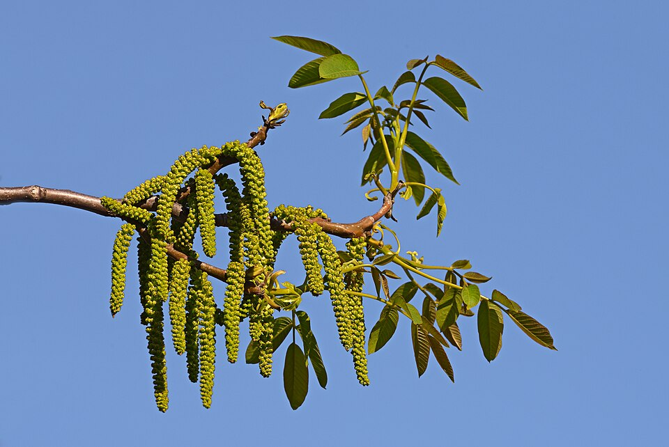

# Walnut

> **Node ID**: plants.edible-plants.walnut
> **Domain**: [Plants](./index.md)
> **Dependencies**: See prerequisites
> **Enables**: [`Edible Plants`](edible-plants.md)
> **Timeline**: Years 0-5
> **Outputs**: edible_plant_material
> **Critical**: No

## Overview

> *Blooming walnut (Juglans regia)*

> *Image: Ввласенко, CC BY-SA 3.0*

Walnut

*Juglans regia* (Juglandaceae) is a fruit & nut tree species of major importance for civilization bootstrapping. Walnut, English walnut, Persian Walnut provides seeds/nuts, bark/sap as its primary edible product.

Edible parts: Oil, Oil, Sap, Seed Tea. Seed - eaten raw or used in confections, cakes, ice cream etc. A delicious flavour. The seed can also be ground into a meal and used as a flavouring in sweet and savoury dishes. The unripe fruits are pickled in vinegar. An edible oil is obtained from the seed, it should not be stored for any length of time since it tends to go rancid quickly. The oil has a pleasant flavour and is used in salads or for cooking. The sap is tapped in spring and used to make a sugar. The finely ground shells are used in the stuffing of 'agnolotti' pasta. They have also been used as adulterant of spices. The dried green husks contain 2.5 - 5% ascorbic acid (vitamin C) - this can be extracted and used as a vitamin supplement. The leaves are used as a tea.

For civilization bootstrapping, walnut is significant because of its role as a fruit & nut tree. Reliable food production is the foundation upon which all other technological development rests. Understanding the cultivation, processing, and storage of *Juglans regia* enables communities to establish food security and allocate labor to non-subsistence activities.

*Juglans regia* is a member of the Juglandaceae family. As a fruit & nut tree, it provides essential calories, protein, or other nutrients needed to sustain human populations during the bootstrap process. The ability to produce food reliably from cultivated plants is what separates sedentary civilizations from hunter-gatherer societies, because food surplus allows specialization of labor into toolmaking, construction, and eventually metallurgy and beyond.

This species grows as a perennial or annual depending on climate and management. Propagation is primarily by The seed is best sown as soon as it is ripe in individual deep pots in a cold frame. You need to protect it from mice, birds, squirrels etc. The seed usually germinates in late winter or the spring. Plant out the seedlings into their permanent positions in early summer and give some protection from the cold for their first winter or two. The seed can also be stored in cool moist conditions (such s the salad compartment of a fridge) over the winter and sown in early spring but it may then require a period of cold stratification before it will germinate. Named varieties are propagated by budding.. Harvest timing depends on the plant part used: seeds/nuts, bark/sap are typically ready at specific growth stages or seasons.

## Prerequisites

### Materials

- Propagation material: The seed is best sown as soon as it is ripe in individual deep pots in a cold frame. You need to protect it from mice, birds, squirrels etc. The seed usually germinates in late winter or the spring. Plant out the seedlings into their permanent positions in early summer and give some protection from the cold for their first winter or two. The seed can also be stored in cool moist conditions (such s the salad compartment of a fridge) over the winter and sown in early spring but it may then require a period of cold stratification before it will germinate. Named varieties are propagated by budding.
- Compost or organic matter for soil amendment
- Mulch material for moisture retention and weed suppression

### Equipment

- Hoe or digging stick for soil preparation and planting
- Sickle, machete, or harvesting knife for crop harvest
- Drying racks or flat drying surfaces for post-harvest processing
- Storage containers: woven baskets, ceramic jars, or sacks for dried product
- Winnowing baskets or screens if processing grains or seeds

### Knowledge

- Species identification: Juglans regia is a deciduous Tree growing to 20 m (65ft) by 20 m (65ft) at a medium rate. See above for USDA hardiness. It is hardy to UK zone 5 and is not frost tender. It is in flower in June, and the seeds ripen in October. The species is monoecious (individual flowers are either male or female, 
- Understanding of planting timing relative to local frost dates and rainy seasons
- Knowledge of soil preparation, seed depth, and spacing requirements
- Recognition of common pests and diseases and their early indicators
- Safe preparation methods for any toxic or bitter compounds (see Safety)

### Infrastructure

- Field or garden site with suitable climate, soil type, and sun exposure
- Reliable water access for germination and establishment phase
- Fenced or protected area if animal browsing is a risk
- Storage structure protected from moisture, rodents, and insects

## Process Description

### Cultivation and Propagation

Requires a deep well-drained loam and a sunny position sheltered from strong winds. Prefers a slightly alkaline heavy loam but succeeds in most soils. The walnut tree is reported to tolerate an annual precipitation of 31 to 147cm, an annual temperature in the range of 7.0 to 21.1°C and a pH in the range of 4.5 to 8.2. The dormant plant is very cold tolerant, tolerating temperatures down to about -27°C without serious damage, but the young spring growth is rather tender and can be damaged by late frosts. Some late-leafing cultivars have been developed, these often avoid damage from spring frosts and can produce a better quality timber tree. The walnut tree is frequently cultivated for its edible seed in temperate zones of the world, there are many named varieties. Newer cultivars begin producing nuts in 5 - 6 years; by 7 - 8 years, they produce about 2.5 tons of nuts per hectare. Orchards on relatively poor, unirrigated mountain soil report 1.5 - 2.25 tonnes per hectare, orchards in well cultivated valleys, 6.5 - 7.5 tonnes per hectare. According to the Wealth of India, a fully grown individual can yield about 185 kg, but 37 kg is more likely. Trees grow well in most areas of Britain but they often fail to fully ripen their fruits or their wood in our cooler and damper climate, they prefer a more continental climate. There are some very fine trees in Cornwall. Walnuts can produce large healthy trees in many parts of Britain, but seedling trees often do not fruit reliably. Some European varieties have been developed that succeed in colder areas. Seedling trees are said to take from 6 to 15 years to come into fruit from seed, but these cultivars usually start cropping within 5 years. Plants produce a deep taproot and they are intolerant of root disturbance. Seedlings should be planted out into their permanent positions as soon as possible and given some protection for their first winter or two since they are somewhat tender when young. Flower initiation depends upon suitable conditions in the previous summer. The flowers and young growths can be destroyed by even short periods down to -2°c, but fortunately plants are usually late coming into leaf. Some cultivars are self-fertile, though it is generally best to grow at least two different cultivars to assist in cross-pollination. Any pruning should only be carried out in late summer to early autumn or when the plant is fully dormant otherwise wounds will bleed profusely and this will severely weaken the tree. Plants produce chemicals which can inhibit the growth of other plants. These chemicals are dissolved out of the leaves when it rains and are washed down to the ground below, reducing the growth of plants under the tree. The roots also produce substances that are toxic to many plant species, especially apples (Malus species), members of the Ericaceae, Potentilla spp and the white pines (certain Pinus spp.). Trees have a dense canopy which tends to reduce plant growth below them. All in all, not the best of companion trees, it is also suggested that the trees do not like growing together in clumps. Trees are said to inhibit the growth of potatoes and tomatoes. Hybridizes with J. nigra. This species is notably susceptible to honey fungus. The bruised leaves have a pleasant sweet though resinous smell. Walnuts are usually harvested in autumn when the husks begin to split and turn brown. Walnuts generally flower in spring producing long catkins for male flowers and clusters for female flowers. Walnuts are moderate to fast-growing trees, typically reaching maturity in about 10 to 15 years, depending on the species and growing conditions. Propagation: The seed is best sown as soon as it is ripe in individual deep pots in a cold frame. You need to protect it from mice, birds, squirrels etc. The seed usually germinates in late winter or the spring. Plant out the seedlings into their permanent positions in early summer and give some protection from the cold for their first winter or two. The seed can also be stored in cool moist conditions (such s the salad compartment of a fridge) over the winter and sown in early spring but it may then require a period of cold stratification before it will germinate. Named varieties are propagated by budding.

### Distribution and Growing Conditions

### Identification

Juglans regia is a deciduous Tree growing to 20 m (65ft) by 20 m (65ft) at a medium rate. See above for USDA hardiness. It is hardy to UK zone 5 and is not frost tender. It is in flower in June, and the seeds ripen in October. The species is monoecious (individual flowers are either male or female, but both sexes can be found on the same plant) and is pollinated by Wind. The plant is self-fertile. It is noted for attracting wildlife. Suitable for: light (sandy), medium (loamy) and heavy (clay) soils and prefers well-drained soil. Suitable pH: mildly acid, neutral and basic (mildly alkaline) soils. It cannot grow in the shade. It prefers moist soil.

### Edible Parts and Preparation

## Quantitative Parameters

### Growing Parameters

| Parameter | Value | Notes |
|-----------|-------|-------|
| Edible parts | Seeds/Nuts, Bark/Sap | Primary harvest |

## Processing and Storage

### Non-Food Uses

Dye Herbicide Miscellany Oil Oil Paint Polish Repellent Tannin Teeth Wood. Juglans species can be used in agroforestry for shade and as a nitrogen-fixing tree. They also provide valuable timber and can enhance biodiversity in mixed plantings. A yellow dye is obtained from the green husks. It is green. The green nuts (is this the same as the green husks?) and the leaves are also used. The rind of unripe fruits is a good source of tannin. A brown dye is obtained from the leaves and mature husks. It does not require a mordant and turns black if prepared in an iron pot. The dye is often used as a colouring and tonic for dark hair. The leaves and the husks can be dried for later use. A golden-brown dye is obtained from the catkins in early summer. It does not require a mordant. A drying oil is obtained from the seed. It is used in soap making, paints, etc. It is not very stable and quickly goes rancid. The nuts can be used as a wood polish. Simply crack open the shell and rub the kernel into the wood to release the oils. Wipe off with a clean cloth. The dried fruit rind is used to paint doors, window frames etc (it probably protects the wood due to its tannin content). The shells may be used as anti-skid agents for tyres, blasting grit, and in the preparation of activated carbon. The leaves contain juglone, this has been shown to have pesticidal and herbicidal properties. The crushed leaves are an insect repellent. Juglone is also secreted from the roots of the tree, it has an inhibitory effect on the growth of many other plants. Bark of the tree and the fruit rind are dried and used as a tooth cleaner. They can also be used fresh. Wood - heavy, hard, durable, close grained, seasons and polishes well. A very valuable timber tree, it is used for furniture making, veneer etc. A dynamic accumulator gathering minerals or nutrients from the soil and storing them in a more bioavailable form - used as fertilizer or to improve mulch.

### Storage

Dry seeds thoroughly to below 14% moisture content before storage. Spread in thin layers on drying racks in full sun, stirring periodically. Test dryness by biting: properly dried seeds crack rather than dent. Store in airtight containers (ceramic jars with tight lids, sealed woven bags) in a cool, dry, dark location. Protect from rodents and insects with tight lids or by mixing with inert ash. Under good conditions, dried grains and legumes store for 1-5 years with minimal loss.

### Material Handling

Handle walnut produce with clean hands and tools to prevent contamination. Remove field heat promptly after harvest by moving product to shade. Process within the recommended timeframe to prevent quality loss. Compost crop residues and processing waste to return organic matter to the soil. Label stored products with harvest date, variety, and any treatments applied.

## Scaling Notes

- **Bench scale**: Individual plants or small garden plot (10-50 plants). Output for direct household consumption. Useful for seed saving, variety selection, and learning the crop's behavior under local conditions.
- **Pilot scale**: Field planting of 0.1 to 1 hectare (500-5,000 plants). Staggered planting or sequential harvests to extend availability. Requires basic hand tools and family-level labor. Surplus can be traded or stored.
- **Production scale**: Multi-hectare cultivation with mechanized planting, harvesting, and processing. Requires plow animals or tractors, grain mills or processing equipment, and bulk storage facilities. Enables community-level food security and trade.

Key scaling challenges include maintaining genetic diversity at plantation scale, managing pest and disease pressure in monoculture, and matching post-harvest processing capacity to harvest volume. Seed saving and variety selection at bench scale directly informs decisions about which cultivars to scale up.

## Troubleshooting

| Problem | Probable Cause | Solution |
|---------|---------------|----------|
| Poor germination | Old seed, wrong soil temperature, planted too deep, or insufficient moisture | Use fresh seed; verify germination temperature range; plant at recommended depth; maintain soil moisture during germination |
| Pest damage | Insect infestation or browsing animals | Hand-pick pests; use companion planting with repellent species; install fencing for larger pests |
| Disease (fungal/bacterial) | Poor air circulation, excessive moisture, infected seed | Space plants adequately; avoid overhead watering; use clean seed from disease-free plants; practice crop rotation |
| Low yield | Nutrient deficiency, water stress, overcrowding, or shade | Amend soil with compost or manure; ensure adequate water at critical growth stages; thin to recommended spacing; plant in full sun |
| Storage losses | Insufficient drying, rodent/insect damage, high humidity | Dry product thoroughly before storage; use sealed containers; inspect stored product regularly; keep storage area clean and dry |

## Safety Considerations

Working with *Juglans regia* involves the following hazards:

- **Toxicity**: Parts of this plant may contain compounds that are toxic when raw or improperly prepared. Always follow proper preparation procedures before consumption. Verify with multiple authoritative sources.
- Tool injuries during harvest and processing — use sharp tools in good condition and cut away from the body
- Allergic reactions to plant compounds — sensitive individuals should test small quantities first
- Sun exposure and heat stress during field work — schedule heavy work for early morning or late afternoon
- Musculoskeletal strain from repetitive harvesting motions — vary tasks and take regular breaks

### Personal Protective Equipment

- Sturdy gloves when handling plants with irritant sap, spines, or rough surfaces
- Long sleeves and trousers for field work to reduce skin exposure to irritants and insects
- Eye protection when using cutting tools overhead or near face level
- Sun hat and sunscreen for extended field work

### Emergency Procedures

- For suspected plant poisoning: stop eating immediately, save a sample of the plant material, and seek medical attention. Do not induce vomiting unless directed by a medical professional.
- For tool lacerations: apply direct pressure with a clean cloth, elevate the wound, and seek medical attention for cuts deeper than skin level.
- For allergic reaction (swelling, difficulty breathing): discontinue exposure immediately and seek emergency medical help.

## Quality Control

### Acceptance Criteria

- Harvest product shows expected color, texture, size, and flavor for the variety grown
- No visible mold, rot, pest damage, or foreign material in stored product
- Dried products are brittle throughout with no flexible or moist spots
- Seeds intended for storage test at below 14% moisture content

### Testing Methods

- **Visual inspection**: check for discoloration, mold, insect damage, or foreign material
- **Bite test (seeds/grains)**: properly dried seeds crack cleanly; under-dried seeds dent or feel leathery
- **Smell test**: fresh product has characteristic aroma; off-odors indicate spoilage or contamination
- **Snap test (dried products)**: properly dried material snaps rather than bends

### Sampling Protocol

For field-scale production, inspect every 10th plant during harvest for disease and pest damage. Grade each batch by size and quality before storage. Record yield per unit area to track productivity trends across seasons and identify declining performance early.

## Variations and Alternatives

### Medicinal Uses

Alterative Anodyne Antiinflammatory Astringent Bach Blood purifier Cancer Depurative Detergent Diuretic Eczema Laxative Lithontripic Miscellany Pectoral Skin Stimulant Urinary Vermifuge Vitamin CThe walnut tree has a long history of medicinal use, being used in folk medicine to treat a wide range of complaints. The leaves are alterative, anthelmintic, anti-inflammatory, astringent and depurative. They are used internally the treatment of constipation, chronic coughs, asthma, diarrhoea, dyspepsia etc. The leaves are also used to treat skin ailments and purify the blood. They are considered to be specific in the treatment of strumous sores. Male inflorescences are made into a broth and used in the treatment of coughs and vertigo. The rind is anodyne and astringent. It is used in the treatment of diarrhoea and anaemia. The seeds are antilithic, diuretic and stimulant. They are used internally in the treatment of low back pain, frequent urination, weakness of both legs, chronic cough, asthma, constipation due to dryness or anaemia and stones in the urinary tract. Externally, they are made into a paste and applied as a poultice to areas of dermatitis and eczema. The oil from the seed is anthelmintic. It is also used in the treatment of menstrual problems and dry skin conditions. The cotyledons are used in the treatment of cancer. Walnut has a long history of folk use in the treatment of cancer, some extracts from the plant have shown anticancer activity. The bark and root bark are anthelmintic, astringent and detergent. The plant is used in Bach flower remedies - the keywords for prescribing it are 'Oversensitive to ideas and influences' and 'The link-breaker'.

### Other Uses

### Related Species

- [Apple](apple.md)
- [Grape](grape.md)
- [Fig](fig.md)
- [Olive](olive.md)
- [Coconut](coconut.md)

### Cultivar Selection

Within *Juglans regia*, considerable variation exists in yield, disease resistance, climate adaptation, and quality characteristics. When establishing a walnut crop, select varieties adapted to local conditions: day length, temperature range, rainfall pattern, and soil type. Landrace varieties — locally adapted populations maintained by traditional farmers — often outperform modern cultivars under low-input conditions because they have been selected for resilience rather than maximum yield under optimal conditions.

Seed saving from the best-performing plants each generation gradually adapts the variety to local conditions. Select for vigor, disease resistance, appropriate maturity timing, and product quality. Maintain genetic diversity by saving seed from multiple plants rather than a single individual, which preserves the population's ability to adapt to changing conditions and disease pressures.

### Crop Rotation and Companion Planting

*Juglans regia* benefits from crop rotation to prevent buildup of species-specific pests and diseases. Avoid planting in the same field in consecutive seasons where possible. Follow with a different crop family to break pest cycles and maintain soil health.

Companion planting with aromatic herbs or flowering plants can deter pests and attract beneficial insects. Avoid planting near species that compete for the same nutrients or harbor shared pathogens.

Walnut trees produce juglone, an allelopathic compound toxic to many plants (especially tomatoes, potatoes, and alfalfa). This limits companion planting options under the canopy. Tolerant understory species include blackberry, currant, and certain grasses. Walnut orchards are long-term plantings (100+ years of productive life). Intercrop with juglone-tolerant species during the 10-15 year establishment period before canopy closure.

## References

- [Edible Plants](edible-plants.md) — parent capability
- [Plants Domain](./index.md) — domain overview and related capabilities
- [Agave](agave.md) — example plant article format
- [Food Processing](../food-processing/index.md) — downstream processing of harvested crops
- [Agriculture](../agriculture/index.md) — cultivation systems and crop rotation
- Family: Juglandaceae
- Data sourced from Food Plants International, Wikipedia, and iNaturalist via the Edible Plant Database (ZIM)
- Plants for a Future (pfaf.org) — supplementary cultivation and use data

Walnut trees produce juglone, a compound that inhibits the growth of many other plant species (allelopathy). This limits companion planting options but reduces weed competition under the tree canopy. Walnut wood is highly valued for furniture and gunstocks due to its rich brown color, dimensional stability, and shock resistance. The green husk surrounding the nut produces a brown-black dye used in textile coloring and wood staining.
Walnut trees begin producing nuts at 4-6 years from grafted stock, reaching full production at
15-20 years. A mature tree yields 20-50 kg of nuts per year, each containing approximately 50%
oil by weight. Walnut oil is valued for woodworking as a finishing oil and for culinary use
as a premium salad and cooking oil with a distinctive nutty flavor.

---
*Part of the [Bootciv Tech Tree](../index.md) · [Plants](./index.md) · [All Domains](../index.md)*
