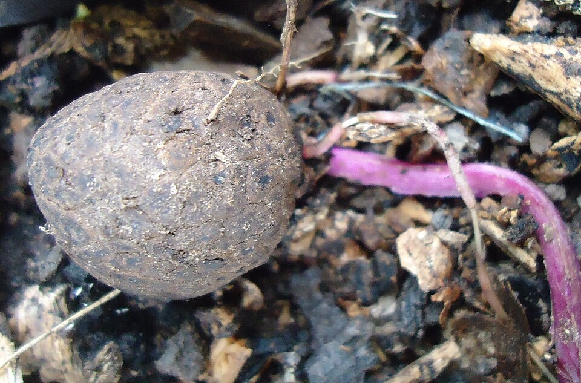

# Water Yam

> **Node ID**: plants.edible-plants.water-yam
> **Domain**: [Plants](./index.md)
> **Dependencies**: See prerequisites
> **Enables**: [`Edible Plants`](edible-plants.md)
> **Timeline**: Years 0-5
> **Outputs**: edible_plant_material
> **Critical**: Yes

## Overview

> *Dioscorea alata (Purple yam) tuber. Mindanao, Philippines. Locally known as ube (pronounced "ooh-beh" or "ooh-bee").*

> *Image: Obsidian Soul, CC BY-SA 3.0*

Water Yam

*Dioscorea alata* (Dioscoreaceae) is a root & tuber crop species of major importance for civilization bootstrapping. Greater yam provides leaves, roots as its primary edible product and ranks 40/100 on the nutrition score.

Dioscorea alata – also called ube, ubi, uwhi, purple yam, or greater yam, among many other names – is a species of yam (a tuber). The tubers are usually a vivid violet-purple to bright lavender (hence the common name), but some range from creamy-white to plain white. It is sometimes confused with taro and the Okinawa sweet potato beniimo (紅芋) (Ipomoea batatas 'Ayamurasaki'), however D. alata is also grown in Okinawa. Its origins are in the Asian and Oceanian tropics. Some varieties attain to great size. A "Mambatap" greater yam grown in Maprik, East Sepik District, Papua New Guinea around 1939 was 3.5 m (11 ft) in length.

Edible parts: Tubers, Root, Vegetable, Bulbils The roots are cooked — usually boiled or baked — and used as a vegetable. Each plant typically produces an average of 3 roots weighing 5–10kg each, though exceptionally they can reach 60kg. The root must be properly cooked as it can be toxic if eaten raw. The plant also produces aerial tubers, which can be eaten in the same way as the main tubers. The purple variety's colour comes from water-soluble anthocyanin pigments, which are used as a food colouring agent.

The time to maturity ranges from 5 months on the coast to 9 or 10 months at higher altitudes. Yams will store well for over 6 months if given a dry, dark, well ventilated shed. Disease - Anthracnose due to the fungus Glomerella cingulata causes early dying off of leaves in many areas and immature death in susceptible varieties under conditions favourable to disease. But anthracnose does not appear to stop yam production in any area. Climatic conditions favouring the disease are hot wet humid conditions and heavy rain. Earlier planting enables plants to be well established at the onset of rains which is the main infection time for the anthracnose fungus. Varieties resistant to anthracnose normally have thicker leaf leaf coatings or cuticles and shorter pores in the stomata or pores in the leaf. The resistant varieties also had higher levels of chemical phenols in the plant. Infected tubers are a main source of the fungus living and transferring between crops.

For civilization bootstrapping, water yam is significant because of its role as a root & tuber crop. Reliable food production is the foundation upon which all other technological development rests. Understanding the cultivation, processing, and storage of *Dioscorea alata* enables communities to establish food security and allocate labor to non-subsistence activities.

*Dioscorea alata* is a member of the Dioscoreaceae family. As a root & tuber crop, it provides essential calories, protein, or other nutrients needed to sustain human populations during the bootstrap process. The ability to produce food reliably from cultivated plants is what separates sedentary civilizations from hunter-gatherer societies, because food surplus allows specialization of labor into toolmaking, construction, and eventually metallurgy and beyond.

This species grows as a perennial or annual depending on climate and management. Propagation is primarily by Seed is rarely produced in cultivation and is not normally used for propagation. Tubers are propagated by cuttings: small tubers are cut into 2–4 sections and larger ones into 6–8 sections, each with 2–3 dormant buds. Cut tubers are often left in the sun for several hours to encourage wound healing and reduce fungal infection risk. Aerial tubers can also be used and typically produce vigorous plants.. Harvest timing depends on the plant part used: leaves, roots are typically ready at specific growth stages or seasons.

## Prerequisites

### Materials

- Propagation material: Seed is rarely produced in cultivation and is not normally used for propagation. Tubers are propagated by cuttings: small tubers are cut into 2–4 sections and larger ones into 6–8 sections, each with 2–3 dormant buds. Cut tubers are often left in the sun for several hours to encourage wound healing and reduce fungal infection risk. Aerial tubers can also be used and typically produce vigorous plants.
- Compost or organic matter for soil amendment
- Mulch material for moisture retention and weed suppression

### Equipment

- Hoe or digging stick for soil preparation and planting
- Sickle, machete, or harvesting knife for crop harvest
- Drying racks or flat drying surfaces for post-harvest processing
- Storage containers: woven baskets, ceramic jars, or sacks for dried product
- Winnowing baskets or screens if processing grains or seeds

### Knowledge

- Species identification: A yam with a long angular vine. It can climb 15 m high. The stems are square and twine to the right around support sticks. The stem does not have spines. It is often coloured green or purple. The leaves are heart shaped and borne in pairs along the vine. The leaves vary is shape, size and colour wit
- Understanding of planting timing relative to local frost dates and rainy seasons
- Knowledge of soil preparation, seed depth, and spacing requirements
- Recognition of common pests and diseases and their early indicators
- Safe preparation methods for any toxic or bitter compounds (see Safety)

### Infrastructure

- Field or garden site with suitable climate, soil type, and sun exposure
- Reliable water access for germination and establishment phase
- Fenced or protected area if animal browsing is a risk
- Storage structure protected from moisture, rodents, and insects

## Process Description

### Cultivation and Propagation

Ceremonial yams have very specialised production techniques. For general food production, use top pieces of the tuber after they have sprouted, use a branched stick for support of the vine, space plants about 1 m apart and choose a smooth round cultivar. Given the large diversity of cultivars of greater yam, for efficient production varieties need to be chosen which have regular rounded tuber shapes for easier harvesting and preparation; also selection needs to be made for varieties with less leaf spot and virus susceptibility and stable yield. Colour, cooking quality, storage ability, texture and other qualities need to be considered to suit the growers demands. In most places the yam growth and maturation is integrated with seasonal rainfall patterns. They are mostly planted just before the first rains where a 8-10 month rainy season exists and give better yields in 6-8 month rainy season areas when planted 3 months before the rains. Earlier planting requires larger sett size to withstand desiccation. Pre germination of tubers which are cut and stored in shady places gives improved yields over tubers left whole then cut into setts at planting. Because yam tubers have a period of dormancy, tubers do not normally commence re-growth for up to 5-6 months. This enhances their storability but delays out of season replanting. Dormancy can be broken using Calcium carbide treatment for 5 hours or by covering tubers with leaves of Croton aromaticus or Averrhoea bilimbi.. Yams are demanding in their nutrient requirements are are therefore often planted first in rotations. They need a fertile free draining soil. They cannot tolerate water logging. It is normally grown from sections of the tubers especially top pieces. In some cultivars, it is also propagated by bulbils. Using staggered plantings of male and female plants and doing hand pollination it is possible to get viable seed set which can be used for establishing plants. It is common practice in many areas to plant the yam piece upside down. The probable reason for this is to give the shoot and roots time to develop and get established away from the sun and wind, so that the plant does not dry out. People in yam areas have their varieties classified as to whether they are planted at the top or the bottom of the hole, and whether the shoot is pointed up or downwards. This is a response to the diversity of tuber shapes and cultivars. A planting depth of 15 cm is optimum. Normally top pieces give higher yields than middle pieces of tubers and these are better than bottom pieces. Varietal differences in this occur. Top pieces give earlier and more reliable germination and mature earlier. They are also the less attractive part of the tuber for eating so are preferred for planting. The larger the sett the earlier the germination and the greater the yield. Increasing the seeding rate and plant density gives greater total yield but the extra planting material required means yield of food available is less. Normally on lighter soils closer spacing is used. Compact soil or hard pans or stones result in tubers being exposed which decreases the yield and needs to be avoided This is related to light as well as physical constraints. Good drainage is essential. Yams must have a well drained soil with plenty of air in the soil. So yams will not normally grow on heavy clay soils or in areas with a lot of soil moisture. The soil can be improved for yam growing by putting leaves and other plant material in the planting hole, by making a mound above the hole, or by planting on a hillside. In some very loose sandy soils yams can just be planted in flat unmounded soils without digging a special yam hole but these situations are not common. Yams should also have sticks to climb up. It is best to have a stick that is twisted or branched because the vine can slip down a very straight stick. Normally a stick 2 metres tall is sufficient. It needs to be a strong stick, firmly fixed in the ground. Yam varieties vary on the type of vine growth they have. This affects where the stick needs to be placed. The fat irregular yams can have the sticks near the mound as a thick clump of vines and leaves soon develops. But if the stick is put beside the mound of one of the long ceremonial yams the vine will often reach the top of the stick before it has produced more than a couple of leaves, and will then fall back down to produce its leaves on the ground. The stick often needs to be put at some distance from the yam hole. The tip can be picked off the vine if branching is wanted earlier. It may be that the long vine yams are more common in forest areas and the shorter branched vines in grassland areas. In some areas yam vines are allowed to creep over the ground and do not have sticks to climb. This method only works satisfactorily in dry places because diseases of the leaves and vine can cause serious damage in wetter places. Where yams do not have sticks to climb plants need to be more widely spaced. Under most circumstances the amount of food produced can be doubled by allowing yam vines to climb up sticks. In drier grassland areas mulching the mounds at planting has been found to improve establishment and yield. Propagation: Seed is rarely produced in cultivation and is not normally used for propagation. Tubers are propagated by cuttings: small tubers are cut into 2–4 sections and larger ones into 6–8 sections, each with 2–3 dormant buds. Cut tubers are often left in the sun for several hours to encourage wound healing and reduce fungal infection risk. Aerial tubers can also be used and typically produce vigorous plants.

### Distribution and Growing Conditions

### Identification

A yam with a long angular vine. It can climb 15 m high. The stems are square and twine to the right around support sticks. The stem does not have spines. It is often coloured green or purple. The leaves are heart shaped and borne in pairs along the vine. The leaves vary is shape, size and colour with different varieties. Leaves can be 10-30 cm long by 5-20 cm wide. The leaf stalk is 6-12 cm long. The flowers occur in the axils of the upper leaves. The male flowers are in small heads along branched stalks. These can be 25 cm long and green. The female flowers are in shorter spikes. Many cultivated varieties do not produce fertile seed. The fruit are 3-winged and 2.5 cm long by 3.5 cm wide. The seeds when they occur have wings right around them. One large but often irregular shaped tuber occurs under the ground. A very large number of different varieties occur. The tubers can vary in shape, size, colour, texture and other ways. Some varieties produce bulbils along the vine. Plants can vary in number of chromosomes.

### Edible Parts and Preparation

## Quantitative Parameters

### Nutritional Composition (per 100g)

| Part | Moisture | kJ | kcal | Protein | Vit A | Vit C | Iron | Zinc |
| --- | --- | --- | --- | --- | --- | --- | --- | --- |
| Tuber | 76.6 | 323 | 77 | 2 | 18 | 10 | 0.8 | 0.39 |

### Growing Parameters

| Parameter | Value | Notes |
|-----------|-------|-------|
| Annual rainfall | 1,150 mm | Growing requirement |
| Germination temperature | 30°C | Optimal |
| Hardiness zones | 10-12 | USDA |
| Edible parts | Leaves, Roots | Primary harvest |

## Processing and Storage

### Non-Food Uses

Used as fodder. Grown as an ornamental and as an agroforestry plant. The purple variety's anthocyanin pigments are used as a food colouring agent.

### Storage

Fresh roots and tubers can be stored in cool, dark, well-ventilated conditions. Root cellars or pits lined with straw maintain appropriate temperature and humidity. Avoid washing before storage — soil protects the skin. Check stored roots weekly and remove any showing rot to prevent spread. For longer storage, slice and sun-dry, or process into flour. Some tropical tubers store for weeks at ambient temperature; others require processing within days of harvest.

### Material Handling

Handle water yam produce with clean hands and tools to prevent contamination. Remove field heat promptly after harvest by moving product to shade. Process within the recommended timeframe to prevent quality loss. Compost crop residues and processing waste to return organic matter to the soil. Label stored products with harvest date, variety, and any treatments applied.

## Scaling Notes

- **Bench scale**: Individual plants or small garden plot (10-50 plants). Output for direct household consumption. Useful for seed saving, variety selection, and learning the crop's behavior under local conditions.
- **Pilot scale**: Field planting of 0.1 to 1 hectare (500-5,000 plants). Staggered planting or sequential harvests to extend availability. Requires basic hand tools and family-level labor. Surplus can be traded or stored.
- **Production scale**: Multi-hectare cultivation with mechanized planting, harvesting, and processing. Requires plow animals or tractors, grain mills or processing equipment, and bulk storage facilities. Enables community-level food security and trade.
  Reported production data: The time to maturity ranges from 5 months on the coast to 9 or 10 months at higher altitudes. Yams will store well for over 6 months if given a dry, dark, well ventilated shed. Disease - Anthracnose d

Key scaling challenges include maintaining genetic diversity at plantation scale, managing pest and disease pressure in monoculture, and matching post-harvest processing capacity to harvest volume. Seed saving and variety selection at bench scale directly informs decisions about which cultivars to scale up.

## Troubleshooting

| Problem | Probable Cause | Solution |
|---------|---------------|----------|
| Poor germination | Old seed, wrong soil temperature, planted too deep, or insufficient moisture | Use fresh seed; verify germination temperature range; plant at recommended depth; maintain soil moisture during germination |
| Pest damage | Insect infestation or browsing animals | Hand-pick pests; use companion planting with repellent species; install fencing for larger pests |
| Disease (fungal/bacterial) | Poor air circulation, excessive moisture, infected seed | Space plants adequately; avoid overhead watering; use clean seed from disease-free plants; practice crop rotation |
| Low yield | Nutrient deficiency, water stress, overcrowding, or shade | Amend soil with compost or manure; ensure adequate water at critical growth stages; thin to recommended spacing; plant in full sun |
| Storage losses | Insufficient drying, rodent/insect damage, high humidity | Dry product thoroughly before storage; use sealed containers; inspect stored product regularly; keep storage area clean and dry |
| Quality or safety note | See species-specific notes | There are about 650 species of Dioscorea. Demo |

## Safety Considerations

Working with *Dioscorea alata* involves the following hazards:

- **Toxicity**: Parts of this plant may contain compounds that are toxic when raw or improperly prepared. Always follow proper preparation procedures before consumption. Verify with multiple authoritative sources.
- Tool injuries during harvest and processing — use sharp tools in good condition and cut away from the body
- Allergic reactions to plant compounds — sensitive individuals should test small quantities first
- Sun exposure and heat stress during field work — schedule heavy work for early morning or late afternoon
- Musculoskeletal strain from repetitive harvesting motions — vary tasks and take regular breaks

### Personal Protective Equipment

- Sturdy gloves when handling plants with irritant sap, spines, or rough surfaces
- Long sleeves and trousers for field work to reduce skin exposure to irritants and insects
- Eye protection when using cutting tools overhead or near face level
- Sun hat and sunscreen for extended field work

### Emergency Procedures

- For suspected plant poisoning: stop eating immediately, save a sample of the plant material, and seek medical attention. Do not induce vomiting unless directed by a medical professional.
- For tool lacerations: apply direct pressure with a clean cloth, elevate the wound, and seek medical attention for cuts deeper than skin level.
- For allergic reaction (swelling, difficulty breathing): discontinue exposure immediately and seek emergency medical help.

## Quality Control

### Acceptance Criteria

- Harvest product shows expected color, texture, size, and flavor for the variety grown
- No visible mold, rot, pest damage, or foreign material in stored product
- Dried products are brittle throughout with no flexible or moist spots
- Seeds intended for storage test at below 14% moisture content

### Testing Methods

- **Visual inspection**: check for discoloration, mold, insect damage, or foreign material
- **Bite test (seeds/grains)**: properly dried seeds crack cleanly; under-dried seeds dent or feel leathery
- **Smell test**: fresh product has characteristic aroma; off-odors indicate spoilage or contamination
- **Snap test (dried products)**: properly dried material snaps rather than bends

### Sampling Protocol

For field-scale production, inspect every 10th plant during harvest for disease and pest damage. Grade each batch by size and quality before storage. Record yield per unit area to track productivity trends across seasons and identify declining performance early.

## Variations and Alternatives

### Medicinal Uses

The tuber is grated, mixed with brown stout vinegar, spread onto paper, and placed on the small of a woman's back to prevent or forestall a threatened miscarriage. Although used in folk medicine and available as a dietary supplement, there is no clinical evidence that this species has any therapeutic properties. Supplements may have adverse effects in people taking oestrogens or anticoagulant drugs, or during pregnancy and breastfeeding. The plant has relatively high oxalate levels of 486–781mg per 100g dry matter.

### Other Uses

### Additional Information

It is a commercially cultivated vegetable. In Papua New Guinea it is a very important ceremonial crop in some areas and a staple food in many seasonally dry areas. It is the staple food for millions of people globally. It is sold in local markets.

### Notes

There are about 650 species of Dioscorea. Demo

### Related Species

- [Taro](taro.md)
- [Cocoyam](cocoyam.md)
- [Lesser Yam](lesser-yam.md)
- [Beet](beet.md)
- [Jerusalem Artichoke](jerusalem-artichoke.md)

### Cultivar Selection

Within *Dioscorea alata*, considerable variation exists in yield, disease resistance, climate adaptation, and quality characteristics. When establishing a water yam crop, select varieties adapted to local conditions: day length, temperature range, rainfall pattern, and soil type. Landrace varieties — locally adapted populations maintained by traditional farmers — often outperform modern cultivars under low-input conditions because they have been selected for resilience rather than maximum yield under optimal conditions.

Seed saving from the best-performing plants each generation gradually adapts the variety to local conditions. Select for vigor, disease resistance, appropriate maturity timing, and product quality. Maintain genetic diversity by saving seed from multiple plants rather than a single individual, which preserves the population's ability to adapt to changing conditions and disease pressures.

### Crop Rotation and Companion Planting

*Dioscorea alata* benefits from crop rotation to prevent buildup of species-specific pests and diseases. Avoid planting in the same field in consecutive seasons where possible. Follow with a different crop family to break pest cycles and maintain soil health.

Companion planting with aromatic herbs or flowering plants can deter pests and attract beneficial insects. Avoid planting near species that compete for the same nutrients or harbor shared pathogens.

## References

- [Edible Plants](edible-plants.md) — parent capability
- [Plants Domain](./index.md) — domain overview and related capabilities
- [Agave](agave.md) — example plant article format
- [Food Processing](../food-processing/index.md) — downstream processing of harvested crops
- [Agriculture](../agriculture/index.md) — cultivation systems and crop rotation
- Family: Dioscoreaceae
- Distribution: United Arab Emirates, Afghanistan, Antigua &amp; Barbuda, Armenia, Angola, Argentina, American Samoa, Australia, Azerbaijan, Barbados, Bangladesh, Burkina Faso, Bahrain, Burundi, Benin, Brunei, Bolivia, Brazil, Bahamas, Bhutan and 138 more
- Data sourced from Food Plants International, Wikipedia, and iNaturalist via the Edible Plant Database (ZIM)
- Plants for a Future (pfaf.org) — supplementary cultivation and use data

---
*Part of the [Bootciv Tech Tree](../index.md) · [Plants](./index.md) · [All Domains](../index.md)*
